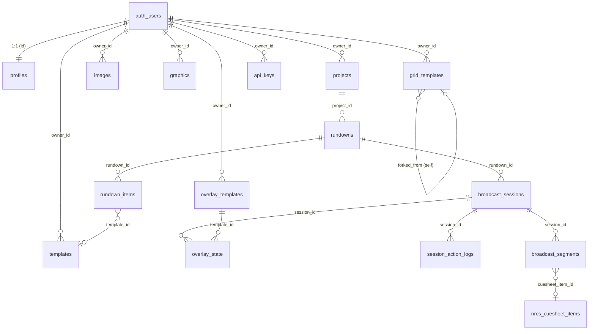

# WebCG-K 데이터베이스 설계 문서

> 전체 테이블 구조, 관계, RLS 정책, 마이그레이션 히스토리

---

## 목차

1. [ERD (관계도)](#erd-관계도)
2. [테이블 상세](#테이블-상세)
3. [RLS 정책 요약](#rls-정책-요약)
4. [마이그레이션 히스토리](#마이그레이션-히스토리)

---

## ERD (관계도)



### 핵심 관계 요약

```
auth.users (Supabase 내장)
  └── profiles (1:1, 확장 프로필)
  └── projects (1:N, 프로젝트)
       └── rundowns (1:N, 큐시트)
            ├── rundown_items (1:N, 큐시트 아이템)
            └── broadcast_sessions (1:N, 송출 세션)
                 ├── broadcast_segments (1:N, 뉴스 아이템별 세그먼트 그룹)
                 ├── overlay_state (1:N, 오버레이 상태)
                 └── session_action_logs (1:N, 액션 로그)
```

---

## 테이블 상세

### 1. `profiles` — 사용자 프로필

> **마이그레이션**: `202602040001_profiles.sql`

| 컬럼 | 타입 | 설명 |
|---|---|---|
| `id` | UUID (PK, FK→auth.users) | 사용자 ID (auth.users와 1:1) |
| `display_name` | TEXT | 표시 이름 |
| `avatar_url` | TEXT | 아바타 이미지 URL |
| `is_admin` | BOOLEAN | 관리자 여부 (기본 false) |
| `last_login_at` | TIMESTAMPTZ | 마지막 로그인 시각 |
| `created_at` | TIMESTAMPTZ | 생성 시각 |
| `updated_at` | TIMESTAMPTZ | 수정 시각 |

**특징**: 회원가입 시 `handle_new_user()` 트리거 함수가 자동으로 행을 생성합니다.

---

### 2. `projects` — 프로젝트

> **마이그레이션**: `202602040002_projects.sql`, `202602040007_rundowns.sql` (settings, active_rundown_id 추가)

| 컬럼 | 타입 | 설명 |
|---|---|---|
| `id` | UUID (PK) | 프로젝트 ID |
| `owner_id` | UUID (FK→auth.users) | 소유자 |
| `name` | TEXT | 프로젝트 이름 |
| `description` | TEXT | 설명 |
| `is_broadcasting` | BOOLEAN | 송출 중 여부 |
| `timeline_data` | JSONB | 타임라인 데이터 |
| `settings` | JSONB | 프로젝트 설정 |
| `active_rundown_id` | UUID | 현재 활성 큐시트 ID |
| `created_at` / `updated_at` | TIMESTAMPTZ | 시각 |

---

### 3. `images` — 이미지 에셋

> **마이그레이션**: `202602040003_images.sql`, `202602060003_images_multi_resolution.sql`, `202602060004_images_public_access.sql`

| 컬럼 | 타입 | 설명 |
|---|---|---|
| `id` | UUID (PK) | 이미지 ID |
| `owner_id` | UUID (FK→auth.users) | 소유자 |
| `name` | TEXT | 이미지 이름 |
| `description` | TEXT | 설명 |
| `category` | TEXT | 카테고리 |
| `keywords` | TEXT[] | 키워드 배열 |
| `storage_path` | TEXT | Storage 원본 경로 |
| `storage_path_2k` | TEXT | 2K 해상도 경로 |
| `storage_path_4k` | TEXT | 4K 해상도 경로 |
| `file_size` | INTEGER | 파일 크기 (bytes) |
| `mime_type` | TEXT | MIME 타입 |
| `is_public` | BOOLEAN | 공개 여부 (기본 true) |
| `created_at` / `updated_at` | TIMESTAMPTZ | 시각 |

**특징**: 다중 해상도(2K/4K) 지원. Storage의 `images` 버킷과 연결.

---

### 4. `graphics` — 그래픽 에셋

> **마이그레이션**: `202602040004_graphics.sql`, `202602050001_graphics_is_public.sql`

| 컬럼 | 타입 | 설명 |
|---|---|---|
| `id` | UUID (PK) | 그래픽 ID |
| `owner_id` | UUID (FK→auth.users) | 소유자 |
| `name` | TEXT | 그래픽 이름 |
| `description` | TEXT | 설명 |
| `template_data` | JSONB | 그래픽 요소 데이터 (캔버스, 도형, 텍스트 등) |
| `thumbnail_path` | TEXT | 썸네일 경로 |
| `is_public` | BOOLEAN | 공개 여부 (기본 false) |
| `created_at` / `updated_at` | TIMESTAMPTZ | 시각 |

**`template_data` 구조 예시**:
```json
{
  "width": 1920,
  "height": 1080,
  "elements": [
    { "type": "rect", "x": 0, "y": 0, "width": 400, "height": 100, "fill": "#000" },
    { "type": "text", "x": 50, "y": 50, "content": "제목", "fontSize": 32 }
  ]
}
```

---

### 5. `templates` — 타임라인 프리셋

> **마이그레이션**: `202602040005_templates.sql`

| 컬럼 | 타입 | 설명 |
|---|---|---|
| `id` | UUID (PK) | 템플릿 ID |
| `owner_id` | UUID (FK→auth.users, SET NULL) | 소유자 |
| `name` | TEXT | 템플릿 이름 |
| `description` | TEXT | 설명 |
| `is_public` | BOOLEAN | 공개 여부 |
| `timeline_preset` | JSONB | 타임라인 프리셋 데이터 |
| `thumbnail_path` | TEXT | 썸네일 경로 |
| `created_at` / `updated_at` | TIMESTAMPTZ | 시각 |

---

### 6. `grid_templates` — 그리드 레이아웃 템플릿

> **마이그레이션**: `202602041249_grid_templates.sql`, `202602041614_grid_templates_fork.sql`

| 컬럼 | 타입 | 설명 |
|---|---|---|
| `id` | UUID (PK) | 그리드 템플릿 ID |
| `owner_id` | UUID (FK→auth.users) | 소유자 |
| `name` | TEXT | 템플릿 이름 |
| `description` | TEXT | 설명 |
| `template_data` | JSONB | BSP(Binary Space Partitioning) 그리드 데이터 |
| `thumbnail_path` | TEXT | 썸네일 경로 |
| `is_public` | BOOLEAN | 공개 여부 |
| `forked_from` | UUID (FK→grid_templates, self-ref) | Fork 원본 ID |
| `created_at` / `updated_at` | TIMESTAMPTZ | 시각 |

**특징**: 자기 참조 FK (`forked_from`)로 Fork 계보를 추적합니다.

---

### 7. `rundowns` — 큐시트

> **마이그레이션**: `202602040007_rundowns.sql`, `202602050002_rundowns_is_public.sql`, `202602080001_rundowns_delete_policy_fix.sql`

| 컬럼 | 타입 | 설명 |
|---|---|---|
| `id` | UUID (PK) | 큐시트 ID |
| `project_id` | UUID (FK→projects, CASCADE) | 소속 프로젝트 |
| `title` | TEXT | 큐시트 제목 |
| `description` | TEXT | 설명 |
| `is_public` | BOOLEAN | 공개 여부 |
| `created_by` | UUID (FK→auth.users, SET NULL) | 생성자 |
| `created_at` / `updated_at` | TIMESTAMPTZ | 시각 |

---

### 8. `rundown_items` — 큐시트 아이템

> **마이그레이션**: `202602040007_rundowns.sql`, `202602040008_rundown_items_fkey.sql`, `202602050003_rundown_items_source.sql`

| 컬럼 | 타입 | 설명 |
|---|---|---|
| `id` | UUID (PK) | 아이템 ID |
| `rundown_id` | UUID (FK→rundowns, CASCADE) | 소속 큐시트 |
| `template_id` | UUID (FK→templates, SET NULL) | 레거시 템플릿 참조 |
| `source_type` | TEXT | 소스 타입 (`image` / `graphic` / `template`) |
| `source_id` | UUID | 소스 에셋 ID |
| `source_name` | TEXT | 표시 이름 |
| `thumbnail` | TEXT | 썸네일 경로 |
| `data` | JSONB | 아이템 데이터 |
| `item_order` | INTEGER | 정렬 순서 |
| `duration` | INTEGER | 지속 시간 (초, 기본 5) |
| `created_at` / `updated_at` | TIMESTAMPTZ | 시각 |

---

### 9. `broadcast_sessions` — 송출 세션

> **마이그레이션**: `202602060001_broadcast_sessions.sql`

| 컬럼 | 타입 | 설명 |
|---|---|---|
| `id` | UUID (PK) | 세션 ID |
| `title` | TEXT | 세션 제목 |
| `description` | TEXT | 설명 |
| `rundown_id` | UUID (FK→rundowns, CASCADE) | 원본 큐시트 |
| `created_by` | UUID (FK→auth.users) | 생성자 |
| `status` | TEXT | 상태: `draft` / `ready` / `live` / `ended` / `completed` |
| `timeline_data` | JSONB | 타임라인 배치 데이터 (아이템별 위치, 트랙 등) |
| `created_at` / `updated_at` | TIMESTAMPTZ | 시각 (updated_at은 트리거로 자동 갱신) |

**상태 전이**:
```
draft → ready → live → ended
                  ↑       │
                  └───────┘  (초기화 시)
```

**트리거**: `trigger_broadcast_sessions_updated_at` — UPDATE 시 `updated_at` 자동 갱신.

---

### 9.5. `broadcast_segments` — 세그먼트 (뉴스 아이템별 CG 그룹)

> **마이그레이션**: `202604160001_broadcast_segments.sql`
> **추가일**: 2026-04-16 (안 D: Nested Sequence Tab)

| 컬럼 | 타입 | 설명 |
|---|---|---|
| `id` | UUID (PK) | 세그먼트 ID |
| `session_id` | UUID (FK→broadcast_sessions, CASCADE) | 소속 세션 |
| `cuesheet_item_id` | UUID (FK→nrcs_cuesheet_items, SET NULL) | NRCS 큐시트 아이템 연결 |
| `label` | TEXT | 세그먼트 제목 (뉴스 아이템명) |
| `reporter` | TEXT | 기자명 |
| `slug` | TEXT | 아이템 슬러그 (예: `PKG-추경안`) |
| `segment_order` | INT | 세그먼트 순서 (NRCS item_order 동기) |
| `color` | TEXT | 시각적 구분색 (8색 팔레트 순환) |
| `status` | TEXT | `idle` / `active` / `done` |
| `created_at` / `updated_at` | TIMESTAMPTZ | 시각 |

**Why 별도 테이블?**
- `broadcast_sessions.timeline_data` JSON 내장 대신 별도 테이블을 채택한 이유:
  - `nrcs_cuesheet_items`에 대한 **FK 무결성** 보장
  - 행 단위 **Realtime 구독** 가능 (세그먼트 순서 변경 즉시 감지)
  - 멀티 사용자 환경에서 **행 단위 잠금** 가능 (JSON 전체 교체 방지)

**인덱스**: `(session_id, segment_order)` — 세션별 순서 정렬 빠른 조회.
**RLS**: `broadcast_sessions`와 동일 (인증된 사용자 전체 접근).

### 10. `overlay_templates` — 오버레이 템플릿 (NodeCG 스타일)

> **마이그레이션**: `202602070001_overlay_templates.sql`

| 컬럼 | 타입 | 설명 |
|---|---|---|
| `id` | UUID (PK) | 오버레이 ID |
| `owner_id` | UUID (FK→auth.users, SET NULL) | 소유자 |
| `name` | TEXT | 오버레이 이름 |
| `description` | TEXT | 설명 |
| `layer` | INT | 레이어 순서 (기본 2) |
| `graphic_data` | JSONB | 그래픽 요소 배열 |
| `data_source` | JSONB | 외부 데이터 바인딩 설정 |
| `refresh_interval` | INT | 데이터 갱신 주기 (초) |
| `animation_config` | JSONB | 애니메이션 설정 (in/out) |
| `is_public` | BOOLEAN | 공개 여부 |
| `created_at` / `updated_at` | TIMESTAMPTZ | 시각 |

**`animation_config` 기본값**:
```json
{
  "in": { "type": "fade", "duration": 500 },
  "out": { "type": "fade", "duration": 300 }
}
```

---

### 11. `overlay_state` — 오버레이 실시간 상태

> **마이그레이션**: `202602070002_overlay_state.sql`

| 컬럼 | 타입 | 설명 |
|---|---|---|
| `id` | UUID (PK) | 상태 ID |
| `session_id` | UUID (FK→broadcast_sessions, CASCADE) | 세션 |
| `template_id` | UUID (FK→overlay_templates, CASCADE) | 오버레이 템플릿 |
| `is_active` | BOOLEAN | 활성화 여부 |
| `current_data` | JSONB | 현재 바인딩 데이터 |
| `animation_state` | TEXT | `idle` / `in` / `loop` / `out` |
| `conflict_mode` | TEXT | `overlay` / `hide_block` / `none` |
| `updated_at` | TIMESTAMPTZ | 시각 |

**유니크 제약**: `UNIQUE(session_id, template_id)` — 세션당 오버레이 템플릿 하나.

**Realtime**: `ALTER PUBLICATION supabase_realtime ADD TABLE overlay_state;` — DB 변경 시 실시간 전파 활성화.

---

### 12. `session_action_logs` — 세션 액션 로그

> **마이그레이션**: `202602070004_session_action_logs.sql`

| 컬럼 | 타입 | 설명 |
|---|---|---|
| `id` | UUID (PK) | 로그 ID |
| `session_id` | UUID (FK→broadcast_sessions, CASCADE) | 세션 |
| `user_id` | UUID (FK→auth.users, SET NULL) | 액션 수행 사용자 |
| `action_type` | TEXT | 액션 타입 |
| `action_detail` | JSONB | 액션 상세 데이터 |
| `created_at` | TIMESTAMPTZ | 시각 |

**`action_type` 값**:
- `broadcast_start` — 송출 시작
- `broadcast_stop` — 송출 중단
- `pgm_on` — PGM 송출
- `pgm_off` — PGM 해제
- `overlay_on` — 오버레이 활성화
- `overlay_off` — 오버레이 비활성화
- `overlay_update` — 오버레이 데이터 변경

**인덱스**: `(session_id, created_at DESC)` — 세션별 최신 로그 빠른 조회.

---

### 13. `api_keys` — 외부 API 키

> **마이그레이션**: `202602070003_api_keys.sql`

| 컬럼 | 타입 | 설명 |
|---|---|---|
| `id` | UUID (PK) | 키 ID |
| `owner_id` | UUID (FK→auth.users, CASCADE) | 소유자 |
| `name` | TEXT | 키 이름 |
| `service` | TEXT | 서비스명 |
| `encrypted_key` | TEXT | 암호화된 API 키 |
| `created_at` | TIMESTAMPTZ | 생성 시각 |

---

## RLS 정책 요약

### 정책 패턴별 분류

| 패턴 | 적용 테이블 |
|---|---|
| **소유자 전용** | `profiles`, `projects`, `api_keys` |
| **소유자 + 공개** | `images`, `graphics`, `templates`, `grid_templates`, `rundowns`, `overlay_templates` |
| **계층적 (프로젝트 소유자)** | `rundowns`¹, `rundown_items` |
| **인증된 사용자 전체** | `overlay_state`, `session_action_logs` |
| **생성자 본인** | `broadcast_sessions`(수정/삭제), `rundowns`(삭제)² |

¹ SELECT는 소유자+공개 패턴, DELETE는 생성자 본인도 가능  
² `202602080001` 마이그레이션에서 삭제 정책 보강

### Storage RLS

| 정책 | 대상 | 조건 |
|---|---|---|
| **업로드** (INSERT) | `images` 버킷 | 자신의 UUID 폴더에만 |
| **수정** (UPDATE) | `images` 버킷 | 자신의 파일만 |
| **삭제** (DELETE) | `images` 버킷 | 자신의 파일만 |
| **조회** (SELECT) | `images` 버킷 | 모든 사용자 (public) |

---

## 마이그레이션 히스토리

| 번호 | 파일 | 내용 |
|---|---|---|
| 01 | `202602040001_profiles.sql` | profiles 테이블 + 자동 생성 트리거 |
| 02 | `202602040002_projects.sql` | projects 테이블 |
| 03 | `202602040003_images.sql` | images 테이블 |
| 04 | `202602040004_graphics.sql` | graphics 테이블 |
| 05 | `202602040005_templates.sql` | templates 테이블 |
| 06 | `202602040007_rundowns.sql` | rundowns, rundown_items + projects 확장 |
| 07 | `202602040008_rundown_items_fkey.sql` | rundown_items→templates FK 추가 |
| 08 | `202602041249_grid_templates.sql` | grid_templates 테이블 |
| 09 | `202602041614_grid_templates_fork.sql` | forked_from 컬럼 추가 |
| 10 | `202602050001_graphics_is_public.sql` | graphics is_public 추가 |
| 11 | `202602050002_rundowns_is_public.sql` | rundowns is_public 추가 |
| 12 | `202602050003_rundown_items_source.sql` | source_type, source_id 등 추가 |
| 13 | `202602060001_broadcast_sessions.sql` | broadcast_sessions 테이블 |
| 14 | `202602060002_storage_buckets.sql` | Storage images 버킷 + RLS |
| 15 | `202602060003_images_multi_resolution.sql` | 2K/4K 다중 해상도 |
| 16 | `202602060004_images_public_access.sql` | images 공개 접근 정책 |
| 17 | `202602070001_overlay_templates.sql` | overlay_templates 테이블 |
| 18 | `202602070002_overlay_state.sql` | overlay_state 테이블 + Realtime |
| 19 | `202602070003_api_keys.sql` | api_keys 테이블 |
| 20 | `202602070004_session_action_logs.sql` | session_action_logs 테이블 |
| 21 | `202602080001_rundowns_delete_policy_fix.sql` | 큐시트 삭제 RLS 보강 |
| 22 | `202604160001_broadcast_segments.sql` | 🆕 broadcast_segments 테이블 (Nested Sequence Tab) |

### 주요 CHECK 제약 조건

```sql
-- broadcast_sessions.status
CHECK (status IN ('draft', 'ready', 'live', 'completed'))
-- ⚠️ 'ended'는 CHECK에 없으나 애플리케이션에서 사용 중 (DB 마이그레이션 필요)

-- overlay_state.animation_state
CHECK (animation_state IN ('idle', 'in', 'loop', 'out'))

-- overlay_state.conflict_mode
CHECK (conflict_mode IN ('overlay', 'hide_block', 'none'))
```

> [!WARNING]
> `broadcast_sessions.status`의 CHECK 제약에 `'ended'`가 포함되어 있지 않습니다. 현재 애플리케이션 코드에서는 `'ended'` 상태를 사용하고 있으므로, **마이그레이션을 추가하여 CHECK 제약을 업데이트해야 합니다.**
