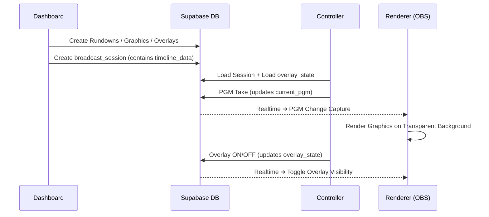
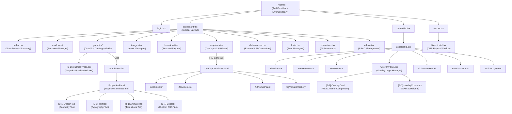

# WebCG-K

> **Web-Based Broadcasting Graphics System (Korea Edition)**

Next-generation web-based broadcast graphics playout system. Harnesses React and modern web standards (HTML, CSS, JavaScript) to generate and control high-quality transparent overlay graphics for broadcast software like OBS Studio and vMix.

---

## 📐 System Architecture

```
┌─────────── User Interface (React SPA) ──────────────────────────────────────────────┐
│                                                                                     │
│  ┌── Dashboard (/dashboard) ────────────┐  ┌── Controller (/controller/$sessionId) ─┐ │
│  │ • Rundown Management                 │  │ • Timeline (Preview/PGM Monitors)     │ │
│  │ • Graphics Editor (Penpot style)     │  │ • Overlay Gallery (ON/OFF Control)    │ │
│  │ • Image Library (2K/4K)              │  │ • Action Log                          │ │
│  │ • Overlay Templates + ✨ AI Wizard    │  │ • Playout Button (PGM Take)           │ │
│  │ • Broadcast Session Management       │  │ • Logo Gallery                        │ │
│  │ • Grid Layout Editor                 │  └───────────────────────────────────────┘ │
│  └──────────────────────────────────────┘                                             │
│                                                                                     │
│  ┌── Renderer (/render/$sessionId) ────────────────────────────────────────────────┐ │
│  │ OBS Browser Source ➔ Transparent graphics playout (1080p / 4K)                  │ │
│  │ Subscribe to Supabase Realtime ➔ Real-time PGM state synchronization            │ │
│  └─────────────────────────────────────────────────────────────────────────────────┘ │
└─────────────────────────────────────────────────────────────────────────────────────┘
            │                          │                          │
            ▼                          ▼                          ▼
┌─────────── Supabase (Self-hosted / Docker) ─────────────────────────────────────────┐
│  PostgreSQL  │  Auth (email)  │  Realtime (Broadcast)  │  Storage (images)             │
│              │                │  Subscribe to          │  2K/4K Multi-resolution       │
│              │                │  overlay_state         │                               │
└─────────────────────────────────────────────────────────────────────────────────────┘
```

### Core Data Flow



---

## ✨ Core Features

### 🎬 Playout Timeline Controller
Intuitive Premiere/Final Cut style multi-track playout timeline interface
- Drag-and-drop graphic blocks & resize durations
- Preview/PGM dual live monitors (WYSIWYG SVG rendering)
- Keyboard shortcuts (`←`, `→`, `↑`, `Space`)
- **Zoom In / Zoom Out** (25% to 100%) + `Ctrl+Mouse Wheel`
- Action logs (full operations audit trails within sessions)
- 🆕 **Segment Tab Bar** (Premiere-style Nested Sequence pattern) — auto-activates during NRCS integration
- 🆕 **Auto-follow** — auto-advances to the subsequent segment tab upon completion
- 🆕 **Zoom-to-Fit** — automatically fits zoom scale to active segment blocks

### 📡 Overlay System (NodeCG-Style)
Real-time graphics overlays decoupled from timelines
- **Dashboard**: Full Overlay Template CRUD + ✨ AI Wizard (Gemini 2.0 Flash)
- **Controller**: Playout Gallery (search/filter ➔ ON/OFF cards)
- External API bindings (weather, earthquakes, public feeds)
- Overlay depth conflict detection and resolution modals

### 📋 Rundown System (Cuesheet)
Sequential graphics management inspired by SPX-GC
- 3-Pane Layout (Library | Rundown | Live Preview)
- Drag-and-drop sequence sorting
- Live text element inline editing

### 🎨 Vector Graphics Editor
Penpot/Figma style vector layout editor
- `rect`, `text`, `group` elements + custom inline CSS overrides
- Geometric snap guides & grid snapping alignment
- Multistep Undo/Redo

### 🖼 Asset Management
2K / 4K multi-resolution image assets
- Category-based library folders
- Upload integrity modals

### 📺 Playout & Broadcasting
Ultra-low latency playout via Supabase Realtime
- Decoupled session controllers and renderers
- Direct integrations with OBS Browser Sources
- High-definition 1080p and 4K outputs

---

## 📁 Project Directory Structure

> **🎯 Learning Objective**: Study the visual directory map below to understand "why these files exist here."
> Broadcast graphics workflows flow through a 3-stage pipeline: **Authoring (Dashboard) ➔ Programming (Controller) ➔ Outputs (Renderer)**.
> Our application codebase reflects this exact pipeline structure.

```
webcg-k/
│
├── src/
│   ├── routes/                    # 🗺 Routing Layer (TanStack File-based Routing)
│   │   │  ┌──────────────────────────────────────────────────────────────┐
│   │   │  │ Why File-based Routing?                                      │
│   │   │  │ File paths define URL endpoints (Convention over Config).     │
│   │   │  │ Matches standard Next.js App Router conventions.             │
│   │   │  └──────────────────────────────────────────────────────────────┘
│   │   ├── __root.tsx             # Root layout configuration (AuthProvider, ErrorBoundary)
│   │   ├── index.tsx              # Landing route (/)
│   │   ├── login.tsx              # Login / Sign up credentials (/login)
│   │   │
│   │   ├── dashboard.tsx          # Dashboard shell (Sidebar + nested Outlet navigation)
│   │   ├── dashboard/
│   │   │   │  ┌──────────────────────────────────────────────────────────────┐
│   │   │   │  │ 📦 Route Code Splitting (B-5)                                │
│   │   │   │  │ Split into *.tsx (configs) and *.lazy.tsx (components) to     │
│   │   │   │  │ dynamically load assets on demand, optimizing bundles.        │
│   │   │   │  └──────────────────────────────────────────────────────────────┘
│   │   │   ├── index.tsx / index.lazy.tsx         # Dashboard default (Metrics summaries)
│   │   │   ├── rundowns/                          # Playout Rundown builder & lists
│   │   │   ├── cuesheets/                         # Interactive Cuesheet lists
│   │   │   ├── graphics/                          # ⭐ Graphics Catalog (Detailed below)
│   │   │   │   ├── index.tsx / index.lazy.tsx     # Bundle, Gallery, and Grid tabs
│   │   │   │   ├── graphicsTypes.tsx              # Co-located Typings & GraphicPreview component
│   │   │   │   ├── $graphicId.tsx                 # Canvas graphical designer
│   │   │   │   └── grid-templates/                # Layout boundary grid manager
│   │   │   ├── bundles/                           # Theme package settings
│   │   │   ├── images.tsx / images.lazy.tsx       # Media asset catalog (2K/4K resolution support)
│   │   │   ├── broadcast.tsx / broadcast.lazy.tsx # Playout session config & status
│   │   │   ├── templates.tsx / templates.lazy.tsx # ⭐ Overlay Management & AI Wizard UI
│   │   │   ├── datasources.tsx / datasources.lazy.tsx # Connected API integrations
│   │   │   │   ├── datasourcesTypes.ts            # Type definitions, constants, and utilities
│   │   │   │   ├── NrcsPanel.tsx                  # NRCS interface controllers
│   │   │   │   └── CustomSourceModal.tsx          # Dialog for custom public integrations
│   │   │   ├── fonts.tsx / fonts.lazy.tsx         # Typefaces (14 system fonts + manual imports)
│   │   │   ├── characters.tsx                     # Live AI avatars (Rive integration)
│   │   │   ├── admin.tsx / admin.lazy.tsx         # Workspace settings & permissions (RBAC)
│   │   │   │   ├── adminTypes.ts                  # Administrative provider declarations
│   │   │   │   ├── AdminUsersTab.tsx              # Panel managing profile groups
│   │   │   │   ├── AdminAiTab.tsx                 # Panel config for Gemini models
│   │   │   │   └── AdminApiKeysTab.tsx            # API credential access lists
│   │   │   └── dashboard-common.css               # Shared Dashboard styles
│   │   │
│   │   ├── controller.tsx         # Playout Controller wrapper
│   │   ├── controller/
│   │   │   └── $sessionId.tsx     # ⭐ Main Studio Controller (Timeline, Monitors, Overlays)
│   │   │
│   │   ├── render.tsx             # Playout Output wrapper
│   │   └── render/
│   │       └── $sessionId.tsx     # Transparent playout engine linked directly by OBS
│   │
│   ├── components/                # 🧩 Presentation Elements (Grouped by domain)
│   │   │  ┌──────────────────────────────────────────────────────────────┐
│   │   │  │ 📐 Component Extraction Principles                            │
│   │   │  │ • Files exceeding 1,000 lines are immediately refactored.    │
│   │   │  │ • Tab panels reside in isolated files to protect HMR speed.   │
│   │   │  │ • Export React.memo components to control repaint cycles.    │
│   │   │  │ • Keep types and helper constants near their consumers.      │
│   │   │  └──────────────────────────────────────────────────────────────┘
│   │   ├── Controller/            # Studio Playout modules
│   │   │   ├── Timeline.tsx       # Timeline panel (drag blocks, pan grids, zoom scale)
│   │   │   │   ├── timelineConstants.ts  # Timeline context variables & zoom steps
│   │   │   │   ├── DraggableBlock.tsx     # SVG block with resize/drag handles
│   │   │   │   └── TimelineSubComponents.tsx # TrackRow grids and Playhead widgets
│   │   │   ├── PreviewMonitor.tsx # PVW monitor (WYSIWYG layout previews)
│   │   │   ├── PGMMonitor.tsx     # PGM monitor (Live output monitor)
│   │   │   ├── OverlayPanel.tsx   # ⭐ Overlay controller & collision manager
│   │   │   │   ├── OverlayCard.tsx        # Card widget (memoized for rendering)
│   │   │   │   └── overlayConstants.tsx   # Styles, types, and schema helpers
│   │   │   │  ┌──────────────────────────────────────────────────────────┐
│   │   │   │  │ Why isolate OverlayCard?                                  │
│   │   │   │  │ Prevents large file sizes and shields rendering from     │
│   │   │   │  │ parent rerenders. Promotes precise bundler tree-shaking.  │
│   │   │   │  └──────────────────────────────────────────────────────────┘
│   │   │   ├── OverlayPlayoutLayer.tsx # Active on-screen graphics stack
│   │   │   ├── AiCharacterPanel.tsx   # Controller for AI presenter models
│   │   │   ├── AiCharacterLayer.tsx   # Transparent UI canvas for AI presenter
│   │   │   ├── BroadcastButton.tsx    # Dedicated Take (PGM transition) action
│   │   │   ├── ActionLogPanel.tsx     # Session activity log panels
│   │   │   ├── LogoGallery.tsx        # Bug overlay selectors
│   │   │   ├── SettingsPanel.tsx      # Playout session preferences
│   │   │   └── UserAvatars.tsx        # Presence icons showing connected operators
│   │   │
│   │   ├── GraphicsEditor/        # Visual design canvas (Penpot-like)
│   │   │   ├── GraphicsEditor.tsx # Core editor manager
│   │   │   ├── GraphicsEditor.css # Custom editor styling overrides
│   │   │   ├── Canvas/            # Click handlers & geometric calculations
│   │   │   ├── Elements/          # Element rendering layers (rect, text, group)
│   │   │   └── Panels/            # Property inspectors
│   │   │       ├── PropertiesPanel.tsx # Property tab director
│   │   │       ├── LayersPanel.tsx     # Drag layers lists (manage index depths)
│   │   │       ├── ToolbarPanel.tsx    # Tools palette (Selector, Text, Box)
│   │   │       └── tabs/               # Sub-properties tab views
│   │   │           ├── DesignTab.tsx   # Alignments, Strokes, Fills, CornerRadius (576 LOC)
│   │   │           ├── TextTab.tsx     # Font weights, word breaks, text drop shadows (292 LOC)
│   │   │           ├── AnimateTab.tsx  # In/Out transitions & preset selections (299 LOC)
│   │   │           └── CssTab.tsx      # Live inline raw CSS custom fields (28 LOC)
│   │   │          ┌────────────────────────────────────────────────────┐
│   │   │          │ 🏗 Property panel extraction benefits              │
│   │   │          │ Originally a massive 1,295-line component. Separating│
│   │   │          │ tabs into dedicated files improves HMR performance │
│   │   │          │ by 2x to 3x during individual changes.              │
│   │   │          └────────────────────────────────────────────────────┘
│   │   │
│   │   ├── Overlay/               # AI Graphics Wizard steps
│   │   │   ├── OverlayCreationWizard.tsx # Wizard step orchestrator
│   │   │   ├── GridSelector.tsx   # Step 1: Base split-screen template selector
│   │   │   ├── ZoneSelector.tsx   # Step 2: Quad boundary selections
│   │   │   ├── AiPromptPanel.tsx  # Step 3: LLM prompt inputs
│   │   │   ├── CgVariationGallery.tsx # Step 4: AI visual variation catalog
│   │   │   └── OverlayGallery.tsx # Save templates lists
│   │   │
│   │   ├── Characters/            # AI presenter controllers (Rive WebGL2)
│   │   ├── GridEditor/            # Grid boundaries layout manager
│   │   ├── Graphics/              # Graphic card layouts
│   │   ├── Dashboard/             # Left navigation dashboard sidebar
│   │   ├── ui/                    # Common UI components (shadcn/ui Button, Input, etc.)
│   │   │
│   │   ├── GraphicPreviewRenderer.tsx # Shared SVG visual builder
│   │   ├── AnimatedGraphicRenderer.tsx # CSS/DOM transition generator
│   │   ├── NrcsTrack.tsx          # NRCS timing timeline rows
│   │   ├── NrcsMappingPreview.tsx # Feed item mapping indicators
│   │   └── ErrorBoundary.tsx      # Fail-safe (shields broadcast rendering from crashes)
│   │
│   ├── lib/                       # Utility Libraries & Global Typings
│   │   │  ┌──────────────────────────────────────────────────────────────┐
│   │   │  │ Differences: lib/ vs services/                               │
│   │   │  │ • lib/  = Stateless helpers, type models, core config setup. │
│   │   │  │ • services/ = External API requests & complex state mutations.│
│   │   │  │ Dependency Rule: services may use lib, but lib never imports services. │
│   │   │  └──────────────────────────────────────────────────────────────┘
│   │   ├── supabase.ts            # Supabase instance singleton
│   │   ├── auth.tsx               # AuthContext (sessions, tokens, profile syncs)
│   │   ├── database.types.ts      # Automated database bindings (via Supabase CLI)
│   │   ├── overlayTypes.ts        # Playout overlays typings (CgVariation, OverlayAction)
│   │   ├── gridTypes.ts           # Screen quad division models
│   │   ├── aiCharacterTypes.ts    # AI character animations state structures
│   │   ├── nrcsTypes.ts           # Newsroom feeds models
│   │   ├── fontRegistry.ts        # Pre-loaded web fonts mapping
│   │   ├── textMeasure.ts         # Offscreen canvas size calculations (Auto-fit fonts)
│   │   ├── logger.ts              # Custom console logger (colorized domains)
│   │   ├── i18n.ts                # react-i18next framework config (10 namespaces)
│   │   ├── schemas.ts             # ⭐ Zod schemas (guarantees API type safety at runtime)
│   │   ├── richTextUtils.ts       # HTML string parsers
│   │   ├── types/                 # Shared typings
│   │   └── utils/                 # General helpers
│   │
│   ├── services/                  # Stateless business adapters
│   │   ├── aiCgService.ts         # ⭐ Gemini 2.0 Flash AI graphics generation pipeline
│   │   ├── overlayApiService.ts   # Overlay CRUD operations & API exports
│   │   ├── dataProviders.ts       # Live data endpoints (weather, disasters, mock APIs)
│   │   ├── dataSourceService.ts   # Third-party endpoints config
│   │   ├── bundleService.ts       # Theme bundle CRUD operations
│   │   ├── cuesheetService.ts     # Sequential playout cuesheets CRUD
│   │   ├── nrcsService.ts         # Newsroom feeds manager
│   │   ├── nrcsMappingService.ts  # Script segment ➔ Graphic layout parser
│   │   ├── nrcsRealtimeService.ts # Real-time feed sync adapters
│   │   ├── characterService.ts    # AI character config
│   │   ├── fontService.ts         # File system typefaces loader
│   │   ├── imageService.ts        # Image uploads & optimizations
│   │   ├── adminService.ts        # Administration endpoints
│   │   └── dashboardService.ts    # Statistics summaries
│   │
│   ├── stores/                    # Client-side State Stores (TanStack Store)
│   │   │  ┌──────────────────────────────────────────────────────────────┐
│   │   │  │ Why TanStack Store?                                          │
│   │   │  │ Extremely lightweight. Can be edited outside the React tree. │
│   │   │  │ Handles rapid 60fps updates (like block dragging) cleanly     │
│   │   │  │ by bypassing React's default render loops to secure speed.   │
│   │   │  └──────────────────────────────────────────────────────────────┘
│   │   ├── timelineStore.ts       # Timeline central state (blocks, track lines, PGM states)
│   │   ├── blockManipulation.ts   # Interactive block drag & resize logic
│   │   └── actionLogStore.ts      # Local transaction list (Undo/Redo capabilities)
│   │
│   ├── hooks/                     # Common Custom Hooks
│   │   ├── useKeyboardNavigation.ts # Timeline hotkeys mapping
│   │   ├── useSessionPresence.ts    # Real-time multi-operator indicators
│   │   ├── useRealtimeChannel.ts    # Real-time channel abstracts
│   │   ├── useDebounce.ts           # Debounce delays
│   │   └── useClipboard.ts          # OS clipboard integration helper
│   │
│   ├── locales/                   # Translation dictionaries (react-i18next)
│   │   ├── ko/                    # Korean locales (Default)
│   │   └── en/                    # English locales (Mirrored schema)
│   │
│   ├── styles.css                 # Main application CSS (Dark Theme tokens)
│   └── router.tsx                 # TanStack Router configuration instance
│
└── package.json
```

---

## 🏗 Architectural Details

### Component Tree Map

> Sub-components extracted from large files are marked with a `[B-1]` tag in the diagram below.



### Overlay System Responsibilities

| Area | Role | Primary Components |
|------|------|-------------|
| **Dashboard** (Authoring) | CRUD operations on overlay templates, AI Creation Wizard | `templates.tsx`, `OverlayCreationWizard` |
| **Controller** (Playout) | Active overlay filters & search, ON/OFF buttons | `OverlayPanel.tsx` |
| **Renderer** (Output) | Real-time listeners to toggle display visibility | `render/$sessionId.tsx` |

### State Isolation Patterns

| Scope | Tool | Target Content |
|--------|------|------|
| **Component Local** | `useState`, `useRef` | Dialog open states, local text forms, tabs |
| **Global Client** | TanStack Store | Drag coordinates, zoom levels, PGM active blocks |
| **Server State** | Supabase (direct client requests) | Graphics metadata, active programs lists, users profiles |
| **Real-time Sync** | Supabase Realtime Channels | Action logs sharing, active overlays, PGM triggers |
| **Presence** | Supabase Presence channels | Online operators cursor tracking |

---

## 🎮 How to Operate

### 1. Rundown Setup & Preparation
1. Navigate to `/dashboard/rundowns` and select your target program.
2. Drag and drop graphic overlays from the library into the rundown sequence list.
3. Click the **"Publish Project"** button.

### 2. Live Playout Controller Execution
1. Navigate to `/dashboard/broadcast`, select your program, and click **"Start Playout Session"**.
2. Inside the Studio Controller, select any timeline block and press the **Space** key to trigger a **PGM Take**.
3. Point your OBS Browser Source to the output endpoint: `http://localhost:3000/render/{sessionId}?resolution=1080p`.

### 3. Overlay Control & Conflicts
1. Navigate to `/dashboard/templates` and create overlays manually or using the **AI Wizard**.
2. Open the Studio Controller ➔ Overlays panel ➔ click **"Add Overlay"** ➔ click to toggle ON/OFF cards.
3. If overlay layers occupy the same screen zone, choose **"Stack Overlays"** or **"Replace Background Block"** in the conflict modal.

---

## ⌨️ Keyboard Shortcuts

### Timeline Playout Controller
| Shortcut | Action |
|----------|--------|
| `←` / `→` | Slide selected timeline block left / right |
| `↑` | Load selected block into the Preview Monitor (PVW) |
| `Space` | **PGM Take** (push Preview graphics live to air) |
| `Ctrl + Scroll Up` | Zoom in timeline tracks (up to 100%) |
| `Ctrl + Scroll Down` | Zoom out timeline tracks (down to 25%) |
| `Alt + ←` / `Alt + →` | 🆕 Transition between segment tabs |
| `Ctrl + Shift + L` | 🆕 Expand Logo row to span all segment sections |

### Rundown List Editor
| Shortcut | Action |
|----------|--------|
| `↑` / `↓` | Move selection highlights |
| `Space` | Select the subsequent block |
| `Delete` | Remove selected rundown row |
| `Ctrl + C` / `Ctrl + V` | Copy & paste rundown templates |

### Graphics Vector Canvas
| Shortcut | Action |
|----------|--------|
| `Ctrl + G` | Group selected graphics elements |
| `Ctrl + Shift + G` | Ungroup container elements |
| `Ctrl + Z` / `Ctrl + Y` | Undo / Redo visual changes |

### Developer Utilities
| Shortcut | Action |
|----------|--------|
| `Ctrl + Shift + K` | Force log out and purge session storage |
| Append URL query `?reset` | Reset local session credentials and redirect to login |

---

## 🔧 CLI Commands

```bash
# --- Supabase Database Lifecycle ---
npx -y supabase start       # Spin up local Docker database
npx -y supabase stop        # Stop local containers
npx -y supabase status      # Display local endpoints
npx -y supabase db reset    # Purge database, apply migrations, and seed seed.sql

# --- Frontend Application ---
npm run dev                  # Launch local HMR Vite server
npx tsc --noEmit             # Perform TypeScript compiler check

# --- Migration Helpers ---
npx -y supabase migration new <description>  # Create a clean DDL file
```

---

## 📝 Documentations

| Document File | Purpose |
|------|------|
| [USAGE.md](docs/USAGE.md) | Operations manual containing full editor shortcuts and studio workflows. |
| [SETUP.md](docs/guide/SETUP.md) | Bootstrap guide for setting up developer environment dependencies. |
| [TROUBLESHOOTING.md](docs/guide/TROUBLESHOOTING.md) | Resolutions to common local environment and build conflicts. |
| [NRCS_CUESHEET_WORKFLOW.md](docs/guide/NRCS_CUESHEET_WORKFLOW.md) | Guide to newsroom NRCS automation and segment synchronization. |
| [AI_CG_GUIDE.md](docs/guide/AI_CG_GUIDE.md) | Guide to writing prompts and parameters for overlay generations. |
| [REALTIME_SYNC_ARCHITECTURE.md](docs/guide/REALTIME_SYNC_ARCHITECTURE.md) | In-depth layout of realtime database sync and playout channel protocols. |

> To explore the complete design tokens and guidelines, refer to the [Root README](../README.md).

---

## 📜 License

MIT License
