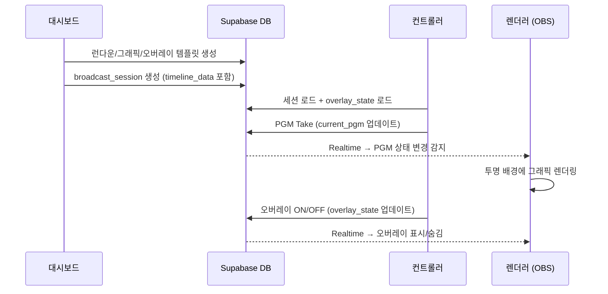
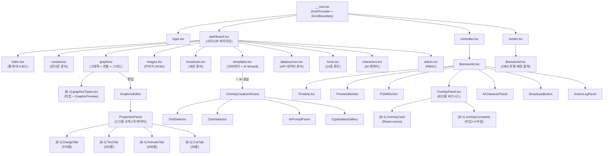

# WebCG-K

> **Web Based Broadcasting Graphics System (Korea Edition)**

차세대 웹 기반 방송 자막/그래픽 송출 시스템입니다. React와 웹 기술(HTML/CSS/JS)을 활용하여 OBS, vMix 등 방송 소프트웨어에 오버레이할 수 있는 투명 배경 그래픽을 생성하고 제어합니다.

---

## 📐 시스템 아키텍처

```
┌─────────── 사용자 인터페이스 (React SPA) ──────────────────────────────────────────────┐
│                                                                                       │
│  ┌── 대시보드 (/dashboard) ─────────────┐  ┌── 컨트롤러 (/controller/$sessionId) ───┐ │
│  │ • 런다운 관리                          │  │ • 타임라인 (Preview/PGM 모니터)         │ │
│  │ • 그래픽 편집기 (Penpot 스타일)        │  │ • 오버레이 갤러리 (ON/OFF 송출 제어)    │ │
│  │ • 이미지 라이브러리 (2K/4K)           │  │ • 액션 로그                              │ │
│  │ • 오버레이 템플릿 + ✨ AI Wizard      │  │ • 송출 버튼 (PGM Take)                  │ │
│  │ • 방송 세션 생성/관리                  │  │ • 로고 갤러리                            │ │
│  │ • 그리드 레이아웃 편집기              │  └───────────────────────────────────────────┘ │
│  └──────────────────────────────────────┘                                               │
│                                                                                       │
│  ┌── 렌더러 (/render/$sessionId) ──────────────────────────────────────────────────────┐ │
│  │ OBS 브라우저 소스 → 투명 배경 그래픽 출력 (1080p / 4K)                              │ │
│  │ Supabase Realtime 구독 → 실시간 PGM 상태 동기화                                    │ │
│  └─────────────────────────────────────────────────────────────────────────────────────┘ │
└───────────────────────────────────────────────────────────────────────────────────────────┘
            │                          │                          │
            ▼                          ▼                          ▼
┌─────────── Supabase (Self-hosted / Docker) ──────────────────────────────────────────────┐
│  PostgreSQL  │  Auth (email)  │  Realtime (Broadcast)  │  Storage (images)               │
│              │                │  overlay_state 구독     │  2K/4K 멀티 해상도             │
└──────────────────────────────────────────────────────────────────────────────────────────┘
```

### 핵심 데이터 흐름



---

## ✨ 핵심 기능

### 🎬 타임라인 컨트롤러
프리미어/파이널컷 스타일의 직관적인 타임라인 인터페이스
- 그래픽 블록 드래그 & 리사이즈
- Preview/PGM 듀얼 모니터 (WYSIWYG SVG 렌더링)
- 키보드 단축키 (← → ↑ Space)
- **줌인/줌아웃** (25%~100%) + Ctrl+마우스휠
- 액션 로그 (세션 내 모든 조작 기록)
- 🆕 **세그먼트 탭 바** (Premiere Nested Sequence 패턴) — NRCS 연동 시 자동 활성
- 🆕 **Auto-follow** — 세그먼트 완료 시 다음 탭 자동 전환
- 🆕 **Zoom-to-Fit** — 세그먼트 탭 전환 시 콘텐츠에 맞춤 줌 자동 조절

### 📡 오버레이 시스템 (NodeCG 스타일)
타임라인과 독립적인 실시간 오버레이 레이어
- **대시보드**: 오버레이 템플릿 CRUD + ✨ AI Wizard (Gemini 2.0 Flash)
- **컨트롤러**: 송출 전용 갤러리 (필터/검색 → 카드 ON/OFF 제어)
- 외부 데이터 바인딩 (날씨, 지진, 공공데이터 API)
- 레이어 충돌 감지 및 해결 모달

### 📋 런다운 시스템 (큐시트)
SPX-GC 스타일의 순차적 그래픽 관리
- 3-Pane 레이아웃 (라이브러리 | 런다운 | 미리보기)
- 드래그앤드롭 순서 변경
- 텍스트 요소 실시간 편집

### 🎨 그래픽 편집기
Penpot/Figma 스타일 벡터 에디터
- rect, text, group 요소 + 커스텀 CSS
- 스냅 시스템 & 스냅 가이드라인
- Undo/Redo

### 🖼 이미지 관리
2K/4K 멀티 해상도 시스템
- 카테고리 기반 정리
- 업로드 무결성 모달

### 📺 방송 송출 (Broadcast)
Supabase Realtime 기반 실시간 송출
- 세션 기반 컨트롤러/렌더러 분리
- OBS 브라우저 소스 직접 연결
- 1080p / 4K 해상도 지원

---

## 📁 프로젝트 구조

> **🎯 학습 목표**: 아래 트리를 읽으면서 "왜 이 파일이 여기에 있는지"를 이해하세요.
> 방송 시스템은 **저작(Dashboard) → 송출(Controller) → 출력(Renderer)** 3단계 파이프라인으로 흐릅니다.
> 코드 구조도 이 흐름을 그대로 반영합니다.

```
2026.WebCg-K/
│
├── webcg-k/                            # 📱 프론트엔드 애플리케이션 (React 19 SPA)
│   ├── src/
│   │   │
│   │   ├── routes/                    # 🗺 페이지 (TanStack File-based Routing)
│   │   │   │  ┌──────────────────────────────────────────────────────────────┐
│   │   │   │  │ Why File-based routing?                                     │
│   │   │   │  │ 파일명 = URL 경로. Next.js App Router와 같은 컨벤션이며,   │
│   │   │   │  │ 파일을 만들면 라우트가 자동 생성되어 설정 코드가 불필요.    │
│   │   │   │  └──────────────────────────────────────────────────────────────┘
│   │   │   ├── __root.tsx             # 최상위 레이아웃 (AuthProvider, ErrorBoundary)
│   │   │   ├── index.tsx              # 랜딩 페이지 (/)
│   │   │   ├── login.tsx              # 로그인/회원가입 (/login)
│   │   │   │
│   │   │   ├── dashboard.tsx          # 대시보드 레이아웃 (사이드바 + Outlet)
│   │   │   ├── dashboard/
│   │   │   │   │  ┌──────────────────────────────────────────────────────────────┐
│   │   │   │   │  │ 📦 코드 스플리팅 (B-5)                                     │
│   │   │   │   │  │ 각 라우트는 *.tsx(route config) + *.lazy.tsx(컴포넌트)로   │
│   │   │   │   │  │ 분리. lazy.tsx는 라우트 접근 시에만 로드되어 초기 번들     │
│   │   │   │   │  │ 크기를 줄임. (createFileRoute → createLazyFileRoute)       │
│   │   │   │   │  └──────────────────────────────────────────────────────────────┘
│   │   │   │   ├── index.tsx / index.lazy.tsx       # 대시보드 홈 (통계 카드)
│   │   │   │   ├── rundowns/                        # 런다운 관리 (목록 + $rundownId 편집)
│   │   │   │   ├── cuesheets/                       # 큐시트 관리
│   │   │   │   ├── graphics/                        # ⭐ 그래픽 관리 — 아래 상세 설명
│   │   │   │   │   ├── index.tsx / index.lazy.tsx    # 갤러리+번들+그리드 3탭 (TanStack Table)
│   │   │   │   │   ├── graphicsTypes.tsx             # [B-1 분할] 타입 + GraphicPreview 컴포넌트
│   │   │   │   │   ├── $graphicId.tsx    # 개별 그래픽 편집 페이지
│   │   │   │   │   └── grid-templates/  # 그리드 템플릿 편집
│   │   │   │   ├── bundles/             # 그래픽 번들 관리
│   │   │   │   ├── images.tsx / images.lazy.tsx         # 이미지 라이브러리 (2K/4K)
│   │   │   │   ├── broadcast.tsx / broadcast.lazy.tsx   # 방송 세션 생성/관리
│   │   │   │   ├── templates.tsx / templates.lazy.tsx   # ⭐ 오버레이 템플릿 + AI Wizard
│   │   │   │   ├── datasources.tsx / datasources.lazy.tsx # 외부 데이터 소스 관리
│   │   │   │   │   ├── datasourcesTypes.ts       # [B-1 분할] 타입/상수/헬퍼
│   │   │   │   │   ├── NrcsPanel.tsx             # [B-1 분할] NRCS 연동 탭
│   │   │   │   │   └── CustomSourceModal.tsx     # [B-1 분할] 커스텀 소스 모달
│   │   │   │   ├── fonts.tsx / fonts.lazy.tsx   # 폰트 관리 (14종 번들 + 업로드)
│   │   │   │   ├── characters.tsx               # AI 캐릭터 관리 (Rive ViewModel)
│   │   │   │   ├── admin.tsx / admin.lazy.tsx   # 관리자 페이지 (RBAC)
│   │   │   │   │   ├── adminTypes.ts             # [B-1 분할] 타입/PROVIDERS
│   │   │   │   │   ├── AdminUsersTab.tsx         # [B-1 분할] 사용자 관리 탭
│   │   │   │   │   ├── AdminAiTab.tsx            # [B-1 분할] AI 모델 관리 탭
│   │   │   │   │   └── AdminApiKeysTab.tsx       # [B-1 분할] API 키 관리 탭
│   │   │   │   └── dashboard-common.css          # 대시보드 공통 CSS
│   │   │   │
│   │   │   ├── controller.tsx         # 컨트롤러 레이아웃
│   │   │   ├── controller/
│   │   │   │   └── $sessionId.tsx     # ⭐ 라이브 세션 컨트롤러 (타임라인+모니터+오버레이)
│   │   │   │
│   │   │   ├── render.tsx             # 렌더러 레이아웃 (OBS 브라우저 소스용)
│   │   │   └── render/
│   │   │       └── $sessionId.tsx     # 세션별 투명 배경 그래픽 출력
│   │   │
│   │   ├── components/                # 🧩 UI 컴포넌트 (기능 도메인별 그룹)
│   │   │   │  ┌──────────────────────────────────────────────────────────────┐
│   │   │   │  │ 📐 컴포넌트 아키텍처 원칙                                    │
│   │   │   │  │ • 1,000줄 초과 파일은 반드시 분할 (B-1 리팩토링)            │
│   │   │   │  │ • 탭 기반 UI → 탭별 파일 분리 (HMR 성능 향상)               │
│   │   │   │  │ • React.memo → 독립 파일 (props 변경 시에만 re-render)       │
│   │   │   │  │ • 상수/타입 → co-locate 또는 공유 파일로                     │
│   │   │   │  └──────────────────────────────────────────────────────────────┘
│   │   │   │
│   │   │   ├── Controller/            # ⭐ 송출 컨트롤러 구성요소
│   │   │   │   ├── Timeline.tsx       # 프리미어 스타일 타임라인 (블록 드래그/줌)
│   │   │   │   │   ├── timelineConstants.ts   # [B-1 분할] 줌 상수/컨텍스트/헬퍼
│   │   │   │   │   ├── DraggableBlock.tsx      # [B-1 분할] 드래그/리사이즈 블록
│   │   │   │   │   └── TimelineSubComponents.tsx # [B-1 분할] TrackRow/Playhead 등
│   │   │   │   ├── PreviewMonitor.tsx  # Preview(PVW) 모니터 (SVG WYSIWYG)
│   │   │   │   ├── PGMMonitor.tsx     # PGM 모니터 (송출 중인 그래픽)
│   │   │   │   ├── OverlayPanel.tsx   # ⭐ 오버레이 송출 제어 (비즈니스 로직)
│   │   │   │   │   ├── OverlayCard.tsx      # [B-1 분할] 카드 UI (React.memo)
│   │   │   │   │   └── overlayConstants.tsx # [B-1 분할] 타입 5개 + 스타일 상수
│   │   │   │   │  ┌──────────────────────────────────────────────────────────┐
│   │   │   │   │  │ Why OverlayCard를 분리?                                  │
│   │   │   │   │  │ 1,168줄 → 822줄. React.memo 컴포넌트는 독립 파일이      │
│   │   │   │   │  │ 좋음 — 부모 재렌더 시에도 자체 props만 비교하므로        │
│   │   │   │   │  │ 번들러가 트리쉐이킹으로 최적화 가능.                     │
│   │   │   │   │  └──────────────────────────────────────────────────────────┘
│   │   │   │   ├── OverlayPlayoutLayer.tsx # 오버레이 렌더링 레이어 (렌더러용)
│   │   │   │   ├── AiCharacterPanel.tsx   # AI 캐릭터 제어 패널
│   │   │   │   ├── AiCharacterLayer.tsx   # AI 캐릭터 렌더링 레이어
│   │   │   │   ├── BroadcastButton.tsx    # PGM Take 버튼
│   │   │   │   ├── ActionLogPanel.tsx     # 액션 로그 (모든 조작 기록)
│   │   │   │   ├── LogoGallery.tsx        # 로고 갤러리
│   │   │   │   ├── SettingsPanel.tsx      # 세션 설정
│   │   │   │   └── UserAvatars.tsx        # 동시 접속 사용자 표시 (Presence)
│   │   │   │
│   │   │   ├── GraphicsEditor/        # 🎨 Penpot 스타일 그래픽 편집기
│   │   │   │   ├── GraphicsEditor.tsx # 메인 편집기 오케스트레이터
│   │   │   │   ├── GraphicsEditor.css # 에디터 전용 스타일
│   │   │   │   ├── Canvas/           # 캔버스 렌더링 + 이벤트 처리
│   │   │   │   ├── Elements/         # 개별 요소 렌더러 (rect, text, group)
│   │   │   │   ├── Panels/           # ⭐ 속성 패널 (B-1 분할 완료)
│   │   │   │   │   ├── PropertiesPanel.tsx  # 오케스트레이터 (172줄, 탭 전환만)
│   │   │   │   │   ├── LayersPanel.tsx      # 레이어 목록 (z-index 관리)
│   │   │   │   │   ├── ToolbarPanel.tsx     # 도구 모음
│   │   │   │   │   └── tabs/                # [B-1 분할] 탭별 서브 컴포넌트
│   │   │   │   │       ├── DesignTab.tsx    # Transform/Fill/Stroke/CornerRadius (576줄)
│   │   │   │   │       ├── TextTab.tsx      # Typography/Alignment/Shadow (292줄)
│   │   │   │   │       ├── AnimateTab.tsx   # Enter/Exit/Loop 프리셋 (299줄)
│   │   │   │   │       └── CssTab.tsx       # Custom CSS 에디터 (28줄)
│   │   │   │   │      ┌────────────────────────────────────────────────────┐
│   │   │   │   │      │ 🏗 B-1 분할 사례: PropertiesPanel                  │
│   │   │   │   │      │ Before: 1,295줄 거대 파일 (4개 탭이 한 파일에)     │
│   │   │   │   │      │ After:  172줄 오케스트레이터 + 4개 탭 파일          │
│   │   │   │   │      │ 효과: AnimateTab만 수정해도 DesignTab은 재컴파일   │
│   │   │   │   │      │       되지 않아 HMR 속도 2~3배 향상                 │
│   │   │   │   │      └────────────────────────────────────────────────────┘
│   │   │   │   ├── hooks/            # 에디터 전용 훅 (useCanvasZoom 등)
│   │   │   │   └── utils/            # 에디터 유틸리티 (스냅, 정렬 등)
│   │   │   │
│   │   │   ├── Overlay/              # ⭐ AI 오버레이 생성 Wizard (4단계)
│   │   │   │   ├── OverlayCreationWizard.tsx  # 마법사 오케스트레이터
│   │   │   │   ├── GridSelector.tsx    # Step 1: 그리드 선택
│   │   │   │   ├── ZoneSelector.tsx    # Step 2: Zone 다중 선택
│   │   │   │   ├── AiPromptPanel.tsx   # Step 3: AI 프롬프트 입력
│   │   │   │   ├── CgVariationGallery.tsx # Step 4: AI 생성 결과 선택
│   │   │   │   └── OverlayGallery.tsx  # 갤러리 관리
│   │   │   │
│   │   │   ├── Characters/            # AI 캐릭터 시스템 (Rive WebGL2)
│   │   │   ├── GridEditor/            # 그리드 템플릿 편집기 (BSP 분할)
│   │   │   ├── Graphics/              # 그래픽 갤러리 카드
│   │   │   ├── Dashboard/             # 대시보드 사이드바
│   │   │   ├── ui/                    # 🔧 shadcn/ui 공통 컴포넌트 (Button, Input 등)
│   │   │   │
│   │   │   ├── GraphicPreviewRenderer.tsx  # SVG 프리뷰 렌더러 (전체 시스템 공유)
│   │   │   ├── AnimatedGraphicRenderer.tsx # DOM/CSS 애니메이션 렌더러 (25종)
│   │   │   ├── NrcsTrack.tsx          # NRCS 자동화 트랙
│   │   │   ├── NrcsMappingPreview.tsx  # NRCS→CG 매핑 미리보기
│   │   │   └── ErrorBoundary.tsx      # SilentErrorBoundary (송출 무중단 보장)
│   │   │
│   │   ├── lib/                       # 📚 라이브러리 & 타입 (전역 공유 유틸리티)
│   │   │   │  ┌──────────────────────────────────────────────────────────────┐
│   │   │   │  │ lib/ vs services/ 차이                                      │
│   │   │   │  │ • lib/  = 순수 유틸리티, 타입 정의, 클라이언트 초기화       │
│   │   │   │  │ • services/ = 외부 API 호출, 비즈니스 로직 포함             │
│   │   │   │  │ 의존성 방향: services → lib (역방향 금지)                    │
│   │   │   │  └──────────────────────────────────────────────────────────────┘
│   │   │   ├── supabase.ts            # Supabase 클라이언트 싱글턴
│   │   │   ├── auth.tsx               # AuthContext (로그인/로그아웃/세션)
│   │   │   ├── database.types.ts      # DB 타입 (supabase gen types 자동 생성)
│   │   │   ├── overlayTypes.ts        # 오버레이 타입 (OverlayAction, CgVariation 등)
│   │   │   ├── gridTypes.ts           # 그리드 타입 (GridTemplate, Quadrant)
│   │   │   ├── aiCharacterTypes.ts    # AI 캐릭터 ViewModel 타입
│   │   │   ├── nrcsTypes.ts           # NRCS 보도정보 타입
│   │   │   ├── fontRegistry.ts        # 14종 시스템 폰트 등록 (한글/영문 분리)
│   │   │   ├── textMeasure.ts         # ⭐ 오프스크린 Canvas 텍스트 측정 (Auto-fit)
│   │   │   ├── logger.ts              # 구조화된 Logger (네임스페이스 컬러 로깅)
│   │   │   ├── i18n.ts                # react-i18next 다국어 설정 (10개 네임스페이스)
│   │   │   ├── schemas.ts             # ⭐ [B-4] Zod 스키마 (런타임 타입 검증)
│   │   │   ├── richTextUtils.ts       # 리치 텍스트 파싱 유틸
│   │   │   ├── types/                 # 공통 타입 모음
│   │   │   └── utils/                 # 범용 유틸리티
│   │   │
│   │   ├── services/                  # 🔌 서비스 레이어 (외부 API + 비즈니스 로직)
│   │   │   ├── aiCgService.ts         # ⭐ Gemini 2.0 Flash AI CG 생성 엔진
│   │   │   ├── overlayApiService.ts   # 오버레이 CRUD / 갤러리 / REST Export
│   │   │   ├── dataProviders.ts       # 외부 데이터 프로바이더 (날씨/지진/Mock)
│   │   │   ├── dataSourceService.ts   # 데이터소스 관리
│   │   │   ├── bundleService.ts       # 그래픽 번들 CRUD
│   │   │   ├── cuesheetService.ts     # 큐시트 관리
│   │   │   ├── nrcsService.ts         # NRCS 보도정보 연동
│   │   │   ├── nrcsMappingService.ts  # NRCS→CG 매핑 로직
│   │   │   ├── nrcsRealtimeService.ts # NRCS 실시간 동기화
│   │   │   ├── characterService.ts    # AI 캐릭터 관리
│   │   │   ├── fontService.ts         # 폰트 업로드/관리
│   │   │   ├── imageService.ts        # 이미지 업로드/관리
│   │   │   ├── adminService.ts        # 관리자 API
│   │   │   └── dashboardService.ts    # 대시보드 통계
│   │   │
│   │   ├── stores/                    # 🏪 전역 상태 (TanStack Store)
│   │   │   │  ┌──────────────────────────────────────────────────────────────┐
│   │   │   │  │ Why TanStack Store?                                         │
│   │   │   │  │ Redux보다 경량하고 React 외부에서도 읽기/쓰기 가능.        │
│   │   │   │  │ 타임라인 블록 조작처럼 60fps 업데이트가 필요한 경우         │
│   │   │   │  │ React 렌더링과 디커플링하여 성능을 확보한다.                │
│   │   │   │  └──────────────────────────────────────────────────────────────┘
│   │   │   ├── timelineStore.ts       # ⭐ 타임라인 핵심 상태 (블록, PGM, 트랙)
│   │   │   ├── blockManipulation.ts   # 블록 드래그/리사이즈 로직 (분리)
│   │   │   └── actionLogStore.ts      # 액션 히스토리 (Undo용)
│   │   │
│   │   ├── hooks/                     # 🪝 커스텀 훅 (재사용 가능한 상태 로직)
│   │   │   ├── useKeyboardNavigation.ts  # 타임라인 키보드 내비게이션
│   │   │   ├── useSessionPresence.ts     # Supabase Presence (동시 접속)
│   │   │   ├── useRealtimeChannel.ts     # Supabase Realtime 채널 추상화
│   │   │   ├── useDebounce.ts            # 입력 디바운스
│   │   │   └── useClipboard.ts           # 클립보드 복사/붙여넣기
│   │   │
│   │   ├── locales/                   # 🌐 다국어 번역 파일 (react-i18next)
│   │   │   ├── ko/                    # 한국어 (기본)
│   │   │   │   ├── common.json        # 공통 UI (버튼, 상태, 네비게이션)
│   │   │   │   ├── dashboard.json     # 대시보드 홈
│   │   │   │   ├── broadcast.json     # 프로젝트 송출
│   │   │   │   ├── admin.json         # 관리자 패널
│   │   │   │   ├── datasources.json   # 데이터 소스
│   │   │   │   ├── graphics.json      # 그래픽 관리
│   │   │   │   ├── templates.json     # 템플릿
│   │   │   │   ├── fonts.json         # 폰트
│   │   │   │   ├── images.json        # 이미지
│   │   │   │   └── rundowns.json      # 큐시트/런다운
│   │   │   └── en/                    # 영어 (동일 구조)
│   │   │
│   │   ├── styles.css                 # 글로벌 CSS (다크 테마 + CSS Variables)
│   │   └── router.tsx                 # TanStack Router 설정
│   │
│   └── package.json
│
├── supabase/                           # ☁️ 백엔드 (Self-hosted Supabase / Docker)
│   │  ┌──────────────────────────────────────────────────────────────────┐
│   │  │ Why Self-hosted?                                                │
│   │  │ 방송사 내부망에서 운용되므로 클라우드 의존 최소화.              │
│   │  │ Docker Compose 하나로 DB+Auth+Realtime+Storage 전부 실행.      │
│   │  └──────────────────────────────────────────────────────────────────┘
│   ├── migrations/                    # 43개 SQL 마이그레이션 (자동 적용)
│   │   ├── ...profiles.sql            # 사용자 프로필 + RLS
│   │   ├── ...projects.sql            # 프로젝트 (방송 프로그램 단위)
│   │   ├── ...graphics.sql            # 그래픽 템플릿 (SVG 요소 배열)
│   │   ├── ...broadcast_sessions.sql  # 방송 세션 (PGM/PVW 상태)
│   │   ├── ...overlay_templates.sql   # ⭐ 오버레이 템플릿
│   │   ├── ...overlay_state.sql       # ⭐ 오버레이 실시간 상태 (Realtime 구독 대상)
│   │   ├── ...session_action_logs.sql # 조작 감사 로그
│   │   └── ...                        # (기타 마이그레이션)
│   └── config.toml                    # Supabase 로컬 설정
│
└── docs/                               # 📖 프로젝트 문서
    ├── USAGE.md                       # ⭐ 통합 사용 메뉴얼 (전체 워크플로우 + 단축키)
    ├── assets/                        # 문서용 이미지/스크린샷
    ├── study/                         # 학습·분석 문서
    └── guide/                         # 📖 워크플로우·기술 가이드
        ├── SETUP.md                   # 환경 설정
        ├── TROUBLESHOOTING.md         # 문제 해결
        ├── NRCS_CUESHEET_WORKFLOW.md  # NRCS 큐시트
        ├── AI_CG_GUIDE.md             # AI CG 생성
        ├── AI_CHARACTER_SYSTEM.md     # AI 캐릭터 시스템
        ├── RENDERER_RESOLUTION.md     # 렌더러 해상도
        ├── REALTIME_SYNC_ARCHITECTURE.md # Realtime 동기화
        ├── SHADCN_GUIDE.md            # UI 컴포넌트
        └── GRID_EDITOR.md             # 그리드 편집기
```

---

## 🏗 아키텍처 상세

### 컴포넌트 계층 구조

> 아래 다이어그램에서 `[B-1]` 표시는 거대 파일 분할로 새로 생긴 서브 컴포넌트입니다.



### 오버레이 아키텍처 (역할 분리)

| 영역 | 역할 | 주요 컴포넌트 |
|------|------|-------------|
| **대시보드** (저작) | 오버레이 템플릿 생성/편집/삭제, AI Wizard | `templates.tsx`, `OverlayCreationWizard` |
| **컨트롤러** (송출) | 사전 정의 오버레이 필터/검색, ON/OFF 제어 | `OverlayPanel.tsx` |
| **렌더러** (출력) | Realtime 구독으로 오버레이 표시/숨김 | `render/$sessionId.tsx` |

### 상태 관리 전략

| 레이어 | 도구 | 대상 |
|--------|------|------|
| **로컬 컴포넌트** | `useState`, `useRef` | 모달, 폼, UI 토글 |
| **전역 상태** | TanStack Store | 타임라인 블록, PGM 상태 |
| **서버 상태** | Supabase (직접 쿼리) | 템플릿, 세션, 오버레이 |
| **실시간 동기화** | Supabase Realtime | PGM 변경, 오버레이 ON/OFF |
| **프레즌스** | Supabase Presence | 동시 접속 사용자 |

## 🎮 사용 방법

### 1. 큐시트 편집
1. `/dashboard/rundowns` → 런다운 선택
2. 라이브러리에서 그래픽 추가 → 드래그앤드롭 정렬
3. **"프로젝트 생성"** 클릭

### 2. 송출
1. `/dashboard/broadcast` → 프로젝트 선택 → **"송출하기"**
2. 컨트롤러에서 타임라인 블록 선택 → **Space** 키 PGM Take
3. OBS 렌더러 URL: `http://localhost:3000/render/{sessionId}?resolution=1080p`

### 3. 오버레이 관리
1. `/dashboard/templates` → 오버레이 생성 (수동 또는 ✨ AI Wizard)
2. 컨트롤러 → 오버레이 탭 → "+ 추가" → ON/OFF 제어
3. 충돌 감지 시 모달에서 "겹쳐서 표시" 또는 "블록 숨기고 표시" 선택

---

## ⌨️ 단축키

### 타임라인 컨트롤러
| 키 | 기능 |
|----|------|
| `←` `→` | 블록 이동 |
| `↑` | Preview로 선택 |
| `Space` | PGM 송출 |
| `Ctrl+휠↑` | 줌인 (최대 100%) |
| `Ctrl+휠↓` | 줌아웃 (최소 25%) |
| `Alt+←` / `Alt+→` | 🆕 세그먼트 탭 이동 |
| `Ctrl+Shift+L` | 🆕 로고 Expand (세그먼트 전체 CG 구간) |

### 런다운 편집기
| 키 | 기능 |
|----|------|
| `↑` `↓` | 아이템 선택 이동 |
| `Space` | 다음 아이템 |
| `Delete` | 삭제 |
| `Ctrl+C/V` | 복사/붙여넣기 |

### 그래픽 편집기
| 키 | 기능 |
|----|------|
| `Ctrl+G` | 그룹화 |
| `Ctrl+Shift+G` | 그룹 해제 |
| `Ctrl+Z/Y` | Undo/Redo |

### 개발자 유틸리티
| 키 | 기능 |
|----|------|
| `Ctrl+Shift+K` | 강제 로그아웃 (세션 클리어) |
| URL `?reset` | 세션 초기화 후 로그인 리다이렉트 |

---

## 🔧 개발 명령어

```bash
# Supabase 관리
npx -y supabase start       # 시작
npx -y supabase stop        # 중지
npx -y supabase status      # 상태 확인
npx -y supabase db reset    # DB 초기화 (마이그레이션 재적용)

# 프론트엔드
npm run dev                  # 개발 서버
npx tsc --noEmit             # TypeScript 타입 체크

# 새 마이그레이션 생성
npx -y supabase migration new <description>
```

---

## 📝 문서

| 문서 | 설명 |
|------|------|
| [USAGE.md](docs/USAGE.md) | 전체 워크플로우·단축키·사용법 |
| [SETUP.md](docs/guide/SETUP.md) | 환경 설정 가이드 |
| [TROUBLESHOOTING.md](docs/guide/TROUBLESHOOTING.md) | 문제 해결 |
| [NRCS_CUESHEET_WORKFLOW.md](docs/guide/NRCS_CUESHEET_WORKFLOW.md) | NRCS 큐시트 워크플로우 |
| [AI_CG_GUIDE.md](docs/guide/AI_CG_GUIDE.md) | AI CG 생성 가이드 |
| [REALTIME_SYNC_ARCHITECTURE.md](docs/guide/REALTIME_SYNC_ARCHITECTURE.md) | Realtime 동기화 아키텍처 |

> 전체 모노레포 문서 가이드는 [루트 README](../README.md)를 참조하세요.

---

## 📜 라이선스

MIT License
