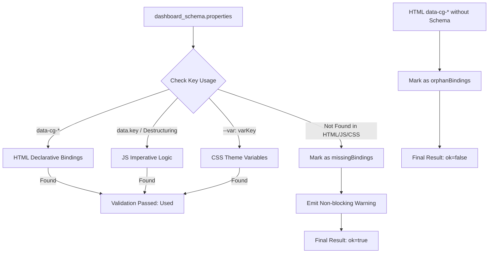

# 🏗 Architecture & Principles Textbook (docs/CONTEXT.md)

## 📐 WebCG-K Core Architecture Overview
WebCG-K is a **web-based real-time broadcast graphics playout system** designed for seamless, continuous operations within private broadcast networks. The system implements a three-stage graphics pipeline encompassing Authoring (Dashboard), Playout Control (Controller), and Playout Output (Renderer).

```mermaid
graph TD
    subgraph "1. Authoring Layer"
        Dashboard["Dashboard (/dashboard)"]
        GfxEditor["Vector Graphics Editor<br/>(GraphicsEditor)"]
        AIWizard["AI CG Wizard<br/>(Gemini 2.0 Flash)"]
    end

    subgraph "2. Data & Sync Layer"
        SupabaseDB["Supabase Postgres DB"]
        RealtimeChannel["Supabase Realtime Channel<br/>(Broadcast vs DB CDC)"]
        MigrationEngine["Single Squashed Migration<br/>(Squashed Migration)"]
    end

    subgraph "3. Playout & Output Layer"
        Controller["Live Controller (/controller)<br/>(Timeline / Overlay Playout Control)"]
        Renderer["OBS Browser Renderer (/render)<br/>(Transparent 4K Alpha Channel Graphics Output)"]
    end

    Dashboard -->|Save/Query| SupabaseDB
    GfxEditor -->|Save SVG JSON Data| SupabaseDB
    AIWizard -->|Generate HTML/CSS Templates| SupabaseDB
    
    Controller -->|PGM Take: Broadcast| RealtimeChannel
    Controller -->|Overlay ON/OFF: DB UPDATE| SupabaseDB
    
    RealtimeChannel -->|Instant Playout (~5ms)| Renderer
    SupabaseDB -->|CDC Detection (~50ms)| Renderer
    MigrationEngine -->|Table/Schema Build| SupabaseDB
```

---

## 🎨 Graphics Editing Engine Comparison: WebCG-K vs Excalidraw
We compare and analyze WebCG-K's vector graphics editor (`Canvas.tsx`) with `Excalidraw`, the de facto standard for collaborative whiteboarding, focusing on rendering performance, coordinate systems, and mathematical rigor.

### 1. Codebase Size and Scope Differences
*   **WebCG-K (Our Project)**
    *   **Total Scale**: Approximately **82,800 LOC** based on the `src` directory (TypeScript, TSX, CSS).
    *   **Features**: Rather than being just a simple drawing canvas, it encompasses the **entire broadcast automation ecosystem**, including user authentication, database RLS, Supabase Realtime synchronization channels, video input overlays, a timeline playhead compiler, NRCS (Newsroom Computer System) API integration, AI character Rive viewmodels, and an AI Cuesheet Wizard.
    *   **Editor Scope**: The core modules related to the `GraphicsEditor` span about **8,000 to 10,000 LOC** within the overall system.
*   **Excalidraw (Open Source)**
    *   **Total Scale**: **100,000 LOC+** across the single package and monorepo.
    *   **Features**: It is hyper-focused on a single objective: the **"infinite whiteboard canvas"**. Code is highly concentrated in its core package `@excalidraw/excalidraw` and the geometric math package `@excalidraw/math`, offering extreme mathematical precision in canvas operations, hit testing, and freehand curve-simplification algorithms.

---

### 2. Rendering Architecture Comparison (SVG DOM vs Canvas 2D)

```mermaid
grid
    column
        ### WebCG-K: SVG DOM Rendering
        ```mermaid
        sequenceDiagram
            participant React as React State
            participant DOM as SVG DOM Tree
            participant GPU as Browser GPU
            React->>DOM: 1. Element Position Change (x, y)
            DOM->>DOM: 2. Layout & Recalculate (Thrashing)
            DOM->>GPU: 3. Paint (Reflow Occurs)
        ```
        *   **Pros**: Highly flexible utilization of CSS Variables and Keyframe animations, allowing elegant broadcast overlay effects (Fade, Slide) rendered natively by the browser.
        *   **Cons**: Hundreds of SVG nodes trigger real-time DOM changes during dragging/resizing, causing rendering bottlenecks.
    column
        ### Excalidraw: Dual-Canvas Rendering
        ```mermaid
        sequenceDiagram
            participant Engine as State Array
            participant Back as Static Background Canvas
            participant Fore as Interactive Foreground Canvas
            Engine->>Fore: 1. Redraw pixels of the dragged handle only (O(1))
            Note over Back: 2. Do not redraw static drawings
            Fore->>Fore: 3. Merge into Background Canvas upon drag completion
        ```
        *   **Pros**: No DOM node accumulation, ensuring zero frame drops (60fps) even when dragging thousands of elements.
        *   **Cons**: Cannot apply CSS animations directly; all transitions must be rendered manually using JavaScript `requestAnimationFrame` loops.
```

---

### 3. Technical Detail Comparison & Trade-off

| Feature | WebCG-K (SVG DOM) | Excalidraw (HTML5 Canvas) | Mentoring Action Items (Trade-offs) |
|---|---|---|---|
| **Base Renderer** | `React` + `SVG DOM Elements` | `HTML5 Canvas 2D` + `Rough.js` | **Because elegant animations are essential for broadcast playout templates**, SVG DOM is highly appropriate, though performance optimization during editing is required. |
| **Coordinate Transform** | Relative Snap Calculation based on `clientX` | 3x3 Affine Transformation Matrix (Matrix Zoom/Pan) | Applying **Affine Transformation** matrices guarantees that mouse clicks align perfectly with canvas elements during zoom in/out. |
| **Collision & Snap** | Bounding Box Loop with 8px Threshold | `@excalidraw/math` Precision Geometry Hit Test | Structural refactoring is recommended to extract snap calculation functions into utility modules for handling precise collisions between rotated shapes (`rotation`) or ellipses. |
| **Sync Latency** | Supabase Realtime (~5ms to ~50ms) | WebSockets + Web Crypto API E2EE | Since broadcast workflows rely heavily on integration with external NRCS equipment and automation, the **Supabase CDC architecture** is optimal to guarantee strict DB state consistency. |

---

## 💾 Database Migration Squash Architecture
*   **Background**: Having 65 fragmented migration files poses high risks of performance bottlenecks and dependency sequence errors (such as Foreign Key or Trigger timing mismatches) during initial schema setup in local and production environments.
*   **Design (Why & How)**:
    1.  We utilize the Supabase CLI's `migration squash` feature to compile 65 migration files into a single, unified SQL script: `202605140001_overlay_blend_mode.sql`.
    2.  To prevent seeding failures in `seed.sql` caused by the empty search path (`pg_catalog.set_config('search_path', '', false)`) injected during `pg_dump`, we append `RESET search_path;` at the end of the squashed migration file, perfectly securing **Session Isolation**.

---

## 🎯 3 Key Architectural Improvement Plans (ADR)

### [ADR-01] Introduction of the Dual-Layer Canvas Pattern
*   **Background**: Currently, dragging or resizing elements in `Canvas.tsx` triggers a full real-time re-render of all complex child SVG elements, potentially causing frame rate drops.
*   **Solution (Why & How)**:
    *   **Static Layer (Background SVG)**: Original graphics elements with high rendering costs are memoized so they do not re-render during dragging.
    *   **Interactive Layer (Foreground SVG Overlay)**: Light overlay components (snap guidelines, resize handles, rotation anchors) are rendered separately on a foreground overlay, minimizing React rendering calculations from $O(N)$ to $O(1)$.

### [ADR-02] Unified Coordinate Transform (Affine Space Separation)
*   **Background**: The current editor zoom feature relies solely on CSS `transform: scale()`, which can occasionally cause alignment drift between screen mouse coordinates and logical canvas coordinates.
*   **Solution (Why & How)**:
    *   Benchmarking Excalidraw's `viewportCoordinate` mapping, we abstract and export a geometric utility function `screenToCanvas(x, y, zoom, pan)` that accurately maps screen-space mouse coordinates to physical inner canvas coordinates.

### [ADR-03] Strict Immutability & Structural Sharing
*   **Background**: Direct reference mutation or excessive cloning of vector element arrays triggers full DOM re-renders of the canvas layout.
*   **Solution (Why & How)**:
    *   When mutating graphics arrays, we define store actions that guarantee structural sharing patterns instead of basic shallow copies (`...`), ensuring the React Reconciler targets only the modified DOM nodes for minimal updates.

### [ADR-04] AI Overlay Binding Validation & Aesthetic Autonomy
*   **Background (배경)**: AI 플러그인을 사용하여 방송 오버레이 생성 시, 스키마 변수가 HTML 바인딩이나 단순 JS 멤버 접근(`data.key`)을 우회해 JS 구조 분해 할당(`const { timerDuration } = data;`) 또는 CSS Variables 테마 바인딩(`:root { --primary: var(--primaryColor); }`)으로 사용될 때, 기존 검증기가 이를 미사용 변수로 잘못 판단(False Positive)하여 스키마 정합성 검증 에러를 뿜으며 빌드를 차단하는 문제가 발생했다. 이로 인해 AI가 풍부하고 미학적인 템플릿을 창작하려는 시도가 제한받았다.
*   **Solution (Why & How - 해결책)**:
    1. **구조 분해 할당(Destructuring) 파서 탑재**: `extractJsDataKeys()`에 JS의 객체 구조 분해 할당 정규식(`(?:const|let|var)\s*\{\s*([^}]+)\s*\}\s*=\s*data\b`)을 적용하여 쉼표로 분리된 개별 키들과 콜론(`:`)을 사용한 별칭(alias) 분기를 정밀히 추출하여 1차적으로 탐색 역량을 강화했다.
    2. **CSS Variables & 2차 휴리스틱 단어 경계 감지 (Heuristic Fallback)**: AST급의 무거운 컴파일러 파서 없이도 가볍고 견고하게 오탐을 원천 해결하기 위해, CSS 텍스트 및 JS 소스 전체에 대해 단어 경계 정규식(`\bkey\b`) 기반의 2차 구제 검색을 실행한다. 이를 통해 CSS의 테마 바인딩이나 동적 JS 참조를 완벽하게 감지한다.
    3. **검증 통과 조건 완화 (Aesthetic Autonomy)**: 단순 미사용 스키마 키(`missingBindings`)는 경고만 띄우고 빌드 실패로 다스리지 않음으로써(`ok: true`), AI 모델이 불필요한 선언형 바인딩 제약에 얽매이지 않고 GSAP, WebGL2, 복잡한 SVG 애니메이션 상태머신 등 극도로 화려하고 창의적인 비주얼 연출을 마음껏 시도하도록 자율성을 보장한다.
    

