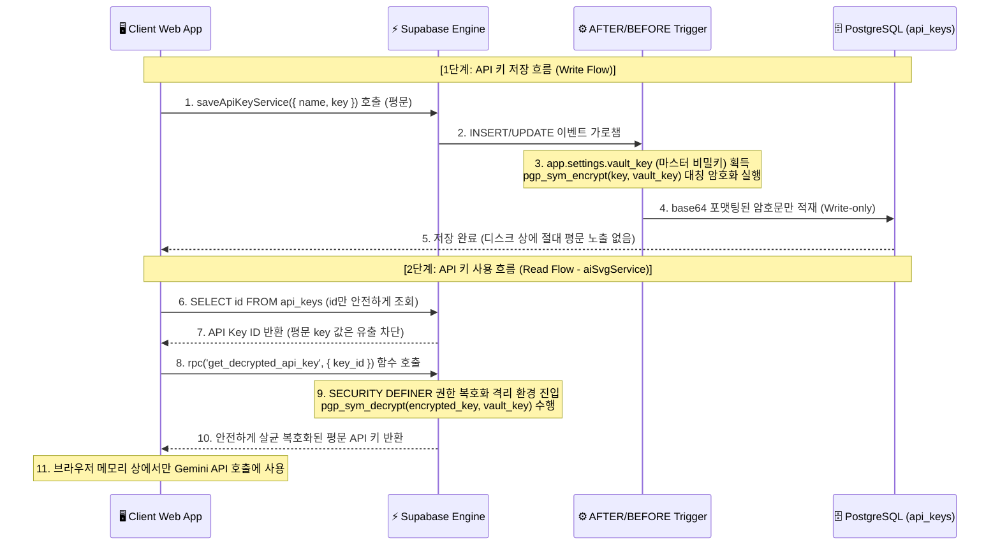

# 🏗️ WebCG-K System Architecture & Security Context

본 문서는 WebCG-K 방송 자막 송출 플랫폼의 시스템 아키텍처 및 데이터 흐름, 특히 **보안 계층(Security Layer)**의 핵심 메커니즘을 상세히 기술한 아키텍처 교과서입니다.

---

## 1. 🔑 API 키 대칭 암호화 & 안전한 RPC 복호화 흐름

기존의 DB 평문 저장 취약점을 극복하기 위해 도입한 **트리거 기반 대칭 암호화(Trigger-based Symmetric Encryption)** 및 **인가된 RPC 전용 복호화 게이트웨이(RPC Decryption Gateway)** 아키텍처 흐름입니다.

---

## 2. 🛡️ 아키텍처적 도입 이유 & 기술 결정 기록 (ADR)

### 1) DB 트리거(Trigger) 레벨 대칭 암호화 채택 이유
* **상황:** 클라이언트 측에서 암호화를 수행하여 올릴 경우, 마스터 암호화 키를 프론트엔드 코드에 하드코딩하거나 노출해야 하는 치명적인 역효과가 납니다.
* **대칭 암호화 방식:** PostgreSQL `pgcrypto` 확장 모듈의 `pgp_sym_encrypt` 함수를 DB 트리거 레벨에서 자동으로 처리하여, 프론트엔드가 실수를 하더라도 DB 적재 직전 최종 수비대(Guard)로서의 무결함을 유지합니다.
* **보안 이점:** SQL Injection 공격이나 RLS 정책 우회 취약점이 뚫려 데이터베이스 자체가 외부에 유출되더라도, 해커는 오직 복호화가 불가능한 깨진 base64 바이너리 암호문만 쥐게 됩니다.

### 2) RPC 복호화 게이트웨이 제공 이유
* **상황:** 일반적인 `SELECT *` 쿼리로도 복호화된 값이 바로 반환되게 뷰(View)를 결합하면, RLS가 오작동하거나 쿼리 가로채기 공격 시 암호화의 가치가 상실됩니다.
* **해결책:** `get_decrypted_api_key(id)`라는 PostgreSQL 스토어드 프로시저를 명시적으로 호출해야만 복호화된 평문을 얻을 수 있도록 물리적으로 격리했습니다.
* **보안 이점:** 일반적인 데이터 조회 시에는 해커나 인가되지 않은 타 서비스가 절대 키 정보를 보지 못하며, 오직 신뢰할 수 있는 SVG 변환 서비스 레이어 내부에서만 필요한 순간에 핀포인트로 조회가 단행됩니다.
