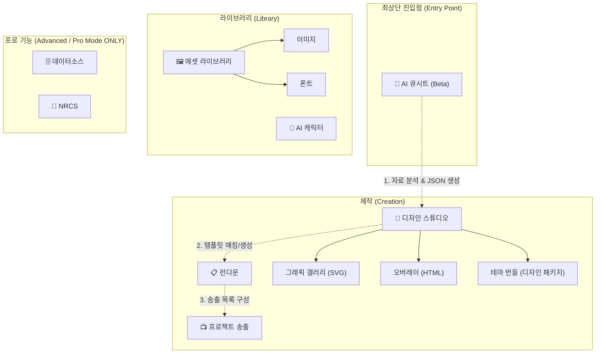
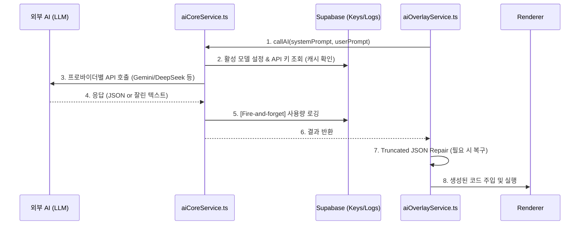
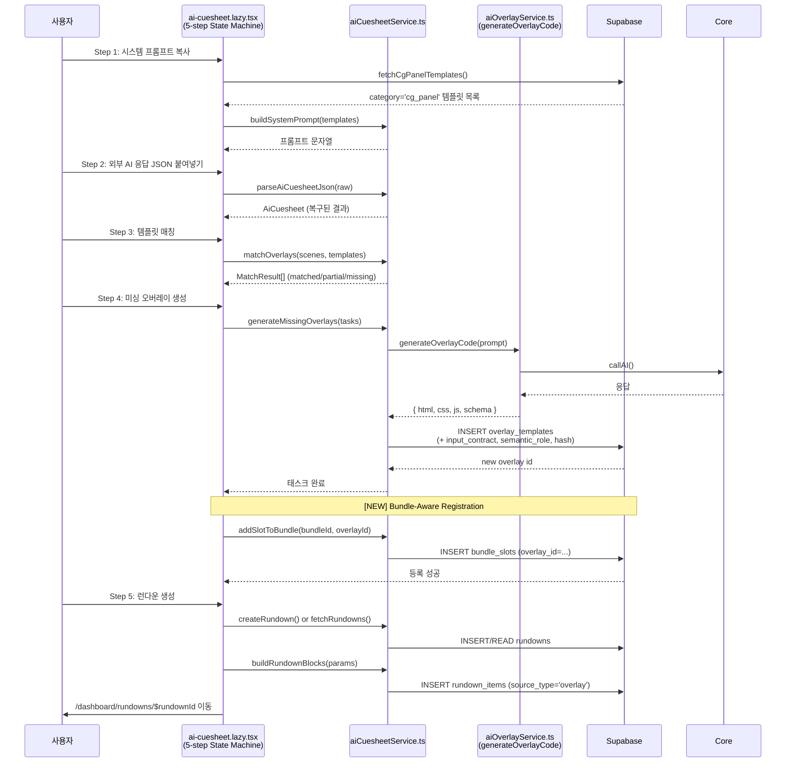
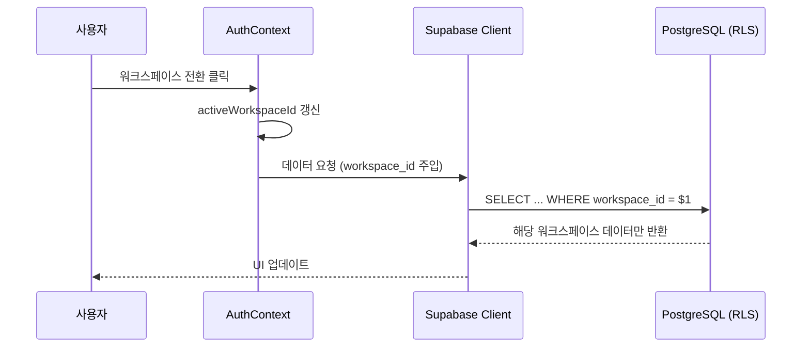
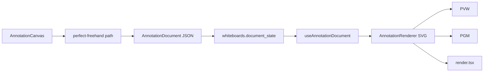
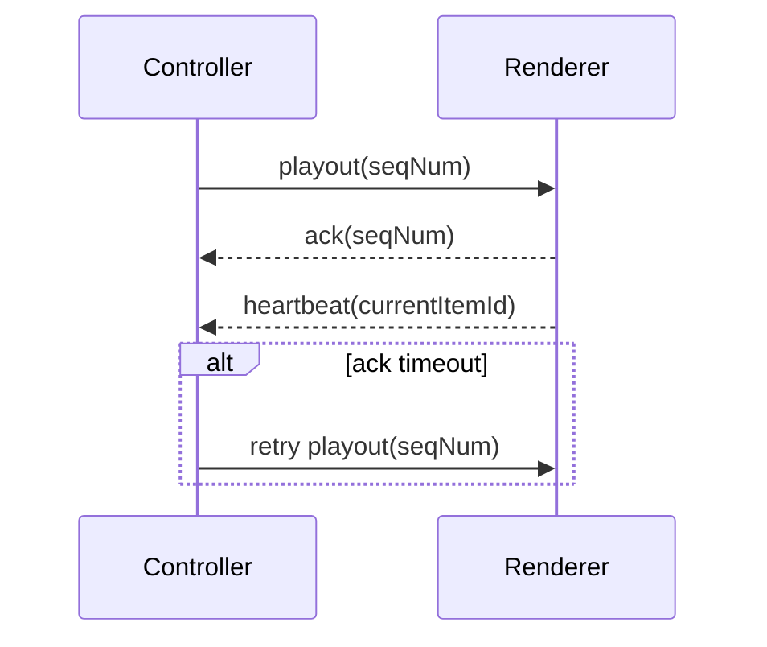

# CONTEXT

## 🎯 프로젝트 목적 및 핵심 철학
**WebCG-K**는 기존의 전문가 전용/단일 워크플로우에 갇혀 있던 방송용 그래픽 송출 시스템(CasparCG 기반)을 **"사용자 친화적이고 자동화된(AI-Driven) 워크플로우"**로 재해석하는 프로젝트입니다.

### 핵심 멘토링 원칙 (ADR - Architecture Decision Records)
- **Progressive Disclosure (점진적 공개)**: 처음 사용하는 스트리머나 초보 유저는 가장 직관적인 기능(`AI 큐시트`, `디자인 스튜디오`)만 보게 하며, 데이터 연동 같은 복잡한 기능은 `Pro Mode` 토글을 통해 필요할 때만 노출합니다.
- **구조와 표현의 분리 (Design Tokens)**: 개별 템플릿에 색상을 하드코딩하지 않고 CSS 변수를 통해 테마(Bundle)를 주입하는 런타임 렌더링 방식을 채택합니다.
- **Zone-Aware Prompting (공간 인지 프롬프트)**: AI에게 단순한 '디자인'이 아닌, 렌더러 상의 실제 물리적 좌표(x, y)와 크기(w, h)를 주입하여 생성 오차를 최소화하고 반응형 레이아웃을 강제합니다.
- **다국어 대응 (Internationalization)**: `react-i18next` 기반으로 모든 UI를 한국어/영어 대응하며, 동적 단계 레이블 등은 `labelKey` 패턴을 통해 일관성을 유지합니다.

---

## 🏗 전체 애플리케이션 아키텍처 및 내비게이션 (v2)

기존 평면적인 10개 메뉴를 3-Tier 계층으로 그룹화하여, 사용자가 **"제작 ➔ 관리 ➔ 송출"**이라는 라이프사이클에 자연스럽게 녹아들도록 재배치했습니다.

### 📁 파일 시스템 매핑 (Filesystem Mapping)
아키텍처 상의 논리적 그룹은 실제 코드베이스에서 아래 경로로 구현되어 있습니다.
- **Studio Tier**: `src/routes/dashboard/studio/` (graphics, overlays, bundles)
- **Asset Tier**: `src/routes/dashboard/assets/` (images, fonts)
- **Creation Tier**: `src/routes/dashboard/` (rundown, broadcast)
- **Advanced Tier**: `src/routes/dashboard/data-sources/`

### 판서 레이어 입력/저장 아키텍처 (2026-05-18)
- 판서 레이어는 기존 타임라인 방송 그래픽(Broadcast Graphics) 위에 합성되는 1920x1080 투명 SVG annotation overlay입니다.
- `AnnotationCanvas`는 mouse, pen, touch를 같은 방송 좌표계로 정규화하지만, stroke 지속 조건은 장치별로 분리합니다.
- `useAnnotationDocument`는 `whiteboards.document_state` JSONB를 저장소로 사용하며, 컬럼/schema cache 미준비 상태에서는 임시 document fallback으로 입력 가능성을 우선 보장합니다.
- 영속 저장은 `20260518000002_annotation_document_state.sql` 적용 이후 완전해집니다.

### Realtime Broadcast Delivery 정책 (2026-05-18)
- broadcast 전송은 `sendRealtimeBroadcast()`를 통해 채널 준비 상태를 확인합니다.
- joined WebSocket은 `channel.send()`를 사용하고, 전달 보장이 필요한 playout/stroke/replace/command/ACK 이벤트는 채널 준비 전 `channel.httpSend()`를 명시적으로 사용합니다.
- cursor presence와 heartbeat는 고빈도 손실 허용 이벤트라서 채널 준비 전 REST fallback을 하지 않습니다.

---

## 🏗 AI 큐시트 및 테마 플러그인 데이터 흐름 (Data Flow)

단순히 템플릿 타입(Type) 매칭만으로는 워크스페이스별 디자인(색상, 폰트) 파편화 문제를 막을 수 없습니다. 이를 해결하기 위해 **Bundle을 테마 컨테이너로 격상**시킨 구조입니다.

### AI 큐시트 Phase 2 서비스 아키텍처 (2026-05-07 구현)

### 아키텍처 핵심: `category` 속성에 따른 오버레이 분리
오버레이(Overlay) 컴포넌트는 그 목적에 따라 내부 로직이 완전히 다릅니다. 이들을 `overlay_templates.category`로 명시적 분리하여 워크플로우 꼬임을 방지합니다.

| 카테고리 (Category) | 설명 및 특징 | 주요 렌더링 주체 |
|---|---|---|
| **`widget` (기능성 위젯)** | 외부 API(날씨, 스코어보드)와 강하게 결합. 상시 노출용. | 실시간 Data Fetcher 내부 내장 |
| **`cg_panel` (방송용 자막)** | AI 큐시트 타겟팅용. 이름표, 인용구 등 데이터 주입용 뼈대. | `replicant_data`에 의존 |

### Overlay PVW/PGM Runtime Isolation (2026-05-18)

PVW, PGM, `render.tsx`는 같은 HTML 오버레이를 렌더해도 각각 별도 iframe runtime입니다. 타이머, CSS animation, WAAPI animation은 iframe 생성 시점이 달라지면 상태가 자연스럽게 갈라집니다.

현재 정책:
- PVW: `animation_state === "preview" && !is_active`
- PGM/render: `is_active === true`

이 정책은 PGM으로 TAKE된 오버레이를 PVW에서 숨겨 상태ful 방송 그래픽(Broadcast Graphics)의 runtime drift를 운영 화면에 중복 노출하지 않습니다. 장기적으로는 SDK가 `takeAt`, `takeSeq`, clock offset, lifecycle event, state snapshot 계약을 제공해야 합니다.

### Broadcast Annotation Layer (2026-05-18)

판서 레이어는 독립 화이트보드 앱이 아니라 기존 타임라인 방송 그래픽(Broadcast Graphics) 위에 투명하게 합성되는 텔레스트레이션 소스입니다. 기본 stroke 색상은 흰색이며, 내부 payload 호환을 위해 `sourceType: "whiteboard"`는 유지합니다.

`AnnotationCanvas`가 1920x1080 좌표계로 입력을 정규화하고 `perfect-freehand`로 부드러운 stroke path를 생성합니다. `useAnnotationDocument`는 `whiteboards.document_state` JSONB와 Supabase Realtime broadcast를 묶고, PVW/PGM/render는 `RendererWhiteboard -> AnnotationRenderer` 경로로 같은 투명 SVG 레이어를 합성합니다.

### Annotation Cursor & Render-backed Drawing (2026-05-18)

컨트롤러 판서 탭에서 편집 화면을 열면 현재 `sessionId`를 넘기고, 에디터는 `/render?hideAnnotation=1&passive=1`을 배경 iframe으로 사용합니다. 배경 render는 판서 레이어를 숨기므로 로컬 판서와 중복되지 않고, passive 모드는 ACK/heartbeat/render_state를 보내지 않습니다.

판서 에디터의 pointer move는 `annotation:${whiteboardId}` broadcast cursor event로 전달됩니다. 실제 render의 `RendererWhiteboard`는 이를 펜 모양 SVG 커서로 표시하고, 1.5초 동안 새 이벤트가 없으면 자동으로 숨깁니다.

---

## 🏢 다중 워크스페이스 및 권한 아키텍처 (Workspace Management)

프로젝트 규모 확장에 따라 단일 사용자 구조에서 **다중 워크스페이스(Workspace) 기반의 협업 구조**로 전환되었습니다.

### 🔐 Auth & Workspace Flow
- **AuthContext**: 사용자의 로그인 상태뿐만 아니라, 현재 활성화된 `activeWorkspaceId`를 전역 관리합니다.
- **Workspace Switching**: 사용자가 대시보드 상단에서 워크스페이스를 전환하면 `setActiveWorkspace`를 통해 Context 값이 변경되고, 관련 모든 데이터(`rundowns`, `bundles` 등)가 해당 ID로 필터링되어 리로딩됩니다.
- **Security (RLS)**: Supabase의 Row Level Security를 통해, 자신의 워크스페이스에 속하지 않은 데이터에 대한 접근을 DB 레벨에서 원천 차단합니다.

---

## 🎨 방송 판서 레이어 아키텍처 (perfect-freehand + JSON document)

방송 중 텔레스트레이터 판서를 기존 타임라인 방송 그래픽(Broadcast Graphics) 위에 합성하기 위해, 무거운 협업 에디터 SDK 대신 작은 stroke engine과 JSON 문서 모델을 사용합니다. 데이터는 `whiteboards.document_state`에 저장되고, PVW/PGM/render는 같은 투명 SVG 렌더러를 공유합니다.

### 판서 핵심 설계 규칙 (Rule Set)
1. **기본 흰색 stroke**: 검은 보드가 아니라 방송 영상/그래픽 위에 얹히는 판서이므로 `#ffffff`가 기본 색상입니다.
2. **고정 송출 좌표계**: 모든 pointer 입력은 `1920x1080`으로 정규화합니다.
3. **투명 합성**: renderer는 배경을 그리지 않고 SVG path만 absolute overlay로 합성합니다.
4. **기존 payload 호환**: 내부 `sourceType: "whiteboard"`는 유지해 PVW/PGM/render 타임라인 경로를 깨지 않습니다.

## Broadcast Source Contract 정규화 (2026-05-18)

PVW, PGM, `render.tsx`는 `normalizeBroadcastSourceData()`를 통해 같은 source contract를 해석합니다. 이 모듈은 오버레이 HTML/CSS/JS가 최상위, `payload`, `source_code` 어디에 있든 동일한 `overlay` 결과로 정규화하고, 세 출력 경로는 `BroadcastHtmlOverlay`를 공유합니다.

**Why**: 방송 그래픽(Broadcast Graphics) 송출에서는 미리보기와 실제 출력이 같은 데이터 계약을 사용해야 합니다. 계약 해석을 각 화면에 중복시키면 작은 스키마 차이만으로 PVW/PGM/render가 갈라집니다.

## ACK/Heartbeat State Convergence (2026-05-18)

Controller와 renderer는 이제 `broadcast:${sessionId}` topic에서 playout, ACK, heartbeat를 함께 교환합니다. Controller는 `seqNum`별 pending queue를 유지하고, ACK가 900ms 안에 도착하지 않으면 최대 2회 같은 payload를 재전송합니다.

**ADR**: Supabase Broadcast가 fire-and-forget인 점을 ACK retry로 보완하되, 무한 재전송은 피하고 2회로 제한했습니다. 운영 화면의 중복 송출 위험보다 renderer가 뒤처진 상태를 짧게 복구하는 이점이 더 큽니다.
