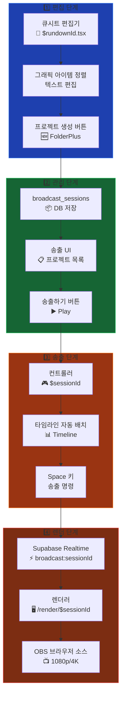
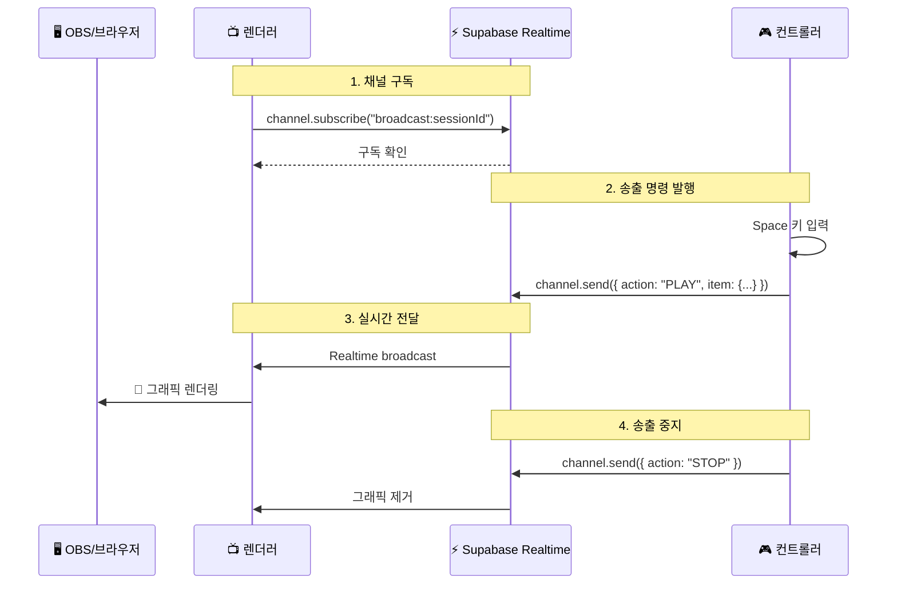
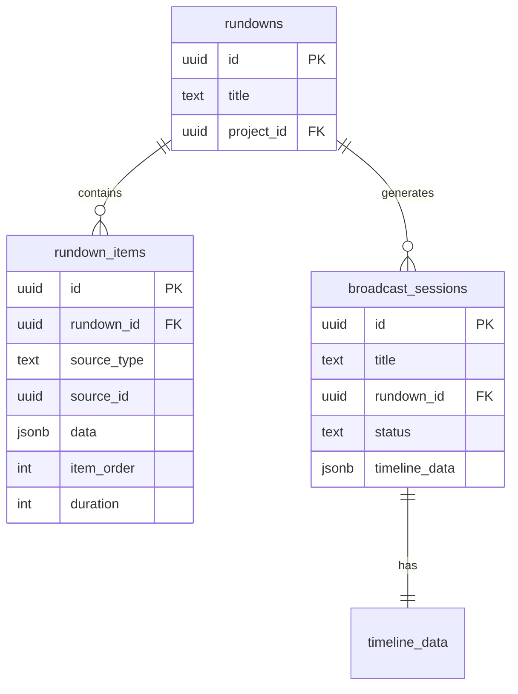
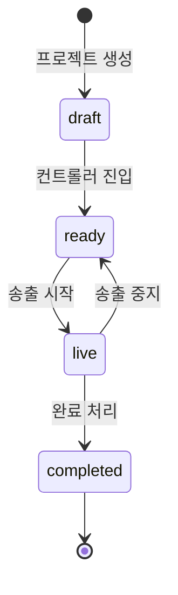

# Phase 9: 프로젝트 기반 송출 시스템 설계

> **작성일**: 2026-02-06  
> **상태**: 구현 진행 중

---

## 1. 개요

### 1.1 목적

큐시트(런다운) 편집기에서 정리한 그래픽 아이템 시퀀스를 **"프로젝트"**로 변환하고, 
이를 송출 컨트롤러에서 타임라인에 자동 배치하여 **Supabase Realtime**을 통해 
외부 렌더러(OBS 브라우저 소스)에 실시간 송출하는 전체 워크플로우를 구축합니다.

### 1.2 핵심 문제

기존 시스템의 한계점:

| 문제 | 설명 |
|------|------|
| **스토어 격리** | TanStack Store는 같은 브라우저 탭/창 내에서만 상태 공유 가능 |
| **OBS 연동 불가** | OBS 브라우저 소스는 별도 프로세스이므로 직접 스토어 공유 불가 |
| **세션 컨텍스트 없음** | 렌더러가 어떤 세션/프로젝트를 렌더링해야 하는지 알 수 없음 |

---

## 2. 아키텍처 설계

### 2.1 전체 시스템 흐름



### 2.2 Supabase Realtime 통신 구조



### 2.3 데이터 흐름



---

## 3. 라우팅 구조

### 3.1 URL 패턴

| 경로 | 목적 | 설명 |
|------|------|------|
| `/dashboard/rundowns/$rundownId` | 큐시트 편집기 | 그래픽 아이템 정렬 및 텍스트 편집 |
| `/dashboard/broadcast` | 프로젝트 목록 | 생성된 프로젝트 관리, 송출 시작 |
| `/controller/$sessionId` | 📍 **NEW** 세션 컨트롤러 | 타임라인 조작, Realtime 발행 |
| `/render/$sessionId` | 📍 **NEW** 세션 렌더러 | Realtime 구독, 그래픽 렌더링 |
| `/render` | 기존 렌더러 | 하위 호환성 유지 |

### 3.2 OBS 브라우저 소스 URL

```
http://localhost:3000/render/{session-id}?resolution=1080p
http://localhost:3000/render/{session-id}?resolution=4k
```

**특징:**
- URL만 있으면 **누구나** 해당 세션의 그래픽을 실시간으로 볼 수 있음
- 인증 불필요 (Broadcast 채널 특성)
- 같은 세션 ID로 여러 OBS/브라우저가 동시 수신 가능

---

## 4. 데이터베이스 스키마

### 4.1 broadcast_sessions 테이블

```sql
CREATE TABLE broadcast_sessions (
    id UUID PRIMARY KEY DEFAULT gen_random_uuid(),
    title TEXT NOT NULL,
    description TEXT,
    rundown_id UUID NOT NULL REFERENCES rundowns(id) ON DELETE CASCADE,
    created_by UUID NOT NULL REFERENCES auth.users(id),
    created_at TIMESTAMPTZ DEFAULT now(),
    updated_at TIMESTAMPTZ DEFAULT now(),
    status TEXT DEFAULT 'draft' 
        CHECK (status IN ('draft', 'ready', 'live', 'completed')),
    timeline_data JSONB DEFAULT '[]'::jsonb
);
```

### 4.2 상태 흐름



### 4.3 timeline_data 구조

```typescript
interface TimelineBlockData {
    id: string;           // rundown_item.id
    name: string;         // 표시 이름
    trackId: number;      // 트랙 번호 (기본: 1)
    startPosition: number; // 시작 위치 (픽셀)
    width: number;        // 블록 너비 (duration * 10)
    source_type: "image" | "graphic" | "template";
    source_id: string;    // 원본 에셋 ID
    data: any;            // 그래픽 요소 데이터
    segment_id?: string;  // 🆕 세그먼트 소속 (Nested Sequence Tab)
}
```

### 4.4 broadcast_segments 테이블 (🆕 2026-04-16)

> NRCS 연동 시 뉴스 아이템별 CG를 세그먼트로 그룹핑하기 위한 테이블.
> Premiere Nested Sequence 탭 패턴의 데이터 백엔드.

```sql
CREATE TABLE broadcast_segments (
    id UUID PRIMARY KEY DEFAULT gen_random_uuid(),
    session_id UUID NOT NULL REFERENCES broadcast_sessions(id) ON DELETE CASCADE,
    cuesheet_item_id UUID REFERENCES nrcs_cuesheet_items(id) ON DELETE SET NULL,
    label TEXT NOT NULL,
    reporter TEXT,
    slug TEXT,
    segment_order INT NOT NULL DEFAULT 0,
    color TEXT DEFAULT '#3b82f6',
    status TEXT DEFAULT 'idle' CHECK (status IN ('idle', 'active', 'done')),
    created_at TIMESTAMPTZ DEFAULT now(),
    updated_at TIMESTAMPTZ DEFAULT now()
);
```

---

## 5. Realtime 메시지 프로토콜

### 5.1 채널 명명 규칙

```
broadcast:{sessionId}
```

예: `broadcast:abc123-def456-ghi789`

### 5.2 메시지 타입

```typescript
interface BroadcastPayload {
    action: "PLAY" | "STOP" | "NEXT";
    item?: {
        id: string;
        name: string;
        trackId: number;
        color?: string;
        transitionIn?: "cut" | "fade";
        sourceData?: {
            elements?: GraphicElement[];
            canvas_size?: { width: number; height: number };
        };
    };
}
```

### 5.3 사용 예시

**컨트롤러 (발행자):**
```typescript
const channel = supabase.channel(`broadcast:${sessionId}`);

// 그래픽 송출
await channel.send({
    type: "broadcast",
    event: "playout",
    payload: {
        action: "PLAY",
        item: { id: "block-1", name: "뉴스 자막", ... }
    }
});

// 송출 중지
await channel.send({
    type: "broadcast",
    event: "playout",
    payload: { action: "STOP" }
});
```

**렌더러 (구독자):**
```typescript
const channel = supabase.channel(`broadcast:${sessionId}`)
    .on("broadcast", { event: "playout" }, (payload) => {
        switch (payload.payload.action) {
            case "PLAY":
                setActiveGraphic(payload.payload.item);
                break;
            case "STOP":
                setActiveGraphic(null);
                break;
        }
    })
    .subscribe();
```

---

## 6. 구현 진행 상황

### 6.1 완료된 작업

- [x] DB 마이그레이션 (`broadcast_sessions`)
- [x] 큐시트 편집기: "송출" → "프로젝트 생성" 버튼 변경
- [x] 송출 UI: 프로젝트 목록 표시
- [x] 컨트롤러 `$sessionId` 라우트 생성
- [x] BroadcastButton Realtime 발행 로직

### 6.2 진행 중

- [ ] 렌더러 `$sessionId` 라우트 생성 + Realtime 구독
- [ ] 문서 업데이트

---

## 7. 파일 변경 요약

| 파일 | 변경 유형 | 설명 |
|------|----------|------|
| `migrations/202602060001_broadcast_sessions.sql` | 🆕 NEW | 세션 테이블 생성 |
| `routes/dashboard/rundowns/$rundownId.tsx` | ✏️ MODIFY | 프로젝트 생성 버튼/로직 |
| `routes/dashboard/broadcast.tsx` | ✏️ MODIFY | 프로젝트 목록 UI |
| `routes/controller/$sessionId.tsx` | 🆕 NEW | 세션 기반 컨트롤러 |
| `routes/render/$sessionId.tsx` | 🆕 NEW | 세션 기반 렌더러 |
| `components/Controller/BroadcastButton.tsx` | ✏️ MODIFY | Realtime 발행 |

---

## 8. 참고 자료

- [Supabase Realtime - Broadcast](https://supabase.com/docs/guides/realtime/broadcast)
- [TanStack Router - Dynamic Routes](https://tanstack.com/router/latest/docs/guide/routes)
