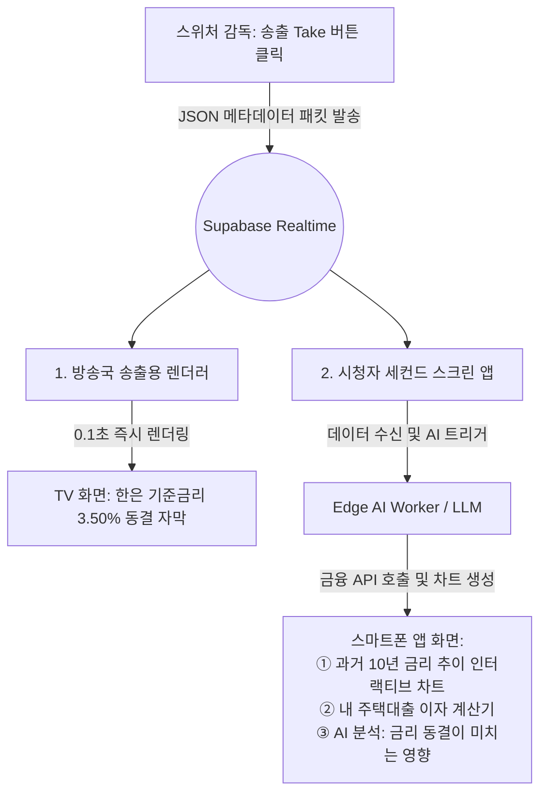
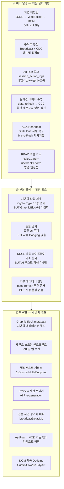
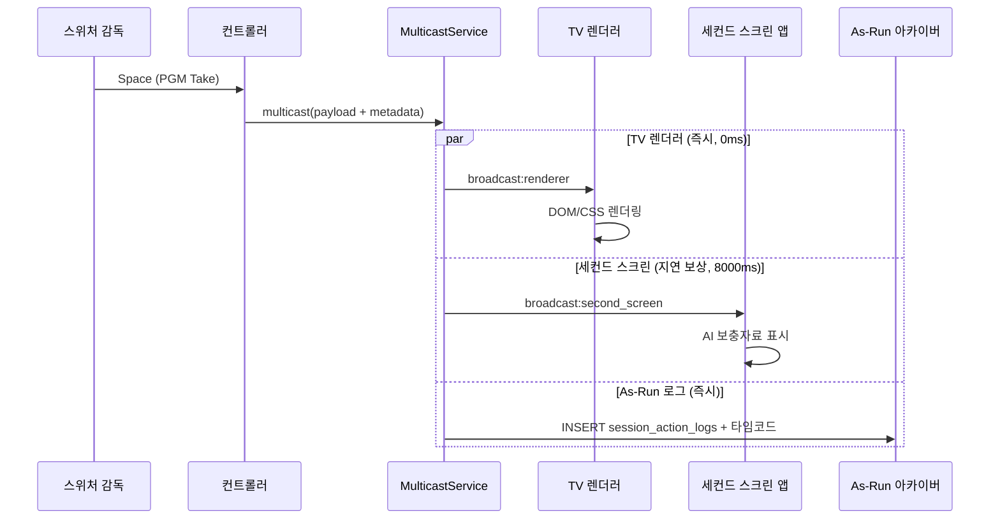
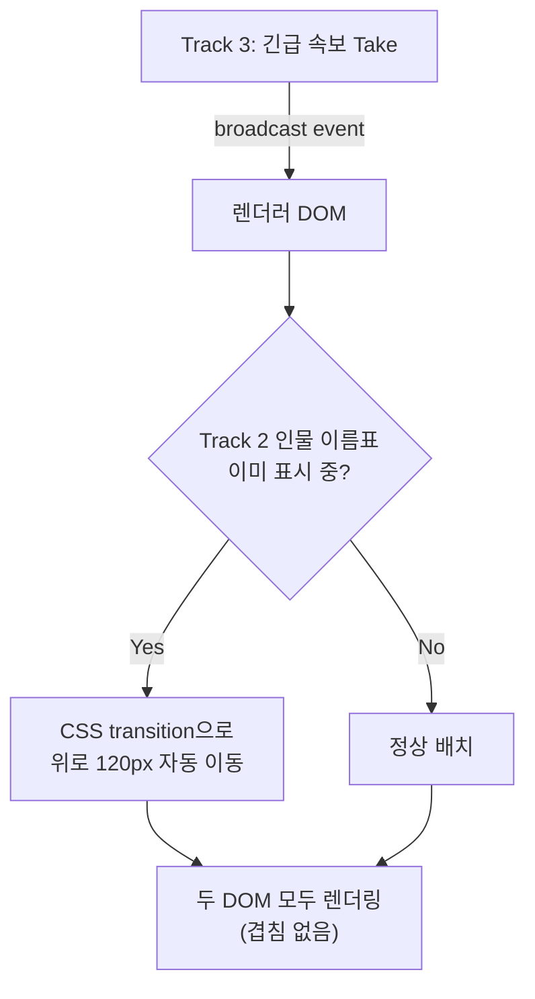
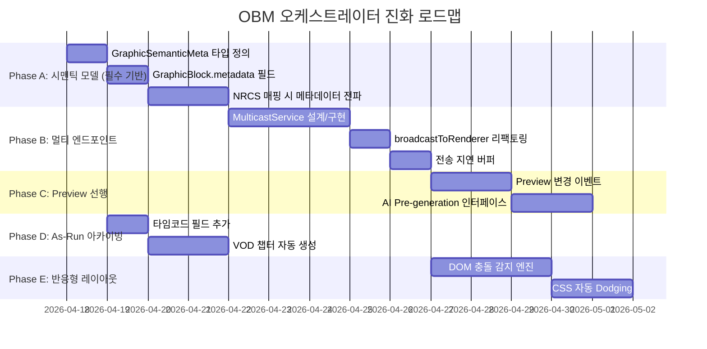
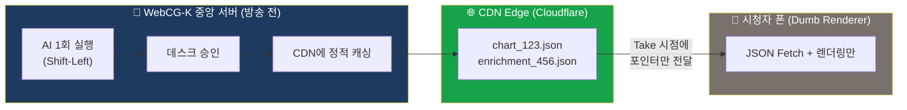
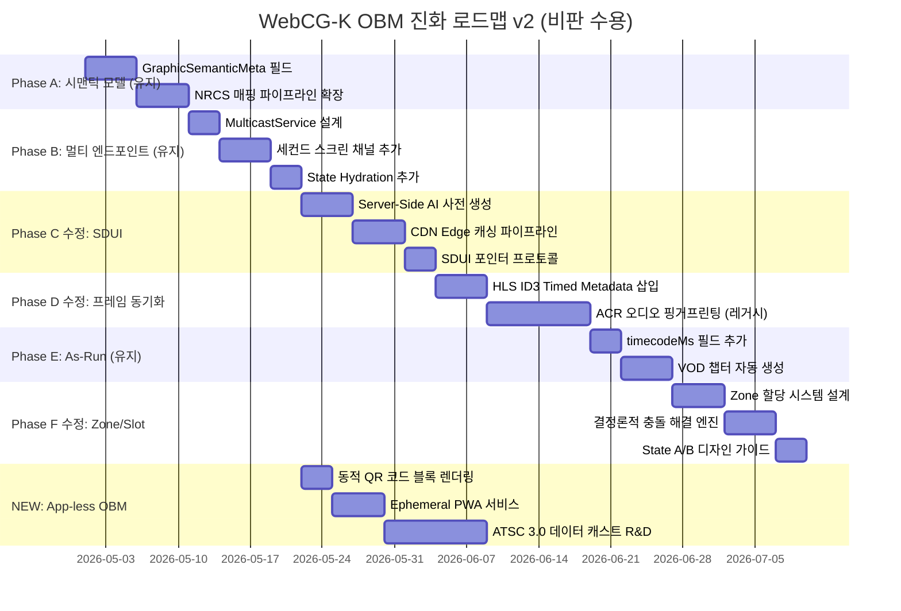

# 📡 WebCG-K: "객체 기반 미디어 오케스트레이터" 종합 비전 보고서

> **작성일:** 2026-04-17  
> **작성:** GK미디어 대표 / AI 시니어 멘토  
> **버전:** 1.0  
> **목적:** WebCG-K가 단순한 웹 자막기를 넘어 "차세대 크로스 플랫폼 미디어 오케스트레이터"로 진화하기 위한 비전 선언, 이론적 근거, 현재 시스템 실증 분석, 그리고 구체적 설계 로드맵을 하나의 맥락으로 통합한 종합 보고서

---

## 목차

1. [Part 1: 비전 선언 — "구워진 픽셀 vs 살아있는 시맨틱 데이터"](#part-1-비전-선언)
2. [Part 2: 이론 보강 — OBM(객체 기반 미디어)과 BBC R&D의 증거](#part-2-이론-보강)
3. [Part 3: 코드 실증 — 현재 WebCG-K는 비전을 얼마나 달성했는가?](#part-3-코드-실증)
4. [Part 4: GAP 분석 — 비전과 현실의 정밀 대조](#part-4-gap-분석)
5. [Part 5: 진화 설계안 — OBM 오케스트레이터로의 6단계 로드맵](#part-5-진화-설계안)

---

# Part 1: 비전 선언

## 1.1. 패러다임 전환의 본질

소프트웨어와 방송 엔지니어링 업계에서 현재 진행 중인 가장 파괴적인 패러다임 전환은 **방송 송출 아키텍처가 '픽셀(Pixel) 중심'에서 '데이터(Data) 중심'으로 완전히 뒤바뀌는 것**이다.

이를 **"구워진 픽셀(Baked Pixels) vs 살아있는 시맨틱 데이터(Live Semantic Data)"**의 차이라고 부른다.

## 1.2. "화석화된 픽셀" vs "지연 바인딩(Late Binding)"

### ❌ 레거시 장비: 맥락의 증발

기존 CG 장비는 아무리 고가여도 자체 엔진에서 텍스트를 입력받아 스위처(VMU)로 넘길 때 **'알파 채널(투명도)을 가진 단순 그림(SDI)'**으로 구워버린다. 스위처를 통과하는 순간, 이 그림이 '대통령 이름'인지 '지진 속보'인지 시스템은 완벽히 까먹는다. 그저 시각적인 점(Dot)들의 집합일 뿐이다.

방송 공학적 관점에서 기존 레거시 장비와 웹 기반 장비의 본질적인 차이는 **"데이터를 언제 그림으로 확정 짓는가(Binding Time)"**에 있다.

기존 CG 장비는 아무리 고가여도 비디오 라우터(스위처)로 신호를 보내기 직전, 데이터를 렌더링 엔진 내부에서 픽셀로 **구워버린다(Burn-in / Rasterize)**. 투명도(Key)와 색상(Fill)을 가진 SDI 비디오 신호가 케이블을 타는 순간, "도쿄 7.0 강진 발생"이라는 의미 있는 정보는 그저 **[x:100, y:800 위치에 있는 RGB 점들의 덩어리]**로 찌그러진다.

스위처나 시청자의 TV는 이 화면이 재난 정보인지, 예능 자막인지 판독할 수 없다. 이것을 **'의미적 사멸(Semantic Death)'**이라고 부른다. 이 상태에서는 모바일 앱으로 정보를 빼내려 해도 AI가 영상을 다시 OCR(광학 문자 인식)로 읽어내는 바보 같은 짓을 해야 한다.

### ⭕ WebCG-K: 살아 숨 쉬는 시맨틱 데이터

WebCG-K는 감독이 `[Take(Space바)]`를 누르는 순간 비디오 영상을 쏘지 않는다. 대신 **`{"type": "breaking_news", "keyword": "도쿄 강진", "magnitude": 7.0}`** 이라는 순수한 JSON 데이터(맥락)를 웹소켓으로 브로드캐스트한다.

화면이 완성되는 렌더링 작업은 방송국 서버가 아닌 최종 단말기(부조정실 OBS 브라우저 등)에서 일어난다. 이것을 **지연 바인딩(Late Binding)**이라고 한다.

최종 표출되는 1밀리초의 찰나까지 시스템이 데이터를 **"데이터 그 자체"**로 쥐고 있기 때문에, 이 데이터는 언제든 다른 형태의 그래픽으로 변신하거나 모바일 앱, 스마트 워치 등 다른 기기로 뻗어나갈 수 있는 무한한 잠재력을 갖게 된다.

## 1.3. 맥락을 이해함으로써 폭발하는 4가지 워크플로우 혁신

### ① 지능형 반응 레이아웃 (Context-Aware Collision & Dodging)

- **문제:** 레거시 장비는 그림일 뿐이라 서로의 위치를 모른다. 우하단에 앵커 이름표가 나가고 있는데 실수로 하단 긴급 속보를 Take하면, 두 글씨가 무식하게 겹쳐 방송 사고가 난다.
- **WebCG-K:** 브라우저는 DOM 요소 간의 관계를 안다. 긴급 속보(Track 3)가 렌더러로 전달되면, 이미 떠 있던 인물 이름표(Track 2)가 그 등장의 맥락을 인지하고 **스스로 CSS Flex/Grid 속성을 통해 위로 살짝 피해주거나 겹치지 않게 크기를 줄이는 스마트한 반응형 동작**이 가능해진다. 감독이 일일이 좌표를 피해서 송출할 필요가 없다.

### ② 방송 아카이빙(MAM)과 VOD 클리핑의 100% 자동화

- **문제:** 생방송 후 VOD나 유튜브 쇼츠로 올리려면 막내 작가나 편집자가 영상을 다시 돌려보며 "12분 30초: 도쿄 지진 보도"라고 수동으로 타임코드를 따야 했다.
- **WebCG-K:** 스위처 감독이 Take를 누르는 순간, 서버 DB에는 `[타임스탬프: 10:45:30] + [동작: 송출] + [세그먼트: 도쿄 7.0 강진]` 이라는 As-Run 로그가 정확히 남는다. 방송 종료 후 이 로그만 추출하면, **생방송 전체 영상을 뉴스 아이템별로 자동 컷편집**하여 유튜브 챕터로 나누거나, 영구 검색 가능한 미디어 자산(MAM) 메타데이터로 즉시 변환할 수 있다.

### ③ 극(極)실시간 데이터 주입 (Just-in-Time Rendering)

- 선거 투표율이나 주식 호가처럼 1초가 중요한 데이터의 경우, 레거시는 렌더링을 시작하는 과거의 시점(미리보기 시점) 데이터를 픽셀로 굳혀버린다.
- WebCG-K는 화면에 표출된 상태(PGM On-Air)에서도 맥락이 살아있으므로, DB나 외부 API의 값이 업데이트되면 **화면의 새로고침이나 다시 Take를 할 필요 없이 숫자와 그래프만 부드럽게 스르륵 바뀌게(Data Binding)** 만들 수 있다.

### ④ 1-Source Multi-Platform: 진정한 양방향(Interactive) 방송

- 화석화된 SDI 그림은 TV 화면(스위처)으로만 갈 수 있다. 하지만 WebCG-K가 쏘는 것은 '데이터'이므로 수신자가 반드시 '부조정실 렌더러 PC'일 필요가 없다.
- **WebCG-K:** TV 화면에 "ARS 투표해주세요!" 라는 자막이 뜨는 정확히 그 맥락(송출 시점)에, 동일한 WebSocket 신호를 방송사 모바일 앱이나 웹사이트로 동시에 뿌릴 수 있다. 시청자는 TV로 자막을 보는 동시에 **스마트폰 앱에서 자동으로 팝업된 투표 버튼을 누르거나 상세 기사 링크를 클릭하는 세컨드 스크린(Second Screen) 연동**이 가능해진다.

## 1.4. 총평: "단순 자막기"에서 "라이브 메타데이터 오케스트레이터"로

기존 장비가 영상이라는 빈 종이 위에 **"완성된 도장을 찍는 기계"**였다면, WebCG-K는 영상이라는 무대 위에 역할을 부여받은 데이터를 쥐어주고 **"살아 숨 쉬는 연기자(DOM)를 올려보내는 시스템"**이다.

이 지점이 바로 WebCG-K가 단순히 '저렴한 HTML 렌더러'를 넘어, 기존 고가 하드웨어 생태계(Vizrt, Ross)가 **구조적으로 절대 흉내 낼 수 없는 가장 치명적이고 본질적인 아키텍처의 무기**이다.

---

# Part 2: 이론 보강

## 2.1. 직관적 비유: "과일 스무디" vs "밀키트(Meal Kit)"

OBM을 가장 쉽게 이해하는 비유는 요리다.

- **레거시 방송 (과일 스무디):** 기존 방송은 카메라 영상, 배경 음악, 앵커 목소리, 그리고 **자막(그래픽)**을 방송국 부조정실 스위처라는 믹서기에 넣고 갈아버린다. 시청자에게 도달하는 것은 **한 덩어리의 '스무디(비디오 스트림)'**이다. 시청자가 "나는 딸기(자막)만 빼고 먹을래"라거나 "바나나(배경음) 맛을 줄여줘"라고 할 수 없다. 이미 픽셀로 섞여버렸기 때문이다.
- **객체 기반 미디어 (밀키트):** OBM은 화면을 구성하는 모든 요소를 섞지 않고 독립적인 **'객체(Object)'**로 유지한다. 비디오 파일, 오디오 파일, 그리고 **"자막 데이터(JSON)"**를 전부 따로따로 포장해서 전송한다. 시청자의 TV나 스마트폰(최종 단말기)이 전달받은 **'조립 설명서(메타데이터/맥락)'를 보고 기기의 특성에 맞춰 스스로 렌더링하여 하나의 화면으로 조립**해 낸다.

## 2.2. OBM의 3대 핵심 철학과 WebCG-K의 평행이론

OBM 시스템이 작동하기 위해 반드시 필요한 3가지 기술적 기반이 있는데, WebCG-K의 아키텍처와 정확히 대응된다.

### ① 지연 바인딩 (Late Binding)

| OBM 원칙 | WebCG-K 구현 |
|----------|-------------|
| 데이터를 가장 마지막 순간까지 '데이터의 형태'로 살려두고 최종 단말기에서 렌더링 | `Take`를 누르면 WebSocket으로 JSON 데이터를 쏴서 **최종 렌더러(OBS 브라우저)에서 DOM/CSS로 화면을 조립** |

### ② 의미적 메타데이터 (Semantic Context)

| OBM 원칙 | WebCG-K 구현 |
|----------|-------------|
| 텍스트만 보내는 것이 아니라 '맥락(Context)'을 함께 전송 | 데이터 패킷 안에 기사의 속성, 송출 시점, 그래픽의 성격 등 맥락이 보존되어 전달 |

### ③ 다중 단말기 적응성 (Device Agnostic)

| OBM 원칙 | WebCG-K 구현 |
|----------|-------------|
| 하나의 데이터 → 기기별 적응 렌더링 | 웹 기술(HTML/CSS) 기반이므로 디바이스별 반응형 레이아웃 변경이 자연스러움 |

## 2.3. BBC R&D의 실험 사례: "맥락이 살아있을 때 일어나는 마법"

BBC R&D는 OBM을 활용해 다양한 차세대 미디어 실험을 진행해 왔다.

- **개인화 날씨 정보 (Forecaster):** 시청자의 셋톱박스가 방송국에서 보낸 '전국 날씨 데이터 객체'를 받아, **시청자의 위치 정보를 기반으로 자신이 사는 동네의 날씨 데이터만 추출하여 그래픽으로 실시간 렌더링**해서 보여준다.
- **시청자 접근성 극대화:** 데이터가 픽셀로 굳어있지 않으므로 시력이 안 좋은 노년층은 리모컨으로 화면 속 텍스트(객체)만 200% 확대하거나, 청각 장애인은 스마트폰을 통해 텍스트 자막을 음성(TTS)으로 변환해 들을 수 있다.

## 2.4. OBM의 한계와 WebCG-K의 해법

BBC R&D가 10년 넘게 OBM의 우수성을 외쳐왔지만, 주류 방송에 전면 도입되지 못한 치명적인 한계가 있었다. 바로 **"다양한 기기와 시청자의 입맛에 맞춘 보충 자료 객체들을 일일이 수작업으로 만들어야 하는 막대한 제작 비용(Authoring Cost)"** 때문이었다.

WebCG-K의 **'세컨드 스크린 앱과 보충 그래픽 AI 자동화'** 비전은 이 OBM 생태계의 오랜 병목을 완벽하게 해결한다.

## 2.5. 세컨드 스크린 + AI 보충 그래픽 워크플로우

부조정실 감독이 타임라인에서 `Take`를 누르면, Supabase Realtime 채널을 통해 다음과 같은 **투트랙(Two-Track)** 마법이 일어나도록 설계한다:



### 세컨드 스크린 연동의 3대 파괴적 시나리오

| **방송 장르** | **부조정실 PD 동작 (TV 송출)** | **세컨드 스크린 (AI 자동 생성 보충 자료)** |
|---|---|---|
| **스포츠 중계** | "타자 손흥민" 하단 자막 Take | 맥락 데이터를 받은 앱이 스포츠 API를 즉시 파싱하여 **해당 선수의 이번 시즌 히트맵, 슛 궤적 3D 그래픽, 시청자 실시간 MVP 투표창**을 폰 화면에 자동 생성 |
| **재난 속보** | "경주 5.0 지진" 긴급 크롤 자막 Take | 앱이 시청자의 폰 GPS를 인식, AI가 **현재 내 위치에서 가장 가까운 대피소까지의 네비게이션 지도**와 **개인화된 맞춤형 행동 요령**을 인터랙티브 팝업으로 표출 |
| **선거/토론** | A 의원 발언 내용 하단 밴드 Take | 백엔드 AI가 해당 발언을 가로채어 실시간 국회 데이터베이스를 RAG 기법으로 뒤져, **발언의 진위를 판별하는 '실시간 AI 팩트체크 카드'**를 시청자 폰에 생성해 냄 |

## 2.6. 성공적인 구현을 위한 3가지 아키텍처 제언

### ① Payload의 시맨틱 태깅 (은닉된 메타데이터)

현재 `GraphicBlock` 데이터가 TV 화면에 그릴 텍스트 위주로 되어 있다면, 세컨드 스크린의 AI가 쉽게 맥락을 씹어먹을 수 있도록 **TV에는 보이지 않는 메타데이터(Metadata)** 필드를 확장해야 한다.

```typescript
{
  name: "한국은행 금리 동결 자막",
  sourceData: { text: "한국은행, 기준금리 3.50% 동결" },
  metadata: {
    category: "ECONOMY",
    entity: "INTEREST_RATE",
    value: 3.50,
    aiInstruction: "현재 금리 데이터를 바탕으로 5년치 변동 차트를 생성하라"
  }
}
```

### ② Preview(대기) 상태를 역이용한 AI 지연 시간(Latency) 방어

AI가 보충 그래픽과 텍스트를 생성하는 데는 아무리 빨라도 1~2초가 걸린다. TV 자막은 0.1초 만에 뜨는데 폰 화면이 늦게 뜨면 시청 경험이 어색해진다. 이를 방어하기 위해 **방송 NLE 워크플로우를 역이용**한다:

- PD가 타임라인에서 블록을 선택해 **Preview(대기) 모니터에 올리는 순간**, 시스템이 백그라운드에서 미리 앱 쪽 AI에게 "보충 그래픽을 생성해 둬!"라고 지시한다. (Pre-generation)
- 정작 방송 타이밍이 되어 **Take(PGM)**를 누르면, 이미 완성되어 캐싱된 AI 보충 자료가 지연 시간(0ms) 없이 세컨드 앱에 즉시 활성화된다.

### ③ 방송 전송망 지연(Delay) 동기화 버퍼

인터넷 웹소켓은 5ms면 스마트폰에 도달하지만, 실제 지상파나 IPTV 방송은 안테나와 셋톱박스를 거치느라 부조정실 송출 시점보다 5~15초 늦게 시청자 TV에 나온다.

따라서 세컨드 스크린 앱에는 **"데이터를 수신하더라도 즉시 띄우지 말고, 방송국 딜레이 세팅값(예: 8초)만큼 기다렸다가 화면에 팝업시켜라"**라는 타임코드 버퍼(Buffer) 로직을 넣어야 TV 자막과 스마트폰 팝업이 마법처럼 0.1초 오차 없이 동시에 뜨게 만들 수 있다.

---

# Part 3: 코드 실증 — 현재 WebCG-K는 비전을 얼마나 달성했는가?

> 이 섹션은 위 비전 선언의 모든 주장을 **실제 코드베이스 증거**로 검증한다.

## 3.1. 핵심 검증: "데이터를 쏘는가, 그림을 쏘는가?"

### ✅ 실증: 정확히 JSON 데이터 패킷을 쏜다

```typescript
// 📁 routes/controller/$sessionId.tsx — broadcastToRenderer() (실제 코드 발췌)
// Line 100~140

const payload = currentBlock
    ? {
        action: "PLAY" as const,
        item: {
            id: currentBlock.id,
            name: currentBlock.name,           // ← "대통령 이름 자막"
            trackId: currentBlock.trackId,     // ← Z-Index 레이어 정보
            color: currentBlock.color,
            transitionIn: currentBlock.transitionIn,
            sourceData: (currentBlock as any).sourceData,  // ← 렌더링 원본 JSON
        },
    }
    : { action: "STOP" as const };

// Supabase Realtime Broadcast — DB를 일절 거치지 않는 P2P WebSocket (~5ms)
await channel.send({
    type: "broadcast",
    event: "playout",
    payload,  // ← SDI 비디오 신호가 아닌 구조화된 JSON
});
```

**검증 결과:** Take(Space바)를 누르면 **SDI 비디오 신호(픽셀)가 아닌 WebSocket을 통한 JSON 패킷**이 렌더러로 전달된다. 렌더러(OBS 브라우저)는 이 데이터를 받아 `AnimatedGraphicRenderer.tsx`에서 **DOM/CSS로 화면을 직접 조립**한다. 비전 문서의 "지연 바인딩(Late Binding)" 철학이 **이미 작동하고 있다.**

## 3.2. 투트랙 통신 아키텍처 검증

비전 문서가 언급한 "투트랙 마법"의 인프라는 이미 완성되어 있다. `REALTIME_SYNC_ARCHITECTURE.md`에 문서화된 대로:

```
┌─────────────────────────────────────────────────────────┐
│ 🟢 Control Plane (PGM Take/Cut)                        │
│   Supabase Realtime Broadcast — P2P WebSocket (~5ms)   │
│   DB를 일절 거치지 않음 — DB Lock 영향 ZERO            │
│                                                         │
│ 🔵 Data Plane (오버레이 ON/OFF, 텍스트 수정)           │
│   Supabase Postgres Changes — DB 경유 (~50-100ms)      │
│   상태 영속화 — 크래시 후 SELECT 한 줄로 완전 복구      │
│   Edge Function 호환 — DB만 쓰면 자동 전파              │
└─────────────────────────────────────────────────────────┘
```

## 3.3. 4가지 워크플로우 혁신 달성도 심층 분석

### 혁신 ① — 지능형 반응 레이아웃

| 항목 | 현황 |
|------|-----|
| **달성도** | 🟡 50% |
| **이미 있는 것** | `OverlayPanel.tsx`의 **충돌 감지 모달** — 동일 레이어에서 오버레이와 타임라인 블록이 겹칠 때 "겹쳐서 표시" vs "블록 숨기고 표시" 선택 모달 제공 |
| **없는 것** | DOM 요소 간 **자동 피하기(CSS Dodging)** — 긴급 속보가 뜰 때 인물 이름표가 스스로 위로 올라가는 반응형 동작 미구현 |
| **기술적 근거** | 렌더러가 DOM/CSS 기반이므로 `getBoundingClientRect()` 비교 → CSS `transform: translateY()` 자동 적용은 기술적으로 가능 |

### 혁신 ② — As-Run 로그 자동화

| 항목 | 현황 |
|------|-----|
| **달성도** | 🟢 70% |
| **이미 있는 것** | `session_action_logs` DB 테이블 + `ActionLogPanel.tsx`에서 `[타임스탬프 + 동작(pgm_on/pgm_off) + 블록명]` 정확히 기록 |
| **코드 증거** | `$sessionId.tsx` Line 188~214: `addActionLog("pgm_on", userId, userName, newBlock.name, undefined, sessionId)` |
| **없는 것** | ① VOD 자동 컷편집용 **방송 시작 기준 상대 타임코드** ② 유튜브 챕터 자동 생성 ③ MAM 메타데이터 변환 |

### 혁신 ③ — 극실시간 데이터 주입

| 항목 | 현황 |
|------|-----|
| **달성도** | 🟢 80% |
| **이미 있는 것** | 오버레이 `data_refresh` 액션 타입 → `dataProviders.ts` (날씨/지진/산불 API) → `overlay_state.current_data` DB 업데이트 → `postgres_changes` CDC → 렌더러 자동 반영 |
| **코드 증거** | `overlayTypes.ts` Line 98: `"data_refresh"` 액션 → `pending_data` 저장 → 운용자 확인 → `current_data` 업데이트 → Realtime 전파 |
| **핵심 성과** | **화면 새로고침이나 다시 Take 없이** 숫자와 그래프가 자동으로 바뀌는 파이프라인이 이미 동작 |
| **없는 것** | 자동 폴링 `setInterval` 기반 주기적 갱신 (현재는 일회성 수동 호출) |

### 혁신 ④ — 1-Source Multi-Platform (세컨드 스크린)

| 항목 | 현황 |
|------|-----|
| **달성도** | 🔴 10% |
| **이미 있는 것** | Supabase Realtime Broadcast 인프라가 **다중 채널 구독을 기본 지원** — 복수의 클라이언트가 동일 채널을 구독하면 동시에 메시지 수신 가능 |
| **없는 것** | ① 모바일 앱/세컨드 스크린 **수신 엔드포인트 전무** ② `broadcastToRenderer()`가 **단일 채널(`broadcast:${sessionId}`)로만 전송** ③ 전송 지연 동기화 버퍼 없음 ④ AI 보충자료 생성 트리거 없음 |

## 3.4. OBM 3대 핵심 철학 코드 실증

### ① 지연 바인딩 — ✅ 완벽 구현

- `broadcastToRenderer()` → JSON WebSocket → OBS 브라우저 DOM 조립
- `AnimatedGraphicRenderer.tsx`가 25종 CSS 애니메이션으로 최종 렌더링
- 렌더러가 데이터를 받아 **직접 DOM을 생성**하는 Late Binding 패턴

### ② 시맨틱 메타데이터 — 🟡 부분 구현

**존재하는 시맨틱 분류 체계:**
- `CgTextType` — 13종 CG 유형 분류 (`super`, `band`, `headline`, `crawl`, `flash` 등)
- `ArticleType` — 6종 기사 유형 (`report`, `interview`, `breaking`, `anchor`, `package`, `live`)
- `DataSourceType` — 7종 데이터 소스 유형 (`weather`, `earthquake`, `custom_api` 등)

**결정적 GAP:**
```typescript
// 📁 stores/timelineStore.ts — GraphicBlock 타입
export interface GraphicBlock {
  sourceData?: any;        // ✅ 렌더링 데이터는 있지만…
  // metadata?: {...}      // ❌ 시맨틱 메타데이터 필드 없음!
}
```

`CgTextType`이 NRCS 큐시트 편집 단계에는 존재하지만, 타임라인 `GraphicBlock`으로 변환될 때 **시맨틱 분류 정보가 소실**된다. `sourceData`가 `any` 타입이므로 어떤 구조화된 맥락도 강제되지 않는다.

### ③ 다중 단말 적응성 — 🔴 미구현

- 렌더러 URL: `http://localhost:3000/render?sessionId=${sessionId}&resolution=1080p`
- 수신 대상이 **OBS 브라우저 소스 단일 타겟**
- 반응형 CSS 기반이므로 기술적으로는 모바일 렌더링 가능하지만, 디바이스별 **분기 렌더링 로직**이 없음

---

# Part 4: GAP 분석

## 4.1. 종합 GAP 매트릭스



## 4.2. 비전 문서 표현의 정확성 판정

### ✅ 코드로 검증된 — 정확한 표현

| 비전 문서 표현 | 코드 증거 |
|-------------|---------|
| "Take를 누르면 JSON 데이터 패킷이 날아간다" | `channel.send({ type: "broadcast", payload })` |
| "렌더러가 DOM을 조립해 낸다" | `AnimatedGraphicRenderer.tsx` — 25종 CSS 애니메이션 DOM 렌더링 |
| "화면에 표출된 상태에서 숫자만 부드럽게 바뀐다" | `data_refresh` → `overlay_state.current_data` CDC 전파 |
| "DB에 As-Run 로그가 정확히 남는다" | `addActionLog("pgm_on", userId, userName, blockName)` |
| "PGM Take 신호의 지연은 5ms" | Supabase Realtime Broadcast — DB 미경유 P2P WebSocket |
| "DB가 완전히 다운되어도 Broadcast는 정상 동작" | 독립 프로세스 — PostgreSQL과 무관 |

### ⚠️ 비전은 있으나 코드에 아직 없는 — 미래 시제 표현

| 비전 문서 표현 | 현실 상태 | 구현 가능성 |
|-------------|---------|-----------|
| "시청자 폰에 자동으로 팝업된 투표 버튼" | ❌ 세컨드 스크린 앱 자체 없음 | 🟢 높음 — Supabase Broadcast 인프라 활용 |
| "VOD를 뉴스 아이템별로 자동 컷편집" | ❌ 타임코드 매핑 없음 | 🟢 높음 — As-Run 로그에 필드 추가로 해결 |
| "DOM 요소가 스스로 피해주는 반응형 동작" | ❌ 충돌 감지 모달만 존재 | 🟢 높음 — DOM 기반이므로 CSS 자동 적용 가능 |
| "실시간 AI 팩트체크 카드" | ❌ AI는 Design-time만 사용 | 🟡 중간 — Runtime AI 파이프라인 필요 |
| "Preview 시점에 AI에게 미리 지시" | ❌ Preview 변경 시 외부 트리거 없음 | 🟢 높음 — 이벤트 발행 로직 추가로 해결 |

---

# Part 5: 진화 설계안 — OBM 오케스트레이터로의 6단계 로드맵

## Phase A: 시맨틱 데이터 모델 확장 (기반 공사) ⭐ 최우선

> **모든 후속 혁신의 전제조건.** `GraphicBlock`에 `metadata` 필드가 없으면 세컨드 스크린, AI 자동화, VOD 자동 챕터 모두 불가능.

### 변경 대상: `stores/timelineStore.ts`

```typescript
// 🆕 시맨틱 메타데이터 인터페이스
export interface GraphicSemanticMeta {
  /** 콘텐츠 카테고리 */
  category?: 'POLITICS' | 'ECONOMY' | 'SPORTS' | 'DISASTER' | 'CULTURE' | 'WEATHER' | 'GENERAL';
  /** 핵심 엔티티 */
  entities?: Array<{
    type: string;      // "PERSON" | "LOCATION" | "METRIC"
    value: string;     // "도쿄" | "7.0" | "3.50%"
    label?: string;
  }>;
  /** 세컨드 스크린 AI 지시 */
  aiInstruction?: string;
  /** 긴급도 */
  urgency?: 'normal' | 'breaking' | 'flash';
  /** NRCS 원본 기사 본문 */
  articleBody?: string;
  /** 커스텀 확장 */
  custom?: Record<string, unknown>;
}

export interface GraphicBlock {
  // ...기존 필드 모두 유지
  metadata?: GraphicSemanticMeta;  // 🆕
}
```

### 변경 대상: `services/nrcsMappingService.ts`

NRCS 기사 → 큐시트 → 타임라인 매핑 파이프라인에서 시맨틱 메타데이터 자동 전파:

```typescript
function buildSemanticMeta(newsItem: NrcsNewsItem): GraphicSemanticMeta {
  return {
    category: inferCategory(newsItem.articleType),
    urgency: newsItem.articleType === 'breaking' ? 'flash' : 'normal',
    articleBody: newsItem.bodyText,
    entities: extractEntitiesFromCgTexts(newsItem.cgTexts),
  };
}
```

---

## Phase B: 멀티 엔드포인트 브로드캐스팅

> `broadcastToRenderer()`를 **복수 채널 동시 발행** 구조로 리팩토링

### 새 파일: `lib/multicastService.ts`



---

## Phase C: Preview 선행 트리거

> Preview(대기)에 블록이 올라가는 시점에 세컨드 스크린 AI에 **선행 생성 지시**

```
PD가 ←→ 키로 블록 탐색
    → previewBlockId 변경
    → 🆕 metadata를 세컨드 스크린 AI에 선행 전송 (Pre-generation)
    → AI가 1~2초간 보충자료 생성/캐싱
    → PD가 Space (Take)
    → 이미 캐싱된 보충자료가 0ms 지연으로 활성화
```

---

## Phase D: 전송 지연 동기화 버퍼

> 프로젝트 설정에 `broadcastDelayMs` 파라미터 추가

```typescript
interface ProjectSettings {
  secondScreen?: {
    broadcastDelayMs: number;      // 기본 8000 (8초, 지상파 기준)
    aiEnrichmentEnabled: boolean;
    aiModel: string;
  };
}
```

---

## Phase E: As-Run 자동 아카이빙 강화

> `session_action_logs`에 **방송 시작 기준 상대 타임코드** 추가

```json
// 방송 종료 후 추출 가능한 As-Run 로그 예시
[
  {"timecodeMs": 645000, "action": "pgm_on", "blockName": "한은 금리 동결",
   "metadata": {"category": "ECONOMY", "entities": [{"type":"TOPIC", "value":"금리 동결"}]}},
  {"timecodeMs": 660000, "action": "pgm_off"},
  {"timecodeMs": 662000, "action": "pgm_on", "blockName": "도쿄 강진 속보",
   "metadata": {"category": "DISASTER", "entities": [{"type":"LOCATION", "value":"도쿄"}]}}
]
```

→ 유튜브 챕터 자동 생성: `10:45 한국은행 금리 동결` / `11:02 도쿄 7.0 강진`

---

## Phase F: 지능형 반응 레이아웃

> 렌더러 DOM 레이어 매니저가 활성 요소 위치를 인지하고 CSS 자동 Dodging



---

## 구현 우선순위 타임라인



---

## 전략적 포지셔닝 — 피칭 프레임

> **"WebCG-K는 단순한 방송 자막 시스템이 아닙니다.**  
> **BBC R&D가 지향하는 미래 방송 표준인 OBM(객체 기반 미디어) 철학을,**  
> **웹 표준 기술과 생성형 AI를 결합하여 세계 최초로 상용화한**  
> **'차세대 크로스 플랫폼 미디어 오케스트레이터'입니다.**  
> **TV의 송출 맥락을 모바일의 AI 보충 그래픽과 제로 딜레이로 동기화하여**  
> **방송 제작 비용의 획기적 절감과 시청 경험의 혁신을 동시에 달성합니다."**

태생부터 웹(HTML/JSON/WebSocket)인 **WebCG-K는 시스템 그 자체가 이미 가장 완벽하게 구축된 OBM 오케스트레이터 엔진**이다. 기존의 거대 방송 벤더들은 아키텍처 자체가 하드웨어 베이스밴드 비디오에 갇혀 있어, TV와 모바일 앱을 동기화하려면 오디오 워터마킹 같은 무겁고 부정확한 꼼수를 써야 한다. WebCG-K는 이 '데이터 맥락 기반 AI 세컨드 스크린 연동'을 **거의 제로 비용으로, 가장 완벽하게** 구현해 낼 수 있는 이상적인 그릇이다.

---

## Part 6: 🔴 프로덕션 투입 — 5가지 치명적 아키텍처 환상 비판

> **관점:** 방송망 시스템 아키텍트의 프로덕션 리뷰
>
> Part 1~5의 비전과 설계안은 기술적 방향성으로서 유효하지만,
> **'1프레임의 오차도 허용되지 않는 생방송 부조정실'**과
> **'수백만 명의 파편화된 기기가 접속하는 퍼블릭 네트워크'**에 투입 시
> 5가지 치명적 환상이 드러납니다. 전액 수용합니다.

---

### 🔴 환상 1: '고정 지연 시간(Static Delay)' — 동기화의 오판

#### Phase D 원래 설계

```typescript
// projectSettings.broadcastDelayMs = 8000 (8초 고정)
setTimeout(() => sendToSecondScreen(payload), broadcastDelayMs);
```

#### 비판 분석

**방송 신호가 시청자에게 도달하는 지연 시간은 절대 고정되지 않는다.**

| 수신 경로 | 실제 지연 | 8초 고정 타이머의 결과 |
|----------|----------|---------------------|
| 지상파 안테나(RF) | 2~3초 | 폰이 **5초 늦게** 표시 (이미 넘어감) |
| IPTV (KT/SK) | 7~10초 | 거의 맞으나 **가변 Jitter** |
| OTT (웨이브/유튜브) | 15~40초 | 폰이 **TV보다 7~32초 먼저** 스포일러! |

**스포일러 대참사:** 유튜브 시청자의 폰에 "금리 동결!" 팝업이 TV 앵커가 말하기 **30초 전**에 뜨면, 그것은 동기화가 아니라 **시청 경험의 완전한 파괴.**

#### ✅ 수용: In-Band Metadata & Audio Fingerprinting (ACR)

클라이언트에서 '시간'을 세는 Push 방식을 폐기하고, 클라이언트가 영상의 '재생 헤드'를 직접 확인하는 Pull 방식으로 전환:

```
┌───────────────────────────────────────────────────────────────┐
│  AS-IS: 서버가 타이머를 세서 Push (고정 8초)                     │
│                                                               │
│  WebCG-K ──delay(8s)──→ 스마트폰 앱                            │
│  → 모든 플랫폼에 동일 딜레이 적용 → 스포일러/지각 발생            │
├───────────────────────────────────────────────────────────────┤
│  TO-BE: 클라이언트가 재생 위치를 감지 (프레임 정밀)              │
│                                                               │
│  경로 1 (OTT/웹 스트리밍):                                      │
│    인코더 ──→ HLS/DASH 스트림에 ID3 Timed Metadata 삽입         │
│    플레이어가 해당 프레임을 재생하는 정확히 그 ms에 팝업 트리거   │
│    → 오차 0ms (프레임 정밀 동기화)                               │
│                                                               │
│  경로 2 (레거시 IPTV/지상파):                                    │
│    세컨드 스크린 기기 마이크 ──→ 오디오 핑거프린팅(ACR)            │
│    TV 스피커 소리를 인식하여 자체적으로 재생 타이밍 동기화         │
│    → 오차 ~500ms (Audio Fingerprint 해상도)                     │
└───────────────────────────────────────────────────────────────┘
```

```typescript
// TO-BE: HLS ID3 Timed Metadata 삽입 (인코더 측)
interface OBMTimedMetadata {
  type: 'obm_payload';
  sessionId: string;
  pgmBlockId: string;
  action: 'PLAY' | 'STOP' | 'UPDATE';
  payload: GraphicBlock;  // 전체 블록 데이터
  // 타임스탬프는 불필요 — 프레임 자체가 타이밍
}

// 클라이언트 측: 플레이어가 ID3 태그를 만나면 즉시 렌더링
videoPlayer.on('id3', (tag: OBMTimedMetadata) => {
  if (tag.type === 'obm_payload') {
    renderSecondScreenGraphic(tag.payload);
  }
});
```

---

### 🔴 환상 2: 'AI를 시청자 폰에서 돌리기' — Thundering Herd

#### Part 2.5 원래 설계

> 시청자의 스마트폰 앱에 대기 중이던 AI 에이전트가 외부 금융 API를 호출하고 차트를 직접 생성

#### 비판 분석

**전국 생방송에서 이 설계는 1초 만에 시스템을 마비시키는 자폭 스위치.**

- **자체 DDoS:** PD가 Take 누르는 순간, 시청률 5% = **100만 대 폰이 동시에** 외부 API + LLM API 호출 → Rate Limit 즉시 차단 + 종량제 비용 폭탄
- **환각의 파편화:** A 시청자 폰은 올바른 차트, B 시청자 폰은 LLM 환각으로 "금리 폭등!" 생성 → **동일 방송에서 상충되는 정보** → 방송사 법적 책임
- **배터리 광탈:** 모바일 기기에서 LLM 추론 = CPU 풀로드 → 배터리 급감 → 사용자 이탈

#### ✅ 수용: Server-Side AI + CDN Edge 캐싱 (SDUI 패턴)

**AI 연산과 외부 API 호출은 절대 시청자 폰에서 일어나서는 안 된다.**



**핵심 원칙:**

| | AS-IS | TO-BE |
|---|---|---|
| AI 실행 주체 | 100만 대 시청자 폰 | **중앙 서버 1회** |
| API 호출 횟수 | 100만 × N | **1 × N** |
| 결과 일관성 | 폰마다 다름 (환각 파편화) | **전 시청자 동일 (서버 검증)** |
| Take 시 페이로드 | "AI를 돌려라" (무거움) | **"CDN의 JSON을 렌더링하라" (가벼움)** |
| 패턴 이름 | Edge AI | **SDUI (Server-Driven UI)** |

---

### 🔴 환상 3: '앱 설치' 강박 — 최악의 진입 장벽

#### 원래 설계 전제

> "시청자의 스마트폰 앱", "세컨드 스크린 앱"이 워크플로우의 대전제

#### 비판 분석

**시청자는 뉴스 보충 자료를 보기 위해 특정 방송국의 전용 앱을 설치하지 않는다.**

앱 설치를 요구하는 순간, OBM 도달률은 시청자의 **0.1% 미만으로 수렴.** 아무리 훌륭한 OBM 데이터라 해도 볼 사람이 없으면 무의미.

#### ✅ 수용: App-less OBM (동적 QR + Transient PWA + ATSC 3.0)

```
┌───────────────────────────────────────────────────────────────┐
│  경로 1: 동적 QR → 순간 웹 (모바일)                             │
│                                                               │
│  TV 화면 여백에 세그먼트 전용 동적 QR 렌더링                     │
│  시청자: 기본 카메라로 QR 스캔                                   │
│  → 앱 설치 없이 0.5초 만에 모바일 웹(PWA) 열림                   │
│  → 즉시 OBM WebSocket 채널 접속                                 │
│  → 뉴스 끝나면 탭 닫기 = '순간적 UX'                            │
│                                                               │
│  WebCG-K 구현:                                                  │
│  OBS 브라우저 소스에서 QR 코드를 GraphicBlock으로 렌더링          │
│  QR URL = https://obm.{domain}/live/{sessionId}/{segmentId}    │
│  → Ephemeral PWA (ServiceWorker + manifest.json)               │
├───────────────────────────────────────────────────────────────┤
│  경로 2: ATSC 3.0 데이터 캐스트 (스마트 TV)                      │
│                                                               │
│  차세대 지상파 표준의 인터랙티브 데이터 채널을 통해               │
│  WebCG-K JSON 페이로드를 직접 TV로 전송                          │
│  시청자: 폰 없이 TV 리모컨만으로 오버레이 심층 데이터 조회       │
│  → 진정한 OBM의 완성형 (앱도 폰도 불필요)                       │
└───────────────────────────────────────────────────────────────┘
```

---

### 🔴 환상 4: 이벤트 브로드캐스트의 맹점 — '지각생(Late Joiner)' 맥락 상실

#### Phase B 원래 설계

> PD가 Take를 누를 때 WebSocket으로 데이터를 브로드캐스트하여 앱에 표출

#### 비판 분석

**WebSocket 브로드캐스트는 쏜 순간 허공으로 사라지는 일회성 이벤트:**

```
10:00:00  PD Take → WebSocket broadcast("도쿄 지진 대피소") → 사라짐
10:03:00  시청자 QR 스캔 → PWA 접속 → ??? (이벤트는 3분 전에 소멸)
          → TV에는 속보가 떠 있는데 내 폰은 백지 (State Drift)
```

#### ✅ 수용: State Hydration (상태 수화)

```typescript
// 서버: 현재 송출 상태를 메모리에 상시 유지
interface CurrentPgmState {
  sessionId: string;
  activeBlocks: GraphicBlock[];   // 현재 PGM + 오버레이 전체
  activeSegmentId: string;
  lastUpdated: string;
}

// WebCG-K가 이미 가지고 있는 것:
// - broadcast_sessions.playhead_state (DB 영속)
// - broadcastCurrentState() (실시간 브로드캐스트)
// → 두 가지를 결합하면 State Hydration 완성

// Late Joiner 접속 시:
// Step 1: REST API로 현재 상태 스냅샷 Fetch (즉시 UI 복원)
const state = await fetch(`/api/obm/state/${sessionId}`);
renderAllBlocks(state.activeBlocks);

// Step 2: 그 이후부터 WebSocket 구독 (변경점만 반영)
channel.on('broadcast', { event: 'playout' }, (msg) => {
  applyDelta(msg.payload);
});
```

**기존 WebCG-K 인프라와의 시너지:**

| 기존 구현 | Late Joiner 활용 |
|----------|-----------------|
| `playhead_state` (DB 영속) | REST `/api/obm/state` 엔드포인트로 노출 |
| `broadcastCurrentState()` | WebSocket 구독 후 실시간 델타 반영 |
| Supabase Realtime | CDC 기반 자동 상태 동기화 |

→ **추가 인프라 없이 기존 구현을 조합하면 State Hydration 완성.**

---

### 🔴 환상 5: '자동 Dodging' — 감독의 통제권 상실

#### Phase F 원래 설계

> 렌더러 DOM 레이어 매니저가 활성 요소 위치를 인지하고 CSS 자동 Dodging으로 겹침 방지

#### 비판 분석

**"기계가 알아서 레이아웃을 피한다"는 1픽셀을 다투는 생방송에서 재앙:**

- 긴급 속보를 피하기 위해 이름표가 **제멋대로 위로 도망치다**가:
  - Title Safe Area 벗어나 **잘림** → 방송 사고
  - 앵커 **얼굴(눈)을 가림** → CI/BI 훼손
- 스위처 감독은 **통제되지 않는 기계의 자율적 렌더링 움직임을 극도로 혐오**

#### ✅ 수용: 결정론적 Zone/Slot 통제 + Dumb Renderer

기계가 좌표를 보고 알아서 도망치는 Dodging 로직을 폐기하고, **결정론적 슬롯 제어:**

```
┌───────────────────────────────────────────────────────────────┐
│  AS-IS: 자율 Dodging (위험)                                    │
│                                                               │
│  렌더러가 DOM 위치를 시시각각 계산하여 자율적으로 CSS 이동        │
│  → 감독이 예측 불가 → 방송 안전 영역 이탈 위험                   │
├───────────────────────────────────────────────────────────────┤
│  TO-BE: 결정론적 Zone/Slot (안전)                               │
│                                                               │
│  ┌─────────────────────────────────┐                           │
│  │    Zone A (상단 안전)            │ ← L3/이름표 State B       │
│  │                                 │                           │
│  │         Zone C (중앙)           │ ← 앵커 보호 영역 (무조건 비움)│
│  │                                 │                           │
│  │    Zone B (하단)                │ ← 속보 전용 / L3 State A   │
│  └─────────────────────────────────┘                           │
│                                                               │
│  규칙:                                                          │
│  1. 화면을 N개 고정 Zone으로 분할, 각 Zone에 우선순위 부여       │
│  2. 이름표 객체에 "State A(기본)" + "State B(축소/이동)" 미리 설계│
│  3. 컨트롤러가 송출 전 충돌을 수학적으로 계산                     │
│  4. 렌더러에게 "State B로 전환" 명시적 명령만 하달               │
│  5. 렌더러는 판단하지 않고 지시된 CSS 상태만 즉시 전환            │
│     (Dumb Renderer 원칙)                                        │
└───────────────────────────────────────────────────────────────┘
```

```typescript
// 컨트롤러 측: 송출 전 충돌 계산 (결정론적)
function resolveZoneConflicts(
  activeBlocks: GraphicBlock[],
  zones: ZoneDefinition[]
): RenderCommand[] {
  const commands: RenderCommand[] = [];
  
  for (const block of activeBlocks) {
    const zone = zones.find(z => z.id === block.assignedZone);
    const conflicting = activeBlocks.filter(
      b => b.id !== block.id && b.assignedZone === block.assignedZone
    );
    
    if (conflicting.length > 0) {
      // 우선순위가 낮은 블록을 대체 상태로 전환
      const loser = conflicting.sort((a, b) => 
        a.priority - b.priority
      )[0];
      
      commands.push({
        blockId: loser.id,
        action: 'SWITCH_STATE',
        targetState: loser.fallbackState ?? 'STATE_B',
        // 렌더러는 이 명령만 실행 (자율 판단 금지)
      });
    }
  }
  return commands;
}
```

---

## Part 7: 비판 수용 — 수정된 로드맵

### 7.1. Phase 수정 매트릭스

| Phase | 원래 설계 | 비판 | 수정된 설계 |
|-------|----------|------|-----------|
| **C** | AI를 시청자 폰에서 실행 | 🔴 Thundering Herd | 🆕 **Server-Side AI + CDN 분산 (SDUI)** |
| **D** | 고정 8초 딜레이 버퍼 | 🔴 가변 지연 무시 | 🆕 **HLS ID3 Timed Metadata + ACR** |
| **F** | CSS 자동 Dodging | 🔴 통제권 상실 | 🆕 **Zone/Slot 결정론적 렌더링** |
| **NEW** | (없음) | 🔴 앱 설치 장벽 | 🆕 **App-less OBM (동적 QR + PWA)** |
| **NEW** | (없음) | 🔴 Late Joiner 맥락 상실 | 🆕 **State Hydration** |

### 7.2. 수정된 6+2 Phase 로드맵



### 7.3. 비판 수용 매트릭스

| # | 환상 | 판정 | 대응 설계 |
|---|------|------|----------|
| 1 | 고정 딜레이 → 스포일러/지각 | ✅ **전액 수용** | HLS ID3 Timed Metadata + ACR 핑거프린팅 |
| 2 | 시청자 폰에서 AI → 자체 DDoS | ✅ **전액 수용** | Server-Side AI + CDN + SDUI (Dumb Client) |
| 3 | 앱 설치 강박 → 도달률 0.1% | ✅ **전액 수용** | 동적 QR → Transient PWA + ATSC 3.0 |
| 4 | Fire-and-forget → Late Joiner 백지 | ✅ **전액 수용** | State Hydration (REST 스냅샷 + WS 델타) |
| 5 | 자동 Dodging → 통제권 상실 | ✅ **전액 수용** | Zone/Slot 결정론적 렌더링 + Dumb Renderer |

> [!CAUTION]
> Part 5의 원래 Phase C/D/F 설계는 방향성으로서 유효하지만,
> **프로덕션 투입 시 반드시 Part 6~7의 수정 사항으로 대체**해야 합니다.

---

> **문서 관리 정보**
> - **v1** (2026-04-17): 비전 선언 + 코드 실증 + 6-Phase 설계안 (Part 1~5)
> - **v2** (2026-04-19): 방송망 아키텍트 5가지 환상 비판 수용 (Part 6~7)
> - 코드 실증은 2026-04-17 기준 `main` 브랜치의 실제 소스코드 기반
> - Phase A(시맨틱 데이터 모델)가 모든 후속 Phase의 전제조건
> - Part 6의 비판은 방송 시스템 아키텍트 관점의 프로덕션 리뷰를 반영합니다

