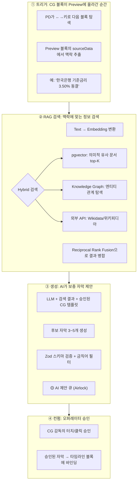
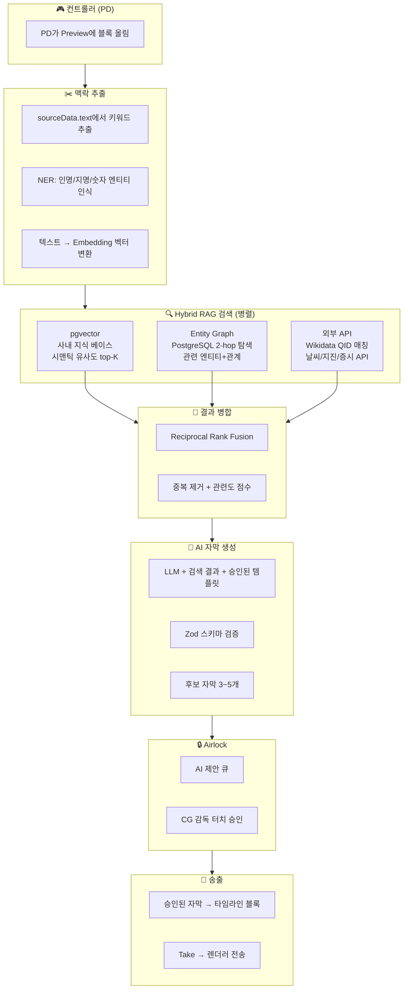
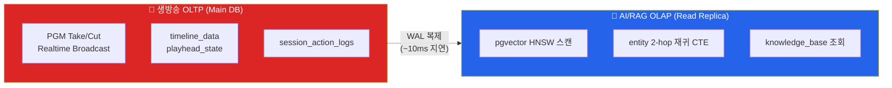
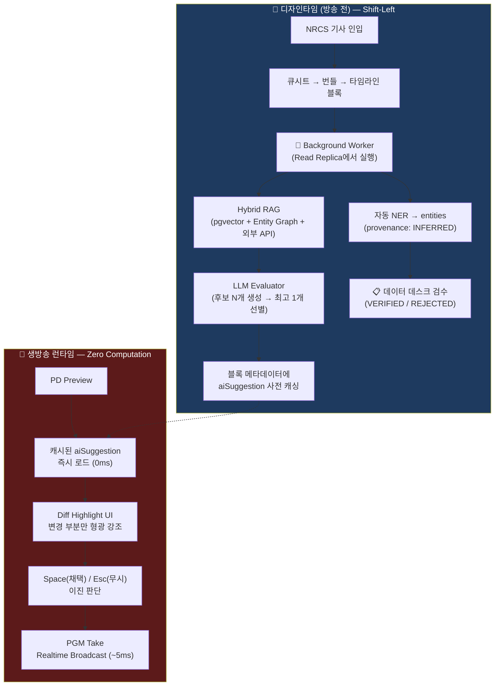

# 🧠 WebCG-K "꿈의 자막 자동 제안 시스템" — RAG 아키텍처 비판적 분석

> **작성일:** 2026-04-19  
> **목적:** 사용자의 비전("맥락에 맞는 자막을 끊임없이 제안하고, 오퍼레이터는 컨펌만")을 실현하기 위한 기술 스택 분석  
> **핵심 질문:**
> 1. `GraphicSemanticMeta`의 카테고리 분류는 현실적으로 가능한가?
> 2. RAG / Knowledge Graph / pgvector 중 무엇이 적합한가?
> 3. Graphify의 노드 연관 시스템을 방송 콘텐츠에 적용할 수 있는가?

---

## Part 1: `GraphicSemanticMeta` 카테고리 체계에 대한 비판적 분석

### 현재 OBM_VISION_ANALYSIS의 설계안

```typescript
export interface GraphicSemanticMeta {
  category?: 'POLITICS' | 'ECONOMY' | 'SPORTS' | 'DISASTER' | 'CULTURE' | 'WEATHER' | 'GENERAL';
  entities?: Array<{ type: string; value: string; }>;
  aiInstruction?: string;
  urgency?: 'normal' | 'breaking' | 'flash';
}
```

### 🔴 비판 1: "카테고리"는 잘못된 추상화 수준이다

**문제의 핵심:** 자막 자동 제안 시스템에서 중요한 것은 `'ECONOMY'`라는 **카테고리 라벨**이 아니라, **"금리가 3.50%이고, 이전 동결이었고, 현재 경제 상황에서 이것이 의미하는 바"**라는 **맥락(Context)**이다.

```
❌ 카테고리 기반 접근:
   category: "ECONOMY" → 경제 관련 자막 템플릿 검색 → 일반적인 결과

✅ 맥락 기반 접근:
   "한국은행이 기준금리를 3.50%로 동결했다" 
   → RAG: 최근 6개월 금리 데이터 + 관련 전문가 분석 검색
   → AI: "소비자 대출 이자 영향 없음" 보충 자막 자동 생성
```

**비유:** 카테고리는 도서관의 "경제학 코너"까지만 안내하고, RAG는 **"당신이 찾는 바로 그 책의 8장 3절"**까지 데려다준다.

### 🟡 비판 2: 카테고리는 필요하지만 "부차적"

카테고리가 완전히 쓸모없는 것은 아니다:

| 카테고리의 역할 | 유효성 |
|------|--------|
| RAG 검색 범위 사전 필터링 (불필요한 문서 제외) | ✅ 유용 |
| 템플릿 자동 선택 (재난 → 빨간 배경, 스포츠 → 파란 배경) | ✅ 유용 |
| 세컨드 스크린 앱의 UI 분기 | ✅ 유용 |
| **자막 내용 자동 생성의 핵심 입력** | ❌ 불충분 |

**결론:** `GraphicSemanticMeta.category`는 **라우팅/필터링** 용도로 유지하되, 자막 자동 제안의 핵심은 **원문 텍스트의 임베딩 기반 시맨틱 검색(RAG)**이어야 한다.

---

## Part 2: 사용자의 꿈 — "자막 자동 제안 시스템"의 정체

### 2.1. 비전을 기술적으로 분해

```
사용자의 꿈:
"송출하려는 그래픽의 컨텍스트 데이터를 그 시점에 연관된 RAG 데이터베이스 검색하여
 필요한 자막을 자동 생성하여 제안. 오퍼레이터는 컨펌만."
```

이것을 기술적으로 분해하면 **3단계 파이프라인**이다:



### 2.2. 핵심 문제: "정보를 어디서 가져오는가?"

| 정보 소스 | 장점 | 단점 | 적합도 |
|----------|------|------|--------|
| **사내 RAG (pgvector)** | 할루시네이션 최소, 사내 정책/아카이브 반영, 보안 | 사전 구축 필요, 데이터 신선도 관리 | ⭐⭐⭐⭐⭐ |
| **Wikidata/위키피디아 API** | 글로벌 엔티티 DB, 무료, 실시간 업데이트 | 영어 편향, 속보 반영 지연, 주관적 편집 | ⭐⭐⭐⭐ |
| **외부 전문 API** | 정확, 실시간 (날씨/지진/증시) | 비용, API 의존성, 도메인 제한 | ⭐⭐⭐ |
| **LLM 자체 지식** | 편리, 구축 불필요 | **할루시네이션 위험 최대** | ⭐ (단독 사용 금지) |

---

## Part 3: 기술 스택 심층 분석 — pgvector vs Knowledge Graph vs GraphQL

### 3.1. pgvector (Supabase 내장) — 시맨틱 벡터 검색

#### 왜 pgvector인가?

WebCG-K는 **이미 Supabase(PostgreSQL)를 사용**하고 있다. pgvector는 동일 DB에 벡터 검색 기능을 추가하는 확장 모듈이므로, **새로운 인프라 없이 기존 Docker 컨테이너에서 바로 동작**한다.

```sql
-- 1. 확장 활성화 (Supabase는 이미 pgvector 포함)
CREATE EXTENSION IF NOT EXISTS vector;

-- 2. 사내 지식 베이스 테이블
CREATE TABLE knowledge_base (
  id uuid PRIMARY KEY DEFAULT gen_random_uuid(),
  -- 원본 콘텐츠
  content text NOT NULL,
  title text,
  -- 메타데이터 (카테고리, 소스, 날짜 등)
  metadata jsonb DEFAULT '{}',
  -- 임베딩 벡터 (text-embedding-3-small: 1536차원)
  embedding vector(1536),
  -- 언제 누가 추가했는지
  created_at timestamptz DEFAULT now(),
  source_type text  -- 'archive', 'wiki', 'manual', 'nrcs'
);

-- 3. 시맨틱 검색 함수
CREATE OR REPLACE FUNCTION match_knowledge(
  query_embedding vector(1536),
  match_threshold float DEFAULT 0.78,
  match_count int DEFAULT 5,
  filter_category text DEFAULT NULL
)
RETURNS TABLE (
  id uuid, content text, title text, 
  metadata jsonb, similarity float
) LANGUAGE sql STABLE AS $$
  SELECT kb.id, kb.content, kb.title, kb.metadata,
         1 - (kb.embedding <=> query_embedding) AS similarity
  FROM knowledge_base kb
  WHERE 1 - (kb.embedding <=> query_embedding) > match_threshold
    AND (filter_category IS NULL 
         OR kb.metadata->>'category' = filter_category)
  ORDER BY kb.embedding <=> query_embedding
  LIMIT match_count;
$$;

-- 4. HNSW 인덱스 (프로덕션 필수)
CREATE INDEX ON knowledge_base 
  USING hnsw (embedding vector_cosine_ops);
```

#### 성능 수치

| 지표 | 값 | 근거 |
|------|-----|------|
| 검색 레이턴시 | **< 50ms** (p95) | HNSW 인덱스 + 인덱스 메모리 상주 시 |
| 임베딩 생성 | **~80ms** | text-embedding-3-small API 호출 |
| 전체 RAG 파이프라인 | **200~500ms** | 임베딩 + 검색 + LLM 생성 |
| Preview → 제안 표시 | **~2초** | 타이머 0.5초 + RAG 0.5초 + LLM 1초 |

#### ⭐ 핵심 장점: 기존 인프라 100% 재사용

```
현재 WebCG-K 인프라:          추가 필요한 것:
┌─────────────────────┐      ┌──────────────────┐
│ Supabase Docker     │  +   │ pgvector 활성화  │  → SQL 1줄
│ ├── PostgreSQL ✅   │      │ knowledge_base   │  → 테이블 1개  
│ ├── Auth ✅         │      │ match_knowledge  │  → 함수 1개
│ ├── Realtime ✅     │      │ HNSW 인덱스      │  → SQL 1줄
│ └── Storage ✅      │      │ Embedding API 키 │  → 환경변수 1개
└─────────────────────┘      └──────────────────┘

→ 새로운 서버, 새로운 DB, 새로운 서비스 = ZERO
```

---

### 3.2. Knowledge Graph (Graphify 스타일) — 엔티티 관계 탐색

#### Graphify를 방송 콘텐츠에 적용할 수 있는가?

**솔직한 답변:** Graphify는 **코드베이스 분석**에 최적화되어 있고, 방송 콘텐츠(뉴스 기사, 인물, 이벤트)에는 **직접 적용 불가**하다. 하지만 Graphify가 사용하는 **원리**(엔티티 추출 → 관계 연결 → 커뮤니티 탐지)는 동일하게 적용할 수 있다.

#### 방송 콘텐츠용 Knowledge Graph의 역할

```
pgvector만으로는 부족한 질문:

  Q: "한국은행 금리 동결 자막인데, 관련 자막을 제안해줘"
  
  pgvector (벡터 유사도):
    → "기준금리 3.50% 유지" (0.92 유사도)
    → "한국은행 총재 연임" (0.85 유사도)  ← 금리와 무관한 "한국은행" 키워드 매칭
    → "미국 연준 금리 인하" (0.81 유사도)  ← 관련은 있으나 직접적이지 않음

  Knowledge Graph (관계 탐색):
    "기준금리 동결" 
      ──[영향]──→ "주택담보대출 이자" 
      ──[비교]──→ "미국 연준 금리 차이"
      ──[원인]──→ "물가 상승률 2.8%"
      ──[반응]──→ "증시 코스피 2,650"
    
    → 관계 기반으로 "왜 동결했는가? 어떤 영향이 있는가?"를 구조적으로 추적
```

#### 어떻게 구현할 것인가? — PostgreSQL 안에서

**별도의 Neo4j나 그래프 DB를 추가할 필요가 없다.** PostgreSQL의 `jsonb` + 재귀 CTE로 2~3홉 탐색이 충분히 가능하다:

```sql
-- 엔티티 테이블
CREATE TABLE entities (
  id uuid PRIMARY KEY DEFAULT gen_random_uuid(),
  label text NOT NULL,        -- "한국은행", "기준금리", "코스피"
  type text,                  -- "organization", "metric", "index"  
  properties jsonb,           -- {"현재값": "3.50%", "이전값": "3.50%"}
  embedding vector(1536)      -- 엔티티 자체의 벡터 임베딩
);

-- 관계 테이블  
CREATE TABLE entity_relations (
  id uuid PRIMARY KEY DEFAULT gen_random_uuid(),
  source_id uuid REFERENCES entities(id),
  target_id uuid REFERENCES entities(id),
  relation_type text,         -- "영향", "원인", "비교", "소속"
  weight float DEFAULT 1.0,
  metadata jsonb,             -- {"근거": "2026년 1분기 통계"}
  created_at timestamptz DEFAULT now()
);

-- 2-hop 관계 탐색 함수
CREATE OR REPLACE FUNCTION traverse_entity(
  start_label text,
  max_depth int DEFAULT 2,
  max_results int DEFAULT 20
)
RETURNS TABLE (
  entity_label text, entity_type text, 
  relation_type text, depth int, path text[]
) LANGUAGE sql STABLE AS $$
  WITH RECURSIVE traversal AS (
    -- Base case: 시작 엔티티  
    SELECT e.id, e.label, e.type, 
           NULL::text as rel_type, 
           0 as depth, 
           ARRAY[e.label] as path
    FROM entities e WHERE e.label = start_label
    
    UNION ALL
    
    -- Recursive: 이웃 탐색
    SELECT e2.id, e2.label, e2.type,
           er.relation_type, 
           t.depth + 1,
           t.path || e2.label
    FROM traversal t
    JOIN entity_relations er ON er.source_id = t.id OR er.target_id = t.id
    JOIN entities e2 ON e2.id = CASE 
      WHEN er.source_id = t.id THEN er.target_id 
      ELSE er.source_id END
    WHERE t.depth < max_depth
      AND NOT e2.label = ANY(t.path)  -- 순환 방지
  )
  SELECT label, type, rel_type, depth, path
  FROM traversal
  WHERE depth > 0
  ORDER BY depth, label
  LIMIT max_results;
$$;
```

---

### 3.3. GraphQL — 언제 필요한가?

**솔직한 답변:** 현재 WebCG-K 아키텍처에서 GraphQL은 **불필요**하다.

| GraphQL이 빛나는 곳 | WebCG-K 상황 |
|------|------|
| 다중 마이크로서비스 → 단일 API 게이트웨이 | Supabase 하나로 충분 |
| 프론트엔드가 필요한 필드만 선택적 요청 | Supabase RPC로 커버 가능 |
| 외부 서비스 N개를 조합 | 아직 단일 서비스 |

**단, 향후 이 시나리오에서는 검토:**
- 외부 RAG 서비스(Wikidata + 날씨 API + 증시 API + 사내 아카이브)를 **4개 이상 통합**해야 할 때
- 세컨드 스크린 앱이 **독립 프론트엔드**로 분리될 때

---

## Part 4: 최적 아키텍처 — Hybrid RAG

### 4.1. "꿈의 시스템" 전체 아키텍처



### 4.2. 3가지 데이터 소스의 역할

| 소스 | 언제 사용 | 예시 |
|------|----------|------|
| **pgvector (사내 RAG)** | 항상 (기본) | 과거 방송 아카이브, 사내 인물 DB, 방송사 정책 문서 |
| **Entity Graph (관계)** | 엔티티가 인식될 때 | "한국은행" → 관련 지표/인물/이벤트 탐색 |
| **Wikidata/외부 API** | 엔티티 보강 시 | 인물 약력, 지명 정보, 실시간 데이터 |

### 4.3. 데이터 소스별 할루시네이션 리스크

```
할루시네이션 위험도 (낮을수록 안전):

  사내 RAG (pgvector)    ████░░░░░░  20%  ← 가장 안전 (사실 검증된 문서)
  Wikidata/위키피디아     █████░░░░░  30%  ← 커뮤니티 검증, 간혹 편집 전쟁
  외부 전문 API          ██░░░░░░░░  10%  ← 구조화 데이터, 거의 정확
  LLM 자체 지식          ████████░░  80%  ← 단독 사용 금지!
  
  Hybrid RAG (3개 조합)   ███░░░░░░░  15%  ← 교차 검증으로 위험 최소화
```

---

## Part 5: Graphify와의 관계 — 개발 도구 vs 런타임 도구

### 5.1. 혼동 정리

```
┌────────────────────────────────────────────────────────────┐
│                    두 가지 "그래프"                          │
│                                                            │
│  🔧 Graphify (개발 시점)    vs    📡 Entity Graph (런타임)   │
│                                                            │
│  • 코드베이스 구조 이해           • 뉴스 콘텐츠 맥락 이해      │
│  • AI 코딩 어시스턴트용           • 방송 자막 자동 제안용       │
│  • AST + 파일 관계               • 인물/지명/사건 관계        │
│  • 빌드 타임 (오프라인)           • 런타임 (실시간)            │
│  • graphify-out/graph.json       • entities + relations DB  │
│                                                            │
│  → 완전히 다른 용도! 같은 "그래프 기술"이지만 대상이 다름    │
└────────────────────────────────────────────────────────────┘
```

### 5.2. Graphify에서 배울 수 있는 원리

Graphify의 설계 원리 중 방송 Entity Graph에 적용할 수 있는 것:

| Graphify 원리 | 방송 Entity Graph 적용 |
|------|------|
| **엔티티 추출** (Tree-sitter AST) | **NER** (LLM 또는 spaCy로 인명/지명/조직 추출) |
| **관계 추출** (import/export) | **관계 추출** (LLM이 기사에서 "영향/원인/비교" 관계 추출) |
| **커뮤니티 탐지** (Leiden) | **토픽 클러스터링** (관련 뉴스를 자동 그룹화) |
| **BFS/DFS 질의** | **2-hop 탐색** (엔티티에서 관련 정보까지 경로 추적) |
| **Provenance 태깅** (EXTRACTED/INFERRED) | **신뢰도 태깅** (검증됨/추정/미검증) |

---

## Part 6: 구현 로드맵 — 실현 가능한 3단계

### Phase 1: pgvector 기반 RAG (최소 실행 가능 제품)

> **난이도:** ⭐⭐ | **기간:** 1~2주 | **비용:** Embedding API만

```
최소 구현에 필요한 것:
1. Supabase에 knowledge_base 테이블 생성 (SQL 10줄)
2. match_knowledge() 함수 생성 (SQL 20줄)
3. 사내 문서/과거 방송 기록을 임베딩하여 저장
4. Preview 블록 변경 시 → sourceData 텍스트 임베딩 → RAG 검색 → LLM 제안
5. 제안 UI (사이드바에 "AI 추천 자막" 패널 추가)
```

**이것만으로도 작동하는 프로토타입이 나온다.**

### Phase 2: Entity Graph 추가 (관계 기반 보강)

> **난이도:** ⭐⭐⭐ | **기간:** 2~3주 | **비용:** 동일

```
추가 구현:
1. entities + entity_relations 테이블 (PostgreSQL, 아키텍처 변경 없음)
2. NRCS 기사 수신 시 자동 NER → 엔티티 저장 → 관계 추론
3. RAG 검색에 2-hop 탐색 결과 병합 (Reciprocal Rank Fusion)
4. 시간이 지날수록 엔티티 그래프가 풍부해짐 (자동 학습)
```

### Phase 3: 외부 소스 연동 (할루시네이션 최소화)

> **난이도:** ⭐⭐⭐⭐ | **기간:** 3~4주 | **비용:** API 비용

```
추가 구현:
1. Wikidata Entity Linking: 인식된 인명/조직 → QID 매칭 → 구조화된 약력 자동 획득
2. 외부 데이터 API 확장: 기존 dataProviders.ts 확장
3. 전송 지연 동기화 (세컨드 스크린용)
4. 사내 아카이브 자동 인덱싱 (S3/Storage의 과거 자막 데이터)
```

---

## Part 7: 정직한 결론 — 무엇이 진짜 필요하고, 무엇이 과잉인가

### ✅ 반드시 필요하다

| 기술 | 이유 |
|------|------|
| **pgvector (Supabase)** | 이미 있는 인프라에 SQL 3줄 추가. 벡터 검색으로 맥락 기반 문서 검색 |
| **Embedding API** | 텍스트 → 벡터 변환. OpenAI text-embedding-3-small 또는 Vertex AI |
| **LLM (기존 Gemini)** | 검색 결과 → 자막 생성. 이미 있음 |
| **Airlock 승인 UX** | Human-in-the-loop. 이미 설계됨 |

### 🟡 강력히 권장하지만 나중에

| 기술 | 이유 |
|------|------|
| **Entity Graph (PostgreSQL)** | 관계 기반 탐색으로 RAG 품질 향상. 별도 DB 불필요 |
| **Wikidata API** | 인물/조직 정보 자동 보강. 할루시네이션 줄임 |
| **GraphicSemanticMeta** | 카테고리는 RAG 필터링에 유용. 핵심은 아님 |

### 🔴 현 시점에서 과잉이다

| 기술 | 이유 |
|------|------|
| **별도 Neo4j/그래프 DB** | PostgreSQL의 재귀 CTE로 2-hop 충분. 추가 인프라 불필요 |
| **GraphQL** | 단일 Supabase 백엔드에서 불필요. 향후 4+ 서비스 통합 시 검토 |
| **별도 벡터 DB (Pinecone/Weaviate)** | pgvector가 같은 PostgreSQL에서 동작. 외부 서비스 불필요 |
| **Apache AGE (Cypher in PostgreSQL)** | 2-hop 정도는 재귀 CTE로 충분. 복잡한 그래프 쿼리 필요 시에만 |
| **Graphify의 방송 콘텐츠 직접 적용** | Graphify는 코드 분석 도구. 원리만 차용, 도구 자체는 부적합 |

### ~~최종 한 줄 요약~~ (v1 — Part 8에서 수정됨)

> ~~`pgvector` + 기존 Supabase + 기존 Gemini = 당장 시작할 수 있는 RAG.~~
> ~~별도 인프라 없이 SQL 몇 줄과 Edge Function 하나로~~
> ~~"Preview 시점에 자막 3개 자동 제안 → CG 감독 터치 승인"이 가능하다.~~
>
> ⚠️ **이 결론은 Part 8의 생방송 환경 비판에 의해 대폭 보정되었습니다. 최종 결론은 Part 9를 참조하세요.**

---

## Part 8: 🔴 생방송 가혹 환경 — 5가지 치명적 아키텍처 맹점

> **관점:** 방송 시스템 아키텍트의 최악의 시나리오 분석
>
> Part 1~7의 설계는 기술적으로 건전하지만, **'1초를 다투는 생방송 부조정실'**이라는
> 극도로 특수한 가혹 환경에 투입했을 때 드러나는 5가지 맹점을 발견하고 전액 수용합니다.

---

### 🔴 맹점 1: "Preview 2초 대기"는 생방송에서 사형 선고

#### 원래 설계 (AS-IS)

```
① PD가 ←→키로 블록 탐색 → Preview에 올림
② RAG 검색 (임베딩 80ms + pgvector 50ms + LLM 1초)
③ ~2초 후 제안 표시
```

#### 비판 분석

**생방송 워크플로우를 소프트웨어 앱처럼 오해한 가장 위험한 병목.**

- **API 스팸:** PD는 런다운 흐름을 확인하기 위해 **방향키를 1초에 3~4번씩 다다닥 누르며 스크러빙(Scrubbing)**한다. 모든 궤적마다 임베딩 + LLM 파이프라인이 비동기 폭주 → **API Rate Limit 초과 + 비용 폭탄**
- **지연의 모순:** AI 제안을 2초 기다리면 앵커는 이미 해당 멘트를 지나침. 속보 상황에서 오퍼레이터는 **2초를 절대 기다리지 않는다**

#### ✅ 수용: Shift-Left (AOT 사전 생성)

**트리거 시점을 런타임(Preview)이 아니라 디자인타임(NRCS 인입)으로 대폭 앞당긴다:**

```
┌───────────────────────────────────────────────────────────────┐
│  AS-IS (Preview 트리거 — 위험)                                 │
│                                                               │
│  NRCS기사 ──→ 타임라인블록 ──→ PD Preview ──→ RAG(2초) ──→ 제안 │
│                                            ↑ 여기서 비로소 연산 │
│                                              (너무 늦다!)       │
├───────────────────────────────────────────────────────────────┤
│  TO-BE (Shift-Left — 안전)                                     │
│                                                               │
│  NRCS기사 ──→ 타임라인블록 ──→ Background Worker (RAG+LLM)      │
│                  │              │                               │
│                  │              └──→ 결과를 block.aiSuggestion  │
│                  │                    메타데이터에 사전 캐싱      │
│                  ▼                                              │
│            PD Preview ──→ 캐시에서 꺼내기만 ──→ 0ms 즉시 표시    │
│                           (연산 ZERO)                           │
└───────────────────────────────────────────────────────────────┘
```

**구현 핵심:**

```typescript
// NRCS 기사가 시스템에 인입되는 시점 (방송 수 분~수 시간 전)
async function onNrcsArticleReceived(article: NrcsNewsItem) {
  // 1. 기존: 큐시트 → 번들 → 타임라인 블록 생성
  const blocks = await mapArticleToBlocks(article);
  
  // 2. 🆕 Background Worker: 각 블록에 대해 비동기 RAG+LLM 실행
  for (const block of blocks) {
    // 큐에 넣고 즉시 반환 (PD 워크플로 차단하지 않음)
    await ragWorkerQueue.add({
      blockId: block.id,
      sourceText: block.sourceData?.text,
      articleBody: article.bodyText,
    });
  }
}

// Background Worker (별도 프로세스, 메인 DB 부하 없음)
async function processRagJob(job: RagJob) {
  // RAG 검색 + LLM 생성 (시간 제한 없이 충분히 처리)
  const context = await hybridRagSearch(job.sourceText);
  const suggestion = await generateSuggestion(context, job.sourceText);
  
  // 결과를 블록 메타데이터에 캐싱
  await supabase.from('broadcast_sessions')
    .update({
      [`timeline_data.blocks.${job.blockId}.aiSuggestion`]: {
        text: suggestion.text,
        confidence: suggestion.confidence,
        sources: suggestion.sources,
        generatedAt: new Date().toISOString(),
      }
    });
}
```

---

### 🔴 맹점 2: "후보 3~5개 제안"은 인지 과부하(Cognitive Overload)

#### 원래 설계 (AS-IS)

```
AI가 후보 자막 3~5개 생성 → CG 감독이 읽고 비교하여 최적 1개 선택
```

#### 비판 분석

**개발자의 이상향이지, 부조정실 현실과 정면 충돌.**

- PD의 눈과 손은 **PGM 화면 + 앵커 멘트 + 스위칭 타이밍**을 동시에 추적 중
- 본 적 없는 텍스트 3~5개가 팝업되면 → **선택 마비(Paradox of Choice)** 유발
- 바쁜 PD는 5개를 비교하느니 차라리 기능을 끄거나, **무지성으로 1번만 눌러 방송 사고** 유발

#### ✅ 수용: 1-Pick 확신 제안 + Diff Highlighting

```
┌───────────────────────────────────────────────────────────────┐
│  AS-IS (3~5개 선택지 — 위험)                                    │
│                                                               │
│  ┌──────────────────────────────┐                              │
│  │ AI 추천 자막:                │  ← PD가 5개를 읽고            │
│  │  1. 한은, 기준금리 3.50% 동결 │     비교/선택해야 함           │
│  │  2. 기준금리 3.50% 유지 결정  │     (인지 과부하)              │
│  │  3. 한국은행 금리 동결 유지   │                              │
│  │  4. 기준금리 3.50%로 동결(…)  │                              │
│  │  5. 한은 금리동결, 8회 연속   │                              │
│  └──────────────────────────────┘                              │
├───────────────────────────────────────────────────────────────┤
│  TO-BE (1-Pick + Diff — 안전)                                  │
│                                                               │
│  ┌──────────────────────────────────────┐                      │
│  │ 💡 AI 보충 제안  [98% 신뢰]          │                      │
│  │                                      │                      │
│  │  한은, 기준금리 「3.50%」 동결        │  ← 메인 텍스트         │
│  │  ▸ 8회 연속 · 미 연준 대비 +1.0%p   │  ← 보충 (형광 하이라이트)│
│  │                                      │                      │
│  │  [Space 채택]   [Esc 무시]           │  ← 이진 판단만!        │
│  └──────────────────────────────────────┘                      │
│                                                               │
│  • LLM Evaluator 프롬프트로 신뢰도 최고 1개만 선별              │
│  • 기존 텍스트 대비 AI 보충 부분만 Diff Highlight(형광펜)        │
│  • PD는 색칠 부분만 0.5초 스캔 → Enter(채택) / Esc(무시)        │
└───────────────────────────────────────────────────────────────┘
```

**구현 핵심:**

```typescript
interface AiSuggestion {
  // 단 1개의 최고 신뢰도 결과만 저장
  text: string;
  confidence: number;           // 0.0 ~ 1.0 (Evaluator LLM이 산출)
  diffSegments: DiffSegment[];  // 기존 대비 변경/추가된 부분의 위치
  sources: string[];            // RAG 출처 (Provenance)
  generatedAt: string;
}

interface DiffSegment {
  type: 'unchanged' | 'added' | 'modified';
  text: string;
}

// Evaluator 프롬프트: 내부적으로 N개 생성 → 최고 1개만 선별
const EVALUATOR_SYSTEM = `
  당신은 방송 CG 자막 품질 검수관입니다.
  아래 후보 중 가장 정확하고 간결하며 방송 표현에 적합한 1개만 선택하세요.
  선택 근거와 신뢰도(0.0~1.0)를 함께 출력하세요.
  0.85 미만의 신뢰도는 제안하지 마세요 (빈 결과 반환).
`;
```

---

### 🔴 맹점 3: OLTP와 OLAP의 치명적 충돌 — DB 락 리스크

#### 원래 설계 (AS-IS)

```
동일 Supabase PostgreSQL에서:
  - PGM Take 신호 (OLTP, ~5ms 필수)
  - HNSW 벡터 스캔 + 2-hop 재귀 조인 (OLAP, ~500ms 부하)
→ 동시 실행 시 DB 메인 스레드 경쟁
```

#### 비판 분석

**미션 크리티컬 환경의 단일 장애점(SPOF) 리스크.**

- Supabase는 단순 저장소가 아니라 **PGM Take 신호를 5ms 이내에 브로드캐스트하는 생방송 통신망의 심장**
- 수만 건 아카이브의 HNSW 스캔 + `jsonb` 재귀 조인 = CPU/메모리를 극도로 소모하는 **무거운 OLAP 쿼리**
- AI가 RAG 쿼리를 돌리는 그 찰나에 PD가 `Space`를 누르면? → **제어 신호 Jitter/Timeout → 방송 사고**

#### ✅ 수용: 워크로드 격리 (Compute Isolation)



**3중 격리 전략:**

| 계층 | 방어 장치 | 효과 |
|------|----------|------|
| **① Shift-Left** | RAG 연산을 디자인타임에 사전 실행 | 런타임 DB 부하 **완전 제거** |
| **② Read Replica** | AI 쿼리를 읽기 전용 복제본으로 라우팅 | 메인 DB CPU **격리** |
| **③ 쿼리 차단** | `SET LOCAL statement_timeout = '500ms'` | RAG 쿼리가 메인 DB에 침범 시 **강제 Kill** |

```sql
-- AI 관련 함수에 타임아웃 가드레일 적용
CREATE OR REPLACE FUNCTION match_knowledge_safe(
  query_embedding vector(1536),
  match_count int DEFAULT 5
) RETURNS TABLE (content text, similarity float) 
LANGUAGE plpgsql STABLE AS $$
BEGIN
  -- ⚠️ 500ms 초과 시 자동 Kill → 메인 DB 보호
  SET LOCAL statement_timeout = '500ms';
  
  RETURN QUERY
  SELECT kb.content,
         1 - (kb.embedding <=> query_embedding) AS similarity
  FROM knowledge_base kb
  ORDER BY kb.embedding <=> query_embedding
  LIMIT match_count;
END;
$$;
```

---

### 🔴 맹점 4: 최신성(Recency)을 무시한 벡터 검색의 한계

#### 원래 설계 (AS-IS)

```sql
-- 순수 코사인 유사도만으로 랭킹
WHERE 1 - (kb.embedding <=> query_embedding) > match_threshold
ORDER BY kb.embedding <=> query_embedding
```

#### 비판 분석

**뉴스의 생명인 '최신성'이 완전히 누락.**

- "한국은행 기준금리 동결" 임베딩 검색 시:
  - **5년 전 금리 동결 기사 (유사도 0.99)** → 1위 ← 🔴 치명적 오답!
  - **오늘 아침 기사 (유사도 0.85)** → 3위 ← 이게 정답인데 밀림
- **'속보 할루시네이션'**: 과거 데이터를 현재로 착각하여 제안

#### ✅ 수용: Time-Weighted Vector Search

```sql
-- 수정된 검색 함수: 시간 감쇠 가중치 적용
CREATE OR REPLACE FUNCTION match_knowledge_time_weighted(
  query_embedding vector(1536),
  match_count int DEFAULT 5,
  -- 감쇠 계수: 높을수록 최신 문서 강하게 선호
  decay_factor float DEFAULT 0.05,
  -- 속보 모드: true면 최근 1시간 문서만 검색
  breaking_mode boolean DEFAULT false
) RETURNS TABLE (
  content text, title text, metadata jsonb,
  raw_similarity float, 
  time_weighted_score float,
  age_days float
) LANGUAGE sql STABLE AS $$
  SELECT 
    kb.content, kb.title, kb.metadata,
    -- 원래 유사도
    1 - (kb.embedding <=> query_embedding) AS raw_similarity,
    -- 🆕 시간 감쇠 적용: similarity × exp(-decay × age_days)
    (1 - (kb.embedding <=> query_embedding)) 
      * exp(-decay_factor * EXTRACT(EPOCH FROM (now() - kb.created_at)) / 86400.0)
      AS time_weighted_score,
    -- 얼마나 오래된 문서인지
    EXTRACT(EPOCH FROM (now() - kb.created_at)) / 86400.0 AS age_days
  FROM knowledge_base kb
  WHERE 
    -- 속보 모드: 최근 1시간 문서만
    (NOT breaking_mode OR kb.created_at > now() - interval '1 hour')
    -- 최소 유사도 필터
    AND 1 - (kb.embedding <=> query_embedding) > 0.70
  ORDER BY time_weighted_score DESC
  LIMIT match_count;
$$;
```

**감쇠 효과 시뮬레이션:**

```
"한국은행 기준금리 동결" 검색 결과:

  AS-IS (순수 유사도):
    1위: 2021년 금리 동결 기사  (유사도 0.99)  ← 5년 전 오답!
    2위: 2024년 금리 인상 기사  (유사도 0.88)
    3위: 2026년 오늘 기사       (유사도 0.85)

  TO-BE (시간 감쇠 적용, decay=0.05):
    1위: 2026년 오늘 기사       (0.85 × e^(-0.05×0) = 0.850)  ✅
    2위: 2024년 기사            (0.88 × e^(-0.05×730) = 0.000)  → 사실상 탈락
    3위: 2021년 기사            (0.99 × e^(-0.05×1825) = 0.000) → 완전 탈락

  속보 모드 (breaking_mode=true):
    → 최근 1시간 내 문서만 검색 → 외부 API 직접 라우팅도 가능
```

---

### 🔴 맹점 5: 지식 그래프 오염 (Poisoning Loop)

#### 원래 설계 (AS-IS)

```
NRCS 기사 수신 → 자동 NER → 엔티티 저장 → 관계 추론 → DB에 자동 커밋
```

#### 비판 분석

**자동화의 덫 — 쓰레기가 쓰레기를 낳는 무한 피드백 루프.**

- LLM이 기사를 파싱하다 환각으로 잘못된 관계 추출:
  - 예) `"도쿄 강진" -[원인]-> "원자력 발전소 폭발"` (실제로는 무관)
- 이 오염 데이터가 `entity_relations`에 **자동 저장**
- 이후 모든 RAG 검색이 이 **오염된 관계를 '진실'로 참조** → 오보 자막 자동 생성
- **Poisoning Loop:** LLM 생성 → 오염 데이터 저장 → 오염 데이터 참조 → 더 나쁜 생성

#### ✅ 수용: Provenance 태깅 + Human-in-the-loop 검증 게이트

```sql
-- 수정된 entity_relations 테이블: status 필드 추가
CREATE TABLE entity_relations (
  id uuid PRIMARY KEY DEFAULT gen_random_uuid(),
  source_id uuid REFERENCES entities(id),
  target_id uuid REFERENCES entities(id),
  relation_type text,
  weight float DEFAULT 1.0,
  metadata jsonb,
  created_at timestamptz DEFAULT now(),
  -- 🆕 Provenance 필드
  provenance text NOT NULL DEFAULT 'INFERRED',  
    -- 'VERIFIED': 데스크/저널리스트가 승인
    -- 'INFERRED': LLM이 자동 추출 (낮은 신뢰도)
    -- 'EXTERNAL': Wikidata 등 외부 검증 소스
    -- 'REJECTED': 검수 후 거부됨 (삭제하지 않고 보존)
  verified_by uuid REFERENCES profiles(id),
  verified_at timestamptz
);

-- RAG 검색 시 Provenance 기반 가중치 차등 적용
CREATE OR REPLACE FUNCTION traverse_entity_safe(
  start_label text,
  max_depth int DEFAULT 2
) RETURNS TABLE (
  entity_label text, relation_type text,
  depth int, trust_level text
) LANGUAGE sql STABLE AS $$
  WITH RECURSIVE traversal AS (
    SELECT e.id, e.label, e.type, NULL::text as rel_type,
           0 as depth, ARRAY[e.label] as path,
           'ROOT'::text as trust
    FROM entities e WHERE e.label = start_label
    UNION ALL
    SELECT e2.id, e2.label, e2.type, er.relation_type,
           t.depth + 1, t.path || e2.label,
           er.provenance as trust
    FROM traversal t
    JOIN entity_relations er ON (er.source_id = t.id OR er.target_id = t.id)
      AND er.provenance != 'REJECTED'  -- 거부된 관계 제외
    JOIN entities e2 ON e2.id = CASE 
      WHEN er.source_id = t.id THEN er.target_id ELSE er.source_id END
    WHERE t.depth < max_depth AND NOT e2.label = ANY(t.path)
  )
  SELECT label, rel_type, depth, trust
  FROM traversal WHERE depth > 0
  ORDER BY 
    -- VERIFIED > EXTERNAL > INFERRED 순으로 우선
    CASE trust 
      WHEN 'VERIFIED' THEN 1 
      WHEN 'EXTERNAL' THEN 2 
      WHEN 'INFERRED' THEN 3 
    END,
    depth
  LIMIT 20;
$$;
```

**검증 워크플로:**

```
NRCS 기사 인입
  ──→ LLM NER + 관계 추출
  ──→ entity_relations INSERT (provenance = 'INFERRED')
  ──→ 🟡 데이터 데스크에 "검수 필요" 알림
  
데이터 데스크 (방송 전)
  ──→ 관계 검토 UI에서 승인/거부
  ──→ 승인: UPDATE provenance = 'VERIFIED'
  ──→ 거부: UPDATE provenance = 'REJECTED' (삭제하지 않고 보존)

RAG 검색 시
  ──→ VERIFIED: 가중치 1.0 (전폭 신뢰)
  ──→ EXTERNAL: 가중치 0.8 (Wikidata 등)
  ──→ INFERRED: 가중치 0.3 (낮은 신뢰, 참고용으로만)
  ──→ REJECTED: 검색 결과에서 완전 제외
```

---

## Part 9: 수정된 TO-BE 파이프라인 — 최종 아키텍처

> 5가지 맹점을 모두 수용한 **수정된 최종 파이프라인.**

### 9.1. 최종 파이프라인 다이어그램



### 9.2. 수정된 원칙 — AS-IS vs TO-BE

| 항목 | AS-IS (Part 2~7) | TO-BE (Part 8~9 수용) |
|------|------|------|
| **트리거 시점** | Preview에 올린 순간 | 🆕 **NRCS 인입 시점 (Shift-Left)** |
| **연산 위치** | 메인 DB에서 실행 | 🆕 **Read Replica 또는 Background Worker** |
| **제안 개수** | 3~5개 후보 | 🆕 **단 1개 (Evaluator 선별)** |
| **승인 UX** | 터치/클릭으로 선택 | 🆕 **Space(채택)/Esc(무시) 이진 판단** |
| **텍스트 표시** | 전체 텍스트 나열 | 🆕 **Diff Highlight (변경 부분만 형광)** |
| **벡터 검색** | 순수 코사인 유사도 | 🆕 **Time-Decay 가중치 적용** |
| **엔티티 관계** | 자동 저장 (무검증) | 🆕 **Provenance 태깅 + Human 검증 게이트** |
| **DB 안전성** | 단일 DB에서 모든 연산 | 🆕 **OLTP/OLAP 격리 + 500ms 차단** |

### 9.3. 최종 수정된 결론

> **기술 스택은 동일하다: `pgvector` + 기존 Supabase + 기존 Gemini.**
>
> **하지만 연산이 일어나는 '시점(Time)'과 인간에게 보여주는 '방식(UX)'을 생방송 현실에 맞게 재정렬한다:**
>
> 1. **연산과 생성(Generation)은 방송 전에 비동기로** — Shift-Left
> 2. **생방송 중에는 오직 조회(Retrieval)와 승인만 동기적으로** — Zero Computation
> 3. **제안은 1개만, 승인은 이진 판단으로** — 1-Pick + Diff
> 4. **최신성(Recency)이 정확도보다 우선** — Time-Decay
> 5. **자동 추출 데이터는 검증 전까지 2등 시민** — Provenance Gate

### 9.4. 수정된 구현 로드맵

| Phase | 내용 | 맹점 수용 | 기간 |
|-------|------|----------|------|
| **1a** | pgvector + knowledge_base + HNSW | 기본 인프라 | 1주 |
| **1b** | 🆕 Time-Decay 검색 함수 (`match_knowledge_time_weighted`) | 맹점 4 | +2일 |
| **1c** | 🆕 Background Worker + 블록 aiSuggestion 캐싱 | 맹점 1, 3 | +1주 |
| **1d** | 🆕 1-Pick Evaluator + Diff Highlight UI | 맹점 2 | +1주 |
| **2a** | Entity Graph + 2-hop 탐색 | 관계 기반 보강 | 2주 |
| **2b** | 🆕 Provenance 태깅 + 데이터 데스크 검수 UI | 맹점 5 | +1주 |
| **3** | Wikidata 연동 + 외부 API 확장 | 할루시네이션 감소 | 3주 |

---

### 9.5. 비판 수용 매트릭스

| # | 맹점 | 판정 | 대응 설계 |
|---|------|------|----------|
| 1 | Preview 2초 대기 → 생방송 불가 | ✅ **전액 수용** | Shift-Left (NRCS 인입 시 AOT 사전 생성) |
| 2 | 3~5개 후보 → 인지 과부하 | ✅ **전액 수용** | 1-Pick Evaluator + Diff Highlight + 이진 판단 |
| 3 | OLTP/OLAP 충돌 → DB 락 | ✅ **전액 수용** | Read Replica + Background Worker + 500ms 차단 |
| 4 | 최신성 무시 → 속보 할루시네이션 | ✅ **전액 수용** | Time-Decay 가중치 + 속보 모드 바이패스 |
| 5 | 자동 추출 → Poisoning Loop | ✅ **전액 수용** | Provenance 태깅 + Human 검증 게이트 |

> [!CAUTION]
> Part 2~7의 원래 설계는 기술 스택 선정으로서 유효하지만,
> **런타임 타이밍과 UX 설계는 Part 8~9의 수정 사항으로 완전히 대체**됩니다.
> 구현 시 반드시 TO-BE 파이프라인을 따르십시오.

---

> **문서 관리 정보**
> - **v1** (2026-04-19): 기술 스택 분석 (Part 1~7)
> - **v2** (2026-04-19): 생방송 가혹 환경 5가지 맹점 비판 수용 (Part 8~9)
> - pgvector 0.6.0+, Supabase Self-hosted, OpenAI text-embedding-3-small 기준
> - Wikidata Embedding Project (2025.10 런칭) 정보 포함
> - Part 8의 5가지 비판은 방송 시스템 아키텍트 관점의 리뷰를 반영합니다
