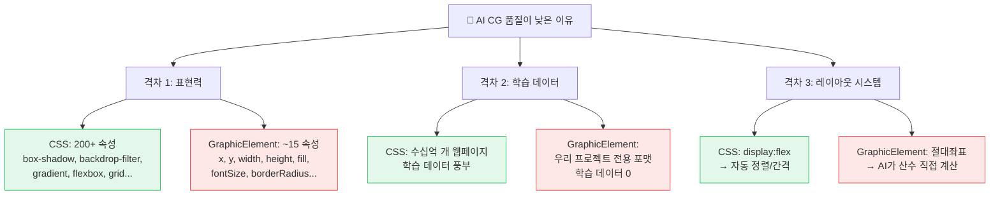
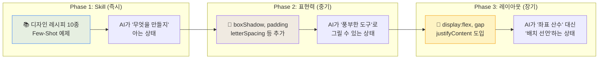
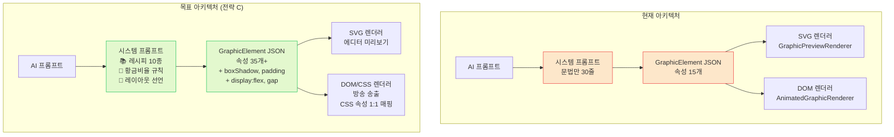
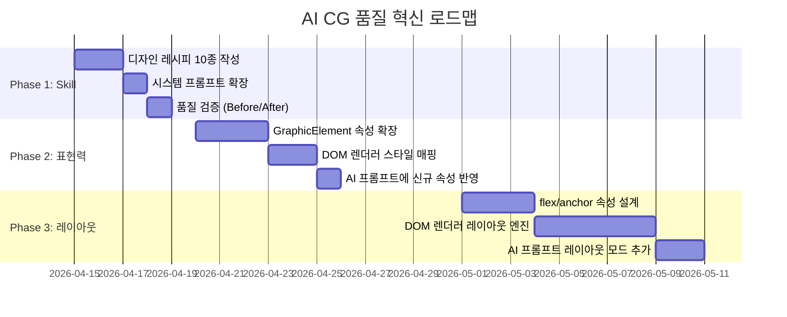

# AI CG 품질 혁신 전략 — 왜 AI는 웹은 잘 만들고, CG는 못 만들까?

> **교육 강의용 자료** | WebCG-K 프로젝트  
> 작성일: 2026-04-14 | 대상: AI 기반 방송 그래픽 개발 이해

---

## 📖 목차

1. [문제 정의 — 같은 AI인데 왜 결과가 다른가?](#1-문제-정의)
2. [근본 원인 분석 — 3대 격차](#2-근본-원인-분석)
3. [해결 전략 C — 3단계 하이브리드 접근](#3-해결-전략)
4. [Phase 1: 디자인 Skill — AI에게 레시피북 쥐어주기](#4-phase-1-디자인-skill)
5. [Phase 2: 표현력 확장 — 색연필 4개 → 풀 도구함](#5-phase-2-표현력-확장)
6. [Phase 3: 레이아웃 시스템 — 좌표 계산 대신 선언적 배치](#6-phase-3-레이아웃-시스템)
7. [렌더링 파이프라인 비교](#7-렌더링-파이프라인-비교)
8. [실무 적용 로드맵](#8-실무-적용-로드맵)

---

## 1. 문제 정의

### 관찰된 현상

같은 AI(Gemini, GPT 등)에게 두 가지 요청을 하면 **결과 품질이 극적으로 달라집니다.**

| 요청 | 결과 |
|------|------|
| "멋진 뉴스 홈페이지를 HTML/CSS로 만들어줘" | ✨ 그라데이션, 그림자, 정렬된 카드 레이아웃, 반응형 — **프로 수준** |
| "멋진 뉴스 하단자막을 GraphicElement JSON으로 만들어줘" | 😐 단순 사각형 + 텍스트, 정렬 어긋남, 색감 단조로움 — **학생 과제 수준** |

### 핵심 질문

> **"같은 AI인데, 왜 한쪽은 완벽하고 한쪽은 엉성한가?"**

이것은 **AI의 능력 문제가 아니라, AI에게 주어진 도구의 차이** 때문입니다.

---

## 2. 근본 원인 분석

### 2.1 비유: 화가에게 주어진 도구

```
┌─────────────────────────────────────────────────────────┐
│  HTML/CSS로 그림 그리기 = 포토샵 + 자동 정렬 가이드 🎨   │
│  GraphicElement로 그림 그리기 = 좌표종이 + 색연필 4개 ✏️  │
└─────────────────────────────────────────────────────────┘
```

아무리 뛰어난 화가(AI)라도 도구가 제한되면 작품의 품질이 떨어집니다.
문제는 AI가 아니라 **AI에게 준 도구(표현 체계)**입니다.

### 2.2 세 가지 격차



---

### 격차 1: 표현력 (Expressiveness Gap) — 50%

CSS로 아름다운 카드를 만드는 데 사용하는 속성들을 나열해봅시다:

```css
/* CSS로 만든 뉴스 카드 — 사용 속성 15개 이상 */
.news-card {
  display: flex;                    /* 🚫 GraphicElement에 없음 */
  gap: 12px;                       /* 🚫 없음 */
  padding: 20px 24px;              /* 🚫 없음 */
  background: linear-gradient(     /* ⚠️ 단순 gradient만 지원 */
    135deg, #1a1a2e 0%, #16213e 100%
  );
  box-shadow:                      /* 🚫 없음 */
    0 4px 20px rgba(0,0,0,0.3),
    inset 0 1px 0 rgba(255,255,255,0.1);
  backdrop-filter: blur(12px);     /* 🚫 없음 */
  border: 1px solid               /* ⚠️ 기본 stroke만 */
    rgba(255,255,255,0.08);
  border-radius: 12px;             /* ✅ 있음 */
  letter-spacing: -0.02em;         /* 🚫 없음 */
  line-height: 1.5;                /* 🚫 없음 */
  text-shadow: 0 1px 2px           /* 🚫 없음 */
    rgba(0,0,0,0.5);
  transition: transform 0.2s;     /* ⚠️ 애니메이션으로 부분 지원 */
}
```

**현재 GraphicElement가 표현할 수 있는 것:**

| 기능 | CSS/HTML | GraphicElement | 상태 |
|------|----------|----------------|------|
| **레이아웃** | `flex`, `grid`, `gap` | 없음 (절대좌표만) | 🔴 |
| **여백** | `padding`, `margin` | 없음 | 🔴 |
| **그림자** | `box-shadow`, `text-shadow` | 없음 | 🔴 |
| **블러** | `backdrop-filter: blur()` | 없음 | 🔴 |
| **자간** | `letter-spacing` | 없음 | 🔴 |
| **줄간격** | `line-height` | 없음 | 🔴 |
| **그라데이션** | 다중 색상 + 각도 | 단순 2색 gradient | 🟡 |
| **테두리** | 색상, 두께, 스타일, 각 모서리별 | 단순 stroke on/off | 🟡 |
| **둥글기** | `border-radius` 4코너 개별 | 단일 값 | 🟡 |
| **채우기** | 단색, gradient, 패턴, 이미지 | 단색/gradient | 🟡 |
| **투명도** | `opacity` | ✅ 있음 | 🟢 |
| **회전** | `transform: rotate()` | ✅ 있음 | 🟢 |
| **색상** | `color`, `background` | ✅ fill.color | 🟢 |

> **결론**: AI가 웹에서 쓰는 **시각적 풍부함의 70%를** GraphicElement에서는 사용할 수 없습니다.

---

### 격차 2: 학습 데이터 (Training Data Gap) — 30%

```
┌─────────── AI가 학습한 것 ──────────────────┐
│                                              │
│  HTML/CSS: 수십억 개 웹페이지                 │
│  ┌──────────────────────────────────┐        │
│  │ "뉴스 하단자막 CSS"  → 검색 수만 건  │       │
│  │ "card layout flexbox" → 수백만 건  │       │
│  │ "glassmorphism"       → 수십만 건  │       │
│  └──────────────────────────────────┘        │
│                                              │
│  GraphicElement JSON: 우리 프로젝트 전용      │
│  ┌──────────────────────────────────┐        │
│  │ 학습 데이터: 0건                   │       │
│  │ AI는 시스템 프롬프트에만 의존       │       │
│  └──────────────────────────────────┘        │
└──────────────────────────────────────────────┘
```

AI가 HTML을 사용할 때, 인터넷에서 본 수십억 개의 실제 웹페이지를 참고합니다.
하지만 GraphicElement는 **우리만의 커스텀 포맷**이므로, AI의 유일한 참고자료는
시스템 프롬프트에 적힌 **인터페이스 명세 30줄**뿐입니다.

> **비유**: 이탈리아 요리사에게 한국 요리를 시키면서 레시피북 없이 "맛있게 만들어줘"라고 하는 것과 같습니다. 재료 이름은 알려줬지만, **어떻게 조합하는지**(디자인 패턴)는 안 알려준 것입니다.

---

### 격차 3: 레이아웃 시스템 (Layout System Gap) — 20%

AI에게 "텍스트를 사각형 중앙에 배치해줘"라고 요청하면:

**CSS에서는** (선언적 — 브라우저가 자동 계산):
```css
.container {
  display: flex;
  justify-content: center;     /* 수평 중앙 */
  align-items: center;          /* 수직 중앙 */
  gap: 12px;                    /* 균등 간격 */
}
```
→ 코드 4줄. **완벽한 중앙 정렬 보장.**

**GraphicElement에서는** (명령적 — AI가 산수 직접 계산):
```json
{
  "type": "text",
  "x": "(1920 - 텍스트_추정_너비) / 2",   // 텍스트 폭을 모르면 불가능
  "y": "(1080 - 32) / 2",
  "fontSize": 32
}
```
→ AI가 **텍스트의 실제 렌더링 폭**을 모르기 때문에, 정확한 중앙 계산이 불가능합니다.

> **결론**: AI는 수학적 좌표 계산에 약합니다. 레이아웃은 **선언**하게 해야 합니다.

---

## 3. 해결 전략

### 전략 C: 3단계 하이브리드 접근



---

## 4. Phase 1: 디자인 Skill

### 4.1 핵심 아이디어

> AI에게 **"프로 방송 CG 디자이너의 머릿속 레시피"**를 전달하는 것.

현재 시스템 프롬프트는 이렇게 되어 있습니다:

```
"각 요소는 GraphicElement 인터페이스를 따릅니다:
 - id, type, x, y, width, height, fill, stroke..."
```

이것은 **문법(Syntax)**만 알려준 것이고, **디자인 패턴(Semantics)**은 전혀 없습니다.

프로 디자이너에게 이렇게 지시하는 것과 같습니다:

```
❌ "캔버스가 있고, 사각형과 텍스트를 놓을 수 있어. 예쁘게 만들어줘."
✅ "캔버스 하단 18%에 반투명 바를 놓고, 왼쪽 1/3에 강조바, 
    위에 이름(큰 글씨), 아래 직함(작은 글씨). 간격은 배경바 높이의 15%."
```

### 4.2 CG 유형별 레이아웃 레시피 (Top 10)

AI 시스템 프롬프트에 추가할 **디자인 레시피**입니다.

#### 레시피 1: 뉴스 Lower Third (하단자막)

```
■ 뉴스 Lower Third 레시피:
배경바: y=캔버스높이×0.82, height=캔버스높이×0.12
         fill=gradient(좌→우, 진한색→투명)
         borderRadius=0, opacity=0.92
강조바: 배경바 왼쪽 edge, width=6px, height=배경바height
         fill=accent color (밝은 블루 or 골드)
이름:   배경바 내부 (x=30, y=배경바.y+높이×0.15)
         fontSize=배경바높이×0.38, fontWeight=700, color=#fff
직함:   이름 바로 아래 (y=이름.y+이름높이+4)
         fontSize=이름×0.65, fontWeight=400, color=accent color, opacity=0.85
Stagger: 배경바 delay=0, 강조바=100, 이름=200, 직함=300
```

#### 레시피 2: 속보 Top Banner

```
■ 속보 배너 레시피:
배경바: y=0, width=화면전체, height=캔버스높이×0.065
         fill=#B71C1C (진한 빨강), opacity=0.98
배지:   배경바 왼쪽 내부 (x=20, y=배경바내부중앙)
         width=100, height=배경바높이×0.7
         fill=#FFFFFF, borderRadius=4
배지텍스트: 배지 내부 중앙, content="속 보"
         fontSize=배지높이×0.55, fontWeight=900, color=#B71C1C
헤드라인: 배지 오른쪽 (x=배지.x+배지.width+20)
         fontSize=배지텍스트와 동일, fontWeight=700, color=#FFFFFF
```

#### 레시피 3: 스코어보드

```
■ 스코어보드 레시피 (좌우 대칭):
배경:    화면 하단자막 영역
         fill=gradient(좌←→우, 팀A색→중립→팀B색)
팀A영역: 왼쪽 40%, 팀명 + 로고
점수:    정중앙, fontSize=가장 큰 사이즈, fontWeight=900
팀B영역: 오른쪽 40%, 팀명 + 로고 (좌우 반전 배치)
시간:    점수 아래 중앙, fontSize=점수×0.5
구분선:  중앙에 세로 gradient line (살짝 빛나는 효과)
```

#### 레시피 4~10 요약

| # | 유형 | 핵심 규칙 |
|---|------|----------|
| 4 | **날씨 CG** | 좌측 큰 온도(fontSize×3), 우측 3행(습도/바람/미세먼지), 배경 gradient |
| 5 | **인물 크레딧** | 좌측 강조바 + 이름/직함 2행, 우측 소속기관 |
| 6 | **리포터 현장** | 하반부 30%, 좌측 리포트 위치 배지 + 이름 |
| 7 | **사운드바이트** | 하반부 20%, 따옴표 장식 + 발언자명 + 발언 내용 |
| 8 | **뉴스 크롤** | 최하단 한 줄, 좌측 카테고리 배지 + 흐르는 텍스트 |
| 9 | **타이틀 카드** | 화면 중앙, 큰 타이틀 + 작은 부제목, 장식 라인 |
| 10 | **데이터 인포그래픽** | 2×2 또는 3열 그리드, 각 셀에 아이콘+수치+라벨 |

### 4.3 Golden Ratio (황금 비율) 규칙

AI에게 전달할 비율 규칙 — 이것만으로도 레이아웃이 극적으로 개선됩니다:

```
■ CG 디자인 황금 비율 (모든 레시피에 적용):
1. 여백(Margin): 요소 높이의 15~20% (최소 12px)
2. 글자 크기 계층: 
   - Primary(이름): 배경바 높이 × 0.38
   - Secondary(직함): Primary × 0.65
   - Tertiary(부가정보): Primary × 0.5
3. 색상 계층:
   - Primary text: #FFFFFF (완전 흰색)
   - Secondary text: accent color 계열 (밝은 톤)
   - Accent bar: 채도 높은 단색 (브랜드 색상)
4. 투명도:
   - 배경: 0.85~0.95 (완전 불투명 피하기 — 방송 합성 고려)
   - 부가 텍스트: 0.7~0.85
5. 애니메이션 Stagger:
   - 배경 → 장식 → 주제목 → 부제목 순서
   - 기본 delay 간격: 100~150ms
```

---

## 5. Phase 2: 표현력 확장

### 5.1 핵심 아이디어

> GraphicElement에 **CSS에서 시각적 임팩트를 만드는 핵심 속성**을 추가.
> "색연필 4개 → 완전한 도구함"으로 업그레이드.

### 5.2 추가할 속성 목록

GraphicElement 인터페이스에 추가할 CSS-유래 속성들:

```typescript
interface GraphicElement {
  // ─── 기존 속성 (유지) ────────────────────────
  id, type, name, x, y, width, height, rotation, opacity, ...
  
  // ═══ Phase 2 신규 속성 ══════════════════════
  
  // 🎨 시각 효과 (Visual Effects)
  boxShadow?: string;          // "0 4px 20px rgba(0,0,0,0.3)"
  textShadow?: string;         // "0 2px 4px rgba(0,0,0,0.5)"
  backdropFilter?: string;     // "blur(12px) saturate(180%)"
  
  // 📐 여백 (Box Model)
  padding?: string;            // "12px 20px" — 텍스트 요소에 유용
  
  // 🔤 타이포그래피 (Typography)
  lineHeight?: number;         // 1.2, 1.5 — 줄간격
  letterSpacing?: number;      // px단위 자간 (-1, 0, 2)
  textTransform?: string;      // "uppercase"
  textDecoration?: string;     // "underline"
  
  // 🎨 배경 확장 (Advanced Fill)
  backgroundImage?: string;    // CSS gradient 문자열
  backgroundClip?: string;     // "text" — 텍스트에 gradient 적용
  
  // 🔲 테두리 확장 (Border)
  borderStyle?: string;        // "solid", "dashed", "dotted"
  borderRadiusTopLeft?: number;    // 개별 모서리 둥글기
  borderRadiusTopRight?: number;
  borderRadiusBottomLeft?: number;
  borderRadiusBottomRight?: number;
  
  // 🌈 블렌딩 (Blending)
  mixBlendMode?: string;       // "overlay", "screen", "multiply"
  filter?: string;             // "brightness(1.1) contrast(1.05)"
}
```

### 5.3 Before vs After 비교

**Before (현재 — 속성 15개):**
```json
{
  "type": "rect",
  "x": 0, "y": 830,
  "width": 700, "height": 100,
  "fill": { "type": "solid", "color": "#0d47a1" },
  "borderRadius": 0
}
```
→ 평범한 파란 사각형. **방송 그래픽이 아니라 파워포인트 도형.**

**After (Phase 2 — 속성 30개):**
```json
{
  "type": "rect",
  "x": 0, "y": 830,
  "width": 700, "height": 100,
  "fill": { 
    "type": "linear", 
    "gradientAngle": 90,
    "gradientStops": [
      { "offset": 0, "color": "#0d47a1", "opacity": 0.95 },
      { "offset": 70, "color": "#1565c0", "opacity": 0.85 },
      { "offset": 100, "color": "#1565c0", "opacity": 0 }
    ]
  },
  "boxShadow": "0 -4px 30px rgba(13,71,161,0.4)",
  "backdropFilter": "blur(8px) saturate(150%)",
  "borderRadius": 0,
  "borderRadiusTopRight": 8
}
```
→ **방송급 글래스모피즘 바.** 그라데이션 투명 처리 + 그림자 + 블러.

### 5.4 렌더러 수정 범위

AnimatedGraphicRenderer(DOM/CSS)는 이미 `style` 객체를 사용하므로,
새 속성을 `baseStyle`에 추가하면 됩니다:

```typescript
// AnimatedGraphicRenderer.tsx — baseStyle 확장
const baseStyle: CSSProperties = {
  // 기존 속성
  position: "absolute",
  left, top, width, height, opacity, transform, animation,
  
  // ═══ Phase 2 신규 속성 매핑 ══════════════════
  boxShadow: element.boxShadow,              // 그대로 CSS 전달
  textShadow: element.textShadow,
  backdropFilter: element.backdropFilter,
  padding: element.padding,
  lineHeight: element.lineHeight,
  letterSpacing: element.letterSpacing ? `${element.letterSpacing}px` : undefined,
  mixBlendMode: element.mixBlendMode as any,
  filter: element.filter,
  ...customStyles,
};
```

> **핵심**: DOM 렌더러(AnimatedGraphicRenderer)는 CSS와 **1:1 매핑**이므로,
> 속성을 추가하면 **자동으로** 방송 렌더러에 반영됩니다.
> SVG 렌더러(GraphicPreviewRenderer)는 에디터 미리보기용이므로 점진적 대응.

---

## 6. Phase 3: 레이아웃 시스템

### 6.1 핵심 아이디어

> AI가 **"x=324, y=856"** 같은 좌표를 계산하는 대신,
> **"수평 중앙, 아래 18%"** 같은 **선언적 배치**를 사용하게 하는 것.

### 6.2 새로운 속성 설계

```typescript
interface GraphicElement {
  // ═══ Phase 3: 레이아웃 속성 ═════════════════
  
  // 컨테이너 레이아웃 (rect/group에 적용)
  display?: "absolute" | "flex" | "grid";  // 기본: absolute (하위 호환)
  flexDirection?: "row" | "column";
  justifyContent?: "flex-start" | "center" | "flex-end" | "space-between";
  alignItems?: "flex-start" | "center" | "flex-end" | "stretch";
  gap?: number;  // 자식 간 간격 (px)
  
  // 자식 요소의 위치를 부모 기준 % 또는 키워드로 지정
  position?: "absolute" | "relative";  // flex 자식은 relative
  
  // 앵커 기반 배치 (Phase 3.5)
  anchor?: {
    horizontal: "left" | "center" | "right";
    vertical: "top" | "middle" | "bottom";
    offsetX?: number;  // 앵커 기준 오프셋 (px)
    offsetY?: number;
  };
}
```

### 6.3 Before vs After 비교

**Before (절대좌표 — AI가 산수 계산):**
```json
[
  { "type": "rect", "x": 0, "y": 830, "width": 700, "height": 100 },
  { "type": "text", "x": 30, "y": 845, "content": "홍길동", "fontSize": 32 },
  { "type": "text", "x": 30, "y": 888, "content": "정치부 기자", "fontSize": 18 }
]
```
→ AI가 x, y를 **직접 계산**해야 함. "845"은 "830 + (100-32)/2 ≈ 845"인데 자주 틀림.

**After (Flex 레이아웃 — AI가 선언만):**
```json
[
  { 
    "type": "rect", "x": 0, "y": 830, "width": 700, "height": 100,
    "display": "flex", "flexDirection": "column", 
    "justifyContent": "center", "gap": 4, "padding": "12px 30px"
  },
  { "type": "text", "parentId": "bg-bar", "content": "홍길동", "fontSize": 32 },
  { "type": "text", "parentId": "bg-bar", "content": "정치부 기자", "fontSize": 18 }
]
```
→ AI는 **"세로 배치, 중앙 정렬, 간격 4px"**만 선언. 텍스트의 x, y는 **렌더러가 자동 계산**.

---

## 7. 렌더링 파이프라인 비교

### 현재 vs 목표 아키텍처



### DOM 렌더러가 핵심인 이유

| 비교 항목 | SVG 렌더러 | DOM/CSS 렌더러 |
|-----------|-----------|----------------|
| 사용처 | 편집기 미리보기 | **OBS 방송 송출** |
| CSS 지원 | foreignObject로 제한적 | **네이티브 CSS 완전 지원** |
| box-shadow | ❌ SVG filter 변환 필요 | ✅ `style.boxShadow` |
| backdrop-filter | ❌ 불가 | ✅ `style.backdropFilter` |
| flexbox/grid | ❌ 불가 | ✅ `style.display = "flex"` |
| 애니메이션 | ❌ SMIL만 | ✅ CSS @keyframes |
| GPU 가속 | ❌ | ✅ `will-change`, `transform` |

> **결론**: DOM 렌더러(AnimatedGraphicRenderer)가 이미 존재하므로,
> GraphicElement에 CSS 속성을 추가하면 **자동으로** 방송 품질에 반영됩니다.
> SVG 렌더러는 편집기 미리보기 전용으로 유지하면 됩니다.

---

## 8. 실무 적용 로드맵

### 단계별 일정 및 기대 효과



### 각 Phase별 기대 효과

| Phase | 노력 | 효과 | 품질 향상 |
|-------|------|------|----------|
| **1: Skill** | 🟢 낮음 (프롬프트만 수정) | 레이아웃 비율/색상 계층 즉시 개선 | **+40%** |
| **2: 표현력** | 🟡 중간 (속성 추가 + 렌더러) | 그림자/블러/자간 — 프로 수준 시각 | **+30%** |
| **3: 레이아웃** | 🔴 높음 (레이아웃 엔진) | 완벽한 정렬/간격 — 산수 오류 0% | **+30%** |

### Phase 1만으로도 극적 차이가 나는 이유

```
┌─────────────────────────────────────────────┐
│  현재 시스템 프롬프트 (문법만):               │
│  "rect 타입은 x, y, width, height가 있다"   │
│  → AI: "아... 사각형을 놓으면 되는거지?"     │
│    → 결과: 단순 파란 사각형 + 흰 텍스트      │
│                                             │
│  Phase 1 시스템 프롬프트 (레시피 추가):       │
│  "하단자막은 캔버스 82%에, 높이 12%,         │
│   왼쪽에 6px 강조바, 이름은 배경 38% 크기,   │
│   직함은 이름의 65%, 색상은 accent 계열"     │
│  → AI: "이거 KBS 9시뉴스 스타일이군!"        │
│    → 결과: 방송급 하단자막                   │
└─────────────────────────────────────────────┘
```

---

## 📚 핵심 정리 (강의 요약)

### 한 장으로 요약

```
┌──────────────────────────────────────────────────────┐
│                                                      │
│  🔴 문제: AI가 CG를 못 만드는 게 아니라,             │
│          AI에게 준 도구가 부족한 것이다.              │
│                                                      │
│  🟡 원인:                                            │
│     1. 표현력 격차 — CSS 200속성 vs JSON 15속성       │
│     2. 학습 데이터 — 수십억 웹 vs 레시피 0개          │
│     3. 레이아웃 — 자동 정렬 vs 수동 좌표 계산         │
│                                                      │
│  🟢 해결:                                            │
│     Phase 1: 레시피를 줘라 (Skill)     → 즉시 +40%    │
│     Phase 2: 도구를 확장해라 (CSS)     → 중기 +30%    │
│     Phase 3: 계산을 없애라 (Layout)    → 장기 +30%    │
│                                                      │
│  💡 핵심 교훈:                                       │
│     AI의 출력 품질은 AI의 능력이 아니라               │
│     AI에게 주어진 표현 체계의 풍부함에 비례한다.       │
│                                                      │
└──────────────────────────────────────────────────────┘
```

### 이 전략의 철학적 의의

이 문제는 방송 CG에만 국한되지 않습니다. 
**모든 AI 코드 생성에서 동일한 패턴**이 나타납니다:

1. **표현력이 풍부한 포맷**(HTML/CSS, Python, SQL)으로 요청하면 → AI가 잘 만듦
2. **도메인 특화 커스텀 포맷**(DSL, 게임 스크립트, CG JSON)으로 요청하면 → AI가 못 만듦

해결법도 동일합니다: **Few-Shot 예제(Skill) + 표현력 확장(도구) + 선언적 추상화(레이아웃)**

이 3가지 전략은 AI가 어떤 커스텀 포맷에서든 프로 수준의 결과를 내게 만드는 **범용 프레임워크**입니다.

---

> **다음 단계**: Phase 1(디자인 Skill)을 시스템 프롬프트에 통합하고, Before/After 비교 테스트
