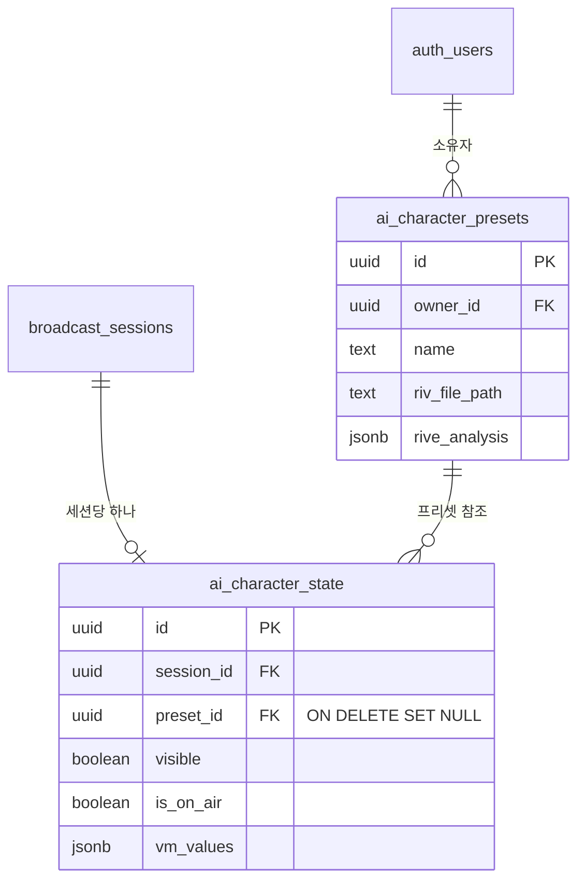
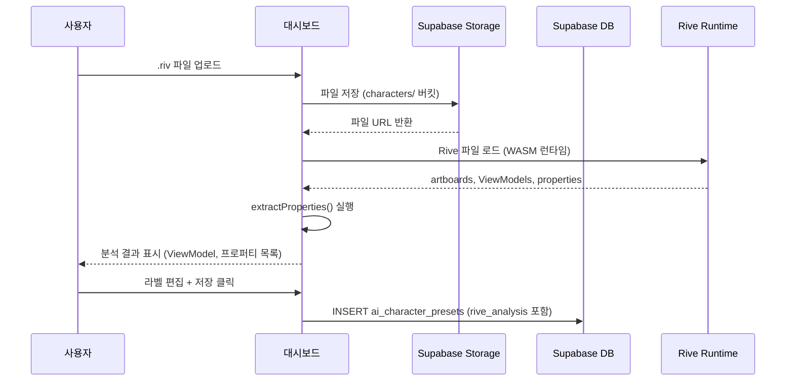
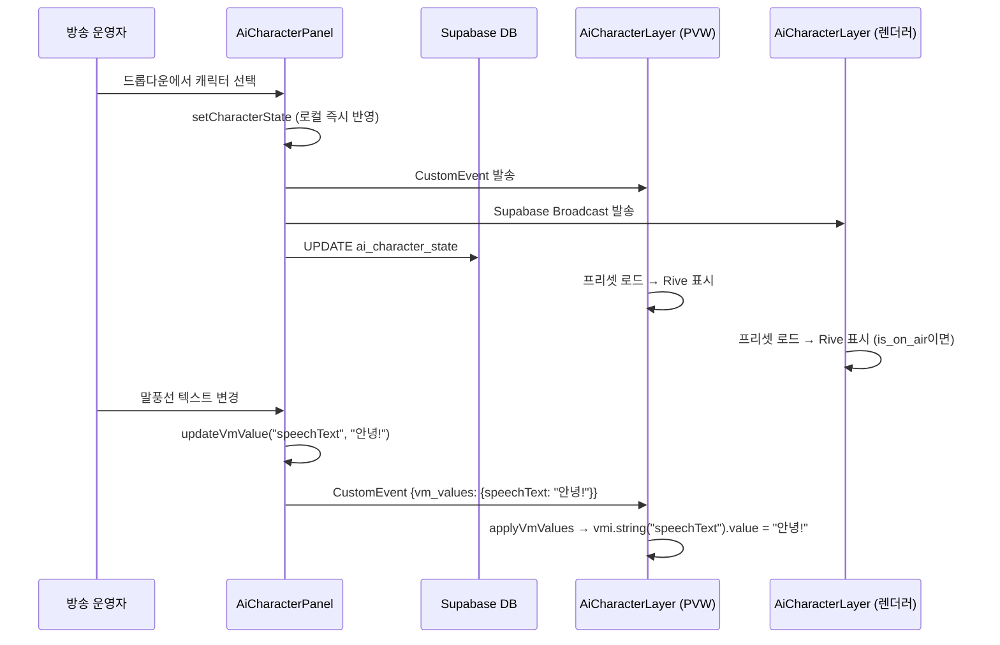

# AI 캐릭터 시스템 — Rive ViewModel 기반 완전 가이드

> **최종 업데이트:** 2026-02-14  
> **대상 독자:** TypeScript/React 경험이 적어도 이해할 수 있도록 최대한 상세히 작성

---

## 목차

1. [시스템 개요](#1-시스템-개요)
2. [전체 아키텍처](#2-전체-아키텍처)
3. [데이터베이스 스키마](#3-데이터베이스-스키마)
4. [타입 정의 상세](#4-타입-정의-상세)
5. [파일별 역할과 구조](#5-파일별-역할과-구조)
6. [데이터 흐름 상세](#6-데이터-흐름-상세)
7. [실시간 동기화 메커니즘](#7-실시간-동기화-메커니즘)
8. [Rive 분석기 동작 원리](#8-rive-분석기-동작-원리)
9. [가시성 판단 로직](#9-가시성-판단-로직)
10. [오늘 해결한 버그들](#10-오늘-해결한-버그들)
11. [관련 파일 전체 목록](#11-관련-파일-전체-목록)
12. [향후 개선 사항](#12-향후-개선-사항)

---

## 1. 시스템 개요

### 뭘 하는 시스템인가?

방송 송출 시스템에서 **Rive 애니메이션 캐릭터**를 화면에 띄우는 기능입니다.

간단히 말하면:
1. **대시보드**에서 `.riv` 파일을 업로드하면 → 캐릭터가 등록됨
2. **컨트롤러**에서 캐릭터를 선택하고 프로퍼티를 조작하면 → 미리보기(PVW)에 즉시 보임
3. **ON AIR** 버튼을 누르면 → 실제 송출(PGM/렌더러)에도 보임

### Rive란?

[Rive](https://rive.app/)는 인터랙티브 애니메이션 도구입니다. `.riv` 파일 안에는:
- **아트보드(Artboard):** 캔버스 (포토샵의 레이어 그룹과 비슷)
- **ViewModel:** 외부에서 제어할 수 있는 프로퍼티 묶음 (데이터 바인딩)
- **프로퍼티:** 문자열, 숫자, 불리언, 트리거 등 각종 값

ViewModel의 프로퍼티 값을 바꾸면 캐릭터의 표정, 말풍선 텍스트, 색상 등이 바뀝니다.

---

## 2. 전체 아키텍처


### 핵심 구성 요소 요약

| 구성 요소 | 파일 | 역할 |
|---|---|---|
| 타입 정의 | `aiCharacterTypes.ts` | 모든 인터페이스/타입의 중앙 정의 |
| 대시보드 | `characters.tsx` | 프리셋 생성, .riv 분석, 프로퍼티 설정 |
| 컨트롤러 | `AiCharacterPanel.tsx` | 프리셋 선택, 프로퍼티 조작 UI |
| 렌더링 | `AiCharacterLayer.tsx` | Rive 파일 로드 + 화면 표시 |
| 렌더러 | `render.tsx` | OBS 브라우저 소스용 출력 |
| DB 스키마 | `202602130002_ai_character.sql` | 테이블 생성 |
| DB FK 수정 | `202602140003_fix_preset_fk.sql` | FK 제약 수정 |

---

## 3. 데이터베이스 스키마

### 3-1. `ai_character_presets` — 캐릭터 프리셋

대시보드에서 `.riv` 파일을 업로드하고 분석한 결과를 저장하는 테이블입니다.  
"프리셋"이란 하나의 캐릭터 설정을 의미합니다.

```sql
CREATE TABLE public.ai_character_presets (
  id UUID PRIMARY KEY DEFAULT gen_random_uuid(),
  owner_id UUID REFERENCES auth.users(id) ON DELETE CASCADE NOT NULL,
  name TEXT NOT NULL,                    -- 캐릭터 이름 (예: "AI 아나운서")
  description TEXT,                     -- 설명 (선택)
  riv_file_path TEXT NOT NULL,           -- Storage 경로 (1234_skin.riv)
  rive_analysis JSONB,                   -- .riv 분석 결과 (JSON)
  action_mappings JSONB DEFAULT '[]',    -- 레거시 액션 매핑
  created_at TIMESTAMPTZ DEFAULT now()
);
```

**`rive_analysis` 필드**가 가장 중요합니다. `.riv` 파일을 분석한 결과가 JSON으로 저장됩니다:

```json
{
  "artboards": ["Character"],
  "viewModels": [
    {
      "name": "MainViewModel",
      "properties": [
        { "name": "speechText", "type": "string", "label": "말풍선" },
        { "name": "isHappy", "type": "boolean", "label": "행복 표정" },
        { "name": "wave", "type": "trigger", "label": "손흔들기" }
      ],
      "isDefault": true
    }
  ],
  "viewModelName": "MainViewModel",
  "properties": [/* 위와 같은 내용 — 하위 호환 */],
  "analyzedAt": "2026-02-14T..."
}
```

### 3-2. `ai_character_state` — 세션별 실시간 상태

방송 세션마다 "지금 어떤 캐릭터가 선택되어 있고, 프로퍼티 값이 뭔지"를 저장합니다.

```sql
CREATE TABLE public.ai_character_state (
  id UUID PRIMARY KEY DEFAULT gen_random_uuid(),
  session_id UUID REFERENCES public.broadcast_sessions(id) ON DELETE CASCADE NOT NULL,
  preset_id UUID REFERENCES public.ai_character_presets(id) ON DELETE SET NULL,
  visible BOOLEAN DEFAULT false,         -- 캐릭터 표시 여부
  is_on_air BOOLEAN DEFAULT false,       -- PGM/렌더러 표시 여부
  vm_values JSONB DEFAULT '{}',          -- ViewModel 프로퍼티 현재값
  updated_at TIMESTAMPTZ DEFAULT now(),
  UNIQUE(session_id)                     -- 세션당 하나의 캐릭터 상태
);
```

**`vm_values` 필드 예시:**
```json
{
  "speechText": "안녕하세요!",
  "isHappy": true,
  "backgroundColorR": 128
}
```

### 3-3. FK 제약 관계도



> **중요:** `preset_id`의 FK는 `ON DELETE SET NULL`입니다.  
> → 프리셋을 삭제하면 `ai_character_state.preset_id`가 자동으로 `null`이 됩니다.

### 3-4. 마이그레이션 파일 목록

| 파일명 | 내용 |
|---|---|
| `202602130002_ai_character.sql` | 프리셋 + 상태 테이블 생성, RLS, Storage 버킷 |
| `202602140001_ai_character_preset_config.sql` | `rive_analysis`, `action_mappings` 컬럼 추가 |
| `202602140002_ai_character_viewmodel.sql` | `vm_values`, `is_on_air` 컬럼 추가 |
| `202602140003_fix_preset_fk.sql` | FK를 `ON DELETE SET NULL`로 변경 |

---

## 4. 타입 정의 상세

파일: [aiCharacterTypes.ts](file:///home/genk/topProject/2026.WebCg-K/webcg-k/src/lib/aiCharacterTypes.ts)

TypeScript에서 "타입"이란 "이 변수에 어떤 형태의 데이터가 들어올 수 있는가"를 미리 정의하는 것입니다.

### 4-1. `RivePropertyType` — 프로퍼티 종류

```typescript
export type RivePropertyType =
    | "string"    // 텍스트 (말풍선 내용 등)
    | "number"    // 숫자 (색상값, 크기 등)
    | "boolean"   // 참/거짓 (표정 토글 등)
    | "color"     // 색상 (0xAARRGGBB 형태의 숫자)
    | "trigger"   // 일회성 실행 (손흔들기, 박수 등)
    | "enum"      // 선택지 목록 (감정: 행복/슬픔/화남)
    | "image"     // 이미지
    | "list";     // 리스트 (하위 ViewModel 참조)
```

이것은 **유니온 타입(Union Type)** 입니다. `|`로 구분된 값들 중 **하나만** 가능합니다.  
예를 들어 어떤 프로퍼티의 type이 `"string"`이면 컨트롤러에서 텍스트 입력창을 보여주고,  
`"trigger"`이면 버튼을 보여줍니다.

### 4-2. `RivePropertyInfo` — 프로퍼티 한 개의 정보

```typescript
export interface RivePropertyInfo {
    name: string;            // 프로퍼티 이름 (Rive 에디터에서 정한 것)
    type: RivePropertyType;  // 위에서 정의한 타입 중 하나
    label?: string;          // 한글 라벨 (선택) — 대시보드에서 편집
    hidden?: boolean;        // 숨길지 여부 (선택)
    order?: number;          // 정렬 순서 (선택)
    enumValues?: string[];   // enum일 때만 사용 — 선택 가능한 값 목록
    viewModelRef?: string;   // list일 때만 사용 — 참조하는 ViewModel 이름
}
```

물음표(`?`)가 붙은 필드는 **선택적(optional)** 입니다. 있어도 되고 없어도 됩니다.

### 4-3. `RiveViewModelInfo` — ViewModel 하나의 분석 결과

```typescript
export interface RiveViewModelInfo {
    name: string;                    // ViewModel 이름
    properties: RivePropertyInfo[];  // 이 VM이 가진 프로퍼티 목록
    isDefault?: boolean;             // 기본 ViewModel인지 여부
}
```

하나의 `.riv` 파일에 ViewModel이 **여러 개** 있을 수 있습니다.

### 4-4. `RiveAnalysis` — .riv 파일 전체 분석 결과

```typescript
export interface RiveAnalysis {
    artboards: string[];             // 아트보드 이름 목록
    stateMachines: string[];         // 상태 머신 이름 목록 (예: ["Motion"])
    viewModels: RiveViewModelInfo[]; // 모든 ViewModel 분석 결과 (배열)
    viewModelName: string | null;    // 기본 VM 이름 (하위 호환)
    properties: RivePropertyInfo[];  // 기본 VM의 프로퍼티 목록 (하위 호환)
    analyzedAt: string;              // 분석한 시각
}
```

> **하위 호환(backward compatibility)이란?**  
> 처음에는 ViewModel이 1개만 있다고 가정하고 `viewModelName`과 `properties`를 사용했습니다.  
> 나중에 다중 ViewModel을 지원하면서 `viewModels` 배열을 추가했지만,  
> 기존 코드가 깨지지 않도록 이전 필드도 유지합니다.

### 4-5. `AiCharacterPreset` — DB 프리셋 레코드

```typescript
export interface AiCharacterPreset {
    id: string;                        // UUID (DB 자동 생성)
    owner_id: string;                  // 소유자 UUID
    name: string;                      // "AI 아나운서"
    description: string | null;        // 설명 (없을 수 있음)
    riv_file_path: string;             // Storage 경로
    rive_analysis: RiveAnalysis | null;// 분석 결과 (없을 수 있음)
    action_mappings: CharacterActionMapping[]; // 레거시
    created_at: string;
}
```

### 4-6. `AiCharacterState` — 세션 실시간 상태

```typescript
export interface AiCharacterState {
    id: string;
    session_id: string;
    preset_id: string | null;          // 선택된 프리셋 (없으면 null)
    is_on_air: boolean;                // ON AIR 상태
    vm_values: Record<string, any>;    // 프로퍼티 현재값 (키-값 딕셔너리)
    visible: boolean;                  // 화면 표시 여부
    updated_at: string;
}
```

> `Record<string, any>`는 "키는 문자열, 값은 아무거나" 형태의 객체입니다.  
> 예: `{ "speechText": "안녕", "isHappy": true }`

---

## 5. 파일별 역할과 구조

### 5-1. 대시보드 — [characters.tsx](file:///home/genk/topProject/2026.WebCg-K/webcg-k/src/routes/dashboard/characters.tsx)

**역할:** 캐릭터 프리셋 생성/편집/삭제 (CRUD)

**주요 기능:**
- `.riv` 파일 업로드 → Supabase Storage에 저장
- 업로드된 `.riv` 파일을 자동 분석 (ViewModel, 프로퍼티 추출)
- 프리셋 목록 표시 + 삭제

**삭제 로직 (FK 충돌 방지):**
```typescript
const handleDelete = async (preset) => {
    // 1단계: ai_character_state에서 이 프리셋 참조 해제
    await supabase.from("ai_character_state")
        .update({ preset_id: null, visible: false, vm_values: {} })
        .eq("preset_id", preset.id);

    // 2단계: Storage 파일 삭제
    await supabase.storage.from("characters").remove([preset.riv_file_path]);

    // 3단계: 프리셋 레코드 삭제
    await supabase.from("ai_character_presets")
        .delete().eq("id", preset.id);
};
```

왜 이 순서인가? → `ai_character_state`가 `preset_id`를 참조(FK)하고 있으므로,  
참조를 먼저 해제해야 프리셋을 삭제할 수 있습니다.

---

### 5-2. 컨트롤러 패널 — [AiCharacterPanel.tsx](file:///home/genk/topProject/2026.WebCg-K/webcg-k/src/components/Controller/AiCharacterPanel.tsx)

**역할:** 방송 중 캐릭터를 조작하는 UI

**구조:**

```
┌─────────────────────────────────────┐
│  [드롭다운: 캐릭터 선택]  [PVW/ON AIR] │
├─────────────────────────────────────┤
│  speechText (string) → 텍스트 입력     │
│  isHappy (boolean) → 토글 스위치       │
│  wave (trigger) → 버튼               │
│  mood (enum) → 드롭다운              │
│  bgColor (color) → 컬러 피커          │
│  volume (number) → 슬라이더           │
└─────────────────────────────────────┘
```

**핵심 함수들:**

| 함수 | 역할 |
|---|---|
| `loadData()` | 초기에 프리셋 목록 + 현재 상태를 DB에서 로드 |
| `broadcastStateChange()` | 상태 변경을 PVW/PGM/렌더러에 전파 |
| `updateState()` | DB 업데이트 + 로컬 상태 갱신 + 이벤트 발송 |
| `updateVmValue()` | 프로퍼티 하나의 값 변경 |
| `handlePresetSelect()` | 드롭다운에서 캐릭터 선택/해제 |
| `handleToggleOnAir()` | ON AIR 상태 토글 |

**`broadcastStateChange` 동작 방식:**

```typescript
const broadcastStateChange = (newState) => {
    // 1) 같은 페이지의 Layer에 전달 (브라우저 이벤트)
    window.dispatchEvent(
        new CustomEvent("ai-character-state-change", {
            detail: { sessionId, state: newState },
        })
    );

    // 2) 렌더러(다른 브라우저 탭/페이지)에 전달
    broadcastChannelRef.current?.send({
        type: "broadcast",
        event: "state-change",
        payload: newState,
    });
};
```

**프로퍼티 타입별 자동 UI 컨트롤:**

| 프로퍼티 타입 | 생성되는 UI | 구현 컴포넌트 |
|---|---|---|
| `trigger` | 버튼 (클릭하면 애니메이션 실행) | `TriggerControl` |
| `string` | 텍스트 입력 + 전송 버튼 | `StringControl` |
| `number` | 숫자 슬라이더 (0~100) | `NumberControl` |
| `boolean` | 토글 스위치 | `BooleanControl` |
| `enum` | 드롭다운 메뉴 | `EnumControl` |
| `color` | 컬러 피커 | `ColorControl` |

---

### 5-3. 렌더링 레이어 — [AiCharacterLayer.tsx](file:///home/genk/topProject/2026.WebCg-K/webcg-k/src/components/Controller/AiCharacterLayer.tsx)

**역할:** 실제로 Rive 캐릭터를 화면에 그리는 컴포넌트

이 컴포넌트는 **3군데에서 사용**됩니다:

| 사용 위치 | mode | 동작 |
|---|---|---|
| PVW 모니터 (컨트롤러) | `"preview"` | 프리셋 선택만 해도 표시 |
| PGM 모니터 (컨트롤러) | `"pgm"` | ON AIR일 때만 표시 |
| 렌더러 (OBS 출력) | `"pgm"` | ON AIR일 때만 표시 |

**컴포넌트 생명주기:**

```
1. 마운트
   └→ loadState() : DB에서 현재 상태 로드
   └→ 프리셋이 있으면 Storage에서 .riv 파일 URL 생성
   └→ useRive()에 URL 전달 → Rive 렌더러 초기화

2. 이벤트 수신 (Panel에서 변경 시)
   └→ CustomEvent "ai-character-state-change" 수신 (같은 페이지)
   └→ Supabase Broadcast "state-change" 수신 (렌더러)
   └→ handleStateChange() 실행
       └→ characterState 갱신
       └→ 프리셋 변경 시 새 .riv 파일 로드
       └→ vm_values 변경 시 applyVmValues() 실행

3. Rive ViewModel 값 적용
   └→ applyVmValues()에서 각 프로퍼티 타입에 맞게 값 설정
       string → vmi.string("key").value = "값"
       number → vmi.number("key").value = 123
       boolean → vmi.boolean("key").value = true
       trigger → vmi.trigger("key").trigger()
```

**가시성 판단 (`shouldShow`):**

```typescript
const shouldShow = (() => {
    // 프리셋 미선택 또는 visible=false → 숨김
    if (!characterState?.preset_id || !characterState?.visible) return false;
    // preview 모드 → 프리셋 있으면 무조건 표시
    if (mode === "preview") return true;
    // pgm 모드 → ON AIR일 때만 표시
    return characterState.is_on_air;
})();
```

**`useRef`가 뭔가요?**

React에서 `useState`로 만든 값은 변경하면 화면이 다시 그려집니다(re-render).  
`useRef`는 값을 저장하지만 **화면을 다시 그리지 않습니다**.

이 파일에서 사용하는 3개의 ref:

| ref | 용도 |
|---|---|
| `riveRef` | Rive 인스턴스 참조 (useEffect 콜백에서 접근용) |
| `prevVmValuesRef` | 이전 vm_values 저장 (trigger 중복 실행 방지) |
| `presetIdRef` | 최신 preset.id 저장 (이벤트 콜백의 stale closure 방지) |

> **⚠️ Rive 바인딩 핵심 규칙** (2026-02-14 심야 수정)
> - `autoBind: true` + `stateMachines` 동적 지정 (프리셋의 `rive_analysis.stateMachines[0]`)
> - VMI를 캐시하지 않음: 매번 `rive.viewModelInstance`에서 fresh 참조
> - `useViewModelInstance` 훅을 **사용하지 않음**: 내부 `bindViewModelInstance()`가 애니메이션 중단시킴
> - `prop.value = value` : 애니메이션 루프 실행 중이면 다음 프레임에 자동 반영

---

### 5-4. 렌더러 페이지 — [render.tsx](file:///home/genk/topProject/2026.WebCg-K/webcg-k/src/routes/render.tsx)

**역할:** OBS/vMix의 "브라우저 소스"로 사용되는 투명 배경 출력 페이지

**URL:** `http://localhost:3000/render?sessionId=xxx&resolution=1080p`

**레이어 구조:**

```
render.tsx
├── Layer 1: 타임라인 그래픽 (isLive일 때만)
├── Layer 2: 오버레이 (isLive일 때만)
└── Layer 3: AI 캐릭터 (항상 마운트, 내부에서 is_on_air 체크)
```

```tsx
{/* 오버레이 — 송출 중일 때만 */}
{isLive && sessionId && <OverlayPlayoutLayer sessionId={sessionId} />}
{/* AI 캐릭터 — 항상 마운트 */}
{sessionId && <AiCharacterLayer sessionId={sessionId} mode="pgm" />}
```

> **왜 캐릭터는 `isLive` 조건이 없는가?**  
> `AiCharacterLayer` 내부에서 `is_on_air` 상태를 직접 체크합니다.  
> `isLive` 조건을 걸면 라이브 전에는 컴포넌트가 마운트되지 않아서  
> Supabase Broadcast 구독조차 시작되지 않습니다.  
> 항상 마운트하되, 표시 여부는 내부 로직이 결정합니다.

---

## 6. 데이터 흐름 상세

### 6-1. 캐릭터 등록 흐름 (대시보드)



### 6-2. 방송 조작 흐름 (컨트롤러)



---

## 7. 실시간 동기화 메커니즘

### 왜 Supabase Realtime(postgres_changes)을 안 쓰는가?

원래 `ai_character_state` 테이블의 변경을 `postgres_changes` 이벤트로 감지하려 했지만, **실제로 이벤트가 발생하지 않는 문제**가 있었습니다. 마이그레이션에서 `ALTER PUBLICATION supabase_realtime ADD TABLE public.ai_character_state;`를 했지만, `db reset` 이후 재적용 문제 등으로 동작하지 않았습니다.

### 현재 사용 중인 2가지 채널

```
┌──────────────────┐     CustomEvent        ┌───────────────────┐
│ AiCharacterPanel │ ──────────────────────→ │ AiCharacterLayer  │
│   (컨트롤러)      │     (브라우저 내장)       │ (같은 페이지 PVW/PGM) │
└──────────────────┘                        └───────────────────┘
        │
        │  Supabase Broadcast
        │  (WebSocket)
        ▼
┌───────────────────┐
│ AiCharacterLayer  │
│ (렌더러 - 별도 탭)  │
└───────────────────┘
```

#### 채널 1: CustomEvent (같은 페이지)

```typescript
// 보내는 쪽 (Panel)
window.dispatchEvent(new CustomEvent("ai-character-state-change", {
    detail: { sessionId, state: newState }
}));

// 받는 쪽 (Layer)
window.addEventListener("ai-character-state-change", (e) => {
    const { sessionId, state } = e.detail;
    handleStateChange(state);
});
```

- **장점:** 지연 없음 (0ms), WebSocket 불필요
- **단점:** 같은 브라우저 탭에서만 작동

#### 채널 2: Supabase Broadcast (다른 페이지)

```typescript
// 보내는 쪽 (Panel — 채널 사전 구독 필수!)
const ch = supabase.channel("ai-char-sync:세션ID");
ch.subscribe();  // ← 이거 없으면 send()가 무시됨!
ch.send({ type: "broadcast", event: "state-change", payload: newState });

// 받는 쪽 (Layer — 렌더러)
supabase.channel("ai-char-sync:세션ID")
    .on("broadcast", { event: "state-change" }, (payload) => {
        handleStateChange(payload.payload);
    })
    .subscribe();
```

- **장점:** 다른 브라우저 탭/기기에서도 수신 가능
- **주의:** 채널을 **반드시 subscribe()** 한 이후에 `send()`해야 합니다!

---

## 8. Rive 분석기 동작 원리

파일: [characters.tsx](file:///home/genk/topProject/2026.WebCg-K/webcg-k/src/routes/dashboard/characters.tsx) (약 344~460줄)

### 분석 과정

```
1. .riv 파일 → Rive WASM 런타임 로드
2. riveObj.artboardCount → 아트보드 목록 수집
3. riveObj에서 enum 목록 추출 (enumMap)
4. riveObj.viewModelCount → ViewModel 순회
   ├→ viewModelByIndex(i) → VM 객체 접근
   ├→ extractProperties(vm) → 프로퍼티 추출
   │   ├→ vm.properties → 프로퍼티 배열
   │   ├→ prop.type → 타입 매핑 (Rive 내부 숫자 → 문자열)
   │   ├→ prop.enumName → enum 값 목록 연결
   │   └→ prop.viewModelName → list 참조 ViewModel 연결
   └→ RiveViewModelInfo 객체 생성
5. viewModelCount=0이면 → fallback: defaultViewModel() 시도
6. 결과를 RiveAnalysis 형태로 저장
```

### 타입 매핑 테이블

Rive 런타임은 프로퍼티 타입을 **숫자**로 반환합니다. 이를 의미 있는 문자열로 변환:

```typescript
const RIVE_DATA_TYPE_MAP: Record<number, RivePropertyType> = {
    1: "string",
    2: "number",
    3: "boolean",
    4: "color",
    5: "list",
    6: "enum",
    // ...
};

// 문자열로 올 경우의 fallback 매핑
const RIVE_DATA_TYPE_STR_MAP: Record<string, RivePropertyType> = {
    "string": "string",
    "number": "number",
    "boolean": "boolean",
    "trigger": "trigger",
    // ...
};
```

---

## 9. 가시성 판단 로직

| 상황 | `visible` | `preset_id` | `is_on_air` | PVW (preview) | PGM (pgm) | 렌더러 (pgm) |
|---|---|---|---|---|---|---|
| 아무것도 선택 안 함 | `false` | `null` | `false` | ❌ | ❌ | ❌ |
| 캐릭터 선택 | `true` | `"abc"` | `false` | ✅ | ❌ | ❌ |
| ON AIR 켜기 | `true` | `"abc"` | `true` | ✅ | ✅ | ✅ |
| ON AIR 끄기 | `true` | `"abc"` | `false` | ✅ | ❌ | ❌ |
| 캐릭터 선택 해제 | `false` | `null` | `false` | ❌ | ❌ | ❌ |

**판단 로직 (코드):**

```typescript
const shouldShow = (() => {
    if (!preset_id || !visible) return false;  // 선택 안 됨 → 숨김
    if (mode === "preview") return true;       // PVW → 항상 표시
    return is_on_air;                          // PGM → ON AIR만
})();
```

---

## 10. 오늘 해결한 버그들

### 버그 1: 프리셋 선택 시 프로퍼티 목록 안 보임

**증상:** 드롭다운에서 캐릭터 선택 → 프로퍼티 목록이 안 나옴. 탭 전환 후 돌아오면 보임.

**원인:** `updateState()`가 DB만 업데이트하고 로컬 `characterState`를 갱신하지 않음.

**수정:** `updateState()`에 **optimistic update** 추가:
```typescript
const merged = { ...characterState, ...partial };
setCharacterState(merged);
```

### 버그 2: PVW/PGM에서 새로고침해야 캐릭터 표시

**증상:** 프리셋 선택 후 PVW에 캐릭터가 안 보임. 새로고침하면 보임.

**원인:** Supabase `postgres_changes` Realtime이 `ai_character_state` 테이블에서 동작하지 않음.

**수정:** `postgres_changes` 대신 **CustomEvent + Supabase Broadcast** 방식으로 전환.

### 버그 3: Realtime 콜백의 stale closure

**증상:** 프리셋을 변경해도 이전 프리셋이 계속 표시됨.

**원인:** `useEffect`의 Realtime 콜백 안에서 `preset?.id`를 직접 참조 → 클로저가 초기값으로 고정.

**수정:** `presetIdRef` (useRef)로 최신 preset.id를 추적.

### 버그 4: 렌더러에서 캐릭터 안 표시

**증상:** 렌더러 페이지에서 캐릭터가 전혀 표시되지 않음.

**원인:** 실제 렌더러 파일인 `render.tsx`에 `AiCharacterLayer` 컴포넌트가 없었음.

**수정:** `render.tsx`에 `AiCharacterLayer` import + 렌더링 추가.

### 버그 5: 렌더러 Broadcast 수신 안 됨

**증상:** 렌더러에서 Broadcast가 수신되지 않음.

**원인:** Panel에서 Broadcast 채널을 `subscribe()` 없이 `send()` 호출 → 메시지 무시됨.

**수정:** `useEffect`에서 채널을 사전 구독하고 `broadcastChannelRef`에 저장.

### 버그 6: 프리셋 삭제 시 409 Conflict

**증상:** 캐릭터 삭제 시 `DELETE 409 (Conflict)` 에러.

**원인:** `ai_character_state.preset_id` FK에 `ON DELETE` 규칙이 없어서 참조 중인 프리셋 삭제 불가.

**수정:**
1. 삭제 핸들러에서 먼저 `preset_id`를 `null`로 해제
2. FK를 `ON DELETE SET NULL`로 변경하는 마이그레이션 추가

### 버그 7: ViewModel 프로퍼티 실시간 반영 안 됨 (2026-02-14 심야)

**증상:** 슬라이더를 움직여도 Rive 캐릭터가 변하지 않음. Play/Pause도 작동하지 않음.

**근본 원인 3가지:**

1. **Stale VMI 캐싱**: `vmInstanceRef`에 저장한 VMI가 오래되어 `vmi.number("key")`가 `null` 반환.
   - Rive의 `viewModelInstance`는 접근할 때마다 새 래퍼 객체를 반환하므로 캐싱하면 안 됨

2. **`useViewModelInstance` 훅의 부작용**: 이 훅 내부가 `rive.bindViewModelInstance(vmi)`를 호출하면서 **Rive 아트보드를 재생성** → 실행 중이던 State Machine(애니메이션 루프)이 중단됨
   - 애니메이션 루프가 멈추면 `prop.value = value`를 설정해도 렌더 프레임이 없어 화면에 반영 안 됨

3. **`stateMachines` 미지정**: `useRive()`에 `stateMachines`를 지정하지 않아 `play()`/`pause()` 호출 시 대상이 없음

**수정:**
```diff
// BEFORE (문제 있던 코드)
- const { rive, RiveComponent } = useRive({ src: rivUrl, autoplay: true, autoBind: true });
- const viewModel = useViewModel(rive);  // 훅 사용
- const viewModelInstance = useViewModelInstance(viewModel);  // bindViewModelInstance 호출!
- let vmi = vmInstanceRef.current;  // stale 캐시!
- if (!vmi) { vmi = rive.viewModelInstance; vmInstanceRef.current = vmi; }

// AFTER (수정된 코드)
+ const smName = preset?.rive_analysis?.stateMachines?.[0] ?? "Motion";
+ const { rive, RiveComponent } = useRive({
+   src: rivUrl, stateMachines: smName, autoplay: true, autoBind: true,
+ });
+ // 훅 사용하지 않음! autoBind가 자동으로 바인딩한 VMI를 직접 접근
+ const vmi = (rive as any).viewModelInstance;  // 매번 fresh!
```

**핵심 교훈:** "Rive의 `useViewModelInstance` 훅은 편리하지만, `autoBind: true`와 함께 사용하면 State Machine을 중단시킵니다. 동적 프로퍼티 제어가 필요하면 `autoBind: true`로 자동 바인딩하고, `rive.viewModelInstance`에서 매번 fresh VMI를 가져와 `prop.value`를 직접 설정하세요."
---

## 11. 관련 파일 전체 목록

### TypeScript/React 파일

| 파일 | 경로 | 역할 | 라인수 |
|---|---|---|---|
| `aiCharacterTypes.ts` | `src/lib/` | 타입 정의 (인터페이스) | 104 |
| `rive-webgl2.d.ts` | `src/types/` | Rive 라이브러리 타입 보강 | 126 |
| `AiCharacterPanel.tsx` | `src/components/Controller/` | 컨트롤러 패널 UI | 602 |
| `AiCharacterLayer.tsx` | `src/components/Controller/` | Rive 렌더링 레이어 | 236 |
| `characters.tsx` | `src/routes/dashboard/` | 대시보드 (프리셋 관리) | ~1200 |
| `render.tsx` | `src/routes/` | OBS 렌더러 출력 | 338 |
| `PreviewMonitor.tsx` | `src/components/Controller/` | PVW 모니터 (Layer 포함) | ~190 |

### Rive 타입 보강 — [rive-webgl2.d.ts](file:///home/genk/topProject/2026.WebCg-K/webcg-k/src/types/rive-webgl2.d.ts)

`@rive-app/react-webgl2` 패키지 v4.26.2에는 **런타임에 존재하지만 TypeScript 타입 정의(`.d.ts`)에 누락된 API**들이 있습니다. TypeScript는 타입이 없으면 "이 함수/속성은 존재하지 않는다"고 에러를 내므로, 직접 타입을 보강(augment)했습니다.

**이 파일이 왜 필요한가?**

```typescript
// 이 파일이 없으면:
rive.viewModelCount  // ❌ TypeScript 에러: 'viewModelCount' 속성이 없습니다
rive.enums()         // ❌ TypeScript 에러: 'enums' 메서드가 없습니다
useViewModel(rive)   // ❌ TypeScript 에러: 'useViewModel'을 찾을 수 없습니다

// 이 파일이 있으면:
rive.viewModelCount  // ✅ number
rive.enums()         // ✅ any[]
useViewModel(rive)   // ✅ ViewModelRef | null
```

**보강한 주요 API들:**

| API | 용도 | 사용 위치 |
|---|---|---|
| `Rive.viewModelCount` | ViewModel 개수 조회 | 분석기 (characters.tsx) |
| `Rive.viewModelByIndex(i)` | 인덱스로 ViewModel 접근 | 분석기 |
| `Rive.defaultViewModel()` | 기본 ViewModel 가져오기 | 분석기 (fallback) |
| `Rive.enums()` | enum 목록 추출 | 분석기 |
| `useViewModel()` | ViewModel 참조 훅 | (향후 사용 예정) |
| `useViewModelInstance()` | ViewModel 인스턴스 훅 | (향후 사용 예정) |
| `useViewModelInstance*()` | 타입별 프로퍼티 제어 훅 (Boolean, Number, String, Color, Enum, Trigger, List, Image, Artboard) | (향후 사용 예정) |

> **`declare module`이란?**  
> TypeScript에서 외부 라이브러리에 타입을 추가/보강할 때 사용합니다.  
> 실제 코드를 변경하는 게 아니라, "이 라이브러리에 이런 API가 있다고 TypeScript에게 알려주는" 역할입니다.  
> 이 파일은 `src/types/` 폴더에 있고 `tsconfig.json`의 `include` 범위에 포함되어 자동으로 인식됩니다.

### SQL 마이그레이션

| 파일 | 내용 |
|---|---|
| `202602130002_ai_character.sql` | 테이블+RLS+Storage 생성 |
| `202602140001_ai_character_preset_config.sql` | rive_analysis, action_mappings 추가 |
| `202602140002_ai_character_viewmodel.sql` | vm_values, is_on_air 추가 |
| `202602140003_fix_preset_fk.sql` | FK ON DELETE SET NULL |

### 패키지 의존성

| 패키지 | 용도 |
|---|---|
| `@rive-app/react-webgl2` | Rive 애니메이션 렌더링 (WebGL2 기반) |
| `lucide-react` | UI 아이콘 (Radio, Eye, Bot 등) |
| `@supabase/supabase-js` | DB, Storage, Realtime, Broadcast |

---

## 12. 향후 개선 사항

| 항목 | 설명 | 우선순위 |
|---|---|---|
| Realtime 정상화 | `postgres_changes`가 왜 안 되는지 원인 파악 | 낮음 (현재 우회 방식 안정적) |
| E2E 테스트 | 캐릭터 선택 → PVW 표시 → ON AIR → 렌더러 표시 자동 테스트 | 중간 |
| 다중 캐릭터 | 세션당 여러 캐릭터 동시 표시 | 높음 |
| ViewModel 값 영속화 | vm_values를 프리셋에 저장하여 세션 간 유지 | 중간 |
| list 타입 지원 | ViewModel list 프로퍼티에 대한 UI 컨트롤 | 낮음 |
| 디버그 로그 정리 | `console.log` 문 제거 또는 조건부 출력 | 낮음 |
