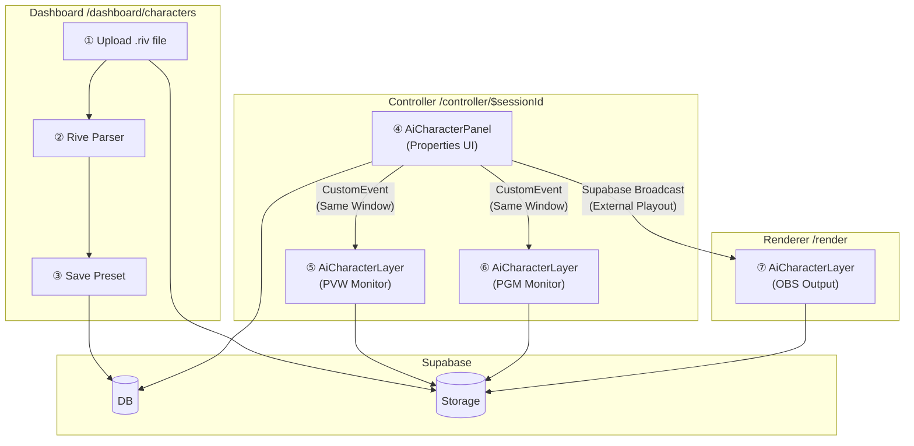
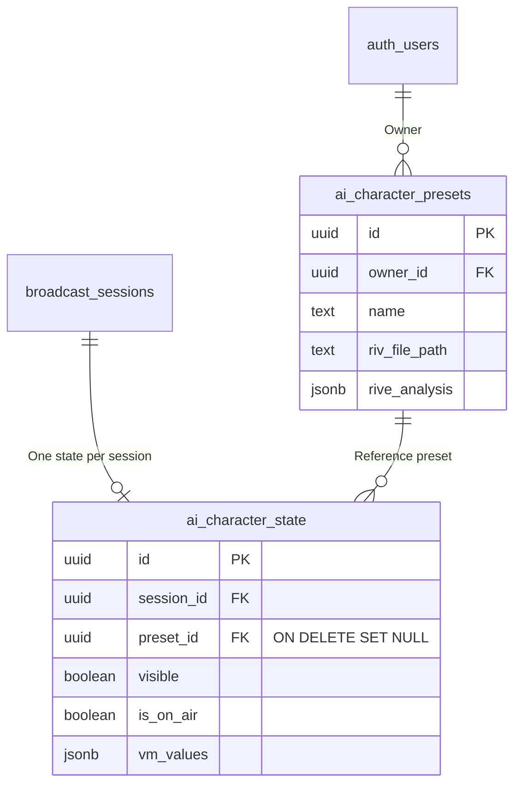
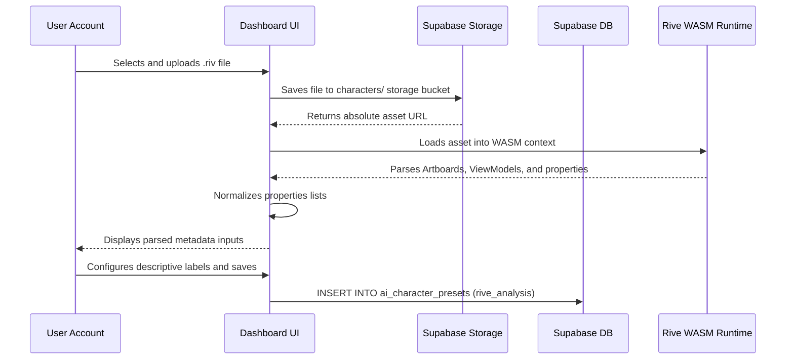
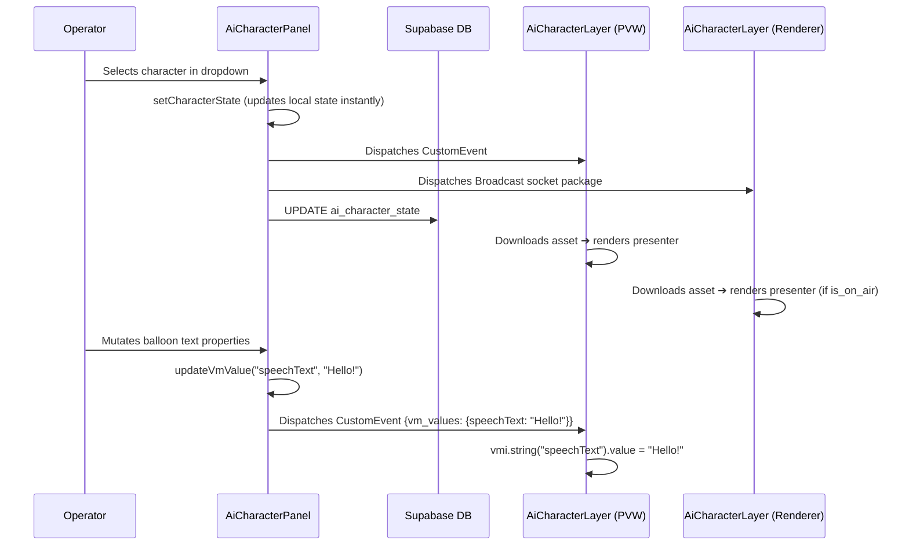

# AI Character System — Complete Guide (Rive ViewModel-Based)

> **Last Updated:** 2026-02-14  
> **Target Audience:** Detailed breakdown accessible to developers with varying levels of TypeScript and React experience.

---

## Table of Contents

1. [System Overview](#1-system-overview)
2. [System Architecture](#2-system-architecture)
3. [Database Schema](#3-database-schema)
4. [TypeScript Type Bindings](#4-typescript-type-bindings)
5. [File Responsibilities & Internal Logic](#5-file-responsibilities--internal-logic)
6. [Operational Data Flows](#6-operational-data-flows)
7. [Real-time Playout Synchronization](#7-real-time-playout-synchronization)
8. [Rive Asset Parser Operations](#8-rive-asset-parser-operations)
9. [Playout Visibility Logic](#9-playout-visibility-logic)
10. [Bug Retro & Resolutions Log](#10-bug-retro--resolutions-log)
11. [Complete Component Index](#11-complete-component-index)
12. [Future Improvements Roadmap](#12-future-improvements-roadmap)

---

## 1. System Overview

### What is this system?

This feature renders dynamic **Rive animated characters** on playout channels and transparent stream layers.

In brief:
1. **Dashboard**: Upload `.riv` assets to register custom presenter characters.
2. **Controller**: Selection and property adjustments render instantly on the Preview monitor (PVW).
3. **ON AIR Playout**: Toggling active states pushes animated presenters live to Program (PGM) and external OBS Renderers.

### What is Rive?

[Rive](https://rive.app/) is an industry-standard real-time interactive vector animation toolkit. A `.riv` file encapsulates:
- **Artboards**: Drawing canvases containing shapes, lines, and layers.
- **ViewModel**: Data binding layers grouping dynamic control properties.
- **Properties**: Variables (strings, numbers, booleans, triggers, and colors) exposed for external manipulation.

Mutating ViewModel properties dynamically alters character expressions, balloon texts, colors, and motions at run time.

---

## 2. System Architecture



### Component Map Summaries

| Component | File Path | Core Role |
|---|---|---|
| Type Bindings | `aiCharacterTypes.ts` | Declares system models and TypeScript interface structures. |
| Dashboard | `characters.tsx` | Preset creation, `.riv` metadata parser, and slot mappings. |
| Controller | `AiCharacterPanel.tsx` | Character selector dropdown and variable controls panel. |
| Rendering Layer | `AiCharacterLayer.tsx` | Boots the WebGL2 canvas context, downloads `.riv` files, and mutates shapes. |
| Renderer | `render.tsx` | Renders the presenter overlay for transparent broadcast software. |
| Database Schema | `202602130002_ai_character.sql` | Builds primary SQL storage and state tables. |
| DB Schema Revision | `202602140003_fix_preset_fk.sql` | Corrects DB foreign-key cascade parameters. |

---

## 3. Database Schema

### 3-1. `ai_character_presets` — Presenter Profiles

Stores parsed metadata and asset endpoints for custom presenter characters.

```sql
CREATE TABLE public.ai_character_presets (
  id UUID PRIMARY KEY DEFAULT gen_random_uuid(),
  owner_id UUID REFERENCES auth.users(id) ON DELETE CASCADE NOT NULL,
  name TEXT NOT NULL,                    -- Character profile name (e.g. "AI Anchor")
  description TEXT,                      -- Optional visual details
  riv_file_path TEXT NOT NULL,           -- Storage bucket filepath endpoint (e.g. 1234_skin.riv)
  rive_analysis JSONB,                   -- Metadata from Rive Parser (JSON)
  action_mappings JSONB DEFAULT '[]',    -- Legacy action bindings
  created_at TIMESTAMPTZ DEFAULT now()
);
```

The **`rive_analysis` field** stores parsed metadata mapping exposed Artboards and variables:

```json
{
  "artboards": ["Character"],
  "viewModels": [
    {
      "name": "MainViewModel",
      "properties": [
        { "name": "speechText", "type": "string", "label": "Speech Text" },
        { "name": "isHappy", "type": "boolean", "label": "Expression: Happy" },
        { "name": "wave", "type": "trigger", "label": "Action: Wave Hands" }
      ],
      "isDefault": true
    }
  ],
  "viewModelName": "MainViewModel",
  "properties": [],
  "analyzedAt": "2026-02-14T..."
}
```

### 3-2. `ai_character_state` — Live Playout Sessions State

Stores the current active character and variable parameters for live sessions.

```sql
CREATE TABLE public.ai_character_state (
  id UUID PRIMARY KEY DEFAULT gen_random_uuid(),
  session_id UUID REFERENCES public.broadcast_sessions(id) ON DELETE CASCADE NOT NULL,
  preset_id UUID REFERENCES public.ai_character_presets(id) ON DELETE SET NULL,
  visible BOOLEAN DEFAULT false,         -- Panel visibility toggles
  is_on_air BOOLEAN DEFAULT false,       -- Active playout state
  vm_values JSONB DEFAULT '{}',          -- Presenter parameters key-value records
  updated_at TIMESTAMPTZ DEFAULT now(),
  UNIQUE(session_id)                     -- Strictly one character state per session
);
```

**`vm_values` Record Example:**
```json
{
  "speechText": "Welcome to live news coverage!",
  "isHappy": true,
  "backgroundColorR": 128
}
```

### 3-3. Relational Schema ERD



> [!IMPORTANT]
> The `preset_id` foreign key is configured with **`ON DELETE SET NULL`**.
> Deleting a character profile from the preset library automatically sets active states to `null` instead of throwing database constraint errors.

### 3-4. SQL Migration Logs

| Migration File | Description |
|---|---|
| `202602130002_ai_character.sql` | Establishes presets and session states schemas, RLS rules, and storage buckets. |
| `202602140001_ai_character_preset_config.sql` | Injects `rive_analysis` and legacy mapping descriptors. |
| `202602140002_ai_character_viewmodel.sql` | Injects live `vm_values` variables and `is_on_air` triggers. |
| `202602140003_fix_preset_fk.sql` | Sets foreign key rules to `ON DELETE SET NULL`. |

---

## 4. TypeScript Type Bindings

File path: **[aiCharacterTypes.ts](file:///home/genk/topProject/webcg-k/webcg-k/src/lib/aiCharacterTypes.ts)**

### 4-1. `RivePropertyType` — Supported Types Union

```typescript
export type RivePropertyType =
    | "string"    // Subtitles and speech balloon bubbles
    | "number"    // Dimension coordinates, volumes, or scales
    | "boolean"   // Direct toggle keys (e.g. expressions switches)
    | "color"     // Hex color maps or integers (0xAARRGGBB)
    | "trigger"   // Fire-and-forget events (e.g. trigger animations once)
    | "enum"      // Picklist values (e.g. Angry | Smile | Crying)
    | "image"     // Presenter backgrounds
    | "list";     // Child view model references
```

Determining these types allows UI components to render appropriate interactive controls (e.g. text inputs for `"string"`, action buttons for `"trigger"`).

### 4-2. `RivePropertyInfo` — Variable Element Model

```typescript
export interface RivePropertyInfo {
    name: string;            // Variable key declared in the Rive editor
    type: RivePropertyType;  // Type category
    label?: string;          // User-friendly display label (configured in dashboard)
    hidden?: boolean;        // UI display toggle
    order?: number;          // Sort index
    enumValues?: string[];   // Valid items (exclusively for enum types)
    viewModelRef?: string;   // Reference target VM (exclusively for list types)
}
```

### 4-3. `RiveViewModelInfo` — Captured View Model Profile

```typescript
export interface RiveViewModelInfo {
    name: string;                    // Declared ViewModel name
    properties: RivePropertyInfo[];  // Child properties lists
    isDefault?: boolean;             // Default selection indicator
}
```

### 4-4. `RiveAnalysis` — Parsed File Analysis Output

```typescript
export interface RiveAnalysis {
    artboards: string[];             // Available artboards list
    stateMachines: string[];         // Declared motion controllers (e.g. ["Motion"])
    viewModels: RiveViewModelInfo[]; // Array mapping ViewModels
    viewModelName: string | null;    // Legacy fallback bindings
    properties: RivePropertyInfo[];  // Legacy fallback bindings
    analyzedAt: string;              // Timestamp of parsing
}
```

### 4-5. `AiCharacterPreset` — Saved Profile Schema

```typescript
export interface AiCharacterPreset {
    id: string;                        // Preset UUID
    owner_id: string;                  // Creator Account UUID
    name: string;                      // Profile Label
    description: string | null;        // Description parameters
    riv_file_path: string;             // Asset Storage location
    rive_analysis: RiveAnalysis | null;// Parsed metadata
    action_mappings: CharacterActionMapping[];
    created_at: string;
}
```

### 4-6. `AiCharacterState` — Active Session Parameters

```typescript
export interface AiCharacterState {
    id: string;
    session_id: string;
    preset_id: string | null;          // Active preset (null when empty)
    is_on_air: boolean;                // On-air playout state
    vm_values: Record<string, any>;    // Serialized variable values dictionary
    visible: boolean;                  // Panel visibility state
    updated_at: string;
}
```

---

## 5. File Responsibilities & Internal Logic

### 5-1. Dashboard — [characters.tsx](file:///home/genk/topProject/webcg-k/webcg-k/src/routes/dashboard/characters.tsx)

**Role:** Handles all Preset configuration and asset uploads (CRUD).

**Key Operations:**
- Saves `.riv` files to Supabase Storage.
- Boots an offscreen Rive WASM runtime to parse ViewModels and output `rive_analysis` blocks.
- List presets, edit labels, and drop entities.

**Deletion Sequence (Avoiding FK constraint errors):**
```typescript
const handleDelete = async (preset) => {
    // Stage 1: Purge reference links and states in session states
    await supabase.from("ai_character_state")
        .update({ preset_id: null, visible: false, vm_values: {} })
        .eq("preset_id", preset.id);

    // Stage 2: Delete files from Supabase Storage buckets
    await supabase.storage.from("characters").remove([preset.riv_file_path]);

    // Stage 3: Delete preset record
    await supabase.from("ai_character_presets")
        .delete().eq("id", preset.id);
};
```

---

### 5-2. Controller Panel — [AiCharacterPanel.tsx](file:///home/genk/topProject/webcg-k/webcg-k/src/components/Controller/AiCharacterPanel.tsx)

**Role:** Renders live sliders, buttons, and switches in the Studio Controller.

```
┌─────────────────────────────────────┐
│  [Select Character ▾]  [PVW / ON AIR]│
├─────────────────────────────────────┤
│  speechText (string) ➔ Input Box    │
│  isHappy (boolean) ➔ Toggle Switch  │
│  wave (trigger) ➔ Action Button     │
│  mood (enum) ➔ Dropdown Menu        │
│  bgColor (color) ➔ Color Swatch     │
│  volume (number) ➔ Range Slider     │
└─────────────────────────────────────┘
```

**Core Methods:**

| Method | Role |
|---|---|
| `loadData()` | Loads all available presets and bootstraps active session state. |
| `broadcastStateChange()` | Triggers event-dispatching to update PVW, PGM, and OBS renderers. |
| `updateState()` | Modifies local states, writes to DB, and triggers event-dispatching. |
| `updateVmValue()` | Mutates specific ViewModel variables. |
| `handlePresetSelect()` | Mappings dropdown selections. |
| `handleToggleOnAir()` | Toggles the active playout state (`is_on_air`). |

**Dual-Channel Event Dispatching:**

```typescript
const broadcastStateChange = (newState) => {
    // 1) Dispatches CustomEvent to local components (PVW and PGM monitors)
    window.dispatchEvent(
        new CustomEvent("ai-character-state-change", {
            detail: { sessionId, state: newState },
        })
    );

    // 2) Dispatches Broadcast socket package to external clients (OBS Renderers)
    broadcastChannelRef.current?.send({
        type: "broadcast",
        event: "state-change",
        payload: newState,
    });
};
```

---

### 5-3. Rendering Layer — [AiCharacterLayer.tsx](file:///home/genk/topProject/webcg-k/webcg-k/src/components/Controller/AiCharacterLayer.tsx)

**Role:** Leverages `@rive-app/react-webgl2` inside a WebGL context to paint characters.

Renders across 3 distinct zones based on the `mode` parameter:

| Zone Location | Mode Parameter | Render Constraints |
|---|---|---|
| Preview Monitor (PVW) | `"preview"` | Always displays selected characters. |
| Program Monitor (PGM) | `"pgm"` | Renders exclusively when `is_on_air` is true. |
| On-Air Renderer (OBS) | `"pgm"` | Renders exclusively when `is_on_air` is true. |

**Component Lifecycles:**

```
1. Mount
   └➔ loadState() : Queries active state variables from the database
   └➔ Resolves character Storage endpoints to construct absolute asset URLs
   └➔ Passes URLs to useRive() to mount the WebGL2 animation runtime

2. Event Listeners (Active updates from Panel)
   └➔ Same Window: Catches CustomEvent "ai-character-state-change"
   └➔ OBS Renderer: Catches Broadcast socket package "state-change"
   └➔ Runs handleStateChange() callback
       └➔ Updates local variables
       └➔ Re-initializes WebGL contexts if presenter preset changes
       └➔ Runs applyVmValues() callback if variables change

3. Mutating Rive ViewModels
   └➔ applyVmValues() maps variables to appropriate Rive setters:
        string  ➔ vmi.string("key").value = "value"
        number  ➔ vmi.number("key").value = 100
        boolean ➔ vmi.boolean("key").value = true
        trigger ➔ vmi.trigger("key").trigger()
```

**Determining Visibility (`shouldShow`):**

```typescript
const shouldShow = (() => {
    // If no character preset is mapped or visible is false, hide the layer
    if (!characterState?.preset_id || !characterState?.visible) return false;
    // Preview monitors bypass playout switches and always render the character
    if (mode === "preview") return true;
    // Program monitors and OBS screens display characters exclusively during playout
    return characterState.is_on_air;
})();
```

> [!WARNING]
> **Rive Binding Guidelines (Refactored 2026-02-14)**
> - Always pass `autoBind: true` and specify `stateMachines` dynamically (`rive_analysis.stateMachines[0]`).
> - Do not store VMIs inside persistent variables. Rive returns fresh VMIs on call; caching references can cause stale setter bugs.
> - **Avoid using the `useViewModelInstance` hook.** The hook internally calls `bindViewModelInstance()`, which destroys active state machines and halts loops.
> - Set property values directly (`prop.value = value`). Under active loops, modifications render automatically on the subsequent frame.

---

### 5-4. Playout Renderer Page — [render.tsx](file:///home/genk/topProject/webcg-k/webcg-k/src/routes/render.tsx)

**Role:** Transparent on-screen graphics stack targeted by OBS browser sources.

```
render.tsx Layout Stack
├── Track 1: Sequential Timeline Graphics (renders when isLive is true)
├── Track 2: Custom Graphic Overlays (renders when isLive is true)
└── Track 3: AI Characters Overlay (always mounted; handles visibility internally)
```

```tsx
{/* Playout graphics are bound to active sessions */}
{isLive && sessionId && <OverlayPlayoutLayer sessionId={sessionId} />}
{/* Presenter layers bypass live constraints to initialize socket channels */}
{sessionId && <AiCharacterLayer sessionId={sessionId} mode="pgm" />}
```

Character layers bypass `isLive` blocks to ensure WebSocket channels initialize immediately. This allows components to catch incoming playout updates before the session transitions to live.

---

## 6. Operational Data Flows

### 6-1. Character Setup & Registering (Dashboard)



### 6-2. Broadcast Operation Pipeline (Controller)



---

## 7. Real-time Playout Synchronization

### Why Bypass Supabase Realtime (`postgres_changes`)?

In earlier iterations, state mutations were synchronizing using `postgres_changes` hooks tracking changes on `ai_character_state`. 
However, database resets could occasionally flush real-time replication settings, leading to silent updates failures. The architecture was refactored to employ a robust dual-channel event pipeline.

### The Dual-Channel Playout Sync Architecture

```
┌──────────────────┐     CustomEvent        ┌───────────────────┐
│ AiCharacterPanel │ ──────────────────────→ │ AiCharacterLayer  │
│   (Controller)   │     (Browser Engine)   │ (Same Window PVW) │
└──────────────────┘                        └───────────────────┘
        │
        │  Supabase Broadcast
        │  (WebSocket Channel)
        ▼
┌───────────────────┐
│ AiCharacterLayer  │
│ (OBS Renderer)    │
└───────────────────┘
```

#### Channel 1: CustomEvent (Same Tab/Window)
Enables instantaneous local updates on PVW monitors inside the Controller view:

```typescript
// Panel Dispatcher
window.dispatchEvent(new CustomEvent("ai-character-state-change", {
    detail: { sessionId, state: newState }
}));

// Layer Receiver
window.addEventListener("ai-character-state-change", (e) => {
    const { sessionId, state } = e.detail;
    handleStateChange(state);
});
```

* **Advantage**: Zero latency (0ms) and operates independently of network conditions.
* **Limitation**: Confined to the active browser tab context.

#### Channel 2: Supabase Broadcast (Cross-device/Cross-tab)
Synchronizes playout updates across separate windows and external OBS screens:

```typescript
// Panel Dispatcher
const ch = supabase.channel(`ai-char-sync:${sessionId}`);
ch.subscribe(); // Channels must be subscribed before transmitting!
ch.send({ type: "broadcast", event: "state-change", payload: newState });

// Layer Receiver (OBS Renderer)
supabase.channel(`ai-char-sync:${sessionId}`)
    .on("broadcast", { event: "state-change" }, (payload) => {
        handleStateChange(payload.payload);
    })
    .subscribe();
```

* **Advantage**: Cross-device capabilities.
* **Warning**: Ensure subscription handles execute successfully before attempting to dispatch socket packages.

---

## 8. Rive Asset Parser Operations

File path: **[characters.tsx](file:///home/genk/topProject/webcg-k/webcg-k/src/routes/dashboard/characters.tsx)**

### Parsing Sequence

```
1. Download target .riv file ➔ Load into WASM runtime context
2. Read Rive.artboardCount to map artboard list
3. Read Rive.enums() to map value picklists
4. Loop through Rive.viewModelCount:
   ├➔ Retrieve VM reference via viewModelByIndex(i)
   ├➔ Extract properties list:
   │   ├➔ Evaluate properties type indices
   │   ├➔ Map Rive index integers to string equivalents
   │   ├➔ Link enum values from the enum map
   │   └➔ Map child ViewModels
   └➔ Construct RiveViewModelInfo interface
5. Fallback: If VM count equals 0, attempt defaultViewModel()
6. Export RiveAnalysis configuration JSON to database records
```

---

## 9. Playout Visibility Logic

The table below outlines presenter rendering behavior across different playout states:

| Operator Choice | `visible` | `preset_id` | `is_on_air` | PVW (Preview) | PGM (Program) | OBS Renderer |
|---|---|---|---|---|---|---|
| Select None | `false` | `null` | `false` | ❌ Hidden | ❌ Hidden | ❌ Hidden |
| Select Presenter | `true` | `"uuid"` | `false` | ✅ Rendered | ❌ Hidden | ❌ Hidden |
| Playout ON AIR | `true` | `"uuid"` | `true` | ✅ Rendered | ✅ Rendered | ✅ Rendered |
| Toggle OFF AIR | `true` | `"uuid"` | `false` | ✅ Rendered | ❌ Hidden | ❌ Hidden |
| Purge Presenter | `false` | `null` | `false` | ❌ Hidden | ❌ Hidden | ❌ Hidden |

---

## 10. Bug Retro & Resolutions Log

### 1. Variables panel fails to load on initial selection
* **Symptom**: Selecting a presenter does not render its properties menu. The controls only display after switching dashboard tabs.
* **Root Cause**: `updateState()` successfully edited database states but failed to synchronize local state variables.
* **Resolution**: Implemented an optimistic state merge inside updates callbacks to sync changes instantly:
  ```typescript
  const merged = { ...characterState, ...partial };
  setCharacterState(merged);
  ```

### 2. Layers require browser refreshes to register select events
* **Symptom**: Selecting a presenter does not update PVW screens. Characters only render after performing manual browser refreshes.
* **Root Cause**: Replication settings failed to sync updates via DB triggers (`postgres_changes`).
* **Resolution**: Refactored the synchronization layer to utilize a robust dual-channel pipeline (CustomEvent + Supabase Broadcast).

### 3. State machine loops reset on select events
* **Symptom**: Changing character profiles occasionally displays legacy visuals from prior selections.
* **Root Cause**: Asynchronous closures locked initial preset reference IDs within React rendering loops.
* **Resolution**: Tracked active asset presets using a persistent ref (`presetIdRef`) to bypass closure traps.

### 4. Presenter missing completely from OBS screens
* **Symptom**: Characters render on local monitors but fail on transparent OBS overlays.
* **Root Cause**: `render.tsx` was missing the `AiCharacterLayer` component.
* **Resolution**: Injected and mounted `AiCharacterLayer` into the main transparent playout wrapper.

### 5. Broadcast events ignored by external renderers
* **Symptom**: OBS clients fail to capture playout changes transmitted by the Controller.
* **Root Cause**: The Controller dispatched Broadcast events before the underlying channel subscription completed.
* **Resolution**: Subscribed to channels explicitly during component initialization, caching references inside a persistent ref.

### 6. Presenter deletions trigger 409 database conflicts
* **Symptom**: Deleting characters throws DB constraint errors.
* **Root Cause**: The foreign key linking presets to session states lacked cascade rules, blocking deletion operations.
* **Resolution**: Injected `ON DELETE SET NULL` cascades into target foreign key constraint rules.

### 7. Variables adjustments fail to animate in real time
* **Symptom**: Slider adjustments do not update presenter graphics in real time.
* **Root Cause**: 
  1. Storing ViewModels inside persistent refs caused stale references when WebGL contexts updated.
  2. The `useViewModelInstance` hook internally calls `bindViewModelInstance()`, which halts active state machines and stops frames rendering.
  3. The `useRive` initializer lacked explicitly declared `stateMachines` parameters, leaving VM actions unmapped.
* **Resolution**: Removed the `useViewModelInstance` hook entirely, configured `autoBind` to manage mappings, and resolved fresh VMIs from the WebGL context on every update:
  ```typescript
  const smName = preset?.rive_analysis?.stateMachines?.[0] ?? "Motion";
  const { rive, RiveComponent } = useRive({
    src: rivUrl, stateMachines: smName, autoplay: true, autoBind: true,
  });
  const vmi = (rive as any).viewModelInstance; // Fresh context resolution
  ```

---

## 11. Complete Component Index

### TypeScript and React Files

| Component File | Workspace Path | Purpose | Lines of Code |
|---|---|---|---|
| `aiCharacterTypes.ts` | `src/lib/` | System interfaces and typings. | 104 |
| `rive-webgl2.d.ts` | `src/types/` | Typings overrides for WebGL2 API hooks. | 126 |
| `AiCharacterPanel.tsx` | `src/components/Controller/` | Presenter controls panel UI. | 602 |
| `AiCharacterLayer.tsx` | `src/components/Controller/` | WebGL2 Rive player canvas. | 236 |
| `characters.tsx` | `src/routes/dashboard/` | Presets editor dashboard. | ~1200 |
| `render.tsx` | `src/routes/` | Transparent playout wrapper. | 338 |
| `PreviewMonitor.tsx` | `src/components/Controller/` | PVW preview monitor module. | ~190 |

---

## 12. Future Improvements Roadmap

| Task | Description | Priority |
|---|---|---|
| Restore CDC listeners | Investigate and resolve replication conflicts in local Supabase docker setups. | Low (Present dual-channel sync is highly stable) |
| Automate E2E playout tests | Construct automated tests mimicking select ➔ PVW ➔ ON AIR ➔ OBS output paths. | Medium |
| Support concurrent presenters | Expand schemas to support rendering multiple active characters simultaneously. | High |
| Variables persistence | Save `vm_values` inside preset configurations to retain customizations across sessions. | Medium |
| Map complex child lists | Renders nested variables menus for list-type ViewModel properties. | Low |
| Clear debug trails | Purge developer logs to streamline production console statements. | Low |
