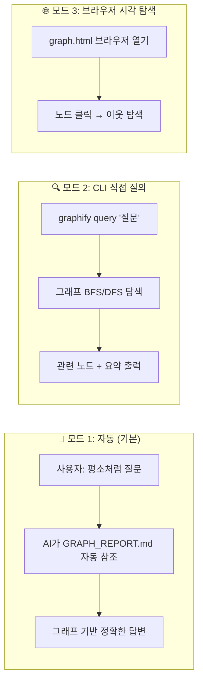
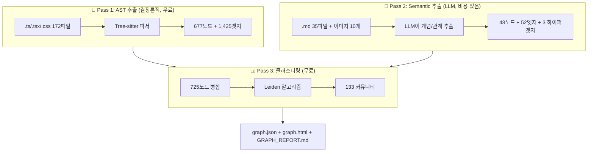

# 📊 Graphify 지식 그래프 사용 가이드

> **작성일**: 2026-04-18  
> **대상**: WebCG-K 프로젝트  
> **그래프 위치**: `graphify-out/` (graph.json, graph.html, GRAPH_REPORT.md)

---

## 1. Graphify란 무엇인가?

### 한 줄 요약
> **Graphify는 AI 어시스턴트의 "코드베이스 지도"다.**  
> 사용자가 바뀌는 건 없고, AI가 답변할 때 내부적으로 더 똑똑해지는 레이어.

### 🎯 핵심 오해 해소

```
❌ 잘못된 이해:   "Graphify를 통해 질문해야 한다"
                  (기존 AI 대신 graphify CLI로 질문?)

✅ 올바른 이해:   "AI 어시스턴트(Opus 4.6)에게 평소처럼 질문하면,
                  AI가 코드 전체를 읽는 대신 그래프를 참조하여
                  더 짧은 토큰으로 더 정확하게 답변한다"
```

### 비유로 이해하기

| 비유 | Graphify 없음 | Graphify 있음 |
|------|------|------|
| 🏥 의사 진찰 | 환자의 전체 의료 기록 수천 페이지를 매번 처음부터 읽음 | 환자 차트 요약 + 관련 검사 결과만 참조 |
| 🗺️ 내비게이션 | 지도 없이 모든 도로를 외워서 길 안내 | GPS 지도를 보고 최단 경로만 안내 |
| 📚 도서관 | 모든 책을 읽은 다음 답변 | 색인 카드로 관련 책만 골라 읽고 답변 |

---

## 2. 3가지 사용 모드

Graphify는 3가지 방식으로 활용할 수 있습니다:



---

### 📌 모드 1: 자동 참조 (일상적 사용 — 95% 케이스)

**사용자가 할 일: 아무것도 바뀌지 않습니다.**

Antigravity에서 Opus 4.6에게 평소처럼 질문하면 됩니다.
AI가 알아서 `graphify-out/GRAPH_REPORT.md`를 읽고, 아키텍처 구조를 파악한 뒤 답변합니다.

```
[사용자]  "타임라인에서 블록을 드래그할 때 어떤 컴포넌트가 관여해?"

[AI 내부 동작]
  1. GRAPH_REPORT.md의 God Node 확인 → "Timeline Engine" 커뮤니티(37노드)
  2. 관련 파일 식별 → DraggableBlock.tsx, Timeline.tsx, timelineStore.ts
  3. 해당 파일만 읽고 답변 (전체 217 파일 ❌ → 3-5 파일만 ✅)
```

**효과**: 쿼리당 ~400,000 토큰 → ~1,324 토큰 (**302.4x 절감**)

#### 이 모드가 작동하는 원리

`.agent/rules/graphify.md`에 아래 규칙이 설정되어 있습니다:

```markdown
# AI 어시스턴트가 따르는 규칙:
- 아키텍처/코드 질문 시 GRAPH_REPORT.md를 먼저 읽는다
- wiki/index.md가 있으면 파일 대신 위키를 탐색한다
- MCP 서버가 활성화되면 query_graph 도구를 사용한다
- 코드 수정 후 `graphify update .`로 그래프를 갱신한다
```

---

### 📌 모드 2: CLI 직접 질의 (심층 탐색)

AI에게 물어보는 대신, **터미널에서 직접** 그래프를 질의할 수 있습니다.
이것은 "Graphify를 통해 질문하는 것"에 가장 가까운 방식입니다.

#### 기본 질의 (BFS 탐색)

```bash
# 질문을 던지면 → 관련 노드를 너비 우선으로 탐색하여 컨텍스트 반환
graphify query "렌더러가 오버레이를 어떻게 합성하는가?"

# DFS (깊이 우선) — 한 경로를 깊이 추적
graphify query "인증 흐름은 어떻게 되는가?" --dfs

# 토큰 예산 지정
graphify query "AI CG 생성 파이프라인" --budget 1500
```

#### 두 개념 사이 최단 경로

```bash
# "AuthModule"에서 "Database"까지 어떤 경로로 연결되는지
graphify path "AuthModule" "Database"

# "Timeline" → "Renderer" 연결 추적
graphify path "Timeline" "Renderer"
```

#### 노드 상세 설명

```bash
# 특정 노드의 역할과 이웃 관계를 자연어로 설명
graphify explain "fetchDataByType"
graphify explain "OverlayPlayoutLayer"
```

#### CLI 질의 결과 저장 (학습 누적)

```bash
# Q&A 결과를 graphify-out/memory/에 저장 → 다음 빌드 시 그래프에 반영
graphify save-result \
  --question "렌더러 합성 방식" \
  --answer "OverlayPlayoutLayer가 z-index 기반으로..." \
  --nodes "OverlayPlayoutLayer" "render.tsx"
```

> **⚠️ 주의**: `graphify query`는 graph.json을 로컬에서 탐색하는 것이므로,
> LLM API 비용이 들지 않습니다. 무제한 무료 질의!

---

### 📌 모드 3: 브라우저 시각 탐색 (아키텍처 파악)

```bash
# Windows에서 (WSL 환경)
explorer.exe "$(wslpath -w graphify-out/graph.html)"

# 또는 직접 브라우저에서 열기
# 파일 경로: \\wsl$\Ubuntu\home\genk\topProject\2026.WebCg-K\graphify-out\graph.html
```

| 기능 | 사용법 |
|------|--------|
| **노드 검색** | 우측 상단 검색창에 이름 입력 (자동완성) |
| **노드 상세** | 노드 클릭 → 타입, 커뮤니티, 소스 경로, Degree 표시 |
| **이웃 탐색** | 노드 클릭 → 이웃 노드 목록 (클릭으로 이동) |
| **커뮤니티 필터** | 우측 범례의 커뮤니티 이름 클릭 → 해당 커뮤니티만 강조 |
| **줌/패닝** | 마우스 휠 줌, 드래그로 이동 |

---

## 3. 그래프 유지보수 (코드 수정 후)

### 자동 갱신 (AI가 자동으로 실행)

AI가 코드를 수정하면 `.agent/rules/graphify.md` 규칙에 따라 자동으로 실행합니다:

```bash
# AST-only 추출 — LLM 비용 없음, 2-3초 소요
graphify update .
```

### 수동 재빌드 (대규모 변경 후)

아키텍처가 크게 바뀌었을 때(파일 추가/삭제 다수), Semantic 추출까지 포함한 전체 재빌드:

```bash
# Antigravity 채팅에서 실행
/graphify .

# 또는 딥 모드 (더 풍부한 관계 추출)
/graphify . --mode deep
```

### Git Hooks (선택)

커밋할 때마다 자동으로 그래프를 갱신하는 Git Hook:

```bash
# 설치
graphify hook install

# 상태 확인
graphify hook status

# 제거
graphify hook uninstall
```

설치 후 동작:
- `git commit` → 자동으로 `graphify update .` 실행
- `git checkout` → 브랜치 전환 후 그래프 갱신

---

## 4. 전체 명령어 레퍼런스

### 질의 명령

| 명령어 | 설명 | LLM 비용 |
|--------|------|----------|
| `graphify query "질문"` | BFS 기반 그래프 탐색 | ❌ 무료 |
| `graphify query "질문" --dfs` | DFS 기반 깊이 추적 | ❌ 무료 |
| `graphify query "질문" --budget 1500` | 토큰 예산 제한 | ❌ 무료 |
| `graphify path "A" "B"` | 두 노드 최단 경로 | ❌ 무료 |
| `graphify explain "노드명"` | 노드 상세 설명 | ❌ 무료 |

### 빌드/관리 명령

| 명령어 | 설명 | LLM 비용 |
|--------|------|----------|
| `/graphify .` | 전체 파이프라인 실행 (AI 채팅에서) | ✅ Semantic 추출 비용 |
| `/graphify . --mode deep` | 딥 모드 전체 빌드 | ✅ 더 많은 비용 |
| `graphify update .` | AST-only 증분 갱신 | ❌ 무료 |
| `graphify cluster-only .` | 클러스터링만 재실행 | ❌ 무료 |
| `graphify add <url>` | URL 콘텐츠를 그래프에 추가 | ✅ 추출 비용 |

### 내보내기 명령

| 명령어 | 설명 |
|--------|------|
| `/graphify . --svg` | graph.svg 생성 (GitHub/Notion 임베딩) |
| `/graphify . --graphml` | graph.graphml 생성 (Gephi, yEd용) |
| `/graphify . --neo4j` | cypher.txt 생성 (Neo4j 임포트) |
| `/graphify . --wiki` | 위키 생성 (커뮤니티별 Markdown) |
| `/graphify . --obsidian` | Obsidian vault 생성 |

### 인프라 명령

| 명령어 | 설명 |
|--------|------|
| `graphify hook install` | Git Hook 설치 |
| `graphify hook status` | Hook 상태 확인 |
| `graphify benchmark` | 토큰 절감 벤치마크 |

---

## 5. 아키텍처 이해: 3-Pass 파이프라인



### Pass 1과 2의 차이

| 구분 | Pass 1 (AST) | Pass 2 (Semantic) |
|------|------|------|
| **대상** | 코드 파일 (.ts, .tsx, .css) | 문서, 이미지 (.md, .png) |
| **방법** | Tree-sitter 구문 분석 (결정론적) | LLM이 읽고 개념/관계 추출 |
| **비용** | ❌ 무료 | ✅ LLM 토큰 소비 |
| **`graphify update`** | ✅ 이걸로 갱신됨 | ❌ 갱신 안 됨 (`/graphify .` 필요) |
| **추출하는 것** | 함수, 클래스, import, export | 개념, 디자인 패턴, ADR |

---

## 6. 일상 워크플로우

### 시나리오 A: 일반 개발 (매일)

```
1. Antigravity 열기
2. 평소처럼 코딩 질문 → AI가 자동으로 그래프 참조
3. 코드 수정 완료 → AI가 자동으로 `graphify update .` 실행
4. 끝!
```

### 시나리오 B: "이 모듈이 어디에 연결돼?" 궁금할 때

```bash
# CLI에서 직접 질의
graphify explain "OverlayPlayoutLayer"
graphify path "NRCS" "Renderer"

# 또는 graph.html에서 시각적 탐색
```

### 시나리오 C: 새 팀원 온보딩

```
1. graph.html을 브라우저에서 열어 전체 구조 파악 (5분)
2. GRAPH_REPORT.md 읽기 — God Node, 주요 커뮤니티, Surprising Connection
3. 궁금한 커뮤니티의 파일들을 열어 코드 읽기
```

### 시나리오 D: 대규모 리팩토링 후

```bash
# 1. 전체 재빌드 (Semantic 포함)
# Antigravity 채팅에서:
/graphify . --mode deep

# 2. 커뮤니티 변화 확인
graphify benchmark
```

---

## 7. 현재 WebCG-K 그래프 현황

| 지표 | 값 |
|------|-----|
| 총 파일 | 217 (코드 172 + 문서 35 + 이미지 10) |
| 노드 / 엣지 | 725 / 749 |
| 커뮤니티 | 133 (핵심 15개) |
| 토큰 절감 | **302.4x** (쿼리당 ~400K → ~1.3K) |

### 핵심 커뮤니티 Top 15

| 커뮤니티 | 노드 수 | 역할 |
|----------|---------|------|
| Admin & AI CG Services | 85 | AI 오버레이 생성 + 관리자 |
| Timeline Engine | 37 | 타임라인 조작 (블록/트랙/플레이헤드) |
| System Architecture Docs | 37 | 아키텍처 문서 |
| Media Server (NDI/WHEP) | 29 | 영상 입력 서버 |
| NRCS Mapping & Validation | 27 | 뉴스 시스템 데이터 파이프라인 |
| PGM/PVW Monitors | 26 | 송출/미리보기 모니터 |
| AI SVG Generation | 20 | AI SVG 생성 |
| Rundown Editor | 16 | 런다운 편집기 |
| Dashboard Services | 15 | 대시보드 서비스 |
| Font Management | 15 | 폰트 관리 |
| Renderer & Schemas | 13 | 렌더러 + DB 스키마 |
| AI Prompt & Data Providers | 13 | AI 프롬프트 + 외부 API |
| Graphics Canvas Editor | 12 | 그래픽 캔버스 편집기 |
| Block Manipulation | 11 | 블록 드래그/리사이즈 |
| Auth & RBAC | 11 | 인증 + 역할 기반 접근 제어 |

### God Nodes (핵심 허브)

| 노드 | Degree | 의미 |
|------|--------|------|
| `Select()` | 56 | shadcn/ui Select → 모든 페이지가 사용하는 공통 UI |
| `Renderer Subsystem` | 10 | 송출 출력 핵심 |
| `fetchDataByType()` | 8 | 날씨/지진 등 외부 데이터 프로바이더 허브 |
| `callAI()` | 7 | 다중 프로바이더 AI 호출 |
| `validateCgContent()` | 7 | CG 텍스트 4단계 검증 |

---

## 8. FAQ

### Q: Graphify가 없으면 AI가 답변 못 하나요?
**A: 아닙니다.** 평소처럼 잘 답변합니다. Graphify는 "더 효율적으로" 답변하게 하는 최적화 레이어입니다. 없어도 동작하지만, 있으면 토큰을 302배 절약합니다.

### Q: `graphify query` vs AI에게 직접 질문 — 뭐가 다른가요?
**A:**
- `graphify query`: 그래프만 탐색하여 관련 노드와 요약을 반환. **LLM 비용 0**, 답변이 짧고 구조적.
- AI에게 질문: LLM이 그래프를 참조한 뒤, 코드를 직접 읽고 **자연어로 상세 답변**. 토큰 비용 있음.
- **추천**: 먼저 `graphify query`로 관련 파일을 파악 → AI에게 구체적 질문.

### Q: 그래프를 언제 재빌드해야 하나요?
**A:**
- **코드만 수정**: `graphify update .` (자동, 3초)
- **문서 추가/수정**: `/graphify .` (Semantic 재추출 필요)
- **대규모 리팩토링**: `/graphify . --mode deep`

### Q: API 비용이 들 수 있나요?
**A:**
- `graphify update`, `query`, `path`, `explain` → **완전 무료** (로컬 연산)
- `/graphify .` (전체 빌드) → **Semantic 추출 시 LLM 토큰 소비** (문서/이미지 수에 비례)
- 일상적 사용에서는 비용이 거의 발생하지 않습니다.

### Q: `graph.html`은 인터넷이 필요한가요?
**A: 네, `vis-network` 라이브러리를 CDN에서 로드합니다.** 에어갭 환경에서는 vis-network.min.js를 로컬에 저장하고 HTML의 `<script src>` 를 수정해야 합니다.

---

## 9. 산출물 파일 위치

```
graphify-out/
├── graph.json           ← AI 질의용 GraphRAG 데이터 (725노드/749엣지)
├── graph.html           ← 인터랙티브 브라우저 시각화 (vis-network)
├── GRAPH_REPORT.md      ← 감사 리포트 (God Node, 커뮤니티, Knowledge Gaps)
├── manifest.json        ← 증분 빌드용 파일 해시
├── cache/               ← AST 캐시 (.gitignore에 의해 제외)
├── .graphify_python     ← Python 인터프리터 경로
├── .graphify_detect.json ← 파일 탐지 결과
├── .graphify_ast.json   ← AST 추출 결과
└── .graphify_sem.json   ← Semantic 추출 결과
```

> **Git 커밋 대상**: `graph.json`, `graph.html`, `GRAPH_REPORT.md`, `manifest.json`  
> **Git 제외**: `cache/`, `.graphify_*` (로컬 캐시)
