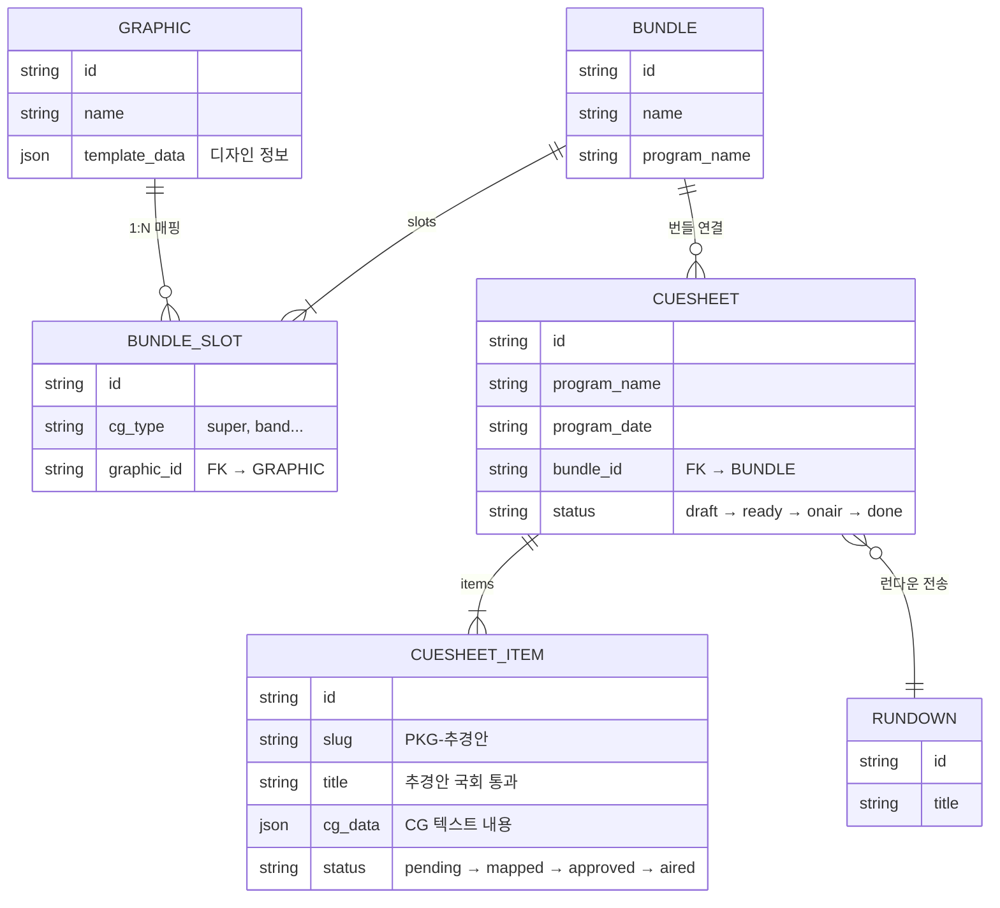
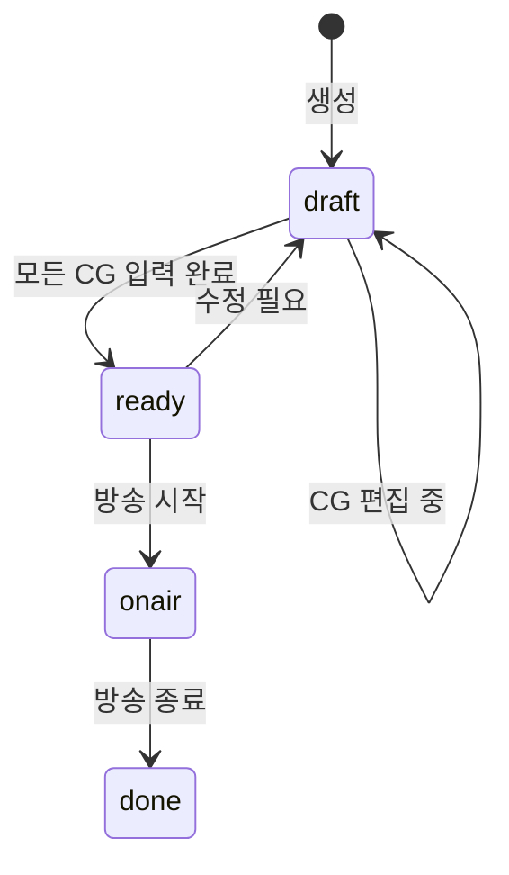
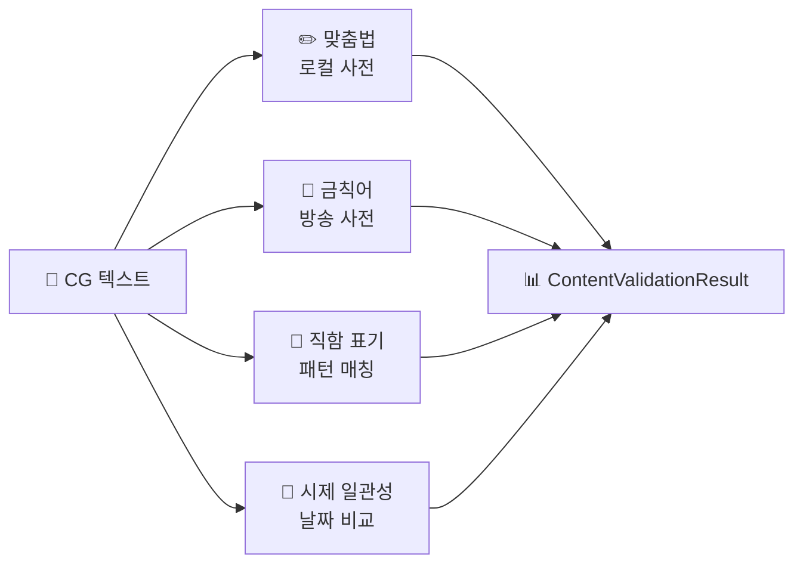
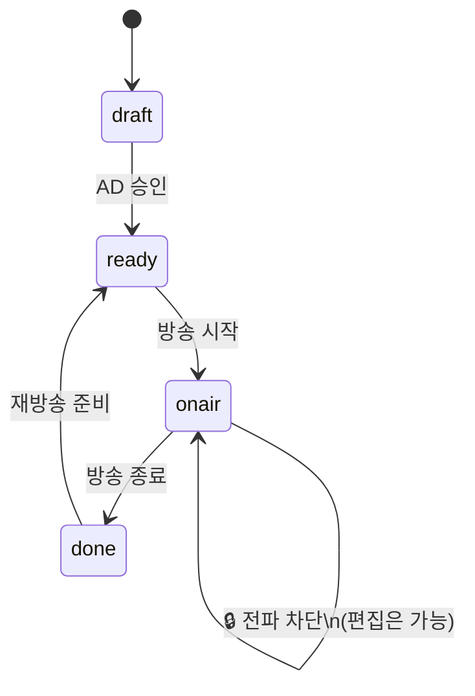
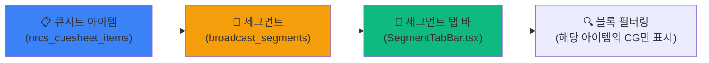

# 📋 NRCS 큐시트 — 완벽 가이드

> **NRCS** = Newsroom Computer System (뉴스룸 컴퓨터 시스템)
> 방송국에서 뉴스 기사를 관리하고, 각 기사에 붙을 **CG(Computer Graphics) 자막**을 편집·검증·송출하는 시스템.

---

## 1. 큐시트란 무엇인가?

### 비유: 콘서트 세트리스트

콘서트에 **세트리스트**(곡 순서표)가 있듯이, 뉴스 방송에는 **큐시트**(CG 순서표)가 있습니다.

```
🎵 콘서트 세트리스트        📋 뉴스 큐시트
─────────────────        ─────────────────
1곡. Bohemian Rhapsody    1. 추경안 통과 [슈퍼: 홍길동/기재부]
2곡. We Will Rock You     2. 날씨 속보  [밴드: 서울 폭우 주의]
3곡. Don't Stop Me Now    3. 스포츠     [헤드라인: 월드컵 결승]
```

세트리스트에서 "2번곡 다음에 MC 멘트 넣자" 하듯이,
큐시트에서 "2번 기사에 속보 크롤 추가하자"를 관리합니다.

### 정의

> **큐시트 = 한 뉴스 프로그램(예: "KBS 뉴스 9")의 CG 자막 편집 워크시트**

- **누가** 사용하나? → CG 오퍼레이터, 부조정실 AD, 뉴스 편집 PD
- **언제** 사용하나? → 방송 전 준비 단계 ~ 방송 중 실시간 수정
- **무엇을** 관리하나? → 기사별로 어떤 CG를 몇 개 내보낼지, 내용은 무엇인지

---

## 2. 전체 파이프라인 (Big Picture)

WebCG-K 시스템에서 CG가 화면에 나가기까지의 **8단계 파이프라인**입니다.

```mermaid
flowchart LR
    A["🎨 그래픽 편집기<br/>(디자인)"] --> B["📦 번들 편집기<br/>(그룹핑)"]
    B --> C["📋 큐시트 생성<br/>(기사 목록)"]
    C --> C2["🔗 데이터 소스 바인딩<br/>(NRCS/CSV)"]
    C2 --> D["✏️ 큐시트 상세<br/>(CG 텍스트 입력)"]
    D --> D2["🔍 내용 검증<br/>(맞춤법/금칙어)"]
    D2 --> E["🛡️ 프리플라이트<br/>(구조 검증)"]
    E --> F["📡 런다운 전송<br/>(송출)"]

    style A fill:#7c3aed,color:#fff
    style B fill:#f59e0b,color:#000
    style C fill:#3b82f6,color:#fff
    style C2 fill:#8b5cf6,color:#fff
    style D fill:#10b981,color:#fff
    style D2 fill:#f97316,color:#fff
    style E fill:#ef4444,color:#fff
    style F fill:#06b6d4,color:#fff
```



| 단계 | 페이지 | 핵심 행위 | 결과물 |
|:---:|--------|----------|--------|
| **1** | `/dashboard/graphics` | CG 템플릿 **디자인** (도형, 색상, 폰트) | `graphic` 레코드 |
| **2** | `/dashboard/bundles/:id` | 그래픽을 CG 유형별로 **묶음** | `bundle.slots[]` |
| **3** | `/dashboard/cuesheets` | 프로그램+날짜+번들 → 큐시트 **생성** | `nrcs_cuesheet` |
| **3.5** | 큐시트 상세 내부 | NRCS/CSV **데이터 소스 바인딩** 및 동기화 | `cuesheet_data_sources` |
| **4** | `/dashboard/cuesheets/:id` | 기사별 CG 텍스트 **입력/편집** | `cg_data[]` |
| **4.5** | 상세 페이지 내 버튼 | **내용 검증** (맞춤법/금칙어/직함/시제) | `ContentValidationResult[]` |
| **5** | 상세 페이지 내 패널 | 누락/오버플로 등 **구조 검증** | `PreflightReport` |
| **6** | 상세 페이지 내 버튼 | 런다운 시스템으로 **전송** (Smart Lock 적용) | `linked_rundown_id` |

---

## 3. 각 단계 심층 설명

### 3-1. 그래픽 편집기 (Design)

> **역할:** CG 자막의 **시각적 디자인**을 만드는 단계

```
┌──────────────────────────────────────────────┐
│  [슈퍼 자막 디자인]                             │
│                                              │
│  ┌────────────────────────────────────┐       │
│  │  이름: ████████████                │ ← 텍스트 영역  │
│  │  직함: ████████████                │       │
│  └────────────────────────────────────┘       │
│  배경: 반투명 검정 바                          │
│  폰트: Pretendard Bold 36px                  │
│  색상: #FFFFFF                               │
└──────────────────────────────────────────────┘
```

- 도형(rect), 텍스트(text), 이미지 등의 **요소**를 캔버스에 배치
- `template_data` JSON에 모든 디자인 정보가 저장됨
- Binding Container → 텍스트 프레임에 나중에 **실제 내용**이 들어감

### 3-2. 번들 편집기 (Grouping)

> **역할:** 여러 그래픽을 **CG 유형(슈퍼, 밴드, 헤드라인 등)별로 묶는** 단계

```
📦 "KBS 뉴스9 번들"
├── 🏷️ 슈퍼(super)     → 슈퍼 자막 그래픽.svg
├── 🏷️ 밴드(band)      → 뉴스 밴드 그래픽.svg
├── 🏷️ 헤드라인(headline) → 헤드라인 그래픽.svg
├── 🏷️ 출처(source)    → 출처 표시 그래픽.svg
└── 🏷️ 크롤(crawl)     → 속보 띠 그래픽.svg
```

**Why 번들이 필요한가?**

뉴스 프로그램마다 디자인이 다릅니다.
- "KBS 뉴스 9"의 슈퍼 자막 디자인 ≠ "KBS 뉴스 12"의 슈퍼 자막 디자인
- 번들로 묶어두면, 큐시트 생성 시 **"이 프로그램은 이 번들의 디자인을 쓴다"** 고 지정 가능

### 3-3. 큐시트 생성 (Create)

> **역할:** "어떤 프로그램의 어떤 날짜 방송에 어떤 번들을 쓸지" 지정

```
┌─────────────────────────────┐
│  📋 새 큐시트                │
│                             │
│  프로그램명: KBS 뉴스 9       │
│  방송일:    2026-04-03       │
│  매핑 번들:  KBS 뉴스9 번들 ▾  │
│                             │
│        [취소]  [생성]         │
└─────────────────────────────┘
```

생성하는 방법 2가지:
1. **수동 생성**: 프로그램명 + 날짜 + 번들 선택
2. **CSV 임포트**: 기존 뉴스 기사 목록을 CSV로 가져오기

### 3-4. 큐시트 상세 — CG 텍스트 편집 (Edit)

> **역할:** 각 뉴스 기사마다 **CG에 들어갈 실제 내용**을 입력

이 페이지가 **큐시트 워크플로의 핵심**입니다.

```
┌────────────────────────────┬──────────────────────────┐
│  📰 기사 목록 (왼쪽)        │  ✏️ CG 편집 (오른쪽)       │
│                            │                          │
│  1. [PKG-추경안] ← 선택됨   │  🏷️ 슈퍼                  │
│     "추경안 국회 통과"       │  이름: [홍길동          ]  │
│     슈퍼 1건               │  직함: [기획재정부 차관  ]  │
│                            │                          │
│  2. [STR-날씨]             │  🏷️ 밴드                  │
│     "서울 폭우 주의보"       │  내용: [정부, 추경 55조  ] │
│     밴드 1건, 슈퍼 1건      │                          │
│                            │  [💾 저장]                │
│  3. [INT-인터뷰]           │                          │
│     "경제학 교수 인터뷰"     │                          │
└────────────────────────────┴──────────────────────────┘
```

**워크플로:**
1. 왼쪽에서 **기사를 클릭**
2. 오른쪽에 해당 기사의 **CG 텍스트 편집기**가 나타남
3. 각 CG 유형(슈퍼, 밴드 등)별로 **텍스트 내용 입력**
4. **저장** → DB에 `cg_data` 업데이트
5. 리치 텍스트 에디터(TipTap)로 **부분 스타일링** 가능 (색상, 크기)

### 3-5. 프리플라이트 검증 (Verify)

> **역할:** 방송 전에 **누락이나 실수를 미리 잡아내는** 안전장치

```
🛡️ 프리플라이트 결과
─────────────────────────────────
✅ 그래픽 존재 확인       3/3 OK
🟡 매핑 완성도           2/3 (66%)  ← "1건이 아직 CG 미입력"
❌ 텍스트 오버플로        1건 발견   ← "이름이 너무 길어서 잘림"
```

검증 항목:
- **그래픽 존재**: 번들에 연결된 그래픽이 실제로 DB에 있는지
- **매핑 완성도**: 모든 기사에 CG가 입력되었는지 (빈칸 없는지)
- **텍스트 오버플로**: 입력한 텍스트가 그래픽의 텍스트 영역을 넘치는지

### 3-6. 런다운 전송 (Transmit)

> **역할:** 완성된 큐시트를 **실제 방송 송출 시스템(런다운)**으로 전달

```
큐시트 상세 페이지
└── [📡 런다운으로 전송] 버튼 클릭
    ├── 런다운 선택 (드롭다운)
    └── 전송 완료 → linked_rundown_id 설정
```

런다운 = **시간 기반 방송 진행표**. 큐시트의 CG 데이터가 런다운의 각 블록에 매핑되어 실시간 송출됩니다.

---

## 4. CG 타입 13종 상세

뉴스에 등장하는 **모든 종류의 CG 자막**을 13가지로 분류합니다.

### 자주 사용 (핵심 5종)

| CG 타입 | 한국어 | 실제 화면 예시 | 사용 빈도 |
|---------|--------|-------------|----------|
| `super` | **슈퍼** | `홍길동 / 서울시 관계자` | ⭐⭐⭐⭐⭐ |
| `band` | **밴드** | `정부, 추경안 국회 제출` (하단 가로바) | ⭐⭐⭐⭐⭐ |
| `headline` | **헤드라인** | `긴급 뉴스` (대형 제목) | ⭐⭐⭐⭐ |
| `source` | **출처** | `KBS 취재` `AP 통신 제공` | ⭐⭐⭐⭐ |
| `locator` | **지역/장소** | `서울 여의도` (장소 표시) | ⭐⭐⭐ |

### 중간 사용 (4종)

| CG 타입 | 한국어 | 실제 화면 예시 |
|---------|--------|-------------|
| `subheadline` | 서브 헤드라인 | 헤드라인 아래 부제목 |
| `lowthird` | 하단 자막 | 하단 1/3 영역 이름+직함 조합 |
| `soundbite` | 사운드바이트 | 인터뷰이 발언 자막 |
| `reporter` | 기자 리포트 | `이 시각 서울중앙지방법원 / 황현규` |

### 특수 상황 (4종)

| CG 타입 | 한국어 | 설명 |
|---------|--------|------|
| `crawl` | 속보 크롤 | 화면 하단을 좌→우 스크롤하는 속보 띠 |
| `fullcg` | 풀CG | 화면 전체를 차지하는 인포그래픽 |
| `credit` | 크레딧 | `촬영기자 이상원 / 영상편집 이상미` |
| `flash` | 속보 헤드라인 | 긴급 대형 뉴스 속보 제목 |

---

## 5. 데이터 흐름 (Data Flow)

데이터가 어떻게 연결되는지 기술적으로 정리합니다.



### cg_data 구조 예시

큐시트 아이템 1건에 여러 CG가 들어갈 수 있습니다:

```json
[
  {
    "id": "cg-001",
    "type": "super",
    "order": 1,
    "fields": {
      "name": "홍길동",
      "title": "기획재정부 차관"
    }
  },
  {
    "id": "cg-002",
    "type": "band",
    "order": 2,
    "fields": {
      "text": "정부, 추경 55조 원안 확정"
    }
  }
]
```

이 `cg_data`의 `fields`가 → 번들의 해당 `cg_type` 슬롯의 그래픽 → 텍스트 영역에 대입되어 → 최종 CG 화면이 생성됩니다.

---

## 6. 상태 관리 (Status Flow)

### 큐시트 상태



| 상태 | 의미 | UI 표시 |
|------|------|---------|
| `draft` | 편집 중 (CG 미완성) | 🔘 회색 "초안" |
| `ready` | 방송 준비 완료 | 🔵 파랑 "준비" |
| `onair` | 현재 방송 중 | 🔴 빨강 "온에어" + LIVE 표시 |
| `done` | 방송 완료 | 🟢 초록 "완료" |

### 아이템 상태

| 상태 | 의미 |
|------|------|
| `pending` | CG 미입력 (기사만 존재) |
| `mapped` | CG 텍스트 입력 완료 |
| `approved` | PD/AD 승인 |
| `aired` | 실제 방송 송출됨 |

---

## 7. 실제 사용 시나리오

### 시나리오: "KBS 뉴스 9" 방송 준비

```
14:00  [기자들] 기사 원고 작성 완료
       ↓
15:00  [CG 담당자] WebCG-K에서 큐시트 생성
       - 프로그램: "KBS 뉴스 9"
       - 번들: "뉴스9 기본 번들" 선택
       ↓
15:30  [CG 담당자] 기사 목록 확인 (CSV 임포트 or 수동 입력)
       - 기사 15건 등록
       ↓
16:00  [CG 담당자] 각 기사별 CG 텍스트 입력
       - "추경안" → 슈퍼: 홍길동/기재부, 밴드: 추경 55조 확정
       - "날씨"   → 밴드: 서울 30°C 폭염주의보
       - ...
       ↓
17:00  [CG 담당자] 프리플라이트 실행
       - ✅ 15건 모두 매핑 완료
       - ⚠️ 2건 텍스트 오버플로 → 수정
       ↓
18:00  [AD] 큐시트 최종 확인 → 상태를 "ready"로 변경
       ↓
18:30  [CG 담당자] 런다운으로 전송
       ↓
21:00  [방송 시작] 상태 → "onair"
       - 기사 순서대로 CG 자동 송출
       ↓
21:50  [방송 종료] 상태 → "done"
```

---

## 8. 관련 파일 맵

| 파일 | 역할 |
|------|------|
| `src/routes/dashboard/cuesheets/index.lazy.tsx` | 큐시트 목록 + 생성 모달 |
| `src/routes/dashboard/cuesheets/$cuesheetId.tsx` | 큐시트 상세 (기사 목록 + CG 편집) |
| `src/services/cuesheetService.ts` | 큐시트 CRUD + Smart Lock 전파 |
| `src/services/cuesheetDataSourceService.ts` | 데이터 소스(NRCS/CSV) 바인딩 + 3-way diff 동기화 |
| `src/services/preflightService.ts` | 프리플라이트 구조 검증 엔진 |
| `src/services/contentValidation/index.ts` | 내용 검증 엔진 (맞춤법/금칙어/직함/시제) |
| `src/services/contentValidation/profanityFilter.ts` | 금칙어 3단계 필터 (prohibited/caution/sensitive) |
| `src/services/contentValidation/spellCheckService.ts` | 로컬 사전 기반 맞춤법 검사 |
| `src/services/contentValidation/titleValidator.ts` | CG 타입별 직함·표기 검증 |
| `src/services/contentValidation/temporalValidator.ts` | 시제·날짜 일관성 검증 |
| `src/services/nrcsMappingService.ts` | 기사 → CG 자동 매핑 |
| `src/services/nrcsRealtimeService.ts` | Supabase 실시간 동기화 |
| `src/services/aiSvgService.ts` | Gemini 3.1 Pro AI SVG 생성 |
| `src/lib/nrcsTypes.ts` | CG 타입 13종 + 기사 유형 정의 |
| `src/components/CsvImportWizard.tsx` | CSV → 큐시트 변환 마법사 |
| `src/components/ui/RichTextEditor.tsx` | CG 텍스트 리치 편집기 (브랜드 제한 적용) |

---

## 9. 핵심 용어 사전

| 용어 | 영문 | 설명 |
|------|------|------|
| **큐시트** | Cuesheet | 뉴스 프로그램 1회분의 CG 편집 시트 |
| **슬러그** | Slug | 기사의 짧은 식별 이름 (예: `PKG-추경안`) |
| **슈퍼** | Super(impose) | 화면 위에 겹쳐 표시하는 자막 |
| **밴드** | Band | 화면 하단 가로 막대형 자막 |
| **크롤** | Crawl | 화면 하단을 수평 이동하는 속보 텍스트 |
| **런다운** | Rundown | 시간 기반 방송 진행표 (큐시트의 CG가 여기로 전달됨) |
| **프리플라이트** | Preflight | 방송 전 사전 검증 (인쇄 전 검수에서 유래한 용어) |
| **번들** | Bundle | CG 유형별로 그룹핑된 그래픽 묶음 |
| **CG 타입** | CG Type | CG 자막의 종류 (super, band, headline 등 13종) |
| **매핑** | Mapping | 기사와 CG 텍스트를 연결하는 작업 |
| **Smart Lock** | Smart Lock | 송출 중(onair) 런다운 전파 자동 차단 안전 장치 |
| **금칙어** | Prohibited Word | 방송 사용 금지 단어 (차별표현, 자살보도 등) |
| **데이터 소스** | Data Source | 큐시트와 연결된 외부 데이터 (NRCS/CSV) |

---

## 10. 내용 검증 파이프라인 (Content Validation)

> **비유:** 원고를 출판하기 전에 맞춤법 검사기 + 교열자를 거치듯,
> CG 자막도 화면에 나가기 전에 **4단계 자동 검증**을 거칩니다.

### 4단계 검증 엔진



| 검증 | 심각도 | 예시 |
|------|--------|------|
| **맞춤법** | ⚠️ warning | "됬다" → "됐다" |
| **금칙어 (prohibited)** | 🔴 error | "자살" → "극단적 선택" |
| **금칙어 (caution)** | ⚠️ warning | "사망" → "숨지다" |
| **직함 오타** | ⚠️ warning | "센타장" → "센터장" |
| **시제 혼용** | ⚠️ warning | 과거형+현재형 혼재 |

### 실행 시점
- **저장 버튼** 클릭 시
- **맞춤법 검사** 전용 버튼 클릭 시 (일괄 체크)
- **프리플라이트** 실행 시 자동 포함

---

## 11. Smart Lock — 방송 안전 장치

> **핵심 원칙:** 큐시트 편집은 항상 가능, 런다운 **전파(Propagation)만** 차단.



- `onair` 상태에서 `propagateToRundown()` 호출 시 → **자동 차단**, 에러 메시지 반환
- 방송 종료 후 사용자가 **수동 동기화** 클릭하면 변경사항 전파
- 컨트롤러 페이지에 **"대기 중인 변경사항"** 배너로 알림

---

## 12. 🆕 세그먼트 탭 연동 (Nested Sequence Tab)

> **추가일**: 2026-04-16
> 큐시트 아이템이 타임라인 컨트롤러에서 어떻게 **세그먼트 탭**으로 표현되는지 설명합니다.

### 큐시트 아이템 → 세그먼트 자동 생성



NRCS 큐시트와 연동된 방송 세션을 생성하면:
1. 각 **큐시트 아이템** → **세그먼트** 1:1 자동 생성
2. 세그먼트에 아이템의 `slug`, `reporter`, `item_order` 매핑
3. 타임라인 블록에 `segment_id` 할당 → 세그먼트 소속 표시
4. 컨트롤러 페이지에서 **세그먼트 탭 바**가 자동 활성화

### 세그먼트 탭의 역할

| 탭 | 동작 |
|------|------|
| **"전체" 탭** | 모든 세그먼트의 CG를 세그먼트 배경색으로 구분하여 표시 |
| **세그먼트 탭** (❶❷❸...) | 해당 뉴스 아이템의 CG만 표시 + Zoom-to-Fit |

### NRCS 순서 변경 시

NRCS에서 뉴스 아이템 순서를 변경하면:
- `nrcs_cuesheet_items.item_order` 갱신
- `broadcast_segments.segment_order` 연동 갱신
- **세그먼트 탭 바의 탭 순서가 자동 재배치**

> 자세한 사용법은 [`USAGE.md`](../USAGE.md) §3 런다운·큐시트 관리 참조.

---

> **📌 이 문서는 WebCG-K의 NRCS 큐시트 시스템을 이해하기 위한 가이드입니다.**
> 코드 수정 전에 이 문서를 읽고 전체 파이프라인에서 현재 작업이 어디에 위치하는지 파악하세요.
