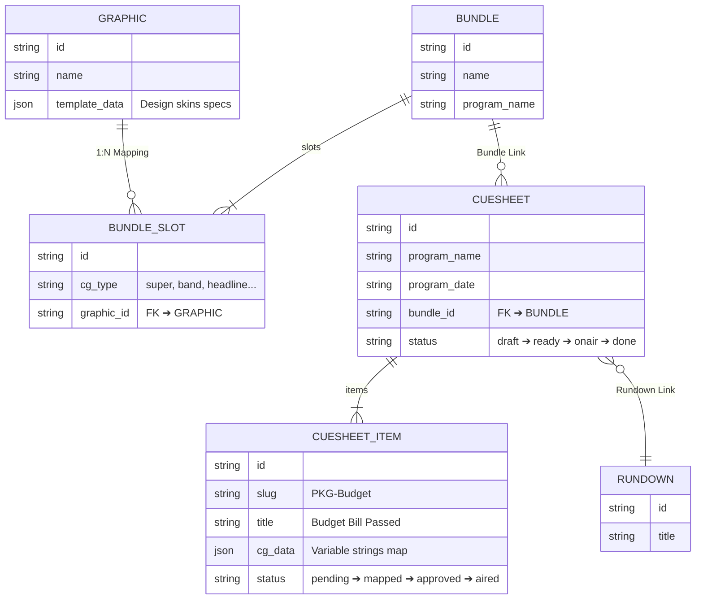
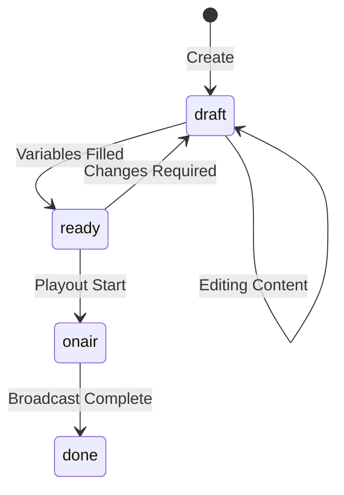
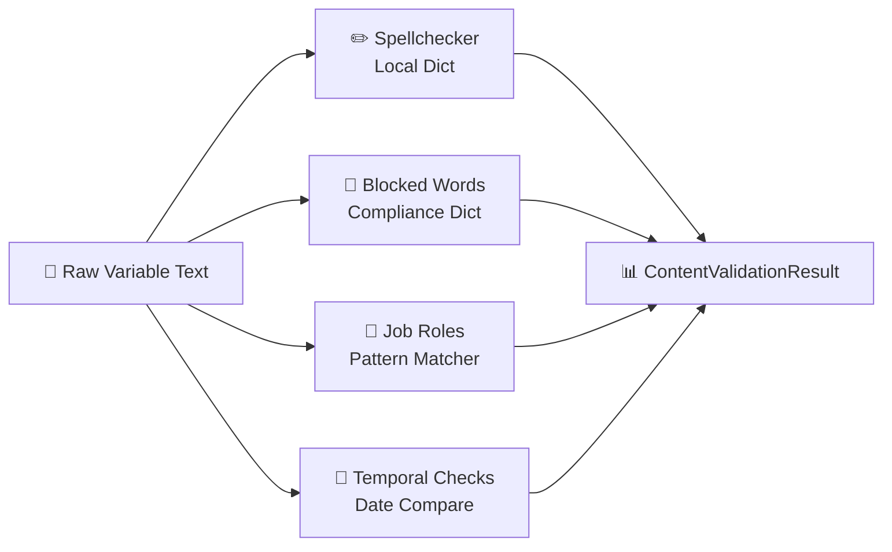
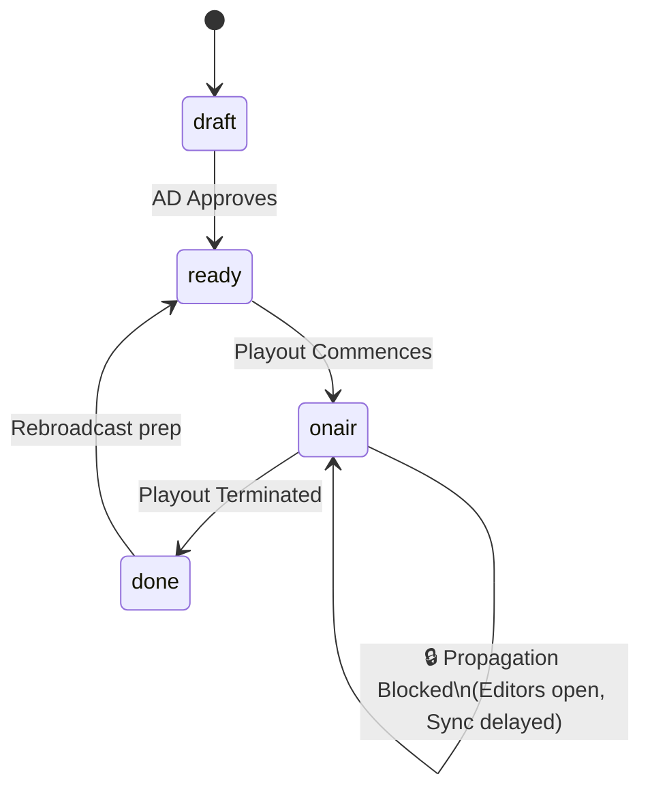
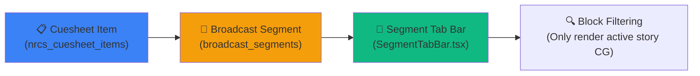

# 📋 NRCS Cuesheet — Complete Guide

> **NRCS** = Newsroom Computer System
> A specialized network system in broadcast newsrooms to manage articles, write scripts, and edit, verify, and program on-screen character generator (CG) overlays.

---

## 1. What is a Cuesheet?

### Concept: Analogous to Concert Setlists

Just as a live concert utilizes a **setlist** (song schedules), a news broadcast relies on a **cuesheet** (CG overlay schedules):

```
🎵 Concert Setlist                       📋 News Cuesheet
─────────────────────────               ─────────────────────────
Song 1. Bohemian Rhapsody               1. Budget Bill Passed [Super: Gildong Hong / Ministry of Finance]
Song 2. We Will Rock You                2. Weather Alert    [Band: Seoul Heavy Rain Warning]
Song 3. Don't Stop Me Now               3. Sports News      [Headline: World Cup Finals]
```

Just as you would plan "Add MC comments after Song 2" on a concert setlist, you manage "Inject weather crawls under Article 2" inside a news cuesheet.

### Definition

> **Cuesheet = The core programming worksheet compiling and mapping CG graphics for a specific news program session (e.g., "KBS News 9").**

- **Who uses it?** ➔ CG Operators, Control Room Assistant Directors (ADs), and News Producers.
- **When is it used?** ➔ Pre-production planning through real-time updates during live broadcasts.
- **What does it manage?** ➔ Which graphics models map to specific stories, how many tags to display, and the precise text variables.

---

## 2. Playout Pipeline (Big Picture)

WebCG-K systems handle broadcast playout through an **8-stage pipeline**:

```mermaid
flowchart LR
    A["🎨 Graphics Editor<br/>(Design Canvas)"] --> B["📦 Bundle Editor<br/>(Grouping Slots)"]
    B --> C["📋 Cuesheet Creation<br/>(Articles List)"]
    C --> C2["🔗 Data Source Bindings<br/>(NRCS/CSV Feeds)"]
    C2 --> D["✏️ Edit Cuesheet Data<br/>(Inject Variables)"]
    D --> D2["🔍 Content Validation<br/>(Spells/Blocked Lists)"]
    D2 --> E["🛡️ Preflight Diagnostics<br/>(Structural Checks)"]
    E --> F["📡 Transmit to Rundown<br/>(Live Playout)"]

    style A fill:#7c3aed,color:#fff
    style B fill:#f59e0b,color:#000
    style C fill:#3b82f6,color:#fff
    style C2 fill:#8b5cf6,color:#fff
    style D fill:#10b981,color:#fff
    style D2 fill:#f97316,color:#fff
    style E fill:#ef4444,color:#fff
    style F fill:#06b6d4,color:#fff
```



| Stage | View Path | Core Action | Output Object |
|:---:|--------|----------|--------|
| **1** | `/dashboard/graphics` | Design CG layouts (geometry, color, fonts) | `graphic` record |
| **2** | `/dashboard/bundles/:id` | Group layouts into functional categories | `bundle.slots[]` |
| **3** | `/dashboard/cuesheets` | Configure cuesheets by matching program name, date, and bundle | `nrcs_cuesheet` |
| **3.5**| Cuesheet Sub-View | Integrate NRCS and CSV feeds, sync stories | `cuesheet_data_sources` |
| **4** | `/dashboard/cuesheets/:id` | Inject/Edit CG variables per story slug | `cg_data[]` |
| **4.5**| Inline Inspector Button | Check contents (spellcheck, banned vocabulary, job roles, temporal logic) | `ContentValidationResult[]` |
| **5** | Inline Diagnostics Panel | Preflight check (missing vectors, text overflow boundaries) | `PreflightReport` |
| **6** | Active Action Button | Transmit to playout rundown (governed by Smart Lock policies) | `linked_rundown_id` |

---

## 3. Deep-dive Phase Breakdown

### 3-1. Vector Graphics Editor (Design)

> **Role:** Design the **visual skins and layouts** for CG overlays.

```
┌──────────────────────────────────────────────┐
│  [Super Tag Design Canvas]                    │
│                                              │
│  ┌────────────────────────────────────┐       │
│  │  Name: ████████████                │ ← Text bounding box
│  │  Role: ████████████                │       │
│  └────────────────────────────────────┘       │
│  Background: Translucent dark bar            │
│  Font: Pretendard Bold 36px                  │
│  Color: #FFFFFF                              │
└──────────────────────────────────────────────┘
```

- Operators drag shapes (`rect`), text labels (`text`), and logos on a design canvas.
- Output configurations persist within `template_data` JSON parameters.
- Text boxes act as binding containers that receive **live story data** later.

### 3-2. Graphics Bundler (Grouping)

> **Role:** Pack multiple designs into a named package mapped by **CG Type (Super, Band, Headline, etc.)**.

```
📦 "KBS News 9 Bundle"
├── 🏷️ super       ➔ Super_Tag_Graphic.svg
├── 🏷️ band        ➔ News_Band_Graphic.svg
├── 🏷️ headline    ➔ News_Headline_Graphic.svg
├── 🏷️ source      ➔ Media_Source_Graphic.svg
└── 🏷️ crawl       ➔ Ticker_Crawl_Graphic.svg
```

**Why utilize bundles?**

Every program session utilizes distinct layouts.
- "KBS News 9" Super tag designs differ from "KBS News 12" Super tag layouts.
- Bundles map designs cleanly. Selecting a bundle automatically applies the **correct styling tokens** to active cuesheets.

### 3-3. Cuesheet Configuration (Create)

> **Role:** Define which program name, broadcast date, and bundle configuration apply to a new program run.

```
┌─────────────────────────────┐
│  📋 New Cuesheet            │
│                             │
│  Program Name: KBS News 9   │
│  Air Date:     2026-04-03   │
│  Target Bundle: K9_Default ▾│
│                             │
│        [Cancel]  [Create]   │
└─────────────────────────────┘
```

Two creation paths:
1. **Manual Entry**: Configure name, target dates, and select desired graphic theme bundles.
2. **CSV Import**: Import news rundown logs from an exported CSV roster.

### 3-4. Variable Editing (Edit)

> **Role:** Inject the **actual variables and titles** to render on screen.

This interface serves as the **operational hub of cuesheet workflows**:

```
┌────────────────────────────┬──────────────────────────┐
│  📰 Story Segments (Left)   │  ✏️ CG Variables (Right)  │
│                            │                          │
│  1. [PKG-Budget] (Active)  │  🏷️ super                  │
│     "Budget Bill Passed"   │  Name: [Gildong Hong    ]  │
│     1 Super tag            │  Role: [Vice Minister   ]  │
│                            │                          │
│  2. [STR-Weather]          │  🏷️ band                  │
│     "Seoul Heavy Rain"     │  Text: [55 Trillion     ]  │
│     1 Band, 1 Super        │                          │
│                            │  [💾 Save Changes]       │
│  3. [INT-Interview]        │                          │
│     "Economics Professor"  │                          │
└────────────────────────────┴──────────────────────────┘
```

**Operational Steps**:
1. Operators select a **Story Slug** in the left column.
2. The right column mounts the **variable editors** matching that segment's slots.
3. Users type target strings (e.g., names, roles, or headlines).
4. Clicking **Save** updates the `cg_data` records in the DB.
5. Operators can style specific words (e.g., red highlights) using TipTap inline options.

### 3-5. Preflight Verification (Verify)

> **Role:** Automate structural and variable checks before live production.

```
🛡️ Preflight Diagnostics
─────────────────────────────────
✅ Vector Assets Check      3/3 OK
🟡 Variable Fields Coverage 2/3 (66%)  ← "1 story has unmapped fields"
❌ Text Bounds Overflow    1 error      ← "Name text exceeds boundary"
```

Core Verification Tests:
- **Vector Assets Check**: Validates that all graphics linked to active slots exist in the database.
- **Variable Fields Coverage**: Ensures no active stories contain empty text properties.
- **Text Bounds Overflow**: Triggers an alert if typed strings exceed visual bounding boxes on screen.

### 3-6. Live Rundown Propagation (Transmit)

> **Role:** Transmit completed cuesheets to the **Live Playout Controller**.

```
Cuesheet Editor
└── Click [📡 Transmit to Rundown]
    ├── Select Target Playout Session (Dropdown)
    └── Success ➔ Set linked_rundown_id on cuesheet
```

Rundowns represent the **time-sequenced playout grids** of live control rooms. Transmitting cuesheets registers CG blocks into active playout grids for operators to trigger live.

---

## 4. 13 Standard CG Playout Formats

Broadcast lower-thirds, subtitles, and labels are categorized into 13 standard types:

### Core Formats (5 Standard Types)

| CG Type | Korean Term | Visual Playout Example | Usage Frequency |
|---------|-------------|------------------------|-----------------|
| `super` | 슈퍼 | `Gildong Hong / Director of Planning` | ⭐⭐⭐⭐⭐ |
| `band` | 밴드 | `GOVERNMENT SECURES 55T BUDGET` (Lower horiz. bar) | ⭐⭐⭐⭐⭐ |
| `headline` | 헤드라인 | `BREAKING NEWS` (Top header bar) | ⭐⭐⭐⭐ |
| `source` | 출처 | `Footage: AP Wire Service` | ⭐⭐⭐⭐ |
| `locator` | 지역/장소 | `Yeouido, Seoul` | ⭐⭐⭐ |

### Secondary Formats (4 Standard Types)

| CG Type | Korean Term | Visual Playout Example |
|---------|-------------|------------------------|
| `subheadline` | 서브 헤드라인 | Secondary descriptors displayed underneath Headlines |
| `lowthird` | 하단 자막 | Full lower-third grids containing combined name/role tags |
| `soundbite` | 사운드바이트 | Inline transcription of interview audio feeds |
| `reporter` | 기자 리포트 | `Hwang Hyeon-gyu / Seoul High Court` |

### Special Formats (4 Standard Types)

| CG Type | Korean Term | Purpose |
|---------|-------------|---------|
| `crawl` | 속보 크롤 | Dynamic horizontal tickers scrolling from right to left |
| `fullcg` | 풀CG | Symmetrical full-screen charts, maps, and diagrams |
| `credit` | 크레딧 | Scroll summaries listing production personnel |
| `flash` | 속보 헤드라인 | Double-height urgent breaking news tickers |

---

## 5. System Schema Map (Data Flow)

The diagram below details the relational model mapping assets, cuesheets, and playout runs:



### `cg_data` Structure Example

Cuesheet items can carry multiple graphic templates inside a single story segment:

```json
[
  {
    "id": "cg-001",
    "type": "super",
    "order": 1,
    "fields": {
      "name": "Gildong Hong",
      "title": "Vice Minister of Finance"
    }
  },
  {
    "id": "cg-002",
    "type": "band",
    "order": 2,
    "fields": {
      "text": "Government passes 55T budget package."
    }
  }
]
```

At playout, properties inside the `fields` object substitute into matching bounding boxes inside target SVGs, producing finished transparent broadcast elements.

---

## 6. Lifecycle States (Status Flow)

### Cuesheet Session Lifecycles



| State | Purpose | UI Color Code |
|------|------|---------|
| `draft` | Content being assembled and edited | 🔘 Gray "Draft" |
| `ready` | Formatted, validated, and ready to propagate | 🔵 Blue "Ready" |
| `onair` | Active inside the Studio Controller | 🔴 Red "ON AIR" + flashing indicators |
| `done` | Playout session completed | 🟢 Green "Done" |

### Cuesheet Item Lifecycles

| State | Purpose |
|------|------|
| `pending` | Story slug declared, but CG variables remain empty |
| `mapped` | Text parameters filled and saved |
| `approved` | Certified correct by senior AD or Producer |
| `aired` | Successfully triggered live on air |

---

## 7. Production Playout Scenario

### Timeline: Preparing and Running "KBS News 9"

```
14:00  [Journalists] Complete story drafts and file reports.
       ↓
15:00  [CG Director] Initialize cuesheet inside WebCG-K:
       - Program: "KBS News 9"
       - Bundle: Select "News 9 Default Bundle"
       ↓
15:30  [CG Director] Synchronize stories list via CSV upload:
       - 15 segment lines registered automatically.
       ↓
16:00  [CG Director] Input graphic variables per segment:
       - "PKG-Budget" ➔ Super: Gildong Hong, Band: 55T Bill Passed
       - "STR-Weather"➔ Band: Heatwave Warning in Seoul Area
       - ...
       ↓
17:00  [CG Director] Run Preflight Diagnostics:
       - ✅ 15/15 segments verified.
       - ⚠️ 2 text bounding-box overflows detected ➔ Adjusted margins.
       ↓
18:00  [Producer] Run final validation checks ➔ Set status to "ready".
       ↓
18:30  [CG Director] Transmit variables to Live Playout Controller.
       ↓
21:00  [Live Broadcast] Transition cuesheet to "onair":
       - Operators trigger overlays sequentially down the track list.
       ↓
21:50  [Air Complete] Transition cuesheet to "done".
```

---

## 8. Cuesheet Codebase Index

| File path | Functional Role |
|------|------|
| `src/routes/dashboard/cuesheets/index.lazy.tsx` | Main cuesheets dashboard index & wizard dialings |
| `src/routes/dashboard/cuesheets/$cuesheetId.tsx` | Story editor panel displaying inline variables forms |
| `src/services/cuesheetService.ts` | Cuesheet CRUD, transitions, and lock validation checks |
| `src/services/cuesheetDataSourceService.ts` | Third-party feeds syncer (NRCS/CSV 3-way diff merges) |
| `src/services/preflightService.ts` | Diagnostic runner executing margin & asset checks |
| `src/services/contentValidation/index.ts` | Semantic content inspector engine |
| `src/services/contentValidation/profanityFilter.ts` | Multi-tiered vulgarity check (`prohibited`, `caution`, `sensitive`) |
| `src/services/contentValidation/spellCheckService.ts` | Custom Spellchecker using regional dictionaries |
| `src/services/contentValidation/titleValidator.ts` | Job title typo scanners and standards parser |
| `src/services/contentValidation/temporalValidator.ts` | Time, tense, and date checker |
| `src/services/nrcsMappingService.ts` | Algorithm transforming plain news feeds into CG models |
| `src/services/nrcsRealtimeService.ts` | Real-time channel synchronizer |
| `src/services/aiSvgService.ts` | Gemini 3.1 Pro integration creating vector graphics |
| `src/lib/nrcsTypes.ts` | Standard definitions for 13 formats and news types |
| `src/components/CsvImportWizard.tsx` | Step-by-step CSV parsing interface |
| `src/components/ui/RichTextEditor.tsx` | Custom inline rich editor with brand style guidelines |

---

## 9. Glossary of Key Terms

| Term | Concept |
|------|---------|
| **Cuesheet** | Playout ledger containing CG data for one single news program session. |
| **Slug** | Short, standard identifier string representing a story (e.g. `PKG-Budget`). |
| **Super** | Broadcaster term for text boxes superimposed on active video feeds (e.g. lower-third names). |
| **Band** | Horizon bar graphics spanning the lower third of screens to show tickers or news flashes. |
| **Crawl** | Horizontal scrolling news ticker sliding from right to left at the bottom edge. |
| **Rundown** | Sequential chronological list of blocks programmed inside active playout sessions. |
| **Preflight** | Pre-broadcast diagnostic check searching for missing assets, blank lines, or overflows. |
| **Bundle** | Configured asset container grouping distinct layouts mapped to standard CG slots. |
| **CG Type** | Standard classification mapping graphic blocks to 13 broadcast formats. |
| **Mapping** | The technical binding matching story segments to variable graphics slots. |
| **Smart Lock** | Fail-safe routine preventing edits to active playout grids while session status is ON AIR. |
| **Prohibited Word** | Restricted vocabulary banned by regulatory guidelines (discrimination, slur, suicide rules). |
| **Data Source** | Connected external database or text feed (NRCS API, CSV uploads) synchronizing scripts. |

---

## 10. Automated Content Validation Pipeline

> **Concept: Proofreading and Editing Checks**  
> Just as editorial scripts undergo spellchecking and editing before publication, active CG variables undergo a **4-stage automated validation process** prior to on-air release.

### 4-Stage Content Engine



| Verification | Alert Level | Example Encounter |
|--------------|-------------|-------------------|
| **Spellcheck** | ⚠️ warning | Flagging typographical errors or spelling bugs |
| **Blocked Words (Prohibited)** | 🔴 error | Regulatory violations ➔ Blocked completely |
| **Blocked Words (Caution)** | ⚠️ warning | Vocabulary requiring careful context review |
| **Job Roles Checker** | ⚠️ warning | Standardizes abbreviations and professional ranks |
| **Temporal Inspector** | ⚠️ warning | Identifies mismatched dates or confusing past/present tenses |

### Pipeline Triggers
- Clicking the **Save Changes** button.
- Clicking the **Spellcheck** action button (runs batch scans).
- Triggered automatically as part of **Preflight Diagnostics**.

---

## 11. Smart Lock — Live Playout Safety Guard

> **Core Constraint:** Playout variables can be edited anytime, but live **Rundown updates (Propagation)** are strictly locked during active broadcasts.



- When session status is `onair`, calling `propagateToRundown()` is **blocked automatically** and returns a propagation error.
- Updates queue locally. Operators sync updates manually by clicking the **Force Sync** action once the live run concludes.
- The Studio Controller displays a warning banner reading **"Unpropagated changes queued"** to notify operators.

---

## 12. 🆕 Segment Tabs Integration (Nested Sequence Tab)

> **Added**: 2026-04-16  
> Outlines how cuesheet items transform into interactive **Segment Tabs** within the Studio Playout Controller.

### Story Segment Mapping



Creating a playout session from an NRCS-connected cuesheet triggers the following flow:
1. Every **Cuesheet Item** automatically initializes a corresponding **Broadcast Segment** (1:1 relationship).
2. Segment variables inherit `slug`, `reporter`, and `item_order` properties.
3. Playout timeline blocks obtain a `segment_id` representing their story group.
4. The Studio Controller dynamically activates the **Segment Tab Bar** if segments are detected.

### Segment Tab Actions

| Segment Tab | Operational Behavior |
|-------------|----------------------|
| **"All" Tab** | Renders all timeline tracks, using custom segment colors to visually group blocks. |
| **Story Tab** (❶, ❷, ❸...) | Isolates the tracks, showing only the graphics belonging to that story segment + triggers Zoom-to-Fit. |

### Handling Order Changes in NRCS

When news producers reorder stories inside the NRCS terminal:
- Updates update `nrcs_cuesheet_items.item_order`.
- Triggers cascading database writes updating `broadcast_segments.segment_order`.
- **The Controller instantly reorders the Segment Tab Bar tabs in real-time** to match the new line-up.

> For step-by-step operation, refer to **[USAGE.md](../USAGE.md) §3. Cuesheet and Rundown Operations**.

---

> **📌 This document serves as the architectural overview for the NRCS Cuesheet system.**  
> Study these workflows before making code changes to locate exactly where your task fits in the pipeline.
