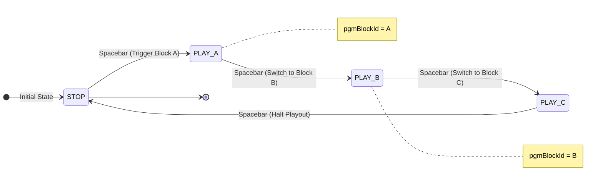
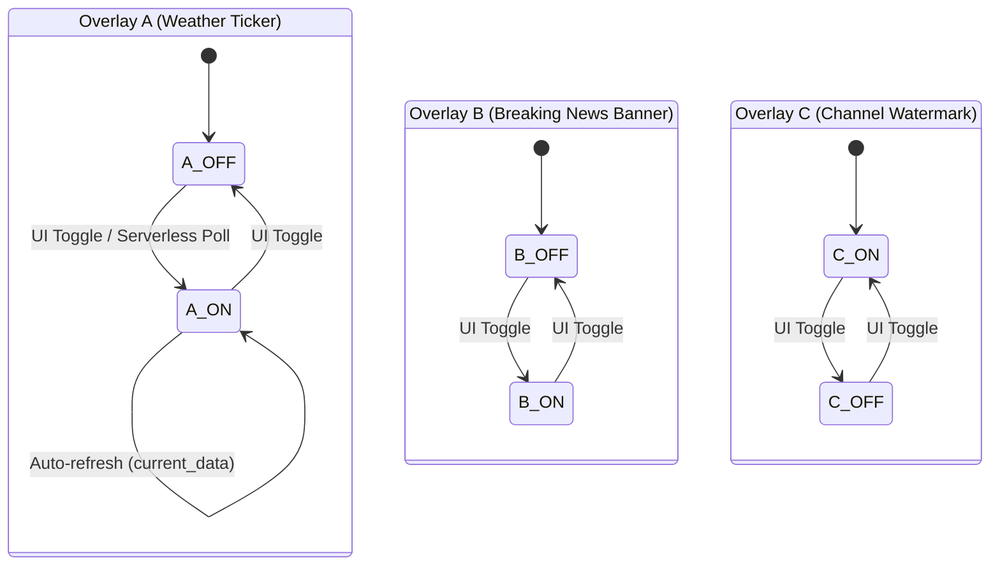

# Realtime Synchronization Architecture: Timeline vs Overlay

> **Date**: 2026-02-12  
> **Target Files**: [render.tsx](file:///home/genk/topProject/webcg-k/webcg-k/src/routes/render.tsx), `render/$sessionId.tsx`, [OverlayPlayoutLayer.tsx](file:///home/genk/topProject/webcg-k/webcg-k/src/components/OverlayPlayoutLayer.tsx), `BroadcastButton.tsx`, `$sessionId.tsx`

---

## 1. Introduction

The WebCG-K playout renderer synthesizes **two independent graphics layers** to output finalized broadcast overlay signals:

| Graphics Layer | Operational Role | Sync Protocol |
|----------------|------------------|---------------|
| **Timeline Graphics** | Sequential cuesheet playout (lower-thirds, backgrounds, credits) | Supabase Realtime **Broadcast** |
| **Overlay Graphics** | Independent overlays (weather tickers, network logos, breaking bulletins) | Supabase **Postgres Changes (DB CDC)** |

This document details **why these two layers leverage distinct synchronization models**, outlining their technical trade-offs, advantages, and recovery strategies under system disruptions.

---

## 2. Synchronization Mechanisms Comparison

### 2.1 Supabase Realtime Broadcast (Fire-and-Forget)

```
┌────────────┐     broadcast event      ┌────────────┐
│ Controller │ ────────────────────────▸ │  Renderer  │
│ (Publisher)│   type: "broadcast"      │(Subscriber)│
└────────────┘   event: "playout"       └────────────┘
                  payload: { action, item }
                     │
                     ▼
               Immediate dispatch and purge
               (No history, zero storage)
```

**Attributes:**
- **P2P-grade Latency**: ~5ms or lower.
- **Stateless**: Supabase servers relay payloads without persisting parameters in memory or disks.
- **Subscription-timed**: Receivers must be connected and actively listening when the event fires; missed events are not recovered automatically.
- **Zero DB Footprint**: Does not issue read/write queries to Postgres tables.
- **High-frequency Support**: Configured up to `eventsPerSecond: 100` to process 100 triggers per second.

### 2.2 Supabase Postgres Changes (DB-driven CDC)

```
┌────────────┐   UPDATE overlay_state   ┌──────────┐   CDC event   ┌────────────┐
│ Controller │ ────────────────────────▸ │ Postgres │ ────────────▸ │  Renderer  │
│ (or Server │   SET is_active = true   │    DB    │  postgres_   │(Subscriber)│
│  Function) │                          └──────────┘  changes      └────────────┘
└────────────┘                               │                          │
                                             ▼                          ▼
                                      Persistent data            Immediate recovery
                                      writes (WAL logs)          via fallback SELECTs
```

**Attributes:**
- **Database Propagation Latency**: ~50-100ms (Write ➔ WAL ➔ CDC Engine ➔ Socket push).
- **Persistent State**: The `overlay_state` table holds the source-of-truth status of active widgets.
- **Independent of Connect Timing**: Clients booting late can execute a `SELECT` query to paint the correct layers.
- **DB Query Footprint**: Updates require `UPDATE` writes and CDC relays.
- **External Trigger Compatibility**: System states can be altered by background Cron jobs, API servers, or Serverless functions.

---

## 3. Technical Rationale for Separate Pipelines

### 3.1 Timeline Graphics: "Single Slot, Single Operator, High Frequency"



| Trait | Technical Details |
|---|---|
| **Active Playout Slots** | **Exactly 1** at any given moment (`pgmBlockId`). |
| **Active Operators** | **Exactly 1** (The Studio Director controlling the timeline). |
| **Switch Frequency** | **High** — Operators might double-tap Spacebar to skip blocks, requiring sub-frame reactivity. |
| **Transitions** | **Sequential** — Strict step-by-step progress (`PLAY(A)` ➔ `PLAY(B)` ➔ `STOP`). |
| **External Triggers** | **None** — Playout commands originate exclusively from manual inputs. |
| **State Complexity** | **Simple** — Represents a single active state pointer. |

**Why Broadcast is optimal for Timeline Graphics:**
1. Database transit times of 50-100ms introduce noticeable lag when operators trigger rapid sequential skips.
2. The simple layout (one active ID) avoids sequence merge conflicts.
3. Playout commands originate from a single operator, removing the need for multi-source conflict resolution.
4. The timeline is backed up by `playhead_state` inside DB, allowing late clients to easily recover.

### 3.2 Overlay Graphics: "Multi-slot, Multi-source, Independent Lifecycles"



| Trait | Technical Details |
|---|---|
| **Active Playout Slots** | **N Channels** — Weather, Breaking News, and Watermarks render concurrently. |
| **Active Operators** | **Multiple** — Separate team members control different overlay slots (e.g. weather updates vs. breaking bulletins). |
| **Switch Frequency** | **Low** — Overlays remain visible for minutes; triggers are infrequent. |
| **Transitions** | **Independent** — Overlays operate on distinct lifecycles without sequence logic. |
| **External Triggers** | **Yes** — Automated background functions query weather APIs to update ticker strings dynamically. |
| **State Complexity** | **High** — N overlays × (`is_active` + custom content variables + transitions status). |

**Why DB CDC is optimal for Overlay Graphics:**

#### Reason 1: Updates from Background Operations (Edge Functions)

```
┌──────────────────┐
│ Supabase         │
│ Edge Function    │──── Queries weather APIs every 5 minutes
│ (Server-side)    │
└────────┬─────────┘
         │
         ▼
┌──────────────────┐
│ overlay_state    │     ➔ Background scripts write directly to Postgres
│ current_data =   │       without maintaining persistent socket states
│ { temp: 25°C }   │
└────────┬─────────┘
         │ postgres_changes CDC
         ▼
┌──────────────────┐
│ Renderer         │     ➔ Receives updates and refreshes ticker views
│ Weather Widget   │
└──────────────────┘
```

Serverless scripts operate statelessly, writing directly to Postgres tables. Supabase Postgres CDC engine propagates these writes to listening renderers automatically.

#### Reason 2: Conflict-free Multi-operator State Management

```
Timeline ──────────────────────────────────────────▸

Operator A:  ┤── Toggles Overlay 1 ON ──┤
Operator B:       ┤── Toggles Overlay 2 ON ──┤── Toggles Overlay 3 ON ──┤
Edge Script:   ┤── Writes Weather Data ──┤

Renderer Playout Output:
  t=0: { 1: OFF, 2: OFF, 3: OFF }
  t=1: { 1: ON,  2: OFF, 3: OFF }
  t=2: { 1: ON,  2: ON,  3: OFF }   ➔ Concurrent rendering
  t=3: { 1: OFF, 2: ON,  3: ON  }   ➔ Independent updates
```

If overlays used a raw Broadcast protocol, clients would have to process and merge separate event packets locally to track which overlays are active. This would force the renderer to manage a complex local state engine.

Using a database-driven model allows renderers to execute a clean single-line query:  
`SELECT * FROM overlay_state WHERE session_id = ? AND is_active = true`.

#### Reason 3: Playout Recovery and Self-healing

| Scenario | Broadcast Pipeline | Database CDC Pipeline |
|---|---|---|
| **Renderer Crashes & Reboots** | ❌ Misses intermediate playout events. | ✅ Restores active layouts instantly via SELECT fallback. |
| **OBS Screen Refresh** | ❌ Canvas defaults to a blank state. | ✅ Restores active layouts instantly via SELECT fallback. |
| **Network Dropout** | ❌ Loses event triggers fired during disconnects. | ✅ Resolves latest states on reconnect. |

---

## 4. Performance & Trade-offs

### 4.1 Latency Analysis

```
Broadcast:
  Controller ──(~5ms)──▸ Renderer
  
Postgres Changes:
  Controller ──(~10ms)──▸ DB Write ──(~30-80ms)──▸ CDC ──(~10ms)──▸ Renderer
  Total Latency: ~50-100ms
```

- **Timeline Graphics**: Requires sub-frame ~5ms reactivity. Global PGM spacebar clicks must map to renderers instantly.
- **Overlay Graphics**: ~50-100ms transit times are easily absorbed by standard 500ms fade-in animations, making the latency unnoticeable.

### 4.2 DB Load Analysis

| Metric | Broadcast Pipeline | Postgres Changes Pipeline |
|---|---|---|
| **Postgres Write Overhead** | Zero | 1 `UPDATE` write per toggle event. |
| **Postgres Read Overhead** | Zero | 1 `SELECT` query per toggle event. |
| **WAL Pipeline Load** | Zero | CDC engine reads from active WAL streams. |
| **Socket Footprint** | 1 socket | 1 socket + active DB connections. |

- Because overlay toggles are infrequent, database overhead remains negligible.
- If overlays required high-frequency coordinate updates (e.g. dozens of updates per second), a Broadcast pipeline would be preferred to avoid database bottlenecking.

### 4.3 Architectural Decision Matrix

```
Is the state triggered exclusively by local client UIs?
  ├── YES ➔ Broadcast Candidate
  └── NO  ➔ Database CDC Mandatory (Serverless, APIs, background jobs)  [Overlays]

Are multiple overlay layers rendered concurrently?
  ├── YES ➔ Database CDC Preferred (Requires solid state restoration)   [Overlays]
  └── NO  ➔ Broadcast Viable (Single active slot pointers)              [Timeline]

Is the state update frequency higher than 5 Hz?
  ├── YES ➔ Broadcast Mandatory (Avoids DB write locks)                 [Timeline]
  └── NO  ➔ Database CDC Allowed                                         [Overlays]

Must late-connecting views restore active layouts automatically?
  ├── YES ➔ Database CDC Mandatory                                       [Overlays]
  └── NO  ➔ Broadcast + initial query recovery is sufficient             [Timeline]
```

---

## 5. Production Code Implementation Patterns

### 5.1 Timeline Graphics: Broadcast + Database Initial Fallback

```typescript
// ─── Initial Load: Query baseline playhead states from database ───
useEffect(() => {
  const fetchTimelineBaseline = async () => {
    const { data } = await supabase
      .from("broadcast_sessions")
      .select("status, playhead_state, timeline_data")
      .eq("id", sessionId)
      .single();

    if (data?.status === "live" && data.playhead_state?.pgmBlockId) {
      const activeBlock = data.timeline_data.find(b => b.id === data.playhead_state.pgmBlockId);
      setActiveGraphic({ ...activeBlock }); // Renders base overlay instantly
    }

    // 🆕 Maps Segment Tabs (Nested Sequence Tab)
    const { data: segments } = await supabase
      .from("broadcast_segments")
      .select("*")
      .eq("session_id", sessionId)
      .order("segment_order");
    // Activates the Segment Tab Bar if segments are returned
  };
  
  fetchTimelineBaseline();
}, [sessionId]);

// ─── Live Playout: Listen for real-time Broadcast events ───
useEffect(() => {
  const channel = supabase.channel(`broadcast:${sessionId}`)
    .on("broadcast", { event: "playout" }, (payload) => {
      if (payload.action === "PLAY") setActiveGraphic(payload.item);
      if (payload.action === "STOP") setActiveGraphic(null);
    })
    .subscribe();
    
  return () => { channel.unsubscribe(); };
}, [sessionId]);
```

### 5.2 Overlay Graphics: Database Queries + CDC Change Subscriptions

```typescript
// ─── Initial Load: Query all active overlay layers from DB ───
const loadActiveOverlays = async () => {
  const { data } = await supabase
    .from("overlay_state")
    .select("*, template:overlay_templates(*)")
    .eq("session_id", sessionId);
    
  setLayers(buildLayerMap(data)); // Maps active variables directly
};

useEffect(() => { loadActiveOverlays(); }, [sessionId]);

// ─── Live Playout: Listen for CDC database changes ───
useEffect(() => {
  const channel = supabase.channel(`playout-overlay:${sessionId}`)
    .on("postgres_changes", {
      event: "*",
      schema: "public",
      table: "overlay_state",
    }, () => {
      loadActiveOverlays(); // Reloads active layers when changes are detected
    })
    .subscribe();
    
  return () => { channel.unsubscribe(); };
}, [sessionId]);
```

---

## 6. Theoretical Analysis: "What if overlays used Broadcast?"

What if the overlay pipeline was refactored to use a raw Broadcast protocol?

### 6.1 Required Changes

1. **Controller Panel**: Sends direct socket packets via `channel.send()` instead of executing database updates.
2. **Playout Renderer**: Listens for `broadcast` socket events instead of monitoring database changes.
3. **Initial Load**: Queries database tables on mount to resolve active baselines.

### 6.2 Unresolvable Bottlenecks

```
❌ Background Script Updates (Edge Functions)
   Legacy Pipeline: Serverless Script ➔ DB UPDATE ➔ CDC Event ➔ Renderer
   New Pipeline:    Serverless Script ➔ ??? ➔ Renderer
   ➔ Serverless environments cannot maintain active Broadcast channels.
   ➔ Tickers would still require a database fallback, creating an inconsistent hybrid model.

❌ Multi-operator State Conflicts
   Operator A dispatches broadcast("overlay_1 ON")
   Operator B dispatches broadcast("overlay_2 ON") concurrently
   ➔ Renderers would have to manage complex local memory maps to track which layers remain active, increasing code complexity.

❌ Database Synchronization Drift
   Toggling overlays via Broadcast bypasses database logs.
   ➔ Late-connecting control interfaces would render out-of-sync layouts.
   ➔ Correcting this requires writing to both the database and Broadcast channels, introducing duplicate state risks.
```

### 6.3 Conclusion

| Evaluation Point | Broadcast Alternative | Current CDC Pipeline |
|---|---|---|
| **Playout Reactivity** | Saves ~50ms of database transit time. | Fully responsive; latency is hidden by 500ms fade animations. |
| **Code Complexity** | Requires complex in-memory state mapping and duplicate write checks. | Resolves active templates instantly with a single-line DB query. |
| **Background APIs** | Cannot process stateless API updates cleanly. | Native support for background updates. |
| **System Stability** | Dropped socket packets create out-of-sync states. | Resolves Postgres tables as the absolute single source of truth. |

**The current database-driven CDC model is optimal and should not be refactored.**

---

## 7. High-Level Architectural Map

```
┌─────────────────────────────────────────────────────────────────┐
│                        Controller Panel                         │
│                                                                 │
│  ┌─────────────────┐          ┌──────────────────────┐         │
│  │ Timeline PGM    │          │ Overlay Panel        │         │
│  │ (Spacebar click)│          │ (ON/OFF Toggles)     │         │
│  └────────┬────────┘          └──────────┬───────────┘         │
│           │                              │                      │
└───────────┼──────────────────────────────┼──────────────────────┘
            │                              │
            ▼                              ▼
    ┌────────────────┐            ┌──────────────────┐
    │   Supabase     │            │   Supabase       │
    │   Realtime     │            │   Postgres       │
    │   Broadcast    │            │  (overlay_state) │
    │   (~5ms)       │            │  (~50-100ms)     │
    │   fire-and-    │            │   WAL Logging    │
    │   forget       │            │  ➔ CDC engine    │
    └────────┬───────┘            └──────────┬───────┘
             │                               │
             │    ┌──────────────────────┐   │
             │    │   Edge Function      │   │
             │    │  (Queries weather    │───┘
             │    │   APIs automatically)│  Writes to Postgres tables
             │    └──────────────────────┘
             │                               │
             ▼                               ▼
    ┌───────────────────────────────────────────────┐
    │               Playout Renderer                │
    │                                               │
    │  Initial Boot:                                │
    │  ├─ baseline: broadcast_sessions (PGM)        │
    │  └─ baseline: overlay_state (Active templates)│
    │                                               │
    │  Live Playout:                                │
    │  ├─ Subscribes to Broadcast (Timeline updates)│
    │  └─ Subscribes to CDC (Overlay updates)        │
    │                                               │
    │  ┌─────────────┐  ┌─────────────────────────┐ │
    │  │ Layer 1     │  │ Layer 2+                │ │
    │  │ Cuesheet    │  │ Overlays A, B, C...     │ │
    │  │ Graphics    │  │ (Independent lifecycles)│ │
    │  └─────────────┘  └─────────────────────────┘ │
    └───────────────────────────────────────────────┘
```

---

## 8. Associated Files

- [OverlayPlayoutLayer.tsx](file:///home/genk/topProject/webcg-k/webcg-k/src/components/OverlayPlayoutLayer.tsx) — Implements DB CDC subscriptions.
- `render/$sessionId.tsx` — Combines Broadcast event listeners and baseline DB loaders.
- `BroadcastButton.tsx` — Dispatches Realtime Broadcast events.
- `controller/$sessionId.tsx` — Handles database updates for timeline playheads.
