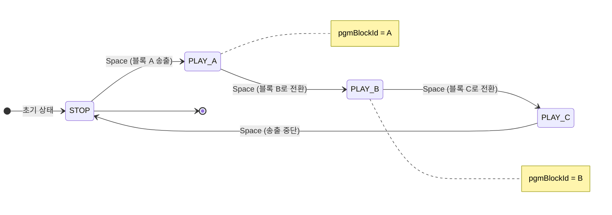
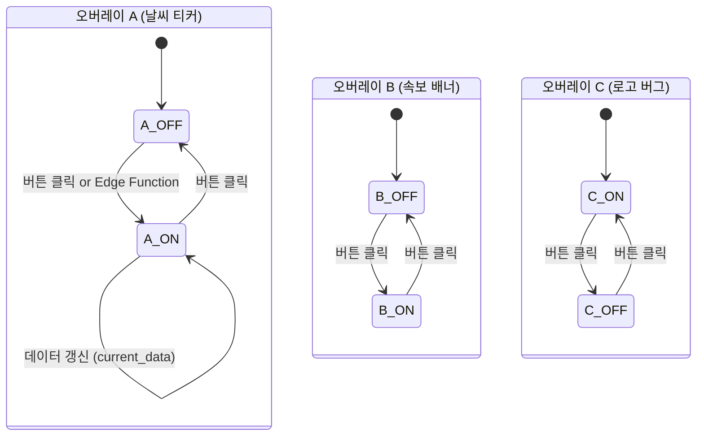

# Realtime 동기화 아키텍처: 타임라인 vs 오버레이

> **작성일**: 2026-02-12  
> **대상 파일**: `render.tsx`, `render/$sessionId.tsx`, `OverlayPlayoutLayer.tsx`, `BroadcastButton.tsx`, `$sessionId.tsx`

---

## 1. 개요

WebCG-K 렌더러는 **두 가지 독립적인 그래픽 레이어**를 합성하여 최종 송출 신호를 생성한다.

| 레이어 | 역할 | 동기화 방식 |
|--------|------|-------------|
| **타임라인 그래픽** | 큐시트 기반 순차 송출 (로워써드, 배경 등) | Supabase Realtime **Broadcast** |
| **오버레이 그래픽** | 독립 레이어 (날씨 티커, 로고 버그, 속보 등) | Supabase **Postgres Changes** (DB) |

이 문서는 **왜 두 시스템이 서로 다른 동기화 전략을 사용하는지**, 각각의 트레이드오프와 장단점, 장애 시나리오별 복구 전략을 상세히 설명한다.

---

## 2. 동기화 메커니즘 비교

### 2.1 Supabase Realtime Broadcast (Fire-and-Forget)

```
┌────────────┐     broadcast event      ┌────────────┐
│ Controller │ ────────────────────────▸ │  Renderer  │
│ (발행자)    │   type: "broadcast"      │  (구독자)   │
└────────────┘   event: "playout"       └────────────┘
                  payload: { action, item }
                     │
                     ▼
              메시지 즉시 전달 후 폐기
              (히스토리 없음, 저장 없음)
```

**특성**:
- **P2P 수준 지연**: ~5ms 이내
- **무상태(Stateless)**: Supabase 서버는 메시지를 저장하지 않음
- **구독 시점 의존**: 메시지 발행 시점에 구독 중이어야 수신 가능
- **DB 부하 없음**: 어떠한 테이블도 건드리지 않음
- **고빈도 지원**: `eventsPerSecond: 100` 설정으로 초당 100회까지 처리 가능

### 2.2 Supabase Postgres Changes (DB 기반 CDC)

```
┌────────────┐   UPDATE overlay_state   ┌──────────┐   CDC event   ┌────────────┐
│ Controller │ ────────────────────────▸ │ Postgres │ ────────────▸ │  Renderer  │
│ (또는 Edge  │   SET is_active = true   │    DB    │  postgres_   │  (구독자)   │
│  Function) │                          └──────────┘  changes      └────────────┘
└────────────┘                               │                          │
                                             ▼                          ▼
                                      데이터 영속 저장           SELECT로 전체 상태
                                      (테이블에 남음)            즉시 복구 가능
```

**특성**:
- **DB 경유 지연**: ~50-100ms (Write → WAL → CDC → Realtime push)
- **상태 영속화**: `overlay_state` 테이블에 현재 상태가 항상 저장됨
- **구독 시점 비의존**: 접속 시 `SELECT`로 전체 상태 즉시 복구
- **DB 부하 있음**: 매 상태 변경마다 `UPDATE` + `SELECT` 쿼리 발생
- **외부 소스 호환**: Edge Function, Cron Job 등 비-브라우저 환경에서도 상태 변경 가능

---

## 3. 왜 서로 다른 방식을 사용하는가?

### 3.1 타임라인 그래픽 — "단일 슬롯, 단일 제어자, 고빈도"



| 특성 | 내용 |
|------|------|
| **활성 슬롯 수** | **항상 1개** (`pgmBlockId` 하나) |
| **제어자** | **1명** (컨트롤러 운영자) |
| **전환 빈도** | **높음** — Space 키 연타로 초당 여러 번 가능 |
| **상태 전이** | **순차적** — `PLAY(A)` → `PLAY(B)` → `STOP` |
| **외부 트리거** | **없음** — 오직 인간 운영자의 키보드 입력만 |
| **상태 복잡도** | **단순** — "현재 뭐가 켜져 있느냐" 하나 |

**→ Broadcast가 적합한 이유:**
1. 초당 여러 번 전환될 수 있어 DB 경유의 50-100ms 지연이 체감됨
2. 상태가 단순 (블록 ID 1개) 하므로 merge/conflict 없음
3. 외부 소스 없이 인간 입력만 처리
4. DB에 이미 `playhead_state`로 영속화 중 → 초기 로드 시 복원 가능

### 3.2 오버레이 그래픽 — "다중 슬롯, 다중 소스, 독립 생명주기"



| 특성 | 내용 |
|------|------|
| **활성 슬롯 수** | **N개** — 오버레이 A, B, C가 동시에 독립 활성화 가능 |
| **제어자** | **다중** — 사용자 A가 날씨를, 사용자 B가 속보를 동시 제어 |
| **전환 빈도** | **낮음** — ON/OFF 전환은 초당 1-2회 미만 |
| **상태 전이** | **비순차적, 독립적** — A ON + B ON + C OFF 동시 공존 |
| **외부 트리거** | **있음** — Edge Function이 API 폴링으로 `current_data` 자동 갱신 |
| **상태 복잡도** | **높음** — N개 오버레이 × (is_active + current_data + animation_state) |

**→ DB가 적합한 이유:**

#### 이유 1: 외부 소스 (Edge Function)의 상태 변경

```
┌──────────────────┐
│ Supabase         │
│ Edge Function    │──── 5분마다 Open-Meteo API 호출
│ (서버 사이드)     │
└────────┬─────────┘
         │
         ▼
┌──────────────────┐
│ overlay_state    │     ← Edge Function은 DB만 쓸 수 있음
│ current_data =   │        Realtime broadcast를 직접 발행할 수 없음
│ { temp: 25°C }   │
└────────┬─────────┘
         │ postgres_changes CDC
         ▼
┌──────────────────┐
│ Renderer         │     ← 자동으로 업데이트 수신
│ 날씨 위젯 갱신    │
└──────────────────┘
```

Edge Function은 **Supabase Realtime의 broadcast API에 접근할 수 없다**. DB `UPDATE`가 유일한 인터페이스이며, `postgres_changes`가 이 변경을 자동으로 구독자에게 전파한다.

#### 이유 2: 다중 제어자의 동시 상태 변경

```
시간 ──────────────────────────────────────────▸

사용자 A:  ┤── 오버레이 1 ON ──┤
사용자 B:       ┤── 오버레이 2 ON ──┤── 오버레이 3 ON ──┤
Edge Fn:     ┤── 날씨 데이터 갱신 ──┤

렌더러가 알아야 하는 "현재 상태":
  t=0: { 1: OFF, 2: OFF, 3: OFF }
  t=1: { 1: ON,  2: OFF, 3: OFF }
  t=2: { 1: ON,  2: ON,  3: OFF }   ← 동시 활성
  t=3: { 1: OFF, 2: ON,  3: ON  }   ← 독립 전환
```

**broadcast 방식의 문제**: 각 ON/OFF 이벤트가 개별 메시지로 날아옴. 렌더러가 **"현재 전체 상태"**를 알려면 모든 메시지를 로컬에서 merge해야 함 — 이는 사실상 **렌더러 안에 상태 DB를 만드는 것**과 같음.

**DB 방식의 장점**: `SELECT * FROM overlay_state WHERE session_id = ? AND is_active = true` 한 줄로 전체 활성 상태를 즉시 확인.

#### 이유 3: 크래시/재접속 시 완전 복구

| 시나리오 | Broadcast | DB |
|----------|-----------|-----|
| 렌더러 크래시 후 재시작 | ❌ 마지막 메시지 이후 변경만 수신 | ✅ SELECT로 전체 복구 |
| OBS 브라우저 소스 새로고침 | ❌ 빈 화면 | ✅ 즉시 복원 |
| 네트워크 순단 후 재접속 | ❌ 순단 중 이벤트 유실 | ✅ 재쿼리로 동기화 |

---

## 4. 성능 비교 및 트레이드오프

### 4.1 지연시간 (Latency)

```
Broadcast:
  Controller ──(~5ms)──▸ Renderer
  
Postgres Changes:
  Controller ──(~10ms)──▸ DB Write ──(~30-80ms)──▸ CDC ──(~10ms)──▸ Renderer
  총: ~50-100ms
```

- **타임라인**: 5ms 지연. Space 키 연타 시 프레임 정확도가 중요하므로 broadcast 필수
- **오버레이**: 50-100ms 지연. ON/OFF 전환이 드물고 fade 애니메이션(500ms)에 흡수되므로 체감 불가

### 4.2 DB 부하

| | Broadcast | Postgres Changes |
|---|---|---|
| **쓰기 부하** | 0 | `UPDATE` 1회/변경 |
| **읽기 부하** | 0 | `SELECT` 1회/변경 (loadActiveOverlays) |
| **WAL 부하** | 0 | CDC가 WAL을 소비 |
| **연결 비용** | Realtime 소켓 1개 | Realtime 소켓 1개 + DB 연결 |

- 오버레이 ON/OFF는 **분당 수 회** 수준이므로 DB 부하는 무시 가능
- 만약 오버레이 데이터 갱신이 **초당 수십 회**라면 broadcast를 고려해야 함 (현재는 해당 없음)

### 4.3 의사결정 매트릭스

```
질문 1: 상태 변경 주체가 브라우저 UI뿐인가?
  ├── YES → Broadcast 후보
  └── NO  → DB 필수 (Edge Function 등 외부 소스)  ← 오버레이

질문 2: 동시에 독립적으로 활성화되는 항목이 여러 개인가?
  ├── YES → DB 권장 (전체 상태 조회 필요)  ← 오버레이
  └── NO  → Broadcast 가능  ← 타임라인 (1개)

질문 3: 상태 변경 빈도가 초당 5회 이상인가?
  ├── YES → Broadcast 필수 (DB 부하 회피)  ← 타임라인
  └── NO  → DB 허용  ← 오버레이

질문 4: 크래시 복구 시 외부 개입 없이 자동 복원이 필요한가?
  ├── YES → DB 필수  ← 오버레이
  └── NO  → Broadcast + 초기 로드로 충분  ← 타임라인
```

---

## 5. WebCG-K의 실제 구현 패턴

### 5.1 타임라인 그래픽: Broadcast + 초기 DB 로드

```typescript
// ─── 초기 로드: DB에서 현재 PGM 상태 + 세그먼트 복원 ───
useEffect(() => {
  const { data } = await supabase
    .from("broadcast_sessions")
    .select("status, playhead_state, timeline_data")
    .eq("id", sessionId).single();

  if (data.status === "live" && data.playhead_state?.pgmBlockId) {
    const block = data.timeline_data.find(b => b.id === pgmBlockId);
    setActiveGraphic({ ...block });  // 즉시 복원
  }

  // 🆕 세그먼트 로드 (Nested Sequence Tab)
  const { data: segments } = await supabase
    .from("broadcast_segments")
    .select("*")
    .eq("session_id", sessionId)
    .order("segment_order");
  // segments가 있으면 탭 바 활성화, 없으면 기존 단일 타임라인
}, [sessionId]);

// ─── 이후: Broadcast 구독으로 실시간 수신 ───
useEffect(() => {
  const channel = supabase.channel(`broadcast:${sessionId}`)
    .on("broadcast", { event: "playout" }, (payload) => {
      if (payload.action === "PLAY") setActiveGraphic(payload.item);
      if (payload.action === "STOP") setActiveGraphic(null);
    })
    .subscribe();
  return () => channel.unsubscribe();
}, [sessionId]);
```

### 5.2 오버레이 그래픽: DB 조회 + Postgres Changes 구독

```typescript
// ─── 초기 로드: DB에서 전체 활성 오버레이 쿼리 ───
const loadActiveOverlays = async () => {
  const { data } = await supabase
    .from("overlay_state")
    .select("*, template:overlay_templates(*)")
    .eq("session_id", sessionId);
  // N개 오버레이의 is_active 상태를 Map으로 관리
  setLayers(buildLayerMap(data));
};

useEffect(() => { loadActiveOverlays(); }, [sessionId]);

// ─── 이후: postgres_changes로 실시간 수신 ───
useEffect(() => {
  const channel = supabase.channel(`playout-overlay:${sessionId}`)
    .on("postgres_changes", {
      event: "*",
      schema: "public",
      table: "overlay_state",
    }, () => {
      loadActiveOverlays();  // 변경 감지 시 전체 리로드
    })
    .subscribe();
  return () => channel.unsubscribe();
}, [sessionId]);
```

---

## 6. "오버레이도 Broadcast로 바꾸면?" — 이론적 분석

만약 오버레이를 broadcast 방식으로 전환한다면:

### 6.1 필요한 변경

1. **컨트롤러**: 오버레이 ON/OFF 시 `overlay_state` UPDATE 대신 `channel.send()` 호출
2. **렌더러**: `postgres_changes` 대신 `broadcast` 구독
3. **초기 로드**: DB에서 현재 활성 오버레이 목록 쿼리 (현재와 동일)

### 6.2 해결할 수 없는 문제

```
❌ Edge Function 데이터 갱신
   현재: Edge Function → DB UPDATE → postgres_changes → Renderer
   변경: Edge Function → ??? → Renderer
   → Edge Function은 Realtime broadcast를 발행할 수 없음
   → 결국 DB를 거쳐야 하므로 하이브리드가 필요 (복잡도↑)

❌ 다중 제어자 상태 충돌
   사용자 A: broadcast("overlay_1 ON")
   사용자 B: broadcast("overlay_2 ON")  (동시)
   렌더러: 두 메시지를 받았지만, "overlay_1은 아직 ON인가?"
   → 렌더러가 로컬 상태를 관리해야 함 = 사실상 인메모리 DB

❌ DB 일관성 상실
   broadcast로 ON → DB에 기록 안 됨 → 다른 컨트롤러가 접속하면 상태 불일치
   → 결국 DB에도 써야 함 → 이중 쓰기 (broadcast + DB) = 복잡도↑
```

### 6.3 결론

| 관점 | Broadcast 전환 | 현재 방식 (DB) |
|------|---------------|---------------|
| **성능** | ~50ms 절약 | 충분히 빠름 (fade 500ms에 흡수) |
| **복잡도** | 인메모리 상태 관리 + 이중 쓰기 필요 | SELECT 한 줄로 전체 복구 |
| **외부 소스** | 불가능 (하이브리드 필요) | 완벽 지원 |
| **안정성** | 메시지 유실 시 불일치 | DB가 Single Source of Truth |

**→ 현재 DB 방식이 최적이며, 변경할 이유가 없다.**

---

## 7. 아키텍처 요약 다이어그램

```
┌─────────────────────────────────────────────────────────────────┐
│                        Controller                               │
│                                                                 │
│  ┌─────────────────┐          ┌──────────────────────┐         │
│  │ Timeline PGM    │          │ Overlay Panel        │         │
│  │ (Space 키 송출)  │          │ (ON/OFF 토글)        │         │
│  └────────┬────────┘          └──────────┬───────────┘         │
│           │                              │                      │
└───────────┼──────────────────────────────┼──────────────────────┘
            │                              │
            ▼                              ▼
   ┌────────────────┐            ┌──────────────────┐
   │   Supabase     │            │   Supabase       │
   │   Realtime     │            │   Postgres       │
   │   Broadcast    │            │   (overlay_state) │
   │   (~5ms)       │            │   (~50-100ms)    │
   │   fire-and-    │            │   영속 저장       │
   │   forget       │            │   + CDC 전파     │
   └────────┬───────┘            └──────────┬───────┘
            │                               │
            │    ┌──────────────────────┐    │
            │    │   Edge Function      │    │
            │    │   (날씨/지진 API     │────┘
            │    │    자동 갱신)         │  DB UPDATE만 가능
            │    └──────────────────────┘
            │                               │
            ▼                               ▼
   ┌───────────────────────────────────────────────┐
   │                    Renderer                    │
   │                                               │
   │  초기 로드:                                    │
   │  ├─ broadcast_sessions.playhead_state (PGM)   │
   │  └─ overlay_state SELECT (활성 오버레이)       │
   │                                               │
   │  실시간:                                       │
   │  ├─ broadcast 구독 (타임라인 변경)             │
   │  └─ postgres_changes 구독 (오버레이 변경)      │
   │                                               │
   │  ┌─────────────┐  ┌─────────────────────────┐│
   │  │ Layer 1     │  │ Layer 2+                ││
   │  │ 타임라인    │  │ 오버레이 A, B, C...     ││
   │  │ 그래픽      │  │ (독립 생명주기)          ││
   │  └─────────────┘  └─────────────────────────┘│
   └───────────────────────────────────────────────┘
```

---

## 8. 관련 파일

- `OverlayPlayoutLayer.tsx` — 오버레이 DB 구독 구현
- `render/$sessionId.tsx` — 타임라인 broadcast + 초기 DB 로드
- `BroadcastButton.tsx` — 타임라인 broadcast 발행
- `controller/$sessionId.tsx` — 컨트롤러 PGM 상태 영속화
