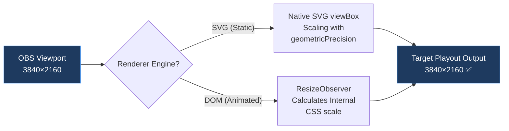

# Renderer Resolution & Scaling Guide

> **Audience**: Broadcast operators and developers looking to understand the playout resolution pathways within OBS and vMix browser sources.

---

## 1. Architectural Overview

```
OBS Browser Source (1920×1080 or 3840×2160)
  └─ Web View: /render?sessionId=xxx&resolution=1080p
       └─ render.tsx (100vw × 100vh full screen — CSS scale removed)
            ├─ GraphicPreviewRenderer (Native SVG viewBox scaling)
            │    └─ viewBox + geometricPrecision ➔ Pixel-perfect rendering
            └─ AnimatedGraphicRenderer (DOM + ResizeObserver self-scaling)
                 └─ Detect viewport dimensions ➔ apply CSS scale only on internal wrappers
```

---

## 2. Scaling Pipelines

### 2.1 Native SVG Scaling (GraphicPreviewRenderer Path)

> [!IMPORTANT]
> **Double-scaling patterns that combine SVG viewBox mapping and global CSS scaling have been deleted.**
> CSS scaling multiplies sub-pixel rounding errors defined at base layouts. This rounding discrepancy causes visible font shifting (jitter) on larger playout screens.

```
┌──────────────────────────────────────┐
│  render.tsx Container: 100vw × 100vh │ ➔ Viewport dimension provided by OBS = Output target resolution
│  ┌──────────────────────────────┐    │
│  │      SVG viewBox             │    │ ➔ Virtual canvas bounds: 0,0 to 1920,1080
│  │      width="100%"            │    │ ➔ Maps directly to active viewports (zero CSS scale)
│  │      height="100%"           │    │
│  │      geometricPrecision ✅   │    │ ➔ Disables pixel-snapping font hinting
│  └──────────────────────────────┘    │
└──────────────────────────────────────┘
```

**Underlying Mechanics:**
- The root DOM element of `render.tsx` spans `100vw × 100vh` to fill the available browser viewport.
- The `viewBox="0 0 1920 1080"` and `preserveAspectRatio="xMidYMid meet"` properties map the virtual vector space **directly to the output resolution viewport** without intermediate CSS transforms.
- Vector paths are rasterized by the browser engine to fit the actual pixel count, ensuring crisp rendering at any resolution.

### 2.2 DOM-Self Scaling (AnimatedGraphicRenderer Path)

Animated HTML templates that rely on standard `div` elements and CSS keyframe motions cannot use native SVG viewBox mappings. 
Instead, **the component uses a `ResizeObserver` to evaluate active viewport heights and widths**, calculating an internal CSS scale factor:

```typescript
// Inside AnimatedGraphicRenderer.tsx
const containerRef = useRef<HTMLDivElement>(null);
const [selfScale, setSelfScale] = useState(1);

useEffect(() => {
    const observer = new ResizeObserver((entries) => {
        const { width: parentW, height: parentH } = entries[0].contentRect;
        const sx = parentW / canvasWidth;   // Viewport width ÷ base layout width
        const sy = parentH / canvasHeight;  // Viewport height ÷ base layout height
        setSelfScale(Math.min(sx, sy));     // Calculates scales using standard aspect ratio constraints
    });
    observer.observe(containerRef.current!);
    return () => observer.disconnect();
}, [canvasWidth, canvasHeight]);
```

**Underlying Structure:**
```
render.tsx (100vw × 100vh viewport)
  └─ AnimatedGraphicRenderer (width: 100%, height: 100%)
       └─ Inner Coordinates Wrapper (canvasWidth × canvasHeight px)
            ├─ transform: scale(selfScale)   ➔ Calculated dynamically by ResizeObserver
            ├─ translate(-50%, -50%)          ➔ Centers the graphics canvas
            └─ Children elements (absolute positioning with absolute px offsets)
```

### 2.3 Scaling Flowchart



---

## 3. Sub-pixel Font Alignment (Eliminating Jitter)

### 3.1 The Jitter Pitfalls of Global CSS Scaling

Chromium processes elements through the following execution pipeline:
1. **Base Resolution Layout**: Renders typography with standard font-hinting behaviors, clamping lines and spacing to pixel grids.
2. **CSS Transforms Scale**: Magnifies the finalized baseline coordinates by the scaling multiplier.

At scale, sub-pixel rounding errors (often `0.3px` to `0.5px`) are multiplied by the scale factor. A 48px header magnified by `2.0` can shift up to `1.0px`, causing visible layout misalignment.

### 3.2 The Solution: `geometricPrecision` and Scale Deletions

```tsx
// Inside GraphicPreviewRenderer.tsx (SVG Root Element)
<svg
    viewBox={`0 0 ${canvasWidth} ${canvasHeight}`}
    style={{
        textRendering: "geometricPrecision",   // ➔ Disables pixel-snapping font hinting
        shapeRendering: "geometricPrecision",  // ➔ Prioritizes mathematical curve precision
    }}
    preserveAspectRatio="xMidYMid meet"
>
```

| Attribute | `auto` (Default) | `geometricPrecision` |
|---|---|---|
| **Font Hinting** | ✅ Active (Optimized for readability on low-DPI monitors) | ❌ Disabled |
| **Letter-spacing Precision** | ⚠️ Snap points introduce rounding errors | ✅ Maintains mathematical sub-pixel placements |
| **Scale Stability** | ⚠️ Rounding errors multiply at high resolutions | ✅ Maintains proportions perfectly at all scales |
| **Target Environment** | Legacy 72-DPI monitors | **1080p+ Premium Broadcast Overlays** ✅ |

---

## 4. Raster Assets Multi-Resolution System

### 4-1. Image Model Schemas in `GraphicElement`

```typescript
export interface GraphicElement {
  // Asset references supporting multiple resolution endpoints
  imageId?: string;   // Reference ID in "images" database table
  src?: string;       // Legacy and fallback image URL
  src_2k?: string;    // High-definition 2K assets saved in Storage
  src_4k?: string;    // Ultra-high-definition 4K assets saved in Storage
  objectFit?: "contain" | "cover" | "fill";
}
```

### 4-2. Selecting Images by Resolution

```typescript
const getImageUrl = (element: GraphicElement): string => {
    if (resolution === "4k") {
        return element.src_4k || element.src_2k || element.src || "";
    }
    return element.src_2k || element.src || "";
};
```

### 4-3. Image Fallback Sequence

```
resolution=4k   ➔ src_4k ➔ src_2k ➔ src ➔ "" (empty string)
resolution=1080p ➔ src_2k ➔ src ➔ ""
```

> [!IMPORTANT]
> The query parameter `resolution` only determines which image URL to load. 
> It has no effect on vector rendering layers (`rect`, `text`, `ellipse`), which are calculated mathematically by the browser.

---

## 5. Broadcast Scenario Matrices

### 5-1. Resolution Scenarios

| Scenario | OBS Output Frame | `resolution` Parameter | Scaling Method | Loaded Image Source | Playout Output |
|---|---|---|---|---|---|
| **1** | 1920×1080 (FHD) | `1080p` | SVG viewBox 1:1 scale | `src_2k` | ✅ **Optimal** — Native 1:1 pixel alignments. |
| **2** | 3840×2160 (UHD) | `1080p` | SVG viewBox 2x scaling | `src_2k` | ⚠️ Vectors remain crisp; **raster graphics may pixelate**. |
| **3** | 3840×2160 (UHD) | `4k` | SVG viewBox 2x scaling | `src_4k` | ✅ **Optimal** — Crisp high-resolution assets. |

### 5-2. Why Scenario 2 is a Viable Fallback

- **Vector Entities & Text**: SVG viewBox scales mathematical coordinates to UHD pixels, rendering them perfectly sharp.
- **Images**: 2K bitmaps scaled to 4K may look slightly soft, depending on the asset content.

### 5-3. Recommended Configurations

| Target Output standard | OBS Browser Resolution | URL Endpoint Parameter |
|---|---|---|
| FHD Broadcast (1920×1080) | 1920×1080 | `/render?sessionId=xxx&resolution=1080p` |
| UHD Broadcast (3840×2160) | 3840×2160 | `/render?sessionId=xxx&resolution=4k` |

> [!TIP]
> If a template is **purely vector-based** (using only shapes and text), the `resolution` parameter can be omitted. The output will automatically match the OBS browser source viewport dimensions.

---

## 6. Layout Scaling Summary

```
┌─────────────────────────────────────────────────────────────┐
│                    OBS Browser Viewport                     │
│               Dimension: W × H (e.g. 3840×2160)             │
│  ┌───────────────────────────────────────────────────────┐  │
│  │              render.tsx root viewport                 │  │
│  │              100vw × 100vh (No global CSS scaling)    │  │
│  │  ┌─────────────────────────────────────────────────┐  │  │
│  │  │    Playout Render Engine                        │  │  │
│  │  │    Scales via viewBox or ResizeObserver         │  │  │
│  │  │    Applies geometricPrecision text styles       │  │  │
│  │  │                                                 │  │  │
│  │  │  ┌─────────┐  ┌──────────┐  ┌─────────┐         │  │  │
│  │  │  │  <rect>  │  │  <text>  │  │ <image> │         │  │  │
│  │  │  │  Vector  │  │  Vector  │  │ Raster  │         │  │  │
│  │  │  │  ✅ Sharp│  │  ✅ Sharp│  │ ⚠️ Cond. │         │  │  │
│  │  │  └─────────┘  └──────────┘  └─────────┘         │  │  │
│  │  └─────────────────────────────────────────────────┘  │  │
│  └───────────────────────────────────────────────────────┘  │
└─────────────────────────────────────────────────────────────┘
```

---

## 7. Revision Logs

### 2026-04-22: Global Scaling Refactor

* **Legacy Mode**: Scaled the container `div` via CSS properties (`transform: scale(S)`), leading to rendering artifacts.
* **Modern Mode**: Replaced global CSS scales with native SVG viewBox mappings and local `ResizeObserver` checks.

**Key Drivers for the Refactor:**
1. Global CSS scaling introduced noticeable text jitter on high-resolution displays.
2. SVG viewBox handles scaling natively, making global CSS scales redundant.
3. Added `textRendering: "geometricPrecision"` to disable font hinting, eliminating rounding errors at the renderer level.

---

*Last Updated: 2026-04-22*
