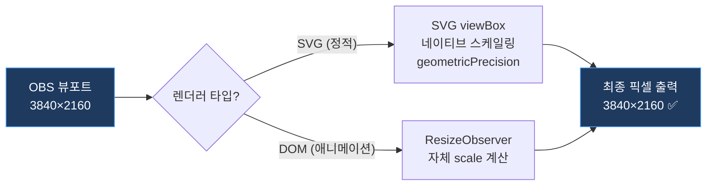

# 렌더러 해상도 처리 가이드

> **대상 독자**: 본 프로젝트의 렌더러가 OBS/vMix 브라우저 소스에서 어떻게 해상도를 처리하는지 이해하고자 하는 운용자/개발자

---

## 1. 아키텍처 개요

```
OBS 브라우저 소스 (1920×1080 또는 3840×2160)
  └─ 웹 페이지 로드: /render?sessionId=xxx&resolution=1080p
       └─ render.tsx (100vw × 100vh 풀스크린 — CSS scale 없음)
            ├─ GraphicPreviewRenderer (SVG viewBox 네이티브 스케일링)
            │    └─ viewBox + geometricPrecision → 픽셀 퍼펙트 렌더링
            └─ AnimatedGraphicRenderer (DOM + ResizeObserver 자체 스케일링)
                 └─ 부모 크기 감지 → 내부 좌표계 래퍼에서 scale 적용
```

---

## 2. 스케일링 파이프라인

### 2.1 단일 SVG 네이티브 스케일링 (GraphicPreviewRenderer 경로)

> [!IMPORTANT]
> **이전 아키텍처의 "CSS transform: scale() + SVG viewBox 이중 스케일링"은 제거되었습니다.**
> CSS scale은 1배율 레이아웃의 sub-pixel 반올림 오차를 배수만큼 증폭시켜
> 텍스트 시프트(jitter)를 유발하는 안티패턴이었습니다.

```
┌──────────────────────────────────────┐
│  render.tsx 컨테이너: 100vw × 100vh  │  ← OBS가 제공하는 뷰포트 = 최종 출력 해상도
│  ┌──────────────────────────────┐    │
│  │      SVG viewBox             │    │  ← 가상 좌표계: 0,0 ~ 1920,1080
│  │      width="100%"            │    │  ← 뷰포트에 네이티브 매핑 (CSS scale 없음)
│  │      height="100%"           │    │
│  │      geometricPrecision ✅   │    │  ← 폰트 힌팅 비활성화
│  └──────────────────────────────┘    │
└──────────────────────────────────────┘
```

**동작 원리:**
- `render.tsx`의 루트 컨테이너는 `100vw × 100vh`로 뷰포트 전체를 차지
- SVG `viewBox="0 0 1920 1080"` + `preserveAspectRatio="xMidYMid meet"`가
  가상 좌표계를 **출력 해상도에 직접 매핑** (중간 CSS 변환 없음)
- 브라우저의 SVG 엔진이 최종 픽셀 수에 맞춰 벡터를 래스터라이즈 → **항상 선명**

### 2.2 DOM 자체 스케일링 (AnimatedGraphicRenderer 경로)

AnimatedGraphicRenderer는 HTML div + CSS animation 기반이므로 SVG viewBox의 혜택이 없습니다.
대신 **컴포넌트 내부에서 ResizeObserver로 부모 크기를 감지**하여 자체 scale을 계산합니다.

```typescript
// AnimatedGraphicRenderer.tsx 내부
const containerRef = useRef<HTMLDivElement>(null);
const [selfScale, setSelfScale] = useState(1);

useEffect(() => {
    const observer = new ResizeObserver((entries) => {
        const { width: parentW, height: parentH } = entries[0].contentRect;
        const sx = parentW / canvasWidth;   // 뷰포트 너비 ÷ 캔버스 너비
        const sy = parentH / canvasHeight;  // 뷰포트 높이 ÷ 캔버스 높이
        setSelfScale(Math.min(sx, sy));     // contain 모드
    });
    observer.observe(containerRef.current!);
    return () => observer.disconnect();
}, [canvasWidth, canvasHeight]);
```

**구조:**
```
render.tsx (100vw × 100vh)
  └─ AnimatedGraphicRenderer (width: 100%, height: 100%)
       └─ 내부 좌표계 래퍼 (canvasWidth × canvasHeight px)
            ├─ transform: scale(selfScale)  ← ResizeObserver가 계산
            ├─ translate(-50%, -50%)         ← 중앙 정렬
            └─ 자식 요소들 (position: absolute, left/top px)
```

### 2.3 스케일링 흐름도



---

## 3. 텍스트 정밀도 보장 (Sub-pixel Jitter 방지)

### 3.1 문제: CSS Scale의 텍스트 시프트

크로미움 렌더링 엔진은 다음 순서로 동작합니다:
1. **1배율 레이아웃 계산**: 폰트 힌팅(픽셀 격자 스냅) 적용, 자간/베이스라인 확정
2. **CSS transform 적용**: 확정된 좌표를 배수만큼 확대

이때 1단계에서 발생한 **소수점 반올림 오차(0.3~0.5px)**가 2단계에서 배수만큼 증폭됩니다.
→ 48px 텍스트가 2배 확대 시 최대 1px 시프트 → **방송 자막 위치 틀어짐**

### 3.2 해결: geometricPrecision + CSS Scale 제거

```tsx
// GraphicPreviewRenderer.tsx — SVG 루트
<svg
    viewBox={`0 0 ${canvasWidth} ${canvasHeight}`}
    style={{
        textRendering: "geometricPrecision",   // ← 폰트 힌팅 비활성화
        shapeRendering: "geometricPrecision",  // ← 도형 정밀도 우선
    }}
    preserveAspectRatio="xMidYMid meet"
>
```

| 속성 | `auto` (기본값) | `geometricPrecision` |
|---|---|---|
| 폰트 힌팅 | ✅ 활성 (저해상도에서 선명) | ❌ 비활성 |
| 자간 정확도 | ⚠️ 픽셀 스냅으로 오차 발생 | ✅ 수학적 정확도 보장 |
| 스케일링 안정성 | ⚠️ 오차 증폭 | ✅ 어떤 배율에서도 동일 |
| 적합한 환경 | 72dpi 모니터 | **1080p+ 방송 그래픽** ✅ |

---

## 4. 래스터 이미지 다중 해상도 시스템

### 4.1 GraphicElement 이미지 필드

```typescript
export interface GraphicElement {
    // 이미지 속성 (다중 해상도 지원)
    imageId?: string;   // DB 이미지 ID (images 테이블 참조)
    src?: string;       // 기본 이미지 URL (하위 호환성 / 레거시)
    src_2k?: string;    // 2K 해상도 이미지 URL (Supabase Storage)
    src_4k?: string;    // 4K 해상도 이미지 URL (Supabase Storage)
    objectFit?: "contain" | "cover" | "fill";
}
```

### 4.2 해상도별 이미지 선택 로직

```typescript
const getImageUrl = (element: GraphicElement): string => {
    if (resolution === "4k") {
        return element.src_4k || element.src_2k || element.src || "";
    }
    return element.src_2k || element.src || "";
};
```

### 4.3 Fallback 체인

```
resolution=4k   → src_4k → src_2k → src → ""
resolution=1080p → src_2k → src → ""
```

> [!IMPORTANT]
> `resolution` 쿼리 파라미터의 **유일한 실질적 기능**이 이 이미지 URL 분기입니다.
> 벡터 요소(rect, text, ellipse)에는 아무런 영향을 주지 않습니다.

---

## 5. OBS 브라우저 소스 시나리오별 동작 분석

### 5.1 시나리오 매트릭스

| # | OBS 해상도 | `resolution` param | 스케일링 방식 | 이미지 소스 | 결과 |
|---|---|---|---|---|---|
| ① | 1920×1080 | `1080p` | SVG viewBox 1:1 | `src_2k` | ✅ **최적** — 네이티브 해상도 |
| ② | 3840×2160 | `1080p` | SVG viewBox 2× 확대 | `src_2k` | ⚠️ 벡터 선명, **이미지만 열화** |
| ③ | 3840×2160 | `4k` | SVG viewBox 2× 확대 | `src_4k` | ✅ **최적** — 4K 이미지 |

### 5.2 시나리오 ②가 "거의 괜찮은" 이유

- **텍스트·도형**: SVG viewBox가 4K 해상도로 직접 래스터라이즈 → ✅ 선명
- **이미지**: 2K 비트맵이 4K로 확대 → ⚠️ 약간 흐림 (콘텐츠에 따라 다름)

### 5.3 권장 설정

| 방송 출력 해상도 | OBS 브라우저 소스 | URL |
|---|---|---|
| FHD (1920×1080) | 1920×1080 | `/render?sessionId=xxx&resolution=1080p` |
| UHD (3840×2160) | 3840×2160 | `/render?sessionId=xxx&resolution=4k` |

> [!TIP]
> 그래픽에 **이미지 요소가 전혀 없다면** (텍스트+도형만), OBS 해상도만 설정하면 됩니다.
> `resolution` param을 아예 생략해도 동일한 결과입니다.

---

## 6. 요약 다이어그램

```
┌─────────────────────────────────────────────────────────────┐
│                    OBS 브라우저 소스                          │
│              뷰포트: W × H (예: 3840×2160)                   │
│  ┌───────────────────────────────────────────────────────┐  │
│  │              render.tsx 컨테이너                        │  │
│  │                100vw × 100vh (CSS scale 없음)          │  │
│  │  ┌─────────────────────────────────────────────────┐  │  │
│  │  │    SVG / DOM 렌더러                              │  │  │
│  │  │    viewBox 또는 ResizeObserver로 자체 스케일링     │  │  │
│  │  │    geometricPrecision 적용                       │  │  │
│  │  │                                                 │  │  │
│  │  │  ┌─────────┐  ┌──────────┐  ┌─────────┐       │  │  │
│  │  │  │  <rect>  │  │  <text>  │  │ <image> │       │  │  │
│  │  │  │  벡터    │  │  벡터    │  │ 래스터  │       │  │  │
│  │  │  │  ✅ 선명 │  │  ✅ 선명 │  │ ⚠️ 조건부│       │  │  │
│  │  │  └─────────┘  └──────────┘  └─────────┘       │  │  │
│  │  └─────────────────────────────────────────────────┘  │  │
│  └───────────────────────────────────────────────────────┘  │
└─────────────────────────────────────────────────────────────┘
```

---

## 7. 아키텍처 변경 이력

### 2026-04-22: CSS Scale 제거 리팩토링

**변경 전 (이중 스케일링):**
```
render.tsx: div(1920×1080, transform: scale(S)) → SVG viewBox
```

**변경 후 (네이티브 스케일링):**
```
render.tsx: div(100vw×100vh) → SVG viewBox (직접 매핑)
                              → DOM + ResizeObserver (자체 scale)
```

**변경 이유:**
1. CSS `transform: scale()`이 텍스트 sub-pixel jitter를 유발 (대표님 QC 지적)
2. SVG viewBox가 이미 네이티브 스케일링을 제공하므로 CSS scale은 설계 중복
3. `textRendering: geometricPrecision` 추가로 폰트 힌팅 오차 원천 차단

---

*최종 업데이트: 2026-04-22*
