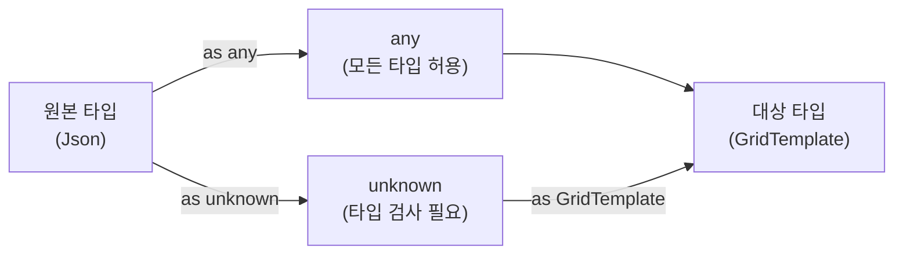
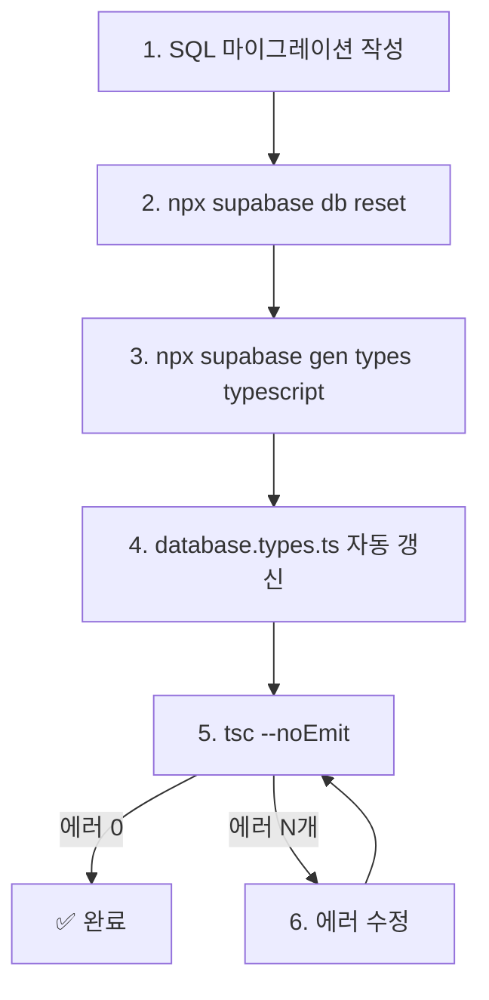

# Supabase TypeScript 타입 안전성 가이드

> **교육 목적**: Supabase + TypeScript 프로젝트에서 `as any` 남용을 방지하고,
> DB 스키마와 프론트엔드 타입을 자동으로 동기화하는 방법을 다룹니다.

---

## 1. 왜 `as any`가 생기는가?

### 문제 상황

Supabase JS SDK는 `createClient()`로 생성한 클라이언트를 통해 DB를 조회합니다:

```typescript
// ❌ 타입 없이 사용 — data의 타입은 `any`
const { data } = await supabase
  .from("broadcast_sessions")
  .select("*");

// data: any[] — TypeScript가 컬럼 정보를 모름
```

TypeScript는 DB 스키마를 알 수 없으므로, `data`의 타입을 `any`로 추론합니다.
개발자는 이를 해결하려고 **두 가지 안티패턴** 중 하나를 사용합니다:

```typescript
// 안티패턴 1: supabase 자체를 any로 캐스팅
const { data } = await (supabase as any)
  .from("broadcast_sessions")
  .select("*");

// 안티패턴 2: 결과를 any로 캐스팅
const sessions = data as any as BroadcastSession[];
```

### 왜 위험한가?

| 위험 | 설명 |
|------|------|
| **컬럼명 오타** | `status` → `statsu` 오타를 TypeScript가 못 잡음 |
| **삭제된 컬럼 참조** | DB에서 컬럼 삭제 후에도 코드에서 사용 가능 (런타임 에러) |
| **타입 불일치** | `number` 컬럼을 `string`으로 사용해도 에러 안 남 |
| **자동완성 불가** | IDE에서 컬럼명/메서드 자동완성이 작동하지 않음 |

> [!CAUTION]
> `as any`는 TypeScript의 **타입 검사를 완전히 무력화**합니다.
> 37개였던 `as any`가 시간이 지나면서 **177개**로 증식한 것이 실제 사례입니다.

---

## 2. 해결: Supabase 자동 타입 생성

### 핵심 명령어

```bash
# supabase 폴더에서 실행 (로컬 DB 기준)
npx supabase gen types typescript --local > src/lib/database.types.ts
```

이 명령은 로컬 Supabase DB의 스키마를 분석하여 **TypeScript 타입을 자동 생성**합니다.

### 생성되는 파일 구조

```typescript
// database.types.ts (자동 생성, ~1,200줄)

export type Json = string | number | boolean | null | { [key: string]: Json } | Json[];

export type Database = {
  public: {
    Tables: {
      broadcast_sessions: {
        Row: {     // SELECT 결과 타입
          id: string;
          title: string;
          status: string | null;        // DB에서 nullable
          timeline_data: Json | null;   // JSONB → Json 타입
          created_at: string | null;
          // ...
        };
        Insert: {  // INSERT 시 필요한 타입 (필수/선택 구분)
          id?: string;        // DEFAULT gen_random_uuid() → 선택
          title: string;      // NOT NULL → 필수
          status?: string;    // DEFAULT 'draft' → 선택
          // ...
        };
        Update: {  // UPDATE 시 타입 (모두 선택)
          id?: string;
          title?: string;
          status?: string;
          // ...
        };
      };
      // ... 모든 테이블
    };
  };
};
```

### createClient에 타입 적용

```typescript
// src/lib/supabase.ts
import { createClient } from "@supabase/supabase-js";
import type { Database } from "./database.types";

// ✅ Database 제네릭 적용 — 모든 .from() 호출에 타입 자동 추론
export const supabase = createClient<Database>(supabaseUrl, supabaseAnonKey);
```

적용 후 효과:

```typescript
// ✅ 타입 안전 — data: BroadcastSession[] 자동 추론
const { data } = await supabase
  .from("broadcast_sessions")  // ← 테이블명 자동완성
  .select("*");

// data 의 각 항목은 Row 타입으로 자동 추론됨
data?.[0].title;           // ✅ string
data?.[0].nonExistent;     // ❌ 컴파일 에러 (존재하지 않는 컬럼)
```

---

## 3. DB 타입 ↔ 앱 타입 간극 해소

### 문제: `Json` vs 구체 타입

Supabase 자동 생성 타입에서 `JSONB` 컬럼은 항상 `Json` 타입으로 추론됩니다:

```typescript
// DB 타입 (자동 생성)
type Row = {
  template_data: Json;  // JSONB → Json (generic)
};

// 앱 타입 (수동 정의)
interface GridTemplate {
  name: string;
  canvas: { width: number; height: number };
  zones: Zone[];
}
```

`Json`은 범용 타입이므로, 앱에서 사용하는 구체 타입(`GridTemplate`)과 호환되지 않습니다.

### 해결: 안전한 캐스팅 전략

```typescript
// ❌ 위험: as any
const template = data.template_data as any as GridTemplate;

// ⚠️ 괜찮음: as unknown as (의도를 명시적으로 표현)
const template = data.template_data as unknown as GridTemplate;

// ✅ 최선: 런타임 검증 + 캐스팅
function parseGridTemplate(json: Json): GridTemplate {
  const obj = json as Record<string, unknown>;
  if (!obj.name || !obj.canvas || !obj.zones) {
    throw new Error("Invalid GridTemplate data");
  }
  return obj as unknown as GridTemplate;
}
```

### `as unknown as` vs `as any` 차이



| 방식 | 안전성 | 의미 |
|------|--------|------|
| `as any` | ❌ 없음 | "타입 검사를 무시하겠다" |
| `as unknown as Type` | ⚠️ 부분 | "이 타입 변환은 의도적이다" (검색 가능) |
| 런타임 검증 | ✅ 완전 | "데이터 형태를 실제로 확인한다" |

> [!TIP]
> `as unknown as Type`은 코드 검색이 쉽고, 변환 의도가 명확합니다.
> 프로젝트 전체를 `grep "as unknown as"` 하면 모든 DB↔앱 타입 변환 지점을 찾을 수 있습니다.

---

## 4. Nullable 불일치 문제

### 원인

DB 컬럼의 `DEFAULT` 값이 있어도, Supabase 타입 생성기는 `null` 허용으로 타입을 만듭니다:

```sql
-- DB 정의
status TEXT DEFAULT 'draft'  -- NOT NULL 아님 → nullable
```

```typescript
// 자동 생성 타입
status: string | null;  // null 포함

// 앱 타입 (수동 정의)
status: SessionStatus;  // null 미포함
```

### 해결 방법

**방법 1: DB 스키마에서 `NOT NULL` 추가** (권장)

```sql
ALTER TABLE broadcast_sessions
  ALTER COLUMN status SET NOT NULL;
-- 이후 타입 재생성 시 `status: string` (null 제외)
```

**방법 2: 앱 타입을 nullable로 조정**

```typescript
interface BroadcastSession {
  status: SessionStatus | null;  // DB와 일치
}
```

**방법 3: 쿼리 결과에서 필터링**

```typescript
const sessions = data
  .filter((s): s is typeof s & { status: SessionStatus } => s.status !== null);
```

---

## 5. 실무 적용 워크플로우

### 마이그레이션 → 타입 재생성 → 검증



### 타입 생성 명령어 정리

```bash
# 로컬 DB 기준 타입 생성
npx supabase gen types typescript --local > src/lib/database.types.ts

# 리모트(프로덕션) DB 기준 타입 생성
npx supabase gen types typescript --project-id YOUR_PROJECT_ID > src/lib/database.types.ts

# database.types.ts 첫 2줄에 CLI 출력이 섞일 수 있음 — 수동 확인 필요
```

> [!IMPORTANT]
> **마이그레이션을 적용한 후에 타입을 재생성**해야 합니다.
> 순서가 바뀌면 구버전 스키마로 타입이 생성됩니다.

---

## 6. 프로젝트 적용 사례 (WebCG-K)

### Before (177개 `as any`)

```typescript
// 24개 파일에서 반복
const { data } = await (supabase as any)
  .from("broadcast_sessions")
  .select("*");
const session = data[0] as any;
session.title;  // any — 오타 감지 불가
```

### After (`as any` → 0개)

```typescript
// createClient<Database>() 이미 적용된 상태
const { data } = await supabase
  .from("broadcast_sessions")   // ← 자동완성
  .select("*");

// data의 타입이 자동 추론됨
const session = data?.[0];
session?.title;  // string — 오타 시 컴파일 에러

// JSONB 컬럼은 as unknown as 로 명시적 변환
const playhead = session?.playhead_state as unknown as PlayheadState;
```

### 수치 비교

| 지표 | Before | After |
|------|--------|-------|
| `as any` 개수 | 177개 / 33파일 | ~30개 / routeTree.gen.ts만 |
| IDE 자동완성 | ❌ | ✅ |
| 컬럼명 오타 감지 | ❌ | ✅ |
| 삭제 컬럼 감지 | ❌ | ✅ |
| DB 스키마 변경 영향 | 런타임 에러 | 컴파일 에러 |

---

## 부록: CHECK 제약과 TypeScript 연동

DB CHECK 제약과 TypeScript 타입이 일치하지 않으면 **양쪽에서 버그**가 발생합니다:

```sql
-- DB: 'ended' 누락 버그
CHECK (status IN ('draft', 'ready', 'live', 'completed'))
```

```typescript
// 앱: 'ended' 사용
type SessionStatus = "draft" | "ready" | "live" | "ended" | "completed";
```

코드에서 `status: "ended"`로 업데이트하면 **DB CHECK에서 거부**됩니다.
이 버그는 이번 Phase 32에서 수정했습니다:

```sql
-- 수정: 'ended' 추가
ALTER TABLE broadcast_sessions DROP CONSTRAINT IF EXISTS broadcast_sessions_status_check;
ALTER TABLE broadcast_sessions
  ADD CONSTRAINT broadcast_sessions_status_check
  CHECK (status IN ('draft', 'ready', 'live', 'ended', 'completed'));
```
