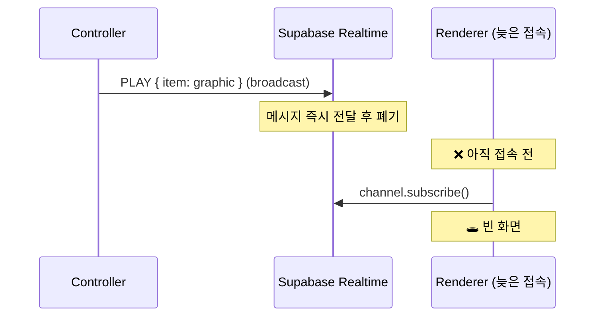
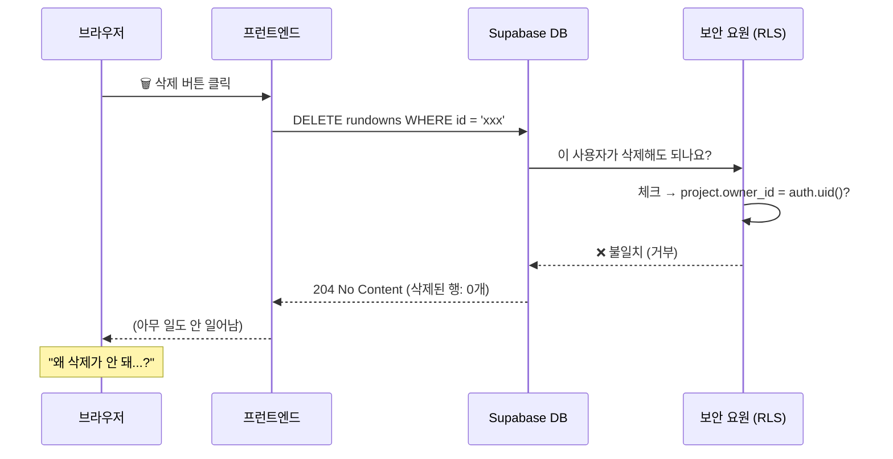

# WebCG-K 트러블슈팅 & 해결 사례

> 프로젝트 개발 중 발생한 주요 버그, 근본 원인 분석, 해결 방법을 기록합니다.
> **날짜 역순**으로 정렬합니다.

---

## 📑 목차

| # | 날짜 | 문제 | 핵심 원인 |
|---|------|------|----------|
| 0 | 2026-02-12 | [렌더러 송출 중지 후에도 그래픽 유지](#0-렌더러-송출-중지-후에도-그래픽-유지-2026-02-12) | RLS가 `ended` row 필터링 → postgres_changes 미수신 |
| 1 | 2026-02-12 | [렌더러 타임라인 그래픽 미표시](#1-렌더러-타임라인-그래픽-미표시-2026-02-12) | Realtime Broadcast fire-and-forget |
| 2 | 2026-02-11 | [렌더러 오버레이 미표시](#2-렌더러-오버레이-미표시-2026-02-11) | 렌더러에 오버레이 코드 누락 |
| 3 | 2026-02-11 | [AI 위자드 리마운트 초기화](#3-ai-위자드-리마운트-초기화-2026-02-11) | Auth 갱신 → 라우트 리렌더 |
| 4 | 2026-02-11 | [드롭다운 다크모드 깨짐](#4-드롭다운-다크모드-깨짐-2026-02-11) | 네이티브 select/option 미스타일 |
| 5 | 2026-02-11 | [Realtime DELETE 이벤트 미수신](#5-realtime-delete-이벤트-미수신-2026-02-11) | Column filter + old record |
| 6 | 2026-02-08 | [큐시트 삭제 실패 (조용한 거부)](#6-큐시트-삭제-실패-조용한-거부-2026-02-08) | RLS 정책 + Supabase 204 응답 |

---

## 0. 렌더러 송출 중지 후에도 그래픽 유지 (2026-02-12)

### 증상
컨트롤러에서 송출을 중지했는데도 렌더러 화면에 타임라인 그래픽과 오버레이가 계속 표시됨.

### 근본 원인

렌더러 공개 접근을 위한 RLS 정책이 `status = 'live'`인 row만 SELECT를 허용하도록 설정됨.
송출 중지 시 `status → 'ended'`로 변경되면, **변경된 row가 RLS를 통과하지 못하여** `postgres_changes` 이벤트가 비인증 렌더러에 전달되지 않음.

```
RLS 정책: status = 'live' → SELECT 허용
status 변경: 'live' → 'ended'
postgres_changes: ended row는 RLS 불통과 → 이벤트 미수신
렌더러: isLive가 true로 유지 → 그래픽 계속 표시
```

### 해결

Broadcast 채널의 `STOP` 이벤트(RLS와 무관)에서 `isLive = false`를 설정하여 우회:

```typescript
// render.tsx, render/$sessionId.tsx
} else if (data.action === "STOP") {
  setIsLive(false);  // Broadcast 경유 — RLS 무관
  setActiveGraphic(null);
}
```

### 교훈
> **RLS 기반 `postgres_changes`는 상태 전환 시 "도착"과 "출발" 중 하나만 보인다.**
> `status = 'live'` 정책 하에서는 `draft → live` 전환은 감지되지만, `live → ended` 전환은 감지 불가.
> 양방향 전환이 필요한 경우 Realtime Broadcast 채널을 병행해야 한다.

---

## 1. 렌더러 타임라인 그래픽 미표시 (2026-02-12)

### 증상
컨트롤러에서 PGM 송출 중인 타임라인 그래픽이, **송출 중에 열린 렌더러 페이지에서 보이지 않음**.
오버레이 그래픽은 정상 작동.

### 근본 원인

타임라인 그래픽과 오버레이 그래픽이 **서로 다른 동기화 메커니즘**을 사용하기 때문:

| | 타임라인 ❌ | 오버레이 ✅ |
|---|---|---|
| **동기화** | Realtime Broadcast (fire-and-forget) | Postgres Changes (DB CDC) |
| **상태 영속화** | 채널에 저장 안 됨 | `overlay_state` 테이블 |
| **초기 로드** | ❌ 없음 (`useState(null)` 그대로) | ✅ `loadActiveOverlays()` DB 쿼리 |

> [!IMPORTANT]
> Supabase Realtime Broadcast는 메시지를 **저장하지 않는다**. 구독 전에 발행된 메시지는 수신 불가.
> 렌더러가 늦게 접속하면 이전 `PLAY` 이벤트를 받을 수 없어 빈 화면이 된다.



### 해결

렌더러 초기화 시 `broadcast_sessions.playhead_state`에서 현재 PGM 상태를 DB 조회하여 복원:

```typescript
// render/$sessionId.tsx, render.tsx
useEffect(() => {
  const { data } = await supabase
    .from("broadcast_sessions")
    .select("status, playhead_state, timeline_data")
    .eq("id", sessionId).single();

  // 세션이 live이고 pgmBlockId가 있으면 즉시 복원
  if (data.status === "live" && data.playhead_state?.pgmBlockId) {
    const block = data.timeline_data.find(b => b.id === pgmBlockId);
    setActiveGraphic({ id: block.id, name: block.name, sourceData: block.data });
  }
}, [sessionId]);
```

> [!TIP]
> 타임라인과 오버레이가 왜 다른 동기화 방식을 사용하는지에 대한 상세 분석은
> [`docs/REALTIME_SYNC_ARCHITECTURE.md`](file:///home/genk/2026-study/2026.WebCg-K/docs/REALTIME_SYNC_ARCHITECTURE.md) 참조.

### 수정 파일
- [`render/$sessionId.tsx`](file:///home/genk/2026-study/2026.WebCg-K/webcg-k/src/routes/render/$sessionId.tsx) — 초기 PGM 상태 DB 복원 `useEffect` 추가
- [`render.tsx`](file:///home/genk/2026-study/2026.WebCg-K/webcg-k/src/routes/render.tsx) — 동일 로직 적용

### 핵심 교훈
- **Realtime Broadcast는 상태(state)가 아니라 이벤트(event)를 전달한다** → 현재 상태가 필요하면 반드시 DB에서 별도 조회
- 이미 컨트롤러가 `savePlayheadState()`로 DB에 영속화 중이었으므로, 읽기만 추가하면 됨

---

## 2. 렌더러 오버레이 미표시 (2026-02-11)

### 증상
오버레이가 컨트롤러 PGM 모니터에는 표시되나, **최종 렌더러 화면** (`/render?sessionId=...`)에는 전혀 표시되지 않음.

### 근본 원인

렌더러 라우트가 **두 개** 존재하며, 실제 사용되는 라우트에 오버레이 코드가 없었음:

| 라우트 | URL | 오버레이 |
|--------|-----|---------|
| `render.tsx` | `/render?sessionId=...` (쿼리) | ❌ **코드 없음** |
| `render/$sessionId.tsx` | `/render/SESSION_ID` (경로) | 커스텀 구현 (불완전) |

컨트롤러가 생성하는 렌더러 URL은 **쿼리 파라미터 방식**이므로 `render.tsx`가 사용되는데, 이 파일에 오버레이 관련 코드가 전혀 없었다.

### 해결

PGM 모니터에서 검증된 `OverlayPlayoutLayer` 컴포넌트를 두 렌더러 모두에 적용:

```diff
// render.tsx
+ import { OverlayPlayoutLayer } from "../components/Controller/OverlayPlayoutLayer";

  {/* 캔버스 내부 */}
+ {sessionId && <OverlayPlayoutLayer sessionId={sessionId} />}
```

`render/$sessionId.tsx`도 커스텀 오버레이 로직 전면 제거 → `OverlayPlayoutLayer` 통합으로 373행 → ~200행 간소화.

### 수정 파일
- [`render.tsx`](file:///home/genk/2026-study/2026.WebCg-K/webcg-k/src/routes/render.tsx) — OverlayPlayoutLayer 추가
- [`render/$sessionId.tsx`](file:///home/genk/2026-study/2026.WebCg-K/webcg-k/src/routes/render/$sessionId.tsx) — 리팩터

### 핵심 교훈
- **동일 기능의 라우트가 2개 있으면, 실제로 어떤 라우트가 사용되는지 반드시 추적**해야 한다
- 컴포넌트를 공유하면 (`OverlayPlayoutLayer`) 양쪽 모두 동일 동작을 보장할 수 있다

---

## 3. AI 위자드 리마운트 초기화 (2026-02-11)

### 증상
AI 위자드에서 프롬프트 입력 후 AI 응답 대기 중, **다른 탭 새로고침** → 위자드가 **1단계(그리드 선택)로 초기화**됨. AI 응답도 소멸.

### 근본 원인

```
다른 탭 새로고침
  → Supabase Auth 세션 갱신 이벤트 발생
  → useAuth() 상태 변경
  → 라우트 리렌더링
  → OverlayCreationWizard 컴포넌트 언마운트 → 재마운트
  → 모든 useState 초기화 (step=1, grid=null, prompt="")
  → 진행 중인 AI 요청 Promise 참조 소멸
```

### 해결

모듈 스코프 변수 `_wizardBackup`에 전체 위자드 상태를 자동 백업/복원:

```
┌─────────────────────────────────────────┐
│  Module Scope (_wizardBackup)           │
│  step, grid, zones, prompt, variations  │
│  _pendingGeneration (Promise)           │
│  TTL: 5분                               │
└──────────────┬──────────────────────────┘
               │ useEffect로 동기화
┌──────────────▼──────────────────────────┐
│  Component State (useState)             │
│  마운트 시 백업에서 복원                   │
│  언마운트돼도 백업은 유지                  │
└─────────────────────────────────────────┘
```

| 보존 대상 | 동작 |
|-----------|------|
| step / grid / zone / prompt / variations | 리마운트 시 자동 복원 |
| 진행 중인 AI 생성 요청 | `_pendingGeneration` Promise 보존 → 리마운트 후 결과 수신 |
| 위자드 닫기 (X / 배경 클릭) | `handleClose()`로 백업 + Promise 자동 클리어 |
| 5분 이상 경과 시 | 오래된 백업 폐기 |

### 수정 파일
- [`OverlayCreationWizard.tsx`](file:///home/genk/2026-study/2026.WebCg-K/webcg-k/src/components/Overlay/OverlayCreationWizard.tsx)

### 핵심 교훈
- **Supabase Auth 이벤트는 모든 탭에서 공유된다** → 한 탭의 새로고침이 다른 탭 컴포넌트에 영향
- React `useState`는 언마운트 시 사라지므로, **장기 프로세스의 상태는 모듈 스코프에 보존**해야 한다

---

## 4. 드롭다운 다크모드 깨짐 (2026-02-11)

### 증상
네이티브 `<select>` / `<option>` 요소가 다크모드에서 **하얀 배경 + 하얀 글자**로 표시.

### 근본 원인
네이티브 폼 요소는 CSS 커스텀 속성이 자동 상속되지 않음. 명시적 스타일링 필요.

### 해결

```css
/* styles.css */
select {
  background: var(--glass-bg, #1a1a2e);
  color: var(--text-primary, #e0e0e0);
  border: 1px solid var(--glass-border);
}
option {
  background: var(--bg-secondary, #1e1e2e);
  color: var(--text-primary, #e0e0e0);
}
```

### 수정 파일
- [`styles.css`](file:///home/genk/2026-study/2026.WebCg-K/webcg-k/src/styles.css)

---

## 5. Realtime DELETE 이벤트 미수신 (2026-02-11)

### 증상
오버레이를 삭제(DB에서 row 제거)해도 PGM 모니터에서 오버레이가 사라지지 않음.

### 근본 원인

두 가지 문제가 동시에 존재:

**문제 1: Column Filter + DELETE 이벤트 비호환**

```typescript
// ❌ 문제: column filter가 DELETE에서 작동하지 않음
.on("postgres_changes", {
  event: "*",
  table: "overlay_state",
  filter: `session_id=eq.${sessionId}`,  // DELETE 시 old record를 참조할 수 없음
}, callback)
```

> [!WARNING]
> Supabase Realtime의 `postgres_changes`에서 column filter는 **INSERT/UPDATE의 new record**만 검사한다.
> **DELETE 이벤트는 old record를 참조할 수 없어** filter에 걸리지 않고 무시된다.

**문제 2: PVW/PGM 채널명 충돌**

```
PVW용 채널: playout-overlay:${sessionId}
PGM용 채널: playout-overlay:${sessionId}  ← 동일!
→ 하나의 채널에 두 구독이 충돌
```

### 해결

```typescript
// ✅ 수정 1: column filter 제거 → 콜백에서 sessionId 필터링
.on("postgres_changes", {
  event: "*",
  schema: "public",
  table: "overlay_state",
  // filter 없음 — DELETE도 수신 가능
}, () => { loadActiveOverlays(); })

// ✅ 수정 2: mode별 고유 채널명
const channelName = `playout-overlay-${mode}:${sessionId}`;
```

### 수정 파일
- [`OverlayPlayoutLayer.tsx`](file:///home/genk/2026-study/2026.WebCg-K/webcg-k/src/components/Controller/OverlayPlayoutLayer.tsx) — 채널명 분리, 필터 제거, deps 수정

### 핵심 교훈
- **Supabase Realtime column filter는 DELETE에서 작동하지 않는다** → DELETE를 수신해야 하면 filter를 제거하고 콜백에서 필터링
- **같은 채널명으로 여러 구독을 만들면 충돌한다** → 용도별 고유 접두사 사용

---

## 6. 큐시트 삭제 실패 — 조용한 거부 (2026-02-08)

### 증상
큐시트 목록에서 삭제 버튼(🗑️)을 눌러도 큐시트가 사라지지 않음. 에러 메시지도 없음.

### 근본 원인

RLS 정책이 삭제를 **조용히 거부**하고, 프런트엔드가 이를 감지하지 못함.



> [!IMPORTANT]
> Supabase는 보안상 이유로 "권한 없음"이라고 알려주지 않는다.
> 대신 "해당되는 행이 없습니다"처럼 행동한다.
> 이렇게 하면 해커가 데이터 존재 여부 자체를 알 수 없게 된다.

#### 두 가지 원인 시나리오

| 시나리오 | 설명 |
|----------|------|
| **A. DB 초기화 후 세션 불일치** | `db reset` 후 DB의 사용자 데이터가 사라졌지만, 브라우저에는 이전 세션이 남아있음 |
| **B. created_by ≠ project.owner_id** | 기존 정책은 "프로젝트 소유자"만 삭제 허용. "큐시트 생성자" 본인이라도 프로젝트 소유자가 아니면 삭제 불가 |

### 해결

**1. RLS 정책 보강 — "큐시트 생성자도 삭제 가능" 조건 추가:**

```sql
CREATE POLICY "Users can delete own rundowns" ON rundowns
  FOR DELETE USING (
    -- 프로젝트 소유자인 경우
    EXISTS (
      SELECT 1 FROM projects
      WHERE projects.id = rundowns.project_id
      AND projects.owner_id = auth.uid()
    )
    OR
    -- 큐시트 생성자 본인인 경우 ← 신규 추가
    created_by = auth.uid()
  );
```

**2. 프런트엔드 에러 감지 강화 — `count: exact`로 실제 삭제 여부 확인:**

```diff
  const deleteMutation = useMutation({
      mutationFn: async (id: string) => {
-        const { error } = await supabase
-            .from("rundowns").delete().eq("id", id);
+        const { error, count } = await supabase
+            .from("rundowns")
+            .delete({ count: "exact" })   // ← 삭제된 행 수 요청
+            .eq("id", id);
          if (error) throw error;
+        if (count === 0)
+            throw new Error("삭제 권한이 없거나 이미 삭제된 큐시트입니다.");
      },
+    onError: (error) => {
+        alert(`삭제 실패: ${error.message}`);
+    },
  });
```

### 수정 파일
- `supabase/migrations/202602080001_rundowns_delete_policy_fix.sql` — RLS 삭제 정책에 `created_by` 조건 추가
- [`rundowns/index.tsx`](file:///home/genk/2026-study/2026.WebCg-K/webcg-k/src/routes/dashboard/rundowns/index.tsx) — 삭제 mutation에 `count: exact` 검증 + 에러 알림

### 핵심 교훈
1. **Supabase DELETE는 조용히 실패할 수 있다** → `{ count: "exact" }` 옵션으로 실제 삭제 여부 확인 필수
2. **RLS 정책은 "누가 만들었는가"와 "누가 소유한 프로젝트인가"를 구분**해야 함
3. **DB 초기화 후에는 브라우저 세션도 함께 초기화** (로그아웃 → 재로그인) 필요

---

## 부록: Supabase 함정 체크리스트

프로젝트에서 반복적으로 발견된 Supabase 관련 함정을 정리합니다.

### DELETE 관련
- [ ] `DELETE` 후 `count: exact`로 실제 삭제 여부 확인하는가?
- [ ] RLS 정책이 `created_by`와 `owner_id`를 모두 고려하는가?

### Realtime 관련
- [ ] `postgres_changes`에서 column filter를 사용할 때 DELETE 이벤트도 수신 가능한가?
- [ ] 같은 테이블에 여러 구독을 만들 때 채널명이 고유한가?
- [ ] Broadcast(fire-and-forget) 방식 사용 시, 늦게 접속하는 클라이언트를 위한 초기 상태 로드가 있는가?

### Auth 관련
- [ ] `db reset` 후 브라우저 세션 초기화 절차가 있는가? (`?reset` 파라미터 또는 `Ctrl+Shift+K`)
- [ ] Auth 갱신 이벤트가 다른 컴포넌트에 리렌더링을 일으키는지 확인했는가?
- [ ] 장기 실행 프로세스(AI 생성 등)의 상태가 리마운트에 안전한가?

### Storage 관련
- [ ] `db reset` 후 Storage 버킷이 재생성되는가? (마이그레이션에 `storage.buckets` INSERT 포함?)
- [ ] Storage RLS 정책이 authenticated 사용자에게 읽기/쓰기를 허용하는가?
