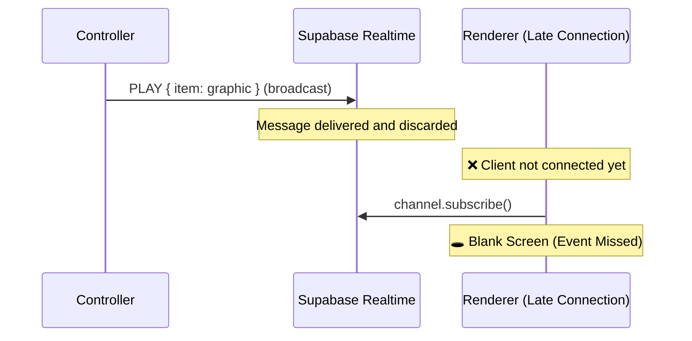
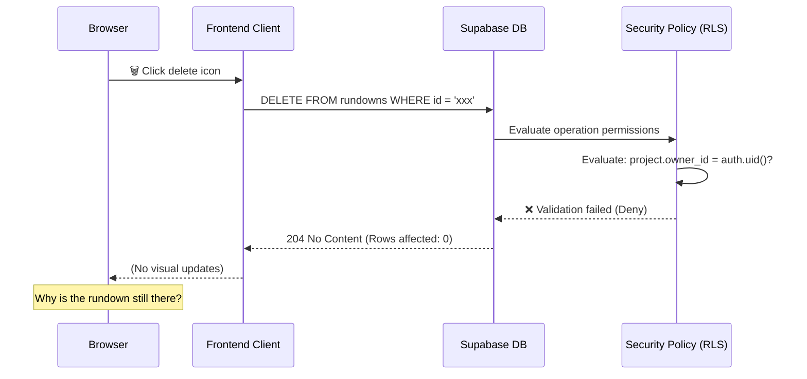

# WebCG-K Troubleshooting & Resolution Case Studies

> Records major bugs encountered during development, root-cause analyses, and technical resolutions.
> Sorted in **reverse chronological order**.

---

## 📑 Table of Contents

| # | Date | Problem | Core Cause |
|---|------|---------|------------|
| 0 | 2026-02-12 | [Graphics Retained After Playout Stop](#0-graphics-retained-after-playout-stop-2026-02-12) | RLS filters "ended" rows ➔ `postgres_changes` event not received |
| 1 | 2026-02-12 | [Timeline Graphics Not Rendering](#1-timeline-graphics-not-rendering-2026-02-12) | Realtime Broadcast fire-and-forget logic |
| 2 | 2026-02-11 | [Overlay Graphics Not Rendering](#2-overlay-graphics-not-rendering-2026-02-11) | Missing overlay rendering logic in renderer |
| 3 | 2026-02-11 | [AI Wizard Reset on Remount](#3-ai-wizard-reset-on-remount-2026-02-11) | Auth token renewals trigger route rerenders |
| 4 | 2026-02-11 | [Dropdown Dark Mode Styling Failure](#4-dropdown-dark-mode-styling-failure-2026-02-11) | Unstyled native select/option elements |
| 5 | 2026-02-11 | [Realtime DELETE Event Not Received](#5-realtime-delete-event-not-received-2026-02-11) | Column filter clashes with old records |
| 6 | 2026-02-08 | [Cuesheet Deletion Failure (Silent Denial)](#6-cuesheet-deletion-failure-silent-denial-2026-02-08) | RLS policy triggers Supabase 204 response |

---

## 0. Graphics Retained After Playout Stop (2026-02-12)

### Symptom
When the operator stops a playout session in the Controller, timeline graphics and overlays continue to display indefinitely on the live OBS Renderer screen.

### Root Cause
The database Row-Level Security (RLS) policy governing anonymous renderer read access was configured to permit `SELECT` operations only when `status = 'live'`.
When playout stops, the database updates the session record to `status = 'ended'`. Because the modified record **fails RLS validation rules post-update**, the subsequent `postgres_changes` event is blocked and never transmitted to the unauthenticated renderer client.

```
RLS Policy: status = 'live' ➔ SELECT Allowed
Status transition: 'live' ➔ 'ended'
postgres_changes: ended row fails RLS checks ➔ Event not transmitted
Renderer Client: isLive remains true ➔ Graphics continue rendering
```

### Resolution
Bypassed the RLS limitation by handling session termination via a dedicated `STOP` action transmitted over the Realtime Broadcast channel (which operates independently of DB RLS policies):

```typescript
// render.tsx, render/$sessionId.tsx
} else if (data.action === "STOP") {
  setIsLive(false);  // Triggered via Broadcast channel — independent of RLS
  setActiveGraphic(null);
}
```

### Mentoring Lesson
> **RLS-secured `postgres_changes` events only capture one end of state transitions.**
> Under a `status = 'live'` RLS policy, the transition from `draft ➔ live` is captured successfully, but transitions from `live ➔ ended` are completely blocked from external delivery.
> When bidirectional transitions must be tracked, integrate Realtime Broadcast channels alongside DB change notifications.

---

## 1. Timeline Graphics Not Rendering (2026-02-12)

### Symptom
While timeline graphics show as playing on the PGM monitor in the Studio Controller, they fail to render on OBS Renderer pages loaded **after** the playout session has already started. Overlay graphics continue to operate normally.

### Root Cause
Timeline graphics and overlay graphics utilize **entirely different synchronization architectures**:

| Feature | Timeline ❌ | Overlay ✅ |
|---|---|---|
| **Sync Type** | Realtime Broadcast (fire-and-forget) | Postgres Changes (DB CDC) |
| **State Persistence** | Transient (not saved in channel) | Persistent (`overlay_state` table) |
| **Bootstrap Load** | ❌ None (defaults to `useState(null)`) | ✅ DB query `loadActiveOverlays()` on mount |

> [!IMPORTANT]
> Supabase Realtime Broadcast channels are **ephemeral and stateless**. Messages transmitted prior to client connection are lost.
> If the renderer connects to the session late, it misses the initial `PLAY` event and displays a blank screen.



### Resolution
Restored active playout states upon renderer load by querying `broadcast_sessions.playhead_state` to bootstrap active PGM blocks:

```typescript
// render/$sessionId.tsx, render.tsx
useEffect(() => {
  const fetchInitialState = async () => {
    const { data } = await supabase
      .from("broadcast_sessions")
      .select("status, playhead_state, timeline_data")
      .eq("id", sessionId).single();

    // If session is active and pgmBlockId is defined, bootstrap immediately
    if (data.status === "live" && data.playhead_state?.pgmBlockId) {
      const block = data.timeline_data.find(b => b.id === pgmBlockId);
      setActiveGraphic({ id: block.id, name: block.name, sourceData: block.data });
    }
  };
  fetchInitialState();
}, [sessionId]);
```

> [!TIP]
> For a detailed architectural layout comparing timeline and overlay sync pipelines, refer to **[REALTIME_SYNC_ARCHITECTURE.md](./REALTIME_SYNC_ARCHITECTURE.md)**.

### Modified Files
- **[`render/$sessionId.tsx`](file:///home/genk/topProject/webcg-k/webcg-k/src/routes/render/$sessionId.tsx)** — Injected initial PGM state bootstrap `useEffect`.
- **[`render.tsx`](file:///home/genk/topProject/webcg-k/webcg-k/src/routes/render.tsx)** — Mirrored bootstrap logic.

### Key Lesson
* **Realtime Broadcast streams events, not states.** If the active state is required for initialization, bootstrap by querying database tables.
* Since the Controller was already persisting playhead changes via `savePlayheadState()`, resolving the issue only required implementing the matching read query on the Renderer side.

---

## 2. Overlay Graphics Not Rendering (2026-02-11)

### Symptom
Overlay graphics render correctly on the PGM monitor inside the Controller but fail completely on the actual on-air OBS Renderer screen (`/render?sessionId=...`).

### Root Cause
Two separate Renderer routes existed, and the route actively targeted by playout links lacked overlay components:

| Route File | Target URL | Overlay Logic |
|---|---|---|
| `render.tsx` | `/render?sessionId=...` (Query param) | ❌ **Missing completely** |
| `render/$sessionId.tsx` | `/render/SESSION_ID` (Path param) | Incomplete manual implementation |

Since the links generated by the Controller utilized query parameters, clients loaded `render.tsx` which had no code to handle overlay layers.

### Resolution
Unified playout rendering by importing and mounting the verified `OverlayPlayoutLayer` component on both routes:

```diff
// render.tsx
+ import { OverlayPlayoutLayer } from "../components/Controller/OverlayPlayoutLayer";

  {/* Outer Canvas Wrap */}
+ {sessionId && <OverlayPlayoutLayer sessionId={sessionId} />}
```

Removed the manual overlay handlers from `render/$sessionId.tsx` and refactored the file to consume the unified `OverlayPlayoutLayer`, shrinking the codebase from 373 lines down to ~200.

### Modified Files
- **[`render.tsx`](file:///home/genk/topProject/webcg-k/webcg-k/src/routes/render.tsx)** — Injected `OverlayPlayoutLayer`.
- **[`render/$sessionId.tsx`](file:///home/genk/topProject/webcg-k/webcg-k/src/routes/render/$sessionId.tsx)** — Refactored to leverage unified component.

### Key Lesson
* When multiple routing patterns serve the same logical view, explicitly map which route handles active production traffic.
* Encapsulating logic inside shared sub-components (`OverlayPlayoutLayer`) guarantees feature parity across all entry points.

---

## 3. AI Wizard Reset on Remount (2026-02-11)

### Symptom
While waiting for the Gemini API to return generated graphics in Step 3 of the AI Wizard, refreshing a separate browser tab instantly resets the wizard back to Step 1 (Grid Selection), destroying the pending prompt request and its output.

### Root Cause
```
Reloading a separate browser tab
  ➔ Triggers Supabase Auth session renewal events across all tabs
  ➔ Modifies useAuth() state values
  ➔ Triggers route rerendering in active window
  ➔ Unmounts and remounts OverlayCreationWizard component
  ➔ Flushes all local useState hooks (step=1, grid=null, prompt="")
  ➔ Pending Promise reference for the AI request is destroyed
```

### Resolution
Implemented a state backup mechanism using a module-scoped variable `_wizardBackup` to preserve session integrity across component lifecycles:

```
┌─────────────────────────────────────────┐
│  Module Scope (_wizardBackup)           │
│  step, grid, zones, prompt, variations  │
│  _pendingGeneration (Promise)           │
│  TTL: 5 Minutes                         │
└──────────────┬──────────────────────────┘
               │ Synchronized via useEffect
┌──────────────▼──────────────────────────┐
│  Component State (useState)             │
│  Restored from backup on mount          │
│  State preserved post unmount           │
└─────────────────────────────────────────┘
```

| Preserved Area | Action |
|---|---|
| **Form Data** | Restored automatically from backup state on mount |
| **Pending Requests** | Resolves the preserved `_pendingGeneration` Promise and populates state post-mount |
| **Manual Discards** | `handleClose()` purges backup states and clears pending Promises |
| **Expiration** | Backup state is purged after 5 minutes of inactivity |

### Modified Files
- **[`OverlayCreationWizard.tsx`](file:///home/genk/topProject/webcg-k/webcg-k/src/components/Overlay/OverlayCreationWizard.tsx)**

### Key Lesson
* **Supabase Auth events are shared globally across all tabs.** A browser refresh in one window can easily trigger component updates in another.
* React `useState` hooks are ephemeral. For long-running asynchronous processes (such as LLM generation pipelines), back up transient states using module scopes or persistent stores to survive unmount events.

---

## 4. Dropdown Dark Mode Styling Failure (2026-02-11)

### Symptom
Native HTML `<select>` and `<option>` dropdown menus render with unreadable white text on white backgrounds when operating under dark theme mode.

### Root Cause
Native dropdown elements do not inherit CSS custom properties automatically from document classes, requiring explicit fallback styles.

### Resolution
Enforced explicit dark theme parameters directly targeting native select elements:

```css
/* styles.css */
select {
  background: var(--glass-bg, #1a1a2e);
  color: var(--text-primary, #e0e0e0);
  border: 1px solid var(--glass-border);
}
option {
  background: var(--bg-secondary, #1e1e2e);
  color: var(--text-primary, #e0e0e0);
}
```

### Modified Files
- **[`styles.css`](file:///home/genk/topProject/webcg-k/webcg-k/src/styles.css)**

---

## 5. Realtime DELETE Event Not Received (2026-02-11)

### Symptom
Deleting an overlay record from the database does not clear the active graphic overlay from the Renderer playout screen.

### Root Cause
Two distinct synchronization conflicts occurred concurrently:

**Conflict 1: Column Filters Clash with DELETE Operations**
```typescript
// ❌ Conflict: Column filters fail to evaluate on DELETE payloads
.on("postgres_changes", {
  event: "*",
  table: "overlay_state",
  filter: `session_id=eq.${sessionId}`,  // DELETE payloads lack "new" record metadata
}, callback)
```

> [!WARNING]
> Column filters inside Supabase Realtime `postgres_changes` listeners exclusively evaluate properties on **INSERT and UPDATE (`new` records)** payloads.
> Because **DELETE payloads contain no `new` record details**, the event fails the filter validation and is discarded.

**Conflict 2: Identical PVW and PGM Channel Names**
```
PVW Channel: playout-overlay:${sessionId}
PGM Channel: playout-overlay:${sessionId}  ← Duplicate names!
➔ Single socket channel gets polluted by overlapping subscriptions
```

### Resolution
Removed the column filter from the Postgres listener, shifting segment filtering directly inside the client callback, and assigned distinct channel names:

```typescript
// ✅ Resolution 1: Remove column filter and evaluate within callback
.on("postgres_changes", {
  event: "*",
  schema: "public",
  table: "overlay_state",
  // No filters — DELETE payloads are received successfully
}, () => { loadActiveOverlays(); })

// ✅ Resolution 2: Assign unique channel prefixes per mode
const channelName = `playout-overlay-${mode}:${sessionId}`;
```

### Modified Files
- **[`OverlayPlayoutLayer.tsx`](file:///home/genk/topProject/webcg-k/webcg-k/src/components/Controller/OverlayPlayoutLayer.tsx)** — Extracted mode channel scopes, removed database-level filters, and updated reactive dependencies.

### Key Lesson
* **Supabase Realtime column filters discard DELETE payloads.** When deletion events must be tracked, remove the database-level filter and execute conditional checks inside the client callback.
* **Overlapping socket channel names cause connection conflicts.** Always prefix channel strings to isolate distinct subscription flows.

---

## 6. Cuesheet Deletion Failure — Silent Denial (2026-02-08)

### Symptom
Clicking the delete icon (🗑️) on rundown items does not remove the target cuesheet row. No visual error message or stack trace is shown.

### Root Cause
The database RLS policy silently blocked the operation, and the frontend handled the response as a success.



> [!IMPORTANT]
> To shield database schemas from scanning attacks, Supabase does not return "Permission Denied" errors for failed RLS deletions.
> Instead, it returns a successful `204 No Content` payload, behaving as if the target record did not exist.

#### Root-Cause Scenarios

| Scenario | Description |
|---|---|
| **A. Session Drift Post Database Reset** | Running `db reset` flushes the local database profile tables, leaving orphaned cookies in active browser sessions. |
| **B. created_by ≠ project.owner_id** | The legacy RLS policy restricted deletion exclusively to "Project Owners". "Cuesheet Authors" who did not own the parent project had their deletion requests blocked. |

### Resolution

**1. Expand RLS Permissions — Allow Deletion for Authors:**
```sql
CREATE POLICY "Users can delete own rundowns" ON rundowns
  FOR DELETE USING (
    -- User is the Project Owner
    EXISTS (
      SELECT 1 FROM projects
      WHERE projects.id = rundowns.project_id
      AND projects.owner_id = auth.uid()
    )
    OR
    -- User is the Cuesheet Author ← Newly added
    created_by = auth.uid()
  );
```

**2. Enforce Strict Verification — Query Affected Counts:**
```diff
  const deleteMutation = useMutation({
      mutationFn: async (id: string) => {
-        const { error } = await supabase
-            .from("rundowns").delete().eq("id", id);
+        const { error, count } = await supabase
+            .from("rundowns")
+            .delete({ count: "exact" })   // ← Query exact affected row count
+            .eq("id", id);
          if (error) throw error;
+        if (count === 0)
+            throw new Error("You do not have permission to delete this rundown.");
      },
+    onError: (error) => {
+        alert(`Deletion failed: ${error.message}`);
+    },
  });
```

### Modified Files
- `supabase/migrations/202602080001_rundowns_delete_policy_fix.sql` — Injected `created_by` clauses into RLS deletion parameters.
- **[`rundowns/index.tsx`](file:///home/genk/topProject/webcg-k/webcg-k/src/routes/dashboard/rundowns/index.tsx)** — Configured mutation checks using `count: exact` and connected error banners.

### Key Lesson
1. **Supabase DELETE requests can fail silently.** Always pass `{ count: "exact" }` to verify that records were actually deleted.
2. **Differentiate permissions clearly.** Distinguish between "Record Creators" and "Parent Entity Owners" inside SQL policy checks.
3. **Flush cookies after DB changes.** Run manual logout commands or parameters (`?reset`) post-migrations squashing to prevent authentication drift.

---

## Appendix: Supabase Development Checklist

Track and avoid common database traps when designing features:

### DELETE Operations
- [ ] Pass `{ count: "exact" }` to confirm deletion occurred?
- [ ] Do RLS policies account for both creators (`created_by`) and owners (`owner_id`)?

### Realtime Subscriptions
- [ ] Does your `postgres_changes` column filter permit DELETE payloads?
- [ ] Are subscription channel names scoped uniquely across modules?
- [ ] Does your Broadcast sync pipeline include database fallback bootstrapping for late-joining clients?

### Auth Cycles
- [ ] Do operators have a clear path to purge cookies post-database resets?
- [ ] Do auth changes trigger accidental re-renders in separate tabs?
- [ ] Are long-running processes protected against component unmounts?

### Storage Buckets
- [ ] Does `db reset` rebuild required Storage buckets?
- [ ] Are Storage RLS policies configured correctly to permit authenticated operations?
