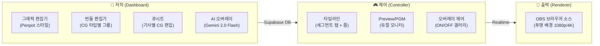
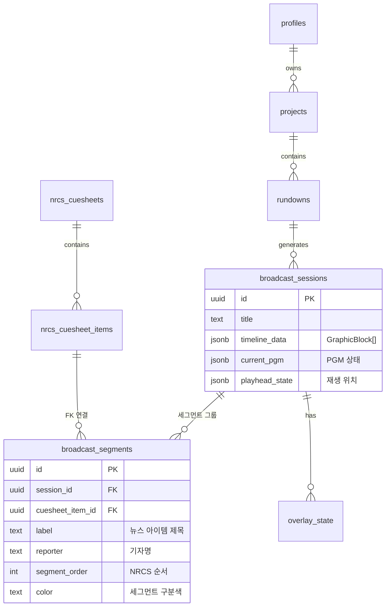
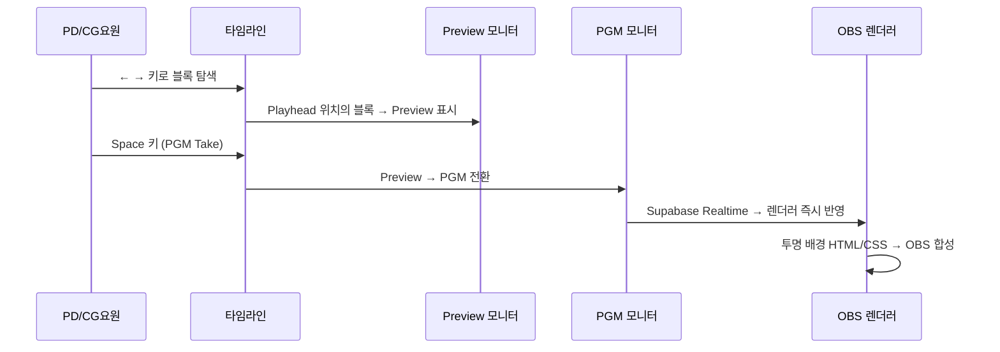
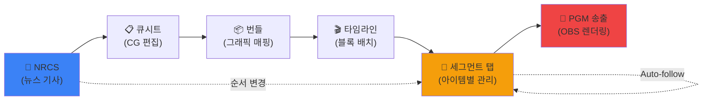
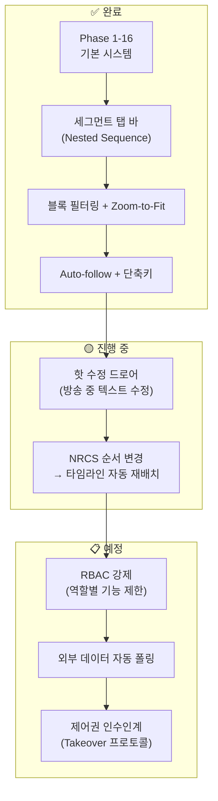
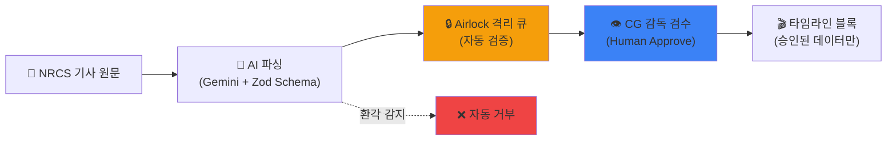

# 📺 WebCG-K 종합 기술 가이드 — 철학, 아키텍처, 차별화 전략

> **이 문서의 목적:** WebCG-K 프로젝트의 철학, 기술 구조, 타임라인 컨트롤러 사용법,
> 그리고 업계 경쟁 제품(Vizrt, Singular.live, Ross Video 등)과의 차별점을
> 다른 AI 에이전트나 협업자에게 **완전한 컨텍스트로 제공**하기 위한 종합 가이드입니다.
>
> **작성일:** 2026-04-16  
> **버전:** 2.1 (Nested Sequence Tab + ADR + Day 2 엣지케이스 방어)

---

## 1. 프로젝트 철학 — "왜 WebCG-K를 만드는가?"

### 1.1. 방송 CG 시스템의 현실

전 세계 방송국에서 사용되는 CG(Computer Graphics) 시스템은 크게 **3세대**로 나뉩니다:

| 세대 | 대표 제품 | 특징 | 문제점 |
|------|----------|------|--------|
| **1세대** (전용 HW) | Chyron, Aston | 전용 하드웨어 박스 + 독점 소프트웨어 | 수천만~수억 원, 벤더 종속 |
| **2세대** (PC 소프트웨어) | Vizrt Viz Engine, Ross XPression | Windows PC + GPU 렌더링 | 라이선스 비용, 전문 운영자 필요 |
| **3세대** (웹/클라우드) | Singular.live, Tagboard | 브라우저 기반 HTML/CSS | 방송 워크플로 통합 미흡, NRCS 연동 제한 |

### 1.2. WebCG-K의 포지셔닝

WebCG-K는 **3세대 웹 기반이면서도 2세대의 방송 전문 워크플로를 완벽히 지원**하는 하이브리드 시스템을 목표로 합니다.

```
         ┌─────────────────────────────────────────────┐
         │                       Vizrt                  │
         │ 2세대: 전문 방송 워크플로 ✅                    │
         │        웹 기반 접근 ❌                        │
    비용  ├─────────────────────────────────────────────┤
    장벽  │                                             │
    ↑    │  ⭐ WebCG-K의 목표: 이 영역                   │
         │  방송 전문 워크플로 ✅ + 웹 기반 접근 ✅         │
         │                                             │
         ├─────────────────────────────────────────────┤
         │              Singular.live                   │
         │ 3세대: 웹 기반 접근 ✅                        │
         │        방송 전문 워크플로 ❌                    │
         └─────────────────────────────────────────────┘
```

### 1.3. 4대 핵심 철학

| # | 철학 | 설명 |
|---|------|------|
| ① | **오픈 웹 표준** | 특수 플러그인/하드웨어 없이 HTML/CSS/JS만으로 방송 품질 CG 렌더링. OBS 브라우저 소스로 즉시 연결. |
| ② | **NRCS 네이티브** | 뉴스룸 시스템(NRCS)과 밀결합. 기사 한 줄 변경 → CG 자동 반영 → 타임라인 자동 재배치. 이벤트 드리븐 파이프라인. |
| ③ **Self-hosted 보안** | 방송사 내부망에서 Docker 하나로 완전 자체 운영. 클라우드 의존 zero. |
| ④ | **교육 중심** | 프로젝트 자체가 "방송 CG 시스템을 어떻게 만드는가"의 교과서. 5대 문서 체계 + 코드 주석으로 학습 가능. |

---

## 2. 시스템 아키텍처 — 전체 구조

### 2.1. 3단계 파이프라인: 저작 → 제어 → 출력

WebCG-K의 모든 데이터는 **저작(Dashboard) → 제어(Controller) → 출력(Renderer)** 3단계를 거칩니다.



### 2.2. 기술 스택

| 레이어 | 기술 | 선택 이유 |
|--------|------|----------|
| **프레임워크** | React 19 + TanStack Start + Vite | SSR 불필요(SPA), 파일 기반 라우팅으로 개발 생산성 극대화 |
| **상태 관리** | TanStack Store | React 외부에서도 읽기/쓰기 가능 → 60fps 블록 드래그 성능 확보 |
| **백엔드** | Self-hosted Supabase (Docker) | PostgreSQL + Auth + Realtime + Storage를 Docker 하나로 |
| **실시간 동기화** | Supabase Realtime (Broadcast) | 컨트롤러 → 렌더러 PGM 상태 즉시 전파 |
| **AI 생성** | Google Gemini 2.0 Flash | 자연어 → CG 디자인 자동 생성 (4단계 Wizard) |
| **스타일** | Vanilla CSS (Dark Mode) | Tailwind 의존 없이 CSS 변수로 완전한 테마 제어 |

### 2.3. 데이터베이스 핵심 엔티티



---

## 3. 타임라인 컨트롤러 — 핵심 UI 상세

### 3.1. Premiere 스타일 타임라인의 핵심 개념

WebCG-K의 타임라인은 Adobe Premiere Pro / DaVinci Resolve 같은 **NLE(Non-Linear Editor)** 패러다임을 차용합니다.

| 개념 | Premiere 대응 | WebCG-K 대응 |
|------|-------------|-------------|
| **시퀀스** | 편집 프로젝트 | 방송 세션(BroadcastSession) |
| **클립** | 비디오/오디오 파일 | 그래픽 블록(GraphicBlock) |
| **트랙** | 비디오 트랙 (V1, V2...) | CG 레이어 (배경, 자막, 긴급) |
| **플레이헤드** | 현재 프레임 위치 | 현재 송출 위치 |
| **Nested Sequence** | 서브 시퀀스 탭 | **세그먼트 탭** (뉴스 아이템별) |

### 3.2. 트랙(Z-Index) 구조

```
┌──────────────────────────────────────────────────────────┐
│ Track 3 [긴급] (최상위 Z-Index)  │ 속보 배너, 긴급 CG     │
│ Track 2 [자막] (중간)            │ 인물 이름, 뉴스 자막    │
│ Track 1 [배경] (기본)            │ 스튜디오 배경, 데이터 그래픽 │
│ 👑 Logo [로고] (항상 표시)        │ 채널 로고 (KBS ₊)      │
└──────────────────────────────────────────────────────────┘
```

- 각 트랙은 **Z-Index(렌더링 순서)**를 의미
- 동일한 시간 위치에서 여러 트랙의 블록이 **동시에 렌더링** → 레이어 합성
- 로고 트랙은 항상 최하위 레이어에 상시 표시

### 3.3. 블록(GraphicBlock) 데이터 모델

```typescript
interface GraphicBlock {
  id: string;
  name: string;           // "대통령 이름 자막"
  trackId: number;        // 소속 트랙 (Z-Index)
  startPosition: number;  // 픽셀 기반 시작 위치
  width: number;          // 블록 너비 (px)
  color: string;          // 시각적 구분색
  transitionIn: "fade" | "cut";   // 트랜지션 타입
  transitionOut: "fade" | "cut";

  // NRCS 역추적 필드
  cuesheetItemId?: string;  // 큐시트 아이템 연결
  bundleSlotId?: string;    // 번들 슬롯 연결
  segmentId?: string;       // 🆕 세그먼트 소속 (Nested Tab)

  // CG 렌더링 데이터
  sourceType: string;       // "graphic" | "overlay"
  sourceId: string;         // 그래픽 ID
  sourceData: object;       // 그래픽 렌더링용 데이터
}
```

### 3.4. 송출 워크플로 (Preview → PGM)



### 3.5. 키보드 단축키 전체 목록

| 단축키 | 기능 | 설명 |
|--------|------|------|
| `←` / `→` | 블록 탐색 | 다음/이전 블록 경계로 Playhead 이동 |
| `Space` | PGM Take | Preview → PGM 전환 (송출) |
| `↑` | 마지막 송출로 복귀 | 실수로 이동한 경우 되돌리기 |
| `Del` / `Backspace` | 삭제/갭 닫기 | 블록 삭제 또는 빈 공간(갭) 리플 삭제 |
| `Ctrl+C` / `Ctrl+V` | 복사/붙여넣기 | 블록 복제 |
| `Ctrl+↑` / `Ctrl+↓` | 트랙 이동 | 블록을 다른 레이어로 이동 |
| `Ctrl+←` / `Ctrl+→` | 처음/끝 | 타임라인 시작/끝으로 이동 |
| `Ctrl+마우스휠` | 줌인/줌아웃 | 25%~100% 줌 제어 |
| `Alt+←` / `Alt+→` | 🆕 세그먼트 탭 이동 | 이전/다음 뉴스 아이템 탭으로 전환 |
| `Ctrl+Shift+L` | 🆕 로고 Expand | 로고 블록을 현재 세그먼트 전체 CG 구간으로 확장 |

---

## 4. 🆕 Nested Sequence Tab — 세그먼트 탭 아키텍처

### 4.1. 문제 정의: 왜 기존 타임라인이 부족했는가?

기존 타임라인은 **NLE 패러다임**을 따라 각 CG 블록이 **독립적인 픽셀 좌표(`startPosition`)** 에 배치됩니다. 이 구조에서 발생하는 문제:

```
현재 타임라인에서 "대통령 연설" 뉴스의 CG 5개를 배치하면:

Track 1 [배경]: ████ 연설장 배경 ████
Track 2 [자막]:          ██ 대통령 이름 ██  ██ 연설 자막1 ██  ██ 연설 자막2 ██
Track 3 [긴급]:                                                    ██ 속보 ██

→ 이 5개 블록이 "대통령 연설" 하나의 뉴스에 속한다는 것을 시각적으로 알 수 없음!
→ NRCS에서 뉴스 순서를 변경해도 타임라인 블록 위치는 그대로!
```

### 4.2. 해결: Premiere Nested Sequence + 방송 특화 변형

Adobe Premiere의 **Nested Sequence 탭** 패턴을 차용하되, 방송 CG 운용에 맞게 **6가지 도메인 특화 변형**을 적용했습니다.

| 기능 | Premiere Pro | WebCG-K (확장) |
|------|-------------|----------------|
| **탭 생성** | 사용자 수동 | NRCS 연동 시 **자동 생성** |
| **탭 순서** | 사용자 자유 | NRCS `item_order`에 **구속** |
| **탭 닫기** | ✕ 버튼 | **닫기 없음** (모든 세그먼트 항상 표시) |
| **탭 정보** | 이름만 | 순번 + 제목 + 기자 + CG수 + **진행 상태** |
| **전체 뷰** | Main Sequence | **"전체 런다운" 탭** (세그먼트 배경 밴드) |
| **NRCS 동기** | 없음 | 순서 변경 시 **탭 순서 자동 재배치** |
| **진행 상태** | 없음 | ✅완료 / 🟡PGM / ○대기 **실시간 표시** |
| **Auto-follow** | 없음 | 세그먼트 완료 → **자동 다음 탭 전환** |

### 4.3. 조건부 동작 — NRCS 연동 여부에 따른 자동 분기

```
세그먼트가 0개 (NRCS 미연동):
┌──────────────────────────────────────────────────────────┐
│ 타임라인            [-] 75% [+]  [←→ 탐색] [Space 송출]  │
├── (탭 바 없음 — 기존과 100% 동일) ──────────────────────────┤
│ Track 1 │████ CG1 ████  ████ CG2 ████  ████ CG3 ████    │
│ Track 2 │██ A ██ ██ B ██ ██ C ██ ██ D ██                │
└──────────────────────────────────────────────────────────┘

세그먼트가 N개 (NRCS 연동):
┌──────────────────────────────────────────────────────────────────┐
│ 타임라인     [▶ Auto]  [-] 75% [+]  [←→ 탐색] [Space 송출]      │
├──────────────────────────────────────────────────────────────────┤
│ ●전체│ ❶ 대통령연설   │ ❷ 코로나현황    │ ❸ 스포츠종합    │ ⚡속보│
│ ALL  │  김기자 · 3CG │  박기자 · 2CG  │  이기자 · 4CG  │ 0CG │
│ ▬▬▬▬ │  ✅✅✅        │  ✅🟡          │  ○○○○         │  — │
├──────────────────────────────────────────────────────────────────┤
│      ├── seg1 (연한 파랑) ──────────┤├── seg2 (연한 초록) ──┤     │
│ Tr1  │████ 배경 ████████████████████│██ 데이터 ██████████│     │
│ Tr2  │██이름██ ██자막1██ ██자막2██  │██ 전문가 ██        │     │
└──────────────────────────────────────────────────────────────────┘
```

### 4.4. 세그먼트 탭 바 상세

각 탭에 표시되는 **메타데이터**:

| 정보 | 소스 | 표시 형태 |
|------|------|----------|
| 순번 | `Segment.order` | ❶❷❸ 원번호 |
| 제목 | `NrcsCuesheetItem.slug` | 텍스트 (12자 초과 시 말줄임) |
| 기자 | `NrcsCuesheetItem.reporter` | 부제 (작은 글씨) |
| CG 수 | 블록 필터링 `.length` | 숫자 |
| 진행 상태 | `completedBlockIds` 교차 | ✅완료/🟡PGM중/○대기 |

### 4.5. 핵심 기능: Zoom-to-Fit, Auto-follow, NextSegmentHint

#### Zoom-to-Fit
세그먼트 탭 전환 시 해당 세그먼트의 CG 블록에 맞춰 **줌이 자동 조절**:
- 뷰포트 가용 폭 ÷ 세그먼트 콘텐츠 폭 → 자동 줌 레벨 계산
- 25%~100% 범위 내 클램프
- 스크롤 위치도 세그먼트 시작점으로 자동 이동

#### Auto-follow
방송 중 **마지막 CG가 완료되면 0.5초 후 다음 세그먼트로 자동 전환**:
- `completedBlockIds` 모니터링 → 세그먼트 내 모든 블록 완료 감지
- `TimelineHeader`에 토글 버튼 (기본 ON)
- PD가 수동으로 끌 수 있음

#### NextSegmentHint
세그먼트 탭 내에서 타임라인 끝에 **다음 세그먼트 그래디언트** 표시:
- 클릭하면 다음 세그먼트 탭으로 즉시 전환
- 방송 흐름의 "다음은 무엇인가" 시각적 큐 제공

### 4.6. 더블클릭 계층 차등

| 현재 탭 | 더블클릭 대상 | 동작 |
|---------|-------------|------|
| "전체" 탭 | 세그먼트 소속 블록 | 해당 **세그먼트 탭으로 전환** (Premiere 패턴) |
| 세그먼트 탭 | 블록 | **핫 수정 드로어** 열기 (텍스트 즉시 수정) |

---

## 5. 경쟁 제품 심층 비교

### 5.1. Vizrt (Viz Mosart + Viz Engine)

**시장 위치:** 전 세계 방송 CG 시장 점유율 1위

| 항목 | Vizrt | WebCG-K |
|------|-------|---------|
| **아키텍처** | C++ GPU 렌더링 (전용 HW) | HTML/CSS 웹 렌더링 (OBS) |
| **초기 비용** | 수억 원 + 연간 유지보수 | 무료 (Self-hosted Docker) |
| **NRCS 연동** | MOS Protocol (업계 표준) | Supabase Realtime + REST |
| **CG 운용 모델** | Cue-Based Rundown (Viz Mosart) | 타임라인 + Nested Sequence Tab |
| **실시간 수정** | Viz Pilot Edge (웹 기반 편집) | 핫 수정 드로어 (타임라인 내장) |
| **렌더링 품질** | 3D 실시간 렌더링 (최고) | SVG/CSS 기반 2D (브라우저 한계) |
| **멀티 사용자** | Viz Mosart 멀티 클라이언트 | Supabase Presence + Realtime |
| **학습 곡선** | 매우 높음 (전문 교육 필요) | 낮음 (웹 브라우저 UI) |

**Vizrt 대비 WebCG-K의 차별점:**
1. **비용 장벽 제거**: Vizrt는 도입 비용만 수억 원, WebCG-K는 Docker 컨테이너 하나로 무료 운영
2. **NLE 직관성**: Vizrt의 Cue-based 모델은 방송 표준이지만, 타임라인이 없어 시간축 미세 조정이 어려움. WebCG-K는 **타임라인 + 세그먼트 탭을 결합**하여 양쪽 장점을 취함
3. **AI 통합**: WebCG-K는 Gemini 2.0 Flash로 자연어 → CG 자동 생성. Vizrt는 AI 기능이 제한적

### 5.2. Singular.live

**시장 위치:** 웹 기반 CG의 선두 주자, 스포츠/이벤트 중심

| 항목 | Singular.live | WebCG-K |
|------|-------------|---------|
| **운영 모델** | SaaS 클라우드 | Self-hosted (내부망) |
| **NRCS 연동** | 없음 (스포츠 데이터 API 중심) | NRCS 큐시트 네이티브 통합 |
| **CG 운용** | 개별 컴포지션 재생 | 타임라인 + 세그먼트 순차 관리 |
| **데이터 바인딩** | Singular DataNode (강력) | 데이터 소스 + Binding Container |
| **타임라인** | 없음 (개별 CG 트리거) | 다중 트랙 타임라인 + 줌 |
| **보안** | 클라우드 의존 | 방송사 내부망 완전 격리 |
| **가격** | 월 $999~ (Pro) | 무료 |

**Singular.live 대비 WebCG-K의 차별점:**
1. **NRCS 네이티브**: Singular는 뉴스룸 시스템과의 통합이 없음. WebCG-K는 큐시트 → 번들 → 타임라인 → 송출까지 **완전한 뉴스 워크플로 파이프라인**을 제공
2. **타임라인 시각화**: Singular는 개별 CG를 독립적으로 트리거하는 모델. WebCG-K는 **시간축 위에 CG 블록을 배치**하여 방송 전체 흐름을 한눈에 파악 가능
3. **Self-hosted 보안**: Singular는 클라우드 의존 → 방송사 보안 정책에 맞지 않을 수 있음

### 5.3. Ross Video (XPression + Inception)

**시장 위치:** 북미 방송 CG 시장 2위, 통합 솔루션 강점

| 항목 | Ross Inception | WebCG-K |
|------|---------------|---------|
| **아키텍처** | PC 기반 + Ross Dashboard (웹) | 순수 웹 (React SPA) |
| **CG 운용** | Segment → Cue → Graphic 계층 | Track × Position → 세그먼트 탭 |
| **NRCS 연동** | MOS Protocol | DB 직접 + Realtime |
| **자동화** | Ross OverDrive (자동화 엔진) | Auto-follow + NRCS 동기화 |
| **비용** | 높음 (Ross 에코시스템) | 무료 |
| **세그먼트 관리** | 네이티브 (Segment + Cue) | 🆕 Nested Sequence Tab |

**Ross 대비 WebCG-K의 차별점:**
1. **하이브리드 모델**: Ross의 Segment → Cue 계층은 방송 표준이지만, 시간축 미세 조정이 불가. WebCG-K는 타임라인(시간축) + 세그먼트(의미 단위)를 **하나의 탭 UI로 통합**
2. **웹 네이티브**: Ross Dashboard가 웹을 지원하지만 핵심 엔진은 여전히 전용 PC. WebCG-K는 **100% 브라우저에서 동작**

### 5.4. CasparCG / SPX-GC (오픈소스)

**시장 위치:** 오픈소스 방송 그래픽의 기반 기술

| 항목 | CasparCG + SPX-GC | WebCG-K |
|------|-------------------|---------|
| **렌더링** | CasparCG Server (Chromium Embedded) | OBS 브라우저 소스 (Chromium) |
| **CG 운용** | SPX 런다운 (순차 리스트) | 다중 트랙 타임라인 + 세그먼트 탭 |
| **그래픽 편집** | HTML/CSS 템플릿 직접 코딩 | Penpot 스타일 비주얼 에디터 |
| **데이터 바인딩** | JS 변수 바인딩 | Binding Container + NRCS 매핑 |
| **NRCS 연동** | 제한적 (수동) | 네이티브 (큐시트 → 타임라인) |
| **AI** | 없음 | Gemini 2.0 Flash AI Wizard |

**CasparCG/SPX 대비 WebCG-K의 차별점:**
1. **비주얼 에디터**: CasparCG는 그래픽을 HTML/CSS로 직접 코딩해야 함. WebCG-K는 **Penpot/Figma 스타일 GUI 에디터**로 비개발자도 CG 제작 가능
2. **타임라인**: SPX는 순차 리스트(런다운)만 지원. WebCG-K는 **다중 트랙 타임라인으로 동시 레이어 관리** + 세그먼트 탭으로 뉴스 아이템 단위 관리
3. **CasparCG 서버 불필요**: WebCG-K는 별도 서버 없이 OBS 브라우저 소스만으로 송출 가능

### 5.5. 종합 비교 매트릭스

| 평가 기준 | Vizrt | Singular | Ross | CasparCG+SPX | **WebCG-K** |
|-----------|-------|----------|------|-------------|-------------|
| **초기 비용** | ❌ 수억 원 | ❌ 월 $999~ | ❌ 높음 | ✅ 무료 | ✅ **무료** |
| **NRCS 연동** | ✅ MOS | ❌ 없음 | ✅ MOS | ⚠️ 제한 | ✅ **네이티브** |
| **타임라인 UI** | ❌ 없음 | ❌ 없음 | ⚠️ 제한 | ❌ 없음 | ✅ **다중 트랙** |
| **세그먼트 관리** | ⚠️ Mosart | ❌ 없음 | ✅ 네이티브 | ❌ 없음 | ✅ **Nested Tab** |
| **웹 기반** | ⚠️ 부분 | ✅ 완전 | ⚠️ 부분 | ⚠️ 부분 | ✅ **완전** |
| **Self-hosted** | ✅ On-prem | ❌ 클라우드 | ✅ On-prem | ✅ On-prem | ✅ **Docker** |
| **AI CG 생성** | ❌ 없음 | ❌ 없음 | ❌ 없음 | ❌ 없음 | ✅ **Gemini** |
| **비주얼 에디터** | ✅ Viz Artist | ⚠️ 제한 | ✅ XPression | ❌ 코딩 | ✅ **Penpot 스타일** |
| **오버레이 독립 레이어** | ✅ | ✅ | ✅ | ⚠️ | ✅ **NodeCG 스타일** |
| **실시간 협업** | ⚠️ | ⚠️ | ⚠️ | ❌ | ✅ **Presence** |

---

## 6. WebCG-K만의 고유 차별점 — "남들이 못하는 것"

### 6.1. 🎯 타임라인 + 세그먼트 탭 하이브리드

> **업계 최초**: NLE 타임라인(시간축 정밀도)과 방송 런다운(의미 단위 그룹핑)을
> 하나의 탭 인터페이스로 통합.

- Vizrt/Ross: 런다운은 강하지만 타임라인이 없음
- Premiere/DaVinci: 타임라인은 강하지만 방송 런다운 개념이 없음
- **WebCG-K**: 탭으로 전환하면 **"런다운 모드"**, 세그먼트 내부에서는 **"타임라인 모드"**

### 6.2. 🤖 AI CG 생성 Wizard (Gemini 2.0 Flash)

4단계 마법사로 AI가 CG를 자동 생성:
1. **그리드 선택** → 화면 레이아웃 결정
2. **존 선택** → 어느 영역에 CG를 배치할지
3. **프롬프트 입력** → 자연어로 CG 설명
4. **생성 결과 선택** → AI가 만든 CG 디자인 중 선택

- 경쟁사 중 AI CG 생성을 제공하는 곳은 **전무**

### 6.3. 📡 Self-hosted Realtime + Presence

Docker 컨테이너 하나로:
- PostgreSQL + Auth + Realtime + Storage 전부 포함
- 컨트롤러 ↔ 렌더러 간 **밀리초 단위** PGM 상태 동기화
- 다중 사용자 **Presence**: 누가 어디를 보고 있는지 실시간 공유
- 방송사 내부망에서 **외부 트래픽 zero**

### 6.4. 📋 NRCS → 큐시트 → 타임라인 완전 파이프라인



경쟁사 중 NRCS → 그래픽 편집 → 타임라인 배치 → 세그먼트 관리 → 렌더링까지의 **풀 파이프라인**을 웹 브라우저 하나에서 제공하는 곳은 없습니다.

### 6.5. 🎨 비개발자용 비주얼 에디터

- CasparCG/SPX: HTML/CSS 코딩 필수 → **개발자만 CG 제작 가능**
- Singular.live: 웹 에디터 있지만 기능 제한
- WebCG-K: **Penpot/Figma 스타일 드래그앤드롭 에디터** → 디자이너/AD가 직접 CG 제작

---

## 7. 현재 한계와 로드맵

### 7.1. 정직한 현재 한계

| 영역 | 현 상태 | 해결 방향 |
|------|---------|----------|
| **방송 중 텍스트 핫 수정** | 🟡 구현 중 (핫 수정 드로어) | 타임라인 내 인라인 편집 |
| **NRCS 순서 변경 → 자동 재배치** | 🟡 세그먼트 탭 순서 반영 | `startPosition` 자동 재계산 |
| **RBAC 강제** | 🔴 역할 타입만 정의 | `canBroadcast` 역할 연동 |
| **외부 데이터 자동 폴링** | 🔴 일회성 조회만 | `setInterval` + Realtime 발행 |
| **3D 렌더링** | ❌ 2D(SVG/CSS)만 | WebGL/Three.js 통합 검토 중 |

### 7.2. 아키텍처 진화 로드맵



---

## 8. 프로젝트 구조 요약

```
2026.WebCg-K/
├── webcg-k/src/
│   ├── routes/               # 페이지 (TanStack File-based Routing)
│   │   ├── dashboard/        # 저작 (그래픽/번들/큐시트/오버레이)
│   │   ├── controller/       # 제어 (타임라인 + 모니터 + 오버레이)
│   │   └── render/           # 출력 (OBS 브라우저 소스)
│   ├── components/
│   │   ├── Controller/       # 타임라인, 세그먼트탭바, 모니터, 오버레이
│   │   ├── GraphicsEditor/   # Penpot 스타일 에디터
│   │   └── Overlay/          # AI Wizard
│   ├── stores/               # TanStack Store (timelineStore, actionLog)
│   ├── services/             # 비즈니스 로직 (cuesheet, nrcs, bundle)
│   ├── lib/                  # 유틸리티 + 타입 (supabase, auth, types)
│   └── hooks/                # 커스텀 훅 (keyboard, presence, realtime)
├── supabase/                 # PostgreSQL + Auth + Realtime + Storage
│   └── migrations/           # 44개 SQL 마이그레이션
└── docs/                     # 5대 핵심 문서 + 가이드 12종
```

---

## 9. 용어 사전

| 용어 | 설명 |
|------|------|
| **CG** | Computer Graphics — 방송 화면에 합성되는 자막/그래픽 |
| **NRCS** | Newsroom Computer System — 뉴스룸 기사 관리 시스템 |
| **PGM (Program)** | 현재 방송 송출 중인 화면 |
| **PVW (Preview)** | 다음 송출 대기 중인 화면 |
| **MOS** | Media Object Server — NRCS ↔ CG 통신 프로토콜 (업계 표준) |
| **런다운** | Rundown — 방송 진행 순서표 |
| **큐시트** | Cuesheet — CG 자막 편집 워크시트 |
| **번들** | Bundle — CG 유형별로 묶인 그래픽 그룹 |
| **세그먼트** | Segment — 하나의 뉴스 아이템에 대응하는 CG 그룹 |
| **슈퍼** | Super(impose) — 화면 위에 겹쳐 표시하는 자막 |
| **밴드** | Band — 화면 하단 가로 막대형 자막 |
| **크롤** | Crawl — 좌→우 스크롤 속보 텍스트 |
| **오버레이** | Overlay — 타임라인과 독립된 실시간 그래픽 레이어 |
| **Smart Lock** | 송출 중(onair) 런다운 전파 자동 차단 안전장치 |
| **Auto-follow** | 세그먼트의 마지막 CG 완료 시 다음 세그먼트로 자동 전환 |
| **Zoom-to-Fit** | 세그먼트 탭 전환 시 콘텐츠에 맞춘 자동 줌 조절 |

---

## 10. 아키텍처 결정 근거 — 흔한 오해에 대한 해명 (ADR)

> 이 섹션은 본 가이드를 검토한 외부 리뷰어들이 **공통적으로 오해하는 5가지 포인트**에 대해,
> 설계 의도를 명확히 하고 정당한 비판은 수용하기 위해 작성되었습니다.

### 10.1. ⚠️ "타임라인의 `startPosition`은 시간인가?" — X축의 정체

#### 흔한 오해

> "생방송에서 CG 1번과 2번 사이의 간격을 500px(10초)로 띄워놓는 것은 거짓 정보다.
> 앵커의 리딩 속도는 매초 유동적이므로 시간 기반 절대 좌표는 의미가 없다."

#### 실제 설계 의도

WebCG-K의 타임라인은 **시간 기반(Time-based)이 아닙니다**. `startPosition`은 **시각적 배치용 좌표**이며, 송출 타이밍과 무관합니다.

```
⚠️ 혼동하기 쉬운 개념:

  Premiere Pro:  X축 = 타임코드(00:01:30:15)  → 플레이헤드가 자동으로 흘러감
  WebCG-K:       X축 = 순서 시각화 좌표         → 운영자가 수동으로 Space를 쳐야 다음 블록 송출

  즉, WebCG-K의 타임라인은 "시간이 흐르는 타임라인"이 아니라
  "CG들의 순서와 레이어(Z-Index)를 시각적으로 관리하는 보드"입니다.
```

**송출 워크플로의 실제 동작:**
1. 운영자가 `←`/`→`로 Playhead를 블록 경계로 이동 (수동)
2. 해당 블록이 **Preview** 모니터에 표시
3. 운영자가 앵커 멘트를 듣고 **적절한 타이밍에 `Space`** (수동 Take)
4. Preview → PGM 전환 → 렌더러에 즉시 반영

> **핵심:** Playhead는 자동으로 흘러가지 않습니다. 모든 송출은 100% 운영자의 **수동 트리거**입니다.
> `startPosition`은 "언제 송출할 것인가"가 아니라 "어떤 순서로 배치되어 있는가"의 시각화입니다.

#### 🟢 수용하는 비판: 향후 Sequential Step 전환

현재 `startPosition`(픽셀 좌표) 기반이 NRCS 자동 재배치 시 깨지기 쉬운 것은 **사실**입니다.
향후 블록 데이터 모델을 **상대적 트리거 관계망(Linked List)** 으로 확장하는 것을 검토합니다:

```typescript
// 향후 확장 후보 (현재는 미구현)
interface GraphicBlock {
  // ...기존 필드
  trigger: "manual"         // 운영자가 Space로 수동 송출 (기본)
         | "withPrevious"   // 이전 블록과 동시 송출
         | "afterPrevious"; // 이전 블록 직후 자동 송출
  //
  // startPosition은 순수 시각적 좌표로 유지하되,
  // NRCS 재배치 시에는 trigger 관계만 보존하고 좌표를 자동 재계산
}
```

이렇게 하면 NRCS 순서 변경 시 `startPosition`을 재계산해도 블록 간의 **의미적 관계(동시/직후/수동)**는 절대 깨지지 않습니다.

---

### 10.2. ⚡ PGM Take 신호의 지연은 5ms — DB를 거치지 않는다

#### 흔한 오해

> "PGM Take 신호가 Supabase DB를 거치면 50~200ms의 비결정적 지연(Jitter)이 발생하고,
> 이는 DB Lock이 걸리면 전체 송출이 마비되는 단일 장애점(SPOF)이다."

#### 실제 구현: 투트랙 통신 아키텍처

WebCG-K는 **이미 Control Plane과 Data Plane을 완전히 분리**하고 있습니다.
이것은 `REALTIME_SYNC_ARCHITECTURE.md`에 상세히 문서화되어 있지만, 본 가이드에서 설명이 부족했습니다.

```
┌─────────────────────────────────────────────────────────────────┐
│                    2가지 독립 통신 채널                           │
│                                                                 │
│  🟢 Control Plane (PGM Take/Cut) — Supabase Realtime Broadcast │
│     - P2P WebSocket: ~5ms 지연                                  │
│     - Fire-and-forget: DB를 일절 거치지 않음                     │
│     - DB Lock 영향: ZERO (DB를 읽지도 쓰지도 않음)               │
│     - 초당 100회까지 처리 가능 (eventsPerSecond: 100)            │
│                                                                 │
│  🔵 Data Plane (오버레이 ON/OFF, 텍스트 수정) — Postgres CDC    │
│     - DB 경유: ~50-100ms 지연                                   │
│     - 상태 영속화: 크래시 후 SELECT 한 줄로 완전 복구            │
│     - 외부 소스 호환: Edge Function이 DB만 쓰면 자동 전파        │
│                                                                 │
│  → PGM Take는 🟢, 텍스트/오버레이 수정은 🔵 — 용도별 투트랙    │
└─────────────────────────────────────────────────────────────────┘
```

**Supabase Realtime Broadcast는 DB를 거치지 않습니다:**
- `channel.send()` → WebSocket → 구독 중인 모든 클라이언트에 즉시 전달
- PostgreSQL 쿼리 0회, WAL 0회, 디스크 I/O 0회
- DB가 완전히 다운되어도 Broadcast 채널은 정상 동작 (독립 프로세스)

```typescript
// 실제 PGM Take 코드 — DB 접근 없음
const channel = supabase.channel(`broadcast:${sessionId}`);
await channel.send({
  type: "broadcast",        // ← DB가 아닌 WebSocket P2P
  event: "playout",
  payload: { action: "PLAY", item: blockData }
});
// → 렌더러에 ~5ms 이내 도달. DB Lock과 무관.
```

#### 🟢 수용하는 비판: 로컬 WebSocket 검토

현재 Supabase Realtime 서버가 내부망의 같은 Docker 컨테이너에서 동작하므로 5ms 수준이지만,
미래에 **분산 배포**(Supabase가 다른 서버에 있는 경우) 시에는 10ms+ 로 증가할 수 있습니다.
이 경우 컨트롤러 → 렌더러 간 **직접 WebRTC Data Channel** 추가를 검토합니다.

---

### 10.3. 🛑 Auto-follow는 "탭 강제 전환"이 아니라 토글 가능한 보조 기능

#### 흔한 오해

> "시스템이 화면 탭을 다음 세그먼트로 '휙' 넘겨버리면,
> 운영자는 런다운의 맥락을 놓치고 패닉에 빠진다."

#### 실제 동작

Auto-follow는 **기본적으로 ON이지만 한 번의 클릭으로 즉시 OFF** 할 수 있으며,
**탭이 전환되어도 PGM 상태는 변하지 않습니다** (화면 출력에 영향 zero):

```
Auto-follow가 하는 일:
  ✅ 컨트롤러 UI의 탭 전환 (운영자의 화면만 바뀜)
  ✅ Playhead를 다음 세그먼트의 첫 블록으로 이동
  ❌ PGM 송출 변경 (절대 하지 않음)
  ❌ 어떤 CG도 자동으로 내보내지 않음

→ 즉, Auto-follow는 "다음 뉴스의 CG를 미리 준비해둔다"일 뿐,
  "다음 뉴스의 CG를 자동으로 송출한다"가 아닙니다.
  방송 화면에는 아무런 영향이 없습니다.
```

#### 🟢 수용 + 개선 채택: Soft-prompt 방식

다만, 운영자가 현재 세그먼트에서 추가 작업 중일 때 탭이 전환되면 **인지적 혼란**이 올 수 있다는 비판은 타당합니다. 이를 반영하여 Auto-follow의 동작을 **3단계 모드**로 확장합니다:

| 모드 | 동작 | 대상 |
|------|------|------|
| **OFF** | 아무 동작 없음 | 모든 수동 운영자 |
| **Soft-prompt** (신규) | 탭 전환 없이, **NextSegmentHint를 강조 펄스** + Preview에 다음 블록 자동 장전 | 🟢 **기본값으로 변경 예정** |
| **Auto-switch** (기존) | 탭 자동 전환 + Zoom-to-Fit | 완전 자동화 선호 운영자 |

> 이 3단계 모드 개선은 정당한 비판을 수용한 결과이며, 향후 구현 예정입니다.

---

### 10.4. 📉 브라우저 렌더링: 뉴스 CG에 최적, 고부하 모션에는 한계 인정

#### 흔한 오해

> "React + DOM/CSS 조합은 V8 GC 스파이크로 미세 끊김이 발생한다.
> 속보 크롤(Crawl)이나 3D DVE에서는 치명적이다."

#### WebCG-K의 렌더링 전략

WebCG-K가 타겟하는 **뉴스 CG의 90%** 는 정적 또는 저빈도 애니메이션입니다:

```
뉴스 CG 유형별 렌더링 부하:

  슈퍼(이름 자막):     정적 텍스트 + 배경             → DOM 최적 ✅
  밴드(하단 자막):     정적 텍스트 + 배경             → DOM 최적 ✅
  헤드라인:           페이드 인/아웃 (CSS transition) → GPU 가속 ✅
  출처/로케이터:       정적                          → DOM 최적 ✅
  크롤(속보 띠):       수평 이동 (CSS translateX)     → 컴포지터 스레드 ✅ *
  풀CG(인포그래픽):    정적/저빈도 갱신               → DOM 적합 ✅
  3D DVE 트랜지션:     60fps 고부하                   → DOM 한계 ⚠️

  * CSS transform: translateX()는 메인 스레드(JS/GC)를 거치지 않고
    컴포지터 스레드(GPU)에서 직접 처리. GC 스파이크 영향 없음.
```

| 항목 | 설명 |
|------|------|
| **뉴스 CG 90%** | 정적 텍스트 오버레이 → DOM이 최적 (가볍고, 접근성 우수, 텍스트 렌더링 품질 최고) |
| **크롤(Crawl)** | `CSS transform: translateX()` + `will-change: transform` → 컴포지터 스레드에서 GPU 가속. JS GC와 독립 |
| **CSS 트랜지션** | `opacity`, `transform`은 모두 GPU 레이어에서 처리. 프레임 드롭 없음 |
| **3D/고부하** | ❌ 현재 미지원, WebGL 레이어 분리 검토 중 (로드맵 §7.2) |

#### 🟢 수용: WebGL 오프로딩 레이어

3D DVE나 파티클 이펙트 등 **고부하 모션 그래픽**에는 DOM 렌더링의 한계가 있다는 점은 인정합니다.
향후 렌더러에 **WebGL 캔버스 레이어**를 추가하여, 고부하 그래픽만 PixiJS/Three.js로 오프로딩하는 하이브리드 렌더링 파이프라인을 계획하고 있습니다.

> 다만, **뉴스 CG 시스템의 핵심 가치는 텍스트 렌더링 품질**이며,
> 이 영역에서 DOM/CSS는 WebGL보다 우수합니다 (서브픽셀 안티앨리어싱, `@font-face`, 접근성).

---

### 10.5. 🤖 AI의 2가지 역할: "디자인 저작(Design-time)" vs "데이터 파싱(Runtime)"

#### 흔한 오해

> "비결정적인 생성형 AI가 프롬프트에 따라 매번 새로운 템플릿을 만들어내는 것은
> 방송 디자인 규정(CI/BI)을 파괴하는 행위이다."

#### WebCG-K의 AI 전략: 2트랙 분리

WebCG-K에서 AI는 **2가지 완전히 다른 용도**로 사용됩니다. 가이드에서 이 구분이 부족했습니다:

```
┌────────────────────────────────────────────────────────────────────┐
│ 🎨 Track A: Design-time AI (템플릿 저작 — 방송 전)                 │
│                                                                    │
│   Gemini 2.0 Flash → 4단계 Wizard → CG 템플릿 초안 생성           │
│                                                                    │
│   ▸ 사용 시점: 방송 몇 시간~며칠 전 (디자이너가 대시보드에서 작업)     │
│   ▸ 용도: 새로운 CG 디자인의 "스타팅 포인트" 제공                    │
│   ▸ 이후: 디자이너가 검수 → CI/BI 기준에 맞게 수정 → 최종 확정       │
│   ▸ 확정된 템플릿은 Lock — 이후 AI가 건드리지 않음                   │
│                                                                    │
│   → "AI가 디자인을 완성하는 것"이 아니라 "AI가 초안을 제안"           │
│     하고 사람이 최종 결정하는 Human-in-the-loop 모델                 │
├────────────────────────────────────────────────────────────────────┤
│ 📋 Track B: Runtime AI (데이터 파싱 — 방송 중) ⭐ 향후 구현 예정     │
│                                                                    │
│   NRCS 긴 기사 텍스트 → AI 요약/추출 → 사전 승인된 템플릿에 바인딩   │
│                                                                    │
│   ▸ 현재 구현: applyMappingToTemplate()로 NRCS 필드 → CG 자동 매핑  │
│   ▸ 향후: "도쿄 7.0 강진 발생" 본문에서                              │
│     [메인: 도쿄 강진] [서브: 규모 7.0] 자동 추출                     │
│     → CI/BI 준수 확정 템플릿에 0.1초 바인딩                         │
│   ▸ 디자인은 1px도 변경 안 됨 (템플릿 Lock 상태)                    │
└────────────────────────────────────────────────────────────────────┘
```

#### 🟢 수용 + 로드맵 반영

"AI의 진정한 방송 가치는 **데이터 파싱과 매핑**에 있다"는 비판은 **100% 동의**합니다.
현재 NRCS 매핑 파이프라인(`nrcsMappingService.ts`)이 이미 이 기초를 갖추고 있으며,
향후 AI 기반 텍스트 요약/추출 기능을 Track B로 추가하는 것이 로드맵 최우선 과제입니다.

---

### 10.6. 종합: 1차 비판 수용 매트릭스

| # | 비판 | 판정 | 근거 |
|---|------|------|------|
| 1 | startPosition이 시간 기반 → 거짓 정보 | **오해** (설명 부족) | X축은 순서 시각화이며, 송출은 100% 수동 트리거 |
| 2 | PGM Take가 DB를 거쳐 SPOF | **오해** (가이드 누락) | Broadcast는 DB 미경유, ~5ms P2P WebSocket |
| 3 | Auto-follow가 통제권 박탈 | **부분 수용** | PGM에 영향 없지만, Soft-prompt 모드 추가 검토 |
| 4 | DOM 렌더링의 GC 스파이크 | **부분 수용** | 뉴스 CG 90%는 DOM 최적, 고부하는 WebGL 검토 |
| 5 | AI 디자인 생성이 CI/BI 파괴 | **부분 수용** | Design-time 초안 ≠ Production 확정, Runtime AI 로드맵 추가 |

> [!IMPORTANT]
> 비판 1, 2는 본 가이드의 **설명 부족**에서 비롯된 오해입니다.
> 비판 3, 4, 5는 **정당한 지적**이며, 각각 Soft-prompt 모드, WebGL 오프로딩, Runtime AI 파싱으로
> 로드맵에 반영했습니다.

---

## 11. 2차 심층 비판 — Day 2 엔터프라이즈 엣지케이스

> 1차 비판이 "설계 의도의 오해"를 다루었다면,
> 2차 비판은 **"설계가 맞더라도 실제 운영에서 발생하는 엣지케이스"** 를 다룹니다.
> 4가지 모두 **전액 수용**합니다.

### 11.1. 📡 Fire-and-forget의 함정: 패킷 유실 → 상태 비동기화(State Drift)

#### 비판 내용

§10.2에서 "PGM Take는 Broadcast ~5ms P2P"라고 방어했지만, 렌더러 네트워크가 0.1초 순단되면?
→ 컨트롤러: "CG 송출 중" / 렌더러: "아무것도 안 보임" → **State Drift (상태 비동기화)**

#### 현재 상태와 부분 대응

현재 WebCG-K에는 **초기 로드 시 DB에서 `playhead_state`를 읽어 복원**하는 로직이 있습니다.
하지만 이것은 **전체 재접속 시에만 동작**하며, 순간 패킷 유실에는 대응하지 못합니다.

#### ✅ 수용: 3중 방어 프로토콜 설계 (향후 구현)

```
┌──────────────────────────────────────────────────────────────┐
│            PGM 신호 3중 방어 프로토콜                          │
│                                                              │
│  Layer 1: Fire-and-forget (현재)                             │
│     Controller ──broadcast──▸ Renderer                       │
│     ~5ms, 최선의 경우 즉시 도달                                │
│                                                              │
│  Layer 2: 🆕 ACK 핸드셰이크                                  │
│     Renderer ──broadcast──▸ Controller: RENDER_SUCCESS        │
│     50ms 내 ACK 미수신 → 컨트롤러 UI에 ⚠️ 경고등              │
│     운영자가 즉시 인지 → 수동 재송출 또는 자동 재시도           │
│                                                              │
│  Layer 3: 🆕 상태 Heartbeat (1초 간격)                       │
│     Controller ──broadcast──▸ Renderer: STATE_SNAPSHOT        │
│     { pgmBlockId: "block-5", timestamp: 1713... }            │
│     렌더러가 현재 표시 블록과 불일치 감지 → 자동 Self-healing  │
│                                                              │
│  → 패킷 유실 시에도 최대 1초 이내 자동 복구                   │
└──────────────────────────────────────────────────────────────┘
```

```typescript
// Layer 2: ACK 핸드셰이크 (향후 구현)
// Controller 측
await channel.send({ type: "broadcast", event: "playout", payload: { action: "PLAY", item, ackId: crypto.randomUUID() } });
// → 50ms 타이머 시작. ACK 미수신 시 UI 경고 + 자동 재시도 (최대 3회)

// Renderer 측
channel.on("broadcast", { event: "playout" }, (msg) => {
  renderBlock(msg.payload.item);
  channel.send({ type: "broadcast", event: "ack", payload: { ackId: msg.payload.ackId } });
});

// Layer 3: Heartbeat (1초 간격)
setInterval(() => {
  channel.send({ type: "broadcast", event: "heartbeat",
    payload: { pgmBlockId: currentPgm?.id ?? null, timestamp: Date.now() }
  });
}, 1000);
```

---

### 11.2. 📐 Linked-List 트리거와 NLE 드래그의 인지적 충돌

#### 비판 내용

§10.1에서 `trigger: "afterPrevious"` 확장을 수용했는데,
사용자가 타임라인에서 블록을 드래그로 떨어뜨려 Gap을 만들면
→ 시각적으로는 "10초 후 CG" 같지만 내부 로직은 "직후 송출" → **어포던스 충돌**

#### ✅ 수용: Magnetic Bracket UI 패턴

`trigger` 시스템 구현 시, 다음 3가지 시각적 규칙을 반드시 적용합니다:

```
┌── [trigger 기반 시각화 규칙] ──────────────────────────────┐
│                                                            │
│  "manual" (기본):      ██ CG1 ██  ⏸️  ██ CG2 ██           │
│  → 블록 사이에 수동 대기 기호(⏸️) 표시.                     │
│  → 드래그로 자유 이동 가능.                                 │
│                                                            │
│  "afterPrevious":      ██ CG1 ██🔗██ CG2 ██               │
│  → 쇠사슬(🔗)로 시각적 연결, Gap 불허                       │
│  → 드래그 시 덩어리째 이동 (Magnetic Bracket)               │
│  → Gap을 드래그로 만들려 하면 스냅 저항 + 연결 해제 대화상자 │
│                                                            │
│  "withPrevious":       ██ CG1 ██                           │
│                        ██ CG2 ██  (수직 스택)              │
│  → 같은 X 위치에 수직으로 겹쳐 표시                         │
│  → 동시 활성 = 같은 트리거 시점                             │
│                                                            │
└────────────────────────────────────────────────────────────┘
```

> **핵심 원칙:** UI가 주는 시각적 단서(Affordance)와 내부 데이터 모델이
> **항상 일치**해야 합니다. 데이터가 "연결됨"이면 UI도 "붙어 있음"이어야 합니다.

---

### 11.3. 🗑️ 24/7 브라우저의 Pop-in과 메모리 시한폭탄

#### 비판 내용

1. **Pop-in:** Space로 DOM 마운트 시 이미지/폰트가 비동기 로딩 → 찰나의 깨진 화면
2. **메모리 누수:** OBS CEF에서 24시간 SPA 가동 → V8 힙 파편화 → 프리징

#### 현재 대응과 한계

현재 렌더러는 `useEffect`로 PGM 변경 시 새 DOM을 마운트합니다.
폰트는 CSS `@font-face`로 전 페이지 로드 시 프리로드되지만, **그래픽 내부 이미지**는 블록 단위로 로드됩니다.

#### ✅ 수용: Off-screen Pre-load + Micro-Flush

```
┌── [렌더러 안정성 3중 장치 (향후 구현)] ─────────────────────┐
│                                                              │
│  🟢 1. Off-screen Pre-load (에셋 선점)                      │
│     Playhead가 다음 블록 경계를 지나면:                       │
│     → visibility:hidden 레이어에 다음 블록 DOM 미리 마운트    │
│     → 이미지 new Image().src = url 강제 로드                 │
│     → 폰트 document.fonts.load() 강제 로드                   │
│     → Take 시점에는 이미 모든 에셋이 메모리에 존재             │
│                                                              │
│  🟡 2. Micro-Flush (메모리 자가 치유)                        │
│     조건: PGM OFF + 오버레이 전체 OFF + 메모리 > 임계치       │
│     동작: 0.1초 내 location.reload()                         │
│     → 시청자에게는 검은 화면(투명) 0.1초 = 인지 불가         │
│     → V8 힙 완전 초기화, 메모리 누수 원천 차단                │
│     → 세션 재접속 시 DB에서 playhead_state 자동 복구          │
│                                                              │
│  🔴 3. Health Monitor (운영자 가시성)                        │
│     렌더러가 매 30초마다 컨트롤러에 상태 보고:                │
│     { heapUsedMB, fps, uptime, lastRenderMs }                │
│     → 컨트롤러 UI에 렌더러 건강 지표 표시                    │
│     → 빨간불 시 운영자가 수동 리프레시 가능                   │
│                                                              │
└──────────────────────────────────────────────────────────────┘
```

---

### 11.4. 🤖 Runtime AI 파싱의 환각(Hallucination) 리스크

#### 비판 내용

"도쿄 7.0 강진" → AI가 "규모 70 강진"으로 잘못 추출 → 생방송 송출 → 방송 사고
LLM의 비결정적 출력이 생방송에 직접 주입되는 것은 **통제 불가능한 리스크**.

#### ✅ 수용: Airlock(격리실) 4단계 안전 파이프라인



| 단계 | 주체 | 동작 | 방어 포인트 |
|------|------|------|-----------|
| **① AI 파싱** | Gemini + Zod | 기사 텍스트 → 구조화 데이터 추출 | `response_schema`에 **Zod 스키마 주입** → 출력 포맷 강제 |
| **② 자동 검증** | Zod + 정규식 | 숫자 범위, 인명 형식, 금칙어 체크 | 기존 `contentValidation` 엔진 재사용 (맞춤법/금칙어/직함) |
| **③ Airlock 격리** | 시스템 | 검증 통과 데이터를 "AI 제안 큐"에 격리 | **타임라인에 직접 주입하지 않음** |
| **④ Human Approve** | CG 감독 | 눈으로 확인 → 승인/수정/거부 | 승인 시에만 타임라인 블록에 바인딩 |

```typescript
// Zod Schema 강제 — AI 출력의 타입 안전성 보장
const CgParsingSchema = z.object({
  mainTitle: z.string().max(20, "메인 제목은 20자 이내"),
  subTitle: z.string().max(30).optional(),
  reporter: z.string().regex(/^[가-힣]{2,4}$/, "기자명은 한글 2~4자"),
  magnitude: z.number().min(0).max(10).optional(), // 지진 규모: 0~10 범위 강제
});

// Gemini API 호출 시 response_schema에 Zod 스키마를 JSON Schema로 변환 주입
const result = await gemini.generateContent({
  contents: [{ role: "user", parts: [{ text: articleText }] }],
  generationConfig: {
    responseMimeType: "application/json",
    responseSchema: zodToJsonSchema(CgParsingSchema), // ← 포맷 강제
  },
});
// → "규모 70"은 z.number().max(10)에 의해 자동 거부
```

> **핵심:** AI는 **제안(Suggest)만** 하고, **결정(Decide)은 인간**이 합니다.
> 이것은 이미 Design-time AI(§10.5 Track A)에서 적용 중인 Human-in-the-loop 원칙의
> Runtime AI(Track B)로의 자연스러운 확장입니다.

---

### 11.5. 종합: 2차 비판 수용 매트릭스

| # | 비판 | 판정 | 대응 설계 |
|---|------|------|----------|
| 6 | Broadcast 패킷 유실 → State Drift | ✅ **완전 수용** | ACK 핸드셰이크 + 1초 Heartbeat + 자동 재시도 |
| 7 | Linked-List vs NLE 드래그 어포던스 충돌 | ✅ **완전 수용** | Magnetic Bracket UI + ⏸️ 수동 대기 기호 + 🔗 시각적 연결 |
| 8 | Pop-in + 24/7 메모리 누수 | ✅ **완전 수용** | Off-screen Pre-load + Micro-Flush + Health Monitor |
| 9 | Runtime AI 환각 → 방송 사고 | ✅ **완전 수용** | Zod Schema 강제 + Airlock 격리 큐 + Human Approve 게이트 |

> [!CAUTION]
> 2차 비판 4가지는 모두 **엔터프라이즈 운영(Day 2 Operations)에서 반드시 발생하는 엣지케이스**입니다.
> 1차 비판과 달리 "오해"가 아닌 **"실제 리스크"**이므로, 로드맵 최상위 우선순위로 배정합니다.

### 11.6. 최종 아키텍처 방어 체계 요약

```
┌───────────────────────────────────────────────────────────────────┐
│              WebCG-K 생방송 안전 방어 체계 (5-Layer)              │
│                                                                   │
│  L5: Human-in-the-loop   ← 최종 결정은 항상 사람                  │
│      AI Airlock 승인, PD 수동 Take, Auto-follow OFF 가능          │
│                                                                   │
│  L4: Content Validation  ← AI/인간 입력 모두 검증                 │
│      Zod Schema, 금칙어 필터, 맞춤법 검사, 직함 검증              │
│                                                                   │
│  L3: State Integrity     ← 상태 비동기화 방지                     │
│      ACK 핸드셰이크, Heartbeat, Self-healing                     │
│                                                                   │
│  L2: Resource Safety     ← 24/7 안정성                            │
│      Pre-load, Micro-Flush, Health Monitor                       │
│                                                                   │
│  L1: Network Resilience  ← 네트워크 장애 대응                     │
│      Broadcast(5ms) + DB 초기 로드 + 자동 재접속                  │
│                                                                   │
└───────────────────────────────────────────────────────────────────┘
```

---

> **📌 이 문서는 WebCG-K의 전체 맥락을 파악하기 위한 종합 가이드입니다.**
> 다른 AI 에이전트에게 이 문서를 제공하면, 프로젝트의 철학, 구조, 차별점을
> 완전히 이해한 상태에서 코드 분석/수정/확장 작업을 수행할 수 있습니다.


