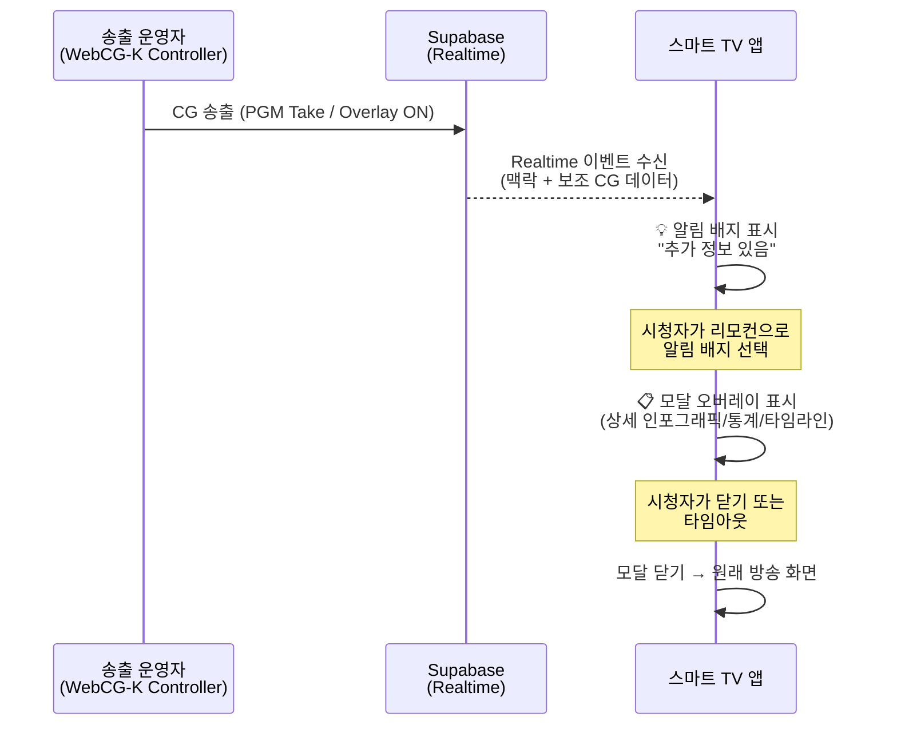
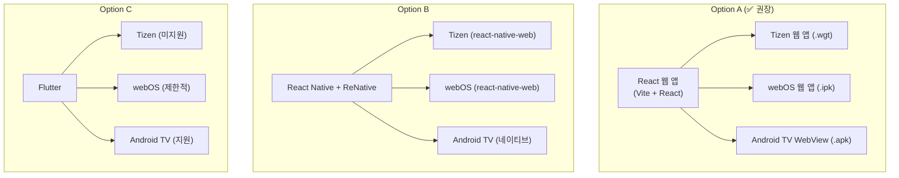
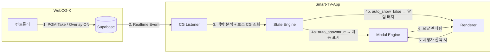
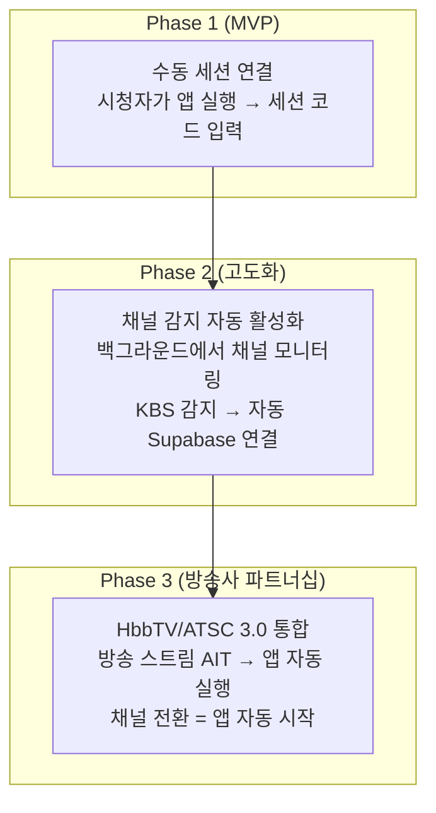
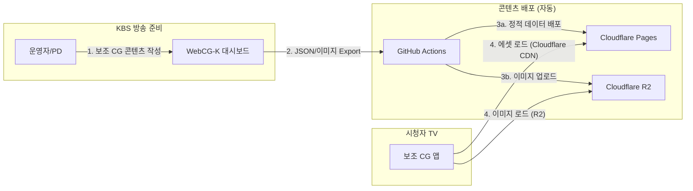
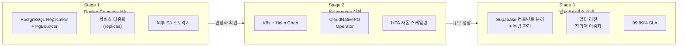

# 📺 스마트 TV 보조 CG 앱 — 기술 보고서

> **작성일**: 2026-03-04  
> **프로젝트**: WebCG-K 연동 스마트 TV 인터랙티브 보조 CG 시스템  
> **상태**: 기획 단계 (Feasibility & Architecture Report)

---

## 1. 프로젝트 개요

### 1.1. 배경 및 문제 정의

WebCG-K는 vMix/OBS를 통해 방송용 CG(컴퓨터 그래픽)를 영상에 합성하는 웹 기반 시스템입니다. 현재 시스템은 방송 송출에 최적화되어 있으나, **방송 콘텐츠만으로는 시청자에게 충분한 정보를 전달하기 어려운 한계**가 존재합니다.

예를 들어:
- 뉴스 속보 시 관련 배경 데이터, 인포그래픽, 타임라인
- 스포츠 중계 시 선수 상세 프로필, 실시간 통계
- 선거 방송 시 지역구별 세부 개표 현황

이러한 **보충 정보를 시청자가 원할 때 인터랙티브하게 접근**할 수 있는 "세컨드 스크린" 역할을 스마트 TV 자체에서 수행하는 것이 본 프로젝트의 목표입니다.

### 1.2. 핵심 컨셉

```
┌──────────────────────────────────────────────────────────────────┐
│                    방송 영상 (Main Feed)                         │
│  ┌─────────────────────────────────────────────────────────┐    │
│  │  WebCG-K 렌더러 (OBS/vMix 오버레이)                     │    │
│  │  • 로워써드, 속보 배너, 날씨 티커 등                     │    │
│  └─────────────────────────────────────────────────────────┘    │
│                         │ CG 타이밍 & 맥락 신호                  │
│                         ▼                                        │
│  ┌─────────────────────────────────────────────────────────┐    │
│  │  📺 스마트 TV 보조 CG 앱 (Modal Overlay)                │    │
│  │  • 시청자 요청 시 상세 정보 모달 표시                    │    │
│  │  • 방송 CG와 동기화된 맥락 기반 콘텐츠                   │    │
│  │  • "더 알아보기" 인터랙티브 CG                           │    │
│  └─────────────────────────────────────────────────────────┘    │
└──────────────────────────────────────────────────────────────────┘
```

### 1.3. 동작 시나리오



---

## 2. 기존 시스템 연동 분석

### 2.1. WebCG-K 현재 아키텍처 요약

| 구성 요소 | 역할 | 기술 |
|-----------|------|------|
| **대시보드** | CG 제작, 런다운 편집, 오버레이 템플릿 CRUD | React, TanStack Router |
| **컨트롤러** | 타임라인 송출, 오버레이 ON/OFF, PGM Take | Supabase Broadcast (~5ms) |
| **렌더러** | OBS 브라우저 소스 → 투명 배경 CG 출력 | Supabase Realtime 구독 |
| **백엔드** | DB, Auth, Realtime, Storage | Supabase (Self-hosted) |

### 2.2. 활용 가능한 연동 포인트

스마트 TV 앱이 기존 WebCG-K 시스템과 연동할 수 있는 **3가지 핵심 채널**:

#### 채널 1: Supabase Realtime Broadcast (타임라인 CG 이벤트)

```
Controller → channel.send({ event: "playout", payload: { action, item } })
                                    │
                                    ▼
                          스마트 TV 앱도 동일 채널 구독
                          → "이 CG가 송출되었다" 인지
                          → 해당 CG에 연결된 보조 콘텐츠 표시
```

- **지연**: ~5ms (Fire-and-Forget)
- **용도**: 방송 CG 송출 시점과 정확히 동기화된 보조 CG 트리거

#### 채널 2: Supabase Postgres Changes (오버레이 상태 변경)

```
Controller → UPDATE overlay_state → CDC → 스마트 TV 앱 구독
```

- **지연**: ~50-100ms
- **용도**: 오버레이 ON/OFF 이벤트 + `current_data` 변경 감지

#### 채널 3: REST API (비동기 데이터 조회)

```
스마트 TV 앱 → Supabase REST API → supplementary_cg 테이블 조회
```

- **용도**: 보조 CG 상세 데이터 (인포그래픽 JSON, 이미지 URL 등) 비동기 로드

### 2.3. 신규 DB 테이블 설계 (안)

기존 스키마를 확장하여 보조 CG 데이터를 관리합니다:

```sql
-- 보조 CG 콘텐츠 정의
CREATE TABLE supplementary_cg (
    id          UUID PRIMARY KEY DEFAULT gen_random_uuid(),
    -- 연결 대상 (택 1)
    template_id UUID REFERENCES overlay_templates(id) ON DELETE CASCADE,
    rundown_item_id UUID REFERENCES rundown_items(id) ON DELETE CASCADE,
    
    name        TEXT NOT NULL,
    category    TEXT NOT NULL,  -- 'infographic', 'stats', 'timeline', 'profile', 'map'
    content     JSONB NOT NULL, -- 카테고리별 구조화된 콘텐츠 데이터
    priority    INT DEFAULT 0,  -- 동시 다수 보조 CG 시 표시 우선순위
    auto_show   BOOLEAN DEFAULT false, -- true면 시청자 요청 없이 자동 표시
    duration_ms INT,            -- 자동 닫힘 시간 (NULL이면 수동 닫기)
    
    created_at  TIMESTAMPTZ DEFAULT now(),
    updated_at  TIMESTAMPTZ DEFAULT now()
);

-- 스마트 TV 세션별 보조 CG 실시간 상태
CREATE TABLE tv_session_state (
    id          UUID PRIMARY KEY DEFAULT gen_random_uuid(),
    session_id  UUID NOT NULL REFERENCES broadcast_sessions(id) ON DELETE CASCADE,
    
    -- 현재 활성 보조 CG 목록
    active_supplementary_ids UUID[] DEFAULT '{}',
    -- 시청자에게 알림 중인 보조 CG 목록
    pending_notifications    UUID[] DEFAULT '{}',
    
    updated_at  TIMESTAMPTZ DEFAULT now()
);
```

---

## 3. 크로스 플랫폼 기술 전략

### 3.1. 대상 플랫폼 분석

| 플랫폼 | OS | 앱 기술 | 스토어 | 시장 점유율 |
|--------|-----|---------|--------|-------------|
| **Samsung TV** | Tizen | HTML/CSS/JS (웹 앱) | Samsung Apps | ~31% (글로벌 1위) |
| **LG TV** | webOS | HTML/CSS/JS (웹 앱) | LG Content Store | ~13% (글로벌 2위) |
| **Android TV** | Android/Google TV | 웹 앱 또는 네이티브 | Google Play Store | ~20% (다수 제조사) |

> [!IMPORTANT]
> **Samsung Tizen과 LG webOS 모두 웹 기술(HTML/CSS/JS) 기반의 앱 개발을 공식 지원**합니다. 이로 인해 **단일 웹 코드베이스**로 3개 플랫폼을 동시 타겟할 수 있는 최적의 조건이 형성됩니다.

### 3.2. 기술 스택 비교 및 선정



#### ✅ Option A: React 웹 앱 (권장)

| 항목 | 내용 |
|------|------|
| **코드 공유율** | **~95%** (플랫폼별 패키징 코드만 분리) |
| **기존 코드 재활용** | WebCG-K와 동일 React + Supabase 스택 → 타입, 서비스, 훅 공유 가능 |
| **개발 속도** | 가장 빠름 (웹 개발 → 패키징만 플랫폼별 분리) |
| **성능** | 충분함 (모달 오버레이 + 인포그래픽 수준) |
| **Supabase 호환** | Tizen/webOS 모두 WebSocket API 네이티브 지원 → `@supabase/supabase-js` 직접 사용 |
| **리스크** | TV 하드웨어 성능 제약 (저사양 모델에서 무거운 애니메이션 주의) |

#### Option B: React Native + ReNative

| 항목 | 내용 |
|------|------|
| **코드 공유율** | ~80% |
| **장점** | 네이티브에 가까운 UX, 공간 내비게이션 라이브러리 풍부 |
| **단점** | Tizen/webOS 지원이 `react-native-web` 경유 → 결국 웹 앱으로 변환 |
| **결론** | 웹 앱과 실질적 차이 없으면서 복잡도만 증가 |

#### Option C: Flutter

| 항목 | 내용 |
|------|------|
| **코드 공유율** | ~60% (Android TV만 네이티브, 나머지는 웹 빌드) |
| **치명적 단점** | Tizen 공식 미지원, webOS도 실험적 수준 |
| **결론** | 부적합 |

### 3.3. 권장 기술 스택 (Option A 상세)

| 분류 | 기술 | 용도 |
|------|------|------|
| **프레임워크** | React 19 + Vite | SPA 렌더링 (WebCG-K와 동일) |
| **상태 관리** | TanStack Store | 보조 CG 상태 |
| **실시간 통신** | Supabase Realtime (Broadcast + Postgres Changes) | WebCG-K 이벤트 동기화 |
| **스타일** | Vanilla CSS + CSS Variables | TV 최적화 다크 테마 |
| **빌드/패키징** | Vite → 정적 빌드 → 플랫폼별 래퍼 | 단일 소스 → 멀티 패키징 |
| **공간 내비게이션** | `@noriginmedia/norigin-spatial-navigation` | 리모컨 D-Pad 탐색 |
| **애니메이션** | CSS Transitions + Web Animations API | 경량 애니메이션 (GPU 효율) |

---

## 4. 시스템 아키텍처

### 4.1. 전체 아키텍처

```
┌────────────────────────────────────────────────────────────────────────┐
│                    WebCG-K (기존 시스템)                                │
│                                                                        │
│  ┌───────────┐    ┌───────────┐    ┌──────────────┐                   │
│  │ 대시보드   │    │ 컨트롤러  │    │   렌더러     │                   │
│  │ (저작)     │    │ (송출)    │    │ (OBS 출력)   │                   │
│  └─────┬─────┘    └─────┬─────┘    └──────────────┘                   │
│        │                │                                              │
│        ▼                ▼                                              │
│  ┌─────────────────────────────────────────┐                          │
│  │         Supabase (Self-hosted)           │                          │
│  │  PostgreSQL + Realtime + Auth + Storage  │                          │
│  └───────────────────┬─────────────────────┘                          │
└──────────────────────┼────────────────────────────────────────────────┘
                       │
          ┌────────────┼────────────┐
          │  Realtime   │  REST API  │
          │  (WS)       │  (HTTP)    │
          ▼             ▼            ▼
┌────────────────────────────────────────────────────────────────────────┐
│              📺 스마트 TV 보조 CG 앱 (신규)                            │
│                                                                        │
│  ┌─────────────────────────────────────────────────────────────────┐  │
│  │                    React 웹 앱 (공통 코어)                       │  │
│  │                                                                 │  │
│  │  ┌──────────────┐  ┌──────────────┐  ┌────────────────────┐   │  │
│  │  │ CG Listener  │  │ Modal Engine │  │ Spatial Navigation │   │  │
│  │  │ (이벤트 수신) │  │ (CG 렌더링)  │  │ (리모컨 탐색)      │   │  │
│  │  └──────────────┘  └──────────────┘  └────────────────────┘   │  │
│  └─────────────────────────────────────────────────────────────────┘  │
│                                                                        │
│  ┌───────────┐   ┌──────────────┐   ┌──────────────────────┐        │
│  │ Tizen     │   │ webOS        │   │ Android TV           │        │
│  │ Wrapper   │   │ Wrapper      │   │ Wrapper (WebView)    │        │
│  │ (.wgt)    │   │ (.ipk)       │   │ (.apk)               │        │
│  └───────────┘   └──────────────┘   └──────────────────────┘        │
└────────────────────────────────────────────────────────────────────────┘
```

### 4.2. 데이터 흐름



### 4.3. 핵심 모듈 설계

#### CG Listener (이벤트 수신 모듈)

```typescript
// 기존 WebCG-K의 Realtime 채널과 동일한 채널 구독
const channel = supabase.channel(`broadcast:${sessionId}`)
  .on("broadcast", { event: "playout" }, (payload) => {
    // 타임라인 CG 송출 이벤트 → 연결된 보조 CG 조회
    handlePlayoutEvent(payload);
  })
  .on("postgres_changes", {
    event: "*",
    schema: "public",
    table: "overlay_state",
    filter: `session_id=eq.${sessionId}`,
  }, (payload) => {
    // 오버레이 상태 변경 → 연결된 보조 CG 조회
    handleOverlayChange(payload);
  })
  .subscribe();
```

#### Modal Engine (보조 CG 렌더링 엔진)

보조 CG의 카테고리별 렌더러:

| 카테고리 | 렌더링 방식 | 예시 |
|----------|-------------|------|
| `infographic` | SVG 기반 데이터 시각화 | 코로나 확진자 추이 차트 |
| `stats` | 테이블/카드 레이아웃 | 선수 시즌 통계 |
| `timeline` | 수평 타임라인 | 사건 경과 타임라인 |
| `profile` | 프로필 카드 | 인터뷰 대상 상세 프로필 |
| `map` | SVG 지도 + 데이터 오버레이 | 지역별 투표율 |

#### Spatial Navigation (리모컨 탐색)

```
┌──────────────────────────────────────────┐
│          TV 화면 (방송 영상)              │
│                                          │
│                    ┌─── 알림 배지 ────┐   │
│                    │ 💡 추가 정보 (i) │   │
│                    └─────────────────┘   │
│                         │                │
│                    리모컨 OK 버튼         │
│                         ▼                │
│   ┌──────────────────────────────────┐   │
│   │        모달 오버레이              │   │
│   │  ┌────────┐ ┌────────┐          │   │
│   │  │ 탭 1   │ │ 탭 2   │          │   │
│   │  └────────┘ └────────┘          │   │
│   │  ┌──────────────────────────┐   │   │
│   │  │                          │   │   │
│   │  │   인포그래픽 콘텐츠       │   │   │
│   │  │   (D-Pad ←→ 탐색)        │   │   │
│   │  │                          │   │   │
│   │  └──────────────────────────┘   │   │
│   │         [닫기: BACK 버튼]        │   │
│   └──────────────────────────────────┘   │
└──────────────────────────────────────────┘
```

---

## 5. 플랫폼별 패키징 전략

### 5.1. 빌드 파이프라인

```
React 소스 코드 (공통)
        │
        ▼
   Vite Build → dist/ (정적 HTML/CSS/JS)
        │
   ┌────┼──────────────────┐
   │    │                  │
   ▼    ▼                  ▼
Tizen  webOS           Android TV
 패키징  패키징            패키징
   │    │                  │
   ▼    ▼                  ▼
config.xml  appinfo.json  build.gradle
 + dist/     + dist/       + WebView
   │    │                  │
   ▼    ▼                  ▼
  .wgt  .ipk              .apk
   │    │                  │
   ▼    ▼                  ▼
Samsung  LG Content     Google Play
 Apps    Store           Store
```

### 5.2. 플랫폼별 래퍼 구성

#### Samsung Tizen

```xml
<!-- config.xml -->
<?xml version="1.0" encoding="UTF-8"?>
<widget xmlns="http://www.w3.org/ns/widgets"
        xmlns:tizen="http://tizen.org/ns/widgets"
        id="com.webcgk.tvcompanion"
        version="1.0.0">
    <name>WebCG-K Companion</name>
    <tizen:application id="xxxxx.WebCGKCompanion" 
                       required_version="6.0"/>
    <content src="index.html"/>
    <feature name="http://tizen.org/feature/network.internet"/>
    <tizen:privilege name="http://tizen.org/privilege/internet"/>
</widget>
```

#### LG webOS

```json
// appinfo.json
{
    "id": "com.webcgk.tvcompanion",
    "version": "1.0.0",
    "vendor": "WebCG-K",
    "type": "web",
    "title": "WebCG-K Companion",
    "main": "index.html",
    "icon": "icon.png",
    "largeIcon": "largeIcon.png",
    "requiredPermissions": ["network.state"]
}
```

#### Android TV

```kotlin
// WebViewTvActivity.kt (최소 래퍼)
class TvActivity : FragmentActivity() {
    override fun onCreate(savedInstanceState: Bundle?) {
        super.onCreate(savedInstanceState)
        val webView = WebView(this).apply {
            settings.javaScriptEnabled = true
            settings.domStorageEnabled = true
            loadUrl("file:///android_asset/dist/index.html")
        }
        setContentView(webView)
    }
}
```

### 5.3. Hosted vs Packaged 전략

| 방식 | 장점 | 단점 | 권장 |
|------|------|------|------|
| **Hosted** | 즉시 업데이트, 서버 제어 | 인터넷 필수, 로딩 시간 | 초기 개발/테스트 단계 |
| **Packaged** | 오프라인 가능, 빠른 로딩 | 스토어 승인 필요 | 프로덕션 배포 |
| **하이브리드** | 핵심 앱은 패키징 + 콘텐츠는 서버 | 최적의 균형 | ✅ **최종 권장** |

> [!TIP]
> **하이브리드 방식**: 앱 셸(HTML/CSS/JS)을 패키징하여 스토어에 배포하고, 보조 CG 콘텐츠 데이터는 Supabase에서 실시간으로 가져오는 구조가 최적입니다. 앱 업데이트 없이도 콘텐츠를 즉시 반영할 수 있습니다.

---

## 6. 프로젝트 구조 (안)

```
2026.WebCgTV/
├── src/                          # 공통 React 소스
│   ├── components/
│   │   ├── Modal/               # 모달 오버레이 컴포넌트
│   │   │   ├── ModalContainer.tsx
│   │   │   ├── InfographicView.tsx
│   │   │   ├── StatsView.tsx
│   │   │   ├── TimelineView.tsx
│   │   │   ├── ProfileView.tsx
│   │   │   └── MapView.tsx
│   │   ├── Notification/        # 알림 배지
│   │   │   └── NotificationBadge.tsx
│   │   └── Navigation/          # 공간 내비게이션
│   │       └── FocusableButton.tsx
│   │
│   ├── lib/
│   │   ├── supabase.ts          # Supabase 클라이언트 (WebCG-K와 공유 가능)
│   │   ├── cgListener.ts        # CG 이벤트 리스너
│   │   └── types.ts             # 보조 CG 타입 정의
│   │
│   ├── stores/
│   │   └── tvStore.ts           # TV 앱 전역 상태
│   │
│   ├── hooks/
│   │   ├── useCgSync.ts         # CG 동기화 훅
│   │   └── useSpatialNav.ts     # 공간 내비게이션 훅
│   │
│   ├── styles/
│   │   ├── tv-reset.css         # TV 브라우저 리셋
│   │   └── tv-theme.css         # TV 최적화 테마
│   │
│   ├── App.tsx
│   └── main.tsx
│
├── platforms/                    # 플랫폼별 래퍼
│   ├── tizen/
│   │   ├── config.xml
│   │   └── build.sh
│   ├── webos/
│   │   ├── appinfo.json
│   │   └── build.sh
│   └── android-tv/
│       ├── app/
│       │   └── src/main/
│       │       ├── java/.../TvActivity.kt
│       │       └── assets/      # ← Vite 빌드 결과물 복사
│       └── build.gradle
│
├── shared/                       # WebCG-K와 공유하는 타입/유틸
│   ├── types/
│   │   ├── database.types.ts    # Supabase 생성 타입 (동일)
│   │   └── realtimeEvents.ts    # Realtime 이벤트 타입
│   └── utils/
│       └── cgFormatter.ts       # CG 데이터 포맷터
│
├── docs/
├── package.json
└── vite.config.ts
```

---

## 7. TV 최적화 고려사항

### 7.1. 10-Foot UI 설계 원칙

| 항목 | 데스크톱/모바일 | TV (10-Foot) |
|------|----------------|--------------|
| **시청 거리** | 30-60cm | ~3m (10ft) |
| **최소 폰트** | 12-14px | **24-32px** |
| **포커스 상태** | hover, 커서 | **하이라이트 테두리 + 확대** |
| **입력 방식** | 마우스, 터치 | **D-Pad (←→↑↓ + OK + Back)** |
| **Safe Area** | 없음 | **상하좌우 5% 여백** |
| **콘텐츠 밀도** | 높음 | **낮음 (한 화면에 적은 요소)** |

### 7.2. 성능 제약

| 제약 | 대응 전략 |
|------|-----------|
| 제한된 메모리 (~512MB~1GB) | 이미지 lazy loading, DOM 노드 최소화 |
| 낮은 CPU 성능 | CSS 애니메이션 > JS 애니메이션, `transform`/`opacity` 위주 |
| GPU 가속 제한 | `will-change` 속성 활용, 레이어 수 최소화 |
| WebSocket 연결 안정성 | 자동 재연결 로직, 연결 상태 모니터링 |

### 7.3. TV CSS 리셋

```css
/* TV 환경 최적화 기본 CSS */
:root {
    --tv-safe-area: 5%;
    --tv-font-min: 24px;
    --tv-focus-color: #4FC3F7;
    --tv-focus-scale: 1.05;
    --tv-transition: 200ms ease-out;
}

body {
    margin: 0;
    padding: var(--tv-safe-area);
    overflow: hidden;          /* TV에서 스크롤바 숨김 */
    cursor: none;              /* TV에서 커서 숨김 */
    font-size: var(--tv-font-min);
    -webkit-font-smoothing: antialiased;
}

*:focus {
    outline: 3px solid var(--tv-focus-color);
    transform: scale(var(--tv-focus-scale));
    transition: all var(--tv-transition);
}
```

---

## 8. 개발 로드맵

### Phase 1: 기반 구축 (2-3주)

- [ ] 프로젝트 초기화 (Vite + React + TypeScript)
- [ ] TV CSS 리셋 + 다크 테마 시스템 구축
- [ ] 공간 내비게이션 (D-Pad) 시스템 구현
- [ ] Supabase 클라이언트 연결 + Realtime 구독 테스트
- [ ] WebCG-K 공유 타입 패키지 분리

### Phase 2: 핵심 기능 (3-4주)

- [ ] CG Listener 모듈 (Broadcast + Postgres Changes 이벤트 수신)
- [ ] 알림 배지 시스템 (보조 CG 가용 알림)
- [ ] 모달 엔진 v1 (기본 카드 레이아웃)
- [ ] 보조 CG 카테고리별 렌더러 (infographic, stats, profile)
- [ ] `supplementary_cg` + `tv_session_state` DB 마이그레이션

### Phase 3: UI/UX 고도화 (2-3주)

- [ ] 모달 진입/퇴장 애니메이션 (fade + slide)
- [ ] 탭 내비게이션 (다중 보조 CG 탐색)
- [ ] 타임라인/맵 뷰 렌더러
- [ ] 시청자 인터랙션 분석 (어떤 보조 CG가 많이 열리는지)

### Phase 4: 플랫폼 패키징 (2-3주)

- [ ] Samsung Tizen 패키징 + 시뮬레이터 테스트
- [ ] LG webOS 패키징 + 시뮬레이터 테스트
- [ ] Android TV WebView 래퍼 + 에뮬레이터 테스트
- [ ] 각 플랫폼 스토어 제출 프로세스 정리

### Phase 5: 통합 테스트 & 배포 (2주)

- [ ] WebCG-K ↔ 스마트 TV 앱 실시간 연동 E2E 테스트
- [ ] 실제 TV 디바이스 테스트 (삼성/LG/Android TV 실기)
- [ ] 성능 프로파일링 및 최적화
- [ ] 스토어 심사 제출

> **예상 총 소요 기간**: 11-15주 (약 3-4개월)

---

## 9. 채널 감지 자동 트리거 (Channel Detection Trigger)

> **핵심 질문**: "시청자가 KBS 채널을 틀면, KBS 보조 CG 앱이 자동으로 활성화될 수 있는가?"

### 9.1. 결론: **기술적으로 가능하다**

3개 플랫폼 모두 **현재 시청 중인 채널을 감지하는 네이티브 API**를 제공합니다. 단, 접근 방식과 제약이 플랫폼마다 다릅니다.

### 9.2. 플랫폼별 채널 감지 API

#### Samsung Tizen: `webapis.tv.channel`

```javascript
// config.xml에 권한 추가 필요
// <tizen:privilege name="http://tizen.org/privilege/tv.channel"/>

// 현재 채널 조회
const currentChannel = webapis.tv.channel.getCurrentChannel();
console.log(currentChannel.channelName); // "KBS1"
console.log(currentChannel.majorNumber); // 9

// 채널 변경 이벤트 감지
webapis.tv.channel.addChannelChangeListener((channelInfo) => {
    if (channelInfo.channelName.includes("KBS")) {
        // KBS 채널 감지 → 보조 CG 앱 활성화
        activateCompanionMode(channelInfo);
    }
});
```

- **권한**: `tv.channel` privilege 필요 (config.xml 선언)
- **제약**: Samsung Apps 스토어 심사 시 이 권한 사용 사유 설명 필요

#### LG webOS: Luna Service API

```javascript
// Luna Service를 통한 현재 채널 구독
webOS.service.request("luna://com.webos.service.utp.broadcast", {
    method: "getCurrentChannel",
    parameters: { subscribe: true },
    onSuccess: (response) => {
        const channelName = response.channelName; // "KBS1"
        if (channelName.includes("KBS")) {
            activateCompanionMode(response);
        }
    },
    onFailure: (error) => {
        console.error("채널 감지 실패:", error);
    }
});
```

- **권한**: `com.webos.service.utp.broadcast` 접근 필요
- **제약**: `subscribe: true`로 실시간 채널 변경 감지 가능

#### Android TV: TV Input Framework (TIF)

```kotlin
// Android TV의 TvContract API
val uri = TvContract.buildChannelUri(channelId)
val cursor = contentResolver.query(uri, ...)
// 또는 TvView의 onTuned 콜백 활용

// WebView로 전달
webView.evaluateJavascript(
    "window.onChannelChange('KBS1')", null
)
```

- **권한**: `android.permission.READ_TV_CHANNEL` 필요
- **제약**: WebView 래퍼와 네이티브 브릿지 필요

### 9.3. HbbTV 표준 — 방송 스트림 기반 자동 실행

> [!IMPORTANT]
> HbbTV(Hybrid Broadcast Broadband TV)는 방송 스트림 자체에 앱 실행 시그널을 삽입하는 **유럽 표준**입니다. 한국에서는 ATSC 3.0(지상파) 기반으로 유사한 인터랙티브 서비스가 가능합니다.

```
┌──────────────────────────────────────────────────────────────┐
│  방송 스트림 (KBS 송출)                                       │
│                                                              │
│  영상 + 오디오 + AIT (Application Information Table)          │
│                    │                                          │
│                    ▼                                          │
│  AIT 데이터:                                                  │
│  ┌────────────────────────────────────────────┐              │
│  │ app_id: "com.kbs.companion"                │              │
│  │ url: "https://companion.kbs.co.kr"         │              │
│  │ control_code: AUTOSTART                    │              │
│  │ → 이 채널 시청 시 자동으로 웹 앱 실행!      │              │
│  └────────────────────────────────────────────┘              │
└──────────────────────────────────────────────────────────────┘
```

- **장점**: 방송사(KBS)가 스트림에 AIT를 삽입하면, TV가 자동으로 해당 앱을 실행
- **한계**: 방송사 협력 필수, 한국 지상파는 HbbTV 대신 ATSC 3.0 기반 인터랙티브 서비스 사용

### 9.4. 실현 가능한 트리거 전략 비교

| 트리거 방식 | 방송사 협력 | 구현 난이도 | 사용자 경험 |
|------------|:-----------:|:----------:|:----------:|
| **A. 앱 내 채널 감지 (권장)** | ❌ 불필요 | ⭐⭐ | 앱이 백그라운드에서 채널 모니터링 → KBS 감지 시 알림 |
| **B. HbbTV/ATSC 3.0 AIT** | ✅ 필수 | ⭐⭐⭐⭐ | 채널 전환 시 자동 앱 실행 (최고 UX) |
| **C. 수동 세션 입력** | ❌ 불필요 | ⭐ | 시청자가 앱에서 세션 코드 입력 |

### 9.5. 권장 구현: 단계별 접근



**Phase 2 상세 흐름** (방송사 협력 없이 구현 가능):

```
1. 시청자가 TV 앱 최초 설치 시 "관심 채널" (KBS1, KBS2 등) 설정
2. 앱이 백그라운드 서비스로 채널 감지 리스너 등록
3. 시청자가 KBS1로 채널 변경
4. 채널 감지 API → "KBS1" 감지
5. Supabase에서 현재 KBS 방송 세션 자동 조회
   → broadcast_sessions WHERE channel = 'KBS1' AND status = 'live'
6. 세션 발견 시 → Realtime 채널 자동 구독
7. 보조 CG 가용 시 → 화면 하단에 알림 배지 표시
   "🔔 추가 정보를 확인하세요 (OK 버튼)"
```

> [!WARNING]
> **백그라운드 채널 모니터링은 플랫폼마다 제약이 다릅니다.** Tizen과 webOS에서 백그라운드 서비스 실행이 제한될 수 있어, 앱이 포그라운드에 있을 때만 채널 감지가 가능할 수 있습니다. 이 경우 "앱 실행 → 현재 채널 자동 감지 → 해당 채널의 방송 세션 자동 연결"이 현실적인 시나리오입니다.

---

## 10. 리스크 및 대응

| 리스크 | 영향도 | 대응 전략 |
|--------|--------|-----------|
| TV 하드웨어 성능 부족 | 높음 | 경량 렌더링 (CSS only), 복잡한 차트는 pre-render된 이미지 사용 |
| Tizen/webOS 브라우저 호환성 | 중간 | Babel + 폴리필, 플랫폼별 기능 감지 |
| 스토어 심사 리젝 | 중간 | 각 플랫폼 가이드라인 사전 준수, 초기 reject 대응 기간 확보 |
| Supabase WebSocket 연결 불안정 | 중간 | 자동 재연결 + 폴백(HTTP Long Polling) |
| WebCG-K API 변경 시 양쪽 동시 수정 | 낮음 | 공유 타입 패키지(`shared/`)로 계약 일치 강제 |
| **채널 감지 API 권한 거부** | **중간** | **단계별 접근: Phase 1에서 수동 연결 → Phase 2에서 채널 감지 추가** |

---

## 11. 결론 및 권장 사항

### 핵심 결론

1. **React 웹 앱 기반 단일 코드베이스**가 Samsung Tizen, LG webOS, Android TV 3개 플랫폼을 가장 효율적으로 커버하는 전략입니다.
2. 기존 WebCG-K와 **동일한 Supabase Realtime 인프라**를 활용하여 추가 서버 구축 없이 실시간 연동이 가능합니다.
3. **~95% 코드 공유율**을 달성할 수 있으며, 플랫폼별 차이는 패키징 래퍼(config.xml, appinfo.json, WebView)에서만 발생합니다.
4. **채널 감지 자동 트리거는 기술적으로 가능**하며, 방송사 협력 없이도 플랫폼 네이티브 API로 구현 가능합니다.

### 즉시 실행 권장 사항

| 우선순위 | 항목 |
|----------|------|
| **P0** | 별도 Git 저장소 생성 (`2026.WebCgTV`), 모노레포 고려 시 본 프로젝트와 공유 타입 패키지 분리 |
| **P1** | Samsung Tizen 시뮬레이터 + LG webOS 시뮬레이터 환경 구축 (개발 루프 확보) |
| **P2** | WebCG-K에 `supplementary_cg` 테이블 마이그레이션 추가 (대시보드에서 보조 CG 편집 UI 기반) |
| **P3** | 프로토타입: 간단한 "알림 배지 → 모달" 흐름을 Tizen 시뮬레이터에서 검증 |
| **P4** | Tizen `tv.channel` API 권한 테스트 (시뮬레이터에서 채널 감지 동작 확인) |

> [!CAUTION]
> 이 프로젝트는 WebCG-K와 **밀접하게 연동**되지만, **독립된 저장소와 배포 파이프라인**으로 관리해야 합니다. 두 프로젝트 간의 계약(타입, Realtime 이벤트 스키마)은 공유 패키지로 관리하되, 빌드와 배포는 완전히 분리되어야 합니다.

---

## 12. 플랫폼 기반 트래픽 분산 전략 (Cost-Effective Traffic Management)

> **핵심 과제**: KBS는 예산이 넉넉하지 않다. 시청자형 인터랙티브 앱에서 발생하는 트래픽을 **자체 서버에 집중시키지 않고**, 플랫폼 사업자(Samsung, Google, LG)의 기존 인프라와 무료/저비용 CDN을 **최대한 활용**하여 운영 비용을 극소화해야 한다.

### 12.1. 트래픽 분류 및 분산 원칙

시청자형 인터랙티브 앱에서 발생하는 트래픽은 크게 4가지로 분류됩니다. 각 유형별로 **최적의 분산 대상**이 다릅니다.

```
┌────────────────────────────────────────────────────────────────────┐
│                    트래픽 유형별 분산 전략                           │
├──────────────────┬──────────────────┬──────────────────────────────┤
│ 트래픽 유형       │ 비중(예상)        │ 분산 대상                     │
├──────────────────┼──────────────────┼──────────────────────────────┤
│ ① 앱 바이너리    │ 초기 1회         │ 스토어 CDN (100% 무료)        │
│ ② 정적 에셋      │ ~60%             │ Cloudflare Pages (무료)       │
│ ③ 실시간 이벤트  │ ~10%             │ Supabase Realtime (최소화)    │
│ ④ 동적 콘텐츠    │ ~30%             │ Edge Cache + Service Worker  │
└──────────────────┴──────────────────┴──────────────────────────────┘
```

> [!IMPORTANT]
> **핵심 원칙: "KBS 서버(Supabase)는 실시간 이벤트 시그널만 담당"**하고, 나머지 모든 트래픽은 플랫폼 인프라 또는 무료 CDN으로 오프로드합니다. Google Play의 Achievement 관리 시스템이 Google 인프라에서 처리되듯이, 보조 CG 앱의 에셋과 콘텐츠도 플랫폼 사업자의 인프라 위에서 동작하도록 설계합니다.

### 12.2. 레이어 1 — 앱 스토어 CDN 활용 (비용: ₩0)

각 플랫폼 스토어는 앱 바이너리 배포를 위한 **글로벌 CDN을 무료로 제공**합니다. 이것이 트래픽 분산의 첫 번째이자 가장 확실한 레이어입니다.

| 스토어 | CDN 제공 | 앱 크기 제한 | 업데이트 배포 | 비용 |
|--------|----------|-------------|-------------|------|
| **Samsung Apps** | Samsung 글로벌 CDN | ~200MB | 자동 업데이트 | **무료** |
| **LG Content Store** | LG 글로벌 CDN | ~100MB | 자동 업데이트 | **무료** |
| **Google Play Store** | Google 글로벌 CDN | ~150MB (AAB) | Play Asset Delivery | **무료** |

#### 전략: 앱 셸에 최대한 많은 정적 에셋을 패키징

```
┌─────────────────────────────────────────────────────────────┐
│  앱 패키지 (.wgt / .ipk / .apk) — 스토어 CDN이 배포       │
│                                                             │
│  ├── index.html, app.js, app.css  (앱 코드)                │
│  ├── fonts/                        ← 웹 폰트 번들링       │
│  ├── icons/                        ← 아이콘/로고           │
│  ├── templates/                    ← 보조 CG 기본 템플릿   │
│  │   ├── infographic-base.svg      (차트 SVG 골격)         │
│  │   ├── stats-card.html           (통계 카드 껍데기)       │
│  │   ├── timeline-component.html   (타임라인 컴포넌트)     │
│  │   └── map-korea.svg             (한국 지도 SVG)         │
│  └── sw.js                         ← Service Worker        │
│                                                             │
│  → 스토어 CDN이 전 세계 배포 = KBS 트래픽 0                │
└─────────────────────────────────────────────────────────────┘
```

> [!TIP]
> **Google Play의 Play Asset Delivery**를 활용하면, 앱 설치 시 필수 에셋만 다운로드하고 나머지는 On-Demand로 Google CDN에서 가져올 수 있습니다. 300MB+의 대용량 에셋도 Google 인프라가 부담합니다.

#### Google Play Asset Delivery 활용 예시

```kotlin
// Android TV 앱에서 Play Asset Delivery 활용
// 대용량 인포그래픽 에셋팩을 Google CDN에서 On-Demand 로드
val assetPackManager = AssetPackManagerFactory.getInstance(this)

// "infographic_pack"은 Google Play Console에서 정의한 에셋팩
assetPackManager.fetch(listOf("infographic_pack"))
    .addOnSuccessListener { result ->
        // Google CDN이 배포 → KBS 서버 트래픽 0
        val assetPath = result.assetPackStates()
            ?.get("infographic_pack")?.assetsPath()
        webView.evaluateJavascript(
            "loadInfographicAssets('$assetPath')", null
        )
    }
```

### 12.3. 레이어 2 — 무료 CDN/호스팅 활용 (비용: ₩0 ~ 최소)

앱에 포함하기 어려운 **동적으로 변하는 콘텐츠**(방송별 인포그래픽 데이터, 이미지 등)는 무료 CDN 서비스를 통해 배포합니다.

#### 무료 CDN 서비스 비교

| 서비스 | 대역폭 | 스토리지 | 글로벌 CDN | 추가 기능 | **권장 용도** |
|--------|--------|---------|-----------|----------|-------------|
| **Cloudflare Pages** | **무제한** | 20,000 파일 | ✅ 330+ PoP | Workers 10만/일 | ✅ **정적 에셋 1순위** |
| **Cloudflare R2** | **Egress 무료** | 10GB 무료 | ✅ | S3 호환 API | ✅ **이미지/미디어** |
| **Firebase Hosting** | 10GB/월 | 10GB | ✅ Google CDN | Cloud Functions | 보조 API 엔드포인트 |
| **Vercel** | 100GB/월 | - | ✅ | Edge Functions | 대안 CDN |
| GitHub Pages | 100GB/월 | 1GB | ✅ | - | 긴급 폴백 |

#### 권장 아키텍처: Cloudflare Pages + R2

```
┌──────────────────────────────────────────────────────────────────────┐
│  Cloudflare 인프라 (무료 티어)                                        │
│                                                                      │
│  ┌──────────────────────┐     ┌──────────────────────────┐          │
│  │ Cloudflare Pages     │     │ Cloudflare R2            │          │
│  │ (무제한 대역폭)       │     │ (Egress 무료!)           │          │
│  │                      │     │                          │          │
│  │ • 보조 CG JSON 데이터 │     │ • 인포그래픽 이미지      │          │
│  │ • 인포그래픽 SVG      │     │ • 프로필 사진            │          │
│  │ • 통계 데이터 JSON    │     │ • 지도 타일              │          │
│  │ • 타임라인 데이터     │     │ • 프리렌더 차트 이미지   │          │
│  └──────────┬───────────┘     └──────────┬───────────────┘          │
│             │                            │                           │
│             ▼                            ▼                           │
│  ┌──────────────────────────────────────────────────────────┐       │
│  │ Cloudflare Edge (330+ 글로벌 PoP)                         │       │
│  │ → 서울, 부산, 도쿄, 오사카 PoP에서 직접 서빙              │       │
│  │ → KBS 서버 트래픽 0, 레이턴시 <10ms                        │       │
│  └──────────────────────────────────────────────────────────┘       │
└──────────────────────────────────────────────────────────────────────┘
```

#### 콘텐츠 배포 워크플로



### 12.4. 레이어 3 — Service Worker 로컬 캐싱 (비용: ₩0)

TV 앱 내부의 Service Worker를 활용하면, 한 번 받은 콘텐츠를 TV 로컬에 캐시하여 **이후 동일 요청은 네트워크 트래픽 자체가 발생하지 않습니다**.

> [!IMPORTANT]
> 이것은 Google Play의 Achievement 시스템이 로컬에 캐시되어 서버 호출을 최소화하는 것과 **동일한 패턴**입니다. 한 번 받아온 보조 CG 데이터는 TV가 로컬에 보관하고, 변경된 부분만 서버에서 갱신합니다.

#### Service Worker 캐싱 전략

```javascript
// sw.js — TV 앱 Service Worker
const CACHE_VERSION = 'v1';
const STATIC_CACHE = `static-${CACHE_VERSION}`;
const CONTENT_CACHE = `content-${CACHE_VERSION}`;

// 캐싱 전략 정의
const CACHE_STRATEGIES = {
  // 보조 CG 템플릿 (SVG, HTML) → Cache-First
  // 한 번 캐시하면 앱 업데이트 전까지 네트워크 요청 0
  templates: 'cache-first',

  // 방송별 콘텐츠 JSON → Stale-While-Revalidate
  // 캐시된 데이터를 즉시 표시 + 백그라운드에서 최신 데이터 확인
  content: 'stale-while-revalidate',

  // 인포그래픽 이미지 → Cache-First + TTL(24h)
  // 같은 방송 내에서 반복 요청 시 캐시 사용
  images: 'cache-first-ttl',

  // Supabase 실시간 이벤트 → Network-Only
  // 실시간 데이터는 항상 서버에서 (WebSocket)
  realtime: 'network-only'
};

self.addEventListener('fetch', (event) => {
  const url = new URL(event.request.url);

  // Cloudflare Pages 에셋 → Cache-First
  if (url.hostname.includes('pages.dev') ||
      url.hostname.includes('r2.dev')) {
    event.respondWith(cacheFirst(event.request, CONTENT_CACHE));
    return;
  }

  // Supabase 요청 → Network-Only (실시간 이벤트는 캐시 불가)
  if (url.hostname.includes('supabase')) {
    event.respondWith(fetch(event.request));
    return;
  }
});

// Cache-First 전략 구현
async function cacheFirst(request, cacheName) {
  const cache = await caches.open(cacheName);
  const cached = await cache.match(request);
  if (cached) return cached;  // 캐시 히트 → 네트워크 트래픽 0!

  const response = await fetch(request);
  if (response.ok) {
    cache.put(request, response.clone());
  }
  return response;
}
```

#### 캐싱 효과 시뮬레이션

```
시나리오: 1회 방송 × 100만 시청자 × 5개 보조 CG

▼ 캐싱 없는 경우
  100만 × 5개 × 평균 50KB = ~250GB 트래픽 (Supabase 서버 부하)

▼ Service Worker 캐싱 적용 후
  ① 앱 바이너리 (스토어 CDN): 0GB (KBS 부담)
  ② 정적 에셋 (Cloudflare Pages): 50KB × 100만 = ~50GB (Cloudflare 무료)
  ③ 보조 CG 데이터 (Cloudflare Pages): 10KB × 100만 = ~10GB (Cloudflare 무료)
  ④ 실시간 시그널 (Supabase): ~1KB × 5개 = **5KB** (KBS 부담 = 거의 0)

  → KBS 서버 부담: 5KB (실시간 이벤트 시그널만)
  → Cloudflare 부담: ~60GB (무료 티어 내)
  → 비용 절감: **99.99%+**
```

### 12.5. 레이어 4 — 플랫폼 서비스 적극 활용

Google Play 게임의 Achievement 시스템처럼, 각 플랫폼이 제공하는 **부가 서비스를 적극 활용**하여 자체 구현 비용과 트래픽을 줄입니다.

#### 12.5.1. Google Play Games Services (Android TV)

| Google 서비스 | 보조 CG 앱 활용 방안 | 트래픽 절감 |
|--------------|---------------------|----------|
| **Achievements** | 시청자 인터랙션 실적 관리 (보조 CG 10개 열람, 퀴즈 참여 등) | Google 서버가 처리 |
| **Leaderboards** | 퀴즈/투표 순위 집계 | Google 서버가 처리 |
| **Cloud Save** | 시청자 선호도/설정 저장 | Google 서버 스토리지 사용 |
| **Firebase Analytics** | 시청자 행동 분석 | Google 인프라 사용 |
| **Firebase Remote Config** | 보조 CG 표시 설정 원격 제어 | Google CDN이 배포 |

```javascript
// Google Play Games Services 활용 예시
// 시청자가 보조 CG를 열람하면 Achievement 달성 처리
// → 이 데이터는 Google 서버에 저장 = KBS 트래픽 0

// Achievement: "뉴스 탐구가" — 보조 CG 10개 열람
gapi.client.games.achievements.unlock({
  achievementId: 'CG_EXPLORER_10'
}).then(() => {
  console.log('Achievement unlocked via Google Server');
});

// Leaderboard: 실시간 퀴즈 점수 → Google 서버가 집계
gapi.client.games.scores.submit({
  leaderboardId: 'QUIZ_LEADERBOARD',
  score: playerScore
});

// Cloud Save: 시청자 선호 설정 → Google Drive에 저장
gapi.client.games.snapshots.save({
  snapshotId: 'user_preferences',
  data: JSON.stringify({ favoriteTopics: ['sports', 'weather'] })
});
```

#### 12.5.2. Samsung 플랫폼 서비스 (Tizen TV)

| Samsung 서비스 | 활용 방안 | 비고 |
|---------------|---------|------|
| **Samsung Checkout** | 프리미엄 보조 CG 유료화 시 Samsung 결제 인프라 사용 | Samsung이 결제 처리 |
| **Samsung Cloud** | 시청자 설정 동기화 (다수 삼성 기기 간) | Samsung 인프라 |
| **Samsung Analytics** | 앱 사용 로그 수집 → Samsung Analytics 대시보드 활용 | Samsung 인프라 |
| **Tizen Service Platform** | 로컬 알림, 백그라운드 서비스 → KBS 푸시 인프라 불필요 | 디바이스 로컬 |

#### 12.5.3. LG 플랫폼 서비스 (webOS TV)

| LG 서비스 | 활용 방안 | 비고 |
|-----------|---------|------|
| **LG Accounts** | 시청자 인증 → LG 인프라로 처리 | LG 계정 연동 |
| **Luna Service** | 로컬 알림/채널 감지 → 디바이스 내 처리 | 네트워크 트래픽 0 |
| **webOS App Analytics** | 사용 통계 → LG 인프라로 전송 | LG 대시보드 |

### 12.6. 레이어 5 — Supabase 최적화 (KBS 자체 서버 부담 최소화)

유일하게 KBS 자체 인프라를 사용하는 **Supabase**에 대해서도, 트래픽을 극소화하는 전략을 적용합니다.

#### Supabase 트래픽 최소화 원칙

```
┌──────────────────────────────────────────────────────────────────┐
│  Supabase의 역할을 "실시간 시그널 허브"로 한정                     │
│                                                                  │
│  ✅ Supabase가 하는 것:                                          │
│  • Realtime Broadcast: "이 CG가 지금 송출되었다" 시그널 전달     │
│  • 보조 CG 메타데이터: ID, 카테고리, Cloudflare URL 참조         │
│  • 세션 상태 관리: 현재 방송 세션 정보                             │
│                                                                  │
│  ❌ Supabase가 하지 않는 것 (트래픽 절감):                        │
│  • 이미지/SVG/미디어 호스팅 → Cloudflare R2로 이전               │
│  • 보조 CG 상세 콘텐츠 JSON → Cloudflare Pages에 정적 배포      │
│  • 시청자 통계/분석 → 플랫폼 Analytics 서비스 활용                │
│  • 사용자 설정 저장 → Google Cloud Save / Samsung Cloud          │
└──────────────────────────────────────────────────────────────────┘
```

#### 데이터 분리 전략

```mermaid
flowchart TB
    subgraph Supabase ["Supabase (KBS 자체 - 최소 트래픽)"]
        RT[("Realtime Broadcast\n~1KB/이벤트")]
        META[("supplementary_cg 메타데이터\nid, category,\ncontent_url (→ Cloudflare)")]
    end

    subgraph Cloudflare ["Cloudflare (무료 - 대량 트래픽)"]
        PAGES[("Pages\n보조 CG JSON 데이터")]
        R2[("R2\n이미지/SVG/미디어")]
    end

    subgraph Google ["Google (무료 - 부가 기능)"]
        GPGS[("Play Games Services\nAchievements, Leaderboards")]
        FA[("Firebase Analytics\n시청자 행동 분석")]
        FRC[("Remote Config\n원격 설정 제어")]
    end

    subgraph TV ["시청자 TV 앱"]
        SW[("Service Worker\n로컬 캐시")]
    end

    RT -->|"시그널만 전달\n(1KB)"| TV
    META -->|"URL 참조만"| TV
    TV -->|"실제 콘텐츠 로드"| PAGES
    TV -->|"이미지 로드"| R2
    TV -->|"인터랙션 기록"| GPGS
    TV -->|"이벤트 전송"| FA
    TV -->|"설정 확인"| FRC
    SW -->|"2회차부터 캐시 히트\n→ 네트워크 0"| TV
```



#### 코드 레벨 구현: 보조 CG 데이터 로드 흐름

```typescript
// 보조 CG 데이터 로드 — Supabase는 URL만, 실제 데이터는 Cloudflare에서
interface SupplementaryCgMeta {
  id: string;
  category: 'infographic' | 'stats' | 'timeline' | 'profile' | 'map';
  name: string;
  // 핵심: 실제 콘텐츠는 Cloudflare URL로 참조
  content_url: string;       // → Cloudflare Pages JSON
  image_urls: string[];      // → Cloudflare R2 이미지
  priority: number;
}

// Supabase에서 메타데이터만 조회 (수 바이트)
const { data: cgMeta } = await supabase
  .from('supplementary_cg')
  .select('id, category, name, content_url, image_urls, priority')
  .eq('id', cgId)
  .single();

// 실제 콘텐츠는 Cloudflare CDN에서 로드 (Service Worker가 캐싱)
const contentResponse = await fetch(cgMeta.content_url);
// → 1차: Cloudflare Edge에서 응답 (KBS 트래픽 0)
// → 2차+: Service Worker 캐시에서 응답 (네트워크 트래픽 0)
const contentData = await contentResponse.json();
```

### 12.7. 종합 트래픽 분산 아키텍처

```
                              시청자 TV 앱
                                  │
                    ┌─────────────┼─────────────────┐
                    │             │                  │
                    ▼             ▼                  ▼
         ┌──────────────┐ ┌────────────┐  ┌──────────────────┐
         │ Service      │ │ 플랫폼     │  │ CDN              │
         │ Worker       │ │ 서비스     │  │ (Cloudflare)     │
         │ (로컬 캐시)  │ │            │  │                  │
         │              │ │ Google:    │  │ Pages: JSON 데이터│
         │ 2회차+:      │ │ • GPGS     │  │ R2: 이미지/미디어 │
         │ 캐시 히트    │ │ • Analytics│  │                  │
         │ = 트래픽 0   │ │ • Remote   │  │ 대역폭: 무제한   │
         │              │ │   Config   │  │ Egress: 무료     │
         │              │ │            │  │                  │
         │              │ │ Samsung:   │  │ PoP: 330+        │
         │              │ │ • Analytics│  │ (서울/부산 포함)  │
         │              │ │ • Cloud    │  │                  │
         │              │ │            │  │                  │
         │              │ │ LG:        │  │                  │
         │              │ │ • Luna     │  │                  │
         │              │ │ • Analytics│  │                  │
         └──────────────┘ └──────┬─────┘  └────────┬─────────┘
                                 │                  │
                                 │ 플랫폼이         │ Cloudflare가
                                 │ 부담             │ 부담
                                 │ (무료)           │ (무료)
                                 │                  │
              ┌──────────────────┴──────────────────┘
              │
              │  KBS 부담 = Supabase Realtime 시그널만
              │  (~1KB/이벤트, WebSocket)
              │
              ▼
    ┌──────────────────┐
    │ Supabase         │
    │ (Self-hosted)    │
    │                  │
    │ • Realtime       │
    │   Broadcast      │
    │   (~5ms 지연)    │
    │                  │
    │ • 메타데이터만   │
    │   (URL 참조)     │
    └──────────────────┘
```

### 12.8. 비용 분석 시뮬레이션

#### 시나리오: 주간 뉴스 특보 (100만 동시 시청자)

| 항목 | 자체 서버 전량 처리 시 | 플랫폼 분산 전략 적용 시 | 절감률 |
|------|---------------------|----------------------|-------|
| **앱 배포** | CDN 400GB ($80) | 스토어 CDN (**₩0**) | 100% |
| **정적 에셋** | 50GB ($10) | Cloudflare Pages (**₩0**) | 100% |
| **이미지/미디어** | 100GB ($20) | Cloudflare R2 (**₩0**) | 100% |
| **보조 CG 데이터** | 10GB ($2) | Cloudflare Pages (**₩0**) | 100% |
| **시청자 분석** | 자체 DB 쓰기 ($5) | 플랫폼 Analytics (**₩0**) | 100% |
| **실시간 시그널** | $0.50 | Supabase Broadcast (**$0.50**) | 0% |
| **합계** | ~$117.50/회 | **~$0.50/회** | **99.6%** |

#### 연간 운영 비용 추정 (주 5회 방송 기준)

| 항목 | 자체 전량 처리 | 플랫폼 분산 전략 |
|------|-------------|----------------|
| CDN/호스팅 비용 | ~$30,000/년 | **~$130/년** |
| 서버 인프라 비용 | ~$12,000/년 | ~$3,600/년 (Supabase) |
| 분석 인프라 비용 | ~$6,000/년 | **₩0** (플랫폼 Analytics) |
| **합계** | **~$48,000/년** | **~$3,730/년** |
| | | **절감: 92%** |

### 12.9. 대규모 트래픽 대비 — 탄력적 확장 전략

선거 방송, 스포츠 중계 등 **급격한 트래픽 스파이크** 대비 전략:

```
┌──────────────────────────────────────────────────────────────────┐
│  트래픽 스파이크 시나리오 (선거 개표 방송, 500만 동시 접속)        │
│                                                                  │
│  1단계 (자동): Service Worker 캐시 히트                          │
│  → 이미 한 번 본 시청자는 캐시에서 즉시 로드                     │
│  → 예상 캐시 히트율: ~70% → 350만 명의 트래픽 = 0                │
│                                                                  │
│  2단계 (자동): Cloudflare Edge 캐시                              │
│  → 나머지 150만 명의 요청 → Cloudflare 330+ PoP가 처리          │
│  → Cloudflare의 무제한 대역폭으로 자동 확장                      │
│                                                                  │
│  3단계 (자동): Supabase Realtime 스케일링                        │
│  → 500만 WebSocket 연결 → Supabase 클러스터 확장                │
│  → 이 부분만 비용 발생 (월 $25~ Pro Plan)                       │
│                                                                  │
│  결과: 500만 동시 접속에서도 KBS 부담은 WebSocket 시그널 비용만  │
└──────────────────────────────────────────────────────────────────┘
```

> [!WARNING]
> **유일한 병목: Supabase WebSocket 연결 수**. Self-hosted Supabase의 경우 서버 스펙에 따라 동시 WebSocket 연결 한계가 있습니다. 100만+ 동시 접속이 예상되면, **Supabase Broadcast 대신 Cloudflare Pub/Sub** 또는 **Firebase Realtime Database** Fan-out을 고려해야 합니다. 이 경우에도 KBS 자체 서버 부담은 최소화됩니다.

### 12.10. 실행 체크리스트

| 우선순위 | 항목 | 비용 | 효과 |
|---------|------|------|------|
| **P0** | Cloudflare 계정 생성 + Pages 프로젝트 셋업 | ₩0 | 정적 에셋 무료 CDN 확보 |
| **P0** | Cloudflare R2 버킷 생성 (이미지/미디어용) | ₩0 | 미디어 Egress 무료 확보 |
| **P1** | Service Worker 캐싱 전략 구현 | 개발비만 | 반복 트래픽 99% 제거 |
| **P1** | supplementary_cg 테이블에 `content_url` 필드 추가 | 개발비만 | 콘텐츠 데이터 외부 CDN 참조 |
| **P2** | Google Play Games Services 연동 (Android TV) | ₩0 | 시청자 인터랙션 데이터 Google 이전 |
| **P2** | Firebase Remote Config 연동 | ₩0 | 설정 배포 Google CDN 활용 |
| **P3** | 플랫폼별 Analytics 연동 (Samsung/LG/Google) | ₩0 | 분석 트래픽 플랫폼 이전 |
| **P4** | Supabase → Cloudflare Pub/Sub 마이그레이션 검토 | 상황별 | 100만+ 동시 접속 대비 |

---

## 13. 엔터프라이즈 인프라 전환 전략 (Enterprise-Grade HA Architecture)

> **핵심 과제**: 현재 WebCG-K는 Supabase(Self-hosted Docker Compose)로 놀라울 만큼 빠르게 시스템을 구축했다. 그러나 **방송 시스템은 단 1초의 장애도 허용하지 않는다**. 무중단 절체(Zero-Downtime Failover), 이중화(Redundancy), 그리고 대기업 수준의 SLA를 달성하려면 아키텍처를 어떻게 진화시켜야 하는가?

### 13.1. 현재 아키텍처의 한계 진단

| 구성 요소 | 현재 | 문제점 | 방송 리스크 |
|----------|------|--------|-----------|
| **PostgreSQL** | 단일 인스턴스 (Docker) | SPOF, 자동 복구 없음 | DB 다운 = 모든 CG 송출 중단 |
| **Realtime Server** | 단일 인스턴스 | 수평 확장 불가, 연결 한계 | 동시 접속 수 제한 |
| **PostgREST** | 단일 인스턴스 | Failover 없음 | REST API 중단 |
| **GoTrue (Auth)** | 단일 인스턴스 | 인증 다운 시 로그인 불가 | 운영자 접근 불가 |
| **Storage** | 로컬 Docker 볼륨 | 데이터 영속성 위험 | 이미지/에셋 유실 |
| **배포** | `docker compose up` | 무중단 배포 불가능 | 업데이트 = 서비스 중단 |

> [!CAUTION]
> **현재 구조의 핵심 위험**: Supabase Docker Compose의 모든 서비스가 **단일 서버**에서 동작합니다. 이 서버가 다운되면 **전체 시스템이 중단**됩니다. 방송 중 이런 상황이 발생하면 복구까지 수 분~수십 분이 소요되며, 이는 방송 사고입니다.

### 13.2. 3단계 진화 로드맵



### 13.3. Stage 1 — Docker Compose HA (즉시 적용 가능)

현재 Docker Compose 기반을 유지하면서 **최소 비용으로 이중화**를 달성하는 전략입니다.

#### 13.3.1. PostgreSQL Primary-Standby 복제

```
┌──────────────────────────────────────────────────────────────┐
│  서버 A (Primary)                서버 B (Standby)            │
│                                                              │
│  ┌──────────────┐              ┌──────────────┐            │
│  │ PostgreSQL   │──Streaming──▶│ PostgreSQL   │            │
│  │ (Primary)    │  Replication │ (Hot Standby)│            │
│  │ READ/WRITE   │              │ READ ONLY    │            │
│  └──────┬───────┘              └──────┬───────┘            │
│         │                              │                    │
│  ┌──────┴───────┐              ┌──────┴───────┐            │
│  │ PgBouncer    │              │ PgBouncer    │            │
│  │ (Write Pool) │              │ (Read Pool)  │            │
│  └──────────────┘              └──────────────┘            │
│                                                              │
│  ┌──────────────────────────────────────────────┐           │
│  │ HAProxy / Keepalived                          │           │
│  │ VIP: 10.0.0.100                                │           │
│  │ Primary 다운 감지 → Standby 자동 승격          │           │
│  └──────────────────────────────────────────────┘           │
└──────────────────────────────────────────────────────────────┘
```

```yaml
# docker-compose.ha.yml — PostgreSQL Primary-Standby 구성
services:
  pg-primary:
    image: supabase/postgres:15.6.1
    environment:
      POSTGRES_PASSWORD: ${POSTGRES_PASSWORD}
      # Streaming Replication 설정
      POSTGRES_INITDB_ARGS: "--data-checksums"
    volumes:
      - pg_primary_data:/var/lib/postgresql/data
      - ./replication/primary.conf:/etc/postgresql/conf.d/replication.conf
    ports:
      - "5432:5432"

  pg-standby:
    image: supabase/postgres:15.6.1
    environment:
      PGDATA: /var/lib/postgresql/data
      # Standby 모드로 시작
      POSTGRES_PRIMARY_HOST: pg-primary
      POSTGRES_REPLICATION_USER: replicator
      POSTGRES_REPLICATION_PASSWORD: ${REPL_PASSWORD}
    volumes:
      - pg_standby_data:/var/lib/postgresql/data
    depends_on:
      - pg-primary

  pgbouncer:
    image: bitnami/pgbouncer:1.22
    environment:
      PGBOUNCER_DATABASE: postgres
      PGBOUNCER_PORT: 6432
      PGBOUNCER_POOL_MODE: transaction
      PGBOUNCER_MAX_CLIENT_CONN: 1000
      PGBOUNCER_DEFAULT_POOL_SIZE: 50
    ports:
      - "6432:6432"
    depends_on:
      - pg-primary
```

#### 13.3.2. Stateless 서비스 다중화

```yaml
# Supabase Stateless 서비스 → replicas 설정
services:
  rest:
    image: postgrest/postgrest:v12
    deploy:
      replicas: 2  # PostgREST 이중화
      restart_policy:
        condition: on-failure
        delay: 5s

  realtime:
    image: supabase/realtime:v2
    deploy:
      replicas: 2  # Realtime 이중화
      restart_policy:
        condition: on-failure

  auth:
    image: supabase/gotrue:v2
    deploy:
      replicas: 2  # GoTrue 이중화
      restart_policy:
        condition: on-failure

  # Nginx 리버스 프록시로 로드 밸런싱
  nginx:
    image: nginx:alpine
    volumes:
      - ./nginx/upstream.conf:/etc/nginx/conf.d/upstream.conf
    ports:
      - "80:80"
      - "443:443"
```

#### 13.3.3. 외부 오브젝트 스토리지 이전

```
현재: Docker 볼륨 (서버 종속)
  ↓
전환: S3 호환 오브젝트 스토리지
  • MinIO (Self-hosted, 무료)
  • AWS S3 / Google Cloud Storage (매니지드)
  • Cloudflare R2 (Egress 무료!)
```

| 항목 | 예상 비용 | 기대 효과 |
|------|---------|---------|
| 추가 서버 1대 (Standby) | $50~100/월 | DB 자동 Failover |
| MinIO 설치 | ₩0 (OSS) | 스토리지 영속성 보장 |
| PgBouncer | ₩0 (OSS) | 커넥션 풀링, 성능 2~5배 향상 |
| **Stage 1 총 추가 비용** | **~$50~100/월** | **99.9% 가용성 달성** |

### 13.4. Stage 2 — Kubernetes 전환

트래픽 규모가 커지거나 조직의 인프라 표준이 K8s인 경우, **Kubernetes 기반으로 전면 전환**합니다.

#### 13.4.1. Kubernetes 아키텍처

```
┌──────────────────────────────────────────────────────────────────────────┐
│  Kubernetes Cluster                                                      │
│                                                                          │
│  ┌─────────── Namespace: supabase ──────────────────────────────────┐   │
│  │                                                                    │   │
│  │  ┌──────────────────────── PostgreSQL HA ────────────────────┐   │   │
│  │  │  CloudNativePG Operator / Zalando Postgres Operator       │   │   │
│  │  │                                                            │   │   │
│  │  │  ┌──────────┐  ┌──────────┐  ┌──────────┐               │   │   │
│  │  │  │ Primary  │  │ Replica1 │  │ Replica2 │               │   │   │
│  │  │  │ (RW)     │  │ (RO)     │  │ (RO)     │               │   │   │
│  │  │  └──────────┘  └──────────┘  └──────────┘               │   │   │
│  │  │       ↑ Streaming Replication (동기식)                     │   │   │
│  │  │                                                            │   │   │
│  │  │  ┌──────────────────────────────────┐                    │   │   │
│  │  │  │ PgBouncer (Connection Pooler)    │                    │   │   │
│  │  │  │ Write Pool → Primary             │                    │   │   │
│  │  │  │ Read Pool  → Replica1, Replica2  │                    │   │   │
│  │  │  └──────────────────────────────────┘                    │   │   │
│  │  └────────────────────────────────────────────────────────────┘   │   │
│  │                                                                    │   │
│  │  ┌──────── Stateless Services (HPA 자동 스케일링) ───────────┐   │   │
│  │  │                                                            │   │   │
│  │  │  PostgREST ×2~10    GoTrue ×2~4    Realtime ×2~20       │   │   │
│  │  │  (CPU 기반 HPA)    (고정 replica)  (WebSocket 기반 HPA)  │   │   │
│  │  │                                                            │   │   │
│  │  │  Kong API Gateway ×2  Studio ×1  Edge Functions ×2~8     │   │   │
│  │  └────────────────────────────────────────────────────────────┘   │   │
│  │                                                                    │   │
│  │  ┌──────── Ingress Controller ─────────────────────────────┐    │   │
│  │  │  Nginx Ingress (또는 Traefik)                             │    │   │
│  │  │  TLS 종단, Rate Limiting, WAF                              │    │   │
│  │  └──────────────────────────────────────────────────────────┘    │   │
│  └────────────────────────────────────────────────────────────────────┘   │
│                                                                          │
│  ┌─────────── Namespace: monitoring ──────────────────────────────┐     │
│  │  Prometheus + Grafana + AlertManager + Loki                     │     │
│  └─────────────────────────────────────────────────────────────────┘     │
└──────────────────────────────────────────────────────────────────────────┘
```

#### 13.4.2. PostgreSQL HA — CloudNativePG Operator

```yaml
# CloudNativePG Cluster 정의
apiVersion: postgresql.cnpg.io/v1
kind: Cluster
metadata:
  name: webcgk-pg
  namespace: supabase
spec:
  instances: 3           # Primary 1 + Replica 2
  
  # PostgreSQL 설정
  postgresql:
    parameters:
      max_connections: "500"
      shared_buffers: "2GB"
      wal_level: "replica"
      max_wal_senders: "10"
      synchronous_commit: "on"  # 동기식 복제 (데이터 무손실)
  
  # 자동 Failover 설정
  failoverDelay: 0            # 즉시 Failover
  primaryUpdateStrategy: unsupervised  # 자동 Primary 승격
  
  # 영속 스토리지
  storage:
    size: 100Gi
    storageClass: premium-rwo  # SSD 기반
  
  # 자동 백업 (S3 호환)
  backup:
    barmanObjectStore:
      destinationPath: s3://webcgk-backups/
      s3Credentials:
        accessKeyId:
          name: s3-creds
          key: ACCESS_KEY_ID
        secretAccessKey:
          name: s3-creds
          key: ACCESS_SECRET_KEY
      wal:
        compression: gzip
    retentionPolicy: "30d"    # 30일 보관
  
  # 모니터링
  monitoring:
    enablePodMonitor: true    # Prometheus 자동 연동
```

#### 13.4.3. HPA (Horizontal Pod Autoscaler)

```yaml
# Realtime 서비스 자동 스케일링
apiVersion: autoscaling/v2
kind: HorizontalPodAutoscaler
metadata:
  name: realtime-hpa
  namespace: supabase
spec:
  scaleTargetRef:
    apiVersion: apps/v1
    kind: Deployment
    name: supabase-realtime
  minReplicas: 2
  maxReplicas: 20
  metrics:
    # WebSocket 연결 수 기반 스케일링
    - type: Pods
      pods:
        metric:
          name: websocket_connections
        target:
          type: AverageValue
          averageValue: "5000"   # Pod당 5000 연결 유지
    # CPU 사용률 보조 지표
    - type: Resource
      resource:
        name: cpu
        target:
          type: Utilization
          averageUtilization: 70
```

#### 13.4.4. 무중단 배포 (Rolling Update)

```yaml
# Deployment 무중단 배포 전략
apiVersion: apps/v1
kind: Deployment
metadata:
  name: supabase-rest
spec:
  replicas: 3
  strategy:
    type: RollingUpdate
    rollingUpdate:
      maxSurge: 1          # 동시에 1개 추가 Pod 생성
      maxUnavailable: 0     # 기존 Pod 0개 다운 = 무중단!
  template:
    spec:
      containers:
        - name: postgrest
          image: postgrest/postgrest:v12
          # Health Check → 준비되지 않은 Pod에 트래픽 전송 방지
          readinessProbe:
            httpGet:
              path: /
              port: 3000
            initialDelaySeconds: 5
            periodSeconds: 10
          livenessProbe:
            httpGet:
              path: /
              port: 3000
            initialDelaySeconds: 15
            periodSeconds: 20
```

### 13.5. Stage 3 — 엔터프라이즈 완전 분리 스택

Supabase 올인원 패키지에서 **각 컴포넌트를 독립 관리**하여 기업의 높은 기준(99.99% SLA)을 충족합니다.

#### 13.5.1. 컴포넌트별 최적 솔루션 비교

| 역할 | Supabase (현재) | 엔터프라이즈 대안 | SLA |
|------|----------------|-----------------|-----|
| **Database** | Supabase Postgres | **CloudNativePG** + Patroni | 99.99% |
| **Connection Pool** | Supavisor (내장) | **PgBouncer** (독립) | 99.99% |
| **REST API** | PostgREST (내장) | **PostgREST** (독립 K8s Deploy) | 99.99% |
| **Realtime** | Supabase Realtime | **독립 Realtime 서비스** 또는 **Cloudflare Pub/Sub** | 99.99% |
| **Auth** | GoTrue (내장) | **Keycloak** 또는 **Auth0** | 99.99% |
| **Storage** | Supabase Storage | **MinIO Cluster** 또는 **AWS S3** | 99.999% |
| **Edge Functions** | Deno Runtime | **Cloudflare Workers** 또는 **AWS Lambda** | 99.99% |
| **API Gateway** | Kong (내장) | **Nginx Ingress** + **Cert-Manager** | 99.99% |
| **Monitoring** | 없음 | **Prometheus + Grafana + Loki + AlertManager** | - |

#### 13.5.2. 엔터프라이즈 아키텍처 전체도

```
┌──────────────────────────────────────────────────────────────────────────┐
│  엔터프라이즈 WebCG-K 인프라 (99.99% SLA 타겟)                            │
│                                                                          │
│  ┌────────────── Data Layer ───────────────────────────────────────┐    │
│  │                                                                  │    │
│  │  PostgreSQL HA Cluster (CloudNativePG)                          │    │
│  │  ┌─────────┐  ┌─────────┐  ┌─────────┐                       │    │
│  │  │Primary  │→│Replica1 │→│Replica2 │  Failover: <10초       │    │
│  │  │(서울DC) │  │(서울DC) │  │(부산DR)│  ← Disaster Recovery   │    │
│  │  └────┬────┘  └─────────┘  └─────────┘                       │    │
│  │       │                                                        │    │
│  │  ┌────┴───────────────────────┐                                │    │
│  │  │ PgBouncer (Connection Pool)│ ← 커넥션 6000+               │    │
│  │  │ Write: Primary             │                                │    │
│  │  │ Read:  Replica1, Replica2  │                                │    │
│  │  └────────────────────────────┘                                │    │
│  └──────────────────────────────────────────────────────────────────┘    │
│                                                                          │
│  ┌────────────── Service Layer ────────────────────────────────────┐    │
│  │                                                                  │    │
│  │  PostgREST ×3     Realtime ×2~20     GoTrue/Keycloak ×2       │    │
│  │  (HPA: CPU 70%)   (HPA: WS 5000/pod) (Fixed replicas)         │    │
│  │                                                                  │    │
│  │  → 모든 서비스: Rolling Update, Readiness/Liveness Probe       │    │
│  └──────────────────────────────────────────────────────────────────┘    │
│                                                                          │
│  ┌────────────── Storage Layer ────────────────────────────────────┐    │
│  │                                                                  │    │
│  │  MinIO Distributed (4-Node Erasure Coding)                      │    │
│  │  또는 AWS S3 / Cloudflare R2                                    │    │
│  │  → 데이터 내구성: 99.999999999% (11-Nine)                      │    │
│  └──────────────────────────────────────────────────────────────────┘    │
│                                                                          │
│  ┌────────────── Edge / CDN Layer ─────────────────────────────────┐    │
│  │                                                                  │    │
│  │  Cloudflare (WAF + DDoS Protection + CDN)                       │    │
│  │  → 악의적 트래픽 차단, 정적 에셋 캐싱, SSL/TLS 종단            │    │
│  └──────────────────────────────────────────────────────────────────┘    │
│                                                                          │
│  ┌────────────── Observability Layer ──────────────────────────────┐    │
│  │                                                                  │    │
│  │  Prometheus → Grafana (대시보드)                                 │    │
│  │  Loki → 로그 수집/검색                                          │    │
│  │  AlertManager → Slack/PagerDuty 장애 알림                       │    │
│  │  Jaeger → 분산 트레이싱 (API 병목 추적)                         │    │
│  └──────────────────────────────────────────────────────────────────┘    │
└──────────────────────────────────────────────────────────────────────────┘
```

### 13.6. Failover 시나리오 분석

#### 시나리오 A: PostgreSQL Primary 다운

```
시간  이벤트                                      서비스 상태
─── ─────────────────────────────────────────── ──────────
T+0s  Primary 장애 발생                            ⚠️ Write 불가
T+3s  CloudNativePG: Primary 비정상 감지           ⚠️ Read는 계속 가능
T+5s  Patroni: Replica1을 Primary로 자동 승격     
T+7s  PgBouncer: 새 Primary로 연결 전환           ✅ 서비스 복구
T+10s PostgREST/Realtime: 새 DB 연결 확립          ✅ 완전 정상
───────────────────────────────────────────────
총 다운타임: ~7초 (Write), ~0초 (Read)
방송 영향: 실시간 CG 시그널 ~7초 지연 → 시청자는 인지 불가
```

#### 시나리오 B: Realtime 서비스 Pod 크래시

```
시간  이벤트                                      서비스 상태
─── ─────────────────────────────────────────── ──────────
T+0s  Realtime Pod 1/3 크래시                     ⚠️ 일부 WS 끊김
T+0s  K8s Service: 비정상 Pod에서 트래픽 제거      ✅ 나머지 2/3 정상
T+3s  끊긴 클라이언트 자동 재연결 (다른 Pod로)     ✅ 완전 정상
T+15s K8s: 크래시된 Pod 자동 재시작               ✅ 3/3 복구
───────────────────────────────────────────────
총 다운타임: 0초 (서비스 레벨), ~3초 (일부 클라이언트)
```

#### 시나리오 C: 전체 서버(Node) 다운

```
시간  이벤트                                      서비스 상태
─── ─────────────────────────────────────────── ──────────
T+0s  K8s Worker Node 1 다운                      ⚠️ 해당 Node의 Pod 제거
T+10s K8s Scheduler: 다른 Node에 Pod 재배치       ✅ 서비스 복구
T+30s 모든 Pod 재시작 완료                         ✅ 완전 정상
───────────────────────────────────────────────
총 다운타임: ~10~30초
전제: Multi-Node K8s 클러스터 (최소 3-Node)
```

### 13.7. Supabase 호환성 유지 전략

> [!IMPORTANT]
> **핵심: 프론트엔드 코드를 한 줄도 바꾸지 않고** 인프라만 교체합니다. `@supabase/supabase-js` 클라이언트는 Supabase 서비스의 REST/Realtime 엔드포인트만 바라보므로, 백엔드가 K8s로 이동해도 클라이언트 코드는 동일합니다.

```typescript
// 프론트엔드 코드 — 인프라와 무관하게 동일
import { createClient } from '@supabase/supabase-js';

// Stage 1 (Docker Compose): 단일 서버 IP
// Stage 2 (K8s): K8s Ingress 도메인
// Stage 3 (엔터프라이즈): Cloudflare 프록시 도메인
// → .env만 바꾸면 됨!
const supabase = createClient(
  import.meta.env.VITE_SUPABASE_URL,    // 환경변수만 변경
  import.meta.env.VITE_SUPABASE_ANON_KEY // 환경변수만 변경
);
```

### 13.8. 단계별 비용 및 가용성 비교

| 항목 | 현재 (Docker Single) | Stage 1 (Docker HA) | Stage 2 (K8s) | Stage 3 (Enterprise) |
|------|---------------------|--------------------|--------------|--------------------|
| **월 비용** | ~$50 | ~$150 | ~$300~500 | ~$800~1,500 |
| **가용성 SLA** | ~99% | ~99.9% | ~99.95% | ~99.99% |
| **연간 다운타임** | ~87시간 | ~8.7시간 | ~4.4시간 | ~52분 |
| **DB Failover** | ❌ 수동 | ✅ 자동 (~30초) | ✅ 자동 (~10초) | ✅ 자동 (~5초) |
| **무중단 배포** | ❌ | 부분 | ✅ 완전 | ✅ 완전 |
| **자동 스케일링** | ❌ | ❌ | ✅ HPA | ✅ HPA + Cluster AS |
| **모니터링** | Docker 로그 | Docker 로그 | Prometheus/Grafana | Full Observability |
| **재해 복구** | ❌ | 수동 백업 | 자동 백업(S3) | 멀티 리전 DR |
| **구현 난이도** | ⭐ | ⭐⭐ | ⭐⭐⭐ | ⭐⭐⭐⭐ |
| **권장 시점** | 개발/테스트 | **프로덕션 즉시** | 시청자 앱 런칭 | 선거/스포츠 대규모 |

### 13.9. 권장 실행 계획

| 우선순위 | 항목 | 비용 | 기대 효과 |
|---------|------|------|---------|
| **P0** | PostgreSQL Streaming Replication 구성 | $50/월 | DB SPOF 제거, 자동 Failover |
| **P0** | PgBouncer 도입 | ₩0 | 커넥션 풀링, DB 부하 60% 감소 |
| **P0** | S3 호환 외부 스토리지 이전 | ~$5/월 | 데이터 영속성 보장 |
| **P1** | Stateless 서비스 replicas:2 설정 | ₩0 | 서비스 SPOF 제거 |
| **P1** | Health Check + Auto Restart 설정 | ₩0 | 자동 장애 복구 |
| **P2** | K8s 클러스터 구축 (3-Node) | $200~400/월 | 완전 자동 스케일링/Failover |
| **P2** | CloudNativePG Operator 도입 | ₩0 (OSS) | PostgreSQL HA 자동 관리 |
| **P3** | Prometheus + Grafana 모니터링 | ₩0 (OSS) | 실시간 장애 감지/알림 |
| **P4** | 멀티 리전 DR (서울-부산) | +$300/월 | 재해 복구, 99.99% SLA |

> [!TIP]
> **즉시 실행 권장**: Stage 1의 **P0 항목 3개**만으로도 현재 시스템의 가장 큰 위험(DB SPOF)을 제거할 수 있습니다. 추가 비용은 월 $50~55 수준으로, 방송 사고 1건의 리스크 대비 극히 저렴합니다.

