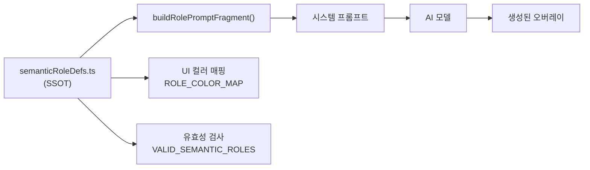
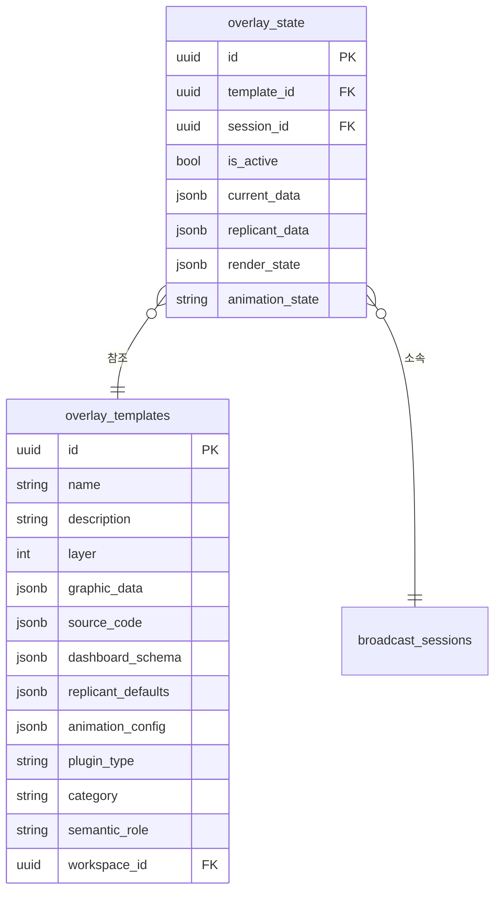

# Phase 0: 데이터 모델링

> "데이터 모델이 곧 제품 스펙이다. 스키마가 먼저 정립되어야 코드를 쓸 수 있다."

---

## 1. Why 데이터 모델링이 첫 단계인가

방송 그래픽 시스템에서 데이터 모델링이 가장 먼저 와야 하는 이유는 세 가지다:

1. **렌더러와 에디터가 같은 데이터를 바라본다**: 렌더러(Phase 1)와 플러그인 에디터(Phase 2)는 동일한 `overlay_templates` 테이블을 기반으로 동작한다. 스키마가 먼저 정의되어야 두 컴포넌트가 일관된 데이터로 통신할 수 있다.

2. **DB 스키마는 계약(Contract)이다**: `source_code` 컬럼이 JSONB `{ html, css, js }` 구조라는 계약이 있어야, 에디터는 3개 탭을 만들고 렌더러는 iframe srcdoc을 조립할 수 있다.

3. **TypeScript 타입은 실시간 문서다**: `database.types.ts`는 Supabase CLI로 생성된 단일 진실 공급원(SSOT)이다. 이 타입을 중심으로 모든 프론트엔드 코드의 데이터 흐름이 검증된다.

---

## 2. 핵심 엔티티: `overlay_templates`

### 2.1 테이블 구조 (초기 스키마)

파일: `/home/genk/topProject/2026.WebCg-K/supabase/migrations/202602070001_overlay_templates.sql`

```sql
CREATE TABLE IF NOT EXISTS overlay_templates (
  id UUID PRIMARY KEY DEFAULT gen_random_uuid(),
  owner_id UUID REFERENCES auth.users(id) ON DELETE SET NULL,
  name TEXT NOT NULL,
  description TEXT,
  layer INT DEFAULT 2,
  graphic_data JSONB NOT NULL DEFAULT '[]',     -- GraphicElement[] (SVG 모드)
  data_source JSONB,
  refresh_interval INT,
  animation_config JSONB DEFAULT '{"in": {"type": "fade", "duration": 500}, "out": {"type": "fade", "duration": 300}}',
  is_public BOOLEAN DEFAULT FALSE,
  created_at TIMESTAMPTZ DEFAULT NOW(),
  updated_at TIMESTAMPTZ DEFAULT NOW()
);
```

초기 설계는 NodeCG 스타일의 `graphic_data`(SVG 요소 배열)만 지원했다. 이후 플러그인 시스템(Phase 0)에서 HTML/CSS/JS 기반으로 확장된다.

### 2.2 플러그인 시스템 확장 (2026-04-30)

파일: `/home/genk/topProject/2026.WebCg-K/supabase/migrations/202604300001_overlay_plugin_system.sql`

```sql
-- plugin_type: 렌더링 분기 키
ALTER TABLE overlay_templates
  ADD COLUMN IF NOT EXISTS plugin_type TEXT DEFAULT 'svg';

-- source_code: HTML 플러그인의 소스 코드 (JSON: { html, css, js })
ALTER TABLE overlay_templates
  ADD COLUMN IF NOT EXISTS source_code JSONB;

-- dashboard_schema: 대시보드 패널 자동 생성용 JSON Schema
ALTER TABLE overlay_templates
  ADD COLUMN IF NOT EXISTS dashboard_schema JSONB;

-- replicant_defaults: Replicant(실시간 데이터 바인딩) 기본값
ALTER TABLE overlay_templates
  ADD COLUMN IF NOT EXISTS replicant_defaults JSONB;
```

**확장 이유**: 별도 테이블을 만들지 않고 `ALTER TABLE ADD COLUMN`을 선택했다:
- 기존 SVG 오버레이(수백 개)와 새로운 HTML 플러그인이 공존 가능
- `plugin_type DEFAULT 'svg'`로 하위 호환 보장
- `overlay_state`와의 조인 로직 변경 불필요
- RLS, Realtime 설정 중복 방지

### 2.3 보강된 컬럼들

추후 단계에서 아래 컬럼들이 추가되었다:

| 컬럼 | 추가 시점 | 용도 |
|------|----------|------|
| `ai_metadata` | Phase 4 | AI 생성 메타데이터 (모델, 프롬프트, 생성 시간) |
| `ai_prompt` | Phase 4 | 템플릿 생성에 사용된 원본 프롬프트 |
| `semantic_role` | Phase 8 | 의미적 역할 (name, subtitle, title 등) |
| `tags` | Phase 5 | 템플릿 분류 및 검색용 태그 배열 |
| `category` | Phase 8 | `cg_panel` / `widget` 분류 (아래 설명) |
| `grid_template_id` | Phase 4 | Zone-aware 생성을 위한 그리드 참조 |
| `zone_ids` | Phase 4 | 특정 존 바인딩 |
| `workspace_id` | Phase 9 | 워크스페이스 격리 |

---

## 3. TypeScript 타입 시스템

### 3.1 Database 타입 (자동 생성)

파일: `/home/genk/topProject/2026.WebCg-K/webcg-k/src/lib/database.types.ts`

Supabase CLI `gen types` 명령어로 생성된 파일로, 모든 테이블의 Row/Insert/Update 타입을 포함한다. 중요한 점:

- **`Json` 타입**: `string | number | boolean | null | { [key: string]: Json \| undefined } | Json[]` — JSONB 컬럼은 모두 이 타입으로 표현된다.
- **`Tables<"overlay_templates">`**: Row 타입 조회 헬퍼. `source_code`, `dashboard_schema` 등이 `Json`으로 추론된다.
- **Idiom**: 프론트엔드에서는 이 타입을 직접 사용하지 않고, `overlayTypes.ts`의 확장 인터페이스로 한 번 래핑하여 사용한다.

### 3.2 애플리케이션 타입 (overlayTypes.ts)

파일: `/home/genk/topProject/2026.WebCg-K/webcg-k/src/lib/overlayTypes.ts`

DB의 Raw JSONB 타입을 구체적인 TypeScript 인터페이스로 변환한다.

```typescript
// 플러그인 소스 코드 (HTML+CSS+JS 3파일 구조)
export interface PluginSourceCode {
  html: string;
  css: string;
  js: string;
}

// 대시보드 스키마 프로퍼티 (JSON Schema 기반)
export interface DashboardSchemaProperty {
  type: "string" | "number" | "boolean" | "color" | "select" | "array";
  title: string;
  default?: unknown;
  description?: string;
  enum?: string[];
  options?: { label: string; value: unknown }[];
  min?: number;
  max?: number;
  step?: number;
}

// 대시보드 스키마
export interface DashboardSchema {
  properties: Record<string, DashboardSchemaProperty>;
}

// 확장된 overlay_templates 행
export interface OverlayTemplateExtended {
  id: string;
  plugin_type: PluginType;       // "svg" | "html" | "semantic"
  source_code: PluginSourceCode | null;
  dashboard_schema: DashboardSchema | null;
  replicant_defaults: Record<string, unknown> | null;
  // ...
}
```

---

## 4. 핵심 설계 결정

### 4.1 Why pure HTML/CSS/JS (not React/Svelte)?

방송 그래픽은 한 번 로드되면 24시간 연속으로 동작해야 한다. React나 Svelte 같은 프레임워크는:

- **번들 크기**: React + ReactDOM 최소 40KB. 방송 1픽셀의 가치는 크지만, 40KB의 JS는 24시간 연속 가동 시 GC 부담이 누적된다.
- **런타임 의존성**: 프레임워크 버전 업데이트 시 모든 템플릿을 재배포해야 한다.
- **iframe 격리**: 플러그인은 sandboxed iframe에서 실행된다. 프레임워크 CDN을 iframe 내부에서 로드해야 하는데, `sandbox="allow-scripts"`만으로는 불가능하다.

결론: **방송 그래픽은 순수 HTML/CSS/JS로 작성하고, 프레임워크가 필요한 복잡한 UI는 부모 애플리케이션(Controller)에서 담당한다.**

### 4.2 Why JSONB for `dashboard_schema`?

대시보드 스키마는 플러그인마다 필드 구조가 완전히 다르다. 관계형 테이블로 분리하면:

```sql
-- 안티패턴: 필드별 별도 테이블
CREATE TABLE dashboard_fields (
  id UUID PRIMARY KEY,
  template_id UUID REFERENCES overlay_templates(id),
  field_name TEXT NOT NULL,
  field_type TEXT NOT NULL,
  default_value JSONB,
  min_value INT,
  max_value INT
);
```

이 방식은:
- 플러그인 로드 시 N+1 쿼리 발생
- 스키마 변경 시 마이그레이션 필요
- JSON Schema의 중첩 구조(oneOf, allOf 등) 표현 불가

JSONB 단일 컬럼으로 저장하면:
- 한 번의 쿼리로 스키마 전체를 읽고 씀
- 구조 변경이 자유로움 (스키마-less)
- `@monaco-editor/react`의 JSON 편집기와 직접 호환
- Supabase Realtime으로 스키마 변경 전파 가능

```typescript
// 저장 예시
{
  "properties": {
    "homeScore": {
      "type": "number",
      "title": "홈 점수",
      "default": 0,
      "min": 0,
      "max": 999
    },
    "teamName": {
      "type": "string",
      "title": "팀 이름",
      "default": "HOME"
    },
    "bgColor": {
      "type": "color",
      "title": "배경색",
      "default": "#ff0000"
    }
  }
}
```

### 4.3 Why `category`-based separation (`cg_panel` vs `widget`)?

방송 그래픽은 목적에 따라 내부 로직이 완전히 다르다:

| 카테고리 | 설명 | 데이터 바인딩 | 예시 |
|----------|------|--------------|------|
| **`cg_panel`** | 방송용 자막 (AI 큐시트 대상) | `replicant_data`에 의존, 외부에서 데이터 주입 | 자막, 이름표, 인용구 |
| **`widget`** | 기능성 위젯 | 자체 Data Fetcher 내장, 상시 독립 실행 | 날씨, 시계, 스코어보드 |

이분법적 분류가 필요한 이유:
1. **AI 큐시트의 템플릿 매칭 로직이 단순해진다**: `category='cg_panel'`인 템플릿만 매칭 대상으로 삼으면 된다.
2. **렌더러의 생명주기 관리가 명확해진다**: `widget`은 세션과 무관하게 항상 표시되고, `cg_panel`은 송출 명령에 따라 show/hide가 제어된다.
3. **에디터 UX를 다르게 구성할 수 있다**: `cg_panel`은 Replicant 데이터 편집 UI를 강조하고, `widget`은 데이터소스 설정 UI를 강조한다.

---

## 5. SemanticRole: AI 프롬프팅과의 연결

파일: `/home/genk/topProject/2026.WebCg-K/webcg-k/src/lib/semanticRoleDefs.ts`

SemanticRole은 "이 텍스트 요소가 화면에서 어떤 의미적 역할을 하는가"를 정의한다. 이 개념이 중요한 이유는 **AI가 프롬프트만 보고 CG를 생성할 때, 각 텍스트의 시각적 중요도(importance)와 배치(zone)를 추론해야 하기 때문**이다.

```typescript
export const SEMANTIC_ROLE_DEFS: SemanticRoleDef[] = [
  {
    role: "name",
    label: "이름",
    description: "인물 이름 (홍길동)",
    importanceHint: "4-5 (가장 두드러지게)",
    typicalZone: "bottom_bar",
  },
  {
    role: "subtitle",
    label: "부제목",
    description: "부제목/직함 (서울시장)",
    importanceHint: "3-4",
    typicalZone: "bottom_bar",
  },
  {
    role: "title",
    label: "제목",
    description: "프로그램/섹션 제목",
    importanceHint: "4-5",
    typicalZone: "top_bar",
  },
  {
    role: "stat",
    label: "통계",
    description: "통계 수치 (72%, 1,234건)",
    importanceHint: "4-5 (충격적인 수치는 최대)",
    typicalZone: "center",
  },
  {
    role: "quote",
    label: "인용",
    description: "인용문/발언",
    importanceHint: "3-4",
    typicalZone: "center",
  },
  {
    role: "label",
    label: "태그",
    description: "태그/분류/배지 (LIVE, 속보, 단독)",
    importanceHint: "2-3",
    typicalZone: "top_bar",
  },
];
```

### 5.1 역할과 중요성

- **SSOT (Single Source of Truth)**: 모든 SemanticRole 정의가 이 파일 하나에 집중되어 있다. 새 role 추가 시 이 파일만 수정하면 AI 프롬프트, UI 매핑, 컬러 맵이 자동 갱신된다.
- **프롬프트 자동 생성**: `buildRolePromptFragment()` 함수가 시스템 프롬프트에 주입할 role 설명 문자열을 생성한다. 새 role을 추가하면 프롬프트에도 자동 포함된다.
- **importanceHint**: AI에게 각 텍스트 요소의 상대적 중요도를 1-5 척도로 알려준다. 이를 바탕으로 AI가 폰트 크기, 굵기, 색상 대비를 적절히 조절한다.
- **typicalZone**: role별 일반적인 배치 영역을 정의한다. `bottom_bar`(자막 영역), `top_bar`(제목 영역), `center`(중앙 강조)로 구분된다.

### 5.2 데이터 흐름



---

## 6. 전체 ER 다이어그램



---

## 7. 요약

- **데이터 모델은 모든 Phase의 기초다**: 렌더러, 에디터, AI 생성기가 모두 `overlay_templates` 테이블을 중심으로 동작한다.
- **JSONB를 두려워하지 말자**: 방송 그래픽처럼 필드 구조가 가변적인 도메인에서는 JSONB가 정규화된 관계형 테이블보다 실용적이다.
- **SemanticRole은 AI와 인간의 브릿지다**: 기계가 이해할 수 있는 role 정의가 있어야 AI가 사람이 기대하는 CG를 생성할 수 있다.
- **category는 아키텍처 결정이다**: 단순한 태그가 아닌, 렌더링 생명주기와 AI 매칭 로직을 결정하는 핵심 속성이다.
