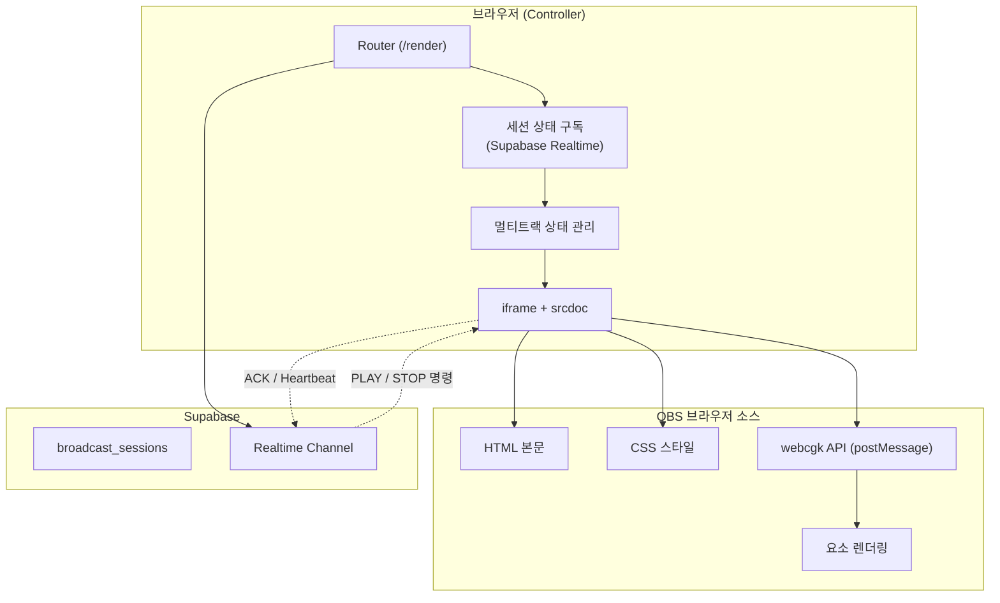
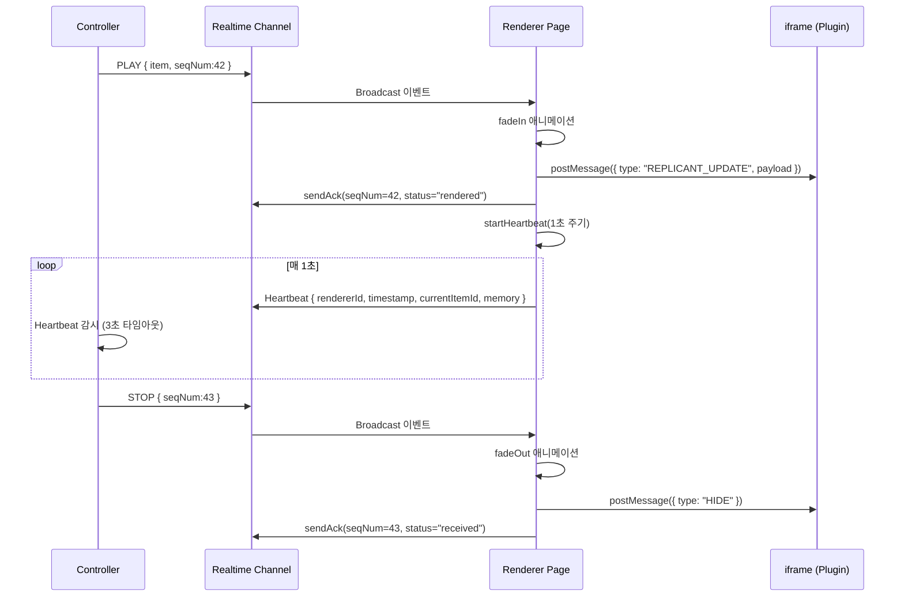
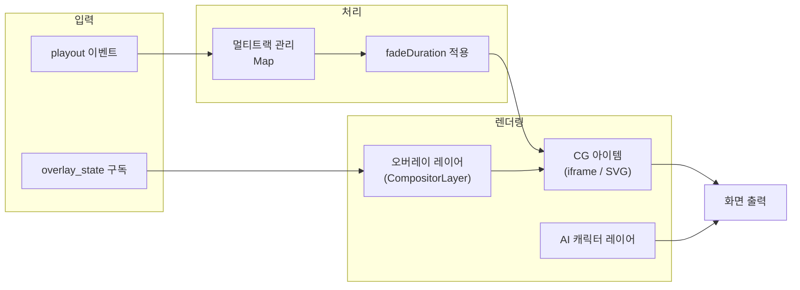

# Phase 1: 렌더러

> "Output First — 그래픽이 화면에 보여야 그 다음을 논할 수 있다."

---

## 1. Why 렌더러가 첫 번째인가

출력 우선(Output First) 원칙에 따라, 시스템에서 가장 먼저 만들어야 할 것은 **그래픽을 실제로 화면에 표시하는 렌더러**다.

1. **가장 짧은 피드백 루프**: HTML/CSS/JS로 작성한 그래픽이 OBS 브라우저 소스에서 1초라도 빨리 표시되어야, 이후 모든 도구(에디터, AI 생성기)의 출력을 검증할 수 있다.
2. **프로토콜 확정**: 렌더러는 컨트롤러와의 통신 프로토콜(postMessage 스펙, ACK/Heartbeat)을 정의한다. 이 프로토콜이 먼저 확정되어야 컨트롤러와 에디터가 같은 규약으로 통신할 수 있다.
3. **OBS 바인딩**: OBS 브라우저 소스는 독특한 제약(sandbox, 투명 배경, 24시간 연속 가동)이 있다. 이 제약들을 Phase 1에서 모두 해결해야 이후 단계에서 예상치 못한 OBS 이슈로 후퇴하지 않는다.

---

## 2. 아키텍처 개요



---

## 3. iframe + srcdoc 아키텍처

### 3.1 기본 구조

파일: `/home/genk/topProject/2026.WebCg-K/webcg-k/src/routes/render.tsx`

렌더러는 단일 SPA 페이지로, URL 쿼리 파라미터로 동작이 결정된다:

```
/render?sessionId=xxx&resolution=1080p
/render?sessionId=xxx&resolution=4k&tag=viewer
```

- **sessionId**: 연결할 방송 세션 ID. 없으면 대기 화면 표시.
- **resolution**: `1080p`(1920x1080) 또는 `4k`(3840x2160). OBS 캔버스 해상도와 일치해야 한다.
- **tag** (선택): 특정 태그의 오버레이만 필터링. 같은 세션에 여러 OBS 브라우저 소스를 연결할 때 사용.

### 3.2 srcdoc 생성 (단일 원본)

파일: `/home/genk/topProject/2026.WebCg-K/webcg-k/src/lib/webcgkSrcdoc.ts`

```typescript
export function buildPluginSrcdoc({
  html, css, js,
  width = 1920, height = 1080,
  autoShow = false,
}: SrcdocOptions): string {
  return `<!DOCTYPE html>
<html>
<head>
  <style>
    * { margin: 0; padding: 0; box-sizing: border-box; }
    body { width: ${width}px; height: ${height}px; overflow: hidden; background: transparent; }
    ${css}
  </style>
</head>
<body>
  ${html}
  <script>${WEBCGK_API_INLINE}</script>
  <script>try { ${js} } catch(e) { console.error(e); }</script>
</body>
</html>`;
}
```

**srcdoc을 선택한 이유**: `src` 속성 대신 `srcdoc`을 사용하면 별도의 서버 엔드포인트 없이 인라인으로 HTML/CSS/JS를 주입할 수 있다. `sandbox="allow-scripts"`와 결합하면 플러그인 코드가 부모 DOM에 접근할 수 없어 보안이 보장된다.

이 모듈은 WebCG-K 전체에서 **유일하게** srcdoc을 생성하는 곳이다. 과거에는 `GraphicPreviewRenderer.tsx`, `Canvas.tsx`, `CompositorLayer.tsx`, `AnimatedGraphicRenderer.tsx` 4곳에서 각각 srcdoc을 생성했는데, API 동작이 미묘하게 달라 불일치가 발생했다. 하나로 통일하여 API 스펙 변경 시 한 곳만 수정하면 된다.

---

## 4. webcgk API 브릿지 (postMessage 프로토콜)

### 4.1 iframe 내부 API

파일: `/home/genk/topProject/2026.WebCg-K/webcg-k/src/components/Overlay/PluginEditor/lib/webcgk-api.ts`

iframe 내부에 주입되는 JavaScript로, `window.webcgk` 객체를 생성한다. 부모 페이지와 iframe 사이의 유일한 통신 채널이다.

```javascript
window.webcgk = {
  // 데이터 변경 리스너
  onData: function(cb) { ... },

  // SHOW/HIDE 애니메이션 리스너
  onShow: function(cb) { ... },
  onHide: function(cb) { ... },

  // iframe 준비 완료 리스너
  onReady: function(cb) { ... },

  // 현재 데이터 조회
  getData: function() { return _data; },

  // 표시 상태 확인
  isVisible: function() { return _isVisible; },

  // 부모로 메시지 전송
  sendToParent: function(type, payload) { ... }
};
```

### 4.2 메시지 프로토콜

**부모 -> iframe**:

| 메시지 타입 | 페이로드 | 설명 |
|------------|---------|------|
| `REPLICANT_UPDATE` | `Record<string, unknown>` | 실시간 데이터 갱신 (점수, 이름 등) |
| `SHOW` | 없음 | fadeIn 애니메이션 트리거 |
| `HIDE` | 없음 | fadeOut 애니메이션 트리거 |
| `INIT` | 초기 데이터 | 초기화 + onReady 콜백 |

**iframe -> 부모**:

| 메시지 타입 | 설명 |
|------------|------|
| `PLUGIN_READY` | iframe 로드 완료 |
| `sendToParent(type, payload)` | 커스텀 액션 (START_TIMER, INCREMENT_SCORE 등) |

### 4.3 컨트롤러 -> iframe 통신 시퀀스



---

## 5. ACK/Heartbeat 프로토콜

파일: `/home/genk/topProject/2026.WebCg-K/webcg-k/src/lib/ackProtocol.ts`

### 5.1 동기

Supabase Realtime의 Broadcast는 **Fire-and-Forget** 방식이다. 컨트롤러가 "PLAY" 이벤트를 보내도 렌더러가 실제로 수신했는지 알 수 없다. 네트워크 순간 끊김 시 렌더러는 이전 CG를 계속 표시하는 **State Drift** 현상이 발생한다.

### 5.2 ACK (등기우편 개념)

```typescript
// 컨트롤러: seqNum을 포함한 명령 발행
channel.send({
  type: "broadcast",
  event: "playout",
  payload: { action: "PLAY", item: {...}, seqNum: 42 }
});

// 렌더러: ACK 응답
export function sendAck(channel, seqNum, status) {
  channel.send({
    type: "broadcast",
    event: "ack",
    payload: { seqNum, status } // "received" | "rendered" | "error"
  });
}
```

**주요 설계 포인트**:
- **seqNum**: 컨트롤러가 발행하는 단조 증가 시퀀스 번호. ACK가 일정 시간 내에 오지 않으면 재전송.
- **2-phase ACK**: `received`(명령 도착) -> `rendered`(화면 출력 완료). fade-in이 끝난 후에야 `rendered` 응답.
- **에러 전파**: status=`error`일 때 errorMessage로 구체적 원인 전달.

### 5.3 Heartbeat (심박 모니터 개념)

OBS 브라우저 소스는 24시간 무인 가동된다. 메모리 누수나 크래시로 렌더러가 응답 불가 상태가 되어도 컨트롤러에 알림이 없으면 PD가 인지하지 못한다.

```typescript
// 렌더러 측: 1초 주기 Heartbeat 발신
export function startHeartbeat(channel, getCurrentItemId, intervalMs = 1000) {
  const rendererId = getOrCreateRendererId();
  setInterval(() => {
    channel.send({
      type: "broadcast",
      event: "heartbeat",
      payload: {
        rendererId,
        timestamp: Date.now(),
        currentItemId: getCurrentItemId(),  // 현재 표시 중인 CG ID
        memoryUsed: performance.memory?.usedJSHeapSize,
        memoryLimit: performance.memory?.jsHeapSizeLimit,
      }
    });
  }, 1000);
}
```

**컨트롤러 측 감시 로직**:

```typescript
export function createHeartbeatMonitor() {
  // 3초 이상 Heartbeat 없음 = "disconnected"
  // 1.5초 이상 없음 = "delayed"
  // 정상 수신 = "connected"
}
```

### 5.4 State Drift 감지

```typescript
export function detectStateDrift(
  pgmBlockId: string | null,          // 컨트롤러가 송출 중이라고 생각하는 ID
  rendererCurrentItemId: string | null, // 렌더러가 실제로 표시 중인 ID
): boolean {
  if (!pgmBlockId && !rendererCurrentItemId) return false;
  if (!pgmBlockId || !rendererCurrentItemId) return true;
  return pgmBlockId !== rendererCurrentItemId;
}
```

### 5.5 Micro-Flush: 메모리 자가 치유

```typescript
export function startMemoryMonitor(getCurrentItemId, options?) {
  const { intervalMs = 5 * 60 * 1000, flushThreshold = 0.8 } = options;
  setInterval(() => {
    const usage = memory.usedJSHeapSize / memory.jsHeapSizeLimit;
    if (usage > flushThreshold) {
      // 현재 PGM 상태를 sessionStorage에 저장
      sessionStorage.setItem("webcgk_pgm_restore", getCurrentItemId());
      // 페이지 리로드 (OBS는 URL 유지하므로 자동 재접속)
      location.reload();
    }
  }, 5 * 60 * 1000);  // 5분 주기
}
```

**동작 원리**: OBS 브라우저 소스가 24시간 연속 가동되면서 DOM 노드 누적, 이벤트 리스너 해제 실패 등으로 메모리가 점진적으로 증가한다. 80% 임계값을 초과하면 sessionStorage에 현재 상태를 저장하고 location.reload()를 실행한다. OBS는 URL을 유지하므로 리로드 후 자동으로 같은 세션에 재연결된다. 시청자가 인지하기 어려운 수준(~100ms)의 순간 끊김만 발생한다.

### 5.6 생존 참조 패턴

```typescript
const tracksRef = useRef<Map<number, TrackState>>(new Map());
useEffect(() => { tracksRef.current = tracks; }, [tracks]);
```

Heartbeat 콜백이 클로저에 오래된 `tracks`를 캡처하는 문제를 방지하기 위해 ref 패턴을 사용한다. `startHeartbeat`에 전달된 `getCurrentItemId`는 `tracksRef.current`를 읽으므로 항상 최신 상태를 반영한다.

---

## 6. 렌더러의 렌더링 파이프라인



렌더러는 세 가지 종류의 콘텐츠를 동시에 렌더링한다:

1. **멀티트랙 CG 아이템** (Track 0, 1, 2...): fade-in/out 애니메이션 적용, trackId 기준 Z-index 정렬
2. **오버레이 레이어** (CompositorLayer): `overlay_state`의 `is_active=true`인 모든 오버레이를 표시. SilentErrorBoundary로 개별 격리.
3. **AI 캐릭터 레이어** (AiCharacterLayer): Rive 애니메이션 캐릭터를 별도 레이어로 렌더링.

---

## 7. 요약

- **렌더러는 시스템의 시작이자 끝이다**: 모든 CG는 결국 이 렌더러를 통해 화면에 출력된다.
- **iframe + srcdoc은 격리와 단순함의 균형이다**: sandbox 보안을 유지하면서 별도 서버 없이 플러그인 코드를 실행한다.
- **ACK/Heartbeat는 무인 운영의 필수 인프라다**: Fire-and-Forget 채널의 한계를 보완하여 State Drift를 방지하고, 렌더러의 생존을 24시간 감시한다.
- **Micro-Flush는 현실적인 메모리 관리 전략이다**: 완벽한 메모리 누수 방지보다, 주기적인 리셋으로 안정성을 확보하는 실용적 접근.
