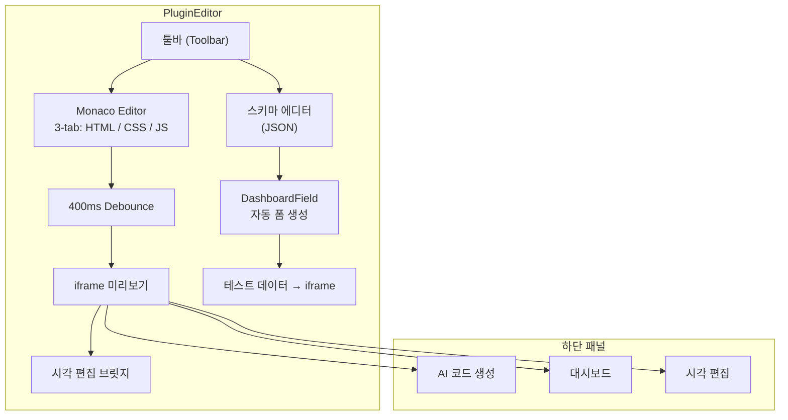
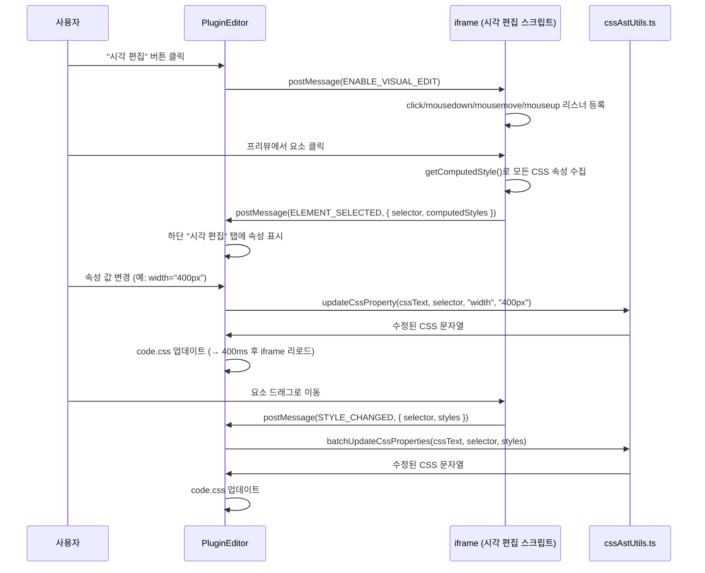
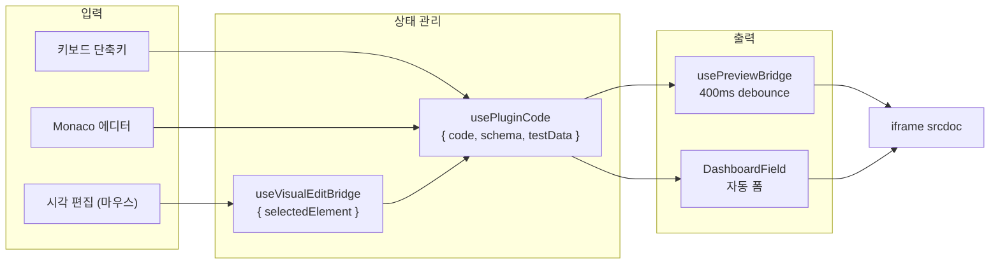

# Phase 2: 플러그인 에디터

> "Edit Second — 출력이 확인된 후에야 편집 도구를 만든다."

---

## 1. Why 플러그인 에디터가 두 번째인가

렌더러(Phase 1)가 그래픽을 화면에 표시할 수 있게 된 후에야 에디터를 만든다. 그 이유는:

1. **즉시 피드백 가능**: 에디터에서 수정한 코드가 렌더러와 동일한 iframe/srcdoc 방식으로 프리뷰되어야 한다. 렌더러가 먼저 있어야 "에디터에서 보이는 대로 송출된다"가 보장된다.
2. **프로토콜 재사용**: 에디터의 프리뷰 iframe은 송출 렌더러와 동일한 `webcgk API`를 사용한다. 플러그인 개발자는 로컬 프리뷰와 실제 송출 환경의 차이를 느끼지 못해야 한다.
3. **Schema 기반 UX 결정**: `dashboard_schema`(Phase 0에서 정의)가 있어야 대시보드 입력 폼을 자동 생성할 수 있다. 데이터 모델 없이 에디터를 만들면 폼 하드코딩이 필요하다.

---

## 2. 전체 아키텍처



에디터는 크게 **좌측 코드 패널**, **가로 리사이저**, **우측 프리뷰+하단 패널**의 3영역 레이아웃이다.

---

## 3. Monaco Editor 3-Tab 시스템

파일: `/home/genk/topProject/2026.WebCg-K/webcg-k/src/components/Overlay/PluginEditor/index.tsx`

```typescript
const tabConfig = [
  { key: "html", label: "HTML", lang: "html" },
  { key: "css", label: "CSS", lang: "css" },
  { key: "js", label: "JS", lang: "javascript" },
  { key: "schema", label: "Schema", lang: "json" },
];
```

4개 탭으로 구성된 에디터:

| 탭 | 언어 모드 | Monaco 설정 | 용도 |
|----|----------|-------------|------|
| **HTML** | `html` | 자동 완성, 태그 매칭 | 그래픽 DOM 구조 정의 |
| **CSS** | `css` | 자동 완성, 벤더 프리픽스 | 스타일링 (1920x1080 기준) |
| **JS** | `javascript` | 구문 강조, 에러 표시 | 런타임 로직 (타이머, 데이터 조작) |
| **Schema** | `json` | 유효성 검사 | Dashboard JSON Schema 편집 |

### Monaco 에디터 옵션

```typescript
<Editor
  theme="vs-dark"
  options={{
    minimap: { enabled: false },    // 방송 그래픽은 코드량이 적음
    fontSize: 13,                    // 1080p 모니터에서 가독성
    wordWrap: "on",                  // 긴 줄 자동 줄바꿈
    tabSize: 2,                      // 방송 업계 관행
    scrollBeyondLastLine: false,
    automaticLayout: true,           // 리사이저 연동
    padding: { top: 8 },
  }}
/>
```

---

## 4. 실시간 프리뷰 (400ms Debounce)

파일: `/home/genk/topProject/2026.WebCg-K/webcg-k/src/components/Overlay/PluginEditor/hooks/usePreviewBridge.ts`

```typescript
// Debounced preview update
useEffect(() => {
  if (updateTimerRef.current) clearTimeout(updateTimerRef.current);
  updateTimerRef.current = setTimeout(() => {
    if (iframeRef.current) {
      iframeRef.current.srcdoc = buildSrcdoc(code);
      setTimeout(() => {
        sendDataToPreview(testDataRef.current);
        // 시각 편집 상태 복원...
      }, 200);
    }
  }, 400);  // 400ms debounce

  return () => {
    if (updateTimerRef.current) clearTimeout(updateTimerRef.current);
  };
}, [code, ...]);
```

**동작 방식**:
1. 사용자가 코드를 입력할 때마다 400ms 타이머가 리셋된다.
2. 입력이 멈춘 후 400ms가 지나면 iframe srcdoc을 갱신한다.
3. srcdoc 설정 후 200ms를 더 기다렸다가 테스트 데이터를 postMessage로 전송한다.
4. 시각 편집 모드가 활성화되어 있으면 SHOW 메시지와 시각 편집 상태를 복원한다.

**400ms를 선택한 이유**: 방송 그래픽 편집은 IDE만큼 빠른 반응성이 필요하지 않다. 오히려 불필요한 리렌더링으로 iframe이 깜빡이는 것이 더 큰 문제다. 400ms는 타이핑 도중에는 갱신되지 않을 정도로 길지만, 수정 후 "잠시만 기다리면" 바로 확인 가능한 정도로 짧다.

---

## 5. 대시보드 + DashboardField 자동 폼 생성

### 5.1 스키마 기반 자동 생성

Dashboard Panel은 `dashboard_schema` JSON을 읽어 자동으로 입력 폼을 생성한다.

```typescript
// 스키마 정의 예시 (JSON)
{
  "properties": {
    "homeScore": { "type": "number", "title": "홈 점수", "default": 0, "min": 0 },
    "guestScore": { "type": "number", "title": "원정 점수", "default": 0 },
    "homeTeam": { "type": "string", "title": "홈 팀명", "default": "HOME" },
    "period": { "type": "select", "title": "피리어드", "options": [
      { "label": "1P", "value": "1" },
      { "label": "2P", "value": "2" },
      { "label": "3P", "value": "3" }
    ]},
    "bgColor": { "type": "color", "title": "배경색", "default": "#ff0000" }
  }
}
```

### 5.2 DashboardField 컴포넌트

파일: `/home/genk/topProject/2026.WebCg-K/webcg-k/src/components/Overlay/PluginEditor/components/DashboardField.tsx`

타입별 자동 렌더링:

```typescript
function DashboardField({ prop, value, onChange }) {
  switch (prop.type) {
    case "number":
      // "-" 버튼 | number input | "+" 버튼 (min/max/step 적용)
    case "boolean":
      // ON/OFF 토글 버튼
    case "color":
      // `<input type="color">` 네이티브 피커
    case "select":
      // `<select>` 드롭다운
    case "string":
      // 일반 텍스트 input 또는 hex 감지 시 color picker
  }
}
```

특이사항: `isColorLikeField` 함수가 `string` 타입 필드 중에서 색상처럼 보이는 필드(제목에 "color"/"bg"/"background" 포함, 값이 hex 패턴)를 자동으로 color picker로 변환한다.

---

## 6. 시각 편집 브릿지

파일: `/home/genk/topProject/2026.WebCg-K/webcg-k/src/lib/visualEditBridge.ts`

플러그인 에디터의 핵심 차별화 기능이다. iframe 내부에서 마우스로 요소를 선택하고, 드래그로 위치/크기를 변경하면 CSS가 자동 수정된다.

### 6.1 아키텍처



### 6.2 iframe 내부 동작

시각 편집 스크립트는 iframe 내부에 인라인으로 주입된다. `getVisualEditBridgeInline()` 함수가 반환하는 문자열이 `<script>` 태그로 포함된다.

```javascript
// 핵심 기능:
// 1. 요소 클릭 → getUniqueSelector()로 CSS 선택자 생성
// 2. 선택된 요소에 8방향 리사이즈 핸들 오버레이 표시
// 3. 드래그 → position: relative + left/top 조정
// 4. 리사이즈 → width/height 조정 (shift 키 무시)
// 5. 변경 완료 → postMessage로 부모에 STYLE_CHANGED 전송
```

스크립트는 `data-viz-handle` 속성으로 리사이즈 핸들을 식별하여, 핸들 클릭이 요소 선택 이벤트와 충돌하지 않도록 방지한다.

### 6.3 CSS AST 유틸리티

파일: `/home/genk/topProject/2026.WebCg-K/webcg-k/src/lib/cssAstUtils.ts`

시각 편집으로 수정된 스타일을 CSS 텍스트에 반영하는 유틸리티. `@adobe/css-tools` 라이브러리를 사용한다.

```typescript
/** 단일 속성 업데이트 (없으면 추가) */
export function updateCssProperty(cssText, selector, property, value): string;

/** 여러 속성 일괄 업데이트 */
export function batchUpdateCssProperties(cssText, selector, styles): string;

/** 특정 선택자-속성의 값 조회 */
export function getCssPropertyValue(cssText, selector, property): string | undefined;

/** 선택자의 모든 속성을 객체로 조회 */
export function getCssRuleProperties(cssText, selector): Record<string, string>;
```

**postcss에서 @adobe/css-tools로 마이그레이션한 이유**: `postcss`는 Node 전용 모듈(`path`, `fs`, `source-map-js`)에 의존하여 Vite 브라우저 번들에서 externalization 경고가 발생했다. `@adobe/css-tools`는 순수 JavaScript로 브라우저에서 동기 파싱이 가능하여, 경고 없이 번들링되고 코드도 더 단순하다.

선택자 매칭 로직:
1. 정확히 일치하는 선택자(하나의 rule, 하나의 selector)를 우선 검색
2. class-only 선택자(`.myclass`)는 다른 rule의 selector에 포함되어 있어도 매칭
3. 없으면 새 rule 생성

---

## 7. 리사이저 (세로 + 가로)

파일: `/home/genk/topProject/2026.WebCg-K/webcg-k/src/components/Overlay/PluginEditor/hooks/useResizer.ts`

에디터는 가로/세로 2개의 리사이즈 핸들을 가진다:

```typescript
export function useResizer() {
  // 가로: 좌측(코드) / 우측(프리뷰) 비율 (기본 55%, 25%~80% 범위)
  const [editorWidthPercent, setEditorWidthPercent] = useState(55);
  const [isDragging, setIsDragging] = useState(false);

  // 세로: 상단(프리뷰) / 하단(패널) 비율 (기본 60%, 25%~85% 범위)
  const [previewHeightPercent, setPreviewHeightPercent] = useState(60);
  const [isVDragging, setIsVDragging] = useState(false);
}
```

**동작 방식**:
1. `onMouseDown`에서 드래그 시작 시 `document.addEventListener("mousemove", ...)`로 전역 마우스 추적
2. 컨테이너 기준 clientX/clientY를 백분율로 변환
3. `document.body.style.cursor = "col-resize"`(가로) / `"row-resize"`(세로) + `userSelect = "none"`으로 드래그 중 텍스트 선택 방지
4. `onMouseUp`에서 리스너 정리

드래그 중에는 우측 프리뷰에 `pointerEvents: "none"`을 설정하여 iframe 내부의 hover 이벤트가 리사이즈 성능에 영향을 주지 않도록 한다.

---

## 8. 키보드 단축키

파일: `/home/genk/topProject/2026.WebCg-K/webcg-k/src/components/Overlay/PluginEditor/hooks/useKeyboardShortcuts.ts`

```typescript
export function useKeyboardShortcuts(handleSave, handleFormat) {
  // Ctrl+S (or Cmd+S): 저장
  useEffect(() => {
    const handler = (e) => {
      if ((e.ctrlKey || e.metaKey) && e.key === "s") {
        e.preventDefault();
        handleSave();
      }
    };
    window.addEventListener("keydown", handler);
    return () => window.removeEventListener("keydown", handler);
  }, [handleSave]);

  // Ctrl+Shift+F: 코드 포맷
  useEffect(() => {
    const handler = (e) => {
      if ((e.ctrlKey || e.metaKey) && e.shiftKey && e.key === "F") {
        e.preventDefault();
        handleFormat();
      }
    };
    window.addEventListener("keydown", handler);
    return () => window.removeEventListener("keydown", handler);
  }, [handleFormat]);
}
```

**왜 두 개의 useEffect인가?** 하나의 이벤트 리스너에서 두 단축키를 검사하는 것이 일반적이지만, React hooks의 의존성 배열 관리를 위해 분리했다. `handleSave` 변경 시에도 포맷 단축키는 재등록되지 않아야 한다.

---

## 9. Why Monaco instead of Sandpack?

| 항목 | Monaco Editor | Sandpack (CodeSandbox) |
|------|-------------|----------------------|
| **번들 크기** | ~2MB (gzip ~700KB) | ~6MB (gzip ~2MB) |
| **오프라인 동작** | 완전 지원 | CDN 의존 |
| **커스터마이징** | 테마, 키바인딩, 컴플리션 완전 제어 | 제한적 |
| **JSON 스키마 편집** | json 모드 + schema validation | 불가능 |
| **방송 그래픽 특화** | CSS 자동 완성, emmet | 웹앱 중심 |
| **초점** | 코드 에디터 자체 | 브라우저 내 전체 런타임 |

**결정적 차이**: 방송 그래픽의 코드는 HTML/CSS/JS 3개 파일로 구성되며, 각각 50-200줄 수준이다. Sandpack의 전체 Node.js 런타임은 불필요한 오버헤드다. Monaco는 코드 에디터로서의 기능에 집중하고, 실제 실행은 단순한 `srcdoc` iframe으로 처리하는 것이 더 가볍고 예측 가능하다.

---

## 10. 전체 컴포넌트 트리

```
PluginEditor
├── Toolbar
│   ├── 탭 버튼 (HTML / CSS / JS / Schema)
│   └── 저장 / 포맷 / 가져오기 버튼
├── Editor Pane (좌측)
│   ├── SchemaEditor (Schema 탭)
│   └── Monaco Editor (HTML/CSS/JS 탭)
├── 가로 리사이저 핸들
├── Preview Pane (우측)
│   ├── PreviewContainer (iframe)
│   │   ├── webcgk-api (인라인 스크립트)
│   │   └── VisualEditBridge (인라인 스크립트)
│   ├── 세로 리사이저 핸들
│   └── Bottom Panel
│       ├── AIGenerationPanel
│       ├── DashboardPanel
│       │   └── DashboardField (타입별 자동 렌더링)
│       └── Visual Edit Tab
│           ├── VizNumField / VizTextField / VizColorField
│           └── RootVarsPanel (CSS 변수 편집)
└── ImportModal (AI JSON 가져오기)
```

---

## 11. 데이터 흐름 요약



---

## 12. 요약

- **에디터는 렌더러의 미러다**: 동일한 srcdoc 생성 로직과 webcgk API를 사용하여 "에디터에서 보이는 대로 송출된다"를 보장한다.
- **400ms debounce는 실용적 선택이다**: 불필요한 iframe 리로드를 방지하면서도 충분히 빠른 피드백을 제공한다.
- **시각 편집은 에디터의 킬러 기능이다**: CSS를 몰라도 마우스로 요소를 배치할 수 있어, 디자이너와 방송 PD가 직접 템플릿을 수정할 수 있다.
- **Monaco + srcdoc 조합이 최적이다**: 프레임워크급 번들(React, Sandpack) 없이도 전문가 수준의 코드 편집 경험을 제공한다.
- **`@adobe/css-tools`는 브라우저 친화적 CSS 파서다**: postcss의 Node 의존성 문제를 해결하고, 동기 API로 코드 구조가 단순하다.
