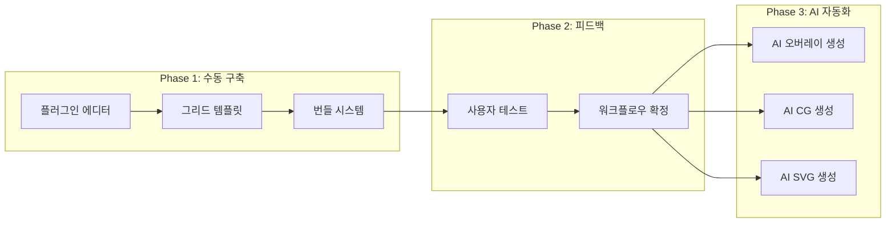
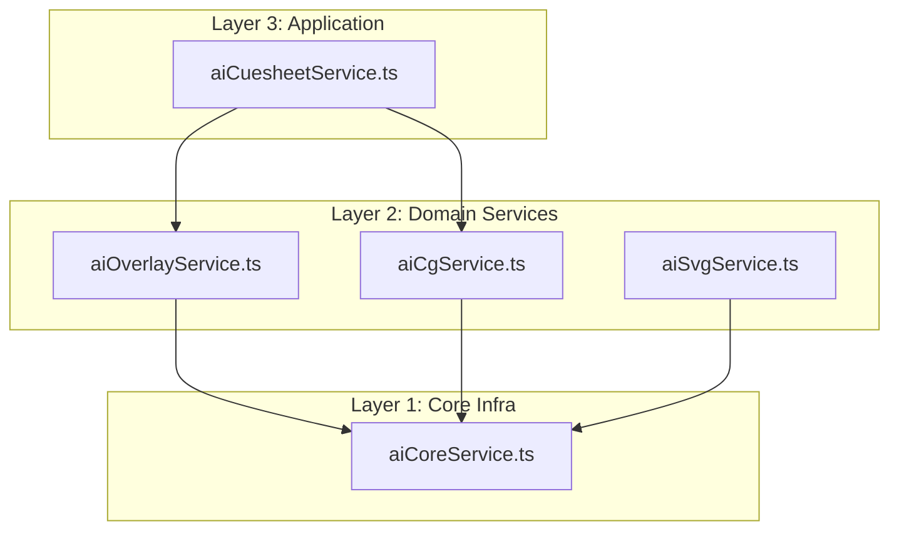
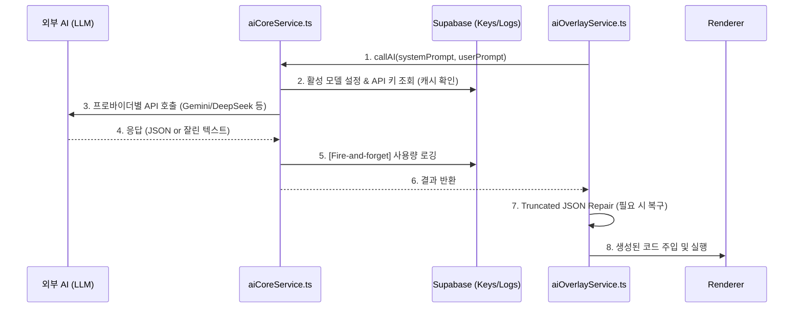

# Phase 3: AI 오버레이 생성

> **학습 목표**: WebCG-K의 3계층 AI 서비스 아키텍처를 이해하고, AI가 방송 그래픽 오버레이 코드를 생성하는 전 과정을 설명할 수 있다.

---

## 1. 왜 수동 편집이 먼저이고 AI는 나중인가?

WebCG-K의 개발 철학은 **"자동화는 세 번째 원칙(Automate Third)"** 이다. 이는 다음 순서를 의미한다.

1. **수동으로 동작하게 만든다** -- 플러그인 에디터, 그리드 템플릿, 번들 시스템을 먼저 구축
2. **수동 워크플로우를 개선한다** -- UI/UX 피드백을 통해 실제 사용 패턴을 검증
3. **그 다음에 자동화한다** -- 검증된 워크플로우 위에 AI를 얹음

이 원칙이 중요한 이유는, AI가 검증되지 않은 프로세스를 자동화하면 **잘못된 결과를 빠르게 양산**하기 때문이다. 수동 시스템이 먼저 자리잡아야 AI 출력의 품질 기준(ground truth)이 생긴다.



---

## 2. 3계층 AI 서비스 아키텍처

WebCG-K의 AI 시스템은 **3개의 계층**으로 분리되어 있으며, 각 계층은 단일 책임 원칙(Single Responsibility Principle)을 따른다.



### 2.1. Layer 1: aiCoreService.ts -- 멀티 프로바이더 코어 인프라

**파일 위치**: `/home/genk/topProject/2026.WebCg-K/webcg-k/src/services/aiCoreService.ts`

이 파일은 모든 AI 서비스가 공통으로 사용하는 **API 호출 인프라**를 제공한다. 주요 책임은 다음과 같다.

#### API 키 관리

```typescript
// aiCoreService.ts -- 프로바이더별 환경변수 매핑
const envKeys: Record<string, string> = {
    gemini: "VITE_GEMINI_API_KEY",
    deepseek: "VITE_DEEPSEEK_API_KEY",
    groq: "VITE_GROQ_API_KEY",
    github: "VITE_GITHUB_TOKEN",
    openrouter: "VITE_OPENROUTER_API_KEY",
};
```

API 키는 다음 우선순위로 조회된다:
1. `getApiKey()`: Supabase `api_keys` 테이블에서 `apiKeyId`로 조회 (암호화된 키)
2. 캐시된 키가 있으면 재사용 (`_cachedApiKey`)
3. DB 조회 실패 시 환경변수(`import.meta.env`)로 폴백

#### 모델 설정 캐시

```typescript
// 60초 TTL 캐시
let _cachedConfig: CachedModelConfig | null = null;
let _cachedConfigTimestamp = 0;
const CONFIG_CACHE_TTL_MS = 60_000;
```

`getActiveConfig()`는 Supabase `ai_model_config` 테이블에서 활성 모델(`is_active = true`)을 조회하고 60초간 캐시한다. 관리자가 모델을 전환하면 `invalidateModelCache()`를 호출하여 캐시를 강제 초기화한다.

각 `CachedModelConfig`는 다음 정보를 포함한다:
- `modelId`: 모델 식별자 (예: `gemini-3-flash-preview`)
- `provider`: 프로바이더명 (`gemini`, `deepseek`, `openrouter`, `groq`, `github`)
- `baseUrl`: API 엔드포인트
- `apiKeyId`: DB에 저장된 API 키 참조
- `systemPrompt`: DB 차원의 시스템 프롬프트 (서비스별 프롬프트와 별도)
- `generationConfig`: temperature, maxOutputTokens, thinking 설정 등

#### Reasoning 모드 감지

`isCurrentModelConfig()`는 현재 활성 모델이 **추론 모델(reasoning model)** 인지 감지한다. 프로바이더별로 감지 방식이 다르다:

- **Gemini**: `generationConfig.thinkingEnabled`
- **DeepSeek**: `generationConfig.deepseekThinking`
- **OpenRouter**: `reasoning.enabled` 또는 모델 ID 패턴 매칭 (`kimi|qwq|r1|reasoner|o1|o3`)

추론 모델에서는 `json_object` 응답 포맷이 불가능하므로(생각 과정 출력과 충돌), `callAI()`에서 자동으로 비활성화한다.

#### 재시도 로직 (Retry)

Rate Limit(HTTP 429) 발생 시 최대 2회 재시도하며, 각 재시도 사이에 10초 대기한다.

```typescript
const MAX_RETRIES = 2;
const RETRY_DELAY_MS = 10_000;
```

#### 사용량 로깅

Fire-and-forget 패턴으로 Supabase `ai_usage_logs` 테이블에 토큰 사용량을 기록한다. 로깅 실패는 무시된다.

```typescript
void (async () => {
    await supabase.from("ai_usage_logs").insert({
        model_id: modelId,
        prompt_tokens: promptTokens,
        completion_tokens: completionTokens,
        total_tokens: totalTokens,
        request_type: requestType,
        user_id: user?.id ?? null,
    });
})();
```

#### 통합 API 호출 (callAI)

`callAI()`는 모든 도메인 서비스의 공개 API 진입점이다. 내부적으로 `callOpenAICompatible()`을 호출하며, 모든 프로바이더가 **단일 OpenAI 호환 엔드포인트**로 통합되었다.

```typescript
export async function callAI(
    systemPrompt: string,  // 도메인별 시스템 프롬프트 (필수)
    userPrompt: string,    // 사용자 프롬프트
    options?: CallAiOptions,
): Promise<{ text: string; usage: any }>
```

### 2.2. Layer 2: aiOverlayService.ts -- 오버레이 전용

**파일 위치**: `/home/genk/topProject/2026.WebCg-K/webcg-k/src/services/aiOverlayService.ts`

이 서비스는 **HTML/CSS/JS 오버레이 코드**를 생성한다. `aiCgService.ts`가 `GraphicElement[]` JSON을 생성하는 것과 달리, 오버레이는 실제 브라우저에서 실행되는 웹 코드를 생성하므로 시스템 프롬프트와 출력 파싱이 완전히 다르다.

#### 시스템 프롬프트: 근본 원칙 기반

`OVERLAY_SYSTEM_PROMPT`는 구현 패턴(How-to) 대신 **근본 원칙(Fundamental Principles)** 만 정의한다.

**3대 근본 철학:**

1. **상태의 멱등성 (SSOT)**: 오버레이는 자체 상태를 소유하지 않는 순수 뷰(Dumb View). 모든 데이터는 `webcgk.onData(data)`로만 주입되며, 1번 호출되든 100번 호출되든 결과가 동일해야 한다.

2. **절대 시간 동기화**: 로컬 타이머 금지. `webcgk.computeTimerRemaining(data)`로 권위 있는 남은 시간을 구하고, `Date.now()` 기반 절대 종료 시각을 계산한다.

3. **방송 렌더링 물리 제약**: 60fps GPU 가속을 위해 `transform`/`opacity`/`filter`만 애니메이션에 사용. WCAG AA 명암비(4.5:1) 준수. 텍스트 오버플로우 방지.

#### Zone-Aware Prompting (공간 인지 프롬프트)

```typescript
// aiOverlayService.ts -- Zone 정보가 프롬프트에 동적 주입
const zoneSection = zones && zones.length > 0
    ? zones.map(zone =>
        `- Zone: "${zone.name}" (${zone.type})
          위치: x=${zone.x}px, y=${zone.y}px
          크기: ${zone.width}x${zone.height}px
          적용할 CSS: position:absolute; left:${zone.x}px; top:${zone.y}px; width:${zone.width}px; height:${zone.height}px;`
      ).join('\n')
    : "전체 화면 (1920x1080)";
```

Zone 정보가 주어지면 `#overlay` 요소가 해당 영역에 고정되어 렌더링된다. 이를 통해 방송 화면의 특정 영역(예: 하단 1/3 자막 영역)에만 그래픽이 생성되도록 제어할 수 있다.

#### ExistingCodeContext: 수정 모드

`generateOverlayCode()`는 두 가지 모드를 지원한다:

1. **신규 생성 모드**: `existingCode`가 없을 때. 프롬프트만으로 새 오버레이 생성
2. **수정 모드**: `existingCode`가 있을 때. 현재 에디터에 있는 전체 코드 스냅샷을 전달

```typescript
export interface ExistingCodeContext {
    html: string;
    css: string;
    js: string;
    dashboard_schema: { properties: Record<string, any> } | null;
}
```

**Why 코드 스냅샷?** Multi-turn 대화 히스토리를 누적하면 생성된 코드가 턴마다 반복 포함되어 토큰이 기하급수적으로 불어난다. 대신 "현재 에디터에 있는 코드 스냅샷"만 매번 전달하면 토큰 사용량이 항상 일정하며 맥락 손실도 없다.

#### Truncated JSON 복구 (Truncated JSON Repair)

복잡한 오버레이(HTML+CSS+JS+Schema)는 토큰 한도를 초과하여 JSON 문자열 중간에서 잘릴 수 있다. `parseOverlayResponse()`는 2단계로 대응한다:

**1단계**: 직접 `JSON.parse()` 시도 -- 정상 응답이면 즉시 반환

**2단계**: 잘린 JSON에서 각 필드를 정규식으로 개별 추출
- 문자열 값은 `extractJsonStringValue()`로 추출 (이스케이프 처리 포함)
- 객체 값은 `extractJsonObjectValue()`로 추출 (중괄호 짝 맞춤)

```typescript
for (const key of ["html", "css", "js"] as const) {
    const extracted = extractJsonStringValue(cleaned, key);
    if (extracted !== null) result[key] = extracted;
}
```

만약 모든 필드 추출에 실패하면 오류를 throw하여 사용자에게 더 간결한 요청을 유도한다.

### 2.3. Layer 2: aiCgService.ts -- 그래픽 요소 생성

**파일 위치**: `/home/genk/topProject/2026.WebCg-K/webcg-k/src/services/aiCgService.ts`

이 서비스는 **`GraphicElement[]` JSON 배열**을 생성한다. 시스템 프롬프트는 KBS/MBC/SBS급 방송 CG 디자이너 역할을 부여하며, 다음을 포함한다:

- **10가지 CG 유형별 레시피**: Lower Third, 속보 Top Banner, 스코어보드, 날씨 CG, 인물 크레딧, 사운드바이트, 뉴스 크롤, 타이틀 카드, 데이터 인포그래픽, 리포터 현장(OTS)
- **선언적 레이아웃 시스템**: Flexbox 기반 자동 정렬 + SVG 에디터 호환을 위한 근사 좌표 병기
- **Stagger 애니메이션**: 배경→장식→강조바→이름→직함 순으로 0, 80, 160, 240, 320ms 지연
- **프로 디자인 황금 비율**: 여백, 글자 크기 계층, 색상 설계, 시각 효과 규칙

`generateCgVariations()`는 여러 컬러 스킴(블루/화이트, 다크 레드/골드, 그린/화이트, 퍼플/핑크)으로 4가지 변형을 생성한다.

### 2.4. Layer 2: aiSvgService.ts -- SVG 생성

**파일 위치**: `/home/genk/topProject/2026.WebCg-K/webcg-k/src/services/aiSvgService.ts`

오버레이(HTML/CSS/JS)와 별도로 **SVG 그래픽 요소**를 생성한다. SVG는 XML 마크업이라는 완전히 다른 출력 포맷이므로 별도 서비스로 분리되었다.

주요 특징:
- **기하학적 도형 우선**: `<path>`(베지에 곡선) 최소화, `<rect>`, `<circle>`, `<ellipse>`, `<polygon>` 위주로 조립
- **DOMParser 유효성 검증**: 생성된 SVG를 브라우저 DOMParser로 파싱하여 문법 오류 검출
- **Chunk-of-Thought 주석**: 각 `<g>` 그룹에 `<!-- 🎨 요소명 -->` 주석을 달아 AI의 인지 유지
- **Supabase Storage 업로드**: 생성된 SVG를 Blob → File 변환 후 Supabase Storage에 업로드하고, DB `images` 테이블에 메타데이터 저장
- **스타일 프리셋**: 8가지 프리셋(news_lower, news_headline, infographic, logo_badge, bg_pattern, decoration, icon_set, transition)

### 2.5. Layer 3: aiCuesheetService.ts -- 애플리케이션 계층

AI 큐시트는 5단계 상태 기계로 동작하며, 위의 모든 서비스를 오케스트레이션한다. (자세한 내용은 별도 문서에서 다룸)

---

## 3. AI 호출 시퀀스 다이어그램

다음은 `aiCoreService.ts`를 통한 AI 호출의 전체 흐름이다:



**단계별 설명:**

| 단계 | 수행 주체 | 설명 |
|------|----------|------|
| 1 | Domain 서비스 | `callAI()`에 도메인 시스템 프롬프트와 사용자 프롬프트 전달 |
| 2 | aiCoreService | Supabase에서 활성 모델 설정 조회 (60초 캐시). API 키 조회 (메모리 캐시) |
| 3 | aiCoreService | 프로바이더별 설정 적용 후 OpenAI 호환 엔드포인트로 fetch |
| 4 | 외부 AI | API 키/모델 ID 기반으로 LLM 응답 반환 |
| 5 | aiCoreService | 응답과 별도로 fire-and-forget 사용량 로깅 |
| 6 | aiCoreService | 파싱된 응답 텍스트를 Domain 서비스로 반환 |
| 7 | Domain 서비스 | JSON이 잘렸으면 정규식 기반 복구 시도 |
| 8 | Domain 서비스 | 생성된 코드를 Renderer에 주입 |

---

## 4. Semantic Role 정의

**파일 위치**: `/home/genk/topProject/2026.WebCg-K/webcg-k/src/lib/semanticRoleDefs.ts`

Semantic Role 시스템은 AI가 생성하는 그래픽 요소에 **의미적 역할**을 부여한다. 이는 단순한 텍스트 배치를 넘어, 방송 그래픽의 정보 계층 구조를 AI가 이해하도록 돕는다.

```typescript
export interface SemanticRoleDef {
    role: SemanticRole;       // "name" | "subtitle" | "affiliation" | "title" | "stat" | "quote" | "label"
    label: string;            // UI 표시용 한글 라벨 (예: "이름")
    labelEn: string;          // 영문 라벨
    description: string;      // AI 프롬프트 설명 (예: "인물 이름 (홍길동)")
    importanceHint: string;   // 중요도 추천 범위 (예: "4-5 (가장 두드러지게)")
    typicalZone: ZoneHint;    // 일반적 배치 영역 (예: "bottom_bar")
    color: string;            // UI 표시용 Tailwind 색상
}
```

### 7가지 Semantic Role

| Role | 한글 | 중요도 | 일반적 배치 | 설명 |
|------|------|--------|------------|------|
| `name` | 이름 | 4-5 | bottom_bar | 인물 이름 (가장 두드러지게) |
| `subtitle` | 부제목 | 3-4 | bottom_bar | 부제목/직함 |
| `affiliation` | 소속 | 2-3 | bottom_bar | 소속/단체명 (작게) |
| `title` | 제목 | 4-5 | top_bar | 프로그램/섹션 제목 |
| `stat` | 통계 | 4-5 | center | 통계 수치 |
| `quote` | 인용 | 3-4 | center | 인용문/발언 |
| `label` | 태그 | 2-3 | top_bar | LIVE/속보/단독 배지 |

이 정의들은 `buildRolePromptFragment()`와 `buildRoleGraphicPromptFragment()`를 통해 시스템 프롬프트에 자동 삽입되어, AI에게 정보 구조에 대한 가이드라인을 제공한다.

---

## 5. 지원 프로바이더

WebCG-K는 5가지 AI 프로바이더를 지원하며, 모두 단일 OpenAI 호환 엔드포인트로 통합되었다:

| 프로바이더 | 기본 모델 | 특징 |
|-----------|----------|------|
| **Gemini** | gemini-3-flash-preview | thinking 모드, service_tier(flex/priority) |
| **DeepSeek** | (DB 설정) | reasoning_effort + extra_body.thinking |
| **OpenRouter** | (DB 설정) | HTTP-Referer/X-Title 헤더, reasoning.enabled |
| **Groq** | (DB 설정) | 표준 OpenAI 호환 |
| **GitHub Models** | (DB 설정) | GitHub Token 인증 |

각 프로바이더별 특수 처리는 `callOpenAICompatible()` 내에서 자동으로 분기된다.

---

## 6. 요약

- **Automate Third**: 수동 시스템이 먼저 검증된 후 AI 자동화
- **3계층 아키텍처**: Core(aiCoreService) → Domain(aiOverlay/aiCg/aiSvg) → Application(aiCuesheet)
- **모든 프로바이더 단일 경로**: OpenAI 호환 엔드포인트로 통합
- **Zone-Aware Prompting**: 물리적 좌표를 프롬프트에 주입하여 정확한 영역 제어
- **Truncated JSON Repair**: 응답이 잘린 경우 정규식 기반 필드별 복구
- **Semantic Role**: 7가지 의미적 역할로 AI의 정보 구조 이해 지원
- **설정 캐시**: 60초 TTL로 DB 부하 최소화, invalidateModelCache로 즉시 갱신
