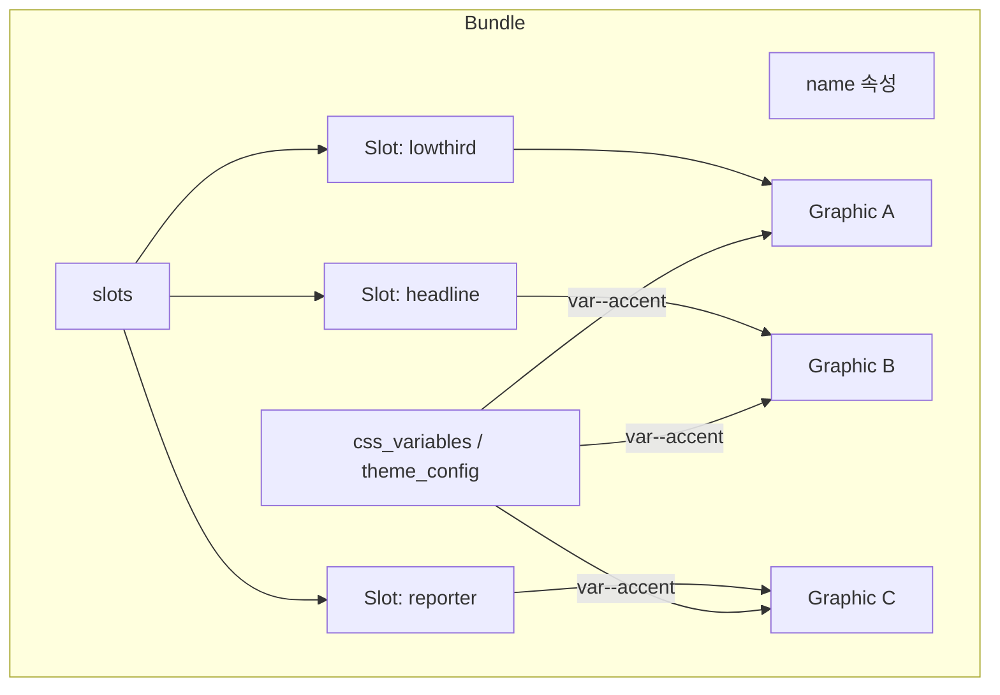
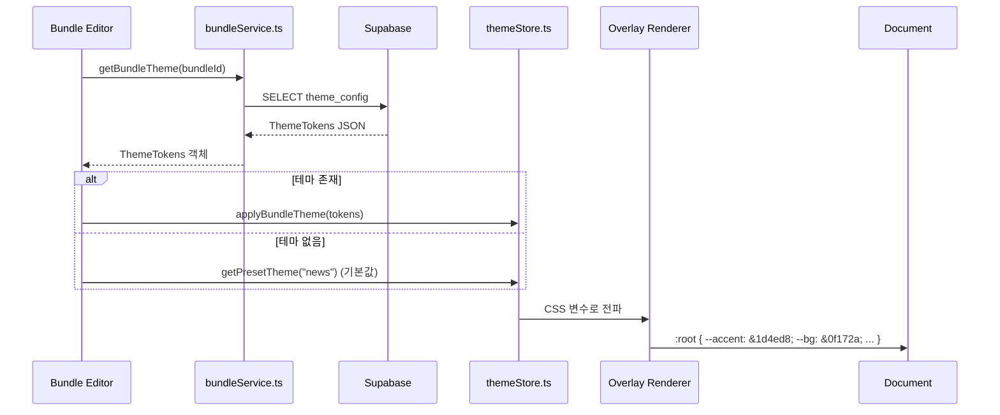
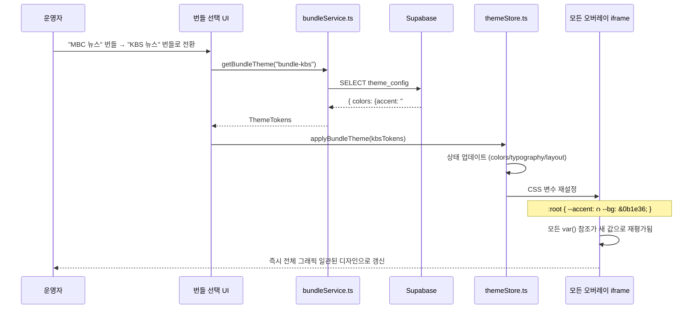
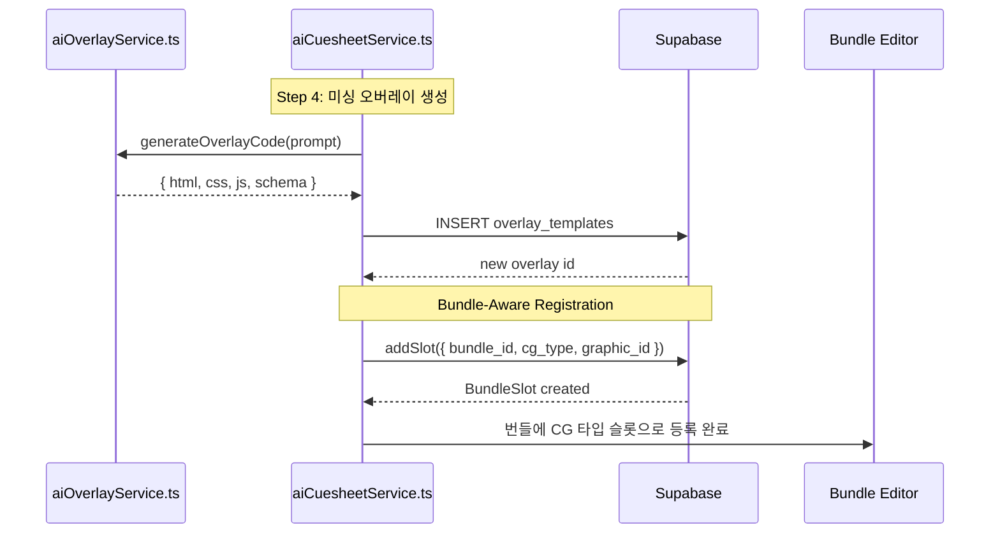

# Phase 4: 번들 & 테마 시스템

> **학습 목표**: 번들(Bundle)이 디자인 토큰 컨테이너로서 어떻게 방송 그래픽의 시각적 일관성을 보장하는지 이해하고, 구조와 표현의 분리 원칙을 설명할 수 있다.

---

## 1. 문제: AI 생성 오버레이의 디자인 파편화

AI가 개별 오버레이를 생성할 때마다 각기 다른 색상, 폰트, 스타일을 사용하면 다음과 같은 문제가 발생한다:

- 뉴스 방송 중 "속보 자막"은 파란색 계열인데 "인물 자막"은 빨간색 계열이라 통일감이 없음
- 같은 프로그램 내에서도 오버레이마다 디자인 언어가 달라 시청자 혼란 유발
- 워크스페이스별로 일관된 브랜딩 유지가 불가능

**해결책**: 개별 오버레이에서 색상/폰트/간격을 하드코딩하지 말고, 외부에서 주입하는 디자인 토큰(Design Tokens)을 참조하도록 설계한다.

---

## 2. 번들: 디자인 토큰 컨테이너

### 2.1. 번들의 정의

번들(TemplateBundle)은 **디자인 토큰을 담는 컨테이너**이자, **여러 CG 타입의 슬롯을 그룹화하는 단위**이다.



### 2.2. 번들 구조

**파일 위치**: `/home/genk/topProject/2026.WebCg-K/webcg-k/src/services/bundleService.ts`

```typescript
export interface TemplateBundle {
    id: string;
    owner_id: string;
    name: string;              // 번들 이름 (예: "MBC 뉴스데스크")
    description: string | null;
    program_name: string | null; // 프로그램명 (NRCS 연동 키)
    is_default: boolean;
    slots?: BundleSlot[];       // CG 타입별 슬롯 목록
    slot_count?: number;
}
```

각 슬롯(BundleSlot)은 하나의 CG 타입과 하나의 그래픽을 연결한다:

```typescript
export interface BundleSlot {
    id: string;
    bundle_id: string;
    cg_type: CgTextType;           // 13종 중 하나
    graphic_id: string | null;     // 연결된 그래픽
    field_mapping: Record<string, FieldMappingEntry>;  // CG 필드 ↔ 그래픽 요소 바인딩
    sort_order: number;
    priority: number;
}
```

**13가지 CG 타입**:
`headline`, `subheadline`, `band`, `super`, `lowthird`, `source`, `crawl`, `locator`, `fullcg`, `credit`, `soundbite`, `reporter`, `flash`

### 2.3. 번들 CRUD (라우트)

**파일 위치**:
- 목록: `/home/genk/topProject/2026.WebCg-K/webcg-k/src/routes/dashboard/studio/bundles/index.tsx`
- 상세/편집: `/home/genk/topProject/2026.WebCg-K/webcg-k/src/routes/dashboard/studio/bundles/$bundleId.tsx`

번들 목록 페이지는 `fetchBundles()`로 모든 번들을 조회하고, 생성/삭제를 지원한다.

번들 에디터 페이지는 **3-영역 레이아웃**으로 구성된다:
1. **헤더**: 번들 이름/프로그램명/저장 버튼
2. **캔버스**: 연결된 모든 그래픽을 zIndex 기반으로 오버레이하여 방송 화면처럼 미리보기
3. **CG 타입 슬롯 바**: 13가지 CG 타입별 슬롯을 그래픽에 태깅/매핑

---

## 3. CSS 변수 테마 메커니즘

### 3.1. 테마 토큰 (ThemeTokens)

번들의 `theme_config` 컬럼은 JSONB 형태의 `ThemeTokens`를 저장한다:

```typescript
export interface ThemeTokens {
    themeId: string;
    colors: { ... };
    typography: { ... };
    layout: { ... };
}
```

(실제 구조는 `/home/genk/topProject/2026.WebCg-K/webcg-k/src/lib/types/semanticTypes.ts`에 정의)

테마 로딩 시퀀스:



### 3.2. CSS 변수 주입 방식

AI가 생성한 오버레이 코드는 변수 값을 직접 하드코딩하지 않고 `var()` 참조를 사용한다:

```css
/* AI 생성 코드 (CSS 변수 참조) */
:root {
    --primary: var(--accent, #1d4ed8);  /* 번들에서 --accent 주입 */
    --bg-primary: var(--bg, #0f172a);
    --text-primary: var(--text, #ffffff);
}

#overlay {
    background: var(--bg-primary);
    color: var(--text-primary);
    border-left: 4px solid var(--primary);
}
```

런타임에 번들의 테마 토큰이 `:root`의 CSS 변수로 주입되면, `var(--accent)` 참조가 실제 값으로 해석된다. 이를 통해:

- **구조와 표현의 분리**: 오버레이 코드는 구조(HTML/CSS/JS)만 담당, 색상/폰트는 번들이 결정
- **즉시 재테마화**: 번들만 교체하면 모든 오버레이의 색상이 한 번에 변경
- **Design Tokens 패턴** 구현: Accent, Background, Text, Font 등 추상화된 토큰만 참조

---

## 4. 번들 교체 시퀀스

번들을 전환하면 모든 오버레이가 재테마화되는 과정:



**핵심**: 오버레이 코드는 단 한 줄도 수정되지 않는다. 단지 `:root`의 CSS 변수 값만 변경될 뿐이다.

---

## 5. AI 생성 오버레이의 번들 등록

AI 큐시트 플로우에서 새로 생성된 오버레이는 자동으로 번들에 등록된다.



실제 코드는 `bundleService.ts`의 `addSlot()` 함수를 통해 이루어진다:

```typescript
export async function addSlot(slot: {
    bundle_id: string;
    cg_type: CgTextType;
    graphic_id?: string;
    field_mapping?: Record<string, FieldMappingEntry>;
    sort_order?: number;
}): Promise<BundleSlot> {
    const { data, error } = await supabase
        .from("bundle_slots")
        .insert({
            bundle_id: slot.bundle_id,
            cg_type: slot.cg_type,
            graphic_id: slot.graphic_id || null,
            field_mapping: (slot.field_mapping || {}) as unknown as Json,
            sort_order: slot.sort_order ?? 0,
        })
        .select()
        .single();
}
```

이로써 AI가 생성한 오버레이는 번들의 특정 CG 타입 슬롯에 자동 연결되어, 이후 테마 변경의 대상이 된다.

---

## 6. 구조와 표현의 분리 (Design Tokens 패턴)

| 구분 | 담당 | 예시 |
|------|------|------|
| **구조 (Structure)** | 오버레이 코드 | `<div>`, CSS 레이아웃, JS 로직 |
| **표현 (Presentation)** | 번들 테마 | `--accent`, `--bg`, `--text` 값 |

```css
/* 구조: AI가 생성하는 오버레이 CSS */
.player-name {
    color: var(--text-primary);     /* 표현은 번들이 결정 */
    background: var(--accent);       /* 표현은 번들이 결정 */
    font-family: var(--font-display); /* 표현은 번들이 결정 */
}

/* 표현: 번들이 주입하는 CSS 변수 */
:root {
    --accent: #1d4ed8;
    --bg: #0f172a;
    --text-primary: #ffffff;
    --font-display: 'Noto Sans KR', sans-serif;
}
```

이 분리는 다음 이점을 제공한다:
- **일관성**: 번들 내 모든 CG가 동일한 디자인 언어 사용
- **유지보수성**: 색상 변경 시 오버레이 코드 수정 불필요, 번들 테마만 변경
- **확장성**: 새 오버레이를 추가해도 기존 디자인 규칙 자동 적용
- **마이그레이션**: 프로그램 리브랜딩 시 번들 하나만 수정하면 전체 CG 일괄 변경

---

## 7. 그래픽 및 그리드 템플릿과의 관계

번들은 다음 두 시스템과 긴밀하게 연결된다:

### 그래픽 (Graphics)
- 각 `BundleSlot`은 하나의 `graphic_id`를 참조
- `field_mapping`은 CG 타입의 필드(예: 이름, 직함)를 그래픽의 특정 텍스트 요소에 바인딩
- 번들 에디터의 캔버스는 연결된 모든 그래픽을 zIndex 기반으로 오버레이하여 방송 화면을 시뮬레이션

### 그리드 템플릿 (Grid Templates)
- 그리드 템플릿은 화면 분할(splits)과 영역(zones)을 정의
- 번들은 이 영역에 오버레이를 배치하는 방법을 제공
- Zone 정보는 AI 프롬프트에 주입되어 정확한 위치에 오버레이가 생성되도록 함

---

## 8. 요약

| 개념 | 설명 |
|------|------|
| **번들** | 디자인 토큰 + CG 타입별 슬롯 컨테이너 |
| **슬롯** | CG 타입 ↔ 그래픽 연결 (13종) |
| **CSS 변수** | `var()` 참조로 구조와 표현 분리 |
| **theme_config** | 번들 DB 컬럼에 저장된 ThemeTokens JSONB |
| **Design Tokens** | --accent, --bg, --text, --font-display 등 추상화 |
| **Bundle-Aware Registration** | AI 생성 오버레이를 번들 슬롯에 자동 등록 |
| **재테마화** | 번들 전환만으로 모든 오버레이 일괄 스타일 변경 |
