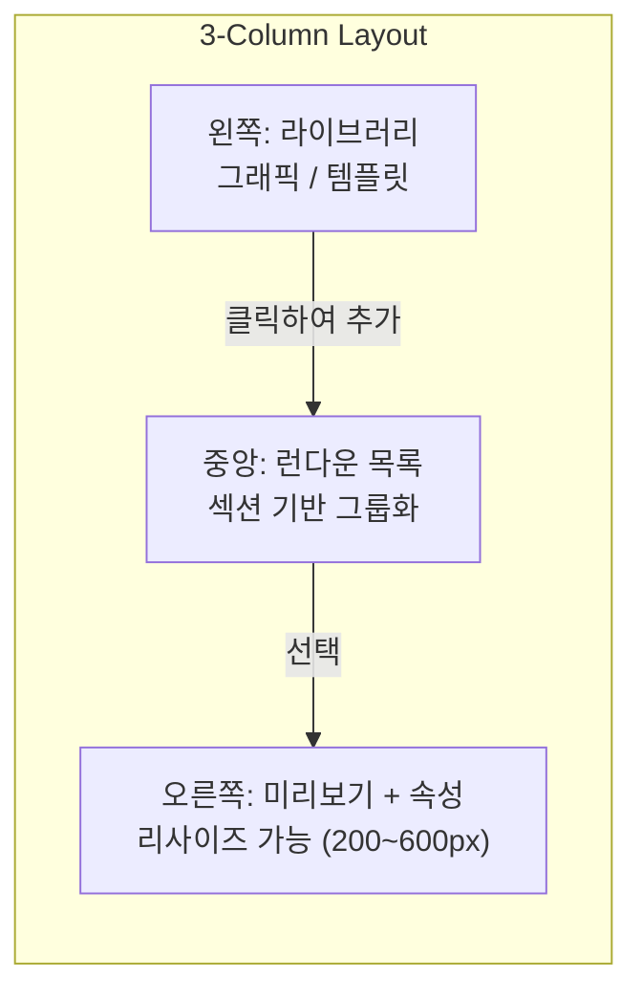
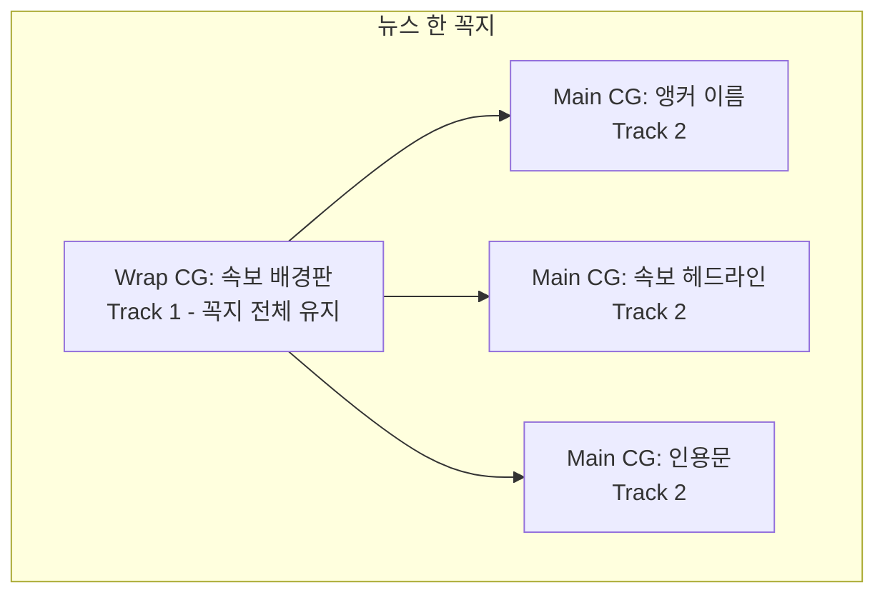
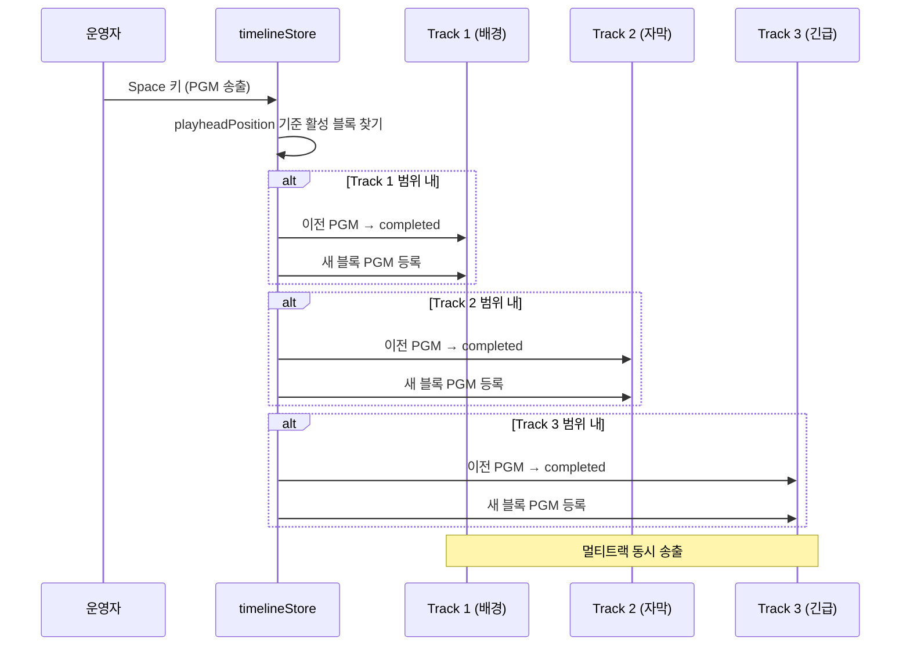
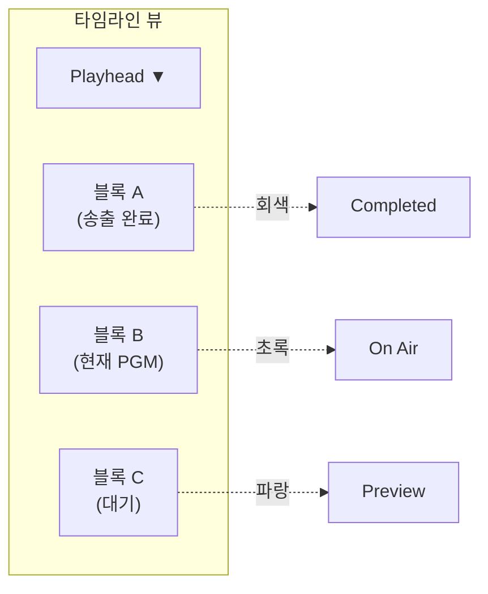

# Phase 5: 런다운 시스템

> **학습 목표**: 방송 런다운(Rundown)의 개념과 WebCG-K의 타임라인 기반 블록 시스템을 이해하고, 아이템 조작부터 송출까지의 전체 워크플로우를 설명할 수 있다.

---

## 1. 방송에서 런다운이란?

**런다운(Rundown)** 은 방송 제작에서 **"프로그램의 시간 순서대로 정리된 아이템 목록"** 을 의미한다. 뉴스 프로그램을 예로 들면:

| 순서 | 아이템 | 지속시간 | 비고 |
|------|--------|---------|------|
| 1 | 오프닝 타이틀 | 15s | CG |
| 2 | 앵커 인사말 | 30s | 카메라 |
| 3 | 속보: 기후위기 특보 | 120s | VTR + CG |
| 4 | 날씨 예보 | 60s | CG |
| 5 | 클로징 | 10s | CG |

런다운 시스템은 이 목록을 **디지털 타임라인**으로 구현하여, 운영자가 CG 아이템을 순서대로 배치하고 송출할 수 있게 한다.

---

## 2. 핵심 엔티티

### 2.1. Rundown (메타)

**파일 위치**: `/home/genk/topProject/2026.WebCg-K/webcg-k/src/services/rundownRepository.ts`

```typescript
export interface RundownMeta {
    id: string;
    title: string;          // 예: "MBC 뉴스데스크 2026-05-13"
    description: string | null;
    is_public: boolean;
    sections_data?: RundownSection[] | null;  // 섹션(세그먼트) 구성
}
```

### 2.2. RundownSection (섹션)

```typescript
export interface RundownSection {
    id: string;
    label: string;     // 예: "Intro", "Body", "Outro"
    order: number;
    color: string;     // 12색 팔레트 중 하나 (rgba)
}
```

섹션은 Premiere Pro의 Nested Sequence 탭 개념을 차용한 것으로, 런다운 아이템을 논리적 그룹으로 묶는다.

### 2.3. RundownItem (아이템)

```typescript
export interface RundownItem {
    id: string;
    source_type: "graphic" | "template" | "overlay";  // 소스 유형
    source_id: string;
    source_name: string;      // UI 표시 이름
    data: any;                // elements, canvas_size 등
    item_order: number;       // 정렬 순서
    duration: number;         // 지속 시간 (초)
    thumbnail?: string;
    section_id?: string | null;
    track_layer?: "wrap" | "main" | null;  // 트랙 계층
    parent_item_id?: string | null;          // Wrap CG 소속
}
```

---

## 3. 런다운 편집기 페이지

**파일 위치**: `/home/genk/topProject/2026.WebCg-K/webcg-k/src/routes/dashboard/rundowns/$rundownId.tsx`

### 3.1. 3-컬럼 레이아웃 (SPX-GC 스타일)



**왼쪽 패널 (라이브러리)**:
- `Graphics` 탭: Supabase `graphics` 테이블에서 사용자 그래픽 목록 로드 (썸네일 또는 SVG 미니 프리뷰)
- `Templates` 탭: `grid_templates` 테이블에서 그리드 템플릿 목록 로드

**중앙 패널 (런다운 목록)**:
- 섹션별로 아이템 그룹화 (DroppableSection)
- 드래그앤드롭으로 순서 변경 및 섹션 이동
- Wrap CG 트리 구조 지원 (들여쓰기 + 연결선)

**오른쪽 패널 (미리보기 + 속성)**:
- 마우스 드래그로 리사이즈 가능 (200px ~ 600px)
- 선택된 아이템의 SVG 미리보기 또는 썸네일 표시
- 속성 편집: 이름, 지속 시간, 섹션 소속, 트랙 역할, 텍스트 내용

### 3.2. 컨텍스트 기반 아이템 삽입

아이템을 라이브러리에서 클릭하면 컨텍스트에 따라 자동으로 적절한 위치에 삽입된다:

1. **1순위**: 선택된 아이템이 Wrap CG이면 → Wrap의 자식으로 삽입
2. **2순위**: 선택된 아이템이 섹션에 속하면 → 같은 섹션, 선택 아이템 뒤에 삽입
3. **3순위**: 활성 섹션이 있으면(Google My Maps 패턴) → 해당 섹션 맨 끝에 삽입
4. **4순위**: 아무것도 없으면 → 미분류 맨 뒤에 삽입

### 3.3. Wrap CG 시스템

Wrap CG는 **배경판 역할**을 하는 특수 아이템으로, Track 1(배경)에 배치된다. 일반 Main CG(자막, Track 2)를 자식으로 가질 수 있다.



Wrap CG로 전환하면 자식 아이템의 `parent_item_id`가 자동 설정되고, Wrap CG 삭제 시 자식들의 `parent_item_id`도 함께 초기화되어 유령 참조를 방지한다.

---

## 4. 타임라인 아키텍처

**파일 위치**: `/home/genk/topProject/2026.WebCg-K/webcg-k/src/stores/timelineStore.ts`

타임라인은 TanStack Store를 기반으로 상태를 관리하며, NLE(Non-Linear Editor) 스타일의 **다중 트랙 타임라인**을 구현한다.

### 4.1. 트랙

```typescript
export interface Track {
    id: number;
    name: string;                              // "Track 1 [배경]"
    type: "background" | "subtitle" | "urgent" | "logo";
    isLogoTrack?: boolean;                     // 로고 전용 트랙 플래그
}
```

기본 4개 트랙:
| ID | 이름 | 유형 | 용도 |
|----|------|------|------|
| 0 | Logo | logo | 채널 로고 (전용 트랙, 이동 불가) |
| 1 | Track 1 [배경] | background | 배경판/Wrap CG |
| 2 | Track 2 [자막] | subtitle | 자막/Main CG |
| 3 | Track 3 [긴급] | urgent | 속보 배너 |

### 4.2. GraphicBlock

```typescript
export interface GraphicBlock {
    id: string;
    name: string;
    trackId: number;
    startPosition: number;   // 픽셀 단위 시작 위치
    width: number;           // 블록 너비 (픽셀)
    color?: string;
    transitionIn: TransitionType;   // "cut" | "fade"
    transitionOut: TransitionType;
    sourceType?: "image" | "graphic" | "template" | "overlay";
    segmentId?: string;      // 소속 세그먼트 ID
    cuesheetItemId?: string; // 원본 큐시트 아이템 역추적용
    bundleSlotId?: string;   // 번들 슬롯 역추적용
}
```

### 4.3. 타임라인 상태

전체 타임라인 상태는 `timelineStore`에 저장된다:

```typescript
export interface TimelineState {
    tracks: Track[];
    blocks: GraphicBlock[];
    playheadPosition: number;          // 현재 재생 위치 (픽셀)
    previewBlockId: string | null;     // PVW 표시 블록
    pgmBlockIds: Map<number, string>;  // 트랙별 PGM 블록 (멀티트랙 송출)
    lastBroadcastPosition: number;     // 마지막 송출 위치 (↑ 키 복귀용)
    selectedBlockId: string | null;
    selectedGap: { trackId: number; startPosition: number; endPosition: number } | null;
    snapThreshold: number;             // 스냅 임계값 (기본 10px)
    fadeDuration: number;              // Fade 지속 시간 (기본 800ms)
    completedBlockIds: Set<string>;    // 송출 완료 블록
    airedBlockIds: Set<string>;        // 한 번이라도 송출된 블록
    skippedBlockIds: Set<string>;      // 스킵된 블록
    segments: Segment[];               // 세그먼트 (Nested Sequence Tab)
    activeSegmentTab: string | null;   // 활성 세그먼트 탭
    autoFollow: AutoFollowMode;        // Auto-follow 모드
    isScrubbing: boolean;              // 개인 PVW 탐색 모드
}
```

---

## 5. 블록 조작

**파일 위치**: `/home/genk/topProject/2026.WebCg-K/webcg-k/src/stores/blockManipulation.ts`

### 5.1. 그리드 스냅 (Snap-to-Grid)

모든 블록의 위치와 크기는 50px 단위 그리드에 스냅된다:

```typescript
export const SNAP_UNIT = 50;
export const DEFAULT_BLOCK_WIDTH = SNAP_UNIT * 3; // 150px
export const MIN_BLOCK_WIDTH = SNAP_UNIT * 2;     // 100px
export const RESERVED_ZONE = SNAP_UNIT;            // 50px (첫 칸 예약)
```

### 5.2. 드래그 이동

```typescript
// 임시 이동 (드래그 중)
export function moveBlockTemporary(blockId: string, newPosition: number): void

// 이동 확정 (겹침 시 원위치 복귀)
export function moveBlockFinal(blockId: string, originalPosition: number): boolean
```

드래그 중에는 `moveBlockTemporary()`로 실시간 위치 갱신(그리드 스냅 적용), 드래그 종료 시 `moveBlockFinal()`로 겹침 검증 후 확정 또는 원위치 복귀한다.

### 5.3. 리사이즈

```typescript
export function resizeBlockAbsolute(
    blockId: string,
    handle: "left" | "right",
    absolutePosition: number,
): boolean
```

최소 너비(MIN_BLOCK_WIDTH = 100px) 이하로는 리사이즈 불가. 좌측 핸들 리사이즈 시 예약 영역(50px) 침범 방지.

### 5.4. 겹침 감지

```typescript
export function wouldBlockOverlap(
    blockId: string,
    newStart: number,
    newWidth: number,
): boolean
```

같은 트랙 내에서 두 블록이 겹치는지 감지:

```typescript
export function detectBlockOverlap(
    block1Start: number, block1Width: number,
    block2Start: number, block2Width: number,
): boolean {
    const block1End = block1Start + block1Width;
    const block2End = block2Start + block2Width;
    return !(block1End <= block2Start || block2End <= block1Start);
}
```

### 5.5. 트랙 간 이동

```typescript
export function changeBlockTrack(blockId: string, newTrackId: number): void
```

**로고 트랙(isLogoTrack) 보호**: 일반 블록이 로고 트랙으로 이동하는 것을 차단하고, 로고 블록이 일반 트랙으로 이탈하는 것도 차단한다. 이는 로고 트랙이 `LogoGallery`에서만 블록을 추가/제거하는 전용 트랙이기 때문이다.

### 5.6. PGM 송출 (broadcastToPGM)

```typescript
export function broadcastToPGM(): void
```

현재 playhead 위치에 걸쳐있는 **모든** 트랙의 블록을 동시에 PGM에 등록한다:



---

## 6. Playhead

Playhead는 방송의 **현재 송출 위치**를 나타내는 커서이다.



Playhead 조작 함수:
- `setPlayheadPosition(position)`: 직접 위치 설정 (스냅 적용)
- `moveToNextEdge()`: 다음 블록 경계로 이동 (→ 키)
- `moveToPrevEdge()`: 이전 블록 경계로 이동 (← 키)
- `moveToStart()`: 타임라인 처음으로 (Ctrl+←)
- `moveToEnd()`: 타임라인 끝으로 (Ctrl+→)
- `returnToLastBroadcast()`: 마지막 송출 지점으로 복귀 (↑ 키)

---

## 7. Auto-Follow 3단계 모드

```typescript
export type AutoFollowMode = "off" | "soft" | "auto";
```

비유: **자동차의 차선 유지 보조 시스템**

| 모드 | 값 | 동작 |
|------|-----|------|
| **OFF** | `"off"` | 아무 동작 없음 (완전 수동 운전) |
| **Soft-prompt** | `"soft"` (기본값) | 다음 세그먼트 힌트를 강조 펄스 + Preview 자동 장전 (경고등만) |
| **Auto-switch** | `"auto"` | 마지막 CG 완료 0.5초 후 다음 탭 자동 전환 + Zoom-to-Fit (완전 자동) |

`cycleAutoFollow()`로 3단계를 순환한다:
```
OFF → Soft-prompt → Auto-switch → OFF → ...
```

**Why 3단계 사이클?** 방송 중 PD가 한 손으로 빠르게 전환할 수 있도록 단일 버튼 클릭으로 3개 모드를 순환한다. 별도 드롭다운이나 모달은 방송 중 인지 부하를 높인다.

---

## 8. 세그먼트 탭 (Nested Sequence Tab)

세그먼트는 Premiere Pro의 Nested Sequence 탭 패턴을 차용한 것으로, NRCS(Newsroom Computer System) 연동 시 뉴스 아이템별 탭 전환을 지원한다.

```typescript
// segments: NRCS 연동 시 자동 생성, 미연동 시 빈 배열 → 탭 바 숨김
segments: Segment[];
activeSegmentTab: string | null;  // null = "전체" 탭
```

**핵심 기능**:
- `setActiveSegmentTab()`: 활성 세그먼트 탭 전환 (null = 전체 런다운)
- `expandLogoToSegment()`: 로고 블록을 세그먼트 전체 CG 구간으로 자동 확장
- `reorderBlocksBySegments()`: NRCS 순서 변경 시 블록 startPosition 자동 재계산

### NRCS 순서 변경 자동 재배치

`reorderBlocksBySegments()`는 NRCS에서 뉴스 아이템 순서가 변경되면:
1. 세그먼트 순서대로 블록 그룹을 재배치
2. 세그먼트 내부의 블록 간 상대 간격은 보존
3. 세그먼트에 속하지 않은 블록(로고 등)은 그대로 유지
4. PGM 상태는 블록 ID 기반으로 유지 (방송 중에도 안전)

---

## 9. 블록 복사/붙여넣기

```typescript
// Ctrl+C: 선택 블록 복사
export function copySelectedBlock(): boolean

// Ctrl+V: 같은 트랙에 붙여넣기 (겹치지 않도록 우측에 배치)
export function pasteBlock(): boolean
```

붙여넣기 시 같은 트랙의 가장 오른쪽 블록 끝 + 50px 간격으로 자동 배치된다.

키보드 단축키 종합:
| 키 | 동작 |
|----|------|
| ↑/↓ | 이전/다음 아이템 선택 |
| Space | 다음 아이템으로 순환 |
| Delete/Backspace | 선택 아이템 삭제 |
| Ctrl+C | 복사 |
| Ctrl+V | 붙여넣기 |

---

## 10. 트랜지션 토글

각 블록은 시작(In)과 종료(Out)에 대해 `cut` 또는 `fade` 트랜지션을 설정할 수 있다.

```typescript
// cut ↔ fade 토글
export function toggleBlockTransition(blockId: string, side: "in" | "out"): void

// 직접 설정
export function setBlockTransition(blockId: string, side: "in" | "out", type: TransitionType): void

// Fade 지속 시간 설정 (100ms ~ 3000ms)
export function setFadeDuration(duration: number): void
```

기본 Fade 지속 시간은 800ms이며, 최소 100ms, 최대 3000ms로 제한된다.

---

## 11. 송출 완료/스킵 상태

타임라인은 각 블록의 송출 라이프사이클을 추적한다:

```typescript
export interface TimelineState {
    completedBlockIds: Set<string>;  // 송출 완료 (PGM → STOP) → 회색 표시
    airedBlockIds: Set<string>;      // 한 번이라도 PGM에 올라간 블록
    skippedBlockIds: Set<string>;    // 나타남 없이 건너뛰어진 블록
}
```

- `broadcastToPGM()` 호출 시 이전 PGM 블록은 자동으로 `completed`로 전환
- `resetCompletedBlocks()`로 모든 상태 초기화 가능 (회색 블록 원복)

---

## 12. Fathom 지식베이스 연동 (NRCS)

Fathom은 WebCG-K의 **방송 지식베이스 시스템**으로, NRCS(뉴스룸 시스템)의 기사 데이터를 구조화된 컨텍스트로 변환한다. (DB 스키마: `fathom_stories`, `fathom_entities`, `fathom_contexts`, `fathom_cg_links` 등)

런다운 생성 시 Fathom 연동을 통해:
- 기사 본문에서 추출된 개체명(인물, 장소, 기관)을 CG에 자동 바인딩
- 방송 대본과 CG 간의 의미적 연결 유지
- NRCS 순서 변경 시 Fathom 스토리 ID 기반으로 CG 링크 자동 재배치

(※ Fathom 런타임 통합은 Phase 6에서 상세 구현 예정)

---

## 13. 세션 생성 (프로젝트 송출)

런다운 편집기에서 **"프로젝트 생성"** 버튼을 클릭하면:

```typescript
const handleCreateSession = async () => {
    await createBroadcastSession(
        rundownId,
        rundown?.title || "Untitled",
        rundown?.description || null,
        user!.id,
        items,
        sections,  // 섹션이 있으면 broadcast_segments 자동 생성
    );
    navigate({ to: "/dashboard/broadcast" });
};
```

이로써 런다운 아이템 목록이 실제 송출 세션으로 변환되어 브로드캐스트 페이지에서 CG 컨트롤이 가능해진다.

---

## 14. 요약

| 개념 | 설명 |
|------|------|
| **Rundown** | 프로그램 시간 순서 아이템 목록 |
| **RundownItem** | graphic/template/overlay 유형의 개별 아이템 |
| **RundownSection** | 아이템 논리적 그룹 (Intro/Body/Outro) |
| **타임라인** | 다중 트랙(Logo/배경/자막/긴급) 기반 시각적 편집 |
| **Wrap CG** | 배경판 역할 (Track 1), 자식 아이템을 가질 수 있음 |
| **Playhead** | 현재 송출 위치 (스냅/에지 이동 지원) |
| **Auto-Follow** | 3단계: OFF → Soft-prompt → Auto-switch |
| **블록 조작** | 드래그, 리사이즈, 겹침 감지, 트랙 이동 |
| **트랜지션** | cut/fade per 블록 (In/Out) |
| **세그먼트** | NRCS 연동 Nested Sequence 탭 |
| **Fathom** | 지식베이스 연동 (개체명/컨텍스트/CG 링크) |
