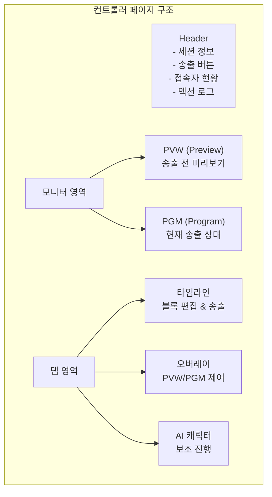
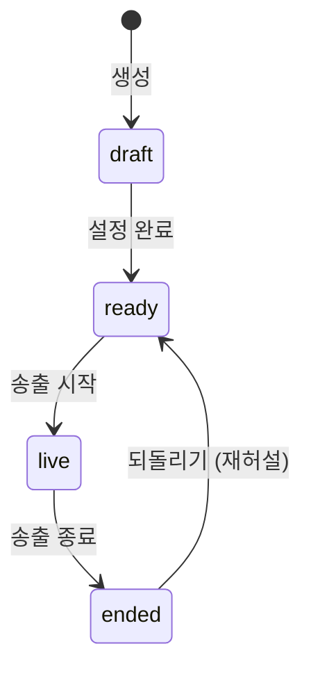
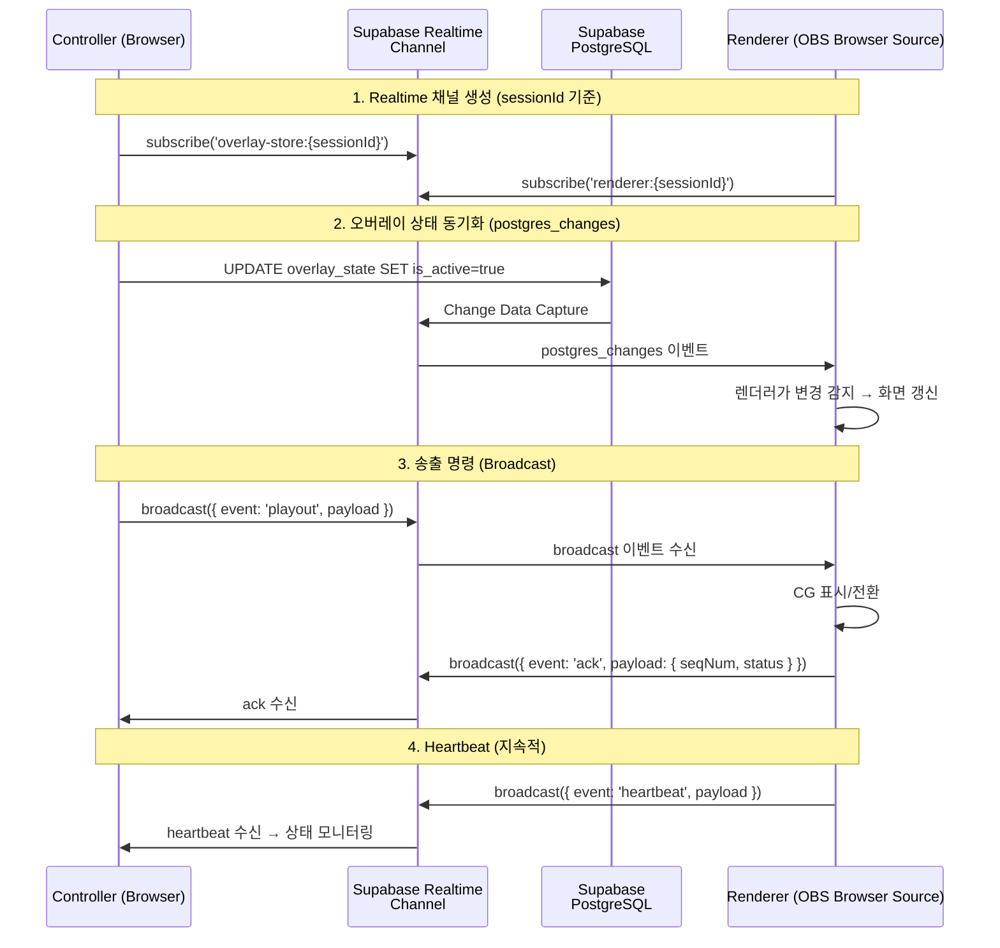
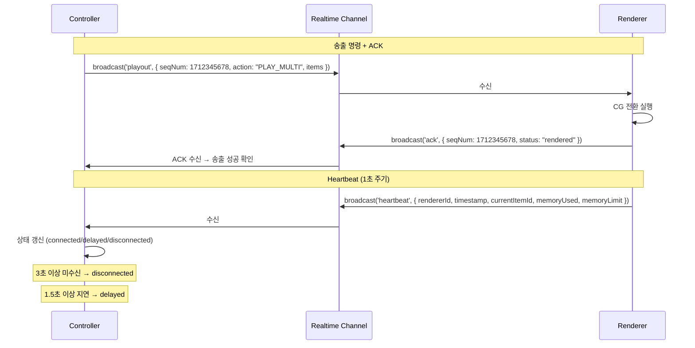
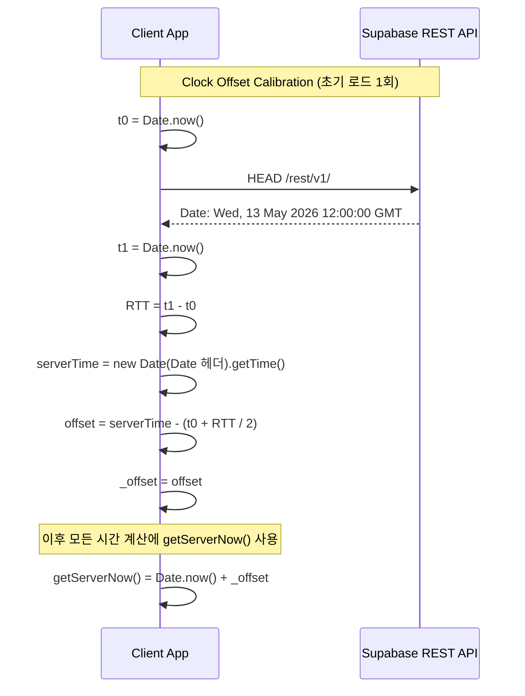
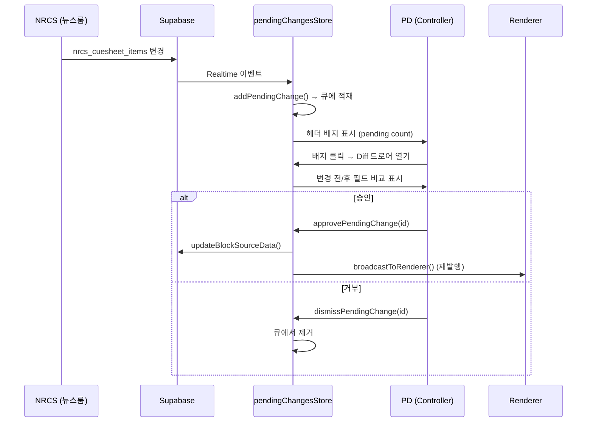
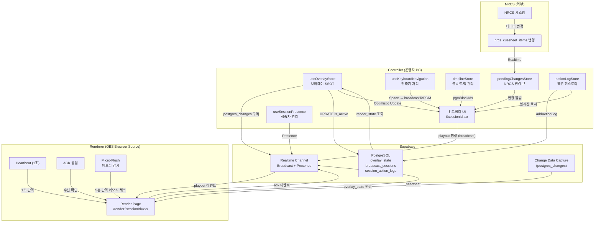

# Phase 6: 컨트롤러 & 실시간 송출

> **학습 목표**: 방송 운영자가 실제로 사용하는 컨트롤러의 내부 구조와, Supabase Realtime을 통한 실시간 동기화 메커니즘을 이해한다.

---

## 6.1 컨트롤러: 방송 운영자의 콕핏

컨트롤러는 방송 운영자(PD)가 그래픽 송출을 제어하는 메인 인터페이스입니다. 실제 방송국 환경에서 CasparCG 클라이언트나 Ross Xpression이 수행하는 역할을 웹 브라우저에서 구현합니다.

**핵심 파일**: `src/routes/controller/$sessionId.tsx`



컨트롤러 페이지는 `$sessionId` 파라미터를 URL에서 추출하여 특정 방송 세션에 바인딩됩니다. `output` 쿼리 파라미터를 통해 특정 태그(예: `viewer`)만 필터링하여 표시할 수도 있습니다.

---

## 6.2 BroadcastSession 생명주기

방송 세션은 다음과 같은 상태 기계(State Machine)로 관리됩니다:



세션 상태 전이의 핵심 코드는 `useSessionController` 훅(`src/hooks/useSessionController.ts`)에 캡슐화되어 있습니다. 컨트롤러 페이지는 이 훅을 통해:

- **세션 데이터 로딩** (`session`, `segments`)
- **채널 상태 확인** (`isChannelReady`)
- **렌더러 상태 모니터링** (`rendererStatus`)
- **송출 명령 실행** (`broadcast()`)
- **상태 업데이트** (`updateStatus()`)

```typescript
// $sessionId.tsx — 세션 로딩
const {
    session, segments, loading, error,
    isChannelReady, rendererStatus,
    broadcast, savePlayheadState, updateStatus,
} = useSessionController(sessionId);
```

### 세션 초기화 과정

1. `useSessionController`가 DB에서 세션과 세그먼트 데이터를 로드
2. `useOverlayStore`가 Realtime 채널을 생성하여 오버레이 상태 구독 시작
3. `calibrateClockOffset()`으로 서버 시각 동기화 (1회)
4. 타임라인 스토어(`timelineStore`)에 블록 데이터 적재

```typescript
// $sessionId.tsx — 타임라인 초기화 (라인 333-421)
useEffect(() => {
    if (sessionLoading || sessionError || !session) return;
    // session.timeline_data → GraphicBlock[] 변환
    // playheadState → 타임라인 복원 (pgmBlockIds, completedBlockIds 등)
    // 세그먼트 동기화
    timelineStore.setState((state) => ({
        ...state,
        blocks: [...blocks, ...savedLogoBlocks],
        playheadPosition: restoredPlayhead,
        pgmBlockIds: finalPgmIds,
        // ...
    }));
}, [session, sessionSegments, sessionLoading, sessionError, sessionId]);
```

### playheadState 영속화

컨트롤러는 1초 간격으로 현재 playhead 상태(playhead 위치, PGM 블록 ID, 완료된 블록 등)를 DB에 저장하여, 페이지 이탈이나 브라우저 종료 시에도 상태가 보존됩니다.

```typescript
// $sessionId.tsx — sendBeacon으로 최종 상태 저장 (라인 470-487)
const handleBeforeUnload = () => {
    const state = buildPlayheadState();
    const payload = JSON.stringify({ playhead_state: state });
    navigator.sendBeacon(url, blob);
};
```

---

## 6.3 실시간 동기화 아키텍처

컨트롤러와 렌더러는 **Supabase Realtime**을 통해 연결됩니다. 이는 WebSocket 기반의 Pub/Sub 시스템으로, PostgreSQL의 변경 사항을 실시간으로 구독하거나 Broadcast 메시지를 주고받을 수 있습니다.



### 듀얼-트랙 통신

컨트롤러는 **두 가지 통신 채널**을 동시에 사용합니다:

| 채널 | 방식 | 용도 | 특징 |
|------|------|------|------|
| **Control Channel** | `postgres_changes` | 오버레이 의도(is_active), replicant_data 변경 | DB가 SSOT, 충돌 복원 가능 |
| **Data Channel** | `broadcast` | 송출 명령(PLAY/CLEAR/STOP), ACK, Heartbeat | Fire-and-Forget, 저지연 |

---

## 6.4 오버레이 상태 관리: useOverlayStore

`useOverlayStore`(`src/hooks/useOverlayStore.ts`)는 **단일 진실점(Single Source of Truth)** 패턴을 구현합니다.

### 왜 필요한가?

기존에는 `OverlayPanel`, `OverlayPlayoutLayer`, `PluginOverlayLayer`가 각각 독립적으로 Realtime을 구독하고 DB를 조회했습니다. 이로 인해:

- 동일 세션에 6~9개 Realtime 채널 중복 생성
- 데이터 변경 시 DB를 2번 왕복 (UPDATE -> Realtime -> SELECT)

이 훅은:
1. Realtime 채널을 **1개만** 생성
2. 모든 컴포넌트가 **같은 데이터** 참조
3. 데이터 변경 시 로컬 상태를 **즉시 갱신** (Optimistic Update)

```typescript
// useOverlayStore.ts — 단일 Realtime 구독 (라인 66-98)
useEffect(() => {
    if (!sessionId) return;
    setLoading(true);
    loadOverlays().then(() => setLoading(false));

    const channel = supabase
        .channel(`overlay-store:${sessionId}`)
        .on("postgres_changes", {
            event: "*", schema: "public",
            table: "overlay_state",
            filter: `session_id=eq.${sessionId}`,
        }, () => { loadOverlays(); })
        .subscribe();

    return () => { channel.unsubscribe(); };
}, [sessionId, loadOverlays]);
```

### CQRS 패턴: 의도(Command)와 상태(Query) 분리

```typescript
// useOverlayStore.ts (라인 139-189)
const setPlayoutState = async (overlayId, state) => {
    // is_active: Controller의 의도 (= Command)
    // render_state: Renderer의 실제 상태 (= Query)
    switch (state) {
        case "off":     updatePayload.is_active = false; break;
        case "preview": updatePayload.is_active = false; animation_state = "preview"; break;
        case "program": updatePayload.is_active = true;  break;
    }
    // Optimistic: 즉시 로컬 반영
    setOverlays(prev => prev.map(o => o.id === overlayId ? { ...o, ...updatePayload } : o));
    // DB 저장 (비동기)
    await supabase.from("overlay_state").update(updatePayload).eq("id", overlayId);
};
```

- **`setPlayoutState()`** = Command 채널: Controller가 `is_active` 의도를 설정
- **`reportRenderState()`** = Query 채널: Renderer만 호출, `render_state` 기록
- Controller는 `render_state`를 읽어 실제 렌더링 상태를 UI에 반영

### 그룹 연산

`updateGroupData()`와 `setGroupPlayoutState()`는 동일한 `group_tag`를 가진 모든 오버레이를 한 번에 업데이트합니다. 예: 토론 카운트다운처럼 여러 오버레이(후보자용 + 시청자용)가 같은 데이터를 받을 때.

```typescript
// useOverlayStore.ts — 그룹 태그 기반 일괄 업데이트 (라인 236-268)
const updateGroupData = async (groupTag, data) => {
    // 로컬 즉시 반영
    setOverlays(prev => prev.map(o =>
        (o as any).group_tag === groupTag
            ? { ...o, replicant_data: data } : o
    ));
    // DB 일괄 업데이트 (1개 SQL로 N개 오버레이)
    await supabase.from("overlay_state")
        .update({ replicant_data: data })
        .eq("session_id", sessionId)
        .eq("group_tag", groupTag);
};
```

---

## 6.5 ACK/Heartbeat 프로토콜

Supabase Realtime의 Broadcast는 **Fire-and-Forget** 방식입니다. 즉, 컨트롤러가 PLAY 이벤트를 보내도 렌더러가 실제로 받았는지 알 수 없습니다. 네트워크 순간 끊김 시 렌더러는 이전 CG를 계속 표시하는 **State Drift**가 발생합니다.

이를 해결하기 위해 ACK 핸드셰이크와 Heartbeat를 구현했습니다.

**핵심 파일**: `src/lib/ackProtocol.ts`



### Heartbeat 타입

```typescript
// ackProtocol.ts (라인 23-34)
export interface HeartbeatPayload {
    rendererId: string;       // 렌더러 고유 ID (sessionStorage 기반)
    timestamp: number;         // 타임스탬프
    currentItemId: string|null; // 현재 표시 중인 CG 블록 ID
    memoryUsed: number|null;   // JS 힙 메모리 사용량 (bytes)
    memoryLimit: number|null;  // JS 힙 메모리 한도 (bytes)
}
```

### Heartbeat 감시기 (Controller 측)

```typescript
// ackProtocol.ts (라인 164-241)
export function createHeartbeatMonitor(options) {
    const disconnectThresholdMs = options?.disconnectThresholdMs ?? 3000;
    const delayThresholdMs = options?.delayThresholdMs ?? 1500;

    function handleHeartbeat(payload: HeartbeatPayload): void {
        // Heartbeat 수신 → status를 "connected"로 설정
        state = { rendererId, status: "connected", ... };
    }

    // 1초마다 상태 체크
    const checkTimer = setInterval(() => {
        const elapsed = Date.now() - state.lastHeartbeat;
        if (elapsed > disconnectThresholdMs) newStatus = "disconnected";
        else if (elapsed > delayThresholdMs) newStatus = "delayed";
        else newStatus = "connected";
    }, 1000);

    return { getState, handleHeartbeat, stop };
}
```

### State Drift 감지

```typescript
// ackProtocol.ts (라인 253-265)
export function detectStateDrift(
    pgmBlockId: string | null,          // Controller가 의도한 PGM 블록
    rendererCurrentItemId: string | null, // Renderer가 실제로 표시 중인 블록
): boolean {
    if (!pgmBlockId && !rendererCurrentItemId) return false; // 정상
    if (!pgmBlockId || !rendererCurrentItemId) return true;  // Drift
    return pgmBlockId !== rendererCurrentItemId;              // ID 불일치 = Drift
}
```

### Micro-Flush: 자가 치유 메커니즘

OBS 브라우저 소스는 24시간 연속 가동됩니다. 브라우저 메모리 누수가 점진적으로 쌓이면 렌더링 성능이 저하됩니다. `startMemoryMonitor()`는 5분 주기로 메모리를 체크하고, 80% 초과 시 페이지를 리로드합니다.

```typescript
// ackProtocol.ts (라인 286-333)
export function startMemoryMonitor(getCurrentItemId, options?) {
    const intervalMs = options?.intervalMs ?? 5 * 60 * 1000;
    const flushThreshold = options?.flushThreshold ?? 0.8;

    const timer = setInterval(() => {
        const usage = memory.usedJSHeapSize / memory.jsHeapSizeLimit;
        if (usage > flushThreshold) {
            // 현재 PGM 상태를 sessionStorage에 저장
            sessionStorage.setItem("webcgk_pgm_restore", currentItemId);
            // 페이지 리로드 (OBS는 URL 유지 → 자동 재접속)
            location.reload();
        }
    }, intervalMs);
}
```

---

## 6.6 시계 동기화 (Clock Synchronization)

Controller(운영자 PC)와 Renderer(송출 PC)의 로컬 시계가 다르면 `startedAt` 타임스탬프 기반 타이머 계산에서 `remaining` 값이 불일치합니다.

**핵심 파일**: `src/lib/clockSync.ts`



**원리**: 요청 직전 t0 기록, 응답의 `Date` 헤더에서 서버 시간 획득, 응답 직후 t1 기록. RTT = t1 - t0. Offset = serverTime - (t0 + RTT/2).

```typescript
// clockSync.ts (라인 48-80)
export async function calibrateClockOffset(): Promise<number> {
    const t0 = Date.now();
    const res = await fetch(`${baseUrl}/rest/v1/`, { method: "HEAD" });
    const t1 = Date.now();

    const serverDate = res.headers.get("Date");
    if (serverDate) {
        const serverTime = new Date(serverDate).getTime();
        const rtt = t1 - t0;
        _offset = serverTime - (t0 + rtt / 2);
    }
    return _offset;
}
```

컨트롤러에서는 1초 간격 타이머 루프가 실행되어 타이머 Replicant의 `remaining` 값을 보정합니다:

```typescript
// $sessionId.tsx (라인 103-126)
useEffect(() => {
    const tick = () => {
        for (const overlay of overlayStore.overlays) {
            const data = overlay.replicant_data;
            if (!isTimerReplicant(data)) continue;
            if (!data.running) continue;
            const offset = getClockOffset();
            const remaining = computeRemaining(data, offset);
            if (Math.abs(remaining - data.remaining) >= 0.5) {
                overlayStore.updateReplicantData(overlay.id, { ...data, remaining });
            }
        }
    };
    const interval = setInterval(tick, 1000);
    return () => clearInterval(interval);
}, [sessionId, overlayStore]);
```

---

## 6.7 세션 프레즌스 (접속자 관리)

여러 운영자가 동시에 같은 세션을 제어할 수 있습니다. Supabase Presence API를 통해 접속자 정보를 실시간으로 공유합니다.

**훅**: `useSessionPresence` (`src/hooks/useSessionPresence.ts`)

```typescript
// $sessionId.tsx (라인 149-156)
const {
    connectedUsers,   // 접속 중인 모든 사용자
    myColor,          // 내 아바타 색상
    updatePlayheadPosition,  // 내 playhead 위치 브로드캐스트
    isScrubbing, setIsScrubbing,
    updateLastBroadcastAt,   // 마지막 송출 시각 기록
} = useSessionPresence(sessionId);
```

### 주 오퍼레이터 결정

`lastBroadcastAt`이 가장 최신인 사용자가 **주 오퍼레이터**로 결정됩니다. 주 오퍼레이터가 아닌 사용자는 자동으로 주 오퍼레이터의 playhead를 추종합니다.

```typescript
// $sessionId.tsx (라인 207-224)
const primaryOperator = useMemo(() => {
    const broadcasters = connectedUsers.filter(u => u.lastBroadcastAt);
    if (broadcasters.length === 0) return null;
    return broadcasters.sort(
        (a, b) => new Date(b.lastBroadcastAt!).getTime() - new Date(a.lastBroadcastAt!).getTime()
    )[0];
}, [connectedUsers]);

// 자동 playhead 추종
useEffect(() => {
    if (!isScrubbing && primaryOperator && !primaryOperator.isCurrentUser) {
        setPlayheadPosition(primaryOperator.playheadPosition);
    }
}, [primaryOperator?.id, primaryOperator?.playheadPosition, isScrubbing]);
```

### 원격 Playhead 시각화

다른 운영자의 playhead 위치를 타임라인 위에 컬러 포인트로 표시하여, 누가 어디를 보고 있는지 시각적으로 확인할 수 있습니다.

```typescript
// $sessionId.tsx (라인 179-187)
const remotePlayheads: RemotePlayheadData[] = connectedUsers
    .filter(u => !u.isCurrentUser)
    .map(u => ({
        userId: u.id,
        displayName: u.displayName,
        color: u.color,
        position: u.playheadPosition,
        isScrubbing: u.isScrubbing,
    }));
```

---

## 6.8 키보드 내비게이션

컨트롤러는 마우스뿐만 아니라 키보드만으로 모든 송출 조작이 가능하도록 설계되었습니다.

**핵심 파일**: `src/hooks/useKeyboardNavigation.ts`

| 단축키 | 동작 | 설명 |
|--------|------|------|
| `Space` | `broadcastToPGM()` | PVW 블록을 PGM으로 송출 |
| `←` / `→` | `moveToPrevEdge()` / `moveToNextEdge()` | 이전/다음 블록 에지로 playhead 이동 |
| `Ctrl+←` / `Ctrl+→` | `moveToStart()` / `moveToEnd()` | 타임라인 맨 처음/끝으로 이동 |
| `Ctrl+↑` / `Ctrl+↓` | `moveBlockToUpperTrack()` / `moveBlockToLowerTrack()` | 블록을 상위/하위 트랙으로 이동 |
| `↑` (Ctrl 없이) | `returnToLastBroadcast()` | 마지막 송출 위치로 복귀 |
| `S` | `toggleScrubbing()` | 스크러빙 모드 전환 |
| `Delete` / `Backspace` | `deleteSelectedBlock()` / `rippleDeleteGap()` | 선택 블록 삭제 또는 갭 리플 삭제 |
| `Ctrl+C` / `Ctrl+V` | `copySelectedBlock()` / `pasteBlock()` | 블록 복사/붙여넣기 (트랙 간 가능) |
| `Alt+←` / `Alt+→` | 세그먼트 탭 이동 | 이전/다음 세그먼트로 playhead 이동 |
| `Ctrl+Shift+L` | `expandLogoToSegment()` | 로고 블록을 현재 세그먼트 전체로 확장 |
| `Escape` | 선택 + 스크러빙 해제 | 모든 선택 상태 초기화 |

```typescript
// useKeyboardNavigation.ts (라인 41-232)
export function useKeyboardNavigation(
    enabled = true,
    isBroadcasting = true,
    onNotBroadcasting?: () => void,
    isScrubbing = false,
    onScrubSpaceBlocked?: () => void,
) {
    useEffect(() => {
        const handleKeyDown = (e: KeyboardEvent) => {
            if (e.target instanceof HTMLInputElement) return; // 입력 필드 제외

            // Ctrl/Cmd 조합
            if (isModifier && e.key === "c") { copySelectedBlock(); return; }
            if (isModifier && e.key === "v") { pasteBlock(); return; }

            switch (e.key) {
                case " ": // Space → 송출
                    if (!isBroadcasting) onNotBroadcasting?.();
                    else broadcastToPGM();
                    break;
                case "ArrowRight": moveToNextEdge(); break;
                // ...
            }
        };
        window.addEventListener("keydown", handleKeyDown);
        return () => window.removeEventListener("keydown", handleKeyDown);
    }, [enabled, isBroadcasting, ...]);
}
```

### 송출 권한 이중 방어

송출(Space)은 키보드 단축키와 UI 버튼 모두에서 호출될 수 있으므로, RBAC 권한 검사를 **컴포넌트 레벨과 함수 레벨에서 이중**으로 수행합니다.

```typescript
// $sessionId.tsx (라인 287-295)
const broadcastToRenderer = useCallback(async () => {
    if (!canBroadcast) {
        console.warn("[RBAC] 송출 권한 없음 — broadcastToRenderer 차단");
        return;
    }
    const payload = buildPlayoutPayload();
    await broadcast(payload);
}, [canBroadcast, buildPlayoutPayload, broadcast]);
```

---

## 6.9 액션 로깅 (Broadcast Action Log)

모든 중요한 송출 이벤트는 `actionLogStore`에 기록됩니다. 이는 방송 사고 추적과 감사(audit)에 사용됩니다.

**핵심 파일**: `src/stores/actionLogStore.ts`

### 액션 타입

```typescript
export type ActionType =
    | "broadcast_start"       // 송출 시작
    | "broadcast_stop"        // 송출 중단
    | "pgm_on"                // PGM 블록 송출 (그래픽 나타남)
    | "pgm_off"               // PGM 블록 해제 (그래픽 사라짐)
    | "overlay_on"            // 오버레이 활성화
    | "overlay_off"           // 오버레이 비활성화
    | "overlay_update"        // 오버레이 업데이트
    | "text_edit"             // 방송 중 텍스트 핫 수정
    | "nrcs_change_approved"; // NRCS 변경 PD 승인
```

### 저장 방식 (듀얼 라이팅)

```typescript
// actionLogStore.ts (라인 70-107)
export function addActionLog(type, userId, userName, targetName, detail?, sessionId?) {
    const entry = {
        id: `log-${Date.now()}-${Math.random().toString(36).slice(2, 6)}`,
        timestamp: new Date(), type, userId, userName, targetName, detail,
    };

    // 1. 클라이언트 스토어 (실시간 UI)
    actionLogStore.setState((state) => ({
        entries: [entry, ...state.entries].slice(0, MAX_LOG_ENTRIES),
    }));

    // 2. Supabase session_action_logs 테이블 (영속)
    supabase.from("session_action_logs").insert({
        session_id: sessionId, user_id: userId,
        action_type: type, action_detail: { targetName, detail, userName },
    });
}
```

---

## 6.10 Pending Changes (NRCS 변경 추적)

NRCS(Newsroom Computer System)에서 큐시트 아이템이 변경되면, `pendingChangesStore`가 변경 내역을 캡처하여 PD의 승인을 받습니다.

**핵심 파일**: `src/stores/pendingChangesStore.ts`



```typescript
// pendingChangesStore.ts — 변경 데이터 구조
export interface PendingChange {
    id: string;
    timestamp: number;
    cuesheetItemId: string;
    blockId?: string;           // 타임라인 블록 (매칭된 경우)
    blockName?: string;
    eventType: "UPDATE" | "INSERT" | "DELETE";
    fieldChanges: FieldChange[]; // 필드 레벨 변경 상세
    newRecord: any;
    status: "pending" | "approved" | "dismissed";
}

export interface FieldChange {
    fieldKey: string;     // "name", "title", "text"
    fieldLabel: string;   // "이름", "직함", "본문"
    oldValue: string;
    newValue: string;
}
```

---

## 6.11 OBS 통합 (Browser Source)

컨트롤러가 아닌 일반 브라우저에서도 렌더러 페이지를 열 수 있도록, 렌더러 URL은 다음과 같은 형식으로 제공됩니다:

```
{origin}/render?sessionId={sessionId}&resolution=1080p
```

이 URL을 OBS의 **Browser Source**에 추가하면:
- 투명 배경으로 CG 그래픽이 OBS 캔버스 위에 오버레이됨
- 컨트롤러의 송출 명령을 Realtime을 통해 수신
- `resolution=1080p` 파라미터로 1920x1080 해상도 적용

컨트롤러 헤더에서는 이 URL을 클립보드에 복사하거나 새 탭에서 열 수 있습니다:

```typescript
// $sessionId.tsx (라인 509-512)
const rendererUrl = useMemo(() => {
    if (typeof window === "undefined") return "";
    return `${window.location.origin}/render?sessionId=${sessionId}&resolution=1080p`;
}, [sessionId]);
```

---

## 6.12 전체 연결 다이어그램



---

## 6.13 요약

| 개념 | 구현 위치 | 핵심 역할 |
|------|----------|----------|
| 컨트롤러 페이지 | `$sessionId.tsx` | 방송 운영 메인 인터페이스, 3-Tab 구조 |
| 오버레이 SSOT | `useOverlayStore.ts` | 단일 Realtime 구독, CQRS 분리, Optimistic Update |
| ACK 프로토콜 | `ackProtocol.ts` | 송출 명령 수신 확인, State Drift 감지 |
| Heartbeat | `ackProtocol.ts` | 1초 주기 렌더러 생존 감시, 3초 임계값 |
| Micro-Flush | `ackProtocol.ts` | 5분 주기 메모리 감시, 80% 초과 시 자가 치유 |
| 시계 동기화 | `clockSync.ts` | RTT 보정 서버-로컬 offset 계산 |
| 키보드 내비게이션 | `useKeyboardNavigation.ts` | Space 송출, 방향키 이동, Ctrl+C/V 복사 |
| 액션 로그 | `actionLogStore.ts` | 듀얼 라이팅(스토어 + DB), 200개 제한 |
| 변경 추적 | `pendingChangesStore.ts` | NRCS 변경 감지, 승인/거부 워크플로우 |
| 렌더러 URL | `$sessionId.tsx` | `{origin}/render?sessionId=X&resolution=1080p` |
