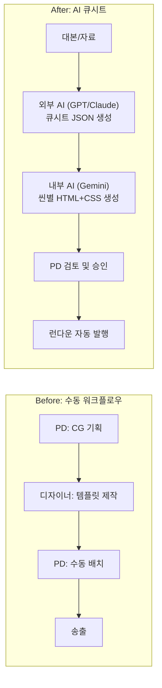
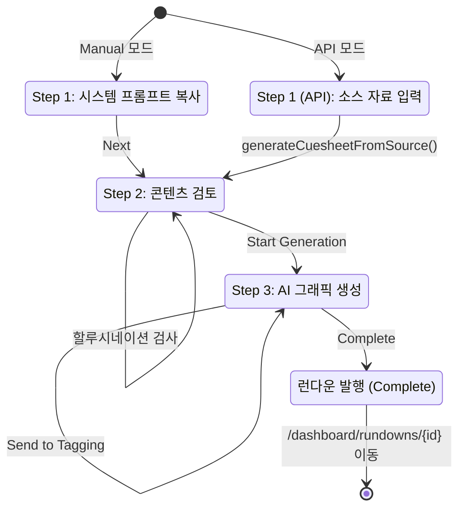
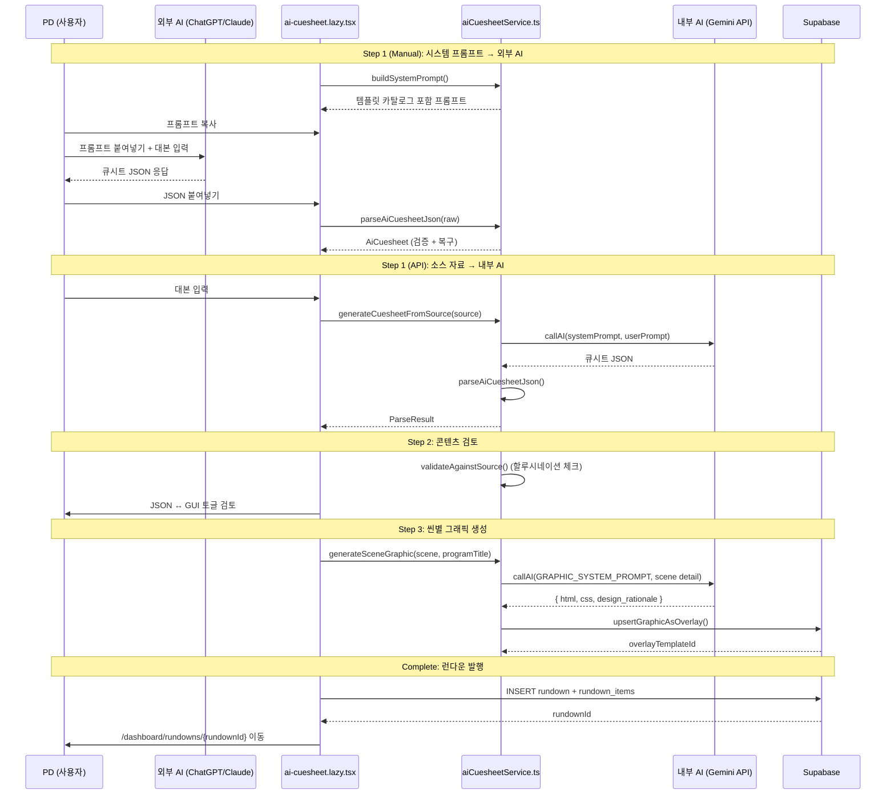
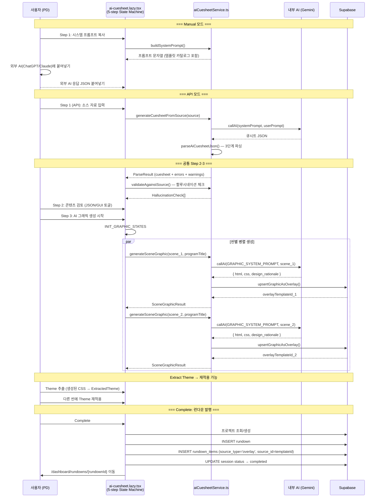

# Phase 7: AI 큐시트 (AI Cuesheet)

> **학습 목표**: 단일 오버레이 제어를 넘어, AI가 방송 대본을 분석하여 전체 런다운(Rundown)을 자동 생성하는 엔드-투-엔드 파이프라인을 이해한다.

---

## 7.1 단일 오버레이에서 전체 런다운으로

Phase 6의 컨트롤러가 **단일 오버레이의 송출(PVW/PGM)** 을 제어했다면, AI 큐시트는 **프로그램 전체의 그래픽 구성을 자동 생성**합니다.

기존 워크플로우의 문제점:
1. PD가 모든 CG 장면을 수동으로 기획
2. 디자이너가 각 장면별로 템플릿 제작
3. 매번 반복되는 작업으로 인한 시간 낭비

AI 큐시트가 해결하는 방식:
1. 외부 AI(ChatGPT/Claude)가 방송 대본을 분석하여 구조화된 JSON 생성
2. 내부 AI(Gemini API)가 각 장면별로 HTML/CSS 그래픽 자동 생성
3. PD는 검토만 하면 런다운이 완성



---

## 7.2 5-Step 상태 기계 (The Wizard)

AI 큐시트는 **5단계 위자드(마법사)** 형태로 구현되어 있으며, `useReducer`로 상태가 중앙 관리됩니다.

**핵심 파일**: `src/routes/dashboard/ai-cuesheet.lazy.tsx`

### 두 가지 모드

| 모드 | Step 1 | 대상 | 방식 |
|------|--------|------|------|
| **Manual** | 시스템 프롬프트 복사 | ChatGPT/Claude 등 | `buildSystemPrompt()`를 복사하여 외부 AI에 붙여넣기 |
| **API** | 소스 자료 입력 | 내장 AI (Gemini) | 대본을 입력하면 내부 API가 자동으로 큐시트 생성 |

```typescript
// ai-cuesheet.lazy.tsx (라인 186-187)
const WIZARD_STEPS_MANUAL: CuesheetWizardStep[] = ["system-prompt", "content-review", "graphic-generate"];
const WIZARD_STEPS_API: CuesheetWizardStep[] = ["source-input", "content-review", "graphic-generate"];
```

### 전체 흐름



---

## 7.3 2단계 AI 접근법 (Two-Step AI)

### 왜 두 단계로 나누었는가?

| 단계 | AI 종류 | 역할 | 이유 |
|------|---------|------|------|
| **Step 1: 기획** | 외부 AI (ChatGPT/Claude) | 방송 대본 분석, 큐시트 JSON 생성 | **창의적 기획**이 필요. PD가 직접 선택한 AI 사용 |
| **Step 3: 제작** | 내부 AI (Gemini API) | 각 씬별 HTML+CSS 그래픽 생성 | **코드 생성**이 필요. 일관된 출력 형식과 품질 관리 |

이 분리는 다음과 같은 장점이 있습니다:
- PD가 가장 능숙한 외부 AI 도구를 자유롭게 선택
- 코드 생성은 내부 파이프라인으로 품질 관리
- 외부 AI 응답은 JSON만 검증하면 되므로 통합 부담 최소화



---

## 7.4 위자드 상태 관리 (Wizard Reducer)

10개로 파편화되어 있던 `useState`를 단일 `useReducer`로 중앙화했습니다.

**핵심 파일**: `src/components/ai-cuesheet/wizardReducer.ts`

```typescript
// wizardReducer.ts — 상태 구조
export interface CuesheetWizardState {
    sessionId: string | null;
    mode: "manual" | "api";
    step: CuesheetWizardStep;         // 현재 단계
    visitedSteps: CuesheetWizardStep[]; // 방문한 단계 기록
    sourceMaterial: string;            // Step 1 (API): 원본 자료
    systemPrompt: string;              // Step 1 (Manual): 시스템 프롬프트
    rawJson: string;                   // 원본 JSON 문자열
    parseResult: ParseResult | null;   // 파싱 + 검증 결과
    graphicStates: SceneGraphicState[]; // 씬별 생성 상태
    extractedThemes: Record<string, ExtractedTheme>; // 추출된 테마 저장소
}
```

### Reducer 액션 타입

```typescript
export type WizardAction =
    | { type: "SET_STEP"; step: CuesheetWizardStep }
    | { type: "SET_SOURCE_MATERIAL"; value: string }
    | { type: "SET_RAW_JSON"; value: string }
    | { type: "SET_PARSE_RESULT"; result: ParseResult | null }
    | { type: "SET_SESSION_ID"; id: string | null }
    | { type: "INIT_GRAPHIC_STATES"; sceneCount: number }
    | { type: "UPDATE_GRAPHIC_STATE"; sceneIdx: number; patch: Partial<SceneGraphicState> }
    | { type: "EXTRACT_THEME"; id: string; theme: ExtractedTheme }
    | { type: "UPDATE_SLOT"; sceneIdx: number; slotIdx: number; patch: Partial<TextSlot> }
    | { type: "UPDATE_SCENE"; sceneIdx: number; patch: Partial<SceneContent> }
    | { type: "ADD_SLOT"; sceneIdx: number }
    | { type: "REMOVE_SLOT"; sceneIdx: number; slotIdx: number }
    | { type: "ADD_SCENE" }
    | { type: "REMOVE_SCENE"; sceneIdx: number };
```

### 세션 복원 및 Auto-Save

위자드는 **세션 지속성**을 지원합니다. 브라우저를 닫았다 다시 열어도 이전 작업 상태를 복원할 수 있습니다.

```typescript
// ai-cuesheet.lazy.tsx — 세션 복원 (라인 214-256)
useEffect(() => {
    if (!initialSessionId) return;
    const { session, scenes } = await getSession(initialSessionId);
    dispatch({ type: "SET_SESSION_ID", id: session.id });
    // 저장된 씬 데이터 → SceneContent[] 복원
    // 저장된 graphicStates (생성된 HTML/CSS) → 상태 복원
    dispatch({ type: "SET_STEP", step: "content-review" });
}, [initialSessionId]);
```

Auto-save는 2초 디바운스로 동작하며, 그래픽 생성 완료 시 즉시 저장됩니다:

```typescript
// ai-cuesheet.lazy.tsx — Auto-save (라인 260-292)
useEffect(() => {
    if (!state.parseResult?.cuesheet || !state.sessionId) return;
    clearTimeout(saveTimerRef.current);

    const doneCount = state.graphicStates.filter(g => g.status === "done").length;
    const shouldSaveNow = doneCount > prevDoneCountRef.current;
    const delay = shouldSaveNow ? 0 : 2000;

    saveTimerRef.current = setTimeout(async () => {
        const sid = await autoSaveWizardState(state.sessionId!, state);
        if (sid !== state.sessionId) dispatch({ type: "SET_SESSION_ID", id: sid });
    }, delay);
}, [state.parseResult, state.rawJson, state.graphicStates, state.sessionId]);
```

---

## 7.5 Step 1: 시스템 프롬프트 (buildSystemPrompt)

`buildSystemPrompt()`는 AI가 큐시트 JSON을 생성할 때 사용할 시스템 프롬프트를 동적으로 구성합니다.

**핵심 파일**: `src/services/aiCuesheetService.ts` (라인 38-171)

프롬프트는 다음과 같은 섹션으로 구성됩니다:

1. **역할 정의**: "당신은 WebCG-K 방송 그래픽 시스템의 콘텐츠 기획자입니다."
2. **핵심 원칙**: "콘텐츠만 설계하고, 디자인은 결정하지 않는다."
3. **TextSlot 정의**: `semantic_role`, `importance`, `zone_hint`, `style_hint`, `context`
4. **Graphic Intent**: 각 씬에 그래픽이 필요한 이유를 1-2문장으로
5. **JSON 출력 형식**: 순수 JSON만 출력, 마크다운 코드블록 없음

### Semantic Role 정의 (SSOT)

`buildSystemPrompt()`는 `buildRolePromptFragment()`를 호출하여 모든 Semantic Role 정의를 프롬프트에 자동 주입합니다.

**핵심 파일**: `src/lib/semanticRoleDefs.ts`

| Role | 설명 | Importance | 일반 배치 |
|------|------|-----------|----------|
| `name` | 인물 이름 (홍길동) | 4-5 | `bottom_bar` |
| `subtitle` | 부제목/직함 (서울시장) | 3-4 | `bottom_bar` |
| `affiliation` | 소속/단체명 | 2-3 | `bottom_bar` |
| `title` | 프로그램/섹션 제목 | 4-5 | `top_bar` |
| `stat` | 통계 수치 (72%) | 4-5 | `center` |
| `quote` | 인용문/발언 | 3-4 | `center` |
| `label` | 태그/분류 (LIVE, 속보) | 2-3 | `top_bar` |

**SSOT 원칙**: 새 role을 추가하려면 `semanticRoleDefs.ts`의 `SEMANTIC_ROLE_DEFS` 배열만 수정하면 됩니다. 시스템 프롬프트, 그래픽 생성 프롬프트, UI 표시가 모두 자동 반영됩니다.

```typescript
// semanticRoleDefs.ts (라인 27-91)
export const SEMANTIC_ROLE_DEFS: SemanticRoleDef[] = [
    { role: "name", label: "이름", description: "인물 이름 (홍길동)",
      importanceHint: "4-5 (가장 두드러지게)", typicalZone: "bottom_bar" },
    // ...
];
```

---

## 7.6 Step 2: JSON 파싱 및 검증 (parseAiCuesheetJson)

외부 AI의 응답은 항상 완벽한 JSON이라고 보장할 수 없습니다. `parseAiCuesheetJson()`은 **3단계 파싱 전략**으로 이 문제를 해결합니다.

**핵심 파일**: `src/services/aiCuesheetService.ts` (라인 236-284)

```typescript
export function parseAiCuesheetJson(raw: string): ParseResult {
    const errors: string[] = [];
    const warnings: string[] = [];

    // 1단계: 직접 JSON 파싱
    try {
        const parsed = JSON.parse(cleaned);
        const cuesheet = validateAndBuildCuesheet(parsed, warnings);
        if (cuesheet) return { cuesheet, errors, warnings };
    } catch { /* Level 2로 */ }

    // 2단계: 잘린 JSON 복구 (Truncation Recovery)
    const recovered = recoverTruncatedJson(cleaned);
    if (recovered) {
        try {
            const parsed = JSON.parse(recovered);
            const cuesheet = validateAndBuildCuesheet(parsed, warnings);
            if (cuesheet) return { cuesheet, errors, warnings };
        } catch { /* Level 3으로 */ }
    }

    // 3단계: 필드별 추출 (최후의 수단)
    const cuesheet = extractCuesheetFields(cleaned, errors, warnings);
    if (cuesheet) return { cuesheet, errors, warnings };

    errors.push("JSON을 파싱할 수 없습니다.");
    return { cuesheet: null, errors, warnings };
}
```

### Truncation Recovery

AI 응답이 중간에 잘렸을 때, 닫히지 않은 중괄호를 찾아 복구합니다:

```typescript
// aiCuesheetService.ts (라인 461-492)
function recoverTruncatedJson(json: string): string | null {
    let depth = 0;
    let lastValidClose = -1;
    for (let i = 0; i < json.length; i++) {
        if (ch === "{") depth++;
        else if (ch === "}") { depth--; if (depth === 0) lastValidClose = i; }
    }
    if (lastValidClose > 0) {
        return json.substring(0, lastValidClose + 1);
    }
    return null;
}
```

### v3 → v4 하위 호환

일부 AI가 아직 v3 형식으로 응답하는 경우, `convertV3SemanticNodesToSlots()`가 자동 변환을 처리합니다:

```typescript
// aiCuesheetService.ts (라인 349-376)
function convertV3SemanticNodesToSlots(sscene, sceneIdx): TextSlot[] {
    const nodes = Array.isArray(sscene.semantic_nodes) ? sscene.semantic_nodes : [];
    return nodes.map(node => ({
        semantic_role: V3_TO_V4_ROLE[node.semantic_role] ?? "subtitle",
        value: node.value,
        importance: Math.max(1, Math.min(5, Math.round(node.importance / 2))),
        zone_hint: defaultZone,
        style_hint: node.style_hint ?? "normal",
    }));
}
```

---

## 7.7 Step 2: 할루시네이션 방어 (Hallucination Defense)

AI가 생성한 텍스트가 원본 자료에 실제로 존재하는지 **3단계 매칭**으로 검증합니다.

**핵심 파일**: `src/services/aiCuesheetService.ts` (라인 687-787)

```typescript
export interface HallucinationCheck {
    sceneIdx: number;
    slotIdx: number;
    value: string;
    confidence: number;    // 0.0 ~ 1.0
    matchType: "exact" | "substring" | "fuzzy" | "none";
    warning?: string;
}
```

### 3단계 매칭 알고리즘

1. **Level 1: 정규화된 정확 매칭** (`confidence: 1.0`)
   - 소문자, 특수문자 제거 후 정확 일치 검사
2. **Level 2: 부분 문자열 매칭** (`confidence: 0.8`)
   - value의 70% 이상 길이의 부분 문자열이 source에 존재하는지 검사
3. **Level 3: 단어 단위 매칭** (`confidence: 0.6 ~ 1.0`)
   - value의 단어 중 60% 이상이 source에 존재하는지 검사

```typescript
// aiCuesheetService.ts (라인 687-787)
export function validateAgainstSource(
    scenes: SceneContent[],
    sourceMaterial: string,
): HallucinationCheck[] {
    for (const scene of scenes) {
        for (const slot of scene.text_slots) {
            // Level 1: 정확 매칭
            if (sourceNorm.includes(valNorm)) {
                results.push({ confidence: 1.0, matchType: "exact" });
                continue;
            }
            // Level 2: 부분 문자열
            if (valNorm.length >= 3) {
                // 70% 이상 길이의 서브스트링 매칭
            }
            // Level 3: 단어 단위
            const wordRatio = matchedWords.length / valWords.length;
            if (wordRatio >= 0.6) {
                results.push({ confidence: wordRatio, matchType: "fuzzy" });
                continue;
            }
            // No match → hallucination 가능성
            results.push({
                confidence: 0, matchType: "none",
                warning: "원본 자료에서 이 값을 찾을 수 없습니다.",
            });
        }
    }
}
```

---

## 7.8 Step 3: 씬별 AI 그래픽 생성 (generateSceneGraphic)

각 씬(SceneContent)에 대해 AI가 HTML+CSS 그래픽을 생성합니다.

**핵심 파일**: `src/services/aiCuesheetService.ts` (라인 792-1009)

### 그래픽 생성 시스템 프롬프트

AI 그래픽 디자이너 프롬프트는 다음과 같은 제약을 포함합니다:

- **캔버스**: 1920x1080 (16:9)
- **투명 배경**: `fullscreen`이 아닌 모든 zone은 `background: transparent` 강제 (OBS 호환)
- **CSS Custom Properties**: 모든 색상은 `--cg-primary`, `--cg-accent` 등의 변수로 지정
- **텍스트 충실성**: 입력된 텍스트 값을 절대 수정/축약/변형 금지
- **GPU 가속**: 애니메이션은 `transform`, `opacity`만 사용

```typescript
// aiCuesheetService.ts (라인 886-905)
export async function generateSceneGraphic(
    scene: SceneContent,
    programTitle: string,
    options?: {
        themeTokens?: ThemeTokens | null;
        extractedTheme?: ExtractedTheme | null;
        existingCode?: { html: string; css: string } | null;
        modifyRequest?: string | null;
    },
): Promise<SceneGraphicResult> {
    // 신규 생성 또는 수정(Modify) 모드 지원
    const userPrompt = buildGraphicUserPrompt(scene, programTitle, options);
    const { text } = await callAI(GRAPHIC_GENERATION_SYSTEM_PROMPT, userPrompt, {
        maxOutputTokens: 32768,
        enforceJsonObject: true,
        requestType: "cuesheet_graphic_generation",
    });
    return parseGraphicResponse(text);
}
```

### 결과: overlay_templates 저장

생성된 HTML/CSS는 Supabase `overlay_templates` 테이블에 저장되어, 이후 런다운 발행에 사용됩니다:

```typescript
// aiCuesheetService.ts (라인 1114-1155)
export async function upsertGraphicAsOverlay(
    html: string, css: string, name: string,
    userId: string, existingTemplateId?: string,
): Promise<string> {
    const sourceCode = { html, css, js: "" };

    if (existingTemplateId) {
        // UPDATE (재생성/수정)
        await supabase.from("overlay_templates")
            .update({ source_code: sourceCode, name })
            .eq("id", existingTemplateId);
        return existingTemplateId;
    }

    // INSERT
    const { data } = await supabase.from("overlay_templates")
        .insert({
            name, plugin_type: "html",
            source_code: sourceCode, category: "cg_panel",
            owner_id: userId, source_type: "ai_generated",
            tags: ["ai-cuesheet"],
        }).select("id").single();
    return data.id;
}
```

---

## 7.9 StepGraphicGenerate 컴포넌트

**핵심 파일**: `src/components/ai-cuesheet/StepGraphicGenerate.tsx`

이 컴포넌트는 다음과 같은 기능을 제공합니다:

### 씬 탭 내비게이션

씬 순서대로 탭이 표시되며, 각 탭의 상태 아이콘으로 진행 상황을 한눈에 파악할 수 있습니다:
- `Check` (초록): 생성 완료
- `Refresh` (파랑, 회전): 생성 중
- `XCircle` (빨강): 오류

### iframe 미리보기 (1920x1080 스케일링)

```tsx
// StepGraphicGenerate.tsx — iframe scale (라인 69-84)
useEffect(() => {
    const observer = new ResizeObserver((entries) => {
        const { width, height } = entry.contentRect;
        const scaleX = width / 1920;
        const scaleY = height / 1080;
        setIframeScale(Math.min(scaleX, scaleY, 1)); // 절대 업스케일 금지
    });
    observer.observe(containerRef.current);
    return () => observer.disconnect();
}, []);
```

### Theme 추출 및 재적용

생성된 CSS에서 `--cg-*` 변수를 추출하여 테마로 저장하고, 다른 씬에 재적용할 수 있습니다:

```typescript
// aiCuesheetService.ts (라인 1039-1069)
export function extractThemeFromCss(css: string): ExtractedTheme | null {
    const primary = extractCssVar(css, "--cg-primary");
    const accent = extractCssVar(css, "--cg-accent");
    // ...
    return {
        colors: { primary, accent, background, text: { main, muted } },
        typography: { fontFamily },
        layout: { borderRadius },
    };
}
```

### Modify (수정 모드)

생성된 그래픽에 대해 자연어로 수정 요청을 보낼 수 있습니다. 기존 HTML/CSS를 컨텍스트로 전달하여, 요청된 부분만 변경됩니다:

```typescript
// StepGraphicGenerate.tsx — Modify (라인 131-172)
const handleModify = async (sceneIdx: number) => {
    const result = await generateSceneGraphic(scene, programTitle, {
        existingCode: { html: state.generatedHtml!, css: state.generatedCss! },
        modifyRequest: request,
    });
    // 변경된 HTML/CSS 저장 및 UI 갱신
};
```

### Send to Tagging

생성된 그래픽을 **Graphic Tagging** 페이지로 전송하여, 텍스트 슬롯과 HTML 요소를 수동 매핑할 수 있습니다:

```typescript
// StepGraphicGenerate.tsx (라인 204-217)
const handleSendToTagging = (sceneIdx: number) => {
    sessionStorage.setItem("graphic-tagging:scene", JSON.stringify({
        html: state.generatedHtml,
        css: state.generatedCss,
        programTitle, scene,
    }));
    navigate({ to: "/dashboard/graphic-tagging" });
};
```

---

## 7.10 Step 2: 콘텐츠 검토 (StepContentReview)

**핵심 파일**: `src/components/ai-cuesheet/StepContentReview.tsx`

이 단계에서는 AI가 생성한 큐시트를 **JSON과 GUI 모두에서 검토**할 수 있습니다:

- **JSON Raw 뷰**: JSON을 직접 편집 (숙련자)
- **GUI 뷰**: 씬/슬롯을 폼 형태로 편집 (초보자)
- **할루시네이션 체크 결과 표시**: confidence가 낮은 항목 경고
- **씬 추가/삭제, 슬롯 추가/삭제** 가능

### Scene/Slot 편집 액션 (Reducer)

```typescript
// wizardReducer.ts (라인 104-167)
case "UPDATE_SLOT": {
    // 특정 슬롯의 value, importance, zone_hint 등 수정
    scenes[action.sceneIdx].text_slots[action.slotIdx] = { ...slot, ...action.patch };
    // 변경 시 rawJson도 자동 재생성
    return { ...state, rawJson: JSON.stringify(cuesheet, null, 2) };
}
```

---

## 7.11 Complete: 런다운 발행

모든 씬의 그래픽이 생성되면, **Complete** 버튼으로 런다운을 발행합니다:

```typescript
// ai-cuesheet.lazy.tsx — Complete 핸들러 (라인 492-552)
const handleComplete = async () => {
    // 1. 사용자 확인
    const { data: { user } } = await supabase.auth.getUser();

    // 2. 프로젝트 조회/생성
    const { data: projects } = await supabase.from("projects")
        .select("id").eq("owner_id", user.id).limit(1);

    // 3. 런다운 생성
    const { data: rundown } = await supabase.from("rundowns")
        .insert({ project_id, title: programTitle, ... }).select("id").single();

    // 4. 생성된 씬 → rundown_items로 변환 (source_type='overlay')
    const inserts = doneStates.map((gs, i) => ({
        rundown_id: rundownId,
        source_type: "overlay",
        source_id: gs.overlayTemplateId,   // ← Bundle-aware: template ID 참조
        source_name: scene.trigger,
        data: { scene_data: scene, program_title: programTitle },
        item_order: i + 1,
        duration: scene.duration ?? 15,
    }));

    // 5. 세션 완료 처리
    await supabase.from("ai_cuesheet_sessions")
        .update({ status: "completed" }).eq("id", state.sessionId);

    // 6. 런다운 페이지로 이동
    navigate({ to: `/dashboard/rundowns/${rundownId}` });
};
```

### Bundle-aware 등록

생성된 각 그래픽은 `overlay_templates`에 저장될 때 `tags: ["ai-cuesheet"]`와 `source_type: "ai_generated"`가 설정됩니다. 런다운 아이템은 `source_id`로 이 템플릿 ID를 참조하여, 나중에 템플릿이 수정되어도 기존 런다운에 영향이 없도록 합니다.

---

## 7.12 타입 정의: AI 큐시트 데이터 모델

**핵심 파일**: `src/lib/aiCuesheetTypes.ts`

```typescript
// 하나의 텍스트 조각
export interface TextSlot {
    semantic_role: SemanticRole;  // "name" | "subtitle" | "stat" | ...
    value: string;                // 실제 표시 텍스트
    context?: string;             // PD 검토용 부연설명 (CG 미표시)
    importance: number;           // 1~5 (5=가장 두드러짐)
    zone_hint: ZoneHint;          // "bottom_bar" | "top_bar" | "center" | "left_third" | "fullscreen"
    style_hint: StyleHint;        // "emphasis" | "normal" | "muted"
}

// 한 장면(Scene)의 콘텐츠 정의
export interface SceneContent {
    order: number;
    trigger: string;              // 방송 트리거 (예: "전문가 첫 등장")
    graphic_intent: string;       // 그래픽이 필요한 이유
    duration: number;             // 지속 시간 (초)
    text_slots: TextSlot[];       // 표시할 텍스트 조각들
    _design_rationale?: string;   // AI의 디자인 연출 의도
}

// AI가 생성하는 전체 큐시트
export interface AiCuesheet {
    _design_rationale?: string;
    program_title: string;
    expert: { name: string; title: string; affiliation?: string };
    scenes: SceneContent[];
}

// 그래픽 생성 결과
export interface SceneGraphicResult {
    html: string;
    css: string;
    design_rationale: string;     // AI의 디자인 의도 (한국어)
}

// 추출된 테마
export interface ExtractedTheme {
    colors: { primary, accent, background, text: { main, muted } };
    typography: { fontFamily: string };
    layout: { borderRadius: string };
}

// 씬별 그래픽 생성 상태
export interface SceneGraphicState {
    sceneIndex: number;
    status: "idle" | "generating" | "done" | "error";
    generatedHtml?: string;
    generatedCss?: string;
    appliedThemeId?: string;
    overlayTemplateId?: string;   // 저장된 overlay_templates 참조
    errorMessage?: string;
}
```

---

## 7.13 Step 컴포넌트 개요

모든 Step 컴포넌트는 `src/components/ai-cuesheet/` 디렉토리에 위치합니다:

| 파일 | 역할 | 주요 기능 |
|------|------|----------|
| `StepSystemPrompt.tsx` | 시스템 프롬프트 표시 및 복사 | 프롬프트 텍스트 표시, 클립보드 복사 |
| `StepSourceInput.tsx` | 소스 자료 입력 | 대본 텍스트 입력, 자동 생성 트리거 |
| `StepContentReview.tsx` | 콘텐츠 검토 | JSON/GUI 이중 편집, 할루시네이션 체크 표시 |
| `StepGraphicGenerate.tsx` | 씬별 그래픽 생성 | iframe 미리보기, Theme 추출/적용, Modify, Tagging 전송 |
| `SceneReviewList.tsx` | 씬 리뷰 목록 | (Phase 3) 런다운 삽입 전 최종 시각 검토 |
| `wizardReducer.ts` | 상태 Reducer | 모든 상태 전이를 명시적 Action으로 관리 |

---

## 7.14 전체 시퀀스 다이어그램



---

## 7.15 요약

| 개념 | 구현 위치 | 핵심 역할 |
|------|----------|----------|
| 위자드 페이지 | `ai-cuesheet.lazy.tsx` | 5단계 상태 기계, 두 가지 모드(Manual/API) |
| 시스템 프롬프트 | `aiCuesheetService.ts:buildSystemPrompt()` | 템플릿 카탈로그 포함 프롬프트 생성 |
| JSON 파싱 | `aiCuesheetService.ts:parseAiCuesheetJson()` | 3단계 복구 전략 (직접/Truncation/필드추출) |
| 할루시네이션 방어 | `aiCuesheetService.ts:validateAgainstSource()` | 3단계 매칭 (정확/부분/단어) |
| 씬별 그래픽 생성 | `aiCuesheetService.ts:generateSceneGraphic()` | AI HTML+CSS 생성, 투명 배경 강제 |
| 템플릿 저장 | `aiCuesheetService.ts:upsertGraphicAsOverlay()` | overlay_templates INSERT/UPDATE |
| Theme 추출 | `aiCuesheetService.ts:extractThemeFromCss()` | CSS 변수 파싱 → ExtractedTheme |
| 그래픽 생성 UI | `StepGraphicGenerate.tsx` | iframe 미리보기, Theme 적용, Modify, Tagging 전송 |
| 콘텐츠 검토 UI | `StepContentReview.tsx` | JSON/GUI 토글, Scene/Slot 편집 |
| 상태 Reducer | `wizardReducer.ts` | 16개 명시적 Action 타입, 세션 복원 지원 |
| 타입 정의 | `aiCuesheetTypes.ts` | TextSlot, SceneContent, AiCuesheet 등 |
| Semantic Role SSOT | `semanticRoleDefs.ts` | 7개 Role 정의, 프롬프트 자동 생성 |
| 런다운 발행 | `ai-cuesheet.lazy.tsx:onComplete` | project → rundown → rundown_items, Bundle-aware |
