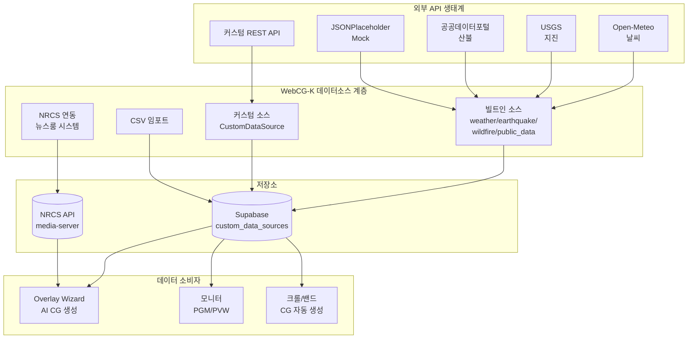
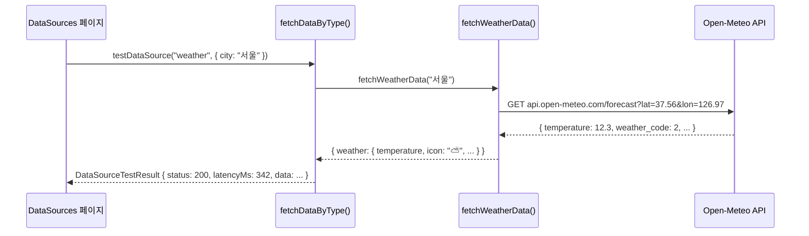
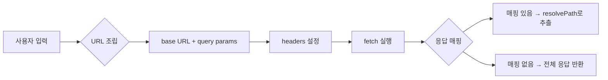
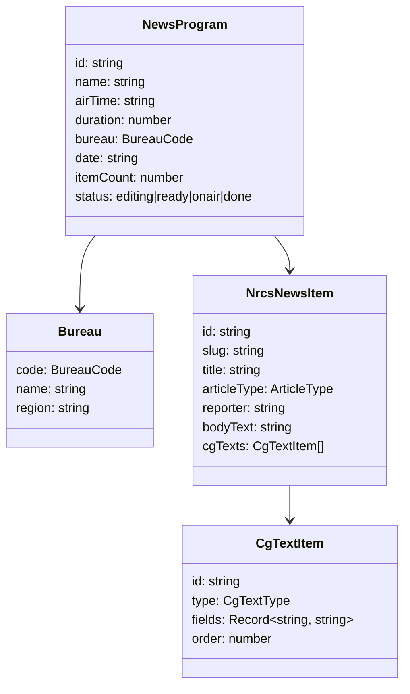
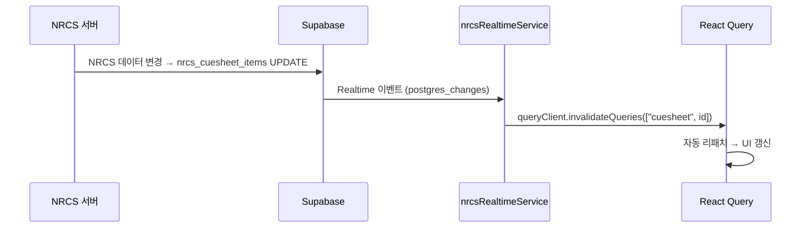
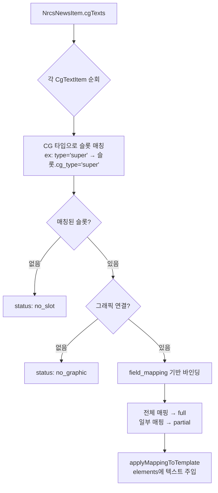
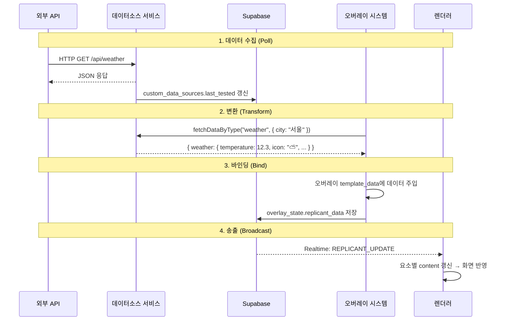
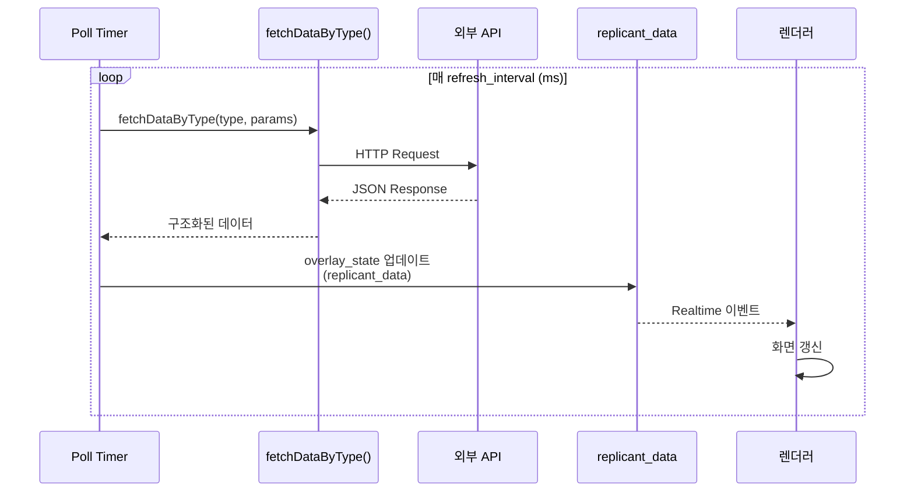

# Phase 8: 데이터소스 & NRCS 연동

> **학습 목표**: 방송 그래픽 시스템이 외부 데이터(날씨, 지진, 속보)를 가져와 송출 CG에 반영하는 전 과정을 이해한다.

---

## 8.1 왜 방송 CG에 "라이브 데이터"가 필요한가?

뉴스 방송에서 아래 자막들은 **전부 실시간 데이터**를 기반으로 합니다:

- **날씨 정보**: "서울 현재 기온 12.3°C"
- **지진 속보**: "오늘 14:23 경북 포항 M3.5 지진 발생"
- **산불 현황**: "강원도 양양군 산불 185ha 소실"
- **속보 크롤**: 방송국 NRCS(뉴스룸 시스템)에서 내려온 텍스트
- **선거 개표**: 외부 API를 통해 5초마다 갱신되는 득표율

> **멘토 노트**: 초보자가 흔히 하는 오해는 "CG는 디자이너가 미리 만든 이미지"라는 것입니다. 실제 방송 CG의 70%는 위와 같은 **데이터 기반 동적 콘텐츠**입니다. 데이터소스 시스템은 방송 그래픽을 정적 아트워크에서 **라이브 데이터 시각화 플랫폼**으로 바꾸는 핵심 계층입니다.

---

## 8.2 데이터소스 시스템 개요

### 8.2.1 주요 개념

방송 그래픽 시스템에서 데이터소스는 두 가지 계층으로 나뉩니다:



### 8.2.2 데이터소스 유형 (DataSourceType)

파일: `src/lib/overlayTypes.ts` (18-27행)

```typescript
export type DataSourceType =
    | "none"           // 데이터 미사용
    | "weather"        // Open-Meteo 날씨 API
    | "earthquake"     // USGS 지진 API
    | "wildfire"       // 공공데이터 산불 (현재 Mock)
    | "public_data"    // JSONPlaceholder Mock
    | "image_based"    // 이미지 기반 (추후 확장)
    | "custom_api"     // 사용자 정의 REST API
    | "mcp";           // MCP 프로토콜 (추후 확장)
```

각 유형은 `fetchDataByType()` 함수에서 스위치로 분기됩니다.

---

## 8.3 빌트인 데이터 소스 (Built-in Sources)

### 8.3.1 소스 카드 정의

파일: `src/routes/dashboard/datasources/-datasourcesTypes.ts`

빌트인 소스는 코드에 정적으로 정의된 카드 목록으로 관리됩니다:

```typescript
export const BUILTIN_SOURCES: SourceCardDef[] = [
    {
        type: "weather",
        icon: "🌤",
        title: "실시간 날씨",
        provider: "Open-Meteo API",
        description: "현재 기온, 날씨 상태, 습도, 풍속 데이터를 실시간으로 가져옵니다.",
        tags: [{ label: "무료", class: "free" }, { label: "인증 불필요", class: "free" }],
        accent: "rgba(96, 165, 250, 0.5)",
        hasCity: true,  // 도시 선택 UI 표시
        isBuiltIn: true,
    },
    // earthquake, wildfire, public_data ...
];
```

### 8.3.2 실제 데이터 fetch 흐름

파일: `src/services/dataProviders.ts`

각 소스 타입별 fetch 함수가 별도로 구현되어 있으며, 통합 함수 `fetchDataByType()`가 타입에 따라 라우팅합니다.



**핵심 구현** (`dataProviders.ts` 239-269행):

```typescript
export async function fetchDataByType(
    type: string,
    params?: Record<string, string>,
    customSource?: CustomDataSource,
): Promise<Record<string, unknown>> {
    switch (type) {
        case "weather":
            const city = params?.city ?? "서울";
            return { weather: await fetchWeatherData(city) };
        case "earthquake":
            return { earthquakes: await fetchEarthquakeData(), count: data.length };
        case "custom_api":
            if (!customSource) throw new Error("커스텀 소스 설정이 필요합니다.");
            return fetchCustomSource(customSource);
        // ...
    }
}
```

> **멘토 노트**: 이 switch 문이 **전략 패턴(Strategy Pattern)** 의 간단한 형태입니다. 새 데이터 소스 유형이 추가되면 case만 추가하면 됩니다. 프로덕션 규모가 되면 각 전략을 별도 파일로 분리하겠지만, 현재 5개 케이스에서는 이 정도면 충분합니다.

### 8.3.3 WeatherData 구조

```typescript
// overlayTypes.ts 260-268행
export interface WeatherData {
    temperature: number;
    weatherCode: number;
    weatherDescription: string;  // "맑음", "흐림", "비" 등
    icon: string;                // "☀️", "⛅", "🌧" 등
    city: string;
    humidity?: number;
    windSpeed?: number;
}
```

WMO 날씨 코드(0-99)를 한글 설명과 이모지로 매핑하는 `WEATHER_CODE_MAP`이 `dataProviders.ts` 12-38행에 정의되어 있습니다.

---

## 8.4 커스텀 데이터 소스 (Custom Data Sources)

### 8.4.1 DB 모델

테이블: `custom_data_sources` (Supabase)

파일: `src/lib/database.types.ts` (543-629행)

```typescript
export interface CustomDataSource {
    id: string;
    owner_id: string;
    name: string;
    icon: string;
    provider: string;
    endpoint: string;              // API URL
    method: "GET" | "POST";
    headers: Record<string, string>;
    query_params: Record<string, string>;
    auth_type: "none" | "api_key" | "bearer";
    response_mapping: Record<string, string>;  // 응답 필드 → CG 필드 매핑
    body_template: Record<string, unknown> | null;
    is_active: boolean;
    last_tested: string | null;
    last_status: number | null;
    workspace_id: string | null;   // 워크스페이스 격리
}
```

### 8.4.2 CRUD 서비스

파일: `src/services/dataSourceService.ts`

```typescript
export async function fetchCustomSources<T>(): Promise<T[]> {
    const { data, error } = await supabase
        .from("custom_data_sources")
        .select("*")
        .order("created_at", { ascending: false });
    if (error) throw error;
    return (data || []) as T[];
}
```

### 8.4.3 커스텀 API 호출 엔진

파일: `src/services/dataProviders.ts` (170-231행)

`fetchCustomSource()`는 사용자가 설정한 endpoint, method, headers, query_params를 조합하여 HTTP 요청을 수행합니다:



**응답 매핑**의 `resolvePath` 함수는 점(.) 표기법으로 JSON 내 필드를 추출합니다:

```typescript
// "response.body.items" → obj.response.body.items
function resolvePath(obj: unknown, path: string): unknown {
    const keys = path.split(".");
    let current: unknown = obj;
    for (const key of keys) {
        if (current == null || typeof current !== "object") return undefined;
        current = (current as Record<string, unknown>)[key];
    }
    return current;
}
```

### 8.4.4 등록 UI

파일: `src/routes/dashboard/datasources/-CustomSourceModal.tsx`

커스텀 소스 추가 모달에서 설정 가능한 항목:

| 항목 | 설명 | 예시 |
|------|------|------|
| 이름 | 소스 식별명 | "기상청 초단기실황" |
| 제공자 | API 제공자명 | "data.go.kr" |
| API URL | 엔드포인트 | `https://api.example.com/v1/data` |
| 메서드 | GET/POST | GET |
| 인증 방식 | none / api_key / bearer | bearer |
| 쿼리 파라미터 | Key-Value 페어 | `{ city: "서울" }` |
| 커스텀 헤더 | HTTP 헤더 | `{ Authorization: "Bearer xxx" }` |

---

## 8.5 CSV 파서 (CSV Import)

파일: `src/lib/csvParser.ts`

### 8.5.1 Why 네이티브?

방송 CG 큐시트 CSV는 단순 구조(10-50행, 5-10열)이므로 외부 라이브러리(Papa Parse ≈ 15KB gzip) 없이 **RFC 4180** 기본 규격만 지원하는 네이티브 파서를 사용합니다.

### 8.5.2 파싱 알고리즘

```typescript
export function parseCsv(csvText: string, options: CsvParseOptions = {}): CsvParseResult {
    const { hasHeader = true, maxRows = 0 } = options;

    // 1단계: 구분자 자동 탐지 (,  ;  \t)
    const delimiter = options.delimiter || detectDelimiter(csvText);

    // 2단계: 행+필드 분리 (따옴표 이스케이프 처리)
    const allRows = splitCsvRows(csvText, delimiter);

    // 3단계: 헤더/데이터 분리
    const headers = hasHeader ? allRows[0]... : ...;
    let rows = allRows.slice(dataStart).filter(row => row.some(cell => cell.trim()));
    // ...
}
```

**핵심**: 따옴표 안의 줄바꿈과 구분자는 필드의 일부이므로 단순 `split(",")`으로는 안 되고, **State Machine** 방식으로 문자를 하나씩 순회:

```typescript
function splitCsvRows(text: string, delimiter: string): string[][] {
    let inQuotes = false;
    for (let i = 0; i < text.length; i++) {
        if (inQuotes) {
            if (char === '"' && nextChar === '"') {
                // "" → 이스케이프된 따옴표
                currentField += '"'; i++;
            } else if (char === '"') {
                inQuotes = false;  // 따옴표 닫기
            }
        } else {
            // delimiter → 필드 구분
            // \n → 행 구분
            // " → 따옴표 열기
        }
    }
}
```

---

## 8.6 NRCS 연동 (뉴스룸 컴퓨터 시스템)

### 8.6.1 NRCS란?

NRCS(Newsroom Computer System)는 방송국에서 **기사 작성, 편집, 큐시트 관리, 송출**까지 담당하는 핵심 시스템입니다. KBS의 경우 본사(HQ)와 9개 지역 총국이 각각 NRCS를 운영합니다.

### 8.6.2 타입 계층

파일: `src/lib/nrcsTypes.ts`



**CG 텍스트 유형 (13종)**: super(슈퍼), source(출처), band(밴드), headline(헤드라인), subheadline(서브헤드), crawl(속보크롤), locator(지역), lowthird(하단자막), fullcg(풀CG), credit(크레딧), soundbite(사운드바이트), reporter(기자리포트), flash(속보헤드라인)

### 8.6.3 NRCS API 연동

파일: `src/services/nrcsService.ts`

```
NRCS_BASE_URL = http://{hostname}:3200/api/nrcs (개발)
               = process.env.VITE_NRCS_URL (프로덕션)
```

API 엔드포인트:

| 함수 | 경로 | 설명 |
|------|------|------|
| fetchNewsPrograms() | `/programs?date=...&bureau=...` | 프로그램 목록 |
| fetchNewsItems() | `/items?programId=...` | 기사 아이템 목록 |

### 8.6.4 NRCS 실시간 동기화

파일: `src/services/nrcsRealtimeService.ts`



Supabase Realtime 채널을 사용하여 NRCS 큐시트/아이템 변경 사항을 자동 감지합니다. `useCuesheetRealtime()` 훅으로 컴포넌트에서 구독합니다.

### 8.6.5 NRCS 매핑 엔진 (CgTextItem → 그래픽 슬롯)

파일: `src/services/nrcsMappingService.ts`

NRCS의 CG 텍스트 아이템을 번들 슬롯에 자동 매핑하는 엔진:



매핑 결과 상태:
- **full**: 모든 필드 매핑 완료
- **partial**: 일부 필드만 매핑
- **no_slot**: 매칭되는 슬롯 없음
- **no_graphic**: 슬롯에 연결된 그래픽 없음

**필드 값 주입** (`applyMappingToTemplate`)은 두 단계로 이루어집니다:
1. elements 배열에서 `target_element_id`를 직접 찾아 content 주입
2. Binding Container의 slots에서 검색 (Shape 내부 텍스트 슬롯)

---

## 8.7 데이터 흐름: 외부 API → 송출 CG



### 8.7.1 데이터가 렌더러까지 도달하는 경로

1. **외부 API Poll**: `fetchWeatherData()` 등이 직접 HTTP 호출
2. **상태 저장**: 결과가 overlay_state의 `replicant_data` 컬럼에 저장됨
3. **Realtime 전파**: Supabase Realtime이 변경을 렌더러(render.tsx)에 전파
4. **요소 갱신**: 렌더러가 `REPLICANT_UPDATE` 이벤트를 받아 각 GraphicElement의 content를 덮어씀

> **멘토 노트**: 이 흐름은 NodeCG의 replicant 개념을 차용한 것입니다. "replicant"는 데이터를 복제한다는 뜻으로, 서버의 데이터 변경이 모든 클라이언트(컨트롤러, 렌더러, 모니터)에 자동으로 "복제"되는 패턴입니다. WebCG-K에서는 Supabase Realtime이 이 역할을 대신합니다.

---

## 8.8 모니터 컴포넌트 (PGM / PVW)

### 8.8.1 PGMMonitor

파일: `src/components/Controller/PGMMonitor.tsx`

송출(PGM)된 그래픽 블록을 z-index 순서로 겹쳐 표시하는 컴포넌트입니다.

핵심 특징:
- **lastBroadcastPosition** 기준으로 현재 송출 중인 블록 결정
- **fade-in/fade-out** CSS 애니메이션 지원 (트랜지션 효과)
- **VideoInputLayer**를 z-index 0 배경으로 사용 (SDI/NDI/UVC)
- **CompositorLayer**로 오버레이(위젯) 합성
- `isBroadcasting=false`이면 "송출 대기 중" 화면 표시
- AI 캐릭터 레이어는 `render.tsx`에서만 표시 (모니터 패널 400px에서 Rive가 UI를 덮는 문제 방지)

### 8.8.2 PreviewMonitor

파일: `src/components/Controller/PreviewMonitor.tsx`

Playhead 위치의 모든 블록을 미리보기(PVW)하는 컴포넌트입니다.

PGM과의 차이점:
- **playheadPosition** 기준으로 블록 결정 (lastBroadcastPosition 대신)
- fade-out 완료된 블록을 PGM과 달리 **완전 제거** (clean-up)
- 멀티유저 스크러빙 모드 지원 (isScrubbing prop → 주황 테두리 + SCRUB MODE 뱃지)

---

## 8.9 위젯 개념 (카테고리 오버레이)

위젯은 **항상 표시되는** 라이브 데이터 기반 오버레이입니다. 일반 CG 블록과의 차이점:

| 속성 | 일반 CG 블록 | 위젯 (Widget Overlay) |
|------|-------------|---------------------|
| 표시 방식 | 타임라인 기반 ON/OFF | 항상 활성 (is_active=true) |
| 데이터 | 정적 또는 스냅샷 | 실시간 갱신 (poll/intervall) |
| 예시 | 뉴스 타이틀, 인터뷰 자막 | 날씨 띠, 시계, 주식 티커 |
| 렌더러 | GraphicPreviewRenderer | CompositorLayer + iframe |

위젯은 `overlay_templates` 테이블에 정의된 오버레이 중 `is_active = true`인 것들로, 세션이 live 상태인 동안 **항상** 송출 화면에 합성됩니다.

---

## 8.10 데이터 갱신 주기



- **빌트인 소스**: 수동 테스트 방식 (버튼 클릭 시 1회 fetch)
- **커스텀 소스**: `refresh_interval` 필드로 자동 갱신 주기 설정 (추후 확장)
- **NRCS**: Supabase Realtime 기반 실시간 동기화

---

## 8.11 파일 매니페스트

| 파일 | 역할 |
|------|------|
| `src/lib/overlayTypes.ts` | DataSourceType, CustomDataSource, DataSourceConfig 타입 |
| `src/services/dataProviders.ts` | fetchDataByType, 커스텀 API 호출, 웨더/지진/산불 fetch |
| `src/services/dataSourceService.ts` | custom_data_sources CRUD (Supabase) |
| `src/lib/csvParser.ts` | 네이티브 CSV 파서 (RFC 4180) |
| `src/lib/nrcsTypes.ts` | Bureau, NewsProgram, CgTextItem, NrcsNewsItem 타입 |
| `src/services/nrcsService.ts` | NRCS REST API 클라이언트 |
| `src/services/nrcsRealtimeService.ts` | Supabase Realtime 구독 훅 |
| `src/services/nrcsMappingService.ts` | CgTextItem → 번들 슬롯 자동 매핑 엔진 |
| `src/routes/dashboard/datasources/index.lazy.tsx` | 데이터소스 관리 페이지 (탭/카드/테스트) |
| `src/routes/dashboard/datasources/-datasourcesTypes.ts` | SourceCardDef, BUILTIN_SOURCES |
| `src/routes/dashboard/datasources/-CustomSourceModal.tsx` | 커스텀 소스 등록 모달 |
| `src/routes/dashboard/datasources/-NrcsPanel.tsx` | NRCS 연동 패널 |
| `src/components/Controller/PGMMonitor.tsx` | PGM 송출 모니터 |
| `src/components/Controller/PreviewMonitor.tsx` | PVW 프리뷰 모니터 |
| `supabase/migrations/202605120001_workspaces.sql` | custom_data_sources + workspace_id |

---

## 8.12 요약

데이터소스 시스템은 방송 그래픽을 정적 디자인에서 **라이브 데이터 시각화 플랫폼**으로 전환하는 핵심 계층입니다.

1. **빌트인 소스** (weather, earthquake, wildfire, public_data)는 즉시 사용 가능한 무료 API 연동
2. **커스텀 소스**는 사용자가 직접 REST API를 등록하고 응답 매핑을 설정
3. **NRCS 연동**은 방송국 뉴스룸 시스템과의 양방향 데이터 연동 (프로그램 → 기사 → CG 텍스트)
4. **CSV Import**는 큐시트 데이터를 파일로 불러오기
5. **fetchDataByType()** 전략 패턴으로 모든 소스 타입 통합
6. **NRCS Mapping Engine**이 CG 텍스트를 그래픽 슬롯에 자동 바인딩
7. 최종 데이터는 **Realtime → replicant_data → 렌더러 갱신** 파이프라인으로 송출
