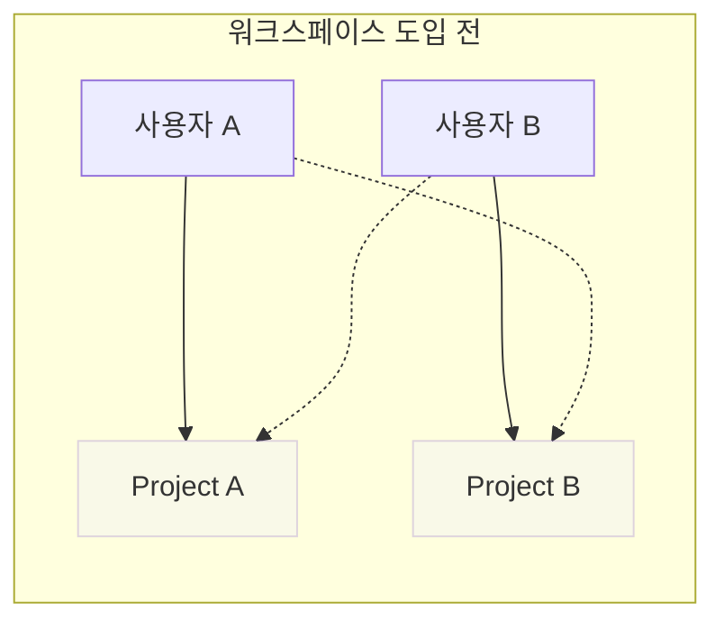
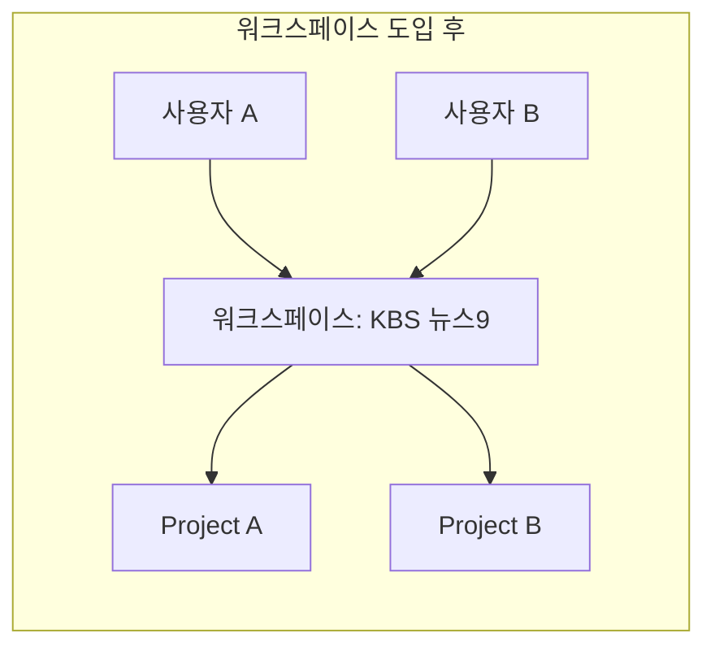
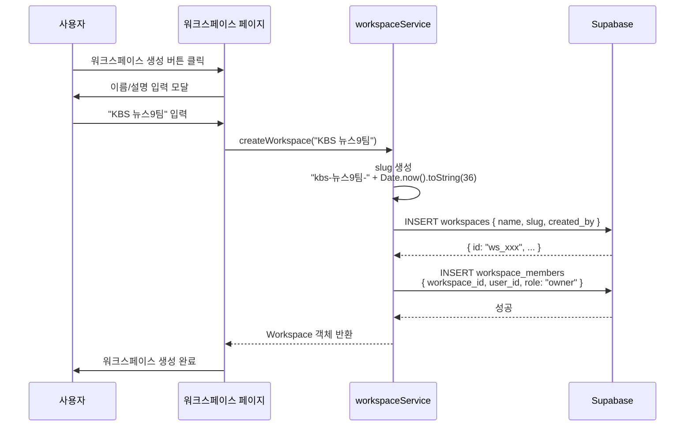
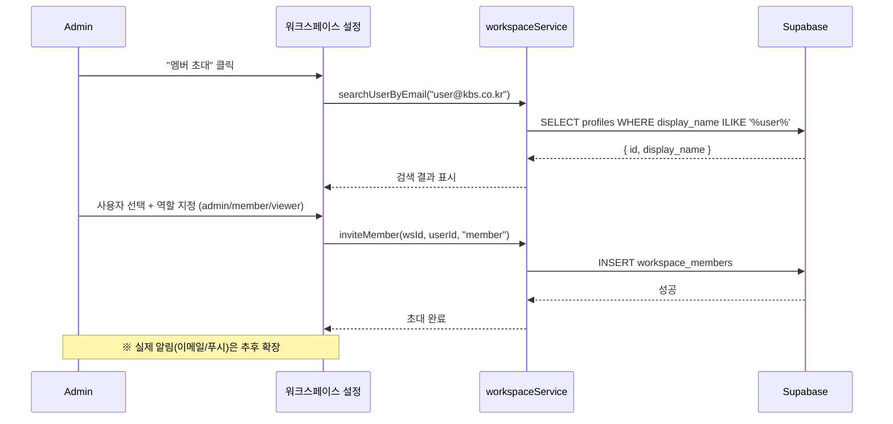
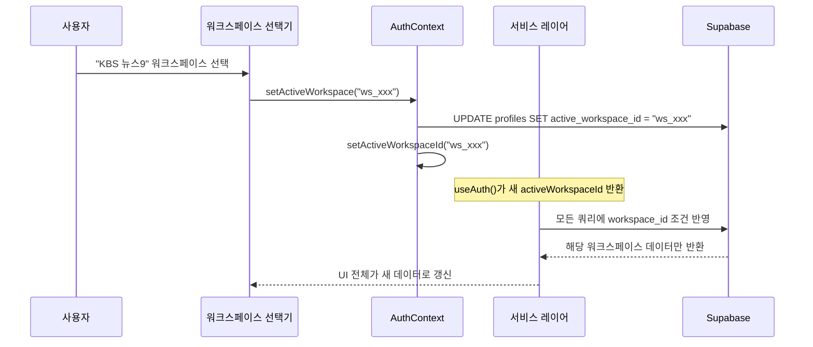
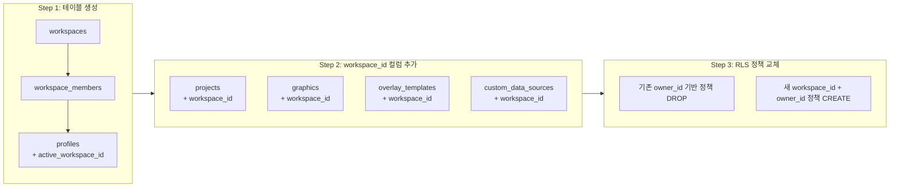

# Phase 9: 워크스페이스 (멀티 테넌트)

> **학습 목표**: 하나의 WebCG-K 인스턴스에서 여러 팀이 독립적으로 작업할 수 있는 워크스페이스 시스템의 설계와 구현을 이해한다.

---

## 9.1 왜 멀티 테넌트가 마지막인가?

> **멘토 노트**: 이 순서는 우연이 아닙니다. 많은 프로젝트가 "여러 팀이 쓸 거야"라고 미리 예측하고 멀티 테넌트를 먼저 구현했다가, 단일 팀 요구사항도 제대로 처리하지 못해 프로젝트가 산으로 갑니다. **"먼저 싱글 테넌트를 완벽하게 만든 다음, 그 위에 멀티 테넌트를 쌓아라"** 가 정석입니다.

**Phase 9가 마지막인 이유**:

1. **기능 우선**: 데이터소스, NRCS, 타임라인, 오버레이 등 핵심 기능이 먼저 안정화되어야 합니다.
2. **데이터 모델 확정**: 모든 테이블의 스키마가 결정된 후에야 `workspace_id` 컬럼을 추가할 수 있습니다.
3. **RLS 정책 일괄 변경**: 모든 테이블의 Row-Level Security 정책을 한 번에 마이그레이션합니다.
4. **하위 호환 보장**: 기존 데이터(`workspace_id IS NULL`)는 정상 동작해야 합니다.

---

## 9.2 워크스페이스가 해결하는 문제

### 9.2.1 공유 불가능의 벽

워크스페이스 도입 전, 모든 데이터는 **owner_id 기반 개인 소유**였습니다:



A가 만든 큐시트를 B가 볼 수 없었습니다. 같은 제작팀인데도 자료 공유가 불가능했습니다.

### 9.2.2 워크스페이스로 해결



같은 워크스페이스의 멤버는 모든 자료를 자동으로 공유합니다.

---

## 9.3 데이터 모델

### 9.3.1 workspaces 테이블

파일: `supabase/migrations/202605120001_workspaces.sql`

```sql
CREATE TABLE workspaces (
    id UUID PRIMARY KEY DEFAULT gen_random_uuid(),
    name TEXT NOT NULL,
    slug TEXT UNIQUE,
    description TEXT,
    avatar_url TEXT,
    created_by UUID REFERENCES auth.users(id) ON DELETE SET NULL,
    created_at TIMESTAMPTZ DEFAULT now(),
    updated_at TIMESTAMPTZ DEFAULT now()
);
```

### 9.3.2 workspace_members 테이블

```sql
CREATE TABLE workspace_members (
    id UUID PRIMARY KEY DEFAULT gen_random_uuid(),
    workspace_id UUID REFERENCES workspaces(id) ON DELETE CASCADE NOT NULL,
    user_id UUID REFERENCES auth.users(id) ON DELETE CASCADE NOT NULL,
    role TEXT DEFAULT 'member' CHECK (role IN ('owner', 'admin', 'member', 'viewer')),
    joined_at TIMESTAMPTZ DEFAULT now(),
    UNIQUE(workspace_id, user_id)
);
```

### 9.3.3 역할 계층

| 역할 | 권한 | 설명 |
|------|------|------|
| `owner` | 모든 권한 + 워크스페이스 삭제 | 생성 시 자동 부여 |
| `admin` | 멤버 초대/제거/역할 변경, 리소스 전체 관리 | |
| `member` | 리소스 읽기/쓰기 | 기본 역할 |
| `viewer` | 리소스 읽기 전용 | 외부 협업용 |

### 9.3.4 프로필 확장

```sql
ALTER TABLE profiles ADD COLUMN active_workspace_id UUID REFERENCES workspaces(id);
```

사용자가 현재 활성화한 워크스페이스 ID를 저장합니다.

---

## 9.4 워크스페이스 서비스

파일: `src/services/workspaceService.ts`

### 9.4.1 인터페이스

```typescript
export interface Workspace {
    id: string;
    name: string;
    slug: string | null;
    description: string | null;
    avatar_url: string | null;
    created_by: string;
    created_at: string;
    updated_at: string;
    memberCount?: number;
}

export interface WorkspaceMember {
    id: string;
    workspace_id: string;
    user_id: string;
    role: "owner" | "admin" | "member" | "viewer";
    joined_at: string;
    profile?: { id: string; display_name: string | null; email?: string };
}
```

### 9.4.2 CRUD 함수

| 함수 | 설명 |
|------|------|
| `fetchAllWorkspaces()` | 관리자용: 전체 워크스페이스 + 멤버 수 + 생성자 |
| `fetchWorkspaces()` | 내가 속한 워크스페이스 목록 |
| `fetchWorkspace(id)` | 단일 조회 |
| `createWorkspace(name, desc)` | 생성 + 생성자를 owner로 등록 |
| `updateWorkspace(id, data)` | 이름/설명 수정 |
| `deleteWorkspace(id)` | 삭제 (owner만 가능) |

### 9.4.3 멤버십 관리

| 함수 | 설명 |
|------|------|
| `fetchMembers(wsId)` | 멤버 목록 (프로필 조인) |
| `inviteMember(wsId, userId, role)` | 초대 |
| `removeMember(wsId, userId)` | 제거 |
| `updateMemberRole(wsId, userId, role)` | 역할 변경 |
| `searchUserByEmail(email)` | 사용자 검색 (초대용) |

### 9.4.4 워크스페이스 생성 플로우



**slug 생성 로직** (`workspaceService.ts` 125-129행):
```typescript
const slug = name
    .toLowerCase()
    .replace(/[^a-z0-9가-힣]+/g, "-")
    .replace(/^-|-$/g, "")
    + "-" + Date.now().toString(36);
```

한글을 허용하되 특수문자는 `-`로 치환하고, 고유성을 보장하기 위해 timestamp를 추가합니다.

---

## 9.5 workspace_id 전파 패턴

### 9.5.1 Auth Context

파일: `src/lib/auth.tsx`

```typescript
// UserProfile에 active_workspace_id 포함
export interface UserProfile {
    id: string;
    display_name: string | null;
    is_admin: boolean;
    role: UserRole;
    active_workspace_id: string | null;
}

// AuthContext에서 activeWorkspaceId 제공
const [activeWorkspaceId, setActiveWorkspaceId] = useState<string | null>(null);

// 프로필 로드 시 active_workspace_id 설정
setActiveWorkspaceId(p.active_workspace_id ?? null);

// Provider를 통해 모든 하위 컴포넌트에 전달
<AuthContext.Provider value={{
    user, profile, session, loading,
    activeWorkspaceId,
    setActiveWorkspace,  // profiles.active_workspace_id 업데이트
}}>
```

### 9.5.2 activeWorkspaceId 전파 경로

```mermaid
graph TB
    subgraph Provider ["AuthProvider"]
        A[supabase.auth<br/>getSession]
        B[fetchProfile]
        C[activeWorkspaceId state]
    end

    subgraph Consumer ["하위 컴포넌트"]
        D[useAuth() → activeWorkspaceId]
        E[데이터 조회 쿼리]
        F[데이터 생성/수정 쿼리]
    end

    subgraph DB ["Supabase"]
        G[RLS Policy<br/>workspace_id = ANY(my_workspace_ids())]
    end

    A --> B
    B --> C
    C --> D
    D --> E
    D --> F
    E --> G
    F --> G
```

### 9.5.3 workspace_id 자동 주입 패턴

컨트롤러/서비스 레이어에서 Supabase 쿼리를 실행할 때, `activeWorkspaceId`를 가져와서 조건에 추가합니다:

```typescript
// 예시: 특정 워크스페이스의 오버레이만 조회
const { activeWorkspaceId } = useAuth();

const { data } = await supabase
    .from("overlay_templates")
    .select("*")
    .eq("workspace_id", activeWorkspaceId);
```

하지만 더 강력한 방법은 **RLS (Row-Level Security)** 에서 이 조건을 처리하는 것입니다.

---

## 9.6 Row-Level Security (RLS)

### 9.6.1 헬퍼 함수

파일: `supabase/migrations/202605120001_workspaces.sql` (39-56행)

```sql
-- 내가 특정 워크스페이스의 멤버인가?
CREATE FUNCTION public.is_workspace_member(ws_id UUID)
RETURNS BOOLEAN AS $$
    SELECT EXISTS (
        SELECT 1 FROM workspace_members
        WHERE workspace_id = ws_id AND user_id = auth.uid()
    );
$$ LANGUAGE sql SECURITY DEFINER STABLE;

-- 내가 속한 모든 워크스페이스 ID 배열
CREATE FUNCTION public.my_workspace_ids()
RETURNS UUID[] AS $$
    SELECT COALESCE(array_agg(workspace_id), '{}'::UUID[])
    FROM workspace_members
    WHERE user_id = auth.uid();
$$ LANGUAGE sql SECURITY DEFINER STABLE;
```

### 9.6.2 모든 리소스 테이블에 workspace_id 추가

8개 주요 테이블에 `workspace_id` 컬럼이 `ON DELETE SET NULL`로 추가되었습니다:

- `projects`
- `graphics`
- `images`
- `templates`
- `overlay_templates`
- `template_bundles`
- `nrcs_cuesheets`
- `broadcast_sessions`
- `rundowns`
- `custom_data_sources`

### 9.6.3 RLS 정책 패턴 (workspace 기준)

파일: `supabase/migrations/202605120002_workspace_rls.sql`

모든 테이블의 SELECT 정책이 일관된 패턴을 따릅니다:

```sql
CREATE POLICY "ws_select_{table}" ON {table}
    FOR SELECT USING (
        -- 1. 내 소유 (하위 호환)
        owner_id = auth.uid()
        -- 2. 같은 워크스페이스 멤버
        OR (workspace_id IS NOT NULL AND workspace_id = ANY(public.my_workspace_ids()))
        -- 3. 관리자
        OR public.is_admin()
    );
```

INSERT 정책 패턴:

```sql
CREATE POLICY "ws_insert_{table}" ON {table}
    FOR INSERT WITH CHECK (
        owner_id = auth.uid()
        AND (workspace_id IS NULL OR public.is_workspace_member(workspace_id))
    );
```

**하위 호환 설계**: `workspace_id IS NULL`인 기존 데이터는 `owner_id = auth.uid()` 조건으로 이전처럼 동작합니다.

### 9.6.4 특수 케이스: live 세션 공개 접근

렌더러(render.tsx)가 인증 없이 접근해야 하는 live 세션과 오버레이는 별도 정책으로 공개:

```sql
-- broadcast_sessions: live 상태면 누구나 SELECT 가능
CREATE POLICY "public_live_sessions" ON broadcast_sessions
    FOR SELECT USING (status = 'live');

-- overlay_templates: live 세션에서 사용 중이면 공개
CREATE POLICY "public_live_overlay_templates" ON overlay_templates
    FOR SELECT USING (
        EXISTS (
            SELECT 1 FROM overlay_state os
            JOIN broadcast_sessions bs ON bs.id = os.session_id
            WHERE os.template_id = overlay_templates.id AND bs.status = 'live'
        )
    );
```

---

## 9.7 역할 기반 접근 제어 (RoleGuard)

파일: `src/components/RoleGuard.tsx`

### 9.7.1 컴포넌트 방식의 Guard

```typescript
interface RoleGuardProps {
    requiredRoles: UserRole[];
    children: ReactNode;
    fallback?: ReactNode;      // 커스텀 403 UI
    silent?: boolean;           // true면 버튼 숨기기 등
}

export function RoleGuard({ requiredRoles, children, fallback, silent }: RoleGuardProps) {
    const hasAccess = useHasAnyRole(requiredRoles);

    if (hasAccess) return <>{children}</>;
    if (silent) return null;                       // 아무것도 안 그림
    if (fallback) return <>{fallback}</>;          // 커스텀 fallback
    return <AccessDeniedView requiredRoles={requiredRoles} />;  // 기본 403
}
```

### 9.7.2 Why 컴포넌트 방식?

- TanStack Router는 클라이언트 SPA 라우팅이므로 서버사이드 미들웨어가 없음
- 라우트 전체를 감싸거나, 개별 버튼/기능만 선택적으로 보호 가능
- 워크스페이스 수준 + 기능 수준의 이중 제어에 유연

### 9.7.3 사용자 역할 (5종)

| 역할 | 설명 | 워크스페이스 권한 |
|------|------|------------------|
| `system_admin` | 시스템 관리자 (모든 통과) | 모든 워크스페이스 접근 |
| `cg_designer` | CG 디자이너 | 자신이 속한 WS 접근 |
| `cuesheet_editor` | 큐시트 편집자 | 자신이 속한 WS 접근 |
| `playout_operator` | 송출 오퍼레이터 | 자신이 속한 WS 접근 |
| `viewer` | 뷰어 (읽기 전용) | 자신이 속한 WS 접근 |

---

## 9.8 워크스페이스 초대 시스템

### 9.8.1 사용자 검색

`searchUserByEmail()`은 이메일 또는 display_name으로 사용자를 검색합니다:

```typescript
export async function searchUserByEmail(email: string) {
    const { data, error } = await supabase
        .from("profiles")
        .select("id, display_name")
        .or(`id.eq.${email},display_name.ilike.%${email}%`)
        .limit(5);
    // ...
}
```

> **멘토 노트**: 실제 프로덕션에서는 이메일로 auth.users를 검색해야 하지만, Supabase 클라이언트에서는 auth.users에 직접 접근할 수 없습니다. 따라서 profiles 테이블을 통해 우회 검색합니다. 더 안전한 방법은 Supabase Admin API(service_role 필요)를 별도 엔드포인트로 노출하는 것입니다.

### 9.8.2 멤버 초대 플로우



---

## 9.9 기존 기능 Retrofit 전략

### 9.9.1 변경 대상 테이블

10개 테이블에 `workspace_id` 컬럼이 `ON DELETE SET NULL`로 추가되었습니다:

```sql
ALTER TABLE projects ADD COLUMN workspace_id UUID REFERENCES workspaces(id) ON DELETE SET NULL;
ALTER TABLE graphics ADD COLUMN workspace_id UUID REFERENCES workspaces(id) ON DELETE SET NULL;
ALTER TABLE images ADD COLUMN workspace_id UUID REFERENCES workspaces(id) ON DELETE SET NULL;
ALTER TABLE templates ADD COLUMN workspace_id UUID REFERENCES workspaces(id) ON DELETE SET NULL;
ALTER TABLE overlay_templates ADD COLUMN workspace_id UUID REFERENCES workspaces(id) ON DELETE SET NULL;
ALTER TABLE template_bundles ADD COLUMN workspace_id UUID REFERENCES workspaces(id) ON DELETE SET NULL;
ALTER TABLE nrcs_cuesheets ADD COLUMN workspace_id UUID REFERENCES workspaces(id) ON DELETE SET NULL;
ALTER TABLE broadcast_sessions ADD COLUMN workspace_id UUID REFERENCES workspaces(id) ON DELETE SET NULL;
ALTER TABLE rundowns ADD COLUMN workspace_id UUID REFERENCES workspaces(id) ON DELETE SET NULL;
ALTER TABLE custom_data_sources ADD COLUMN workspace_id UUID REFERENCES workspaces(id) ON DELETE SET NULL;
```

### 9.9.2 마이그레이션 원칙

1. **Nullable 유지**: `workspace_id IS NULL`인 기존 데이터는 정상 동작
2. **기존 RLS 정책 DROP 후 재생성**: 모든 정책 한 번에 교체
3. **인덱스 추가**: workspace_id별 조회 성능 보장
4. **중첩 테이블 처리**: bundle_slots → template_bundles.workspace_id, rundown_items → rundowns.workspace_id 체인 추적

### 9.9.3 중첩 테이블 RLS 처리

bundle_slots처럼 부모 테이블에 workspace_id가 없는 경우, EXISTS 서브쿼리로 부모 권한을 확인합니다:

```sql
CREATE POLICY "ws_select_slots" ON bundle_slots
    FOR SELECT USING (
        EXISTS (SELECT 1 FROM template_bundles WHERE id = bundle_id AND (
            owner_id = auth.uid()
            OR (workspace_id IS NOT NULL AND workspace_id = ANY(public.my_workspace_ids()))
            OR public.is_admin()
        ))
    );
```

---

## 9.10 워크스페이스 전환 (Switch Active)

### 9.10.1 프로필 업데이트

`switchActiveWorkspace()` 함수가 profiles 테이블의 `active_workspace_id`를 갱신합니다:

```typescript
// workspaceService.ts
export async function switchActiveWorkspace(wsId: string): Promise<void> {
    await supabase
        .from("profiles")
        .update({ active_workspace_id: wsId })
        .eq("id", (await supabase.auth.getUser()).data.user?.id ?? "");
}

// auth.tsx
const setActiveWorkspace = async (workspaceId: string) => {
    await supabase
        .from("profiles")
        .update({ active_workspace_id: workspaceId })
        .eq("id", user.id);
    setActiveWorkspaceId(workspaceId);
    setProfile(prev => prev ? { ...prev, active_workspace_id: workspaceId } : prev);
};
```

### 9.10.2 전환 시 UI 반영



---

## 9.11 데이터베이스 타입 (database.types.ts)

파일: `src/lib/database.types.ts`

자동 생성된 Supabase 타입에 `workspaces`와 `workspace_members` 테이블이 포함되어 있습니다:

```typescript
workspaces: {
    Row: {
        id: string;
        name: string;
        slug: string | null;
        description: string | null;
        avatar_url: string | null;
        created_by: string | null;
        created_at: string | null;
        updated_at: string | null;
    };
}
workspace_members: {
    Row: {
        id: string;
        workspace_id: string;
        user_id: string;
        role: string | null;
        joined_at: string | null;
    };
}
```

---

## 9.12 마이그레이션 전략

### 9.12.1 기존 데이터 처리

`workspace_id`가 NULL인 기존 데이터는:
- SELECT: `owner_id = auth.uid()` 조건으로 접근 (이전과 동일)
- UPDATE/DELETE: `owner_id = auth.uid()` 조건 유지

### 9.12.2 신규 데이터 처리

워크스페이스 기능이 활성화되면:
1. 사용자가 워크스페이스 생성 또는 참여
2. `activeWorkspaceId` 설정
3. 이후 생성되는 모든 리소스에 `workspace_id`가 자동 포함

### 9.12.3 DB 마이그레이션 순서

```
202605120001_workspaces.sql  → workspaces + workspace_members 테이블 생성
202605120002_workspace_rls.sql → 모든 RLS 정책 일괄 교체
```



---

## 9.13 파일 매니페스트

| 파일 | 역할 |
|------|------|
| `supabase/migrations/202605120001_workspaces.sql` | workspaces/workspace_members 테이블 생성, is_workspace_member/my_workspace_ids 함수, 모든 테이블에 workspace_id 추가 |
| `supabase/migrations/202605120002_workspace_rls.sql` | 모든 테이블의 RLS 정책 workspace_id 기반으로 교체 |
| `src/services/workspaceService.ts` | 워크스페이스 CRUD, 멤버십 관리, activeWorkspace 전환 |
| `src/lib/auth.tsx` | AuthContext에 activeWorkspaceId/ setActiveWorkspace 추가 |
| `src/components/RoleGuard.tsx` | 역할 기반 접근 제어 컴포넌트 (403 UI + silent 모드) |
| `src/lib/database.types.ts` | workspaces, workspace_members 테이블 타입 (자동 생성) |

---

## 9.14 요약

워크스페이스 시스템은 싱글 테넌트 WebCG-K를 **멀티 테넌트 플랫폼**으로 확장하는 마지막 퍼즐입니다.

1. **설계 원칙**: "싱글 테넌트 먼저, 멀티 테넌트는 나중에" -- 모든 핵심 기능이 안정화된 후 마지막에 도입
2. **데이터 모델**: workspaces + workspace_members (M:N 관계, role 기반 권한)
3. **RLS 기반 격리**: `workspace_id = ANY(my_workspace_ids())` 패턴으로 모든 테이블에 일관 적용
4. **하위 호환**: `workspace_id IS NULL`인 기존 데이터는 `owner_id` 조건으로 계속 동작
5. **AuthContext 통합**: `activeWorkspaceId`가 Provider에서 모든 하위 컴포넌트로 전파
6. **RoleGuard**: 기능 수준의 역할 기반 접근 제어 (워크스페이스 멤버십 + 사용자 역할 이중 제어)
7. **Retrofit 전략**: 기존 10개 테이블에 `workspace_id` 컬럼 추가 + 모든 RLS 정책 일괄 교체

> **멘토 마무리**: 워크스페이스 시스템을 배우면서 주목할 점은 **기존 코드를 최소한으로 수정하면서 격리를 추가하는 방법**입니다. RLS를 활용하면 애플리케이션 코드에서 workspace_id를 일일이 필터링할 필요 없이 데이터베이스 레벨에서 격리가 보장됩니다. 이 패턴은 Supabase 기반 SaaS 애플리케이션의 표준 멀티 테넌시 구현 방식입니다.
