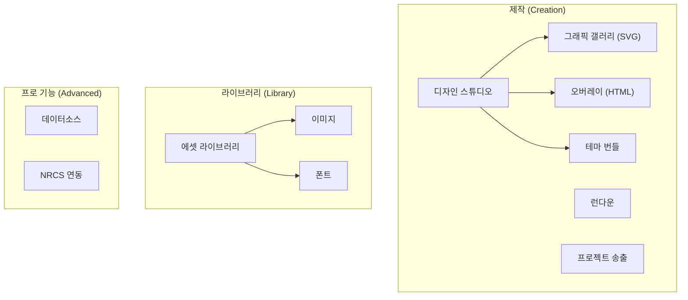
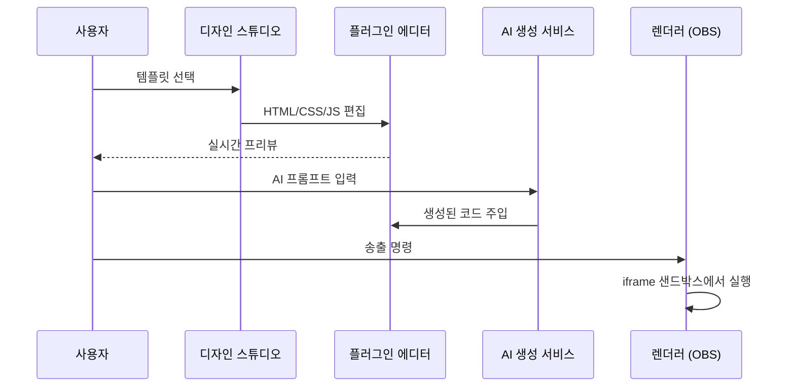

# WebCG-K 방송 그래픽 시스템 — 학습 가이드

> **HTML/CSS/JS로 만든 방송 그래픽을, AI로 생성하고, 타임라인에 배치하고, 실시간으로 송출하는 시스템**

---

## 전체 개발 순서 (10단계)

```mermaid
flowchart LR
    P0["Phase 0<br/>데이터 모델링"] --> P1["Phase 1<br/>렌더러"]
    P1 --> P2["Phase 2<br/>플러그인 에디터"]
    P2 --> P3["Phase 3<br/>대시보드 + Schema Editor"]
    P3 --> P4["Phase 4<br/>AI 코드 생성"]
    P4 --> P5["Phase 5<br/>테마/번들/Replicant"]
    P5 --> P6["Phase 6<br/>Controller + Playout"]
    P6 --> P7["Phase 7<br/>세션/타임라인/멀티트랙"]
    P7 --> P8["Phase 8<br/>AI 큐시트 (Cue Sheet)"]
    P8 --> P9["Phase 9<br/>Workspace + 멀티테넌트"]
```

| 단계 | 주제 | 핵심 결과물 |
|------|------|------------|
| **Phase 0** | 데이터 모델링 | `overlay_templates` 스키마, TypeScript 타입, `semanticRoleDefs` |
| **Phase 1** | 렌더러 | OBS 브라우저 소스용 iframe 렌더러, ACK/Heartbeat 프로토콜 |
| **Phase 2** | 플러그인 에디터 | Monaco 에디터 3-tab, 실시간 프리뷰, 시각 편집 브릿지 |
| **Phase 3** | 대시보드 + Schema Editor | JSON Schema 기반 자동 폼 생성, DashboardField |
| **Phase 4** | AI 코드 생성 | `aiOverlayService.ts`, Grid-aware prompting, Zone injection |
| **Phase 5** | 테마/번들/Replicant | `template_bundles`, 디자인 토큰, Realtime 데이터 바인딩 |
| **Phase 6** | Controller + Playout | 멀티트랙 송출, fade-in/out, PVW/PGM 전환 |
| **Phase 7** | 세션/타임라인/멀티트랙 | `broadcast_sessions`, playhead 상태, undo stack |
| **Phase 8** | AI 큐시트 | 5-step state machine, Scene review, Session persistence |
| **Phase 9** | Workspace + 멀티테넌트 | Workspace RLS, 멤버 초대, 역할 기반 접근 |

---

## 핵심 설계 원칙

### Output First, Edit Second, Automate Third, Multi-tenant Last

1. **Output First (Phase 1)** — 무엇보다 그래픽을 화면에 띄우는 것이 우선이다. 렌더러를 가장 먼저 만들어 OBS 브라우저 소스에서 CG가 표시되는 경로를 확보한다.

2. **Edit Second (Phase 2-3)** — 출력이 확인된 후에야 편집 도구를 만든다. 에디터가 없으면 템플릿 수정이 불가능하므로, 렌더러 다음으로 플러그인 에디터와 대시보드 입력 폼을 개발한다.

3. **Automate Third (Phase 4-5, 8)** — 편집이 가능해지면 AI 기반 자동 생성을 도입한다. 수동 편집 경험이 먼저 쌓여야 AI 생성 결과물의 품질을 평가할 수 있다.

4. **Multi-tenant Last (Phase 9)** — 협업과 워크스페이스는 모든 기능이 안정화된 후에 추가한다. 싱글 테넌트에서 검증되지 않은 기능을 멀티테넌트로 확장하면 버그 추적이 어렵다.

---

## 3-Tier 애플리케이션 아키텍처

시스템은 "제작(Creation) -> 관리(Library) -> 프로 기능(Advanced)"의 3개 계층으로 구성된다.

### 각 계층의 역할

- **Creation (제작 계층)**: 디자인 스튜디오에서 템플릿을 만들고, 런다운에서 송출 목록을 구성하며, 프로젝트 송출에서 실제 방송을 실행한다. 이 계층이 시스템의 핵심 워크플로우를 담당한다.
- **Library (라이브러리 계층)**: 이미지, 폰트 등 공통 에셋을 중앙 관리한다. 모든 템플릿이 이 계층의 리소스를 참조할 수 있다.
- **Advanced (프로 기능 계층)**: 외부 데이터소스 연동, NRCS(Newsroom Computer System) 연동 등 고급 기능을 제공한다. Pro Mode에서만 노출된다.

### 데이터 흐름

---

## 문서 목록

| 파일 | 내용 |
|------|------|
| [00-data-model.md](./00-data-model.md) | Phase 0: 데이터 모델링 — `overlay_templates` 스키마, 타입 시스템, 설계 결정 |
| [01-renderer.md](./01-renderer.md) | Phase 1: 렌더러 — iframe + srcdoc 아키텍처, ACK/Heartbeat 프로토콜 |
| [02-plugin-editor.md](./02-plugin-editor.md) | Phase 2: 플러그인 에디터 — Monaco 통합, 실시간 프리뷰, 시각 편집 |
| (준비 중) | Phase 3-5: 대시보드/AI 생성/테마 |
| (준비 중) | Phase 6-7: Controller/세션 관리 |
| (준비 중) | Phase 8-9: AI 큐시트/워크스페이스 |
