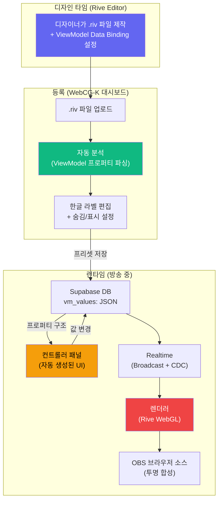
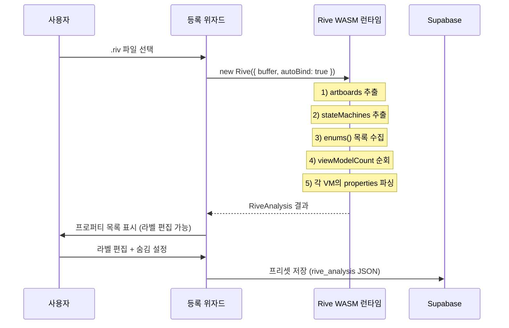
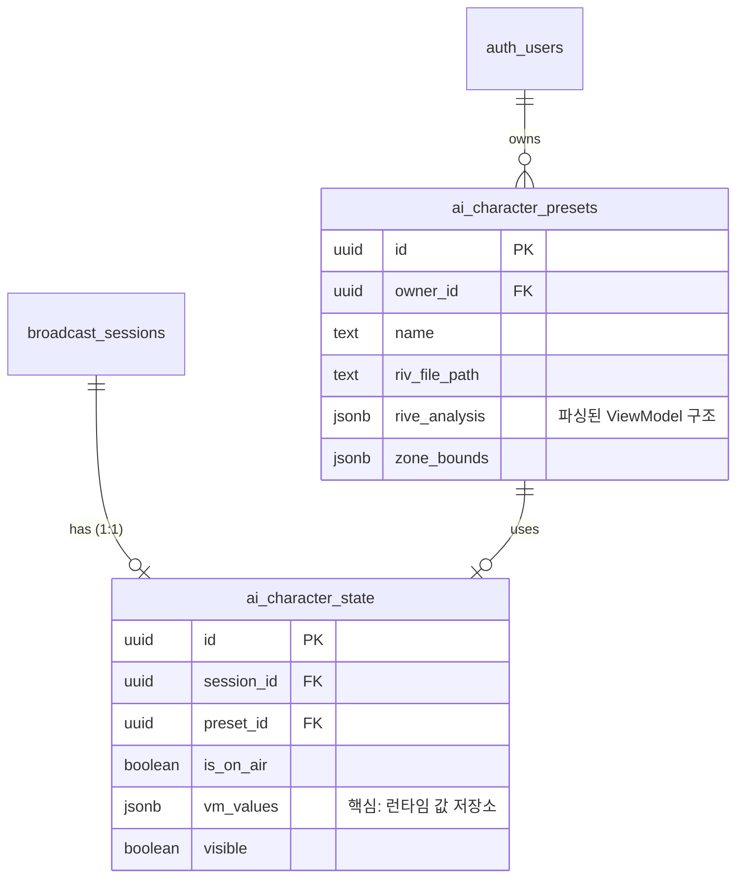

# WebCG-K × Rive 통합 가이드

> Rive Data Binding(ViewModel)을 활용한 **범용 실시간 인터랙티브 그래픽** 시스템의 아키텍처, 데이터 흐름, 컨트롤러 자동 생성 규칙을 정리한 문서입니다.

> [!IMPORTANT]
> **이 문서의 핵심 전제:** WebCG-K는 `.riv` 파일을 업로드하면 내부의 ViewModel 프로퍼티를 **자동 파싱**하고, 프로퍼티 타입(number, string, boolean, enum, trigger, color)에 따라 **적절한 조작 UI를 자동 생성**합니다. 디자이너가 Rive Editor에서 Data Binding을 설정하는 것만으로, 개발자 개입 없이 컨트롤러가 완성됩니다.

## 목차

1. [Rive란? — 왜 WebCG-K에 필수인가](#1-rive란--왜-webcg-k에-필수인가)
2. [핵심 아키텍처: Data Binding 기반 범용 파이프라인](#2-핵심-아키텍처-data-binding-기반-범용-파이프라인)
3. [Rive Editor의 두 가지 제어 방식](#3-rive-editor의-두-가지-제어-방식)
4. [Data Binding (ViewModel) 심화](#4-data-binding-viewmodel-심화)
5. [.riv 파일 자동 분석 파이프라인](#5-riv-파일-자동-분석-파이프라인)
6. [프로퍼티 타입 → 컨트롤러 UI 자동 매핑 규칙](#6-프로퍼티-타입--컨트롤러-ui-자동-매핑-규칙)
7. [Use Case: 스포츠 점수판](#7-use-case-스포츠-점수판)
8. [Use Case: 인터랙티브 캐릭터](#8-use-case-인터랙티브-캐릭터)
9. [Use Case: 선거 개표 인포그래픽](#9-use-case-선거-개표-인포그래픽)
10. [데이터베이스 스키마](#10-데이터베이스-스키마)
11. [코드 구조 — 3계층 아키텍처](#11-코드-구조--3계층-아키텍처)
12. [실시간 동기화 (Realtime)](#12-실시간-동기화-realtime)
13. [OBS 투명 합성](#13-obs-투명-합성)
14. [트러블슈팅](#14-트러블슈팅)

---

## 1. Rive란? — 왜 WebCG-K에 필수인가

[Rive](https://rive.app)는 벡터 기반 실시간 인터랙티브 애니메이션 엔진입니다. 방송 CG에 Rive가 필수인 이유는 **Data Binding** 때문입니다.

### Lottie vs Rive: 핵심 차이

| 특성 | Lottie | Rive |
|------|--------|------|
| **제어 방식** | 타임라인 재생만 | **Data Binding + State Machine** |
| **실시간 값 변경** | ❌ (재렌더 필요) | ✅ (코드에서 값만 바꾸면 즉시 반영) |
| **런타임 크기** | ~150KB | ~60KB |
| **투명 배경** | ✅ | ✅ (WebGL Canvas) |
| **방송 활용** | 고정 애니메이션 재생 | **실시간 점수, 이름, 상태 변경** |

### 비유로 이해하기

> **Lottie** = "구워진 비디오" — 한 번 만들면 내용을 못 바꿈
> **Rive** = "엑셀 시트가 내장된 그래픽" — 셀 값만 바꾸면 디자인이 실시간으로 변함

WebCG-K에서 사용 중인 패키지:

```bash
# 이미 설치됨 — WebGL2 렌더러 (알파채널 지원)
"@rive-app/react-webgl2": "^4.26.2"
```

---

## 2. 핵심 아키텍처: Data Binding 기반 범용 파이프라인



### 핵심 원리: "파싱 → 매핑 → 바인딩" 3단계

```
① 파싱 (Parse):  .riv 업로드 → Rive WASM 런타임이 ViewModel 구조 추출
                   → { name: "homeScore", type: "number" } 등

② 매핑 (Map):    프로퍼티 타입에 따라 컨트롤러 UI를 자동 결정
                   number → 슬라이더 + 숫자입력
                   string → 텍스트 입력 + 전송 버튼
                   boolean → 토글 스위치
                   enum → 드롭다운
                   trigger → 버튼
                   color → 컬러 피커

③ 바인딩 (Bind):  컨트롤러에서 값 변경 → DB 저장 → Realtime 전파
                   → 렌더러에서 vmi.number("homeScore").value = 3
                   → Rive 애니메이션 즉시 반영
```

---

## 3. Rive Editor의 두 가지 제어 방식

Rive에는 **State Machine Input**과 **Data Binding(ViewModel)** 두 가지 외부 제어 방식이 있습니다.

### 비교 매트릭스

| | State Machine Input | Data Binding (ViewModel) |
|---|---|---|
| **정의 위치** | State Machine 내부 | ViewModel (별도 객체) |
| **지원 타입** | Number, Boolean, Trigger (3종) | Number, String, Boolean, Color, Enum, Trigger, List, Image (8종) |
| **데이터 양방향** | ❌ (코드→Rive 단방향) | ✅ (양방향 가능) |
| **중첩 객체** | ❌ | ✅ (List<ViewModel> 지원) |
| **텍스트 바인딩** | ❌ (불가) | ✅ (String → Text Run 직접 연결) |
| **WebCG-K 채택** | ❌ 폐기 | ✅ **현재 사용** |

> [!CAUTION]
> **WebCG-K v4.26+ 기준으로 State Machine Input 방식은 레거시로 폐기되었습니다.**
> 
> State Machine Input은 Number/Boolean/Trigger 3종만 지원하여 텍스트(이름, 점수판 글자)를 전혀 제어할 수 없습니다. WebCG-K는 **ViewModel Data Binding만 사용**합니다.

### Why Data Binding을 선택했는가

```
문제: 스포츠 점수판에서 "팀 이름"을 변경하고 싶다
  → State Machine Input: Number/Boolean/Trigger만 있음 → 텍스트 변경 불가 ❌
  → Data Binding: String 프로퍼티 → Text Run에 직접 바인딩 → "롯데" → "두산" 즉시 변경 ✅

문제: 선수 명단 5명의 이름/등번호를 동적으로 변경하고 싶다
  → State Machine Input: 구조적 데이터 표현 불가 → 프로퍼티 10개를 따로 만들어야 함 ❌ 
  → Data Binding: List<PlayerViewModel> → 프로그래밍적으로 추가/삭제/수정 가능 ✅
```

---

## 4. Data Binding (ViewModel) 심화

### 4.1. Rive Editor에서의 설정

Rive Editor에서 ViewModel을 생성하면, 아트보드의 요소(텍스트, 색상, 위치 등)에 프로퍼티를 **바인딩(연결)**할 수 있습니다.

```
Rive Editor 구조:

ViewModel: "Scoreboard"
├── homeTeam    (String)     → Text Run "홈팀 이름"에 바인딩
├── awayTeam    (String)     → Text Run "어웨이팀 이름"에 바인딩
├── homeScore   (Number)     → Text Run "홈팀 점수"에 바인딩
├── awayScore   (Number)     → Text Run "어웨이팀 점수"에 바인딩
├── period      (Enum)       → Solo 전환 (1Q/2Q/3Q/4Q)에 바인딩
├── isLive      (Boolean)    → "LIVE" 배지 표시/숨김에 바인딩
├── teamColor   (Color)      → 팀 로고 배경색에 바인딩
└── celebrate   (Trigger)    → 골 세레모니 애니메이션 실행에 바인딩
```

### 4.2. 런타임에서의 접근 (WebCG-K 코드)

```typescript
// ① Rive 인스턴스 생성 (autoBind: true가 핵심)
const { rive, RiveComponent } = useRive({
    src: rivUrl,
    stateMachines: "Motion",  // State Machine 이름
    autoplay: true,
    autoBind: true,            // ← ViewModel 자동 바인딩!
});

// ② ViewModel Instance(VMI) 접근
const vmi = rive.viewModelInstance;

// ③ 타입별 프로퍼티 접근 & 값 설정
vmi.number("homeScore").value = 3;          // 숫자 변경
vmi.string("homeTeam").value = "롯데";      // 텍스트 변경
vmi.boolean("isLive").value = true;         // 토글
vmi.trigger("celebrate").trigger();         // 트리거 발동
```

### 4.3. WebCG-K의 범용 바인딩 엔진 (RiveRenderer)

WebCG-K는 프로퍼티 이름과 타입을 **하드코딩하지 않습니다.** DB에 저장된 `vm_values` JSON 객체의 key-value를 순회하면서, 값의 JavaScript 타입에 따라 자동으로 적절한 VMI 메서드를 호출합니다:

```typescript
// AiCharacterLayer.tsx 내부 — 범용 바인딩 엔진 (핵심 로직)
for (const [key, value] of Object.entries(vmValues)) {
    if (typeof value === "string" && value.startsWith("__trigger__")) {
        // trigger 시그널: "__trigger__1713500000000" 형태
        const prop = vmi.trigger(key);
        if (prop) prop.trigger();
    } else if (typeof value === "boolean") {
        const prop = vmi.boolean(key);
        if (prop) prop.value = value;
    } else if (typeof value === "number") {
        const prop = vmi.number(key);
        if (prop) prop.value = value;
    } else if (typeof value === "string") {
        const prop = vmi.string(key);
        if (prop) prop.value = value;
    }
}
```

> [!TIP]
> **이것이 "범용"의 핵심입니다.** 이 코드는 스포츠 점수판이든, 캐릭터든, 선거 개표든 **어떤 .riv 파일이든 동일하게 작동**합니다. `.riv 파일의 ViewModel 구조만 바꾸면` 컨트롤러와 렌더러가 자동으로 해당 구조에 맞춰집니다.

---

## 5. .riv 파일 자동 분석 파이프라인

### 5.1. 분석 흐름

`.riv` 파일을 대시보드에 업로드하면, **클라이언트 측에서 Rive WASM 런타임으로 직접 분석**합니다:



### 5.2. 분석 결과 구조 (RiveAnalysis)

```typescript
interface RiveAnalysis {
    artboards: string[];                // 아트보드 목록
    artboardSize?: {                    // 기본 아트보드 크기 (비율 비교용)
        width: number;
        height: number;
    };
    stateMachines: string[];            // 상태 머신 이름 목록
    viewModels: RiveViewModelInfo[];    // 모든 ViewModel 분석 결과
    viewModelName: string | null;       // 기본 ViewModel 이름
    properties: RivePropertyInfo[];     // 모든 프로퍼티 (flat, 하위 호환)
    analyzedAt: string;                 // 분석 시각
}

interface RivePropertyInfo {
    name: string;            // Rive에서 정의한 프로퍼티 이름
    type: RivePropertyType;  // "string"|"number"|"boolean"|"color"|"trigger"|"enum"|"list"|"image"
    label?: string;          // 한글 라벨 (컨트롤러 UI에 표시)
    hidden?: boolean;        // true면 컨트롤러에서 숨김
    order?: number;          // 정렬 순서
    enumValues?: string[];   // enum일 때 선택 가능한 값 목록
    viewModelRef?: string;   // list일 때 항목의 ViewModel 이름
}
```

### 5.3. 프로퍼티 타입 숫자 매핑 (WASM 내부)

Rive WASM 런타임은 프로퍼티 타입을 정수로 반환합니다:

| 정수 | 타입 | 설명 |
|------|------|------|
| 1 | `string` | 텍스트 (이름, 메시지 등) |
| 2 | `number` | 숫자 (점수, 좌표, 크기 등) |
| 3 | `boolean` | ON/OFF (표시, 숨김 등) |
| 4 | `color` | 색상 (0xAARRGGBB 형식) |
| 5 | `list` | ViewModel 목록 (선수 명단 등) |
| 6 | `enum` | 열거형 (쿼터, 세트 등) |
| 7 | `trigger` | 이벤트 발동 (세레모니, 전환 등) |

---

## 6. 프로퍼티 타입 → 컨트롤러 UI 자동 매핑 규칙

**이것이 WebCG-K Rive 시스템의 가장 핵심적인 설계입니다.**

`.riv` 파일에서 파싱된 프로퍼티 타입에 따라, 컨트롤러 패널(`AiCharacterPanel`)이 자동으로 적절한 조작 UI를 생성합니다:

### 타입별 자동 생성 UI

| 타입 | 아이콘 | 생성되는 UI | 용도 예시 |
|------|--------|-----------|----------|
| `trigger` | ⚡ | **버튼** (클릭 시 fire) | 골 세레모니, 효과 발동 |
| `string` | 💬 | **텍스트 입력 + 전송 버튼** | 팀 이름, 선수 이름, 메시지 |
| `number` | 🔢 | **슬라이더 + 숫자 직접 입력** | 점수, 시간, 좌표, 크기 |
| `boolean` | 🔘 | **토글 스위치** (ON/OFF) | LIVE 배지, 하프타임 표시 |
| `enum` | 📋 | **드롭다운 선택** | 쿼터(1Q/2Q/3Q/4Q), 세트 |
| `color` | 🎨 | **컬러 피커 + HEX 표시** | 팀 컬러, 배경색 |
| `list` | 📑 | *(향후 구현)* 동적 리스트 | 선수 명단, 순위표 |
| `image` | 🖼️ | *(향후 구현)* 이미지 업로더 | 팀 로고, 선수 사진 |

### 동작 상세

```
사용자가 컨트롤러에서 값을 변경하면:

┌─────────────────────────────────────────────────────────────────┐
│  컨트롤러 UI                                                     │
│                                                                 │
│  🔢 홈팀 점수 ───[━━━━━━━●━━]─── [  3  ]                        │
│                                   ↑ 슬라이더를 3으로 드래그      │
│                                                                 │
│  1. updateVmValue("homeScore", 3)                               │
│  2. vm_values = { ...prev, homeScore: 3 }                       │
│  3. DB UPDATE (optimistic + Supabase)                           │
│  4. Realtime → 렌더러 수신                                      │
│  5. vmi.number("homeScore").value = 3                           │
│  6. Rive 애니메이션 즉시 반영 (점수판 "3" 표시)                  │
│                                                                 │
│  전체 지연: ~100-200ms (debounce + Supabase RTT)                │
└─────────────────────────────────────────────────────────────────┘
```

### Trigger 타입의 특수 처리

Trigger는 "값"이 아니라 "이벤트"이므로 특수한 시그널 방식을 사용합니다:

```typescript
// 컨트롤러: 클릭 시 타임스탬프 시그널 생성
onFire(`__trigger__${Date.now()}`);  
// → vm_values = { celebrate: "__trigger__1713500000000" }

// 렌더러: 이전 값과 다르면 trigger 실행 (중복 방지)
if (value.startsWith("__trigger__") && prevValues[key] !== value) {
    vmi.trigger(key).trigger();  // Rive 애니메이션 발동!
}
```

---

## 7. Use Case: 스포츠 점수판

### Rive Editor 설정

```
ViewModel: "Scoreboard"
├── homeTeam     (String)   → 라벨: "홈팀 이름"
├── awayTeam     (String)   → 라벨: "어웨이팀 이름"
├── homeScore    (Number)   → 라벨: "홈팀 점수"
├── awayScore    (Number)   → 라벨: "어웨이팀 점수"
├── period       (Enum)     → 라벨: "쿼터" / values: ["1Q","2Q","3Q","4Q","OT"]
├── gameTime     (String)   → 라벨: "경기 시간"
├── isLive       (Boolean)  → 라벨: "LIVE 표시"
├── homeColor    (Color)    → 라벨: "홈팀 컬러"
├── awayColor    (Color)    → 라벨: "어웨이팀 컬러"
└── goalEffect   (Trigger)  → 라벨: "골 이펙트"
```

### 자동 생성되는 컨트롤러 UI

```
┌─────────────────────────────────────────┐
│ 💬 홈팀 이름     [  롯데 자이언츠  ] [전송] │
│ 💬 어웨이팀 이름  [  두산 베어스   ] [전송] │
│ 🔢 홈팀 점수     [━━━●━━━] [ 3 ]         │
│ 🔢 어웨이팀 점수  [━●━━━━━] [ 1 ]         │
│ 📋 쿼터          [▼ 3Q          ]         │
│ 💬 경기 시간     [  07:23  ] [전송]       │
│ 🔘 LIVE 표시     [●━━] ON                │
│ 🎨 홈팀 컬러     [■] #EF4444             │
│ 🎨 어웨이팀 컬러  [■] #3B82F6             │
│ ⚡ 골 이펙트     [ ⚡ 골 이펙트 ]          │
└─────────────────────────────────────────┘
```

### 워크플로우

```
1. 디자이너: Rive Editor에서 점수판 디자인 + ViewModel 바인딩
2. 업로드:   WebCG-K 대시보드에 .riv 파일 등록 → 자동 분석
3. 라벨링:   "homeScore" → "홈팀 점수" 한글 라벨 설정
4. 방송:     컨트롤러에서 슬라이더/입력창으로 실시간 조작
5. 송출:     OBS 브라우저 소스로 투명 합성
```

---

## 8. Use Case: 인터랙티브 캐릭터

### Rive Editor 설정

```
ViewModel: "Character"
├── expression   (Number)   → 라벨: "표정" / 0~5 매핑 (neutral~wink)
├── moveX        (Number)   → 라벨: "이동 방향" / -1, 0, 1
├── scale        (Number)   → 라벨: "크기" / 0.3~3.0
├── isTalking    (Boolean)  → 라벨: "말하기"
├── skinIndex    (Number)   → 라벨: "스킨" / Solo 인덱스
├── wave         (Trigger)  → 라벨: "손 흔들기"
└── visible      (Boolean)  → 라벨: "표시" / hidden: true (컨트롤러 숨김)
```

### 자동 생성되는 컨트롤러 UI

```
┌─────────────────────────────────────────┐
│ 🔢 표정         [━━━●━━━] [ 2 ]         │  ← 0=neutral, 2=surprised
│ 🔢 이동 방향    [━━━●━━━] [ 0 ]         │  ← -1=좌, 0=정지, 1=우
│ 🔢 크기         [━━━●━━━] [ 1.0 ]       │
│ 🔘 말하기       [━━●] ON                │
│ 🔢 스킨         [━━━●━━━] [ 0 ]         │  ← Solo 인덱스 전환
│ ⚡ 손 흔들기    [ ⚡ 손 흔들기 ]          │
│                                         │
│ (visible은 hidden=true → UI에 안 뜸)     │
└─────────────────────────────────────────┘
```

### Skin 전환 (Solo + Data Binding)

Rive의 **Solo** 기능으로 여러 스킨을 하나의 `.riv` 파일에 넣고, Number 프로퍼티로 전환할 수 있습니다:

```typescript
// Rive Editor에서 Solo에 Data Binding Number를 바인딩하면,
// WebCG-K 컨트롤러의 슬라이더로 스킨을 즉시 전환:
vmi.number("skinIndex").value = 2;  // 3번째 스킨으로 전환

// Rive 내부에서 Modulo Converter를 사용하면 자동 순환:
// skinIndex % totalSkins → 해당 인덱스의 Solo 활성화
```

> [!TIP]
> **스킨이 많으면(10+)** Solo 대신 [Data Bound Artboards](https://rive.app/docs/runtimes/data-binding#artboards)를 사용하여 런타임에 스킨을 로드하는 것이 메모리 효율적입니다.

---

## 9. Use Case: 선거 개표 인포그래픽

### Rive Editor 설정

```
ViewModel: "ElectionResult"
├── candidateA   (String)   → 라벨: "후보 A 이름"
├── candidateB   (String)   → 라벨: "후보 B 이름"
├── votesA       (Number)   → 라벨: "A 득표수"
├── votesB       (Number)   → 라벨: "B 득표수"
├── progressPct  (Number)   → 라벨: "개표율 (%)"
├── districtName (String)   → 라벨: "선거구"
├── colorA       (Color)    → 라벨: "A 컬러"
├── colorB       (Color)    → 라벨: "B 컬러"
├── isConfirmed  (Boolean)  → 라벨: "당선 확정"
└── announce     (Trigger)  → 라벨: "당선 이펙트"
```

→ `.riv`를 업로드하면, 위 10개 프로퍼티에 대해 적절한 슬라이더/입력창/컬러피커가 자동으로 생성됩니다.

---

## 10. 데이터베이스 스키마

### `ai_character_presets` — Rive 프리셋 (범용)

> **Why "ai_character" 이름인가?** 최초 AI 캐릭터 시스템으로 시작했으나, Data Binding 기반 범용 파이프라인으로 진화. 네이밍은 레거시이나 기능은 범용.

```sql
CREATE TABLE public.ai_character_presets (
  id UUID PRIMARY KEY DEFAULT gen_random_uuid(),
  owner_id UUID REFERENCES auth.users(id) ON DELETE CASCADE NOT NULL,
  name TEXT NOT NULL,                      -- 프리셋 이름 (예: "야구 점수판", "뉴스 캐릭터")
  description TEXT,                        -- 설명
  riv_file_path TEXT NOT NULL,             -- Supabase Storage 경로
  rive_analysis JSONB,                     -- .riv 파일 분석 결과 (RiveAnalysis JSON)
  action_mappings JSONB DEFAULT '[]',      -- 레거시 호환
  grid_template_id UUID,                   -- Zone 배치용 그리드 참조
  zone_bounds JSONB,                       -- 배치 영역 {x, y, width, height}
  created_at TIMESTAMPTZ DEFAULT now()
);
```

### `ai_character_state` — 세션별 라이브 상태

```sql
CREATE TABLE public.ai_character_state (
  id UUID PRIMARY KEY DEFAULT gen_random_uuid(),
  session_id UUID REFERENCES broadcast_sessions(id) ON DELETE CASCADE NOT NULL,
  preset_id UUID REFERENCES ai_character_presets(id),
  is_on_air BOOLEAN DEFAULT false,         -- PVW(false) / PGM(true)
  vm_values JSONB DEFAULT '{}',            -- ViewModel 프로퍼티 현재값 (핵심!)
  visible BOOLEAN DEFAULT false,
  updated_at TIMESTAMPTZ DEFAULT now(),
  UNIQUE(session_id)
);
```

### `vm_values`의 구조

```jsonc
// 스포츠 점수판 예시
{
  "homeTeam": "롯데 자이언츠",
  "awayTeam": "두산 베어스",
  "homeScore": 3,
  "awayScore": 1,
  "period": "3Q",
  "isLive": true,
  "homeColor": 4293918720,   // 0xFF_EF4444 (ARGB)
  "goalEffect": "__trigger__1713500000000"
}
```

### ERD



---

## 11. 코드 구조 — 3계층 아키텍처

### 파일 트리

```
webcg-k/src/
├── lib/
│   └── aiCharacterTypes.ts               # 타입 정의 (RiveAnalysis, PropertyInfo 등)
├── types/
│   └── rive-webgl2.d.ts                  # @rive-app/react-webgl2 타입 보강
├── components/
│   ├── Controller/
│   │   ├── AiCharacterPanel.tsx           # 🎮 컨트롤러 패널 (자동 UI 생성)
│   │   └── AiCharacterLayer.tsx           # 🎬 렌더러 레이어 (범용 바인딩 엔진)
│   └── Characters/
│       └── CharacterWizardModal.tsx        # 📋 등록 위자드 (.riv 분석 + 라벨 편집)
├── routes/
│   ├── controller/$sessionId.tsx          # 컨트롤러 (AI 캐릭터 탭 포함)
│   ├── render/$sessionId.tsx              # 최종 렌더러 (투명 합성)
│   └── dashboard/characters.tsx           # 대시보드 (프리셋 관리)
└── styles.css                             # CSS (.ai-char-* 섹션)
```

### 3계층 책임 분리

```
┌─────────────────────────────────────────────────────────────┐
│  계층 1: 위자드 (CharacterWizardModal)                       │
│  책임: .riv 파일 분석 + ViewModel 구조 파싱 + 프리셋 저장     │
│  트리거: 사용자가 .riv 파일을 업로드할 때                     │
├─────────────────────────────────────────────────────────────┤
│  계층 2: 컨트롤러 (AiCharacterPanel)                         │
│  책임: 프로퍼티 타입에 따른 자동 UI 생성 + VM 값 변경 + DB 동기│
│  입력: rive_analysis.properties → PropertyControl 자동 렌더  │
│  출력: vm_values JSON → DB UPDATE + Broadcast                │
├─────────────────────────────────────────────────────────────┤
│  계층 3: 렌더러 (AiCharacterLayer → RiveRenderer)            │
│  책임: vm_values를 VMI에 적용 + Rive 캔버스 렌더링            │
│  입력: DB/Realtime → vm_values JSON                          │
│  출력: Rive WebGL Canvas (투명 합성)                          │
└─────────────────────────────────────────────────────────────┘
```

---

## 12. 실시간 동기화 (Realtime)

### 채널 구성

| 채널 | 이벤트 | 흐름 |
|------|--------|------|
| `ai-char-sync:{sessionId}` Broadcast | `state-change` | Panel → 렌더러 (같은/다른 페이지) |
| `ai-char-sync:{sessionId}` Broadcast | `rive-command` | Play/Pause/Reset 커맨드 |
| `ai-char-db:{sessionId}` CDC | `UPDATE ai_character_state` | DB → 렌더러 (Broadcast 실패 백업) |
| CustomEvent `ai-character-state-change` | | 같은 페이지 Panel → Layer 직접 전달 |

### 동기화 흐름

```
컨트롤러 값 변경
    ↓
① Optimistic: 로컬 상태 즉시 갱신
② CustomEvent: 같은 페이지의 PVW Layer에 즉시 전달
③ Broadcast: 다른 페이지의 렌더러에 Supabase Broadcast
④ DB UPDATE: Supabase 영속화
⑤ CDC: DB 변경 → postgres_changes → 렌더러 (백업 경로)
```

### 지연 시간

| 경로 | 예상 지연 |
|------|----------|
| 컨트롤러 → 로컬 PVW | **즉시** (CustomEvent) |
| 컨트롤러 → 렌더러 (Broadcast) | **~100-200ms** |
| 컨트롤러 → 렌더러 (CDC 백업) | **~200-500ms** |

---

## 13. OBS 투명 합성

### 원리

Rive WebGL 캔버스는 알파 채널을 기본 지원합니다. OBS 브라우저 소스에서 크로마키 없이 투명 합성이 가능합니다.

### OBS 설정

1. **소스 추가** → 브라우저
2. **URL**: `http://localhost:3000/render/{sessionId}?resolution=1080p`
3. **너비/높이**: 1920×1080
4. **CSS**: 비워두기

### 레이어 순서

```
z-index 순서 (아래 → 위):
1. 타임라인 블록 (trackId 기반)
2. OverlayPlayoutLayer (오버레이)
3. AiCharacterLayer (Rive 그래픽, z-index: 100)
```

---

## 14. 트러블슈팅

### .riv 파일 분석에서 ViewModel이 감지 안 될 때

1. Rive Editor에서 ViewModel을 만들었는지 확인
2. ViewModel을 아트보드에 **바인딩**했는지 확인 (Create 만 하면 안 됨)
3. `.riv` 파일을 **최신 포맷으로 내보내기** (Rive Editor File → Download)
4. 브라우저 콘솔에서 `[RivAnalyzer]` 로그 확인

### Rive 그래픽이 표시 안 될 때

1. `visible`이 `true`인지 확인
2. `preset_id`가 설정되어 있는지 확인
3. Supabase Storage에 `.riv` 파일이 업로드되어 있는지 확인
4. 브라우저 콘솔에서 `[RiveRenderer]` 또는 `[AiCharacterLayer]` 에러 확인

### 컨트롤러에서 값이 반영 안 될 때

1. **프로퍼티 이름이 대소문자까지 정확히 일치**하는지 확인 (Rive Editor ↔ WebCG-K)
2. 브라우저 콘솔에서 `[RiveRenderer] 프로퍼티 ${key} 적용 실패` 경고 확인
3. `autoBind: true`가 설정되어 있는지 확인
4. `vmi`(ViewModel Instance)가 준비되었는지 확인 (초기 100ms 대기)

### State Machine이 동작하지 않을 때

1. `stateMachines` 이름이 Rive Editor의 State Machine 이름과 일치하는지 확인
2. 기본값은 프리셋의 `rive_analysis.stateMachines[0]` → fallback `"Motion"`

### DB 마이그레이션 에러

```bash
cd supabase && npx -y supabase db reset
```

### Rive 로딩 실패 (CORS)

```sql
-- Supabase Storage 'characters' 버킷이 public인지 확인
SELECT * FROM storage.buckets WHERE id = 'characters';
-- public 컬럼이 true여야 함
```

---

## 부록: 관련 파일 참조

| 파일 | 경로 | 역할 |
|------|------|------|
| 타입 정의 | `src/lib/aiCharacterTypes.ts` | RiveAnalysis, PropertyInfo 등 |
| Rive 타입 보강 | `src/types/rive-webgl2.d.ts` | useViewModel 등 훅 타입 선언 |
| 렌더러 레이어 | `src/components/Controller/AiCharacterLayer.tsx` | 범용 바인딩 엔진 |
| 컨트롤러 패널 | `src/components/Controller/AiCharacterPanel.tsx` | 자동 UI 생성 |
| 등록 위자드 | `src/components/Characters/CharacterWizardModal.tsx` | .riv 분석 + 라벨 편집 |
| 프리셋 대시보드 | `src/routes/dashboard/characters.tsx` | 프리셋 관리 |
| DB 마이그레이션 | `supabase/migrations/202602130002_ai_character.sql` | 스키마 |
| CSS | `src/styles.css` (`.ai-char-*` 섹션) | 스타일 |

---

> **문서 관리 정보**
> - **v1** (2026-02): AI 캐릭터 특화 (State Machine Input 기반, 말풍선/키보드)
> - **v2** (2026-04-19): Data Binding 기반 범용 가이드로 전면 재작성
>   - State Machine Input 폐기 → ViewModel Data Binding 전환
>   - AI 캐릭터 한정 → 스포츠 점수판/인포그래픽 등 범용 시나리오
>   - "파싱 → 매핑 → 바인딩" 3단계 파이프라인 문서화
